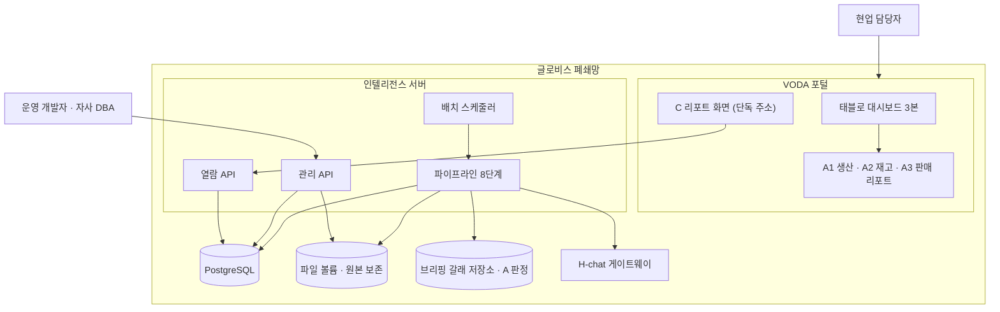

# 인프라 아키텍처

## 0. 이 문서가 다루는 것

C 리포트(종합, 과업지시의 "인텔리전스 서비스 개요")를 만들고 보여 주는 시스템이 어디서 어떻게 도는지를 정한다. 리포트 이름은 [[TBL-UC-001]] 0절을 따른다. A1 생산·A2 재고·A3 판매는 대시보드에 붙는 리포트로 브리핑 갈래가 만들고, 이 문서의 시스템은 그 판정값(A 판정)을 읽어 C 리포트 한 본을 만든다.

다루는 것은 배포 단위, 기술 스택, 데이터가 사는 곳, 인증, 배치 운영이다. 다루지 않는 것은 A 리포트를 만드는 브리핑 갈래의 인프라와 태블로 서버다. 둘 다 이미 있는 것으로 본다.

## 1. 제약

#### C1 폐쇄망 안에서만 돈다

사내망에 반입해 설치하고 바깥으로 나가는 호출을 하지 않는다. 기사 원문은 사용자의 브라우저가 연다. 출처: [[TBL-PRD-001#N1]]

#### C2 LLM은 사내 H-chat 게이트웨이만 쓴다

OpenAI 호환 규격이라 같은 클라이언트 코드로 외부 개발 환경에서는 OpenAI를, 폐쇄망에서는 H-chat을 가리킨다. 출처: [[TBL-RFQ-001#Q29]]

#### C3 H-chat 키는 코드·문서·저장소에 적지 않는다

환경변수로 주입하고 컨테이너 밖으로 내보내지 않는다. 로그에도 남기지 않는다. 출처: [[TBL-RFQ-001#Q30]]

#### C4 LLM은 배치에서 세 번만 쓴다

사건 명명, 연관 판단, 문장 생성이다. 열람 경로에는 LLM이 없다. 출처: [[TBL-UC-001#UC-S1]]

#### C5 A 판정은 읽기만 한다

브리핑 갈래 저장소의 스냅샷 판정과 내부 분해 결과를 도메인·국가·일자 키로 읽어 온다. 쓰지 않는다. 출처: [[TBL-UC-001#UC-S10]]

#### C6 데이터는 파일로 들어온다

완성차·뉴스·블룸버그·Marklines가 수작업 파일로 전달된다. 자동 연계는 아직 없다. 출처: [[TBL-PRD-001#R1]]

#### C7 원본 파일을 보존한다

적재 후에도 받은 파일 그대로 볼륨에 남긴다. 출처: [[TBL-PRD-001#N7]]

#### C8 배치는 하루 한 번, 4시간 창 안에 끝난다

02시에 시작하고 A 리포트 배치가 그 전에 끝나 있어야 한다. 출처: [[TBL-PRD-001#N6]]

#### C9 열람은 2초 안에 끝난다

게시된 리포트를 읽기만 하고 집계·조인·LLM을 하지 않는다. 출처: [[TBL-PRD-001#N5]]

#### C10 열람 경로는 게시 스키마만 본다

원천·표준·데이터마트 스키마에 접근하지 않는다. 출처: [[TBL-PRD-001#N5]]

#### C11 같은 입력이면 같은 변동·후보가 나온다

기준일과 배치 실행 ID 두 축을 모든 산출 행에 남기고, 판정에 쓴 설정 버전과 A 판정 스냅샷 ID를 함께 저장한다. 출처: [[TBL-PRD-001#N3]]

#### C12 화면은 VODA 안에서 단독 주소로 열린다

자사 로그인 화면이나 네비게이션을 띄우지 않는다. 출처: [[TBL-PRD-001#R23]]

#### C13 LLM이 실패해도 리포트는 나간다

세 역할 각각 강등 경로가 있고 배치는 계속된다. 출처: [[TBL-PRD-001#N2]]

#### C14 매핑과 적재 품질을 수치로 남긴다

적재마다 행수·결측률·매칭률·중복률을 기록하고 직전과 비교해 급변이면 자동 배치를 막는다. 출처: [[TBL-PRD-001#N8]]

## 2. 구성도

A 리포트는 태블로 대시보드에 붙어 있고 C 리포트는 별도 주소다. 둘 사이에 화면 이동은 없다. 파이프라인만 브리핑 갈래 저장소에서 A 판정을 읽는다.

## 3. 기술 스택

| 층 | 무엇 | 왜 |
|:--|:--|:--|
| 언어 | Python 3.12 | 기존 자사 백엔드와 같다 |
| 웹 | FastAPI + Uvicorn | 기존 관리 웹과 같은 틀 |
| 화면 | React + Vite, Chart.js | 기존 포털과 같다. 외부 CDN 없이 번들 |
| DB | PostgreSQL 16 | 스키마 분리와 jsonb가 필요하다 |
| 배치 | APScheduler 단일 프로세스 | 하루 한 번이라 큐가 필요 없다 |
| 적재 | pandas + openpyxl | 엑셀·CSV 원장 |
| LLM | H-chat (OpenAI 호환 클라이언트) | [[#C2]] |
| 배포 | Docker Compose | 폐쇄망 반입 시 이미지 파일로 옮긴다 |

외부 패키지는 사전에 내려받아 사내 저장소에 올려 두고 설치한다. 설치 중 인터넷을 타지 않는다.

## 4. 내부 구조

컨테이너 넷으로 나눈다.

| 컨테이너 | 하는 일 | 열린 포트 |
|:--|:--|:--|
| web | 열람 API와 관리 API, 정적 화면 | 사내망 HTTPS |
| worker | 스케줄러와 파이프라인 8단계 | 없음 |
| db | PostgreSQL | web·worker만 |
| proxy | 리버스 프록시, 토큰 검증 앞단 | 사내망 |

파이프라인 8단계는 적재, A 판정 읽기, 사건 묶음, 결합, 원인 후보 검색, 사건 명명, 연관 판단, 서술·게시다. 앞 다섯은 코드만 쓰고 뒤 셋이 H-chat을 부른다([[#C4]]).

worker는 한 번에 하나만 돈다. 정기 배치와 재실행이 겹치면 단일 프로세스 락으로 뒤엣것을 대기시킨다.

## 5. 인증과 접근

| 통로 | 방식 | 근거 |
|:--|:--|:--|
| C 리포트 화면 | VODA가 발급한 서명 토큰(사번·만료). 쿼리 또는 헤더 | [[#C12]] |
| 열람 API | 같은 토큰. 게시 스키마 읽기 전용 계정 | [[#C10]] |
| 관리 화면·API | 기존 관리 웹 세션 + 관리자 권한 | |
| DB | 컨테이너별 계정 분리. web은 게시 스키마 읽기, worker는 전 스키마 쓰기 | [[#C10]] |
| H-chat | 환경변수 키. worker만 접근 | [[#C3]] |
| 브리핑 갈래 저장소 | 읽기 전용 계정 | [[#C5]] |

토큰이 없거나 만료면 화면을 그리지 않고 안내만 낸다. 자사 로그인 화면으로 보내지 않는다.

## 6. 데이터가 사는 곳

PostgreSQL 한 대에 스키마로 나눈다. 테이블 설계는 도메인 모델 문서가 정한다.

| 스키마 | 무엇 | 쓰는 쪽 | 읽는 쪽 |
|:--|:--|:--|:--|
| raw | 받은 파일을 행 그대로 | worker | worker |
| std | 표준화한 원장(생산·판매재고·기사·시장지표) | worker | worker |
| master | 크로스워크 이관본과 버전 | worker | worker |
| mart | 국가×일 결합, 변동 목록, 원인 후보, 연관 판단 | worker | worker |
| pub | 게시된 C 리포트와 근거 | worker | web |
| ops | 적재·배치 이력, LLM 호출 기록, 설정 버전, 미매핑 | worker | web |

파일 볼륨에 원본을 보존한다. 경로는 소스와 연월로 나눈다([[#C7]]).

A 판정은 이 DB에 없다. 배치가 브리핑 갈래 저장소에서 읽어 mart에 복사한다. 복사할 때 스냅샷 ID를 함께 남겨 재생성 때 같은 입력을 쓴다([[#C11]]).

보관 기간은 원본 파일과 raw는 2년, 나머지는 무기한으로 둔다. 폐쇄망 디스크 용량이 확정되면 다시 본다.

## 7. 외부 변경 감지

이 시스템이 기대는 바깥은 셋이다.

| 바깥 | 바뀌면 생기는 일 | 어떻게 안다 |
|:--|:--|:--|
| 완성차 IF 레이아웃 | 적재가 막힌다 | 적재 전 컬럼 대조. 다른 컬럼 목록을 보여 준다 |
| 뉴스 스키마(가공본·원본) | 컬럼이 다르다 | 스키마 버전 자동 판별. 둘 다 등록해 둔다 |
| A 판정 스냅샷 구조 | 읽기가 실패한다 | 배치 2단계에서 키·필드 검사. 실패하면 보완 집계로 내려가고 리포트에 미수신을 표시한다 |

데이터 자체의 급변은 적재 회귀 검사가 잡는다([[#C14]]). 샘플에서 실데이터로 바뀌는 시점이 가장 위험하다.

## 8. 배치와 운영

- 매일 02시 시작. 4시간 창을 넘기면 진행 중 단계를 마치고 경고를 남긴다([[#C8]]).
- 단계마다 소요·처리 건수·상태를 남긴다. 실패하면 실패 단계부터 다시 돌린다.
- LLM 호출은 건마다 기록한다. 지점, 모델, 토큰, 지연, 결과(정상·필터·형식오류·오류)를 남기고 일 토큰 상한을 넘으면 그날은 더 부르지 않는다.
- 회귀 급변이면 자동 배치를 막는다. 관리자가 사유를 적고 푼다.
- 백필은 과거 데이터를 넣을 때 쓴다. 결합까지만 하고 LLM 세 역할을 건너뛴다.
- 재생성은 새 버전으로 만들고 기존 게시본을 덮어쓰지 않는다. 사람이 게시 전환을 누른다.
- 설정(임계값·시간창·후보 상한·신호등 규칙)은 테이블에 버전으로 쌓는다. 화면과 API가 없으므로 개발자가 새 버전 행을 넣는다.

## 9. 미결사항

- [ ] 브리핑 갈래 저장소 접근 방식. 같은 DB인지 별도 인스턴스인지, 읽기 계정을 어떻게 받는지
- [ ] 폐쇄망 서버 사양과 디스크 용량. 뉴스 원본이 월 단위로 쌓일 때의 증가율
- [ ] 뉴스 원본 대용량 업로드 한도와 청크 방식
- [ ] VODA 토큰 서명 규격과 만료 시간
- [ ] 반입 절차와 주기. 이미지 파일 반입에 며칠이 걸리는지
- [ ] 백업 주기와 보존 기간
- [ ] H-chat 일 토큰 상한의 실제 값
- [ ] 설정 변경을 화면 없이 SQL로 할지 CLI를 만들지
