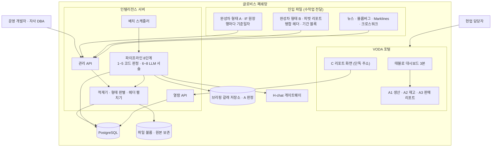

# 인프라 아키텍처

## 0. 이 문서가 다루는 것

C 리포트(종합, 과업지시의 "인텔리전스 서비스 개요")를 만들고 보여 주는 시스템이 어디서 어떻게 도는지를 정한다. 리포트 이름은 [[TBL-UC-001]] 0절을 따른다. A1 생산·A2 재고·A3 판매는 대시보드에 붙는 리포트로 브리핑 갈래가 만들고, 이 문서의 시스템은 그 판정값(A 판정)을 읽어 C 리포트 한 본을 만든다.

다루는 것은 배포 단위, 기술 스택, 데이터가 사는 곳, 인증, 배치 운영이다. 다루지 않는 것은 A 리포트를 만드는 브리핑 갈래의 인프라와 태블로 서버다. 둘 다 이미 있는 것으로 본다.

인입 데이터 실측([[TBL-RFQ-001#Q59]]~[[TBL-RFQ-001#Q64]])으로 드러난 세 가지가 이 문서 여러 절에 걸린다. 완성차 파일의 형태가 둘이라는 것([[#C6]] [[#C15]]), 생산에 목적지 국가가 없다는 것([[#C16]]), 재고 원천이 없다는 것([[#C17]])이다.

## 1. 제약

#### C1 폐쇄망 안에서만 돈다

사내망에 반입해 설치하고 바깥으로 나가는 호출을 하지 않는다. 기사 원문은 사용자의 브라우저가 연다. 출처: [[TBL-PRD-001#N1]]

#### C2 LLM은 사내 H-chat 게이트웨이만 쓴다

OpenAI 호환 규격이라 같은 클라이언트 코드로 외부 개발 환경에서는 OpenAI를, 폐쇄망에서는 H-chat을 가리킨다. 출처: [[TBL-RFQ-001#Q29]]

#### C3 H-chat 키는 코드·문서·저장소에 적지 않는다

환경변수로 주입하고 컨테이너 밖으로 내보내지 않는다. 로그에도 남기지 않는다. 출처: [[TBL-RFQ-001#Q30]]

#### C4 LLM은 배치에서 세 번만 쓴다

사건 명명, 연관 설명, 문장 생성이다. 열람 경로에는 LLM이 없다. 출처: [[TBL-UC-001#UC-S1]]

#### C5 A 판정은 읽기만 한다

브리핑 갈래 저장소의 스냅샷 판정과 내부 분해 결과를 도메인·국가·기간 키로 읽어 온다. 쓰지 않는다. 출처: [[TBL-UC-001#UC-S10]]

#### C6 데이터는 파일로 들어오고, 완성차 파일은 형태가 둘이다

완성차·뉴스·블룸버그·Marklines가 수작업 파일로 전달된다. 자동 연계는 아직 없다. 완성차 파일은 형태가 둘이므로 적재기가 형태를 판별하고 둘 다 같은 표준 테이블로 넣는다.

| 형태 | 모양 | 적재 단위 |
|:--|:--|:--|
| 형태 A · IF 원장 | 생산 17열, 판매·재고 23열. 첫 행이 바로 헤더이고 행마다 기준일자가 있다 | 기준일자 단위 멱등 재적재 |
| 형태 B · 피벗 리포트 | 병합 헤더 2~3줄. 왼쪽에 차원이 줄서고 그다음부터 `(기간 블록 × 지표 종류)`가 반복된다. 행에 날짜 컬럼이 없다 | 파일 기준일 단위 덮어쓰기 |

판별은 첫 행이 바로 헤더인가와 기준일자 컬럼이 있는가로 한다. 어느 쪽으로도 판별되지 않으면 어느 대목이 다른지 보여 주고 적재를 막는다. 셋째 형태를 받는 것은 개발 작업이다.

**형태 B 처리의 핵심은 병합 헤더를 펼치는 것이다.** 헤더 한 칸이 기간 구분(일·월·누계·년)과 지표 종류(운영계획·사업계획·실적·진도율·전년대비, 선적·실 도매·도매(공식)·소매) 한 쌍으로 풀리고, 원본 한 행이 지표 종류 수만큼의 행으로 늘어난다. 펼친 결과를 넣는 자리는 6절에 있다. 총계 행은 계수만 하고 판정 대상에서 뺀다. **총계 행은 상세 행과 함께 더하지 않는다. 범위가 달라 두 배 넘게 부풀 수 있다. 따로 보관하고 대조에만 쓴다.**

출처: [[TBL-PRD-001#R1]] [[TBL-UC-001#UC-A1]] [[TBL-RFQ-001#Q59]]

#### C7 원본 파일을 보존한다

적재 후에도 받은 파일 그대로 볼륨에 남긴다. 출처: [[TBL-PRD-001#N7]]

#### C8 배치는 하루 한 번, 4시간 창 안에 끝난다

02시에 시작하고 A 리포트 배치가 그 전에 끝나 있어야 한다. 출처: [[TBL-PRD-001#N6]]

#### C9 열람은 2초 안에 끝난다

게시된 리포트를 읽기만 하고 집계·조인·LLM을 하지 않는다. 출처: [[TBL-PRD-001#N5]]

#### C10 열람 경로는 게시 스키마만 본다

원천·표준·데이터마트 스키마에 접근하지 않는다. A 리포트 화면이 쓰는 문장·근거·버전과 지표 시계열도 브리핑 갈래에서 통째로 받아 게시 스키마에 사본으로 두므로, 열람 경로가 게시 스키마 밖으로 나가는 일은 없다. 출처: [[TBL-PRD-001#N5]]

#### C11 같은 입력이면 같은 변동·후보가 나온다

기준일과 배치 실행 ID 두 축을 모든 산출 행에 남기고, 판정에 쓴 설정 버전과 A 판정 스냅샷 ID를 함께 저장한다. 출처: [[TBL-PRD-001#N3]]

#### C12 화면은 VODA 안에서 단독 주소로 열린다

자사 로그인 화면이나 네비게이션을 띄우지 않는다. 출처: [[TBL-PRD-001#R23]]

#### C13 LLM이 실패해도 리포트는 나간다

세 역할 각각 강등 경로가 있고 배치는 계속된다. 출처: [[TBL-PRD-001#N2]]

#### C14 매핑과 적재 품질을 수치로 남긴다

적재마다 행수·결측률·매칭률·중복률을 기록하고 직전과 비교해 급변이면 자동 배치를 막는다. 출처: [[TBL-PRD-001#N8]]

#### C15 시간 축은 데이터 형태가 정한다

형태 A는 행마다 기준일자가 있어 일자가 그대로 시간 키다. 형태 B에는 행 단위 날짜가 없다. 파일 기준일과 기간 구분(일·월·누계·년) 두 값이 함께 시간 키가 되며, 파일 기준일은 적재할 때 관리자가 확인하거나 입력한다. 두 형태가 섞여 들어오면 일자를 기준으로 삼고 형태 B의 값은 그 기준일에 붙인다.

시간 키가 형태마다 다르므로 표준 테이블·결합 테이블·변동 행 모두에 기간 단위를 남긴다. 남기지 않으면 일 단위 값과 누계 값이 같은 컬럼에 섞여 구분되지 않는다. 형태 B만 들어오는 동안은 일별 변동 감지를 하지 않고 파일 기준일 사이의 변화를 본다.

출처: [[TBL-PRD-001#R7]] [[TBL-PRD-001#R8]] [[TBL-UC-001#UC-S10]] [[TBL-RFQ-001#Q59]]

#### C16 생산에는 목적지 국가가 없다

생산 데이터에 국내·해외와 내수·수출은 있으나 수출이 어느 나라로 가는지는 없다. 크로스워크로도 채울 수 없다. 따라서 국가 축이 필요한 처리에서 생산이 빠진다. 국가×기간 결합, 원인 후보 검색, 신호등 판정, 화면의 국가 카드가 그것이다.

생산은 공장·차종 축까지만 분해되고 C 리포트에는 도메인 상태 한 줄로 들어간다. 생산 문장에는 외부 원인 인용이 없다. 목적지 국가 컬럼이 들어오면 그때 포함한다.

출처: [[TBL-PRD-001#R11]] [[TBL-PRD-001#R15]] [[TBL-UC-001#UC-S8]] [[TBL-RFQ-001#Q60]]

#### C17 재고는 원천이 없어 판매 단계 차이로 유도한다

항해중·선적대기·법인재고·딜러재고가 인입 데이터 어디에도 없다. 재고 신호는 판매 네 계열(선적·실 도매·도매(공식)·소매)의 단계 차이로 만든다. 선적 대비 도매는 법인 구간(화면 표기 법인 단계 체류), 도매 대비 소매는 딜러 구간(화면 표기 유통 체류)이다. 음수(소매가 도매 초과)도 정상 값으로 다룬다.

**실측인지 유도인지를 저장 행마다 남기고 화면에 표시한다.** 두 값이 같은 컬럼에 섞이면 나중에 원천이 들어왔을 때 어느 기간이 유도값으로 판정됐는지 되짚을 수 없다. 재고 원천이 들어오면 같은 자리를 실측값으로 바꾸고 유도값은 참고로 내린다.

출처: [[TBL-PRD-001#R30]] [[TBL-PRD-001#R9]] [[TBL-UC-001#UC-S3]] [[TBL-RFQ-001#Q61]]

#### C18 계획 두 종류와 도매 두 기준을 둘 다 저장한다

계획이 운영계획·사업계획 두 종류이고 도매가 실 도매·도매(공식) 두 기준이다. 어느 쪽도 버리지 않고 지표 종류로 나란히 저장한다. 정본은 설정 테이블에서 고르고, 고르지 않으면 사업계획과 도매(공식)을 기본으로 쓴다.

판정 행에 어느 정본을 썼는지와 설정 버전을 남긴다. 정본이 바뀌면 과거 판정이 달라지므로 재생성으로만 반영하고 게시본을 덮어쓰지 않는다.

출처: [[TBL-PRD-001#R1]] [[TBL-UC-001#UC-A1]] [[TBL-RFQ-001#Q63]]

#### C19 판정은 배치 5단계에서 끝난다

변동 목록, 원인 후보, 근접도 값 넷(날짜 차이·기사 수·출처 수·국가 일치 방식), 신호등까지 코드가 1~5단계에서 확정한다. 6~8단계(사건 명명·연관 설명·문장 생성)는 확정된 판정을 읽을 수 있게 만드는 일이지 판정하는 일이 아니다. 관련도 등급이나 점수는 두지 않는다.

이 경계가 인프라에 주는 제약은 둘이다. 첫째, H-chat 장애가 판정 경로에 닿지 않아야 한다. LLM 셋이 전부 실패해도 변동·후보·근접도·신호등은 그대로 게시된다([[#C13]]). 둘째, LLM을 끄고 배치를 돌린 결과와 신호등·후보 순서가 같아야 하므로 회귀 검사에 LLM 없는 실행을 둔다.

출처: [[TBL-PRD-001#R26]] [[TBL-PRD-001#R11]] [[TBL-UC-001#UC-S8]] [[TBL-UC-001#UC-S1]]

#### C20 배치 실패 처리는 단계마다 정해져 있다

판정을 만드는 단계가 실패하면 배치를 멈추고 이전 게시본을 유지한다. 적재(1단계)와 사건 묶음(3단계)도 판정을 만드는 단계이므로 멈춤이다. 판정을 읽을 수 있게 만드는 6~8단계가 실패하면 강등으로 처리하고 배치를 이어 간다. 예외는 2단계 A 판정 읽기 하나다. 브리핑 갈래가 늦거나 스냅샷 구조가 달라진 것이므로 보완 집계로 내려가 배치를 이어 간다.

| 단계 | 실패했을 때 |
|:--|:--|
| 1 적재 | 멈춘다. 표준 행이 없으면 뒤 단계가 볼 것이 없다 |
| 2 A 판정 읽기 | 보완 집계로 내려가고 리포트에 미수신을 표시한다. 멈추지 않는다 |
| 3 사건 묶음 | 멈춘다. 사건이 없으면 원인 후보를 붙일 자리가 없다 |
| 4 결합 | 멈춘다 |
| 5 원인 후보·근접도·신호등 | 멈춘다. 판정이 없으면 리포트가 성립하지 않는다 |
| 6 사건 명명 · 7 연관 설명 · 8 서술 | 강등으로 처리하고 배치를 계속한다 ([[#C13]]) |

멈춘 배치는 실패 단계부터 다시 돌린다. 출처: [[TBL-PRD-001#N2]] [[#C19]]

## 2. 구성도

완성차는 형태 A와 형태 B 둘 다 같은 적재기로 들어가고 같은 표준 테이블에서 만난다([[#C6]]). 적재기는 관리 API의 수동 적재와 배치 1단계가 같은 코드를 부른다.

A 리포트는 태블로 대시보드에 붙어 있고 C 리포트는 별도 주소다. 둘 사이에 화면 이동은 없다. 파이프라인만 브리핑 갈래 저장소에서 A 판정을 읽는다.

## 3. 기술 스택

| 층 | 무엇 | 왜 |
|:--|:--|:--|
| 언어 | Python 3.12 | 기존 자사 백엔드와 같다 |
| 웹 | FastAPI + Uvicorn | 기존 관리 웹과 같은 틀 |
| 화면 | React + Vite, Chart.js | 기존 포털과 같다. 외부 CDN 없이 번들 |
| DB | PostgreSQL 16 | 스키마 분리와 jsonb가 필요하다 |
| 배치 | APScheduler 단일 프로세스 | 하루 한 번이라 큐가 필요 없다 |
| 적재 | pandas + openpyxl | 엑셀·CSV. 형태 B의 병합 헤더는 `header=[0,1,2]`로 읽어 MultiIndex를 긴 형태로 편다 ([[#C6]]) |
| LLM | H-chat (OpenAI 호환 클라이언트) | [[#C2]] |
| 배포 | Docker Compose | 폐쇄망 반입 시 이미지 파일로 옮긴다 |

외부 패키지는 사전에 내려받아 사내 저장소에 올려 두고 설치한다. 설치 중 인터넷을 타지 않는다.

## 4. 내부 구조

컨테이너 넷으로 나눈다.

| 컨테이너 | 하는 일 | 열린 포트 |
|:--|:--|:--|
| web | 열람 API와 관리 API, 정적 화면, 수동 적재 | 사내망 HTTPS |
| worker | 스케줄러와 파이프라인 8단계 | 없음 |
| db | PostgreSQL | web·worker만 |
| proxy | 리버스 프록시, 토큰 검증 앞단 | 사내망 |

파이프라인 8단계는 적재, A 판정 읽기, 사건 묶음, 결합, 원인 후보·근접도·신호등, 사건 명명, 연관 설명, 서술·검증·게시다. 1~5단계는 코드만 쓰고 6~8단계가 H-chat을 부른다([[#C4]] [[#C19]]).

적재기는 형태 판별과 병합 헤더 펼치기를 하는 모듈이며 web(관리 API의 수동 적재)과 worker(배치 1단계)가 같은 코드를 부른다([[#C6]]). 같은 파일을 어느 경로로 넣든 같은 표준 행이 나와야 하므로 모듈을 두 벌로 두지 않는다.

worker는 한 번에 하나만 돈다. 정기 배치와 재실행이 겹치면 단일 프로세스 락으로 뒤엣것을 대기시킨다.

## 5. 인증과 접근

| 통로 | 방식 | 근거 |
|:--|:--|:--|
| C 리포트 화면 | VODA가 발급한 서명 토큰(사번·만료). 쿼리 또는 헤더 | [[#C12]] |
| 열람 API | 같은 토큰. 게시 스키마 읽기 전용 계정 | [[#C10]] |
| 관리 화면·API | 기존 관리 웹 세션 + 관리자 권한 | |
| DB | 컨테이너별 계정 분리. web은 게시 스키마 읽기와 적재 쓰기, worker는 전 스키마 쓰기 | [[#C10]] |
| H-chat | 환경변수 키. worker만 접근 | [[#C3]] |
| 브리핑 갈래 저장소 | 읽기 전용 계정 | [[#C5]] |

토큰이 없거나 만료면 화면을 그리지 않고 안내만 낸다. 자사 로그인 화면으로 보내지 않는다.

## 6. 데이터가 사는 곳

PostgreSQL 한 대에 스키마로 나눈다. 테이블 설계는 도메인 모델 문서가 정한다.

| 스키마 | 무엇 | 쓰는 쪽 | 읽는 쪽 |
|:--|:--|:--|:--|
| raw | 받은 파일을 행 그대로. 형태 A는 원장 행, 형태 B는 펼치기 전 셀 그대로 | worker·web | worker |
| std | 표준화한 완성차 긴 형태 테이블, 기사, 시장지표 | worker·web | worker |
| master | 크로스워크 이관본과 버전 | worker | worker |
| mart | 국가×기간 결합, 변동 목록, 원인 후보, 근접도, 신호등, 연관 설명, A 판정 사본 | worker | worker |
| pub | 게시된 C 리포트와 근거, 브리핑 갈래에서 받은 A 리포트 사본(문장·각주 근거·버전), 지표 시계열 사본 | worker | web |
| ops | 적재·배치 이력, LLM 호출 기록, 설정 버전, 미매핑 | worker·web | web |

A 리포트 화면과 C 리포트 화면이 모두 pub만 읽는다([[#C10]]). A 리포트 사본은 도메인·기준일·게시 버전을 키로 두고, 브리핑 갈래가 새로 게시하면 그 버전을 사본으로 받는다.

### 6.1 형태 B를 담는 자리

**완성차 표준 테이블은 긴 형태 하나다.** 형태 A와 형태 B가 같은 테이블로 들어간다([[#C6]]). 형태 B의 병합 헤더 한 칸이 (기간 구분, 지표 종류) 한 쌍으로 펼쳐지고, 원본 한 행이 지표 종류 수만큼의 행으로 늘어난다.

| 컬럼 묶음 | 무엇 |
|:--|:--|
| 차원 | 국가, 생산법인, 공장지역, 대리점, 차종그룹, 세부차종, 차급, 완성차·반조립, 내수·수출 등 그 파일에 있는 축. 없는 축은 NULL |
| 시간 | 형태 A는 기준일자. 형태 B는 파일 기준일 + 기간 구분(일·월·누계·년) ([[#C15]]) |
| 지표 종류 | 운영계획·사업계획·실적·진도율·전년대비, 선적·실 도매·도매(공식)·소매 ([[#C18]]) |
| 값 | 수치 하나. 결측(`-`)은 NULL |
| 출처 | 소스, 형태, 스키마 버전, 적재 ID, 원본 파일 경로, 총계 행 여부 |

넓은 형태로 두지 않는 이유는 둘이다. 첫째, 기간 블록이나 지표 종류가 늘 때마다 컬럼을 추가해야 하고 그때마다 하류 조회가 전부 바뀐다. 둘째, 컬럼 구성이 다른 형태 A와 같은 테이블에 들어가지 못해 도메인마다 테이블이 갈라진다. 긴 형태면 두 형태가 시간 키와 지표 종류만 다른 같은 모양의 행이 된다.

생산 행에는 목적지 국가가 비어 있다([[#C16]]). 국가 컬럼이 NULL인 행은 국가 축 처리에서 자동으로 빠진다.

mart의 재고 파생값은 실측·유도 구분 컬럼을 갖는다([[#C17]]). 실측이 들어오면 유도 행을 지우지 않고 구분 컬럼으로 갈아 끼운다.

### 6.2 파일과 보관

파일 볼륨에 원본을 보존한다. 경로는 소스와 연월로 나눈다([[#C7]]).

A 판정은 이 DB에 없다. 배치가 브리핑 갈래 저장소에서 읽어 mart에 복사한다. 복사할 때 스냅샷 ID를 함께 남겨 재생성 때 같은 입력을 쓴다([[#C11]]). mart로 오는 것은 판정값과 분해 결과뿐이고, A 리포트의 문장·근거·버전은 열람용 사본으로 pub에 따로 들어간다. C 리포트 서술은 mart의 판정만 읽고 pub의 A 문장을 쓰지 않는다.

보관 기간은 원본 파일과 raw는 2년, 나머지는 무기한으로 둔다. 폐쇄망 디스크 용량이 확정되면 다시 본다.

## 7. 외부 변경 감지

이 시스템이 기대는 바깥은 넷이다.

| 바깥 | 바뀌면 생기는 일 | 어떻게 안다 |
|:--|:--|:--|
| 완성차 인입 형태 | 형태가 바뀌거나 셋째 형태가 온다 | 적재 전 형태 판별. 판별되지 않으면 어느 대목이 다른지 보여 주고 적재를 막는다([[#C6]]) |
| 완성차 컬럼·헤더 구성 | 형태 A는 적재가 막히고, 형태 B는 펼치기가 어긋난다 | 형태 A는 컬럼 목록 대조. 형태 B는 기간 블록 목록과 지표 종류 목록을 직전 적재와 대조 |
| 뉴스 스키마(가공본·원본) | 컬럼이 다르다 | 스키마 버전 자동 판별. 둘 다 등록해 둔다 |
| A 판정 스냅샷 구조 | 읽기가 실패한다 | 배치 2단계에서 키·필드 검사. 실패하면 보완 집계로 내려가고 리포트에 미수신을 표시한다([[#C20]]) |

데이터 자체의 급변은 적재 회귀 검사가 잡는다([[#C14]]). 같은 소스의 형태가 직전과 달라진 것도 급변으로 본다. 샘플에서 실데이터로 바뀌는 시점이 가장 위험하다.

## 8. 배치와 운영

- 매일 02시 시작. 4시간 창을 넘기면 진행 중 단계를 마치고 경고를 남긴다([[#C8]]).
- **단계 1~5는 코드 판정, 6~8은 LLM 서술이다.** 5단계가 끝나면 화면에 나갈 판정이 전부 확정된다([[#C19]]). 변동 목록·원인 후보·근접도·신호등뿐 아니라 도메인 상태 3카드의 신호등도 5단계 산출물이다. 국가 축이 없는 생산 카드는 신호등 판정 대상이 아니며 그렇게 표시한다([[#C16]]). 6~8단계는 확정된 값에 이름과 문장만 얹는다.
- 실패 처리는 판정 단계와 서술 단계가 다르다. 적재(1단계)와 사건 묶음(3단계)을 포함해 1·3·4·5단계가 실패하면 배치를 멈추고 이전 게시본을 유지한다. 6~8단계 실패는 강등으로 처리하고 배치를 멈추지 않는다. 단계별 처리는 [[#C20]]에 있다.
- 단계마다 소요·처리 건수·상태를 남긴다. 실패하면 실패 단계부터 다시 돌린다.
- LLM 호출은 건마다 기록한다. 지점, 모델, 토큰, 지연, 결과(정상·필터·형식오류·오류)를 남기고 일 토큰 상한을 넘으면 그날은 더 부르지 않는다. 상한에 걸려도 판정은 이미 5단계에서 끝나 있다.
- 회귀 급변이면 자동 배치를 막는다. 관리자가 사유를 적고 푼다. 완성차 형태가 직전과 달라진 것도 급변에 포함한다([[#C6]]).
- **LLM 없는 실행을 회귀 검사에 둔다.** 같은 기준일을 LLM을 끄고 돌려 신호등과 후보 순서가 정상 배치와 같은지 대조한다. 다르면 판정 경로에 LLM이 섞여 들어간 것이다([[#C19]]).
- 백필은 과거 데이터를 넣을 때 쓴다. 후보·근접도·신호등까지 채우고 LLM 세 역할을 건너뛴다.
- 재생성은 새 버전으로 만들고 기존 게시본을 덮어쓰지 않는다. 사람이 게시 전환을 누른다. 정본 선택([[#C18]])이나 매핑이 바뀐 것도 재생성으로만 반영한다.
- 설정(임계값·시간창·후보 상한·신호등 규칙·정본 선택)은 테이블에 버전으로 쌓는다. 화면과 API가 없으므로 개발자가 새 버전 행을 넣는다.

## 9. 미결사항

- [ ] **완성차 정본 형태가 무엇인가.** IF 원장(형태 A)과 피벗 리포트(형태 B) 중 어느 쪽이 실제 인입인지 아직 답이 없다. 적재기는 둘 다 읽지만 감지 주기·재고 설계·결합 시간 축이 여기에 종속된다 ([[#C6]] [[#C15]] [[TBL-PRD-001#R1]])
- [ ] 형태 B의 파일 기준일을 파일 안에서 읽을 수 있는지, 관리자가 입력해야 하는지 ([[#C15]])
- [ ] 재고 원천(항해중·선적대기·법인·딜러) 수령 가능 여부와 시점. 들어오기 전까지 유도값으로 간다 ([[#C17]])
- [ ] 운영계획과 사업계획, 실 도매와 도매(공식) 중 각각의 정본 ([[#C18]])
- [ ] 생산에 목적지 국가 컬럼을 추가할 수 있는지. 추가되기 전까지 생산은 국가 축 처리에서 빠진다 ([[#C16]])
- [ ] 브리핑 갈래 저장소 접근 방식. 같은 DB인지 별도 인스턴스인지, 읽기 계정을 어떻게 받는지
- [ ] A 리포트 사본을 받는 주기. 브리핑 갈래 게시와 이 배치 사이의 시차를 어디까지 허용하는지
- [ ] 폐쇄망 서버 사양과 디스크 용량. 긴 형태 저장으로 표준 테이블 행수가 원본 대비 몇 배가 되는지 실측 필요
- [ ] 뉴스 원본 대용량 업로드 한도와 청크 방식
- [ ] VODA 토큰 서명 규격과 만료 시간
- [ ] 반입 절차와 주기. 이미지 파일 반입에 며칠이 걸리는지
- [ ] 백업 주기와 보존 기간
- [ ] H-chat 일 토큰 상한의 실제 값
- [ ] 설정 변경을 화면 없이 SQL로 할지 CLI를 만들지
