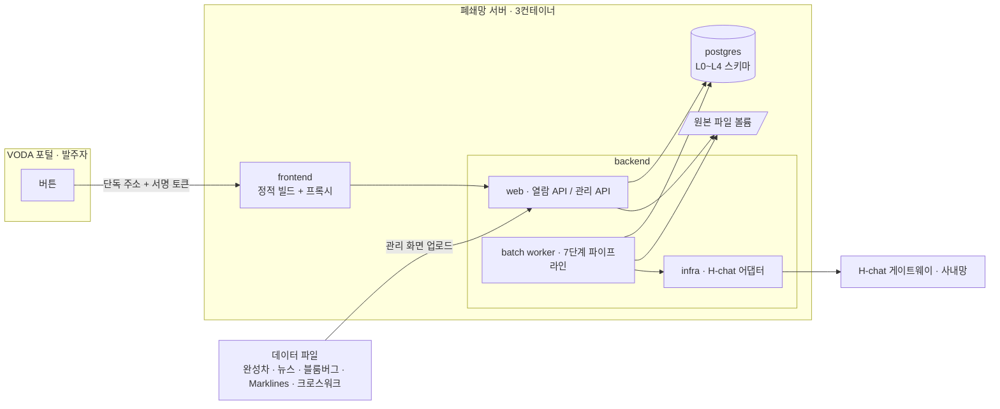

# 인프라 아키텍처

## 0. 이 문서가 다루는 것

A 방식(단일 데이터마트)을 폐쇄망 3컨테이너 안에서 돌리기 위한 제약, 구성, 스택, 데이터 위치, 인증, 배치 운영이다. 브리핑 갈래(`docs/glovis/05_infra.md`)에서 확정된 납품 형상과 H-chat 어댑터 방식을 그대로 승계하고, 인텔리전스 파이프라인에 필요한 것만 더한다.

## 1. 제약

#### C1 폐쇄망, 외부 의존 0

출처: [[TBL-PRD-001#N1]] [[TBL-RFQ-001#Q11]]. 런타임에 CDN·외부 API·패키지 저장소를 호출하지 않는다. 이미지에 전부 포함한다.

#### C2 3컨테이너 형상

출처: [[TBL-PRD-001#G5]]. postgres, backend(API + 배치 워커), frontend(정적 빌드 + 리버스 프록시) 세 개. 추가 컨테이너(벡터 DB, 메시지 큐, 별도 스케줄러)를 두지 않는다.

#### C3 LLM은 H-chat, 설정 전환

출처: [[TBL-RFQ-001#Q28]] [[TBL-RFQ-001#Q29]] [[TBL-RFQ-001#Q30]]. OpenAI 호환 호출. base URL, 인증 헤더(키 원문, Bearer 접두 없음), 모델명, X-Project-Id를 환경 설정으로 뺀다. 외부 개발 환경에서는 OpenAI 계열로 같은 코드가 돈다. JSON 모드 기본, 실패 시 복구·강등.

#### C4 H-chat 키는 환경변수로만

출처: 브리핑 갈래 운영 주의. 키를 파일·저장소·로그·화면에 남기지 않는다. 컨테이너 환경변수로 주입한다.

#### C5 VODA 단독 주소, 서명 토큰

출처: [[TBL-PRD-001#R23]] [[TBL-RFQ-001#Q14]] [[TBL-RFQ-001#Q27]]. 현업 화면은 자사 셸 없이 단독 경로로 렌더된다. 접근은 사번을 담은 서명 토큰(쿼리)으로 한다. VODA 서버와의 API 연동은 없다.

#### C6 우리 서버를 TSM 신뢰 호스트로 등록

출처: [[TBL-RFQ-001#Q27]]. 태블로 임베드가 필요한 경우를 위해 브리핑 갈래와 같은 등록을 유지한다. 인텔리전스 1차 화면은 태블로 임베드를 쓰지 않는다.

#### C7 데이터는 파일로 반입

출처: [[TBL-RFQ-001#Q45]] [[TBL-RFQ-001#Q46]]. 완성차·뉴스·블룸버그·Marklines·크로스워크 전부 파일(xlsx, csv) 업로드다. 자동 연계는 미결. 적재기는 소스별 스키마 버전을 갖는다.

#### C8 배치는 하루 1회, 창 4시간

출처: [[TBL-PRD-001#R24]] [[TBL-PRD-001#N6]]. 02:00 시작, 06:00 전 종료 목표. 실패 시 이전 게시본 유지.

#### C9 데이터 전부 postgres 한 인스턴스

출처: PRD 6.6·6.7 결정. L0 원본부터 L4 브리핑까지 같은 postgres에 스키마로 나눈다. 원본 파일은 backend 볼륨에 보존한다.

#### C10 화면은 L4만 읽는다

출처: [[TBL-PRD-001#N5]]. 열람 API는 게시된 브리핑·워치리스트·judgment·evidence만 조회한다. 열람 경로에 LLM 호출과 무거운 집계가 없다.

#### C11 관리 화면은 로그인, 현업 화면은 토큰

출처: [[TBL-UC-001#UC-A1]] [[TBL-UC-001#UC-H1]]. 진입 면이 둘이므로 인증 경계가 라우터 패키지에서 보여야 한다(브리핑 갈래 core/web/infra 3층 승계).

#### C12 LLM 토큰 일 상한

출처: PRD 6.2. 배치당 토큰 합이 설정 상한(기본 100만)을 넘으면 사건 명명을 심각도 상위 그룹으로 줄인다. 호출별 토큰을 이력에 남긴다.

## 2. 구성도



- 현업 트래픽은 VODA 버튼 → frontend → 열람 API → postgres L4. LLM을 거치지 않는다.
- 배치 워커는 backend 컨테이너 안의 스케줄러 프로세스다. 별도 컨테이너를 두지 않는다(C2).
- H-chat은 배치 워커만 호출한다.

## 3. 기술 스택

| 층 | 선택 | 이유 |
|:--|:--|:--|
| DB | PostgreSQL 15 | 기존 형상. 파티션(월)과 JSONB로 사건·근거 저장 |
| backend | Python 3.11, FastAPI, SQLAlchemy, pandas | 기존 형상. 판정 로직은 pandas 집계로 충분 |
| 배치 | APScheduler(backend 내 프로세스) | 기존 스냅샷 스케줄러 재사용. 큐 없음 |
| LLM 어댑터 | OpenAI 호환 클라이언트 + 설정 전환 | C3 |
| frontend | React, TypeScript, Chart.js | 기존 형상. 시장지표 스파크라인·상세 차트 |
| 파일 파서 | openpyxl, csv | xlsx·csv 반입 |
| 컨테이너 | Docker Compose 3서비스 | C2 |

쓰지 않는 것: 벡터 DB, OpenSearch, 메시지 큐, GPU, 임베딩 모델(PRD 6.1·6.3·6.5).

## 4. 내부 구조

backend 패키지는 브리핑 갈래의 core/web/infra 3층을 승계하고 인텔리전스를 별 도메인 패키지로 둔다.

```
backend/
  core/intelligence/
    ingest/      적재·표준화·회귀 검사 (1~2단계)
    event/       사건 통합 (3단계)
    signal/      집계·결합 (4단계)
    judgment/    판정 (5단계)
    briefing/    서술·검증·강등·게시 (6~7단계)
    master/      크로스워크·설정
  web/
    public/      현업 열람 API (토큰)
    admin/       관리 API (로그인)
  infra/
    llm/         H-chat 어댑터
    files/       파일 파서, 원본 보존
    scheduler/   배치 실행·이력
```

## 5. 인증과 접근

| 진입 면 | 사용자 | 방식 | 근거 |
|:--|:--|:--|:--|
| 현업 열람 | H | VODA 버튼이 여는 단독 주소의 쿼리 토큰. 사번·만료·서명. 토큰 검증 후 읽기 전용 | C5, [[TBL-RFQ-001#Q27]] |
| 관리 | A | 로컬 로그인 + 세션. 관리자 권한. 적재·설정·재실행 | C11 |
| 배치 | S | 프로세스 내부. 외부 노출 없음 | C8 |
| H-chat | 배치 워커 | 환경변수 키. 아웃바운드만 | C3, C4 |

토큰 발급 주체는 브리핑 갈래와 동일하게 우리 서버이며, VODA 쪽에 심는 버튼 작업은 범위 밖이다.

## 6. 데이터가 사는 곳

| 층 | 저장소 | 보존 | 비고 |
|:--|:--|:--|:--|
| 원본 파일 | backend 볼륨 `/data/raw/{source}/{yyyymm}/` | 영구 | 적재 이력에서 경로 참조. [[TBL-PRD-001#N7]] |
| L0 원본 행 | postgres 스키마 `raw` | 영구 | 적재 배치 ID 컬럼 |
| L1 표준화 | 스키마 `std` | 영구 | 뉴스 기사×국가는 월 파티션 |
| 마스터·설정 | 스키마 `master` | 영구, 버전 | 크로스워크 이관, 임계값, 시장지표 구성 |
| L2 사건·집계 | 스키마 `mart` | 영구 | event, country_daily_fact |
| L3 결합 | 스키마 `mart` | 영구 | signal_daily. 2차 학습 테이블 |
| L4 판정·브리핑 | 스키마 `pub` | 영구, 버전 | 화면이 읽는 유일한 층 |
| 운영 이력 | 스키마 `ops` | 1년 | ingest_run, batch_run, llm_call, alert_event |

용량 추정(운영 1년): 완성차 L0+L1 약 50만 행, 뉴스 원본 연 약 200만 건·기사×국가 약 400만 행·본문 포함 약 7GB, signal_daily 약 6.5만 행. 단일 postgres로 충분하다. 뉴스 본문 저장 여부는 라이선스 미결에 따른다.

## 7. 외부 변경 감지

- 완성차 IF 레이아웃 변경: 적재기의 컬럼 대조가 막는다. 새 스키마 버전 등록은 개발 작업.
- 뉴스 스키마 변경: 가공본·원본 판별 실패 시 적재를 막고 알린다.
- 블룸버그 identifier 추가·삭제: series_map 미매핑으로 드러난다.
- H-chat 모델 스냅샷 변경: 모델명 설정만 바꾼다. 응답 형식 변화는 검증기와 강등이 흡수한다.
- 크로스워크 갱신: 관리 화면 업로드로만 반영한다([[TBL-UC-001#UC-A2]]).

## 8. 배치와 운영

- 정기: 02:00 [[TBL-UC-001#UC-S1]]. 단계별 소요·건수·LLM 토큰을 batch_run에 남긴다.
- 재실행: 관리 화면에서 기준일과 시작 단계 지정([[TBL-UC-001#UC-A4]]). 정기 배치와 겹치면 정기를 대기시킨다.
- 백필 모드: 과거 기간 적재 시 LLM 명명·서술 생략. 결합·판정만 채운다.
- 실패: 1~5단계 실패는 중단·이전 게시본 유지, 6단계 실패는 강등 게시.
- 회귀 검사 급변: 자동 배치를 막고 관리자 확인 후 재개.
- 모니터링: 배치 이력 화면, 마지막 성공 시각, 강등 발생률, 토큰 사용량.
- 반입 체크리스트: H-chat JSON 모드 실검증, 콘텐츠 필터 강등 확인, 서명 토큰 검증, 파일 업로드 용량 한도(뉴스 원본 320MB급).

## 9. 미결사항

- [ ] 완성차·뉴스 자동 연계 방식과 시점. 가정: 파일 업로드 (C7)
- [ ] 뉴스 본문 저장·표시 범위(라이선스). 가정: 저장하되 화면은 제목·요약·링크
- [ ] 배치 창 4시간이 뉴스 일 5,600건 규모에서 충분한지 부하 시험
- [ ] H-chat 동시 호출 허용치와 단가. 가정: 동시성 4, 일 100만 토큰 이내
- [ ] 관리 화면 접근 인력(발주자 데이터서비스팀 포함 여부)
- [ ] 서명 토큰 만료 정책. 가정: 브리핑 갈래와 동일
- [ ] 원본 파일 보존 기간과 볼륨 용량 한도
