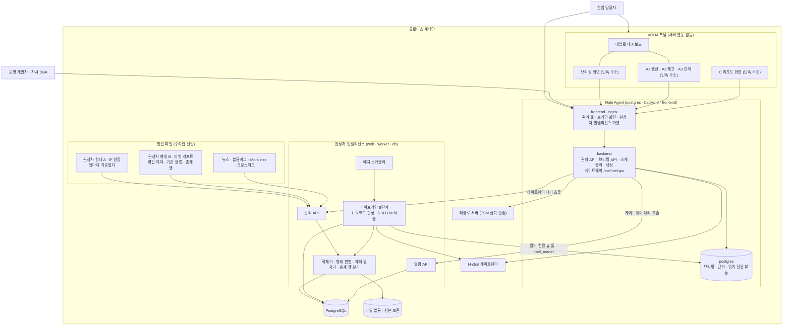

# 인프라 아키텍처

## 0. 이 문서가 다루는 것

Glovis 릴리즈의 두 서비스가 폐쇄망에서 어디서 어떻게 도는지 정한다. Nabi Agent는 등록 대시보드마다 브리핑을 미리 만들어 VODA에 단독 주소로 내주고, 개발자가 그 근거를 세우는 관리 웹이다. 완성차 인텔리전스는 C 리포트(종합, 과업지시의 "인텔리전스 서비스 개요")를 만들고 A·C 화면의 데이터를 내주는 별도 서비스다. 둘은 Nabi Agent DB의 읽기 전용 뷰 둘([[#C28]] [[#C5]])과 Nabi Agent backend의 게이트웨이([[#C12]])로만 만난다.

리포트 이름은 [[TBL-UC-002]] 0절을 따른다. A1 생산·A2 재고·A3 판매는 대시보드에 붙는 리포트로 Nabi Agent(브리핑 갈래)가 글과 판정을 만들고, 완성차 인텔리전스는 그 판정값(A 판정)을 읽어 C 리포트 한 본을 만든다. A 리포트 화면이 쓰는 문장·근거·버전은 브리핑 갈래가 게시한 것을 사본으로 받아 보여 준다.

다루는 것은 배포 단위, 기술 스택, 내부 구조와 설정 파일, 데이터가 사는 곳, 인증, 배치 운영, 반입이다. 다루지 않는 것은 태블로 서버와 VODA다. 둘 다 이미 있는 것으로 본다. 2장부터는 절마다 두 서비스를 나눠 적는다.

제약 C1~C20은 완성차 인텔리전스에서 나왔고, 그중 C1·C2·C3·C9·C13은 두 서비스에 함께 걸리도록 넓혔다. C21부터는 Nabi Agent에서 나왔거나 두 서비스에 함께 걸린다. 옛 브리핑 갈래 제약(GLV-C-###)은 원 ID로 함께 적는다.

인입 데이터 실측([[TBL-RFQ-002]] 4.2절)으로 드러난 세 가지가 완성차 인텔리전스의 여러 절에 걸린다. 완성차 파일의 형태가 둘이고 총계 행이 상세 행과 범위가 다르다는 것([[#C6]] [[#C15]]), 생산에 목적지 국가가 없다는 것([[#C16]]), 재고 원천이 없다는 것([[#C17]])이다.

## 1. 제약

제약은 상류 요구에서 내려온 것과 실측에서 온 것 두 갈래다. 출처 줄이 그 갈래를 가리킨다.

#### C1 폐쇄망 안에서만 돈다

출처: [[TBL-PRD-002#N1]] [[TBL-PRD-002#N11]]

두 서비스 모두 사내망에 반입해 설치하고 바깥으로 나가는 호출을 하지 않는다. CDN·외부 API·외부 폰트를 참조하지 않고 프론트 자산은 전부 번들에 담는다. 태블로 임베드 스크립트도 사내 태블로 서버가 내준다. 기사 원문은 사용자의 브라우저가 연다. (원 ID: GLV-C-001)

#### C2 LLM은 사내 H-chat 게이트웨이만 쓴다

출처: [[TBL-RFQ-002#Q8]] [[TBL-RFQ-002#Q4]]

OpenAI 호환 규격이라 같은 클라이언트 코드로 외부 개발 환경에서는 OpenAI를, 폐쇄망에서는 H-chat을 가리킨다. base URL·헤더·모델명만 설정으로 바뀐다. 두 서비스 모두 H-chat 호출을 어댑터 하나 뒤에만 둔다. 호출부에 H-chat 지식이 새면 바꿀 수 없게 된다. (원 ID: GLV-C-002)

#### C3 H-chat 키는 코드·문서·저장소에 적지 않는다

출처: [[TBL-PRD-002#N1]] [[TBL-RFQ-002#Q9]] [[TBL-PRD-002#R53]]

완성차 인텔리전스는 키를 환경변수로 주입하고 컨테이너 밖으로 내보내지 않는다. 로그에도 남기지 않는다. 인증은 Bearer 접두 없이 키 원문을 Authorization 헤더에 넣는 방식이므로 헤더 값 자체가 키다. `.env.example`에는 이름만 두고 값은 비운다. Nabi Agent는 키를 AI 설정 화면에서 받아 저장할 때 암호화하고, 화면과 응답에는 가려서 보여 준다([[#C26]]).

#### C4 LLM은 배치에서 세 번만 쓴다

출처: [[TBL-UC-002#UC-S1]] [[TBL-PRD-002#R20]]

사건 명명, 연관 설명, 문장 생성이다. 열람 경로에는 LLM이 없다.

#### C5 A 판정과 A 리포트 사본은 읽기만 한다

출처: [[TBL-UC-002#UC-S2]] [[TBL-PRD-002#R2]]

브리핑 갈래 저장소가 둔 읽기 전용 뷰 둘만 읽는다. `tbl_a_judgment`(국가·공장 축 판정과 기여. 브리핑 갈래가 축 판정을 만들 때만 행이 있다)와 `tbl_a_report`(a 변형 브리핑의 요약·해설·트래킹 지표·판정·근거·버전)다. 읽기 전용 계정 `intel_reader`로 그 둘 밖은 보지 못한다. 쓰지 않는다(유저 결정 2026-10-01, [[TBL-PRD-002#R55]] [[#C28]]). 분해 블록·고정 문구·못 만드는 지표·제약 경고는 이 시스템이 만든다.

#### C6 데이터는 파일로 들어오고, 완성차 파일은 형태가 둘이다

출처: [[TBL-PRD-002#R3]] [[TBL-UC-002#UC-A1]] [[TBL-RFQ-002]] 4.2절

완성차·뉴스·블룸버그·Marklines가 수작업 파일로 전달된다. 자동 연계는 아직 없다. 완성차 파일은 형태가 둘이므로 적재기가 형태를 판별하고 둘 다 같은 표준 테이블로 넣는다.

| 형태 | 모양 | 적재 단위 |
|:--|:--|:--|
| 형태 A · IF 원장 | 생산 16열, 판매·재고 22열(현대차 전송 데이터 항목과 실물 원장이 같다). 첫 행이 헤더이고 둘째 행이 영문 코드 행이며 행마다 기준일자가 있다 | 기준일자 단위 멱등 재적재 |
| 형태 B · 피벗 리포트 | 병합 헤더 2~3줄. 왼쪽에 차원이 줄서고 그다음부터 (기간 블록 × 지표 종류)가 반복된다. 행에 날짜 컬럼이 없다 | 파일 기준일 단위 덮어쓰기 |

판별은 첫 행이 바로 헤더인가와 기준일자 컬럼이 있는가로 한다. 어느 쪽으로도 판별되지 않으면 어느 대목이 다른지 보여 주고 적재를 막는다. 셋째 형태를 받는 것은 개발 작업이다.

형태 B 처리의 핵심은 병합 헤더를 펼치는 것이다. 헤더 한 칸이 기간 구분(일·월·누계·년)과 지표 종류(운영계획·사업계획·실적·진도율·전년대비, 선적·실 도매·도매(공식)·소매) 한 쌍으로 풀리고, 원본 한 행이 지표 종류 수만큼의 행으로 늘어난다. 펼친 결과를 넣는 자리는 6절에 있다.

총계 행은 상세 행과 함께 더하지 않는다. 총계 행이 그 파일의 차원 범위를 따르지 않아 실측에서 상세 행 합의 약 2.5배였고, 함께 더하면 값이 두 배 넘게 부푼다. 총계 행은 행 종류로 구분해 따로 보관하고 상세 행 합과 대조하는 데만 쓴다. 적재 검증식은 상세 행 합만 쓰고 차이는 경고로 남긴다.

#### C7 원본 파일을 보존한다

출처: [[TBL-PRD-002#N7]]

적재 후에도 받은 파일 그대로 볼륨에 남긴다.

#### C8 배치는 하루 한 번, 4시간 창 안에 끝난다

출처: [[TBL-PRD-002#N6]] [[TBL-PRD-002#R30]]

02시에 시작하고 A 리포트 배치가 그 전에 끝나 있어야 한다.

#### C9 열람은 2초 안에 끝난다

출처: [[TBL-PRD-002#N5]] [[TBL-PRD-002#N9]]

게시된 리포트를 읽기만 하고 집계·조인·LLM을 하지 않는다. Nabi Agent 브리핑 열람도 저장된 브리핑을 읽기만 하고 LLM을 부르지 않는다. 생성은 일정과 새로고침에서만 한다. (원 ID: GLV-C-005)

#### C10 열람 경로는 게시 스키마만 본다

출처: [[TBL-PRD-002#N5]] [[TBL-PRD-002#R2]]

원천·표준·데이터마트 스키마에 접근하지 않는다. A 리포트 화면이 쓰는 문장·근거·버전과 지표 시계열도 브리핑 갈래에서 통째로 받아 게시 스키마에 사본으로 두므로, 열람 경로가 게시 스키마 밖으로 나가는 일은 없다.

#### C11 같은 입력이면 같은 변동·후보가 나온다

출처: [[TBL-PRD-002#N3]] [[TBL-PRD-002#R18]]

기준일과 배치 실행 ID 두 축을 모든 산출 행에 남기고, 판정에 쓴 설정 버전과 A 판정 스냅샷 ID를 함께 저장한다.

#### C12 화면은 Nabi Agent 메뉴로 열리고 VODA에는 단독 주소로 분리된다

출처: [[TBL-PRD-002#R29]] [[TBL-RFQ-002#Q7]] · 유저 결정 2026-10-01

화면 넷은 Nabi Agent(브리핑 갈래 관리 웹) 프론트의 페이지이고 Nabi Agent 로그인 세션으로 연다. 서버 호출은 Nabi Agent backend의 게이트웨이가 대리한다(5장). 이 시스템의 백엔드·DB·배치는 별도 서비스로 그대로다. VODA에는 같은 페이지를 셸 없는 단독 주소로 분리하고 화면마다 서명 주소가 하나이며 그 주소로만 열린다. VODA 안에 자사 로그인 화면이나 네비게이션을 띄우지 않는다. A 리포트에서 C로 가는 화면 안 링크도 없다.

#### C13 LLM이 실패해도 리포트와 브리핑은 나간다

출처: [[TBL-PRD-002#N2]] [[TBL-PRD-002#N12]] [[TBL-RFQ-002#Q10]]

완성차 인텔리전스는 세 역할 각각 강등 경로가 있고 배치는 계속된다. Nabi Agent는 JSON 모드를 켜 두되, 형식 위반·콘텐츠 필터 차단·호출 실패를 같은 복구·강등 배선이 받아 결정적 재료로 강등 브리핑을 저장한다. JSON 모드가 지원되지 않아도 설계는 바뀌지 않는다.

#### C14 매핑과 적재 품질을 수치로 남긴다

출처: [[TBL-PRD-002#N8]] [[TBL-UC-002#UC-S10]]

적재마다 행수·결측률·매칭률·중복률을 기록하고 직전과 비교해 급변이면 경로에 맞게 막는다.

#### C15 시간 축은 데이터 형태가 정한다

출처: [[TBL-PRD-002#R12]] [[TBL-PRD-002#R13]] [[TBL-UC-002#UC-S2]] [[TBL-RFQ-002]] 4.2절

형태 A는 행마다 기준일자가 있어 일자가 그대로 시간 키다. 형태 B에는 행 단위 날짜가 없다. 파일 기준일과 기간 구분(일·월·누계·년) 두 값이 함께 시간 키가 되며, 파일 기준일은 적재할 때 관리자가 확인하거나 입력한다. 두 형태가 섞여 들어오면 일자를 기준으로 삼고 형태 B의 값은 그 기준일에 붙인다.

시간 키가 형태마다 다르므로 표준 테이블·결합 테이블·변동 행 모두에 기간 단위를 남긴다. 남기지 않으면 일 단위 값과 누계 값이 같은 컬럼에 섞여 구분되지 않는다. 형태 B만 들어오는 동안은 일별 변동 감지를 하지 않고 파일 기준일 사이의 변화를 본다.

#### C16 생산에는 목적지 국가가 없다

출처: [[TBL-PRD-002#R16]] [[TBL-PRD-002#R21]] [[TBL-UC-002#UC-S5]] [[TBL-RFQ-002]] 4.2절

생산 데이터에 국내·해외와 내수·수출은 있으나 수출이 어느 나라로 가는지는 없다. 크로스워크로도 채울 수 없다. 따라서 국가 축이 필요한 처리에서 생산이 빠진다. 국가×기간 결합, 원인 후보 검색, 신호등 판정, 화면의 국가 카드가 그것이다.

생산은 공장·차종 축까지만 분해되고 C 리포트에는 도메인 상태 한 줄로 들어간다. 생산 도메인 상태의 신호등은 판정 대상 아님(notApplicable)이다. 생산 문장에는 외부 원인 인용이 없다. 목적지 국가 컬럼이 들어오면 그때 포함한다.

#### C17 재고는 원천이 없어 판매 단계 차이로 유도한다

출처: [[TBL-PRD-002#R9]] [[TBL-PRD-002#R14]] [[TBL-UC-002#UC-S4]] [[TBL-RFQ-002]] 4.2절

항해중·선적대기·법인재고·딜러재고가 인입 데이터 어디에도 없다. 재고 신호는 판매 네 계열(선적·실 도매·도매(공식)·소매)의 단계 차이로 만든다. 선적 대비 도매 정본은 법인 구간(화면 표기 법인 단계 체류), 도매 정본 대비 소매는 딜러 구간(화면 표기 유통 체류)이다. 음수(소매가 도매 초과)도 정상 값으로 다룬다.

실측인지 유도인지를 저장 행마다 남기고 화면에 표시한다. 두 값이 같은 컬럼에 섞이면 나중에 원천이 들어왔을 때 어느 기간이 유도값으로 판정됐는지 되짚을 수 없다. 재고 원천이 들어오면 같은 자리를 실측값으로 바꾸고 유도값은 참고로 내린다.

#### C18 계획 두 종류와 도매 두 기준을 둘 다 저장한다

출처: [[TBL-PRD-002#R3]] [[TBL-UC-002#UC-A1]] [[TBL-RFQ-002]] 4.2절

계획이 운영계획·사업계획 두 종류이고 도매가 실 도매·도매(공식) 두 기준이다. 어느 쪽도 버리지 않고 지표 종류로 나란히 저장한다. 정본은 설정 테이블의 새 버전으로만 바꾸고 적재 요청은 정본을 정하지 않는다. 설정이 없으면 사업계획과 도매(공식)을 기본으로 쓴다.

판정 행에 어느 정본을 썼는지와 설정 버전을 남긴다. 정본이 바뀌면 과거 판정이 달라지므로 재생성으로만 반영하고 게시본을 덮어쓰지 않는다.

#### C19 판정은 배치 5단계에서 끝난다

출처: [[TBL-PRD-002#R10]] [[TBL-PRD-002#R16]] [[TBL-UC-002#UC-S5]] [[TBL-UC-002#UC-S1]]

변동 목록, 원인 후보, 근접도 값 넷(날짜 차이·기사 수·출처 수·국가 일치 방식), 변동 신호등, 도메인 상태 신호등까지 코드가 1~5단계에서 확정한다. 6~8단계(사건 명명·연관 설명·문장 생성)는 확정된 판정을 읽을 수 있게 만드는 일이지 판정하는 일이 아니다. 관련도 등급이나 점수는 두지 않는다.

이 경계가 인프라에 주는 제약은 둘이다. 첫째, H-chat 장애가 판정 경로에 닿지 않아야 한다. LLM 셋이 전부 실패해도 변동·후보·근접도·신호등은 그대로 게시된다([[#C13]]). 둘째, LLM을 끄고 배치를 돌린 결과와 신호등·후보 순서가 같아야 하므로 회귀 검사에 LLM 없는 실행을 둔다.

#### C20 배치 실패 처리는 단계마다 정해져 있다

출처: [[TBL-PRD-002#R30]] [[TBL-PRD-002#N2]] [[TBL-UC-002#UC-S1]]

판정을 만드는 단계가 실패하면 배치를 멈추고 이전 게시본을 유지한다. 적재(1단계)와 사건 묶음(3단계)도 판정을 만드는 단계이므로 멈춤이다. 판정을 읽을 수 있게 만드는 6~8단계가 실패하면 강등으로 처리하고 배치를 이어 간다. 예외는 2단계 A 판정 읽기 하나다. 브리핑 갈래가 늦거나 스냅샷 구조가 달라진 것이므로 보완 집계로 내려가 배치를 이어 간다.

| 단계 | 실패했을 때 |
|:--|:--|
| 1 적재 | 멈춘다. 표준 행이 없으면 뒤 단계가 볼 것이 없다 |
| 2 A 판정 읽기 | 보완 집계로 내려가고 리포트에 미수신을 표시한다. 멈추지 않는다 |
| 3 사건 묶음 | 멈춘다. 사건이 없으면 원인 후보를 붙일 자리가 없다 |
| 4 결합 | 멈춘다 |
| 5 원인 후보·근접도·신호등 | 멈춘다. 판정이 없으면 리포트가 성립하지 않는다 |
| 6 사건 명명 · 7 연관 설명 · 8 서술 | 강등으로 처리하고 배치를 계속한다([[#C13]]) |
| 8 A 리포트 사본 읽기 | C 리포트는 게시하고 사본만 미수신으로 남긴다 |

회귀 급변은 경로에 따라 다르다. 수동으로 올린 파일은 적재를 마치되 배치 자동 실행을 막고 관리자 해제를 기다린다. 배치가 스스로 집어 온 파일에서 만나면 배치를 멈춘다. 멈춘 배치는 실패 단계부터 다시 돌린다.

#### C21 VODA와 서버 간 연동을 만들지 않는다

출처: [[TBL-RFQ-002#Q6]] [[TBL-RFQ-002#Q58]] [[TBL-PRD-002#R41]] [[TBL-PRD-002#R29]]

두 서비스 모두 VODA에는 셸 없는 단독 주소의 화면만 내준다. VODA는 그 주소를 자기 프론트의 버튼에 걸 뿐이고, 우리가 VODA 서버에 무엇을 요청하거나 VODA가 우리 API를 부르는 일은 없다. (원 ID: GLV-C-003)

#### C22 저장소는 서비스마다 PostgreSQL 하나다

출처: [[TBL-RFQ-002#Q48]] [[TBL-PRD-002#N13]] · PRD 6.19

검색·그래프 전용 저장소(OpenSearch, Neo4j)를 두지 않는다. 지표와 시트를 잇는 연결 정보도 PostgreSQL에 둔다. 두 서비스는 서로 다른 PostgreSQL을 쓰고, 완성차 인텔리전스는 Nabi Agent DB의 읽기 전용 뷰 둘만 본다([[#C5]] [[#C28]]). (원 ID: GLV-C-004)

#### C23 Nabi Agent는 메일 발송 경로를 가정하지 않는다

출처: [[TBL-PRD-002#R48]]

계정과 비밀번호는 관리자가 발급하고, 생성 실패 같은 알림은 관리 웹의 브리핑 상태 화면([[TBL-UC-002#UC-A9]])으로 본다. 완성차 인텔리전스의 알림 채널은 미결이다([[TBL-PRD-002#R24]]). (원 ID: GLV-C-006)

#### C24 폐쇄망 안에서 코드를 고치지 않는다

출처: [[TBL-RFQ-002#Q5]]

두 서비스 모두 밖에서 만들고 검증해 이미지로 반입한다. 고칠 것이 생기면 밖에서 고쳐 다시 반입한다(8.3). (원 ID: GLV-C-007)

#### C25 Nabi Agent의 접속점은 재배포 없이 DB 설정으로 바꾼다

출처: [[TBL-RFQ-002#Q7]] [[TBL-PRD-002#R53]]

태블로 내부 주소·프록시 주소·사이트, H-chat 주소·모델 같은 환경 접속점을 런타임에 바꿀 수 있어야 한다. VODA가 재배포 없이 접속점을 바꾸는 검증된 관행을 따른다. 태블로 신뢰 티켓은 내부 주소로 받고 임베드 주소는 브라우저가 닿는 프록시 주소로 만들기 때문에 두 주소를 따로 둔다. 완성차 인텔리전스는 접속점을 환경변수로 받는다(4.1). (원 ID: GLV-C-008)

#### C26 VODA 실코드에서 확인된 위험을 반복하지 않는다

출처: [[TBL-RFQ-002#Q7]]

VODA 실코드 분석에서 나온 금지 목록이다. 두 서비스에 함께 걸린다. (원 ID: 옛 브리핑 갈래 인프라 8-1)

| 번호 | VODA에서 발견 | 규칙 |
|:--|:--|:--|
| 1 | 설정 파일에 평문 비밀값(클라이언트 시크릿·SMTP 비밀번호·AES 키) 커밋 | 비밀값은 환경으로 주입하고 설정 표에 저장할 때 암호화한다. 커밋하지 않는다 |
| 2 | 특정 사번의 인증 우회를 코드에 박음 | 식별자로 분기하는 코드를 두지 않는다 |
| 3 | 인증 없는 공개 티켓 발급 경로(이메일 쿼리 전달) | 인증 없는 발급 경로를 두지 않는다. 화면은 서명 주소로만 연다 |
| 4 | 클라이언트 자체 토큰 만료 검증이 버그로 무력화 | 세션 판단은 서버가 한다 |
| 5 | 로그인 경로 4종 병존 | 인증 경로는 면마다 하나다. 브리핑·A·C 단독 주소는 서명 주소, 관리 웹은 로컬 세션 |

#### C27 Nabi Agent 새벽 생성은 완성차 인텔리전스 배치 전에 끝난다

출처: [[TBL-PRD-002#N10]] [[TBL-PRD-002#R55]] · PRD 6.19

갱신은 하루 한 번 새벽이고 운영 설정으로 바꿀 수 있다. 완성차 대시보드 셋의 브리핑이 02시 전에 저장돼 있어야 완성차 인텔리전스 배치가 같은 기준일의 최신 세대를 읽는다([[#C8]]).

#### C28 완성차 인텔리전스에는 읽기 전용 뷰 둘만 연다

출처: [[TBL-PRD-002#R55]] [[TBL-RFQ-002#Q59]]

Nabi Agent DB에 뷰 `tbl_a_report`·`tbl_a_judgment`를 두고, 읽기 전용 계정 `intel_reader`에 그 둘의 조회 권한만 준다. 원본 표는 보이지 않는다. 완성차 대시보드 셋의 브리핑 화면 제공은 꺼 둔다. 완성차 인텔리전스 쪽 규칙은 [[#C5]]다.

#### C29 서명값은 어느 접근 로그에도 남지 않는다

출처: [[TBL-UC-002#UC-A4]] [[TBL-PRD-002#R41]] [[TBL-PRD-002#R29]]

브리핑 화면과 A·C 단독 주소는 쿼리 `token`에 서명값을 싣는다. 합친 배포에서는 이 주소와 게이트웨이 호출이 Nabi Agent frontend의 nginx와 backend를 지나므로, 진입점 nginx와 Nabi Agent backend와 완성차 인텔리전스 web이 모두 접근 로그에 쿼리를 남기지 않는다. 오류 문장에도 서명값을 넣지 않는다.

## 2. 구성도

Nabi Agent는 컨테이너 셋(postgres, backend, frontend)이다. 기존 제품의 일곱에서 opensearch·neo4j·keycloak·mailpit을 걷어냈다(4.2). frontend의 nginx가 릴리즈의 진입점이고 관리 웹, 브리핑 화면, 완성차 인텔리전스 화면을 모두 내준다. 릴리즈 바깥으로 나가는 호출은 태블로 서버와 H-chat 둘뿐이고 둘 다 폐쇄망 안이다. VODA는 우리 화면 주소를 자기 프론트에 걸 뿐 서버 간 연동이 없다([[#C21]]).

완성차 인텔리전스 화면 넷은 Nabi Agent 메뉴 안의 탭이고, VODA에서는 Nabi Agent가 내주는 단독 주소로 열린다. 어느 쪽이든 Nabi Agent backend의 게이트웨이를 거쳐 완성차 인텔리전스 API를 부른다. VODA에서는 A 리포트가 태블로 대시보드에 붙고 C 리포트는 별도 단독 주소이며 화면 안에서 서로 가는 링크는 없다. 파이프라인만 Nabi Agent DB의 읽기 전용 뷰 둘에서 A 판정과 A 리포트 문서를 읽고, 화면은 모두 열람 API를 통해 게시 스키마만 읽는다.

완성차는 형태 A와 형태 B 둘 다 같은 적재기로 들어가고 같은 표준 테이블에서 만난다([[#C6]]). 적재기는 관리 API의 수동 적재와 배치 1단계가 같은 코드를 부른다.

## 3. 기술 스택

### 3.1 완성차 인텔리전스

| 층 | 무엇 | 왜 |
|:--|:--|:--|
| 언어 | Python 3.12 | 기존 자사 백엔드와 같다 |
| 웹 | FastAPI + Uvicorn | 기존 관리 웹과 같은 틀 |
| 화면 | React + Vite, Chart.js | 기존 포털과 같다. 외부 CDN 없이 번들 |
| DB | PostgreSQL 16 | 스키마 분리와 jsonb가 필요하다 |
| 배치 | APScheduler 단일 프로세스 | 하루 한 번이라 큐가 필요 없다 |
| 적재 | pandas + openpyxl | 엑셀·CSV. 형태 B의 병합 헤더는 여러 줄 헤더로 읽어 MultiIndex를 긴 형태로 편다([[#C6]]) |
| LLM | H-chat (OpenAI 호환 클라이언트) | [[#C2]] |
| PDF | WeasyPrint(HTML·CSS를 PDF로) + 서버 SVG 막대 | A 리포트 내려받기. 같은 발주처 브리핑 갈래와 같은 방식(유저 결정 2026-09-30). pango와 한글 글꼴(나눔고딕)을 이미지에 굽는다 |
| 배포 | Docker Compose | 폐쇄망 반입 시 이미지 파일로 옮긴다 |

외부 패키지는 밖에서 받아 이미지에 통째로 굽는다. 폐쇄망에는 사설 패키지 저장소가 없다(VODA 실코드 분석, 원 ID GLV-ANS-021). 설치 중 인터넷을 타지 않는다.

### 3.2 Nabi Agent

기존 제품에서 검증된 스택을 그대로 쓴다. 새 기술을 들이지 않는 것이 원칙이다. 폐쇄망 반입물은 밖에서 검증된 만큼만 안전하고([[#C24]]), 이 릴리즈에서 새로 만드는 것은 스택이 아니라 브리핑이다.

| 층 | 무엇 | 왜 |
|:--|:--|:--|
| 언어 | Python 3.12 (python:3.12-slim) | 기존 제품과 같다 |
| 웹 | FastAPI + uvicorn | 관리 API, 브리핑 API, 게이트웨이 |
| ORM·마이그레이션 | SQLAlchemy 2.0 + Alembic | 기동할 때 자동 마이그레이션(8.3) |
| 검증 | Pydantic 2 | 요청·응답·설정 |
| 스케줄러 | APScheduler | backend 내장, 분 단위 tick(8.2) |
| HTTP 클라이언트 | httpx | 태블로 서버·H-chat·완성차 인텔리전스 호출 |
| DB | PostgreSQL 17 | 유일한 저장소([[#C22]]) |
| 화면 | TypeScript, React 18, Vite | 관리 웹과 브리핑 화면. 정적 번들이고 외부 CDN을 참조하지 않는다([[#C1]]) |
| 라우팅·상태·계약 | wouter, TanStack Query, zod | 브리핑 화면과 완성차 인텔리전스 화면의 단독 주소도 이 라우터의 경로다 |
| 컴포넌트 | Radix UI + Tailwind CSS | 관리 웹 |
| 차트 | react-chartjs-2 + Chart.js | LLM은 차트 라이브러리 스펙을 직접 쓰지 않고 자체 페이로드만 채우며, 결정적 변환이 Chart.js 설정으로 바꾼다([[TBL-RFQ-002#Q51]]) |
| PDF | WeasyPrint + 서버 SVG 차트 | 브리핑 PDF는 서버가 만든다([[TBL-RFQ-002#Q57]]). 기존 제품의 서버 SVG 차트 렌더러를 고쳐 쓴다 |
| 프론트 서빙 | nginx | 정적 번들 서빙과 backend 프록시. 릴리즈의 진입점이다 |
| 컨테이너 | Docker Compose | 반입·기동 단위(8.3) |
| LLM | H-chat (OpenAI 호환, gpt-5.5·gpt-5.6 계열) | 어댑터 뒤([[#C2]]). 설정 전환 |

이 형상에서 빠지는 의존성은 opensearch-py, neo4j 드라이버, 메일 발송 경로, Keycloak 연동 라이브러리, react-vega·vega·vega-lite다. 삭제 작업 때 requirements와 package.json에서 함께 걷어내고 [[TBL-PRD-002#N13]]의 코드 규모 감소에 센다.

## 4. 내부 구조

저장소 뿌리의 `backend/`·`frontend/`가 Nabi Agent이고, `intelligence/` 아래의 `backend/`·`frontend/`·`docs/specs/`가 완성차 인텔리전스다. 폴더 안의 도메인 분할과 계층은 클래스 명세의 폴더 구조 절이 확정한다. 여기서는 컨테이너와 설정 파일까지만 정한다. 릴리즈는 compose 하나(`ops/docker-compose.prod.yml`)로 두 서비스를 함께 띄운다.

완성차 인텔리전스는 컨테이너 셋으로 나눈다. 완성차 인텔리전스만 따로 띄울 때(`intelligence/docker-compose.yml`)는 proxy를 더해 넷이다.

| 컨테이너 | 하는 일 | 열린 포트 |
|:--|:--|:--|
| web (intel-web) | 열람 API와 관리 API, 수동 적재. 합친 배포에서는 화면을 Nabi Agent frontend가 그린다 | 없음. Nabi Agent backend의 게이트웨이만 부른다 |
| worker (intel-worker) | 스케줄러, 재실행 대기열과 비교 계산, 브리핑 저장소 확인 기록, 파이프라인 8단계 | 없음 |
| db (intel-db) | PostgreSQL 16 | web·worker만 |
| proxy | 따로 띄울 때만 쓰는 리버스 프록시(사내망 HTTPS 종단). 접근 로그에 쿼리를 남기지 않는다. 합친 배포에서는 Nabi Agent frontend의 nginx가 진입점이다 | 사내망 |

파이프라인 8단계는 적재, A 판정 읽기, 사건 묶음, 결합, 원인 후보·근접도·신호등, 사건 명명, 연관 설명, 서술·검증·게시다. 1~5단계는 코드만 쓰고 6~8단계가 H-chat을 부른다([[#C4]] [[#C19]]).

적재기는 형태 판별과 병합 헤더 펼치기와 총계 행 분리를 하는 모듈이며 web(관리 API의 수동 적재)과 worker(배치 1단계)가 같은 코드를 부른다([[#C6]]). 같은 파일을 어느 경로로 넣든 같은 표준 행이 나와야 하므로 모듈을 두 벌로 두지 않는다.

worker는 한 번에 하나만 돈다. 관리 API의 재실행 요청은 web이 `ops.batch_run`에 대기 행(`queued`)으로 남기고, worker가 30초마다 들어온 순서대로 집어 돈다. 정기 배치도 같은 대기열을 거치므로 재실행과 겹치면 뒤엣것이 기다린다. 재실행 비교 표도 worker가 실행을 마칠 때 계산해 `ops`에 둔다. 브리핑 저장소 접속 확인도 같은 주기로 `ops`에 남기고 web은 그 행만 읽는다. web은 `mart`와 브리핑 저장소를 보지 않는다([[#C10]] [[#C5]]).

### 4.1 완성차 인텔리전스 설정 파일이 읽는 것

설정 파일은 자기가 설정하는 것 옆에 둔다. 값은 환경변수로 들어오고 `.env.example`에는 이름과 설명만 둔다.

| 이름 | 누가 읽나 | 무엇 |
|:--|:--|:--|
| DATABASE_URL | web, worker | PostgreSQL 접속. 컨테이너별 계정 |
| BRIEFING_DB_URL | worker | 브리핑 갈래 저장소(별도 PostgreSQL)의 읽기 전용 계정 `intel_reader` 접속. 뷰 둘만 보인다([[#C5]]) |
| LLM_BASE_URL | worker | H-chat 게이트웨이 주소. 외부 개발에서는 OpenAI 주소([[#C2]]) |
| LLM_API_KEY | worker | 키 원문. 로그 금지([[#C3]]). H-chat 게이트웨이(주소에 hchat)는 키를 접두 없이 보내고, 그 밖의 OpenAI 호환 서버는 Bearer를 붙인다 |
| LLM_PROJECT_ID | worker | Project 키일 때만 |
| LLM_MODEL | worker | 배포 모델 이름 |
| LLM_DAILY_TOKEN_LIMIT | worker | 일 토큰 상한. 기본 0이고 0이면 LLM을 부르지 않아 6~8단계가 전부 강등된다. 운영에서는 반드시 넣는다 |
| LLM_ENABLED | worker | 회귀 검사용 LLM 없는 실행 스위치([[#C19]]) |
| BATCH_CRON | worker | 시작 시각. 기본 02:00 |
| BATCH_WINDOW_HOURS | worker | 배치 창. 기본 4 |
| FILE_VOLUME_PATH | web, worker | 원본 파일 볼륨([[#C7]]) |
| PUBLIC_BASE_URL | web | VODA 사용자가 닿는 단독 주소의 앞부분(Nabi Agent 공개 주소 + `/standalone`). 서명 주소 완성본의 앞부분(5장) |
| ADMIN_SESSION_SECRET | web | 관리 세션. Nabi Agent 게이트웨이의 `INTEL_ADMIN_SESSION_SECRET`과 같은 값이다(5장) |

임계값·시간창·후보 상한·신호등 규칙·정본 선택은 환경변수가 아니라 설정 테이블의 버전이다(8장). 환경변수는 접속과 스위치만 다룬다.

### 4.2 Nabi Agent

컨테이너 셋으로 나눈다. 기존 제품의 일곱 중 넷을 걷어냈다.

| 컨테이너 | 하는 일 | 처분 |
|:--|:--|:--|
| postgres | 유일한 저장소([[#C22]]) | 유지 |
| backend | 관리 API, 브리핑 API, 스냅샷 스케줄러, 브리핑 생성, H-chat 어댑터, 완성차 인텔리전스 게이트웨이 | 유지 |
| frontend | nginx. 관리 웹, 브리핑 화면, 완성차 인텔리전스 화면의 정적 번들을 내주고 `/api`를 backend로 넘긴다. 릴리즈의 진입점 | 유지 |
| opensearch | 검색(RAG·외부요인 근거·QA) | 제거. 소비처가 전부 빠지는 기능이다(PRD 6.19) |
| neo4j | 그래프 순회 | 제거. 연결 정보는 PostgreSQL에 남는다([[TBL-RFQ-002#Q48]]) |
| keycloak(개발용) | SSO 검증 | 제거. 임베드는 TSM 신뢰 인증, 관리 웹은 로컬 계정이다([[TBL-RFQ-002#Q45]]) |
| mailpit(개발용) | 메일 시험 | 제거([[#C23]]) |

H-chat 어댑터는 교체가 아니라 설정 전환이다. 호출 방식은 기존 OpenAI 계열 그대로이고 접속점(`.../api/v3/openai/deployments/{model}/chat/completions`), 인증 헤더(Bearer 접두 없는 키 원문, Project 키면 `X-Project-Id` 추가), 모델명(gpt-5.5, gpt-5.6-luna·terra)만 설정으로 뺀다([[TBL-RFQ-002#Q8]] [[TBL-RFQ-002#Q9]] [[#C25]]). JSON 모드를 기본으로 켜고 형식 위반과 콘텐츠 필터 차단은 복구·강등이 받는다([[#C13]]). 호출은 스냅샷 생성(대시보드당 2~3회)과 수동 새로고침뿐이라 한도가 낮아도 구조가 버틴다.

완성차 인텔리전스 게이트웨이는 backend 안의 경로 `/api/intel-gw/**`다. 접속점은 환경변수 `INTEL_BASE_URL`(합친 배포에서는 `http://intel-web:8000`, 비면 503)이고, 관리 세션 헤더에 쓰는 공유 비밀은 `INTEL_ADMIN_SESSION_SECRET`이다(5장).

## 5. 인증과 접근

완성차 인텔리전스의 통로를 먼저 적고 Nabi Agent의 통로를 뒤에 적는다.

| 통로 | 방식 | 근거 |
|:--|:--|:--|
| Nabi Agent 안 화면 넷 | Nabi Agent 로그인 세션. Nabi Agent backend 게이트웨이 `/api/intel-gw/**`가 세션을 확인하고 이 시스템의 관리 세션 헤더(공유 비밀 `ADMIN_SESSION_SECRET`, sub=로그인 사용자)를 붙여 대리 호출한다. 열람 API는 로그인 사용자 전부, 관리 API는 플랫폼 관리자만 | [[#C12]] |
| C 리포트 단독 주소(VODA) | 화면 단위 서명 주소. 쿼리 `token`이 그 화면의 서명값과 같아야 연다. 개인 식별과 만료가 없다. 게이트웨이는 토큰을 그대로 넘기고 검증은 이 시스템이 한다 | [[#C12]] |
| A 리포트 단독 주소(VODA) | A1·A2·A3가 각자 다른 서명 주소. 내려받기(PDF)도 같은 주소로 | [[#C12]] |
| 열람 API | 화면이 받은 서명값을 옮겨 싣는다. 다른 화면의 서명값이면 403. 게시 스키마만 읽는다(서명값 대조도 `pub`) | [[#C10]] |
| 관리 화면·API | Nabi Agent 설정 탭에서 게이트웨이 경유(플랫폼 관리자). 직접 호출은 관리 세션 헤더. 열람 주소 발급·회전도 여기서 한다 | |
| DB | 컨테이너별 계정 분리. web은 게시 스키마 읽기, 적재·크로스워크·배치 요청 쓰기, 게시 전환에 쓰는 pub 칸(게시 여부·알림·배지) 쓰기. mart는 보지 않는다. worker는 전 스키마 쓰기 | [[#C10]] |
| H-chat | 환경변수 키. worker만 접근 | [[#C3]] |
| 브리핑 갈래 저장소 | 읽기 전용 계정. worker만 접근 | [[#C5]] |
| Nabi Agent 관리 웹 | 로컬 계정(아이디·비밀번호, 세션). 계정은 관리자가 발급한다. 회원가입·비밀번호 재설정의 메일 단계는 없다 | [[#C23]] [[TBL-PRD-002#R48]] |
| Nabi Agent 태블로 임베드(관리 웹 안) | backend가 신뢰 호스트로서 태블로 내부 주소에 티켓을 요청하고, 브라우저가 닿는 프록시 주소로 임베드 주소를 만든다. 실규약은 POST {내부주소}/trusted(form, username=사번, target_site), 응답 본문이 티켓(실패 "-1"), 임베드 주소 {프록시주소}/trusted/{ticket}/t/{site}/views/{path}다 | [[TBL-RFQ-002#Q7]] [[#C25]] |
| Nabi Agent 브리핑 화면(VODA 안) | 대시보드 단위 서명 주소(쿼리 `token`). 개인을 식별하지 않는다. 서명값은 무작위 32바이트이고 DB의 제공 설정과 대조한다. 관리자가 손으로만 바꾸고 바꾸면 옛 주소는 바로 막힌다 | [[TBL-PRD-002#R41]] [[#C29]] |
| 완성차 인텔리전스 읽기(Nabi Agent DB) | 계정 `intel_reader`. 뷰 둘에만 조회 권한 | [[#C28]] |

주소에 서명값이 없거나 맞지 않거나 그 화면 제공이 꺼져 있으면 화면을 그리지 않고 안내만 낸다. 자사 로그인 화면으로 보내지 않는다.

**서명 주소(유저 결정 2026-09-30).** 같은 발주처의 브리핑 갈래가 정한 방식(대시보드 단위 서명 주소, 개인 식별 없음)에 맞춘다. 화면은 넷(C 리포트, A1, A2, A3)이고 화면마다 주소가 하나다. 서명값은 URL에 실을 수 있는 무작위 32바이트이고 계산이 아니라 `pub`의 열람 주소 표와 대조해 확인한다. 관리자가 화면마다 켜고 끄며 새 주소로 바꾼다. 바꾸면 이전 주소는 그 자리에서 막힌다. 자동 회전은 없다. VODA에 걸린 주소를 예고 없이 깨뜨리기 때문이다. 서명값이 로그에 남지 않도록 web은 접근 로그를 끄고, 진입점(합친 배포의 Nabi Agent frontend, 따로 띄울 때의 proxy)은 쿼리를 뺀 접근 로그만 남긴다([[#C29]]). 개인을 식별하지 않으므로 현업 피드백처럼 사번이 필요한 기능을 넣게 되면 식별 방식을 다시 정한다.

**게이트웨이(유저 결정 2026-10-01).** 이 시스템은 코드를 바꾸지 않는다. Nabi Agent backend가 같은 비밀값(Nabi Agent 쪽 이름은 `INTEL_ADMIN_SESSION_SECRET`)으로 관리 세션 헤더를 만들어 붙이며 `sub`에 Nabi Agent 로그인 사용자를 넣어 이 시스템의 감사 칸(적재자, 열람 주소 변경자)에 남긴다. 단독 주소의 쿼리 `token`은 게이트웨이가 그대로 전달하고 이 시스템이 검증한다. 게이트웨이 접속점은 Nabi Agent 쪽 환경변수 `INTEL_BASE_URL`이며 비어 있으면 503이다.

**브리핑 화면의 식별.** 브리핑은 대시보드마다 하나인 공유물이고 개인화 기능이 없으므로, 개인 식별 없이 대시보드 단위 서명 주소로 접근을 통제한다([[TBL-RFQ-002#Q58]]). VODA는 프론트의 버튼으로 우리 화면을 열 뿐 사용자 정보를 넘길 경로가 없다. 그래서 새로고침 감사 기록은 행위자 없이 대시보드 단위로 남는다([[TBL-PRD-002#R54]]).

## 6. 데이터가 사는 곳

완성차 인텔리전스는 PostgreSQL 한 대에 스키마로 나눈다. 테이블 설계는 도메인 모델과 ERD 문서가 정한다. Nabi Agent의 저장소는 6.3에 있다.

| 스키마 | 무엇 | 쓰는 쪽 | 읽는 쪽 |
|:--|:--|:--|:--|
| raw | 받은 파일을 행 그대로. 형태 A는 원장 행, 형태 B는 펼치기 전 셀 그대로. 총계 행 여부를 표시 | worker·web | worker |
| std | 표준화한 완성차 긴 형태 테이블, 기사, 시장지표 | worker·web | worker |
| master | 크로스워크 이관본과 버전 | worker·web | worker·web |
| mart | 국가×기간 결합, 변동 목록, 원인 후보, 근접도, 신호등, 연관 설명, A 판정 사본 | worker | worker |
| pub | 게시된 C 리포트와 문장·근거·안내, 브리핑 갈래에서 받은 A 리포트 사본(문장·각주 근거·판정·버전), 지표 시계열 사본, 열람 화면의 서명 주소 | worker·web(게시 전환·열람 주소) | web |
| ops | 적재·배치 이력, LLM 호출 기록, 설정 버전, 미매핑, 알림 이벤트, 재실행 비교 표, 저장소 접속 확인 | worker·web | worker·web |

A 리포트 화면과 C 리포트 화면이 모두 pub만 읽는다([[#C10]]). A 리포트 사본은 도메인·기준일·게시 버전을 키로 두고, 브리핑 갈래가 새로 게시하면 그 버전을 사본으로 받는다.

### 6.1 형태 B를 담는 자리

완성차 표준 테이블은 긴 형태 하나다. 형태 A와 형태 B가 같은 테이블로 들어간다([[#C6]]). 형태 B의 병합 헤더 한 칸이 (기간 구분, 지표 종류) 한 쌍으로 펼쳐지고, 원본 한 행이 지표 종류 수만큼의 행으로 늘어난다.

| 컬럼 묶음 | 무엇 |
|:--|:--|
| 차원 | 국가, 생산법인, 공장지역, 대리점, 차종그룹, 세부차종, 차급, 완성차·반조립, 내수·수출 등 그 파일에 있는 축. 없는 축은 NULL |
| 시간 | 형태 A는 기준일자. 형태 B는 파일 기준일 + 기간 구분(일·월·누계·년)([[#C15]]) |
| 지표 종류 | 운영계획·사업계획·실적·진도율·전년대비, 선적·실 도매·도매(공식)·소매([[#C18]]) |
| 값 | 수치 하나. 결측은 NULL |
| 출처 | 소스, 형태, 스키마 버전, 적재 ID, 원본 파일 경로, 행 종류(상세·총계) |

넓은 형태로 두지 않는 이유는 둘이다. 첫째, 기간 블록이나 지표 종류가 늘 때마다 컬럼을 추가해야 하고 그때마다 하류 조회가 전부 바뀐다. 둘째, 컬럼 구성이 다른 형태 A와 같은 테이블에 들어가지 못해 도메인마다 테이블이 갈라진다. 긴 형태면 두 형태가 시간 키와 지표 종류만 다른 같은 모양의 행이 된다.

총계 행은 행 종류로 구분해 같은 테이블에 두되 집계 조회가 상세 행만 읽는다. 생산 행에는 목적지 국가가 비어 있다([[#C16]]). 국가 컬럼이 NULL인 행은 국가 축 처리에서 자동으로 빠진다.

mart의 재고 파생값은 실측·유도 구분 컬럼을 갖는다([[#C17]]). 실측이 들어오면 유도 행을 지우지 않고 구분 컬럼으로 갈아 끼운다.

### 6.2 파일과 보관

파일 볼륨에 원본을 보존한다. 경로는 소스와 연월로 나눈다([[#C7]]).

A 판정은 이 DB에 없다. 배치가 브리핑 갈래 저장소에서 읽어 mart에 복사한다. 복사할 때 스냅샷 ID를 함께 남겨 재생성 때 같은 입력을 쓴다([[#C11]]). mart로 오는 것은 판정값과 분해 결과뿐이고, A 리포트의 문장·근거·판정·버전은 열람용 사본으로 pub에 따로 들어간다. C 리포트 서술은 mart의 판정만 읽고 pub의 A 문장을 쓰지 않는다.

보관 기간은 원본 파일과 raw는 2년, 나머지는 무기한으로 둔다. 폐쇄망 디스크 용량이 확정되면 다시 본다.

### 6.3 Nabi Agent

Nabi Agent는 자기 PostgreSQL 한 대에 둔다([[#C22]]). 기존 제품의 표(계정, 대시보드 적재분, 분석 프로필, 시트 의미, 지표 연결, 일정, 감사 등)와 브리핑 표(지표, 생성 실행, 브리핑과 섹션, 주장 근거, 제공 설정, 연동 설정 둘)다. 표 설계는 도메인 모델과 ERD 문서가 정한다. 완성차 인텔리전스가 보는 것은 이 DB의 읽기 전용 뷰 둘뿐이다([[#C28]]). 연결 프로필·로그 같은 런타임 파일은 이미지에 굽지 않고 볼륨으로 주입한다.

## 7. 외부 변경 감지

### 7.1 완성차 인텔리전스

완성차 인텔리전스가 기대는 바깥은 넷이다.

| 바깥 | 바뀌면 생기는 일 | 어떻게 안다 |
|:--|:--|:--|
| 완성차 인입 형태 | 형태가 바뀌거나 셋째 형태가 온다 | 적재 전 형태 판별. 판별되지 않으면 어느 대목이 다른지 보여 주고 적재를 막는다([[#C6]]) |
| 완성차 컬럼·헤더 구성 | 형태 A는 적재가 막히고, 형태 B는 펼치기가 어긋난다 | 형태 A는 컬럼 목록 대조. 형태 B는 기간 블록 목록과 지표 종류 목록을 직전 적재와 대조. 총계 행과 상세 행 합의 차이가 직전과 크게 다르면 경고 |
| 뉴스 스키마(가공본·원본) | 컬럼이 다르다 | 스키마 버전 자동 판별. 둘 다 등록해 둔다 |
| A 판정 스냅샷과 A 리포트 문서 구조 | 읽기가 실패한다 | 배치 2단계와 8단계에서 키·필드 검사. 판정은 보완 집계로 내려가고, 사본은 미수신으로 남긴다([[#C20]]) |

데이터 자체의 급변은 적재 회귀 검사가 잡는다([[#C14]]). 같은 소스의 형태가 직전과 달라진 것도 급변으로 본다. 샘플에서 실데이터로 바뀌는 시점이 가장 위험하다.

### 7.2 Nabi Agent

Nabi Agent가 기대는 바깥은 넷이다.

| 바깥 | 바뀌면 생기는 일 | 어떻게 안다 |
|:--|:--|:--|
| 태블로 대시보드 구조 | 시트가 늘거나 줄어 의미가 비고, 지표 값을 못 뽑는다 | 재적재(일정 또는 수동)가 바뀐 시트를 의미 없음으로 표시하고 확정된 의미는 지킨다. 값을 못 뽑은 지표는 사유와 함께 건너뛴다([[TBL-UC-002#UC-A5]] [[TBL-UC-002#UC-S16]]) |
| H-chat 응답 형식과 콘텐츠 필터 | 생성 결과가 형식을 어기거나 차단된다 | 복구로도 안 되면 강등 브리핑으로 저장하고 연속 강등 횟수를 관리 웹에 보인다([[#C13]] [[TBL-UC-002#UC-A9]]) |
| 태블로·H-chat 접속점 | 주소가 바뀌면 적재·임베드·생성이 실패한다 | 재배포 없이 설정에서 바꾼다([[#C25]]). 연결 시험이 결과와 원인을 보여 준다([[TBL-UC-002#UC-A12]] [[TBL-UC-002#UC-A14]]) |
| 완성차 인텔리전스 접속점 | 게이트웨이가 부를 곳이 없다 | `INTEL_BASE_URL`이 비면 게이트웨이가 503을 돌려준다 |

## 8. 배치와 운영

### 8.1 완성차 인텔리전스

- 매일 02시 시작. 4시간 창을 넘기면 진행 중 단계를 마치고 경고를 남긴다([[#C8]]).
- 단계 1~5는 코드 판정, 6~8은 LLM 서술이다. 5단계가 끝나면 화면에 나갈 판정이 전부 확정된다([[#C19]]). 변동 목록·원인 후보·근접도·신호등뿐 아니라 도메인 상태 3카드의 신호등도 5단계 산출물이다. 국가 축이 없는 생산 카드는 신호등 판정 대상이 아니며 그렇게 표시한다([[#C16]]). 6~8단계는 확정된 값에 이름과 문장만 얹는다.
- 실패 처리는 판정 단계와 서술 단계가 다르다. 1·3·4·5단계가 실패하면 배치를 멈추고 이전 게시본을 유지한다. 6~8단계 실패는 강등으로 처리하고 배치를 멈추지 않는다. 단계별 처리는 [[#C20]]에 있다.
- 단계마다 소요·처리 건수·상태를 남긴다. 실패하면 실패 단계부터 다시 돌린다.
- LLM 호출은 건마다 기록한다. 지점, 모델, 토큰, 지연, 결과(정상·필터·형식오류·오류)를 남기고 일 토큰 상한을 넘으면 그날은 더 부르지 않는다. 상한에 걸려도 판정은 이미 5단계에서 끝나 있다. 프롬프트 본문은 기록하지 않는다.
- 회귀 급변 처리는 경로에 따른다([[#C20]]). 완성차 형태가 직전과 달라진 것도 급변에 포함한다([[#C6]]).
- LLM 없는 실행을 회귀 검사에 둔다. 같은 기준일을 LLM을 끄고 돌려 신호등과 후보 순서가 정상 배치와 같은지 대조한다. 다르면 판정 경로에 LLM이 섞여 들어간 것이다([[#C19]]).
- 백필은 과거 데이터를 넣을 때 쓴다. 후보·근접도·신호등까지 채우고 LLM 세 역할을 건너뛰며 게시하지 않는다.
- 재생성은 새 버전으로 만들고 기존 게시본을 덮어쓰지 않는다. 사람이 게시 전환을 누른다. 정본 선택([[#C18]])이나 매핑이 바뀐 것도 재생성으로만 반영한다.
- 설정(임계값·시간창·후보 상한·신호등 규칙·정본 선택)은 테이블에 버전으로 쌓는다. 화면과 API가 없으므로 개발자가 새 버전 행을 넣는다.

### 8.2 Nabi Agent

- 스냅샷 일정은 backend 내장 스케줄러(분 단위 tick)가 돌린다. 별도 워커 컨테이너를 두지 않는다. 등록 수십 장 규모에서는 과설계다.
- 갱신은 하루 한 번 새벽이고 운영 설정으로 바꾼다. 완성차 대시보드 셋은 02시 전에 끝나야 한다([[#C27]]).
- 브리핑 생성은 backend 프로세스 안에서 대시보드마다 차례로 돌고, 대시보드마다 A·B 두 실행이다. 대시보드 사이는 예외로 격리해 한 대시보드의 실패가 다음 대시보드를 막지 않는다.
- 수동 새로고침은 같은 생성 경로를 API로 부른다. 일정과 새로고침이 같은 코드를 지나야 결과가 같다.
- 같은 대시보드의 같은 탭은 동시에 하나만 생성한다. 같은 탭의 새로고침은 진행 중 실행에 합류하고 다른 탭은 병행한다. 결과는 요청한 사람 화면으로만 간다. 서버가 다시 뜨면 남아 있는 진행 중 기록을 실패로 정리해 잠금을 푼다.
- 동시 사용자는 수십 명이다. 열람은 저장된 브리핑 조회와 브라우저 차트 렌더라 부하가 낮다([[#C9]]). 생성은 대시보드당 H-chat 2~3회(A의 지표별 해설, B의 자유 생성)에 등록 수를 곱한 만큼이며 새벽 창(수 시간)에 여유가 있다. 실측 소요를 브리핑 상태 화면에 기록해 감시한다([[TBL-UC-002#UC-A9]]).
- 생성 실패 알림은 메일이 아니라 관리 웹 화면으로 본다([[#C23]]).

### 8.3 반입 (두 서비스 공통)

폐쇄망 안에서는 AI 보조 개발을 쓸 수 없으므로 밖에서 완성하고 안으로 옮긴다([[#C24]]).

1. 밖에서 개발·검증한다. H-chat은 목(mock)으로 검증하고, 실연동 검증 항목(실호출, JSON 모드, 콘텐츠 필터)을 반입 체크리스트로 만든다.
2. 반입물은 컨테이너 이미지(tar), 설정 템플릿(.env 예시), 초기화 절차서 셋이다. 이미지에 비밀값을 굽지 않는다. 폐쇄망에 사설 패키지 저장소가 없으므로 의존성은 밖에서 받아 이미지에 굽는다. VODA처럼 소스 저장소와 릴리스 저장소를 나누고 배포 스크립트가 릴리스 브랜치를 검사한다.
3. 폐쇄망에서 이미지 적재, 설정 기입(태블로 서버·H-chat 주소, 계정, 게이트웨이 공유 비밀), compose 기동, 체크리스트 검증 순서로 한다. 연결 시험은 관리 웹 화면으로 한다([[TBL-UC-002#UC-A12]] [[TBL-UC-002#UC-A14]]).
4. 갱신도 같은 경로다. Nabi Agent의 DB 마이그레이션은 기동할 때 자동으로 적용한다.

## 9. 미결사항

- [ ] 완성차 정본 형태가 무엇인가. IF 원장(형태 A)과 피벗 리포트(형태 B) 중 어느 쪽이 실제 인입인지 아직 답이 없다. 적재기는 둘 다 읽지만 감지 주기·재고 설계·결합 시간 축이 여기에 종속된다([[#C6]] [[#C15]] [[TBL-PRD-002#R3]])
- [ ] 피벗 리포트 총계 행이 어느 범위를 담는지, 파일마다 다른지([[#C6]])
- [ ] 형태 B의 파일 기준일을 파일 안에서 읽을 수 있는지, 관리자가 입력해야 하는지([[#C15]])
- [ ] 재고 원천(항해중·선적대기·법인·딜러) 수령 가능 여부와 시점. 들어오기 전까지 유도값으로 간다([[#C17]])
- [ ] 운영계획과 사업계획, 실 도매와 도매(공식) 중 각각의 정본([[#C18]])
- [ ] 생산에 목적지 국가 컬럼을 추가할 수 있는지. 추가되기 전까지 생산은 국가 축 처리에서 빠진다([[#C16]])
- [x] 브리핑 갈래 저장소 접근 방식. 별도 PostgreSQL 인스턴스에 읽기 전용 계정 `intel_reader`로 붙어 뷰 둘만 읽는다(유저 결정 2026-10-01)([[#C5]])
- [x] A 판정 스냅샷과 A 리포트 문서를 어떤 키와 모양으로 내주는지. 뷰 `tbl_a_judgment`·`tbl_a_report`의 칸으로 정했다(유저 결정 2026-10-01, [[TBL-PRD-002#R55]])([[#C5]])
- [x] A 리포트 사본을 받는 주기. 브리핑 갈래 새벽 배치가 02시 전에 끝나고 이 배치가 기준일이 같은 최신 세대를 읽는다. 없으면 그 도메인은 미수신이다. 배치 순서는 반입 체크리스트에 둔다
- [ ] 폐쇄망 서버 사양과 디스크 용량. 긴 형태 저장으로 표준 테이블 행수가 원본 대비 몇 배가 되는지 실측 필요
- [ ] 뉴스 원본 대용량 업로드 한도와 청크 방식
- [x] VODA 토큰 서명 규격과 만료 시간. 화면 단위 서명 주소로 정해 필요 없어졌다(유저 결정 2026-09-30, 5장)
- [ ] 반입 주기. 이미지 파일 반입에 며칠이 걸리는지(절차는 8.3)
- [ ] 백업 주기와 보존 기간
- [ ] H-chat 일 토큰 상한의 실제 값
- [ ] 설정 변경을 화면 없이 SQL로 할지 CLI를 만들지
- [ ] 합친 배포에서 사내망 HTTPS를 어디서 종단할지. 완성차 인텔리전스를 따로 띄울 때는 proxy가 했고, 지금 합친 compose는 Nabi Agent frontend가 HTTP 80만 연다
- [ ] H-chat 실연동 검증(실호출, JSON 모드, 콘텐츠 필터 대응)은 반입 체크리스트에서 한다([[TBL-RFQ-002#Q10]])
- [ ] 사내망에서 H-chat의 Claude Code 엔드포인트를 쓸 수 있는지 반입 검증 때 확인한다. 쓸 수 있으면 [[#C24]]의 전제가 완화된다([[TBL-RFQ-002#Q5]])
