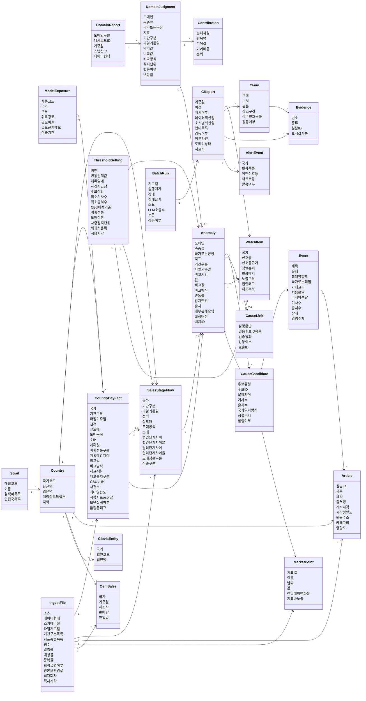

# 도메인 모델

## 0. 이 문서가 다루는 것

C 리포트(종합)를 만드는 데 필요한 개념과 개념 사이의 관계를 정한다. 리포트 이름은 [[TBL-UC-001]] 0절을 따른다. A1 생산·A2 재고·A3 판매는 대시보드에 붙는 리포트이고 C는 그 판정값을 받아 외부 원인을 붙이는 별개 리포트다.

여기서 정하는 것은 "무엇이 있고, 무엇을 담고, 무엇과 이어지는가"다. 속성은 개념 수준의 이름까지만 적는다. 테이블 이름, 컬럼 타입, 길이, 인덱스는 정하지 않는다. 그것은 클래스 명세와 ERD 문서가 정하며, 서버 규칙상 API 문서가 나온 뒤에 만든다.

이 모델의 중심은 **변동**이다. 데이터에서 변동을 먼저 찾고, 그 변동에 원인 후보를 붙이고, 후보가 변동과 얼마나 가까운지를 코드가 센다. 그 값으로 순서와 신호등이 정해진다. 모델은 그 위에 문장만 얹는다. 변동, 후보, 설명이 서로 다른 개념이라는 것과 등급을 개념으로 두지 않는다는 것이 이 문서의 핵심이다.

이 모델의 시간 축과 재고 자리는 인입 샘플 실측([[TBL-RFQ-001#Q59]]~[[TBL-RFQ-001#Q64]])이 정한다. 시간 축은 기준일자 하나가 아니라 기간 구분(일·월·누계·년)과 파일 기준일 둘이다. 재고는 원천이 없어 판매의 단계 차이에서 유도한다. 완성차 데이터의 형태가 둘이므로 값 하나가 어느 파일에서 왔는지도 개념으로 둔다.

## 1. 개념 식별

| 개념 | 한 줄 | 어디서 오나 |
|:--|:--|:--|
| DomainReport | A1·A2·A3 리포트 자체 | 브리핑 갈래 (읽기만) |
| DomainJudgment | A 리포트가 낸 지표별 변동 판정 | 브리핑 갈래 (읽기만) |
| Contribution | 그 변동을 누가 얼마나 만들었나 | 브리핑 갈래 (읽기만) |
| CountryDayFact | 국가와 기간으로 모은 완성차 수치 | 완성차 데이터 집계 |
| SalesStageFlow | 판매 네 단계의 값과 단계 사이의 차이 | 판매 데이터 유도 |
| ModelExposure | 차종이 완성차인가 반조립인가 | 형태 B는 컬럼, 형태 A는 유도 |
| Anomaly | C가 다루는 변동 한 건 | A 판정 우선, 없으면 보완 집계 |
| Article | 기사 한 건 | 뉴스 파일 |
| Event | 같은 사건을 말하는 기사 묶음 | 규칙 묶음 + LLM 명명 |
| MarketPoint | 시장 지표의 하루 관측값 | 블룸버그 파일 |
| OemSales | 해외 OEM 월 판매 | Marklines 파일 |
| CauseCandidate | 변동에 붙은 원인 후보와 그 근접도 | 코드가 검색하고 센다 |
| CauseLink | 후보가 변동과 어떻게 이어지는지에 대한 설명 | H-chat 문장 |
| WatchItem | 오늘 봐야 할 국가 한 줄 | 규칙이 정한 신호등 |
| CReport | 하루치 C 리포트 한 본 | 배치 게시 |
| Claim | 리포트 안 문장 한 덩어리 | H-chat 생성 |
| Evidence | 문장이 가리키는 근거 한 줄 | 코드가 번호 부여 |
| AlertEvent | 워치리스트가 어제와 달라진 것 | 배치 비교 |
| Country | 국가 | 크로스워크 |
| Strait | 해협과 인접국 | 자사 초안 |
| GlovisEntity | 국가에 딸린 글로비스 법인 | 발주자 대기 |
| ThresholdSetting | 판정에 쓴 설정 한 벌 | 운영 |
| IngestFile | 적재한 파일 한 건과 그 형태 | 적재 |
| BatchRun | 배치 실행 한 번 | 운영 |

개념은 스물넷이다. 그중 `SalesStageFlow`는 재고 원천이 없어 재고 신호를 판매 단계 차이에서 유도해야 하므로 두고, `IngestFile`은 완성차 데이터 형태가 둘이어서 값 하나의 기간 단위가 어느 파일에서 왔는지로 정해지므로 둔다. 스물넷의 쓰임은 3장에서 여덟 갈래로 나눠 적는다.

## 2. 개념 모델

읽는 법. 왼쪽이 입력, 가운데가 판단, 오른쪽이 보이는 것이다. `DomainJudgment`에서 `Anomaly`로 가는 선이 A 리포트와 C 리포트를 잇는 유일한 통로다. 문장은 건너오지 않는다.

`IngestFile`이 왼쪽 끝에서 다섯 갈래로 갈라진다. 완성차 데이터의 형태가 둘이고 형태마다 시간 축이 달라, 어느 파일에서 온 값인지를 모르면 그 값의 기간 단위를 알 수 없기 때문이다.

`SalesStageFlow`가 `Anomaly`로 직접 가는 선도 있다. 재고 원천이 없어 재고 변동이 판매 데이터에서 유도돼 나오기 때문이다([[TBL-PRD-001#R30]]).

`CauseCandidate`는 `Event`·`MarketPoint`·`Anomaly` 셋을 가리킨다. 원인 후보는 뉴스일 수도, 시장 지표일 수도, 같은 국가의 다른 도메인 변동일 수도 있다.

`CauseLink`가 변동에 하나만 달리는 것에 주의한다. 후보마다 등급을 매기지 않고 변동마다 설명 하나를 쓰기 때문이다. 설명은 여러 후보를 인용한다.

속성 이름은 개념 수준이다. `재고4종`은 법인재고·딜러재고·항해중·선적대기를 묶어 부른 것이고 현재는 원천이 없어 비어 있다. `도메인상태`는 생산·재고·판매 세 장을 묶은 것이다. 실제 컬럼으로 펼치는 일은 ERD 문서가 한다.

## 3. 개념별 정리

### 3.1 밖에서 받는 것

#### DomainReport A 리포트

A1 생산·A2 재고·A3 판매 중 하나. 대시보드에 붙어 있고 브리핑 갈래가 만든다.

속성: 도메인 구분, 대시보드 식별자, 기준일, 스냅샷 식별자, 그 리포트가 읽은 데이터 형태.
관계: 판정을 여럿 가진다.
판정 근거: C는 이 개념을 만들지 않고 읽기만 한다. 데이터 형태를 함께 받는 것은 같은 지표라도 형태 A와 형태 B에서 기간 단위가 다르기 때문이다. [[TBL-INFRA-001#C5]] · [[TBL-PRD-001#R29]] · [[TBL-PRD-001#R1]]

#### DomainJudgment A 판정

A 리포트가 트래킹 지표 하나에 대해 낸 변동 판정.

속성: 도메인, 축 종류(국가·공장), 국가 또는 공장, 지표, 기간 구분(일·월·누계·년), 파일 기준일, 당기 값, 비교 값, 비교 방식(계획·전년·전월), 감지 단위, 변동 여부, 변동률.
관계: 리포트에 속한다. 기여를 여럿 가진다. C의 변동 하나로 이어진다.
판정 근거: C의 수치가 대시보드와 어긋나면 안 되므로 값을 다시 계산하지 않고 그대로 받는다.

축 종류를 속성으로 둔 데는 이유가 있다. **A1 생산 판정은 국가 축으로 오지 않는다.** 인입 데이터에 목적지 국가 컬럼이 없어 국내·해외와 내수·수출만 있고, 수출이 어느 나라로 가는지가 없다([[TBL-RFQ-001#Q60]]). 그래서 A1은 생산 법인과 공장 단위로만 판정이 오고, 원장 보완 집계로도 국가 축을 만들 수 없다. 축 종류가 공장인 판정은 국가 카드에 오르지 못하고 신호등 판정([[#WatchItem]])에서도 제외된다. 목적지 국가 컬럼이 들어오면 그때 국가 축으로 바뀐다.

비교 방식에 계획이 들어간 것도 실측 반영이다. 인입 샘플에 계획이 들어 있어 계획 대비를 먼저 보고, 없으면 전년 동월, 그다음 전월로 내려간다. 감지 단위는 차종 그룹이 기본이다([[TBL-PRD-001#R8]], PRD 6.15). [[TBL-UC-001#UC-S10]] · [[TBL-PRD-001#R25]]

#### Contribution 내부 분해 기여

변동을 만든 하위 항목과 그 몫. "도매 대비 소매 격차 5.0% 중 칠레가 25.2%"처럼.

속성: 분해 차원(국가·차종그룹·세부차종·공장·차급·대리점), 항목 이름, 기여 값, 기여 비중, 순위.
관계: 판정에 속한다.
판정 근거: A 리포트가 대시보드 안에서 찾은 원인이다. C는 그대로 실어 나르고 다시 계산하지 않는다. 세부 차종은 이 분해에만 쓰이고 감지 단위가 되지 않는다. 파워트레인은 인입 샘플에서 44~53%가 미분류라 분해 차원에서 뺀다. [[TBL-PRD-001#R29]] · [[TBL-PRD-001#R8]]

### 3.2 완성차 수치

#### CountryDayFact 국가·기간 팩트

완성차 데이터를 국가와 기간으로 모은 결합 테이블.

속성: 국가, 기간 구분(일·월·누계·년), 파일 기준일, 선적·실 도매·도매(공식)·소매, 계획 값, 계획 정본 구분, 계획 대안 차이, 비교 값, 비교 방식, 재고 4종, 재고 출처 구분(실측·유도), CBU 비중, 사건 수, 최대 영향도, 시장지표 as-of 값, 보완 집계 여부, 품질 플래그.
관계: 국가에 속한다. 적재 파일에서 만들어진다. 단계 흐름 하나를 가진다. 변동을 만들 수 있다.

판정 근거: **개념 ID는 `CountryDayFact`로 두되 실제 시간 단위는 하루가 아니다.** 인입 샘플이 일별 원장이 아니라 피벗 리포트라 행에 기준일자가 없고, 기간이 헤더에 일·월·누계·년으로 들어 있다([[TBL-RFQ-001#Q59]]). 그래서 한 행의 시간 위치는 기간 구분과 파일 기준일 둘로 정해진다. 형태 A(IF 원장)가 들어오면 기간 구분이 "일"이 되고 파일 기준일이 그 행의 기준일자와 같아져 원래 뜻과 맞아떨어진다. 이름을 바꾸지 않는 것은 삭제된 항목 ID를 재사용하지 않는다는 규약 때문이고, 두 형태가 섞여 들어올 때 일자 기준으로 합치는 것이 기본이라 `Day`라는 이름이 완전히 틀린 것도 아니다. 클래스 명세와 ERD는 이 항목을 기간 단위 테이블로 펼친다.

계획과 비교를 이 팩트에 함께 둔다. **계획이 있으면 계획 대비를 먼저 본다는 규칙이 보완 집계 경로에서도 서게 하려고 계획 값을 결합에서 함께 채운다.** A 판정이 없어 이 팩트에서 직접 변동을 만드는 국가에서도 비교 방식이 계획으로 시작해야 하며, 계획 값이 결합 시점에 붙어 있지 않으면 그 경로만 전년 대비로 내려앉는다. 계획은 운영계획과 사업계획 둘이므로 어느 쪽을 정본으로 썼는지를 계획 정본 구분에 남기고, 쓰지 않은 쪽과의 차이를 계획 대안 차이에 둔다. 생산 누적에서 그 차이가 266,381대이므로 정본을 바꾸면 달성률이 통째로 달라지고, 행이 스스로 그 폭을 말해야 나중에 설명할 수 있다. 비교 값과 비교 방식은 계획·전년·전월 중 무엇과 맞붙은 값인지를 같은 행에서 읽게 한다.

생산 수치는 이 팩트에 들어가지 않는다. 국가 축이 없어 국가로 모을 수 없다. 생산은 A1 판정을 공장 축으로 받아 도메인 상태 한 줄에만 쓴다.

재고 4종은 자리를 남겨 두었지만 현재 전부 비어 있다. 인입 샘플 어디에도 항해중·선적대기·법인재고·딜러재고가 없다([[TBL-RFQ-001#Q61]]). 그 자리를 [[#SalesStageFlow]]가 대신하고, 재고 출처 구분에 유도인지 실측인지를 남긴다. [[TBL-UC-001#UC-S3]] · [[TBL-PRD-001#R7]] · [[TBL-PRD-001#R9]]

#### SalesStageFlow 판매 단계 흐름

판매 네 계열의 값과 단계 사이의 차이. 재고 원천이 없는 동안 재고 신호가 나오는 자리다.

속성: 국가, 기간 구분, 파일 기준일, 선적, 실 도매, 도매(공식), 소매, 법인 구간 차이와 그 비율(선적 대비 도매 정본), 딜러 구간 차이와 그 비율(도매 정본 대비 소매), 도매 정본 구분(실 도매·도매(공식) 중 계산에 쓴 것), 산출 구분(유도·실측).
관계: 국가에 속한다. 적재 파일에서 만들어진다. 국가·기간 팩트 한 행에 붙는다. 체류 변동을 만들 수 있다. 설정 버전을 참조한다.

판정 근거: 판매가 선적, 실 도매, 도매(공식), 소매 네 계열로 들어오므로 단계 사이의 차이가 곧 물량이 어느 단계에 남아 있는지를 가리킨다. 이것이 재고 원천이 없는 동안 재고 신호를 만드는 유일한 길이다([[TBL-PRD-001#R30]], PRD 6.16).

구간은 둘이다. **법인 구간은 선적에서 도매 정본을 뺀 값이고, 딜러 구간은 도매 정본에서 소매를 뺀 값이다.** 화면에는 법인 구간을 "법인 단계 체류", 딜러 구간을 "유통 체류"로 적는다.

구간을 둘로 나눈 것은 실측 때문이다. 미주 누계에서 선적 679,551, 도매 677,201, 소매 643,097이므로 법인 구간은 2,350대이고 딜러 구간은 34,104대(5.0%)다. 앞의 법인 구간은 거의 붙어 있고 뒤의 딜러 구간이 크게 벌어졌다. 국가별로는 칠레 25.2%, 페루 21.2%가 크고 두 나라는 선적과 도매가 정확히 같아 물량이 딜러 단계에서 멈춰 있다. 그래서 신호로 쓸 값은 법인 구간이 아니라 딜러 구간이다. 다만 법인 구간도 캐나다 8.3%처럼 벌어지는 국가가 있어 둘 다 저장한다.

음수를 예외로 두지 않는다. 푸에르토리코 -13.7%, 콜롬비아 -10.5%처럼 소매가 도매를 넘는 국가는 이전에 쌓인 물량을 덜어내는 중이며 그 자체가 읽을 값이다. 방향만 표시한다.

도매 정본 구분을 속성으로 둔 이유는 도매가 두 기준으로 들어오기 때문이다. 실 도매와 도매(공식)의 차이가 미주 누계에서 27,135대다([[TBL-RFQ-001#Q63]]). 어느 쪽으로 계산했는지를 행에 남기지 않으면 같은 국가의 체류율이 설정에 따라 조용히 달라진다.

산출 구분은 유도값임을 화면과 저장 행에 남기기 위한 것이다. 재고 원천이 들어오면 같은 자리를 실측값이 차지하고 유도값은 참고로 내려간다. [[TBL-UC-001#UC-S3]] · [[TBL-PRD-001#R30]] · [[TBL-PRD-001#R9]]

#### ModelExposure 차종 노출

차종이 완성차 수출인지 반조립인지.

속성: 차종 코드, 국가, 구분(CBU·CKD), 취득 경로(컬럼 직독·생산 유도), 유도 비율, 유도 근거 메모, 산출 기준 기간.
관계: 국가·기간 팩트의 CBU 비중 계산에 쓰인다.

판정 근거: **형태 B는 유도하지 않는다.** 인입 샘플의 판매 파일(판매3·5·7)에 `CBU/CKD` 컬럼이 그대로 있어 읽기만 하면 된다. 판매1·2에는 이 컬럼이 없지만 판매3·5·7에 있으므로 형태 B 전체로 보면 유도가 필요 없다([[TBL-RFQ-001#Q62]]).

유도가 필요한 것은 형태 A(IF 원장)다. IF 판매 레이아웃 23열에 이 구분이 없어 생산 모델코드로 유도해야 한다. 그래서 취득 경로를 속성으로 두고 어느 경로로 얻었는지를 행에 남긴다. 유도 실패면 "노출 미확인"이고, 그 국가는 신호등이 RED까지 올라가지 못한다.

**유도 근거 메모는 수치 점수가 아니라 사람 말로 적는다.** 어떤 모델코드를 어떤 기간으로 보고 이 구분에 이르렀는지를 문장으로 남기며, 신뢰도처럼 값이 곧 순서가 되는 수치 칸은 두지 않는다. 수치 칸을 하나 두면 그 값이 판정과 정렬에 쓰이게 되고, 근거를 댈 수 없는 등급이 뒷문으로 되돌아온다. 이 문서가 관련도 등급을 개념에서 뺀 것과 같은 이유다. [[TBL-PRD-001#R10]] · [[TBL-UC-001#UC-S8]]

### 3.3 변동

#### Anomaly 변동

C 리포트가 다루는 변동 한 건. 이 모델의 중심이다.

속성: 도메인, 축 종류(국가·공장), 국가 또는 공장, 지표, 기간 구분(일·월·누계·년), 파일 기준일, 비교 기간, 값, 비교 값, 비교 방식(계획·전년·전월), 변동률, 감지 단위(차종그룹 등), 출처(A 판정·보완 집계·유도), 내부 분해 요약, 설정 버전, 배치 실행.
관계: A 판정에서 오거나 국가·기간 팩트 또는 단계 흐름에서 온다. 원인 후보를 여럿 가지고 설명을 최대 하나 가진다. 워치리스트 항목이 될 수 있다. 다른 변동의 원인 후보가 될 수도 있다.

판정 근거: 변동을 먼저 확정하고 원인은 나중에 붙인다. 순서를 뒤집으면 뉴스가 많은 국가만 계속 올라온다.

**변동의 시간 위치는 기준일 하나가 아니라 기간 구분과 파일 기준일 둘로 잡는다.** 인입 샘플에 행 단위 기준일자가 없어 "9월 3일의 변동"을 만들 수 없다. 만들 수 있는 것은 "이 파일 기준일의 누계 기준 변동"이다. 두 값을 함께 들고 있어야 같은 국가의 월 변동과 누계 변동이 한 화면에서 구분되고, 비교 값이 어느 기간과 맞붙은 것인지 비교 기간으로 확인된다. 형태 A가 들어오면 기간 구분이 "일"이 되고 파일 기준일이 곧 기준일자다. 두 형태가 섞이면 일자를 기준으로 삼고 형태 B를 그 기준일에 붙인다([[TBL-PRD-001#R7]], PRD 6.7).

감지 단위를 속성으로 둔 이유는 세부 차종 단위 감지가 오탐을 만들기 때문이다. 2025년 11월 전년 대비 하락 상위가 넥쏘 FE -100%, 팰리세이드 LX2 2,282대에서 0대인데 셋 다 후속 모델 전환이다([[TBL-RFQ-001#Q64]]). 기본값은 차종 그룹이고, 후속 모델 매핑 표가 들어오면 세부 차종 단위를 다시 본다([[TBL-PRD-001#R8]], PRD 6.15).

출처에 "유도"가 붙은 것은 재고 변동이 [[#SalesStageFlow]]에서 나오기 때문이다. 실측이 아님을 행이 스스로 말해야 화면에서도 그렇게 표시된다. [[TBL-PRD-001#G2]] · [[TBL-UC-001#UC-S3]]

#### ThresholdSetting 설정

판정과 후보 검색에 쓴 값 한 벌.

속성: 버전, 변동 임계값, 체류 임계, 사건 시간창, 후보 상한, 신호등에 필요한 최소 기사 수, 최소 출처 수, CBU 비중 기준, 계획 정본(운영계획·사업계획), 도매 정본(실 도매·도매(공식)), 차종 감지 단위(그룹·세부), 회귀 허용 폭, 적용 시각.
관계: 변동과 단계 흐름과 워치리스트 항목이 이 버전을 참조한다.

판정 근거: 같은 기준일을 다시 돌렸을 때 같은 결과가 나와야 한다. 신호등이 규칙 산출물이 되면서 이 설정이 곧 신호등의 정의가 됐다. 값을 바꾸면 과거가 흔들리므로 판정 행에 버전을 함께 남긴다.

정본 선택 셋을 여기에 둔다. **계획이 두 종류이고 도매가 두 기준이다.** 생산 누적에서 운영계획 1,754,150대와 사업계획 2,020,531대가 266,381대 벌어지고, 판매 누계에서 실 도매 2,356,496대와 도매(공식) 2,383,631대가 27,135대 벌어진다([[TBL-RFQ-001#Q63]]). 둘 다 저장하되 계산에 쓸 쪽은 하나여야 하고, 그 선택이 계획 대비 달성률과 체류율을 통째로 바꾼다. 코드에 상수로 박으면 바뀔 때 과거 판정과의 차이를 설명할 수 없으므로 설정에 두고 버전으로 남긴다. 기본값은 사업계획과 도매(공식)이다([[TBL-UC-001#UC-A1]] 4a).

차종 감지 단위도 같은 이유다. 지금은 그룹이지만 후속 모델 매핑 표가 들어오면 세부로 내려갈 수 있고, 그 전환 시점 전후의 변동 건수 차이를 설정 버전으로 설명해야 한다. [[TBL-PRD-001#N3]] · [[TBL-PRD-001#R11]] · [[TBL-PRD-001#R1]] · [[TBL-INFRA-001#C11]]

### 3.4 외부 데이터

#### Article 기사

뉴스 한 건.

속성: 원본 식별자, 제목, 요약, 출처명, 게시 시각, 시각 정밀도, 원문 주소, 카테고리, 영향도, 국가 태그 여럿.
관계: 국가 여럿에 걸린다. 사건에 속할 수 있다. 적재 파일에서 들어온다.
판정 근거: 가공본과 원본의 컬럼이 다르지만 같은 개념이다. 스키마 버전으로 구분하고 원본 식별자로 중복을 없앤다. 출처명이 있어야 사건별 출처 수를 셀 수 있고, 그 값이 신호등의 입력이다. [[TBL-PRD-001#R3]] · [[TBL-PRD-001#R11]]

#### Event 사건

같은 일을 말하는 기사 묶음.

속성: 제목, 유형, 최대 영향도, 국가 또는 해협, 카테고리, 처음 본 날, 마지막 본 날, 기사 수, 출처 수, 상태, 이름을 누가 붙였나.
관계: 기사를 여럿 가진다. 원인 후보로 쓰인다.
판정 근거: 기사 수로 세면 많이 보도된 나라만 커진다. 묶음은 규칙으로 만들고 이름만 LLM이 붙인다. 심각도는 모델이 매기지 않고 기사에 붙어 온 영향도의 최대값을 쓴다. 한 사건이 몇 개 매체에서 나왔는지가 기사 수보다 중요한 신호라 출처 수를 따로 센다. [[TBL-PRD-001#R4]] · [[TBL-UC-001#UC-S11]]

#### MarketPoint 시장 지표 관측값

지표 하나의 하루 값.

속성: 지표 식별자, 이름, 날짜, 값, 전일 대비 변화율, 지표 바 노출 여부.
관계: 원인 후보로 쓰인다. 리포트 상단 지표 바에 실린다. 적재 파일에서 들어온다.
판정 근거: 국가·차종과 이어지지 않아 조인 축이 날짜뿐이다. 그래서 신호등의 입력이 아니라 후보와 표시용으로만 쓴다. 국가가 걸리지 않는다는 사실 자체가 후보의 근접도 값으로 기록된다. 이 지표는 날짜가 행에 붙어 오므로 완성차 데이터와 달리 기간 구분이 필요 없고, 완성차 쪽이 기간 단위일 때는 그 기간의 마지막 날 기준 as-of 값을 붙인다. [[TBL-PRD-001#R6]] · [[TBL-PRD-001#R5]]

#### OemSales 해외 OEM 월 판매

경쟁사 월 판매 실적.

속성: 국가, 기준월, 제조사, 판매량, 인입일.
관계: 국가에 속한다. 적재 파일에서 들어온다.
판정 근거: 현재 표본이 2019년 두 나라뿐이라 판정에 쓰지 않는다. 자리만 만들어 둔다. [[TBL-PRD-001#R6]]

### 3.5 원인

#### CauseCandidate 원인 후보

변동 하나에 붙은 후보 한 건과 그 근접도. 코드가 찾고 코드가 센다.

속성: 후보 유형(사건·기사·시장지표·타 도메인 변동), 후보 식별자, 날짜 차이, 기사 수, 출처 수, 국가 일치 방식(국가 직접·해협 귀속·같은 국가 다른 도메인·날짜만 일치), 정렬 순서, 잘렸는지 여부.
관계: 변동에 속한다. 사건·시장 지표·다른 변동 중 하나를 가리킨다.
판정 근거: 근접도 값 넷은 전부 셀 수 있는 값이라 화면에 그대로 적고 왜 이 순서인지 보여 줄 수 있다. 정렬은 날짜 차이 오름차순, 같으면 출처 수 내림차순, 그다음 기사 수 내림차순이다. 이 값이 정렬과 신호등([[#WatchItem]])의 유일한 입력이며 모델은 손대지 못한다.

날짜 차이를 세는 기준점은 변동의 파일 기준일이다. 변동이 누계나 년 단위면 기간 폭이 넓어 날짜 차이가 커지므로, 기간 구분이 넓은 변동일수록 후보가 멀어 보인다. 이것은 값이 그렇게 나오는 것이 맞고 화면에 기간 구분을 함께 적어 읽는 사람이 감안하게 한다. 후보 목록은 동시에 LLM이 인용할 수 있는 사실의 전부다. [[TBL-UC-001#UC-S8]] · [[TBL-PRD-001#R26]]

#### CauseLink 연관 설명

이 변동이 후보들과 어떻게 이어지는지를 쓴 문단 하나.

속성: 설명 문단, 인용한 후보 식별자 목록, 검증 통과 여부, 강등 여부, 호출 기록.
관계: 변동에 속한다. 후보 여럿을 인용한다.
판정 근거: 등급은 개념에서 뺐다(PRD 6.14). 모델이 매긴 높음·낮음은 근거를 댈 수 없고 재현되지 않는다. 남는 일은 사람이 읽을 문장을 쓰는 것뿐이며, 그 문장이 후보 밖으로 나가지 않도록 인용 ID를 검증한다. 설명이 없어도 후보와 근접도 값은 화면에 남는다. [[TBL-UC-001#UC-S9]] · [[TBL-PRD-001#R27]]

### 3.6 보이는 것

#### WatchItem 워치리스트 항목

오늘 봐야 할 국가 한 줄.

속성: 국가, 신호등, 신호등 근거(어느 후보의 어떤 값이 기준을 넘었나), 정렬 순서, 변화 배지, 노출 구분, 법인 태그, 대표 후보.
관계: 변동에서 나온다. 설정 버전을 참조한다. 리포트에 실린다.
판정 근거: 신호등은 규칙 산출물이다. 사건 후보가 기사 수·출처 수·시간창 기준을 채우고 완성차 노출이 확인되면 RED, 노출이 미확인이면 YELLOW, 기준에 못 미치면 목록에는 남되 신호등 없음. 근거를 함께 저장해 화면에서 왜 그 색인지 보여 준다. LLM을 꺼도 같은 값이 나온다.

이 개념은 국가 축이 있는 변동만 받는다. 축 종류가 공장인 변동(A1 생산)은 여기 오르지 못한다. 지금 목록을 채우는 것은 판매 변동과 [[#SalesStageFlow]]에서 나온 유도 변동이다. [[TBL-UC-001#UC-S8]] · [[TBL-PRD-001#R11]]

#### CReport C 리포트

하루치 종합 리포트 한 본.

속성: 기준일, 버전, 게시 여부, 데이터 최신일, 소스별 데이터 최신일 셋, 안내 목록(코드·도메인·문구·마지막 성공일), 강등 여부와 사유, 헤드라인, 도메인 상태 세 장, 지표 바.
관계: 워치리스트·문장·근거·변화 알림을 가진다. 배치 실행에 속한다.
판정 근거: 같은 기준일에 여러 버전이 생길 수 있고 게시본은 하나다. 재생성이 기존 게시본을 덮지 않는다.

**데이터 최신일은 소스별 최신일 중 가장 늦은 것이며 파생 값이다.** 소스마다 마지막으로 성공한 날이 달라 완성차·뉴스·시장 지표가 서로 다른 시점에 서 있을 수 있으므로 소스별 최신일 셋을 따로 들고, 데이터 최신일은 그 셋에서 계산한다. 셋 중 하나만 늦어도 데이터 최신일은 최신으로 보이므로, 그 한 소스가 언제부터 멈췄는지는 소스별 값을 봐야 알 수 있다. 데이터 최신일은 리포트 기준일과도 다를 수 있어 기준일과 따로 둔다.

안내 목록은 그 멈춘 자리를 화면에 적기 위한 것이다. 한 줄이 코드·도메인·문구·마지막 성공일 넷을 들고, 어느 도메인의 무엇이 언제까지만 채워졌는지를 읽는 사람에게 그대로 보여 준다. 리포트가 강등되지 않은 경우에도 붙으며, 강등 여부와는 별개다. [[TBL-UC-001#UC-A4]] · [[TBL-PRD-001#R13]]

#### Claim 문장

리포트 안 문장 한 덩어리.

속성: 구역(헤드라인·도메인 상태·카드), 순서, 본문, 강조 구간, 각주 번호 목록, 강등 여부.
관계: 리포트에 속한다. 근거 여럿을 가리킨다.
판정 근거: 문장과 근거를 따로 저장해야 각주를 눌러 근거로 갈 수 있고, 생성이 실패해도 판정값은 남는다. 생산 구역의 문장은 외부 원인을 인용하지 않는다. 국가 축이 없어 이을 자리가 없기 때문이다. [[TBL-PRD-001#R15]] · [[TBL-PRD-001#N2]]

#### Evidence 근거

문장이 가리키는 근거 한 줄.

속성: 번호, 종류, 원본 식별자, 표시용 값 사본.
관계: 리포트에 속한다. 문장 여럿이 가리킨다.
판정 근거: 번호는 모델이 아니라 코드가 먼저 매긴다. 표시값을 복사해 두면 열람할 때 조인이 없어 2초 안에 끝난다. [[TBL-PRD-001#N5]] · [[TBL-INFRA-001#C9]]

#### AlertEvent 워치리스트 변화

어제와 달라진 것 한 건.

속성: 국가, 변화 종류(신규·상승·하강·이탈), 이전 신호등, 새 신호등, 발송 여부.
관계: 리포트에 속한다.
판정 근거: 발송 채널이 정해지지 않아도 기록과 배지는 남긴다. [[TBL-PRD-001#R18]]

### 3.7 마스터

#### Country 국가

속성: 세 자리 코드, 한글명, 영문명, 대리점 코드 접두, 지역.
관계: 팩트·단계 흐름·기사·법인·변동이 이 축으로 모인다.
판정 근거: 모든 결합의 축이다. 판매는 대리점 코드 앞 세 자리로 붙고 실측으로 확인됐다(미국 B28AB, 캐나다 B06AA). 뉴스는 태그로 붙는다. 생산은 이 축에 붙지 못한다. [[TBL-PRD-001#R2]]

#### Strait 해협

속성: 해협 코드, 이름, 검색어 목록, 인접국 목록.
관계: 국가 여럿에 이어진다.
판정 근거: 호르무즈 기사가 오만·아랍에미리트에 붙지 않으면 중동 변동의 원인 후보가 비어 버린다. 해협으로 붙은 후보는 국가 일치 방식에 "해협 귀속"으로 기록돼 직접 걸린 후보와 구분된다. 자사가 초안을 만들고 자사 데이터베이스 관리자가 검토한다. [[TBL-PRD-001#R26]]

#### GlovisEntity 글로비스 법인

속성: 국가, 법인 코드, 법인명.
관계: 국가에 속한다.
판정 근거: 발주자에게 받아야 채워진다. 빈 동안에는 법인 미매핑으로 표시하고 오류로 보지 않는다. [[TBL-PRD-001#R12]]

### 3.8 운영

#### IngestFile 적재 파일

적재한 파일 한 건과 그 형태, 그리고 그 회차의 품질 수치.

속성: 소스(완성차 생산·완성차 판매·뉴스·블룸버그·Marklines·크로스워크), 데이터 형태(A: IF 원장, B: 피벗 리포트), 스키마 버전, 파일 기준일, 그 파일에 들어 있던 기간 구분 목록, 지표 종류 목록, 행수, 결측률, 매칭률, 중복률, 회귀 급변 여부, 원본 보관 경로, 적재 회차, 적재 시각.
관계: 팩트·단계 흐름·기사·시장 지표·OEM 판매를 만든다.

판정 근거: **적재를 절차로만 두지 않고 개념으로 둔다.** 완성차 데이터의 형태가 둘이라 값 하나의 뜻이 어느 파일에서 왔는지에 따라 달라지기 때문이다. 형태 A의 행은 기준일자를 스스로 들고 있지만 형태 B의 행은 파일이 붙여 준 기준일만 가진다([[TBL-PRD-001#R1]]). 이 사실을 값 쪽에 복사해 두는 것만으로는 부족하다. 재적재 범위가 형태마다 다르기 때문이다. 형태 A는 기준일자 단위로 멱등이고 형태 B는 파일 기준일 단위로 통째 덮어쓴다. 어느 단위로 덮을지는 파일을 알아야 정해진다.

회귀 검사 수치를 이 개념에 함께 둔 이유는 비교 대상이 직전 파일이기 때문이다. 같은 소스의 형태가 직전과 달라진 것 자체를 급변으로 보므로([[TBL-UC-001#UC-S6]]), 형태와 수치가 한 행에 있어야 그 비교가 성립한다. 적재 회차는 같은 기준일 파일이 여러 번 들어올 때 몇 번째인지이며, 재현 시 어느 회차를 봤는지를 가리킨다.

이 개념은 적재 절차 그 자체가 아니다. 절차는 유스케이스가 정하고([[TBL-UC-001#UC-A1]]), 여기서 두는 것은 "그 파일이 무엇이었는가"라는 사실 한 줄이다. [[TBL-PRD-001#R1]] · [[TBL-PRD-001#N7]] · [[TBL-PRD-001#N8]]

#### BatchRun 배치 실행

속성: 기준일, 실행 계기, 상태, 실패 단계, 단계별 소요와 건수, LLM 호출 수와 토큰, 강등 여부.
관계: 리포트를 만든다. 산출 행에 실행 식별자가 찍힌다.
판정 근거: 기준일과 실행 식별자 두 축이 있어야 "언제 데이터인가"와 "언제 계산했는가"를 구분한다. 여기에 파일 기준일이 더해져 축이 셋이다. 데이터가 말하는 시점(파일 기준일), 리포트가 서 있는 시점(기준일), 계산한 시점(실행) 셋이 전부 다를 수 있다. [[TBL-INFRA-001#C11]] · [[TBL-PRD-001#R24]]

## 4. 경계

**밖에 있는 것.** A 리포트를 만드는 과정 전체, 태블로 대시보드의 시트 구조, 뉴스 API가 기사에 붙이는 분류와 영향도. 앞의 둘은 다른 팀이 만들고 마지막 것은 이미 붙어서 들어온다.

**닿지만 소유하지 않는 것.** A 판정과 기여는 브리핑 갈래가 소유한다. C는 기준일마다 스냅샷을 복사해 두고 그 식별자를 남긴다. 원본이 나중에 바뀌어도 그날 리포트는 그대로 재현된다.

**의도적으로 나눈 것.** 변동, 원인 후보, 연관 설명 셋이다. 첫째는 데이터에서 나오고 둘째는 코드가 찾아 세고 셋째는 모델이 쓴다. 하나로 합치면 규칙과 모델의 경계가 사라진다. 나눠 두었기 때문에 모델이 멈춰도 앞의 둘이 그대로 남는다.

**개념으로 두지 않은 것 하나.** 관련도 등급이다. 모델이 매기면 근거를 댈 수 없고 재현되지 않는다. 등급 대신 후보가 근접도 값 넷을 들고 있고, 그 값으로 순서와 신호등이 정해진다. 규칙 점수를 하나로 합친 종합 점수도 두지 않는다. 가중치의 근거가 다시 임의가 되기 때문이다(PRD 6.14).

**개념으로 두지 않은 것 둘.** 기간 구분이다. 일·월·누계·년은 값이지 개념이 아니다. 별도 개념으로 세우면 팩트·변동·판정이 전부 그것을 참조하게 되는데, 실제로 필요한 것은 "이 행이 어느 기간을 말하는가" 한 칸뿐이다.

**의도적으로 합치지 않은 것.** 사건과 기사다. 기사 하나가 곧 사건인 경우가 많지만, 같은 일을 말하는 기사가 수백 건이면 언급 빈도가 신호를 왜곡한다. 국가·기간 팩트와 판매 단계 흐름도 합치지 않았다. 키가 같아 한 테이블로 둘 수 있지만, 단계 흐름은 유도값이고 재고 원천이 들어오면 실측값에 자리를 내주는 개념이라 교체 범위를 따로 잡아 둔다.

**아직 개념으로 두지 않은 것.** 현업 피드백이다. 시나리오에서 빠졌으므로 개념도 만들지 않는다. 나중에 넣으면 연관 설명에 매달린다.

### 4.1 실측으로 확정된 경계

2026-09-16 자사 직접 집계로 확인된 것이다. 추정이 아니라 파일을 열어 센 결과이며, 아래 셋은 이 모델이 무엇을 못 만드는지를 정한다.

**생산은 국가 축이 없다.** 생산 데이터에 국내·해외와 내수·수출은 있지만 목적지 국가가 없다([[TBL-RFQ-001#Q60]]). 그래서 생산 변동은 국가로 모이지 못하고, 국가를 축으로 하는 뉴스와 만날 수 없으며, 워치리스트와 국가 카드에 오르지 못한다. 모델에서는 [[#DomainJudgment]]와 [[#Anomaly]]의 축 종류가 "공장"이 되는 것으로 나타나고, [[#CountryDayFact]]에 생산 수치가 들어가지 않는 것으로 나타난다. 생산이 C 리포트에 들어가는 자리는 도메인 상태 한 줄뿐이다. 목적지 국가 컬럼을 받을 수 있는지는 미결이다.

**재고는 원천이 없다.** 항해중·선적대기·법인재고·딜러재고가 인입 샘플 어디에도 없다([[TBL-RFQ-001#Q61]]). 남은 흔적인 판매1의 재고 컬럼은 국가가 없고 MOS 최솟값이 -3.03이라 쓸 수 없다. 그래서 재고 신호는 [[#SalesStageFlow]]의 단계 차이에서 유도한다. 모델에서는 [[#CountryDayFact]]의 재고 4종이 비어 있고 재고 출처 구분이 "유도"인 것으로 나타난다. 이것은 재고의 대체물이지 재고가 아니며, 원천이 들어오면 같은 자리를 실측값이 차지한다.

**세부 차종은 감지 단위가 아니다.** 판매1 실측에서 세부 차종 97종 중 47개월 내내 팔린 것은 8종뿐이고, 나머지는 중간에 생기거나 사라진다. 세부 차종 단위로 전년 대비를 돌리면 모델 교체가 전부 -100%로 잡힌다([[TBL-RFQ-001#Q64]]). 그래서 감지는 차종 그룹 단위이고 세부 차종은 [[#Contribution]] 분해에만 쓰인다. 모델에서는 [[#Anomaly]]의 감지 단위 속성과 [[#ThresholdSetting]]의 차종 감지 단위로 나타난다. 후속 모델 매핑 표가 들어오면 다시 본다.

**국가와 차종이 함께 있는 데이터는 미주뿐이다.** 실적이 채워진 국가별 차종 데이터는 미주 29개국이고, 168개국이 들어 있는 파일은 실적이 비어 있다([[TBL-RFQ-001#Q62]]). 이것은 개념의 경계가 아니라 데이터 커버리지의 경계다. [[#Country]]는 179개국을 담지만 [[#CountryDayFact]]에 행이 생기는 국가는 현재 미주뿐이다. 이 차이를 숨기지 않고 화면에 적는다.

## 5. 미결사항

- [ ] **완성차 데이터의 정본이 형태 A인가 형태 B인가.** 이 답에 따라 [[#Anomaly]]와 [[#CountryDayFact]]의 기간 축이 일자로 좁혀지거나 기간 구분으로 남는다. 현재는 둘 다 읽는 것으로 둔다 ([[TBL-PRD-001#R1]])
- [ ] 재고 원천(항해중·선적대기·법인·딜러)을 받을 수 있는지. 받으면 [[#SalesStageFlow]]는 유도값에서 참고값으로 내려가고 [[#CountryDayFact]]의 재고 4종이 채워진다
- [ ] 계획 정본(운영계획·사업계획)과 도매 정본(실 도매·도매(공식)). 발주자 회신 전까지 사업계획·도매(공식)을 기본값으로 둔다 ([[#ThresholdSetting]])
- [ ] 생산에 목적지 국가 컬럼을 추가할 수 있는지. 되면 [[#DomainJudgment]]의 축 종류가 국가가 되고 생산이 워치리스트에 오른다
- [ ] 세부 차종 후속 모델 매핑 표. 들어오면 [[#ThresholdSetting]]의 차종 감지 단위를 세부로 내릴지 다시 본다
- [ ] 전 세계 국가별 실적을 차종과 함께 받을 수 있는지. 현재 [[#CountryDayFact]]가 채워지는 범위는 미주뿐이다
- [ ] A 판정 스냅샷의 실제 구조. 브리핑 갈래가 무엇을 어떤 키로 내주는지 확인해야 [[#DomainJudgment]]와 [[#Contribution]]의 속성이 확정된다
- [ ] 대시보드 3본에 국가 차원 시트가 들어가는지. 없으면 보완 집계 비중이 커진다
- [ ] 신호등 기준값. 최소 기사 수, 최소 출처 수, 시간창, CBU 비중 기준. 현업 검토가 필요하다
- [ ] 근접도 값 넷으로 충분한지. 기간 구분이 넓은 변동에서 날짜 차이가 불리하게 나오는 것을 보정할지, 값을 그대로 두고 화면에서 감안하게 할지
- [ ] [[#SalesStageFlow]]의 법인 구간(선적 대비 도매 정본)을 개념에 남길지. 실측에서 대부분 국가가 0이고 캐나다·브라질만 값이 있다. 지금은 남겨 두었다
- [ ] 변동의 단위. 지표마다 한 건인지 국가마다 한 건인지. 현재는 도메인·국가(또는 공장)·지표·기간 구분 넷으로 본다
- [ ] [[#CountryDayFact]]를 매핑된 국가 전부에 만들지, 데이터 있는 국가만 만들지
- [ ] [[#IngestFile]]의 적재 회차를 몇 개까지 보관할지. 원본 보존([[TBL-PRD-001#N7]])과 별개로 파생 행을 몇 회차까지 남길지
- [ ] 글로비스 법인 매핑 표 수령 여부
- [ ] 해협과 인접국 표의 범위. 호르무즈 외에 무엇을 넣을지
