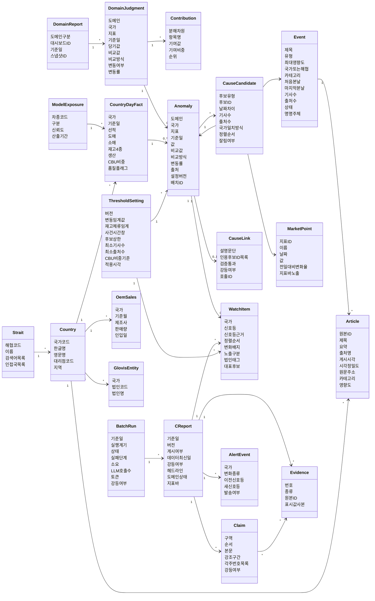

# 도메인 모델

## 0. 이 문서가 다루는 것

C 리포트(종합)를 만드는 데 필요한 개념과 개념 사이의 관계를 정한다. 리포트 이름은 [[TBL-UC-001]] 0절을 따른다. A1 생산·A2 재고·A3 판매는 대시보드에 붙는 리포트이고 C는 그 판정값을 받아 외부 원인을 붙이는 별개 리포트다.

여기서 정하는 것은 "무엇이 있고, 무엇을 담고, 무엇과 이어지는가"다. 속성은 개념 수준의 이름까지만 적는다. 테이블 이름, 컬럼 타입, 길이, 인덱스는 정하지 않는다. 그것은 클래스 명세와 ERD 문서가 정하며, 서버 규칙상 API 문서가 나온 뒤에 만든다.

이 모델의 중심은 **변동**이다. 데이터에서 변동을 먼저 찾고, 그 변동에 원인 후보를 붙이고, 후보가 변동과 얼마나 가까운지를 코드가 센다. 그 값으로 순서와 신호등이 정해진다. 모델은 그 위에 문장만 얹는다. 변동, 후보, 설명이 서로 다른 개념이라는 것과 등급을 개념으로 두지 않는다는 것이 이 문서의 핵심이다.

## 1. 개념 식별

| 개념 | 한 줄 | 어디서 오나 |
|:--|:--|:--|
| DomainReport | A1·A2·A3 리포트 자체 | 브리핑 갈래 (읽기만) |
| DomainJudgment | A 리포트가 낸 지표별 변동 판정 | 브리핑 갈래 (읽기만) |
| Contribution | 그 변동을 누가 얼마나 만들었나 | 브리핑 갈래 (읽기만) |
| CountryDayFact | 국가와 날짜로 모은 완성차 수치 | 완성차 원장 집계 |
| Anomaly | C가 다루는 변동 한 건 | A 판정 우선, 없으면 보완 집계 |
| Article | 기사 한 건 | 뉴스 파일 |
| Event | 같은 사건을 말하는 기사 묶음 | 규칙 묶음 + LLM 명명 |
| MarketPoint | 시장 지표의 하루 관측값 | 블룸버그 파일 |
| OemSales | 해외 OEM 월 판매 | Marklines 파일 |
| CauseCandidate | 변동에 붙은 원인 후보와 그 근접도 | 코드가 검색하고 센다 |
| CauseLink | 후보가 변동과 어떻게 이어지는지에 대한 설명 | H-chat 문장 |
| WatchItem | 오늘 봐야 할 국가 한 줄 | 규칙이 정한 신호등 |
| CReport | 하루치 C 리포트 한 본 | 배치 게시 |
| Claim | 리포트 안 문장 한 덩어리 | H-chat 생성 |
| Evidence | 문장이 가리키는 근거 한 줄 | 코드가 번호 부여 |
| AlertEvent | 워치리스트가 어제와 달라진 것 | 배치 비교 |
| Country | 국가 | 크로스워크 |
| Strait | 해협과 인접국 | 자사 초안 |
| GlovisEntity | 국가에 딸린 글로비스 법인 | 발주자 대기 |
| ModelExposure | 차종이 CBU인가 CKD인가 | 생산 원장 유도 |
| ThresholdSetting | 판정에 쓴 설정 한 벌 | 운영 |
| BatchRun | 배치 실행 한 번 | 운영 |

## 2. 개념 모델

읽는 법. 왼쪽이 입력, 가운데가 판단, 오른쪽이 보이는 것이다. `DomainJudgment`에서 `Anomaly`로 가는 선이 A 리포트와 C 리포트를 잇는 유일한 통로다. 문장은 건너오지 않는다.

`CauseCandidate`가 `Event`·`MarketPoint`·`Anomaly` 셋을 가리키는 것이 이 모델의 특징이다. 원인 후보는 뉴스일 수도, 시장 지표일 수도, 같은 국가의 다른 도메인 변동일 수도 있다.

`CauseLink`가 변동에 하나만 달리는 것에 주의한다. 후보마다 등급을 매기던 구조에서 변동마다 설명 하나를 쓰는 구조로 바뀌었다. 설명은 여러 후보를 인용한다.

속성 이름은 개념 수준이다. `재고4종`은 법인재고·딜러재고·항해중·선적대기를 묶어 부른 것이고, `도메인상태`는 생산·재고·판매 세 장을 묶은 것이다. 실제 컬럼으로 펼치는 일은 ERD 문서가 한다.

## 3. 개념별 정리

### 3.1 밖에서 받는 것

#### DomainReport A 리포트

A1 생산·A2 재고·A3 판매 중 하나. 대시보드에 붙어 있고 브리핑 갈래가 만든다.

속성: 도메인 구분, 대시보드 식별자, 기준일, 스냅샷 식별자.
관계: 판정을 여럿 가진다.
판정 근거: C는 이 개념을 만들지 않고 읽기만 한다. [[TBL-INFRA-001#C5]] · [[TBL-PRD-001#R29]]

#### DomainJudgment A 판정

A 리포트가 트래킹 지표 하나에 대해 낸 변동 판정.

속성: 도메인, 국가, 지표, 기준일, 당기 값, 비교 값, 비교 방식(전년·전월), 변동 여부, 변동률.
관계: 리포트에 속한다. 기여를 여럿 가진다. C의 변동 하나로 이어진다.
판정 근거: C의 수치가 대시보드와 어긋나면 안 되므로 값을 다시 계산하지 않고 그대로 받는다. [[TBL-UC-001#UC-S10]] · [[TBL-PRD-001#R25]]

#### Contribution 내부 분해 기여

변동을 만든 하위 항목과 그 몫. "도매 감소분의 9할은 중동 2개국"처럼.

속성: 분해 차원(국가·차종·공장), 항목 이름, 기여 값, 기여 비중, 순위.
관계: 판정에 속한다.
판정 근거: A 리포트가 대시보드 안에서 찾은 원인이다. C는 그대로 실어 나르고 다시 계산하지 않는다. [[TBL-PRD-001#R29]]

### 3.2 완성차 수치

#### CountryDayFact 국가·일 팩트

완성차 원장을 국가와 날짜로 모은 것.

속성: 국가, 기준일, 선적·도매·소매 합, 법인재고·딜러재고·항해중·선적대기, 총재고, 생산 합, CBU 비중, 상위 차종, 품질 플래그.
관계: 국가에 속한다. 변동을 만들 수 있다.
판정 근거: A 판정이 국가 단위가 아닌 지표를 메우는 보완 집계의 재료다. 대시보드에 국가 시트가 없어도 C가 국가 단위로 말할 수 있어야 한다. [[TBL-UC-001#UC-S3]] · [[TBL-PRD-001#R7]]

#### ModelExposure 차종 노출

차종이 완성차 수출인지 반조립인지.

속성: 차종 코드, 구분, 신뢰도, 산출 기준 기간.
관계: 국가·일 팩트의 CBU 비중 계산에 쓰인다.
판정 근거: 판매 원장에 이 구분이 없어 생산 원장에서 유도한다. 유도 실패면 노출 미확인으로 두고 신호등을 올리지 않는다. [[TBL-PRD-001#R10]]

### 3.3 변동

#### Anomaly 변동

C 리포트가 다루는 변동 한 건. 이 모델의 중심이다.

속성: 도메인, 국가, 지표, 기준일, 값, 비교 값, 비교 방식, 변동률, 출처(A 판정인가 보완 집계인가), 내부 분해 요약, 설정 버전, 배치 실행.
관계: A 판정에서 오거나 국가·일 팩트에서 온다. 원인 후보를 여럿 가지고 설명을 최대 하나 가진다. 워치리스트 항목이 될 수 있다. 다른 변동의 원인 후보가 될 수도 있다.
판정 근거: 변동을 먼저 확정하고 원인은 나중에 붙인다. 순서를 뒤집으면 뉴스가 많은 국가만 계속 올라온다. [[TBL-PRD-001#G2]] · [[TBL-UC-001#UC-S3]]

#### ThresholdSetting 설정

판정과 후보 검색에 쓴 값 한 벌.

속성: 버전, 변동 임계값, 재고 체류 임계, 사건 시간창, 후보 상한, 신호등에 필요한 최소 기사 수, 최소 출처 수, CBU 비중 기준, 회귀 허용 폭, 적용 시각.
관계: 변동과 워치리스트 항목이 이 버전을 참조한다.
판정 근거: 같은 기준일을 다시 돌렸을 때 같은 결과가 나와야 한다. 신호등이 규칙 산출물이 되면서 이 설정이 곧 신호등의 정의가 됐다. 값을 바꾸면 과거가 흔들리므로 판정 행에 버전을 함께 남긴다. [[TBL-PRD-001#N3]] · [[TBL-PRD-001#R11]] · [[TBL-INFRA-001#C11]]

### 3.4 외부 데이터

#### Article 기사

뉴스 한 건.

속성: 원본 식별자, 제목, 요약, 출처명, 게시 시각, 시각 정밀도, 원문 주소, 카테고리, 영향도, 국가 태그 여럿.
관계: 국가 여럿에 걸린다. 사건에 속할 수 있다.
판정 근거: 가공본과 원본의 컬럼이 다르지만 같은 개념이다. 스키마 버전으로 구분하고 원본 식별자로 중복을 없앤다. 출처명이 있어야 사건별 출처 수를 셀 수 있고, 그 값이 신호등의 입력이다. [[TBL-PRD-001#R3]] · [[TBL-PRD-001#R11]]

#### Event 사건

같은 일을 말하는 기사 묶음.

속성: 제목, 유형, 최대 영향도, 국가 또는 해협, 카테고리, 처음 본 날, 마지막 본 날, 기사 수, 출처 수, 상태, 이름을 누가 붙였나.
관계: 기사를 여럿 가진다. 원인 후보로 쓰인다.
판정 근거: 기사 수로 세면 많이 보도된 나라만 커진다. 묶음은 규칙으로 만들고 이름만 LLM이 붙인다. 심각도는 모델이 매기지 않고 기사에 붙어 온 영향도의 최대값을 쓴다. 한 사건이 몇 개 매체에서 나왔는지가 기사 수보다 중요한 신호라 출처 수를 따로 센다. [[TBL-PRD-001#R4]] · [[TBL-UC-001#UC-S11]]

#### MarketPoint 시장 지표 관측값

지표 하나의 하루 값.

속성: 지표 식별자, 이름, 날짜, 값, 전일 대비 변화율, 지표 바 노출 여부.
관계: 원인 후보로 쓰인다. 리포트 상단 지표 바에 실린다.
판정 근거: 국가·차종과 이어지지 않아 조인 축이 날짜뿐이다. 그래서 신호등의 입력이 아니라 후보와 표시용으로만 쓴다. 국가가 걸리지 않는다는 사실 자체가 후보의 근접도 값으로 기록된다. [[TBL-PRD-001#R6]]

#### OemSales 해외 OEM 월 판매

경쟁사 월 판매 실적.

속성: 국가, 기준월, 제조사, 판매량, 인입일.
관계: 국가에 속한다.
판정 근거: 현재 표본이 2019년 두 나라뿐이라 판정에 쓰지 않는다. 자리만 만들어 둔다. [[TBL-PRD-001#R5]]

### 3.5 원인

#### CauseCandidate 원인 후보

변동 하나에 붙은 후보 한 건과 그 근접도. 코드가 찾고 코드가 센다.

속성: 후보 유형(사건·기사·시장지표·타 도메인 변동), 후보 식별자, 날짜 차이, 기사 수, 출처 수, 국가 일치 방식(국가 직접·해협 귀속·같은 국가 다른 도메인·날짜만 일치), 정렬 순서, 잘렸는지 여부.
관계: 변동에 속한다. 사건·시장 지표·다른 변동 중 하나를 가리킨다.
판정 근거: 근접도 값 넷은 전부 셀 수 있는 값이라 화면에 그대로 적고 왜 이 순서인지 보여 줄 수 있다. 이 값이 정렬과 신호등([[#WatchItem]])의 유일한 입력이며 모델은 손대지 못한다. 후보 목록은 동시에 LLM이 인용할 수 있는 사실의 전부다. [[TBL-UC-001#UC-S8]] · [[TBL-PRD-001#R26]]

#### CauseLink 연관 설명

이 변동이 후보들과 어떻게 이어지는지를 쓴 문단 하나.

속성: 설명 문단, 인용한 후보 식별자 목록, 검증 통과 여부, 강등 여부, 호출 기록.
관계: 변동에 속한다. 후보 여럿을 인용한다.
판정 근거: 등급은 개념에서 뺐다(PRD 6.14). 모델이 매긴 높음·낮음은 근거를 댈 수 없고 재현되지 않는다. 남는 일은 사람이 읽을 문장을 쓰는 것뿐이며, 그 문장이 후보 밖으로 나가지 않도록 인용 ID를 검증한다. 설명이 없어도 후보와 근접도 값은 화면에 남는다. [[TBL-UC-001#UC-S9]] · [[TBL-PRD-001#R27]]

### 3.6 보이는 것

#### WatchItem 워치리스트 항목

오늘 봐야 할 국가 한 줄.

속성: 국가, 신호등, 신호등 근거(어느 후보의 어떤 값이 기준을 넘었나), 정렬 순서, 변화 배지, 노출 구분, 법인 태그, 대표 후보.
관계: 변동에서 나온다. 설정 버전을 참조한다. 리포트에 실린다.
판정 근거: 신호등은 규칙 산출물이다. 사건 후보가 기사 수·출처 수·시간창 기준을 채우고 CBU 노출이 확인되면 RED, 노출이 미확인이면 YELLOW, 기준에 못 미치면 목록에는 남되 신호등 없음. 근거를 함께 저장해 화면에서 왜 그 색인지 보여 준다. LLM을 꺼도 같은 값이 나온다. [[TBL-UC-001#UC-S8]] · [[TBL-PRD-001#R11]]

#### CReport C 리포트

하루치 종합 리포트 한 본.

속성: 기준일, 버전, 게시 여부, 데이터 최신일, 강등 여부와 사유, 헤드라인, 도메인 상태 세 장, 지표 바.
관계: 워치리스트·문장·근거·변화 알림을 가진다. 배치 실행에 속한다.
판정 근거: 같은 기준일에 여러 버전이 생길 수 있고 게시본은 하나다. 재생성이 기존 게시본을 덮지 않는다. [[TBL-UC-001#UC-A4]] · [[TBL-PRD-001#R13]]

#### Claim 문장

리포트 안 문장 한 덩어리.

속성: 구역(헤드라인·도메인 상태·카드), 순서, 본문, 강조 구간, 각주 번호 목록, 강등 여부.
관계: 리포트에 속한다. 근거 여럿을 가리킨다.
판정 근거: 문장과 근거를 따로 저장해야 각주를 눌러 근거로 갈 수 있고, 생성이 실패해도 판정값은 남는다. [[TBL-PRD-001#R15]] · [[TBL-PRD-001#N2]]

#### Evidence 근거

문장이 가리키는 근거 한 줄.

속성: 번호, 종류, 원본 식별자, 표시용 값 사본.
관계: 리포트에 속한다. 문장 여럿이 가리킨다.
판정 근거: 번호는 모델이 아니라 코드가 먼저 매긴다. 표시값을 복사해 두면 열람할 때 조인이 없어 2초 안에 끝난다. [[TBL-PRD-001#N5]] · [[TBL-INFRA-001#C9]]

#### AlertEvent 워치리스트 변화

어제와 달라진 것 한 건.

속성: 국가, 변화 종류(신규·상승·하강·이탈), 이전 신호등, 새 신호등, 발송 여부.
관계: 리포트에 속한다.
판정 근거: 발송 채널이 정해지지 않아도 기록과 배지는 남긴다. [[TBL-PRD-001#R18]]

### 3.7 마스터

#### Country 국가

속성: 세 자리 코드, 한글명, 영문명, 대리점 코드, 지역.
관계: 팩트·기사·법인·변동이 이 축으로 모인다.
판정 근거: 모든 결합의 축이다. 판매는 대리점 코드 앞 세 자리, 생산은 공장, 뉴스는 태그로 이 축에 붙는다. [[TBL-PRD-001#R2]]

#### Strait 해협

속성: 해협 코드, 이름, 검색어 목록, 인접국 목록.
관계: 국가 여럿에 이어진다.
판정 근거: 호르무즈 기사가 오만·아랍에미리트에 붙지 않으면 중동 변동의 원인 후보가 비어 버린다. 해협으로 붙은 후보는 국가 일치 방식에 "해협 귀속"으로 기록돼 직접 걸린 후보와 구분된다. 자사가 초안을 만들고 자사 데이터베이스 관리자가 검토한다. [[TBL-PRD-001#R26]]

#### GlovisEntity 글로비스 법인

속성: 국가, 법인 코드, 법인명.
관계: 국가에 속한다.
판정 근거: 발주자에게 받아야 채워진다. 빈 동안에는 법인 미매핑으로 표시하고 오류로 보지 않는다. [[TBL-PRD-001#R12]]

### 3.8 운영

#### BatchRun 배치 실행

속성: 기준일, 실행 계기, 상태, 실패 단계, 단계별 소요와 건수, LLM 호출 수와 토큰, 강등 여부.
관계: 리포트를 만든다. 산출 행에 실행 식별자가 찍힌다.
판정 근거: 기준일과 실행 식별자 두 축이 있어야 "언제 데이터인가"와 "언제 계산했는가"를 구분한다. [[TBL-INFRA-001#C11]] · [[TBL-PRD-001#R24]]

## 4. 경계

**밖에 있는 것.** A 리포트를 만드는 과정 전체, 태블로 대시보드의 시트 구조, 뉴스 API가 기사에 붙이는 분류와 영향도. 앞의 둘은 다른 팀이 만들고 마지막 것은 이미 붙어서 들어온다.

**닿지만 소유하지 않는 것.** A 판정과 기여는 브리핑 갈래가 소유한다. C는 기준일마다 스냅샷을 복사해 두고 그 식별자를 남긴다. 원본이 나중에 바뀌어도 그날 리포트는 그대로 재현된다.

**의도적으로 나눈 것.** 변동, 원인 후보, 연관 설명 셋이다. 첫째는 데이터에서 나오고 둘째는 코드가 찾아 세고 셋째는 모델이 쓴다. 하나로 합치면 규칙과 모델의 경계가 사라진다. 나눠 두었기 때문에 모델이 멈춰도 앞의 둘이 그대로 남는다.

**개념으로 두지 않은 것 하나.** 관련도 등급이다. 모델이 매기면 근거를 댈 수 없고 재현되지 않는다. 등급 대신 후보가 근접도 값 넷을 들고 있고, 그 값으로 순서와 신호등이 정해진다. 규칙 점수를 하나로 합친 종합 점수도 두지 않는다. 가중치의 근거가 다시 임의가 되기 때문이다(PRD 6.14).

**의도적으로 합치지 않은 것.** 사건과 기사다. 기사 하나가 곧 사건인 경우가 많지만, 같은 일을 말하는 기사가 수백 건이면 언급 빈도가 신호를 왜곡한다.

**아직 개념으로 두지 않은 것.** 현업 피드백이다. 시나리오에서 빠졌으므로 개념도 만들지 않는다. 나중에 넣으면 연관 설명에 매달린다.

## 5. 미결사항

- [ ] A 판정 스냅샷의 실제 구조. 브리핑 갈래가 무엇을 어떤 키로 내주는지 확인해야 DomainJudgment와 Contribution의 속성이 확정된다
- [ ] 신호등 기준값. 최소 기사 수, 최소 출처 수, 시간창, CBU 비중 기준. 현업 검토가 필요하다
- [ ] 근접도 값 넷으로 충분한지. 사건 지속 일수나 기사 영향도를 더할지
- [ ] 판매 원장 자연키 중복을 합칠지 최신만 둘지. 현재는 전부 보존하고 표시만 한다
- [ ] 변동의 단위. 지표마다 한 건인지 국가마다 한 건인지. 현재는 도메인·국가·지표 셋으로 본다
- [ ] 국가·일 팩트를 매핑된 국가 전부에 만들지, 데이터 있는 국가만 만들지
- [ ] 글로비스 법인 매핑 표 수령 여부
- [ ] 해협과 인접국 표의 범위. 호르무즈 외에 무엇을 넣을지
