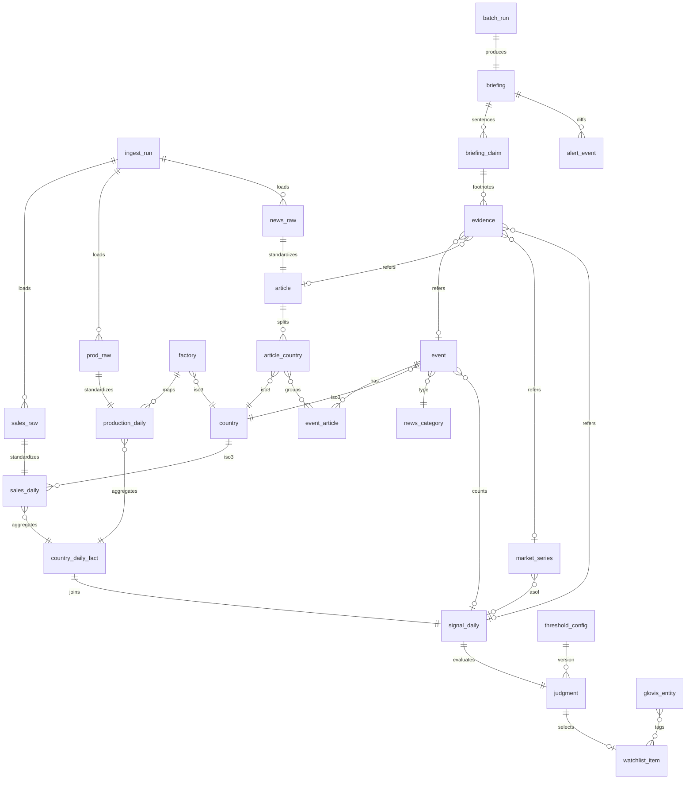

# 도메인 모델 / ERD·DD

## 0. 이 문서가 다루는 것

A 방식 데이터마트의 테이블 전부를 컬럼 단위로 정의한다. 층은 L0 원본, L1 표준화, 마스터, L2 사건·집계, L3 결합, L4 판정·브리핑, 운영이다. 항목 ID는 테이블명(소문자)이다. 타입은 postgres 기준이며 `date`는 발생일, `*_run_id`는 적재·배치 시점이다. 두 시간축을 구분하는 것이 이 모델의 핵심이다.

공통 컬럼(모든 표에 있으나 생략): `id bigserial pk`, `created_at timestamptz`, 그리고 L0~L3에는 `ingest_run_id` 또는 `batch_run_id`.

## 1. 개념 식별

| 개념 | 한 줄 | 층 |
|:--|:--|:--|
| 원본 행 | 받은 파일의 행을 그대로 | L0 |
| 완성차 일 실적 | 공장·대리점 × 모델 × 일의 생산·판매·재고 | L1 |
| 기사 | 뉴스 API 결과 1건, 국가별로 분해 | L1 |
| 시장 시계열 | identifier × 일의 값 | L1 |
| OEM 월 실적 | Marklines 국가 × 브랜드 × 모델 × 월 | L1 |
| 마스터 | 국가·공장·카테고리·라우팅·지표·해협·법인·모델 매핑 | master |
| 사건 | 같은 국가·카테고리·시간창의 기사 묶음 | L2 |
| 국가 일 팩트 | 국가 × 일로 집계한 완성차 수치 | L2 |
| 결합 신호 | 국가 × 일 한 줄에 정형·사건·시장을 모은 것 | L3 |
| 판정 | 결합 신호에 임계값을 적용한 결과 | L4 |
| 브리핑 | 기준일의 헤드라인·도메인 상태·워치리스트 문장과 각주 | L4 |
| 근거 | 각주가 가리키는 행 | L4 |
| 운영 이력 | 적재·배치·LLM 호출·알림·설정 버전 | ops |

## 2. 개념 모델

## 3. 개념별 정리

### 3.1 L0 원본 (스키마 raw)

원본 행을 텍스트로 보존한다. 컬럼명은 소스 파일의 영문 헤더를 그대로 쓴다. 판정 근거: [[TBL-PRD-001#N7]] 원본 보존, 재처리의 출발점.

#### prod_raw 완성차 생산 원본

| 컬럼 | 타입 | 설명 |
|:--|:--|:--|
| ingest_run_id | bigint fk | 적재 배치 |
| row_no | int | 파일 내 행 번호 |
| criteria_date … production_vehicle_cnt | text × 16 | IF 17열(구분자 제외) 그대로 |
| schema_version | text | 적재 시 판별한 스키마 |

#### sales_raw 완성차 판매·재고 원본

| 컬럼 | 타입 | 설명 |
|:--|:--|:--|
| ingest_run_id, row_no, schema_version | | prod_raw와 동일 |
| criteria_date … shipping_waiting_vehicle_cnt | text × 22 | IF 23열(구분자 제외) 그대로 |

#### news_raw 뉴스 원본

| 컬럼 | 타입 | 설명 |
|:--|:--|:--|
| ingest_run_id, row_no, schema_version | | `processed`(가공본 19열) 또는 `raw`(원본 15열) |
| payload | jsonb | 행 전체를 키·값으로 |

#### bbg_raw 블룸버그 원본

| 컬럼 | 타입 | 설명 |
|:--|:--|:--|
| ingest_run_id, row_no | | |
| source_file, source_sheet | text | 파일명, 시트명 |
| payload | jsonb | 행 전체. 시계열·재무 와이드 모두 |

#### mkl_raw Marklines 원본

| 컬럼 | 타입 | 설명 |
|:--|:--|:--|
| ingest_run_id, row_no | | |
| kind | text | `product` / `sales` |
| payload | jsonb | 행 전체 |

### 3.2 L1 표준화 (스키마 std)

#### production_daily 생산 일 실적

| 컬럼 | 타입 | 설명 |
|:--|:--|:--|
| date | date | criteria_date |
| factory_name | text | factory_korean_name |
| iso3 | char(3) null | factory → country. 미매핑이면 null |
| model_cd | text | |
| model_group, model_detail | text | 차종그룹·세부차종 |
| powertrain | text | ICE/HEV/EV 등 |
| hmc_kia | text | 현대/기아 구분 |
| cbu_ckd | text | `CBU`/`CKD` |
| production_cnt | int null | `-`는 null |
| is_skeleton | bool | 미래 골격 행(값 전부 빈) |
| ingest_run_id | bigint | |

자연키 후보: (date, factory_name, model_cd, model_detail, powertrain). 유일성은 실데이터로 검증(미결). 판정 근거: [[TBL-PRD-001#R1]] [[TBL-PRD-001#R10]] CBU/CKD의 유일한 출처.

#### sales_daily 판매·재고 일 실적

| 컬럼 | 타입 | 설명 |
|:--|:--|:--|
| date | date | |
| agency_cd | text | 대리점 코드 |
| country_cd | char(3) | agency_cd 앞 3자리 |
| iso3 | char(3) null | country 매핑 |
| region_hq, region, nation_name | text | 권역·지역·국가명 원문 |
| sale_corp | text null | 판매법인(현대차). NULL/NO INFO는 null |
| production_corp | text | 생산법인 |
| model_cd, model_group, model_detail, powertrain, vehicle_grade | text | |
| cbu_ckd | text null | model_cbu_ckd로 유도. 실패 시 null |
| shipping_cnt, wholesale_cnt, retail_cnt | int | 플로우 3 |
| corp_inv, dealer_inv, voyage_inv, waiting_inv | int | 스톡 4 |
| dup_flag | bool | 자연키 중복 감지 |
| ingest_run_id | bigint | |

자연키 후보: (date, agency_cd, model_cd, model_detail, powertrain). 9/7·9/8 중복 규칙은 미결(합산 vs 최신). 판정 근거: [[TBL-PRD-001#R1]] [[TBL-PRD-001#R9]].

#### article 기사

| 컬럼 | 타입 | 설명 |
|:--|:--|:--|
| result_id | bigint unique | 뉴스 API 키 |
| category_cd | text | 정규화된 8종(FWD/KD 결합) |
| title, title_en | text | |
| summary, reason | text | 요약, 분류 사유 |
| body_en | text null | 본문. 저장 여부 라이선스 미결 |
| url, source_name, image_url | text | |
| published_at | timestamptz | |
| published_precision | text | `minute` / `date`(훼손 대체) |
| impact_score, weighted_score, index_score, normalized_score | numeric null | 스키마별 존재하는 것만 |
| keywords | text[] | |
| schema_version | text | |
| ingest_run_id | bigint | |

판정 근거: [[TBL-PRD-001#R3]]. 정본 스키마는 가공본, 원본은 null 허용으로 흡수.

#### article_country 기사 × 국가

| 컬럼 | 타입 | 설명 |
|:--|:--|:--|
| result_id | bigint fk | |
| iso3 | char(3) | 태그 원문 |
| is_mapped | bool | country에 존재 |
| published_date | date | 파티션 키(월) |

판정 근거: 다중 태그 분해. 사건 통합과 라우팅의 입력.

#### market_series 시장 시계열

| 컬럼 | 타입 | 설명 |
|:--|:--|:--|
| identifier | text | 블룸버그 IDENTIFIER |
| date | date | |
| value | numeric | PX_LAST |
| source_sheet | text | |
| ingest_run_id | bigint | |

pk (identifier, date). 판정 근거: [[TBL-PRD-001#R5]] 롱 포맷 통합. 재무 와이드 3시트는 여기 넣지 않는다.

#### oem_monthly OEM 월 실적

| 컬럼 | 타입 | 설명 |
|:--|:--|:--|
| kind | text | product / sales |
| country_name | text | 영문명 |
| iso3 | char(3) null | 이름 매핑 |
| car_group, brand, vehicle_type, segment, model_name, powertrain | text | |
| year, month | int | 기준월 |
| cnt | int | |
| received_at | date | 인입일. 지연 표시용 |
| ingest_run_id | bigint | |

판정 근거: [[TBL-PRD-001#R6]].

### 3.3 마스터 (스키마 master, 전부 버전 컬럼 `version` 보유)

#### country 국가

| 컬럼 | 타입 | 설명 |
|:--|:--|:--|
| country_cd | char(3) | 사내 국가코드 |
| name_ko | text | |
| iso2, iso3 | text | |
| unlocode_prefix | text | |
| region_hq, region, area | text | 대권역·권역·지역 |
| sale_corp_cd | text null | 현대차 판매법인 |
| has_direct_corp | bool | 직영 여부 |
| appears_in_news | bool | |

크로스워크 02 이관. 179건. 판정 근거: [[TBL-PRD-001#R2]] 모든 소스의 공통 축.

#### factory 생산공장

| 컬럼 | 타입 | 설명 |
|:--|:--|:--|
| factory_name | text unique | IF factory_korean_name |
| domestic | bool | |
| production_corp | text | |
| iso3 | char(3) | |

크로스워크 03 이관. 41건, 기아 30종 보강 대기.

#### news_category 뉴스 카테고리

| 컬럼 | 타입 | 설명 |
|:--|:--|:--|
| category_cd | text pk | MRT, GEO, NDS, ENR, FWD/KD, REG, OEM, FVL |
| name_en | text | |
| iptc_code | text null | |
| aliases | text[] | 원본 코드 `FWD`, `KD` 등 |

#### routing 도메인 라우팅

| 컬럼 | 타입 | 설명 |
|:--|:--|:--|
| domain | text | 생산 / 판매 / 재고 |
| category_cd | text | |

크로스워크 08 이관 + FVL 배정(미결: 재고 또는 판매).

#### series_map 시장지표 매핑

| 컬럼 | 타입 | 설명 |
|:--|:--|:--|
| identifier | text pk | |
| label_ko | text | |
| domain, category_cd | text null | 미분류 6개는 null |
| in_indicator_bar | bool | 상단 지표 바 노출 |
| carry_days | int | as-of 이월 허용 일수 |

#### strait_country 해협·항로 → 인접국

| 컬럼 | 타입 | 설명 |
|:--|:--|:--|
| strait_code | text | HORMUZ, RED_SEA, MALACCA … |
| keywords | text[] | 기사 키워드 매칭 |
| iso3 | char(3) | 귀속 국가 |

신규. 판정 근거: PRD 6.3 알려진 한계. 초안 범위 미결.

#### glovis_entity 글로비스 법인 매핑

| 컬럼 | 타입 | 설명 |
|:--|:--|:--|
| entity_cd | text | 글로비스 법인 코드 |
| name | text | |
| iso3 | char(3) | 담당 국가 |

발주자 제공 대기. 비어 있으면 "법인 미매핑". 판정 근거: [[TBL-PRD-001#R12]].

#### model_cbu_ckd 모델 → CBU/CKD 유도

| 컬럼 | 타입 | 설명 |
|:--|:--|:--|
| model_cd | text | |
| production_corp | text null | 생산법인별로 다를 때 |
| cbu_ckd | text | 생산 데이터에서 최빈값 |
| confidence | numeric | 생산 행 중 일치 비율 |

배치가 production_daily에서 갱신하는 파생 마스터. 판정 근거: [[TBL-PRD-001#R10]].

#### threshold_config 임계값·설정

| 컬럼 | 타입 | 설명 |
|:--|:--|:--|
| version | int pk | |
| yoy_threshold | numeric | 기본 -0.5 |
| min_evidence_severity | numeric | 기본 90 |
| min_evidence_count | int | 기본 1 |
| cbu_dominant_ratio | numeric | 기본 0.5 |
| event_window_days | int | 기본 7 |
| inventory_stay_ratio | numeric | 재고 체류 임계 |
| llm_token_daily_cap | int | 기본 1,000,000 |
| regression_tolerance | jsonb | 회귀 검사 허용 폭 |
| reason, changed_by | text | |
| effective_from | timestamptz | 다음 배치부터 |

판정 근거: [[TBL-PRD-001#R8]] [[TBL-PRD-001#R11]] 코드 상수 금지.

### 3.4 L2 사건·집계 (스키마 mart)

#### event 사건

| 컬럼 | 타입 | 설명 |
|:--|:--|:--|
| event_id | bigserial | |
| iso3 | char(3) null | 국가. 해협 사건은 null |
| strait_code | text null | 해협 사건 |
| category_cd | text | |
| title | text | LLM 명명 또는 대표 기사 제목 |
| event_type, event_subtype | text | LLM 또는 카테고리 |
| severity | numeric | LLM 또는 max impact |
| state | text | open / closed |
| source_count | int | 출처 수 |
| article_count | int | |
| first_seen, last_seen | timestamptz | |
| named_by | text | llm / fallback |
| llm_call_id | bigint null | |
| batch_run_id | bigint | |

판정 근거: [[TBL-PRD-001#R4]] 언급빈도 편향 차단. 상태는 관찰값, 영향은 추정으로 분리.

#### event_article 사건 ↔ 기사

| 컬럼 | 타입 | 설명 |
|:--|:--|:--|
| event_id | bigint fk | |
| result_id | bigint fk | |
| rank | int | 근거 표시 순서(impact 내림차순) |

#### country_daily_fact 국가 일 팩트

| 컬럼 | 타입 | 설명 |
|:--|:--|:--|
| iso3 | char(3) | |
| date | date | |
| shipping, wholesale, retail | int | 플로우 합 |
| corp_inv, dealer_inv, voyage_inv, waiting_inv, total_inv | int | 스톡 말값, total = 4합 |
| production | int null | 공장 → 국가 합 |
| cbu_ratio | numeric null | 누적 기준 CBU 비중 |
| top_models | text[] | 상위 3 |
| data_quality_flag | text null | dup_suspect 등 |
| batch_run_id | bigint | |

pk (iso3, date). 판정 근거: [[TBL-PRD-001#R7]].

### 3.5 L3 결합 (스키마 mart)

#### signal_daily 결합 신호

| 컬럼 | 타입 | 설명 |
|:--|:--|:--|
| iso3 | char(3) | |
| date | date | |
| wholesale_mtd | int | 당월 누적 도매 |
| wholesale_cmp | int null | 비교 기간 값 |
| cmp_method | text | YoY / MoM / none |
| wholesale_change | numeric null | (mtd - cmp) / cmp. cmp=0이면 규칙 |
| voyage_ratio, waiting_ratio | numeric null | 재고 체류 비중 |
| cbu_ratio | numeric null | |
| open_event_count | int | 열린 사건 수 |
| max_event_severity | numeric null | |
| top_event_id | bigint null | |
| routed_event_count | jsonb | 도메인별 사건 수 |
| gpr, brent, bdi, scfi | numeric null | as-of 값 (구성은 series_map) |
| indicator_asof | jsonb | identifier별 기준일 |
| oem_month | text null | Marklines 기준월 |
| batch_run_id | bigint | |

pk (iso3, date). 179개국 × 매일 전부 존재. 판정 근거: [[TBL-PRD-001#R7]] 판정 코드의 유일한 입력, 2차 학습 테이블.

### 3.6 L4 판정·브리핑 (스키마 pub)

#### judgment 판정

| 컬럼 | 타입 | 설명 |
|:--|:--|:--|
| iso3, date | | |
| threshold_version | int fk | 사용 임계값 |
| sales_anomaly | bool | |
| inventory_stay | bool | |
| exposure | text | CBU / CKD / unknown |
| cross_confirmed | bool | 정형 AND 사건 |
| signal | text null | RED / YELLOW / null |
| domain_state | jsonb | 생산·판매·재고 각 상태 |
| entity_tags | text[] | 법인 코드. 빈 배열이면 미매핑 |
| batch_run_id | bigint | |

pk (iso3, date, batch_run_id). 재생성은 새 batch_run으로 새 행. 판정 근거: [[TBL-PRD-001#R11]] [[TBL-PRD-001#R13]].

#### watchlist_item 워치리스트 항목

| 컬럼 | 타입 | 설명 |
|:--|:--|:--|
| briefing_id | bigint fk | |
| iso3 | char(3) | |
| signal | text | RED / YELLOW |
| structured_signal | jsonb | 값, 기준 방식 |
| inventory_signal | jsonb | |
| event_id | bigint | 대표 사건 |
| top_article_ids | bigint[] | 상위 3 |
| cbu_ratio | numeric null | |
| entity_tags | text[] | |
| change_badge | text null | new / up / down |
| sort_order | int | |

#### briefing 브리핑

| 컬럼 | 타입 | 설명 |
|:--|:--|:--|
| briefing_id | bigserial | |
| as_of_date | date | 기준일 |
| data_max_dates | jsonb | 소스별 사용 데이터 최신일 |
| batch_run_id | bigint | |
| version | int | 같은 기준일 재생성 시 증가 |
| published | bool | 게시본 |
| degraded | bool | 강등 여부 |
| degrade_reason | text null | |
| headline | text | |
| headline_badge | text | 상관관계 확인 · 인과관계 미확정 |
| domain_status | jsonb | 생산·판매·재고 카드 문장·신호등 |
| indicator_bar | jsonb | 4종 값·변화율·기준일 |
| llm_call_ids | bigint[] | |

판정 근거: [[TBL-PRD-001#R13]] [[TBL-PRD-001#R15]].

#### briefing_claim 문장

| 컬럼 | 타입 | 설명 |
|:--|:--|:--|
| briefing_id | bigint fk | |
| section | text | headline / domain:production / domain:sales / domain:inventory / watch:{iso3} / detail:{iso3} |
| seq | int | |
| text | text | 강조 토큰 포함 원문 |
| footnotes | int[] | evidence.seq 목록 |

#### evidence 근거

| 컬럼 | 타입 | 설명 |
|:--|:--|:--|
| briefing_id | bigint fk | |
| seq | int | 각주 번호 |
| kind | text | event / article / market / signal |
| event_id, result_id | bigint null | |
| identifier, date | text, date null | market일 때 |
| iso3, signal_date | | signal일 때 |
| display | jsonb | 제목·출처·URL 또는 값·기준일 |

판정 근거: [[TBL-PRD-001#N4]] 각주 → 행 100%.

### 3.7 운영 (스키마 ops)

#### ingest_run 적재 이력

| 컬럼 | 타입 | 설명 |
|:--|:--|:--|
| source | text | prod / sales / news / bbg / mkl / crosswalk |
| file_path | text | 원본 보존 경로 |
| schema_version | text | |
| period_from, period_to | date | |
| row_count, null_count, skeleton_count, dup_count | int | |
| match_rates | jsonb | 판매→국가, 생산→국가, 뉴스→국가 |
| regression_flag | bool | 급변 |
| backfill | bool | |
| status | text | |

#### batch_run 배치 이력

| 컬럼 | 타입 | 설명 |
|:--|:--|:--|
| as_of_date | date | |
| trigger | text | schedule / manual / regenerate |
| start_step, end_step | int | |
| step_log | jsonb | 단계별 소요·건수·상태 |
| llm_tokens | int | |
| status | text | |
| failed_step, error | | |

#### llm_call LLM 호출

| 컬럼 | 타입 | 설명 |
|:--|:--|:--|
| batch_run_id | bigint | |
| point | text | event_naming / narrative |
| model | text | |
| input_tokens, output_tokens | int | |
| latency_ms | int | |
| outcome | text | ok / filtered / invalid_json / error |
| request_hash | text | 재현 대조용 |

#### alert_event 워치리스트 변화

| 컬럼 | 타입 | 설명 |
|:--|:--|:--|
| briefing_id | bigint | |
| iso3 | char(3) | |
| change | text | new / up / down / exit |
| delivered | bool | 채널 없으면 false |

#### mapping_gap 미매핑

| 컬럼 | 타입 | 설명 |
|:--|:--|:--|
| master | text | country / factory / series / news_country / oem_country |
| raw_value | text | |
| occurrences | int | |
| first_seen, last_seen | date | |
| resolved_version | int null | 해결된 마스터 버전 |

#### schema_version 소스 스키마

| 컬럼 | 타입 | 설명 |
|:--|:--|:--|
| source | text | |
| version | text | |
| columns | jsonb | 기대 컬럼 목록 |
| mapping | jsonb | 원본 → L1 컬럼 대응 |

## 4. 경계

불변식 8건. 위반은 배치 실패다.

1. signal_daily는 기준일마다 country 전체(179) 행을 갖는다. 데이터 없음도 행이다.
2. judgment.threshold_version은 판정 시점의 threshold_config 현재 버전과 같다. 나중에 설정이 바뀌어도 이 행은 바뀌지 않는다.
3. briefing_claim.footnotes의 모든 번호는 같은 briefing의 evidence.seq에 존재한다.
4. evidence는 kind에 맞는 참조 컬럼이 정확히 하나 채워진다.
5. watchlist_item은 judgment.cross_confirmed=true인 국가만 갖는다.
6. published=true인 briefing은 as_of_date당 하나다. 재생성은 새 version이며 게시 전환은 관리자 확정으로만.
7. sales_daily.cbu_ckd가 null이면 judgment.exposure는 unknown이고 signal은 RED가 될 수 없다.
8. article.result_id는 유일하다. 가공본과 원본이 같은 기사를 두 번 넣지 않는다.

층 간 의존은 아래로만 흐른다. L4는 L0·L1을 직접 읽지 않고 evidence.display에 표시용 값을 복사해 둔다(열람 경로 단순화, [[TBL-INFRA-001#C10]]).

## 5. 미결사항

- [ ] sales_daily 자연키 확정과 중복 규칙(합산 vs 최신). 3개월 샘플 9/7·9/8 중복으로 검증
- [ ] 스톡의 월 비교값 정의(말값 vs 일평균). 가정: 기간 말값
- [ ] wholesale_change에서 cmp=0인 경우 표시 규칙. 가정: null + "비교 불가"
- [ ] FVL의 routing 배정. 가정: 재고
- [ ] strait_country 초안 범위. 가정: 호르무즈·홍해·수에즈·말라카·파나마
- [ ] article.body_en 저장 여부(라이선스)
- [ ] glovis_entity 스키마가 발주자 표와 맞는지(발주자 표 수령 후)
- [ ] 사건 종료 규칙: last_seen + event_window_days 경과. 가정: 예
- [ ] series_map.carry_days 기본값. 가정: 4(주말·휴일)
