# 클래스 명세

## 0. 이 문서가 다루는 것

[[TBL-DOM-001]]이 정한 개념 24개를 실제로 만들고 읽는 **처리 클래스**를 정한다. 클래스 이름, 속성과 그 타입, 메서드 시그니처, 클래스 사이의 관계, 그리고 왜 그 모양인지를 적는다.

여기서 정하지 않는 것이 둘이다. 첫째, 테이블 이름과 컬럼 타입은 ERD 문서가 정한다. 이 문서에 나오는 `Anomaly` 같은 이름은 [[TBL-DOM-001#Anomaly]]의 개념을 가리키는 것이지 테이블이 아니다. 둘째, 호출 순서와 시점은 [[TBL-SEQ-001]]이, 함수 단위 입출력 계약은 [[TBL-MS-001]]이 정한다. 이 문서는 "무엇이 있고 무엇을 할 줄 아는가"까지다.

클래스는 스물여덟이다. 계층 다섯으로 나눈다. 적재, 판정, 서술, 게시·열람, 어댑터다. 여기에 여덟 단계를 진행시키는 뼈대 클래스 하나가 앞에 붙는다.

**이 문서의 핵심 제약은 계층 경계다.** 판정 계층은 코드만 쓰고 배치 5단계에서 끝난다([[TBL-INFRA-001#C19]]). 서술 계층은 LLM을 부르고 6~8단계에 있다. 서술 계층이 통째로 죽어도 변동·후보·근접도·신호등은 그대로 게시된다([[TBL-INFRA-001#C13]]). 변동별 신호등뿐 아니라 도메인 상태 3카드의 신호등도 판정 계층이 낸다. 이것이 성립하도록 클래스를 나눴고, 5장에 어느 클래스가 죽어도 되고 어느 클래스가 죽으면 안 되는지를 표로 적었다.

**사건 묶음기는 판정 계층에 있다.** 근거는 두 가지다. 사건 묶음은 배치 3단계이고 코드 전용이며([[TBL-INFRA-001#C19]]), 그 산출물인 기사 수와 출처 수가 신호등의 입력이다([[TBL-DOM-001#Event]]). 서술 계층에 두면 "서술이 전부 죽어도 판정은 나간다"는 문장이 성립하지 않는다. 사건에 **이름을 붙이는** 일만 LLM이고 그것은 [[#EventNamer]]로 따로 뗐다.

다른 문서가 이름을 고정해 두어 여기에 함께 선 클래스가 넷이다. [[#PipelineRunner]] [[#BatchService]] [[#MasterService]] [[#MarketService]]다. 앞의 하나는 여덟 단계를 돌리는 주체가 없으면 [[TBL-SEQ-001]]이 생명선을 그릴 수 없어서이고, 뒤의 셋은 [[TBL-API-001]]이 서비스 이름을 고정해 두어 빠뜨리면 엔드포인트 일곱이 바인딩할 클래스를 잃기 때문이다.

## 1. 설계 클래스 식별

| 계층 | 클래스 | 한 줄 | 배치 단계 | 실행 주체 |
|:--|:--|:--|:--|:--|
| 뼈대 | [[#PipelineRunner]] | 여덟 단계를 순서대로 돌린다 | 1~8 | 코드 |
| 적재 | [[#IngestService]] | 적재 진입점. 관리 API와 배치가 같이 부른다 | 1 | 코드 |
| 적재 | [[#FormDetector]] | 완성차 파일이 형태 A인지 B인지 가른다 | 1 | 코드 |
| 적재 | [[#FormALedgerParser]] | IF 원장을 읽는다 | 1 | 코드 |
| 적재 | [[#FormBPivotParser]] | 피벗 리포트의 병합 헤더를 편다 | 1 | 코드 |
| 적재 | [[#RecordStandardizer]] | 두 형태를 같은 긴 형태 행으로 만든다 | 1 | 코드 |
| 적재 | [[#RegressionChecker]] | 직전 적재와 견줘 급변을 잡는다 | 1 | 코드 |
| 판정 | [[#AJudgmentReader]] | A 판정과 기여를 읽어 복사한다 | 2 | 코드 |
| 판정 | [[#EventClusterer]] | 같은 일을 말하는 기사를 묶는다 | 3 | 코드 |
| 판정 | [[#FactJoiner]] | 국가와 기간으로 완성차 수치를 모은다 | 4 | 코드 |
| 판정 | [[#StageFlowCalculator]] | 판매 네 단계의 차이를 센다 | 4 | 코드 |
| 판정 | [[#AnomalyDetector]] | 변동을 확정한다 | 4 | 코드 |
| 판정 | [[#CandidateSearcher]] | 변동에 원인 후보를 붙인다 | 5 | 코드 |
| 판정 | [[#ProximityCalculator]] | 근접도 값 넷을 세고 순서를 매긴다 | 5 | 코드 |
| 판정 | [[#TrafficLightJudge]] | 신호등과 워치리스트 줄과 도메인 상태를 만든다 | 5 | 코드 |
| 서술 | [[#EventNamer]] | 사건에 이름을 붙인다 | 6 | LLM |
| 서술 | [[#CauseLinkWriter]] | 변동과 후보를 잇는 문단을 쓴다 | 7 | LLM |
| 서술 | [[#ClaimWriter]] | 리포트 문장을 쓴다 | 8 | LLM |
| 서술 | [[#CitationVerifier]] | 인용이 후보 밖으로 나갔는지 대조한다 | 7~8 | 코드 |
| 서술 | [[#DegradeHandler]] | 실패한 역할을 강등으로 기록한다 | 6~8 | 코드 |
| 게시·열람 | [[#ReportPublisher]] | 근거 번호를 매기고 C 리포트 한 본과 A 리포트 사본을 게시한다 | 8 | 코드 |
| 게시·열람 | [[#CReportService]] | C 리포트를 읽어 준다 | 없음 | 코드 |
| 게시·열람 | [[#DomainReportService]] | A 리포트를 읽어 준다 | 없음 | 코드 |
| 게시·열람 | [[#MarketService]] | 시장지표 시계열을 읽어 준다 | 없음 | 코드 |
| 게시·열람 | [[#BatchService]] | 배치를 보고 다시 돌리고 게시 전환한다 | 없음 | 코드 |
| 게시·열람 | [[#MasterService]] | 크로스워크와 미매핑을 다룬다 | 없음 | 코드 |
| 어댑터 | [[#HChatClient]] | 사내 게이트웨이에 LLM을 부른다 | 6~8 | 코드 |
| 어댑터 | [[#BriefingStoreReader]] | 브리핑 갈래 저장소를 읽는다 | 2·8 | 코드 |

"실행 주체"가 LLM인 클래스 셋이 [[TBL-INFRA-001#C4]]가 말한 LLM 세 번이다. [[#CitationVerifier]]와 [[#DegradeHandler]]는 서술 계층에 있지만 코드다. 모델이 쓴 것을 검사하고 실패를 기록하는 일이라 모델에 맡기면 검사가 되지 않는다.

### 1.1 엔티티 대응

[[TBL-DOM-001]]의 개념 24개를 어느 클래스가 만들고 어느 클래스가 읽는지다. **개념 하나를 만드는 클래스는 하나뿐이다.** 둘이면 같은 값이 두 경로로 생겨 어느 쪽이 맞는지 알 수 없게 된다.

| 엔티티 | 만드는 클래스 | 읽는 클래스 |
|:--|:--|:--|
| [[TBL-DOM-001#DomainReport]] | 밖에서 온다 | [[#BriefingStoreReader]] [[#ReportPublisher]] [[#DomainReportService]] |
| [[TBL-DOM-001#DomainJudgment]] | 밖에서 온다 | [[#AJudgmentReader]] [[#AnomalyDetector]] |
| [[TBL-DOM-001#Contribution]] | 밖에서 온다 | [[#AJudgmentReader]] [[#AnomalyDetector]] |
| [[TBL-DOM-001#CountryDayFact]] | [[#FactJoiner]] | [[#StageFlowCalculator]] [[#AnomalyDetector]] |
| [[TBL-DOM-001#SalesStageFlow]] | [[#StageFlowCalculator]] | [[#AnomalyDetector]] [[#CReportService]] |
| [[TBL-DOM-001#ModelExposure]] | [[#FactJoiner]] | [[#TrafficLightJudge]] |
| [[TBL-DOM-001#Anomaly]] | [[#AnomalyDetector]] | [[#CandidateSearcher]] [[#TrafficLightJudge]] [[#CauseLinkWriter]] [[#ReportPublisher]] |
| [[TBL-DOM-001#ThresholdSetting]] | 운영이 새 버전 행을 넣는다 | [[#PipelineRunner]]와 판정 계층 전부 |
| [[TBL-DOM-001#Article]] | [[#RecordStandardizer]] | [[#EventClusterer]] [[#CandidateSearcher]] |
| [[TBL-DOM-001#Event]] | [[#EventClusterer]] | [[#EventNamer]](이름 칸만) [[#CandidateSearcher]] |
| [[TBL-DOM-001#MarketPoint]] | [[#RecordStandardizer]] | [[#FactJoiner]] [[#CandidateSearcher]] [[#MarketService]] |
| [[TBL-DOM-001#OemSales]] | [[#RecordStandardizer]] | 아직 없다. 자리만 있다 |
| [[TBL-DOM-001#CauseCandidate]] | [[#CandidateSearcher]] | [[#ProximityCalculator]] [[#TrafficLightJudge]] [[#CauseLinkWriter]] [[#CitationVerifier]] |
| [[TBL-DOM-001#CauseLink]] | [[#CauseLinkWriter]] | [[#CitationVerifier]] [[#ReportPublisher]] |
| [[TBL-DOM-001#WatchItem]] | [[#TrafficLightJudge]] | [[#ReportPublisher]] [[#CReportService]] |
| [[TBL-DOM-001#CReport]] | [[#ReportPublisher]] | [[#CReportService]] |
| [[TBL-DOM-001#Claim]] | [[#ClaimWriter]] | [[#CitationVerifier]] [[#ReportPublisher]] |
| [[TBL-DOM-001#Evidence]] | [[#ReportPublisher]] | [[#ClaimWriter]] [[#CReportService]] |
| [[TBL-DOM-001#AlertEvent]] | [[#ReportPublisher]] | [[#CReportService]] [[#BatchService]] |
| [[TBL-DOM-001#Country]] | [[#MasterService]] | [[#RecordStandardizer]] [[#FactJoiner]] |
| [[TBL-DOM-001#Strait]] | [[#MasterService]] | [[#CandidateSearcher]] |
| [[TBL-DOM-001#GlovisEntity]] | [[#MasterService]] | [[#TrafficLightJudge]] |
| [[TBL-DOM-001#IngestFile]] | [[#IngestService]] | [[#RegressionChecker]] [[#BatchService]] |
| [[TBL-DOM-001#BatchRun]] | [[#PipelineRunner]] | [[#BatchService]] |

**"밖에서 온다"가 셋이고, 그것을 받는 경로가 둘이다.** A 리포트와 그 판정과 기여는 브리핑 갈래가 소유하고 이 시스템은 읽어서 복사만 한다([[TBL-INFRA-001#C5]]). 두 경로는 읽는 것도 다르고 사본을 두는 자리도 다르다.

**C 생성 경로는 판정만 읽는다.** [[#AJudgmentReader]]가 2단계에서 [[TBL-DOM-001#DomainJudgment]]와 [[TBL-DOM-001#Contribution]]을 읽어 데이터마트에 판정 사본으로 둔다. 이 사본에 A가 쓴 문장은 담기지 않는다. C의 서술은 판정 값에서 다시 만든다.

**A 리포트 열람 경로는 문장까지 통째로 받는다.** [[#BriefingStoreReader]]의 `read_report_document`가 A 리포트의 문장·각주 근거·버전을 그대로 읽고, [[#ReportPublisher]]의 `publish_a_report`가 그것을 게시 스키마 사본으로 올린다. [[#DomainReportService]]는 그 사본만 읽는다. 열람 경로가 게시 스키마 밖으로 나가지 않는 이유가 이 사본이다([[TBL-INFRA-001#C10]]).

두 경로 모두 쓰기가 없다. [[#AJudgmentReader]]와 [[#BriefingStoreReader]]에 쓰기 메서드가 없는 것이 이 표의 첫 세 줄이다.

**읽는 클래스가 없는 개념이 하나다.** [[TBL-DOM-001#OemSales]]는 표본이 2019년 두 나라뿐이라 판정에 쓰지 않는다. 적재는 하되 쓰는 쪽을 만들지 않았다. 표본이 늘면 그때 [[#CandidateSearcher]]가 읽는다.

**[[TBL-DOM-001#Evidence]]를 [[#ReportPublisher]]가 만들고 [[#ClaimWriter]]가 읽는 방향에 주의한다.** 각주 번호를 코드가 먼저 매기고 모델이 그것을 받아 쓴다. 반대로 하면 없는 각주가 생긴다.

## 2. 의존 관계

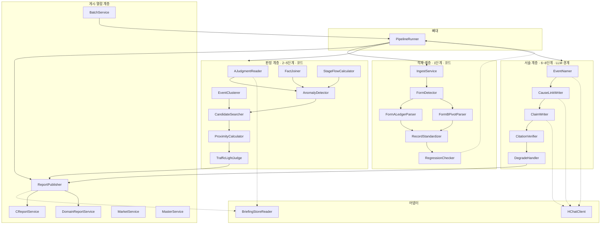
```mermaid
flowchart TB
  subgraph L0["뼈대"]
    PR["PipelineRunner"]
  end
  subgraph L1["적재 계층 · 1단계 · 코드"]
    IS["IngestService"] --> FD["FormDetector"]
    FD --> FA["FormALedgerParser"]
    FD --> FB["FormBPivotParser"]
    FA --> RS["RecordStandardizer"]
    FB --> RS
    RS --> RC["RegressionChecker"]
  end
  subgraph L2["판정 계층 · 2~5단계 · 코드"]
    AJ["AJudgmentReader"]
    EC["EventClusterer"]
    FJ["FactJoiner"]
    SF["StageFlowCalculator"]
    AD["AnomalyDetector"]
    CS["CandidateSearcher"]
    PC["ProximityCalculator"]
    TL["TrafficLightJudge"]
    AJ --> AD
    FJ --> AD
    SF --> AD
    AD --> CS
    EC --> CS
    CS --> PC
    PC --> TL
  end
  subgraph L3["서술 계층 · 6~8단계 · LLM 경계"]
    EN["EventNamer"]
    CL["CauseLinkWriter"]
    CW["ClaimWriter"]
    CV["CitationVerifier"]
    DH["DegradeHandler"]
    EN --> CL --> CW --> CV
    CV --> DH
  end
  subgraph L4["게시·열람 계층"]
    RP["ReportPublisher"]
    CR["CReportService"]
    DR["DomainReportService"]
    MS["MarketService"]
    BS["BatchService"]
    MM["MasterService"]
  end
  subgraph L5["어댑터"]
    HC["HChatClient"]
    BR["BriefingStoreReader"]
  end
  PR --> IS
  PR --> L2
  PR --> L3
  PR --> RP
  RC -.-> PR
  TL --> RP
  DH --> RP
  EN -.-> HC
  CL -.-> HC
  CW -.-> HC
  AJ -.-> BR
  RP -.-> BR
  RP --> CR
  RP --> DR
  BS --> PR
```

읽는 법. 실선은 부르는 방향이고 점선은 바깥으로 나가는 호출이다. **TL에서 RP로 가는 선이 L3를 거치지 않는다.** 이것이 5장 경계의 그림이다. 서술 계층 전체를 지워도 신호등과 후보 순서는 게시기까지 도달한다.

L5로 나가는 선의 출발지가 어디인지도 규칙이다. 판정 계층에서 바깥으로 나가는 선은 AJ에서 BR로 가는 것 하나이고, 게시 계층에서 나가는 선은 RP에서 BR로 가는 것 하나다. 둘 다 사내 DB 읽기다([[TBL-INFRA-001#C5]]). 앞은 A 판정을 읽어 데이터마트 사본으로 두고, 뒤는 A 리포트 본문을 읽어 게시 스키마 사본으로 옮긴다. H-chat으로 나가는 선은 전부 L3에서만 출발한다([[TBL-INFRA-001#C2]]).

**의존은 위에서 아래로만 흐른다.** L2는 L3를 import 하지 않고, L1은 L2를 import 하지 않는다. 화살표가 거꾸로 가는 것이 셋 있는데 전부 같은 뜻이다. RC에서 PR로 가는 것은 회귀 급변이 자동 실행을 막는 신호이고, BS에서 PR로 가는 것은 사람이 누른 재실행이며, RP에서 CR·DR로 가는 것은 게시된 것만 읽힌다는 뜻이다. 셋 다 호출이 아니라 상태 전달이다.

## 3. 폴더 구조

싱크독 공통 규약 1.9의 기본형을 쓰되 네 곳에서 벗어난다. 벗어난 이유를 아래에 적었다.

```
<저장소>/
├── backend/
│   ├── app/
│   │   ├── main.py                     앱 조립·라우터 등록
│   │   ├── core/                       설정·DB 세션·에러·스케줄러 기동
│   │   ├── domains/
│   │   │   ├── ingest/                 적재 계층
│   │   │   │   ├── router.py schemas.py service.py crud.py models.py
│   │   │   │   ├── standardizer.py     RecordStandardizer
│   │   │   │   ├── regression.py       RegressionChecker
│   │   │   │   └── parsers/
│   │   │   │       ├── form_detector.py    FormDetector
│   │   │   │       ├── form_a_ledger.py    FormALedgerParser
│   │   │   │       └── form_b_pivot.py     FormBPivotParser
│   │   │   ├── analysis/               판정·서술 계층. router.py 없음
│   │   │   │   ├── pipeline.py         PipelineRunner
│   │   │   │   ├── judgment/           코드만. adapters/ 를 import 하지 않는다
│   │   │   │   │   ├── a_judgment_reader.py  event_clusterer.py
│   │   │   │   │   ├── fact_joiner.py        stage_flow.py
│   │   │   │   │   ├── anomaly_detector.py   candidate_searcher.py
│   │   │   │   │   └── proximity.py          traffic_light.py
│   │   │   │   ├── narration/          LLM 경계 안쪽
│   │   │   │   │   ├── event_namer.py        cause_link_writer.py
│   │   │   │   │   ├── claim_writer.py       citation_verifier.py
│   │   │   │   │   └── degrade.py
│   │   │   │   ├── publisher.py        ReportPublisher
│   │   │   │   ├── ports.py            LlmPort · BriefingStorePort
│   │   │   │   ├── adapters/
│   │   │   │   │   ├── hchat_client.py       briefing_store_reader.py
│   │   │   │   └── crud.py models.py
│   │   │   ├── intel/                  열람. 세 서비스
│   │   │   ├── batch/                  BatchService
│   │   │   └── master/                 MasterService
│   │   ├── infra/                      DB 엔진·파일 볼륨 접근
│   │   └── shared/                     기간 키·부호 계산 등 순수 유틸
│   ├── tests/                          app/ 구조를 그대로
│   ├── pyproject.toml
│   └── alembic.ini
├── frontend/
│   ├── index.html
│   └── src/  main.tsx App.tsx pages/ components/ api/ assets/ styles.css
├── docs/specs/
├── docker-compose.yml  Dockerfile  .env.example  .gitignore  .dockerignore
└── README.md  AGENTS.md
```

**벗어난 것 넷.**

1. **`domains/analysis/`에 `router.py`가 없다.** 이 도메인에는 HTTP 입구가 없다. worker만 부르고, 배치를 보고 다시 돌리는 입구는 `domains/batch/router.py`다([[TBL-API-001#GET/api/admin/batch/status]] [[TBL-API-001#POST/api/admin/batch/rerun]]). 빈 라우터 파일을 두면 다음 사람이 여기로 엔드포인트를 붙인다.
2. **`analysis/` 아래 `judgment/`와 `narration/`을 나눴다.** 계층 경계를 폴더 경계와 같게 두면 "서술이 죽어도 판정은 산다"를 import 목록으로 확인할 수 있다. `judgment/`의 어느 파일도 `adapters/`를 import 하지 않는다는 것이 규칙이고, 이것이 [[TBL-INFRA-001#C19]]를 코드에서 지키는 방법이다.
3. **`ingest/parsers/`를 뒀다.** 형태가 둘이고 셋째가 들어올 수 있다([[TBL-INFRA-001#C6]]). 형태마다 파일 하나로 두면 새 형태를 붙일 자리가 분명하다.
4. **`ports.py`와 `adapters/`를 썼다.** 조건부 항목이지만 외부 연동이 실제로 둘 있다. H-chat 게이트웨이와 브리핑 갈래 저장소다([[TBL-INFRA-001#C2]] [[TBL-INFRA-001#C5]]). 개발 환경에서 OpenAI를 가리키고 폐쇄망에서 H-chat을 가리키는 것이 같은 코드여야 하므로 port가 필요하다.

**입구는 하나다.** 웹 REST만 있고 MCP나 CLI가 없으므로 라우터는 도메인 안에 둔다. 적재기는 관리 API와 배치가 같은 코드를 부르지만 이것은 입구가 둘인 것이 아니다. 배치는 HTTP를 타지 않고 [[#IngestService]]를 직접 부른다.

**프런트엔드의 `pages/`는 [[TBL-UI-001]]의 화면 항목과 1:1이다.** 화면이 직접 `fetch`를 짜지 않고 `api/` 아래 함수를 부른다.

## 4. 클래스별 정리

### 4.1 뼈대

#### PipelineRunner 파이프라인 진행기

여덟 단계를 순서대로 돌리고, 어느 단계 실패에서 멈추고 어느 단계 실패를 넘길지 정한다.

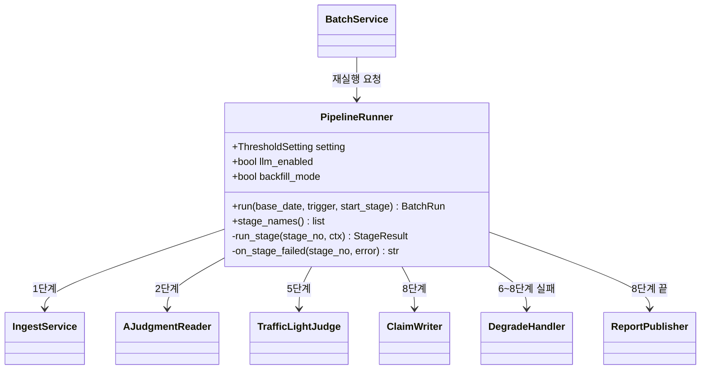
```mermaid
classDiagram
  class PipelineRunner {
    +ThresholdSetting setting
    +bool llm_enabled
    +bool backfill_mode
    +run(base_date, trigger, start_stage) BatchRun
    +stage_names() list
    -run_stage(stage_no, ctx) StageResult
    -on_stage_failed(stage_no, error) str
  }
  PipelineRunner --> IngestService : 1단계
  PipelineRunner --> AJudgmentReader : 2단계
  PipelineRunner --> TrafficLightJudge : 5단계
  PipelineRunner --> ClaimWriter : 8단계
  PipelineRunner --> DegradeHandler : 6~8단계 실패
  PipelineRunner --> ReportPublisher : 8단계 끝
  BatchService --> PipelineRunner : 재실행 요청
```

**속성.** `setting: ThresholdSetting`은 이 실행에 쓴 설정 한 벌이고 산출 행마다 그 버전이 찍힌다([[TBL-DOM-001#ThresholdSetting]]). `llm_enabled: bool`은 거짓이면 6~8단계를 건너뛴다. `backfill_mode: bool`은 과거 데이터를 넣을 때 참이며 5단계까지만 채운다([[TBL-API-001#POST/api/admin/batch/rerun]]).

**메서드.** `run`은 기준일과 실행 계기와 시작 단계를 받아 [[TBL-DOM-001#BatchRun]] 한 건을 만들고 끝까지 돌린다. `stage_names`는 아래 여덟 이름을 확정 순서로 돌려준다. 이 목록은 화면과 API 응답이 그대로 쓴다([[TBL-API-001#GET/api/admin/batch/run/{batchRunId}]]). `on_stage_failed`는 실패한 단계 번호를 받아 `stop`이나 `degrade` 중 하나를 돌려준다.

**여덟 단계와 실패 처리.**

| 단계 | 이름 | 주체 | 클래스 | 실패하면 |
|--:|:--|:--|:--|:--|
| 1 | 적재 | 코드 | [[#IngestService]] | 멈춤 |
| 2 | A 판정 읽기 | 코드 | [[#AJudgmentReader]] | 보완 집계로 내려가고 계속 |
| 3 | 사건 묶음 | 코드 | [[#EventClusterer]] | 멈춤 |
| 4 | 결합 | 코드 | [[#FactJoiner]] [[#StageFlowCalculator]] [[#AnomalyDetector]] | 멈춤 |
| 5 | 원인 후보·근접도·신호등 | 코드 | [[#CandidateSearcher]] [[#ProximityCalculator]] [[#TrafficLightJudge]] | 멈춤 |
| 6 | 사건 명명 | LLM | [[#EventNamer]] | 강등하고 계속 |
| 7 | 연관 설명 | LLM + 코드 | [[#CauseLinkWriter]] [[#CitationVerifier]] | 강등하고 계속 |
| 8 | 서술·검증·게시 | LLM + 코드 | [[#ClaimWriter]] [[#CitationVerifier]] [[#ReportPublisher]] | 서술만 강등. 게시는 진행 |

**관계.** 계층 다섯 전부를 부르는 유일한 클래스다. 반대로 어느 계층도 이 클래스를 부르지 않는다. 예외가 하나 있는데 [[#BatchService]]가 재실행을 요청할 때다.

**판정 근거.** 단계 이름을 여기에 고정한 이유는 세 곳이 같은 이름을 써야 하기 때문이다. 배치 이력 화면([[TBL-UI-001#UI-12]]), 배치 상세 응답, 그리고 실패 단계부터 다시 도는 재실행이다. 이름이 갈리면 "5단계부터 다시"가 무엇부터인지 사람마다 달라진다. 4·5단계 실패에서 멈추는 것은 [[TBL-INFRA-001#C19]]가 정한 것이고, 판정이 없으면 리포트가 성립하지 않기 때문이다. 1·3단계의 실패 처리는 인프라 문서가 명시하지 않았다. 둘 다 코드 단계이고 강등할 대상이 없으므로 멈춤으로 둔다(6장 미결).

`llm_enabled`를 속성으로 둔 것은 회귀 검사 때문이다. LLM을 끄고 같은 기준일을 돌려 신호등과 후보 순서가 정상 실행과 같은지 대조한다([[TBL-INFRA-001#C19]]). 이 값이 코드 안 상수로 박혀 있으면 그 대조를 돌릴 수 없다.

### 4.2 적재 계층

배치 1단계와 관리 API의 수동 적재가 같은 코드를 부른다([[TBL-INFRA-001#C6]]). 같은 파일을 어느 경로로 넣어도 같은 표준 행이 나와야 하므로 모듈을 두 벌로 두지 않는다.

#### IngestService 적재 진입점

파일 한 건을 받아 형태를 판별하고, 미리보기를 보여 주고, 확정되면 표준 테이블에 넣는다.

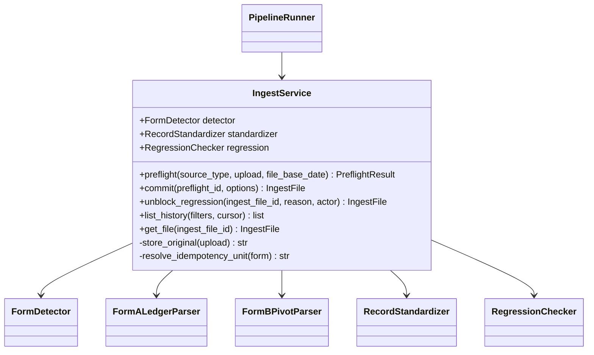
```mermaid
classDiagram
  class IngestService {
    +FormDetector detector
    +RecordStandardizer standardizer
    +RegressionChecker regression
    +preflight(source_type, upload, file_base_date) PreflightResult
    +commit(preflight_id, options) IngestFile
    +unblock_regression(ingest_file_id, reason, actor) IngestFile
    +list_history(filters, cursor) list
    +get_file(ingest_file_id) IngestFile
    -store_original(upload) str
    -resolve_idempotency_unit(form) str
  }
  IngestService --> FormDetector
  IngestService --> FormALedgerParser
  IngestService --> FormBPivotParser
  IngestService --> RecordStandardizer
  IngestService --> RegressionChecker
  PipelineRunner --> IngestService
```

**속성.** 판별기와 표준화기와 회귀 검사기를 주입받는다. 스스로 파일을 파싱하지 않고 나눠 준다.

**메서드.** 다섯 개가 [[TBL-API-001]]의 적재 엔드포인트 다섯과 1:1이다. `preflight`는 원본을 먼저 보존하고 형태를 판별해 미리보기를 돌려주며 표준 테이블에 넣지 않는다([[TBL-API-001#POST/api/admin/ingest/preflight]]). `commit`은 표준화·미매핑 수집·회귀 검사를 한 번에 돌린다([[TBL-API-001#POST/api/admin/ingest/commit]]). `unblock_regression`은 사유를 반드시 받는다. `store_original`은 판별 성공 여부와 무관하게 먼저 돈다([[TBL-PRD-001#N7]]). `resolve_idempotency_unit`은 형태 A면 기준일자, 형태 B면 파일 기준일을 돌려준다.

**관계.** [[TBL-DOM-001#IngestFile]] 한 행을 만드는 유일한 클래스다. [[#PipelineRunner]]가 1단계에서 부르고 관리 API 라우터도 부른다.

**판정 근거.** 사전 검증과 확정을 두 호출로 나눈 이유는 덮어쓰기 때문이다. 형태 B는 파일 기준일 단위로 통째 덮어쓰므로 사람이 무엇이 지워지는지 보고 나서 눌러야 한다([[TBL-UC-001#UC-A1]]). 회귀 급변일 때 **적재는 완료하고 배치 자동 실행만 막는** 것도 여기서 갈린다([[TBL-UC-001#UC-S6]]). 적재까지 막으면 원본이 표준 테이블에 영영 못 들어가고, 급변이 실제로 정상인 경우가 있어서다.

#### FormDetector 형태 판별기

완성차 파일이 형태 A인지 형태 B인지 가른다. 어느 쪽도 아니면 막는다.

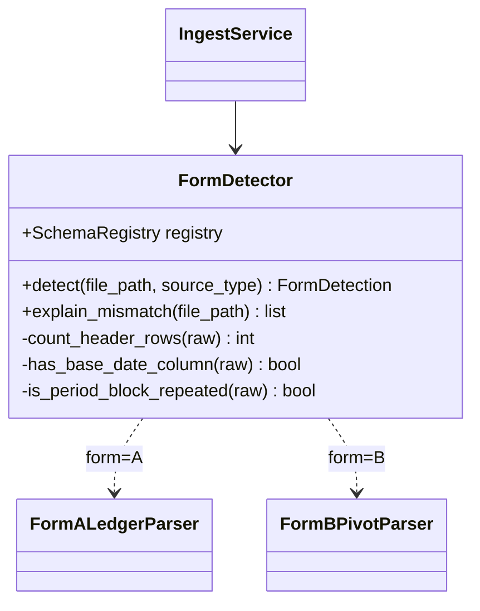
```mermaid
classDiagram
  class FormDetector {
    +SchemaRegistry registry
    +detect(file_path, source_type) FormDetection
    +explain_mismatch(file_path) list
    -count_header_rows(raw) int
    -has_base_date_column(raw) bool
    -is_period_block_repeated(raw) bool
  }
  IngestService --> FormDetector
  FormDetector ..> FormALedgerParser : form=A
  FormDetector ..> FormBPivotParser : form=B
```

**속성.** `registry: SchemaRegistry`는 등록된 스키마 버전 목록이다. 뉴스 가공본과 원본처럼 같은 소스에 컬럼 구성이 둘인 경우도 여기서 가른다.

**메서드.** `detect`는 `form`(A·B·unknown)과 판별 근거를 담은 결과를 돌려준다([[TBL-API-001]] 4.11절). `explain_mismatch`는 unknown일 때 어느 대목이 기대와 다른지 목록으로 돌려주고 화면이 그대로 적는다.

**관계.** [[#IngestService]]가 부르고, 결과에 따라 파서 둘 중 하나가 선택된다.

**판정 근거.** 판별 기준을 둘로 좁힌 것은 실측 때문이다. 형태 A는 첫 행이 바로 헤더이고 행마다 기준일자가 있다. 형태 B는 병합 헤더가 2~3줄이고 행에 날짜 컬럼이 없다([[TBL-RFQ-001#Q59]]). 이 둘만 보면 갈린다. 셋째 형태를 받는 것은 개발 작업이고 자동 추론하지 않는다([[TBL-INFRA-001#C6]]). 추론으로 넘기면 어긋난 파일이 조용히 적재되고, 그 결과가 기간 단위가 뒤섞인 표준 행으로 남는다.

#### FormALedgerParser 형태 A 파서

IF 원장을 읽는다. 생산 17열, 판매·재고 23열이고 행마다 기준일자가 있다.

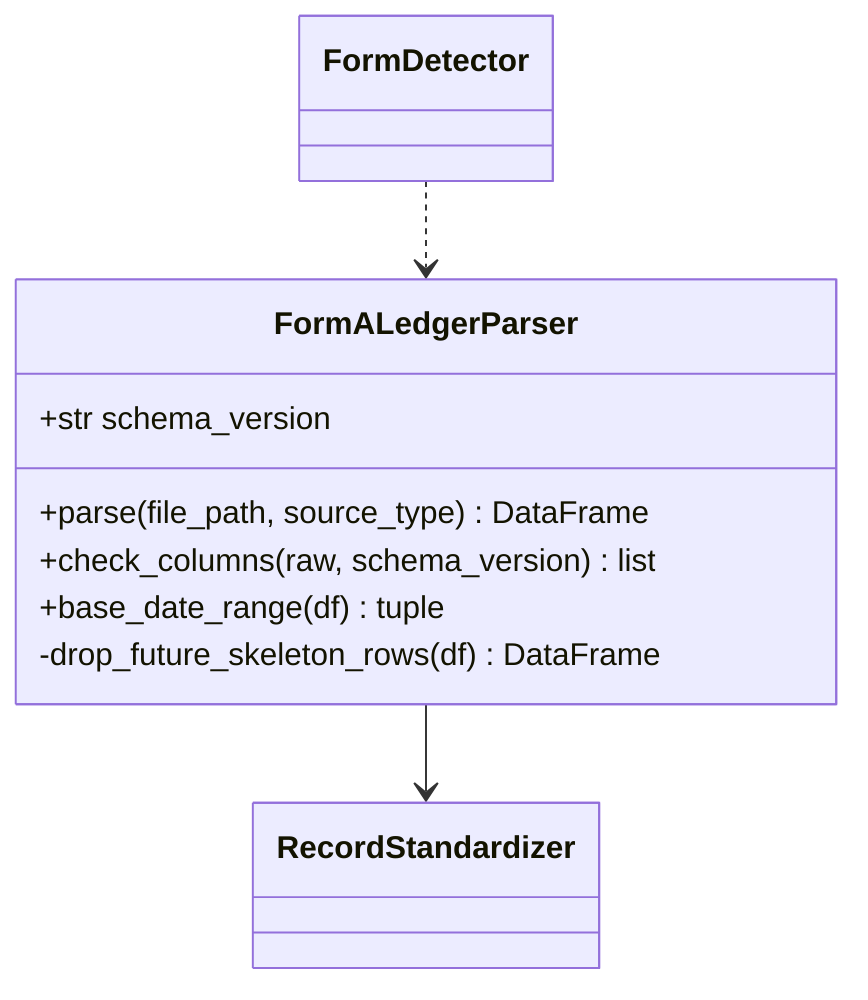
```mermaid
classDiagram
  class FormALedgerParser {
    +str schema_version
    +parse(file_path, source_type) DataFrame
    +check_columns(raw, schema_version) list
    +base_date_range(df) tuple
    -drop_future_skeleton_rows(df) DataFrame
  }
  FormDetector ..> FormALedgerParser
  FormALedgerParser --> RecordStandardizer
```

**속성.** `schema_version: str`은 대조할 컬럼 목록의 버전이다.

**메서드.** `parse`는 원장을 그대로 읽어 돌려준다. `check_columns`는 기대 컬럼과 실제 컬럼을 대조해 어긋난 목록을 돌려주고 미리보기 화면이 그대로 적는다. `base_date_range`는 파일이 담은 기준일자의 처음과 끝을 돌려주며 덮어쓸 범위를 사람에게 보여 줄 때 쓴다. `drop_future_skeleton_rows`는 값이 비어 있는 미래 일자 골격 행을 센 뒤 뺀다.

**관계.** [[#FormDetector]]가 고르고 [[#RecordStandardizer]]에게 넘긴다.

**판정 근거.** 형태 A는 행마다 날짜가 있어 표준화가 단순하다. 기간 구분이 `day`로 고정되고 파일 기준일이 그 행의 기준일자와 같아진다([[TBL-INFRA-001#C15]]). **이 클래스는 아직 실물을 본 적이 없다.** 자사가 집계한 인입 샘플은 전부 형태 B였고, 형태 A는 IF 레이아웃 정의만 있다([[TBL-RFQ-001#Q59]]). 컬럼 대조를 파서 안에 둔 것은 실물이 들어오는 순간 어긋남이 어디인지 바로 보이게 하기 위해서다.

#### FormBPivotParser 형태 B 파서

피벗 리포트의 병합 헤더를 펴서 한 행을 지표 종류 수만큼의 행으로 늘린다.

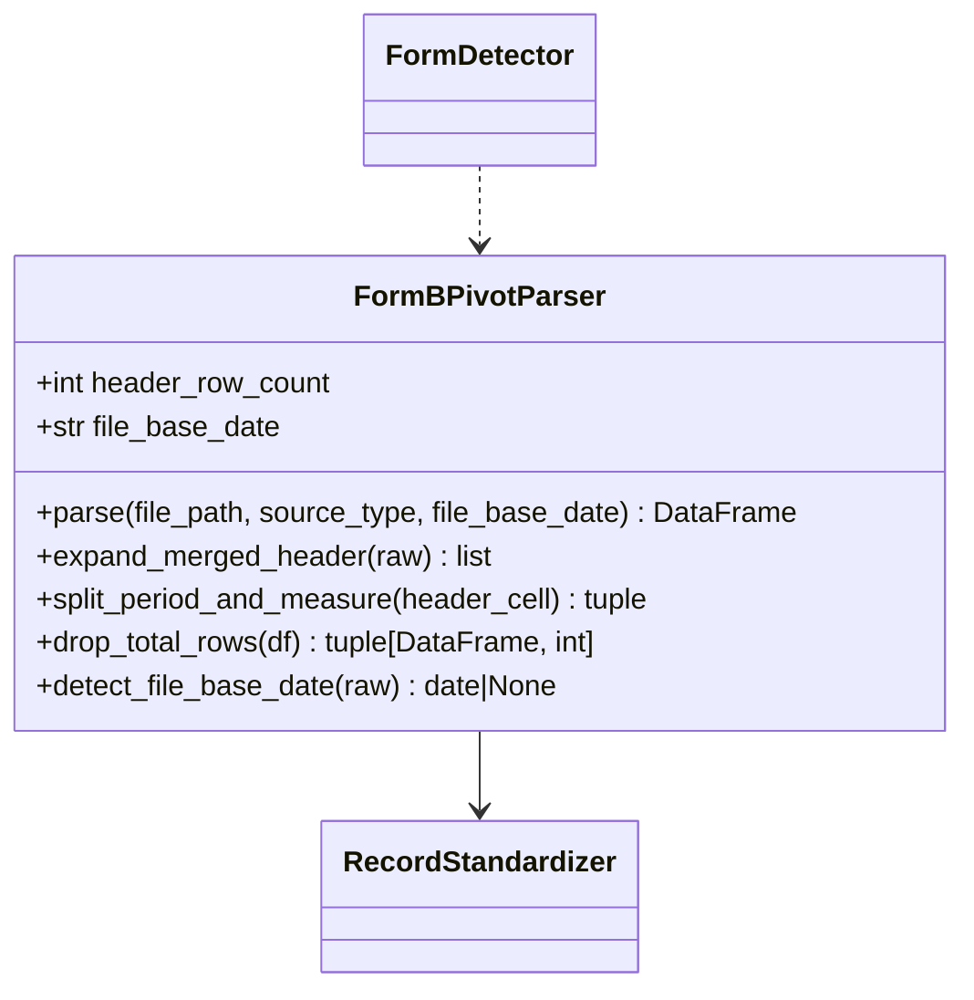
```mermaid
classDiagram
  class FormBPivotParser {
    +int header_row_count
    +str file_base_date
    +parse(file_path, source_type, file_base_date) DataFrame
    +expand_merged_header(raw) list
    +split_period_and_measure(header_cell) tuple
    +drop_total_rows(df) tuple[DataFrame, int]
    +detect_file_base_date(raw) date|None
  }
  FormDetector ..> FormBPivotParser
  FormBPivotParser --> RecordStandardizer
```

**속성.** `header_row_count: int`는 2 또는 3이다. `file_base_date: str`은 파일이 담은 기준일이며 파일에서 못 읽으면 관리자가 넣는다([[TBL-API-001#POST/api/admin/ingest/preflight]]).

**메서드.** `expand_merged_header`는 병합된 헤더 칸을 아래로 채워 컬럼마다 (기간 구분, 지표 종류) 한 쌍을 만든다. `split_period_and_measure`는 헤더 한 칸을 그 쌍으로 푼다. 기간 구분은 일·월·누계·년 넷이고 지표 종류는 아홉이다(운영계획·사업계획·실적·진도율·전년대비, 선적·실 도매·도매(공식)·소매). `drop_total_rows`는 총계 행을 뺀 표와 뺀 행수를 함께 돌려준다. 행수를 같이 돌려주므로 총계 행이 몇 줄이었는지가 적재 뒤에도 남는다. `detect_file_base_date`는 파일 안에서 기준일을 찾아보고 없으면 `None`을 돌려준다.

**관계.** [[#FormDetector]]가 고르고 [[#RecordStandardizer]]에게 넘긴다.

**판정 근거.** 이 클래스가 적재 계층에서 가장 위험하다. 병합 헤더를 잘못 펴면 값이 엉뚱한 기간과 지표 종류에 붙는데, 그 결과가 숫자로는 멀쩡해 보인다. 그래서 펼친 결과의 기간 구분 목록과 지표 종류 목록을 미리보기로 돌려주고([[TBL-API-001#POST/api/admin/ingest/preflight]]) 직전 적재와 대조한다([[TBL-INFRA-001#C6]]).

**총계 행을 지우지 않고 세어 두는** 이유는 생산 진도율 때문이다. 인입 샘플에서 진도율 컬럼은 총계 행에만 값이 있고 개별 행은 전부 0이다([[TBL-RFQ-001#Q64]]). 총계 행을 판정에 넣으면 이중 계상이 되고, 아예 지우면 그 사실을 나중에 확인할 수 없다. 진도율은 컬럼을 믿지 않고 실적과 계획으로 직접 계산한다([[#AnomalyDetector]]).

#### RecordStandardizer 표준화기

형태 A와 형태 B의 행을 같은 긴 형태 한 테이블로 만든다.

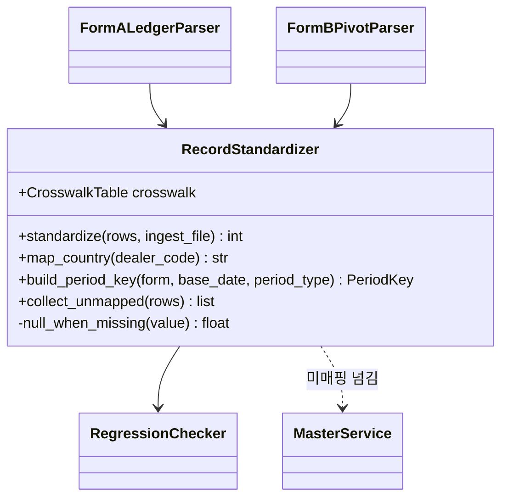
```mermaid
classDiagram
  class RecordStandardizer {
    +CrosswalkTable crosswalk
    +standardize(rows, ingest_file) int
    +map_country(dealer_code) str
    +build_period_key(form, base_date, period_type) PeriodKey
    +collect_unmapped(rows) list
    -null_when_missing(value) float
  }
  FormALedgerParser --> RecordStandardizer
  FormBPivotParser --> RecordStandardizer
  RecordStandardizer --> RegressionChecker
  RecordStandardizer ..> MasterService : 미매핑 넘김
```

**속성.** `crosswalk: CrosswalkTable`은 국가·차종·법인 매핑 이관본이다.

**메서드.** `standardize`는 표준 테이블에 넣은 행수를 돌려준다. `map_country`는 대리점 코드 앞 세 자리로 국가를 찾는다. `build_period_key`는 시간 두 칸을 만든다. 형태 A면 `periodType=day`이고 `fileBaseDate`가 행의 기준일자, 형태 B면 헤더에서 온 기간 구분과 파일 기준일이다([[TBL-API-001]] 4.2절). `collect_unmapped`는 못 붙인 값을 모아 미매핑 목록에 남긴다. `null_when_missing`은 `-` 같은 결측 표기를 `NULL`로 바꾼다. 0으로 바꾸지 않는다.

**관계.** 파서 둘의 출력을 받아 [[TBL-DOM-001#CountryDayFact]]와 [[TBL-DOM-001#SalesStageFlow]]의 원재료가 되는 표준 행을 만든다. 미매핑은 [[#MasterService]]가 화면에 보여 준다.

**판정 근거.** 긴 형태 하나로 모으는 이유는 [[TBL-INFRA-001]] 6.1절에 있다. 넓은 형태로 두면 기간 블록이나 지표 종류가 늘 때마다 컬럼이 늘고 하류 조회가 전부 바뀐다. **생산 행의 국가 컬럼은 비운다.** 목적지 국가가 데이터에 없으므로 유추하지 않는다([[TBL-INFRA-001#C16]]). 국가가 `NULL`인 행은 국가 축 처리에서 자동으로 빠지고, 이것이 생산이 워치리스트에 오르지 못하는 실제 이유가 된다.

결측을 0으로 바꾸지 않는 것은 계획 대비 달성률 때문이다. 계획이 없는 것과 계획이 0인 것은 다르고, 0으로 채우면 달성률이 무한대가 되거나 0%로 찍힌다.

#### RegressionChecker 회귀 검사기

이번 적재를 직전 적재와 견줘 급변인지 판정한다.

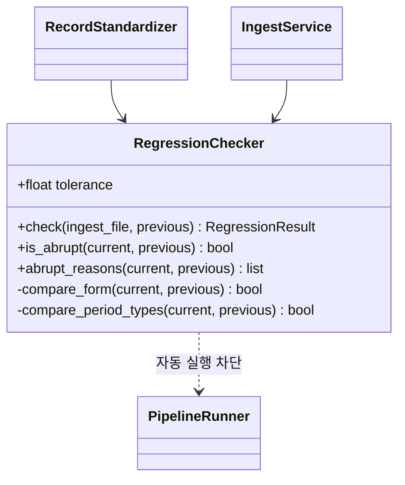
```mermaid
classDiagram
  class RegressionChecker {
    +float tolerance
    +check(ingest_file, previous) RegressionResult
    +is_abrupt(current, previous) bool
    +abrupt_reasons(current, previous) list
    -compare_form(current, previous) bool
    -compare_period_types(current, previous) bool
  }
  RecordStandardizer --> RegressionChecker
  IngestService --> RegressionChecker
  RegressionChecker ..> PipelineRunner : 자동 실행 차단
```

**속성.** `tolerance: float`는 허용 폭이며 [[TBL-DOM-001#ThresholdSetting]]에서 온다.

**메서드.** `check`는 행수·결측률·매칭률·중복률을 직전과 견준 결과를 돌려준다. `abrupt_reasons`는 사람이 읽을 사유 목록이고 차단 해제 화면에 그대로 나간다. `compare_form`은 같은 소스의 형태가 직전과 달라졌는지 본다. `compare_period_types`는 형태 B의 기간 블록 목록과 지표 종류 목록을 직전과 대조한다.

**관계.** [[#IngestService]]가 확정 시 부르고, 급변이면 [[#PipelineRunner]]의 자동 실행이 막힌다.

**판정 근거.** **형태가 달라진 것 자체를 급변으로 본다**([[TBL-INFRA-001#C6]]). 수치가 멀쩡해도 형태가 바뀌면 시간 축이 바뀌기 때문이다. 샘플에서 실데이터로 넘어가는 시점이 가장 위험한 자리다([[TBL-INFRA-001#C14]]). 차단이 적재가 아니라 배치 자동 실행에만 걸리는 것은 [[#IngestService]]의 판정 근거와 같은 이유다.

### 4.3 판정 계층

배치 2~5단계다. **이 계층의 어느 클래스도 [[#HChatClient]]를 import 하지 않는다.** 5단계가 끝나면 화면에 나갈 판정이 전부 확정된다([[TBL-INFRA-001#C19]]). 변동별 신호등과 워치리스트뿐 아니라 도메인 상태 3카드의 신호등도 여기 포함된다([[#TrafficLightJudge]]).

#### AJudgmentReader A 판정 읽기

브리핑 갈래 저장소에서 A 판정과 내부 분해를 읽어 복사한다. 쓰지 않는다.

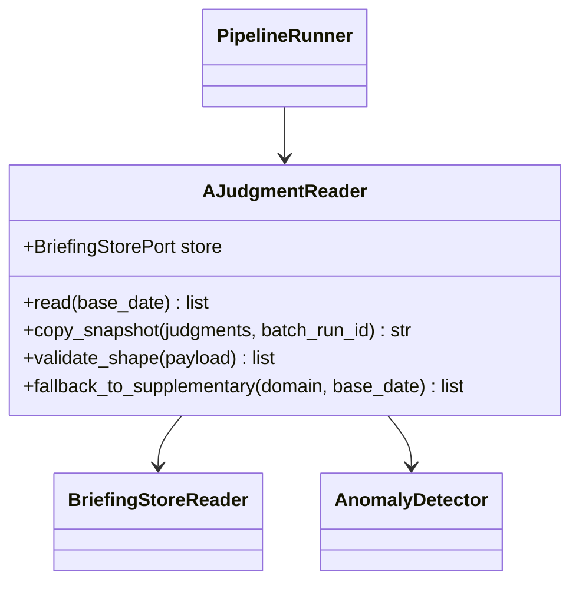
```mermaid
classDiagram
  class AJudgmentReader {
    +BriefingStorePort store
    +read(base_date) list
    +copy_snapshot(judgments, batch_run_id) str
    +validate_shape(payload) list
    +fallback_to_supplementary(domain, base_date) list
  }
  AJudgmentReader --> BriefingStoreReader
  AJudgmentReader --> AnomalyDetector
  PipelineRunner --> AJudgmentReader
```

**속성.** `store: BriefingStorePort`는 읽기 전용 포트다([[TBL-INFRA-001#C5]]).

**메서드.** `read`는 도메인·국가·기간 키로 [[TBL-DOM-001#DomainJudgment]]와 [[TBL-DOM-001#Contribution]]을 읽는다. `copy_snapshot`은 읽은 것을 그대로 복사하고 스냅샷 식별자를 남긴다. `validate_shape`는 기대한 키와 필드가 있는지 보고 어긋난 목록을 돌려준다. `fallback_to_supplementary`는 읽기가 실패했을 때 표준 테이블에서 직접 집계해 대신 채운다.

**관계.** [[#BriefingStoreReader]]를 통해서만 바깥을 본다. 결과는 [[#AnomalyDetector]]로 간다.

**판정 근거.** **값을 다시 계산하지 않는다.** C의 수치가 대시보드와 어긋나면 현업이 둘 다 믿지 않게 된다([[TBL-DOM-001#DomainJudgment]]). 스냅샷을 복사해 두는 것은 재현 때문이다. 원본이 나중에 바뀌어도 그날 리포트는 같은 입력으로 다시 만들어진다([[TBL-INFRA-001#C11]]).

읽기 실패가 배치를 멈추지 않는 유일한 코드 단계다. 보완 집계로 내려가고 리포트에 "판정 미수신"을 적는다([[TBL-API-001#GET/api/intel/creport/latest]]의 `notices`). 보완 집계로 만든 변동은 기여 분해가 비고 화면이 그것을 적는다.

#### EventClusterer 사건 묶음기

같은 일을 말하는 기사를 묶고 기사 수와 출처 수를 센다. 코드만 쓴다.

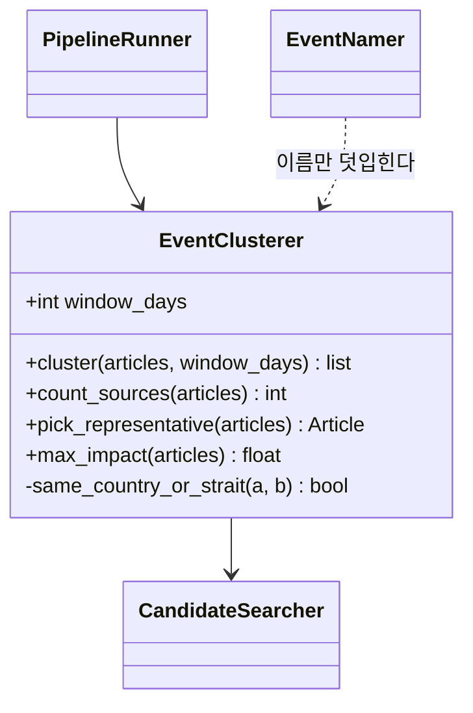
```mermaid
classDiagram
  class EventClusterer {
    +int window_days
    +cluster(articles, window_days) list
    +count_sources(articles) int
    +pick_representative(articles) Article
    +max_impact(articles) float
    -same_country_or_strait(a, b) bool
  }
  EventClusterer --> CandidateSearcher
  PipelineRunner --> EventClusterer
  EventNamer ..> EventClusterer : 이름만 덧입힌다
```

**속성.** `window_days: int`는 같은 사건으로 볼 시간창이며 설정에서 온다.

**메서드.** `cluster`는 [[TBL-DOM-001#Event]] 목록을 만든다. `count_sources`는 서로 다른 매체 이름의 개수를 센다. `pick_representative`는 대표 기사를 고르고, 이름 붙이기가 실패했을 때 그 제목이 사건 이름을 대신한다. `max_impact`는 기사에 붙어 온 영향도의 최대값을 돌려준다. 새로 매기지 않는다.

**관계.** 산출물이 [[#CandidateSearcher]]의 입력이고, 기사 수와 출처 수는 [[#TrafficLightJudge]]의 입력이다. [[#EventNamer]]는 이미 만들어진 묶음에 이름만 덧입힌다.

**판정 근거.** **이 클래스는 판정 계층에 있다**(0장). 묶음은 규칙이고 이름만 LLM이다([[TBL-DOM-001#Event]]). 기사 수로만 세면 많이 보도된 나라가 자동으로 커지므로 묶어서 세고, 한 사건이 몇 개 매체에서 나왔는지를 따로 센다. 이 두 값이 신호등 규칙의 입력이라 이 클래스가 죽으면 신호등도 죽는다. 그래서 6~8단계와 달리 실패 시 강등이 아니라 멈춤이다.

심각도를 모델이 매기지 않는 것은 [[TBL-PRD-001#R26]]과 같은 이유다. 기사에 이미 붙어 온 영향도의 최대값을 쓴다.

#### FactJoiner 결합기

완성차 표준 행을 국가와 기간으로 모아 결합 테이블을 만든다.

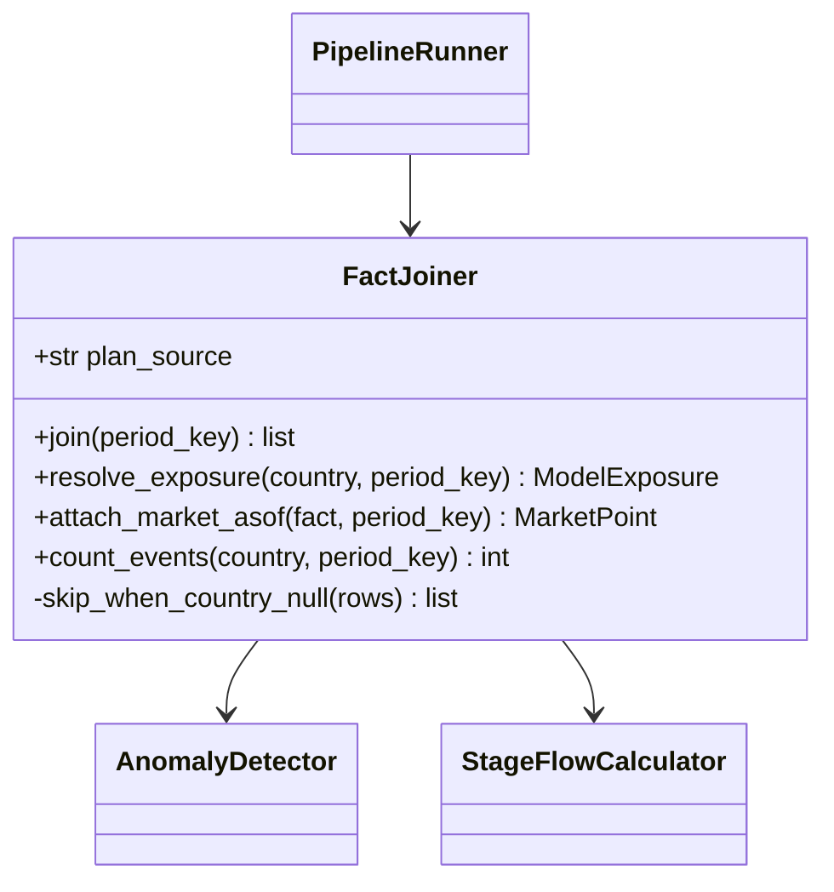
```mermaid
classDiagram
  class FactJoiner {
    +str plan_source
    +join(period_key) list
    +resolve_exposure(country, period_key) ModelExposure
    +attach_market_asof(fact, period_key) MarketPoint
    +count_events(country, period_key) int
    -skip_when_country_null(rows) list
  }
  FactJoiner --> AnomalyDetector
  FactJoiner --> StageFlowCalculator
  PipelineRunner --> FactJoiner
```

**속성.** `plan_source: str`은 계획 정본이며 기본값이 사업계획이다([[TBL-DOM-001#ThresholdSetting]]).

**메서드.** `join`은 [[TBL-DOM-001#CountryDayFact]] 행을 만든다. **비교 값과 비교 방식을 고르는 주체가 이 메서드다.** 계획이 있으면 계획 대비, 없으면 전년 동월, 그다음 전월 순으로 골라 결합 행의 `compare_value`와 `compare_basis`에 굳힌다. [[#AnomalyDetector]]는 그 칸을 읽기만 한다. `resolve_exposure`는 완성차·반조립 구분을 정하고 어느 경로로 얻었는지를 남긴다([[TBL-DOM-001#ModelExposure]]). `attach_market_asof`는 그 기간의 마지막 날 기준 시장지표 값을 붙인다. `count_events`는 그 국가·기간에 걸린 사건 수를 센다. `skip_when_country_null`은 국가가 비어 있는 행을 뺀다.

**관계.** [[TBL-DOM-001#CountryDayFact]]를 만드는 유일한 클래스다. 결과가 [[#StageFlowCalculator]]와 [[#AnomalyDetector]]로 간다.

**판정 근거.** **생산 수치를 이 결합에 넣지 않는다.** 국가 축이 없어 모을 수 없기 때문이다([[TBL-INFRA-001#C16]]). 국가가 `NULL`인 행을 빼는 것으로 이것이 자동으로 지켜진다.

노출 판정을 이 클래스에 둔 것은 취득 경로가 형태마다 다르기 때문이다. 형태 B는 판매 파일에 `CBU/CKD` 컬럼이 그대로 있어 읽기만 하면 되고, 형태 A는 생산 모델코드로 유도해야 한다([[TBL-RFQ-001#Q62]]). 결합 시점이 두 형태가 이미 같은 표준 행으로 모인 자리라 여기서 한 번에 정한다. 유도가 실패하면 "노출 미확인"이고, 그 국가는 [[#TrafficLightJudge]]에서 RED까지 올라가지 못한다.

시장지표를 as-of로 붙이는 이유는 조인 축이 날짜뿐이기 때문이다([[TBL-DOM-001#MarketPoint]]). 완성차 쪽이 누계나 년이면 그 기간의 마지막 날 값을 붙인다.

#### StageFlowCalculator 단계별 흐름 계산기

판매 네 계열의 값과 단계 사이의 차이를 센다. 재고 원천이 없는 동안 재고 신호가 나오는 자리다.

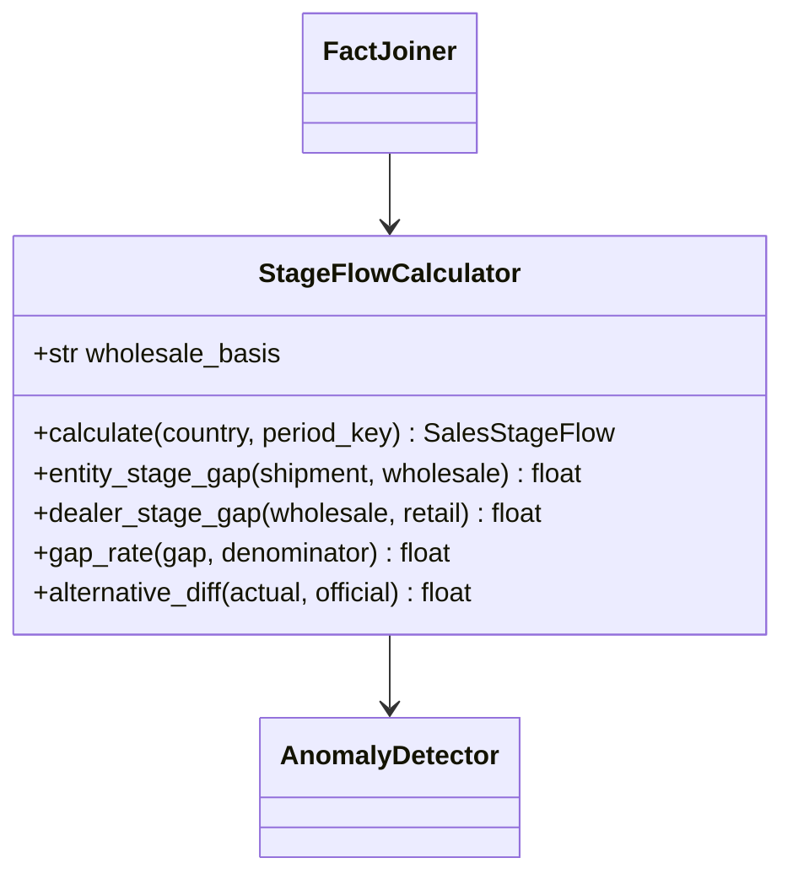
```mermaid
classDiagram
  class StageFlowCalculator {
    +str wholesale_basis
    +calculate(country, period_key) SalesStageFlow
    +entity_stage_gap(shipment, wholesale) float
    +dealer_stage_gap(wholesale, retail) float
    +gap_rate(gap, denominator) float
    +alternative_diff(actual, official) float
  }
  FactJoiner --> StageFlowCalculator
  StageFlowCalculator --> AnomalyDetector
```

**속성.** `wholesale_basis: str`은 도매 정본이며 기본값이 도매(공식)이다([[TBL-DOM-001#ThresholdSetting]]).

**메서드.** `entity_stage_gap`은 선적에서 도매 정본을 뺀다. `dealer_stage_gap`은 도매 정본에서 소매를 뺀다. `gap_rate`는 차이를 도매 정본으로 나눈다. `alternative_diff`는 다른 도매 기준과의 차이를 돌려준다.

**관계.** [[TBL-DOM-001#SalesStageFlow]]를 만드는 유일한 클래스다. 산출한 체류 변동이 [[#AnomalyDetector]]로 간다.

**판정 근거.** 부호 규약은 앞 단계에서 뒤 단계를 뺀 값이다([[TBL-API-001]] 1.4절). **음수를 예외로 처리하지 않는다.** 소매가 도매를 넘는 국가는 이전에 쌓인 물량을 덜어내는 중이고 그 자체가 읽을 값이다. 실측에서 푸에르토리코 -13.7%, 콜롬비아 -10.5%다([[TBL-RFQ-001#Q63]]).

구간을 둘로 나눈 것은 실측 때문이다. 미주 누계에서 선적 679,551, 도매 677,201, 소매 643,097이고 뒤 구간이 34,104대(5.0%)로 벌어진다. 국가별로는 칠레 25.2%, 페루 21.2%다. 앞 구간도 캐나다 8.3%처럼 벌어지는 국가가 있어 둘 다 저장한다.

`wholesale_basis`를 행에 남기는 이유는 도매가 두 기준으로 들어오고 두 기준의 전사 누계가 어긋나기 때문이다. 실 도매 2,356,496대와 도매(공식) 2,383,631대의 차이가 27,135대다([[TBL-RFQ-001#Q63]]). 이 27,135대는 전사 누계 차이이며 미주 구간 값이 아니다. 미주 구간의 실 도매 누계는 실측이 없다. 어느 기준으로 계산했는지가 행에 없으면 같은 국가의 체류율이 설정에 따라 조용히 달라진다.

**이 값은 재고가 아니라 재고의 대체물이다.** 산출 구분을 `derived`로 남기고 화면이 유도 표기를 붙인다([[TBL-INFRA-001#C17]]). 원천이 들어오면 같은 자리를 실측값이 차지한다.

#### AnomalyDetector 변동 판정기

변동을 확정한다. 원인은 여기서 보지 않는다.

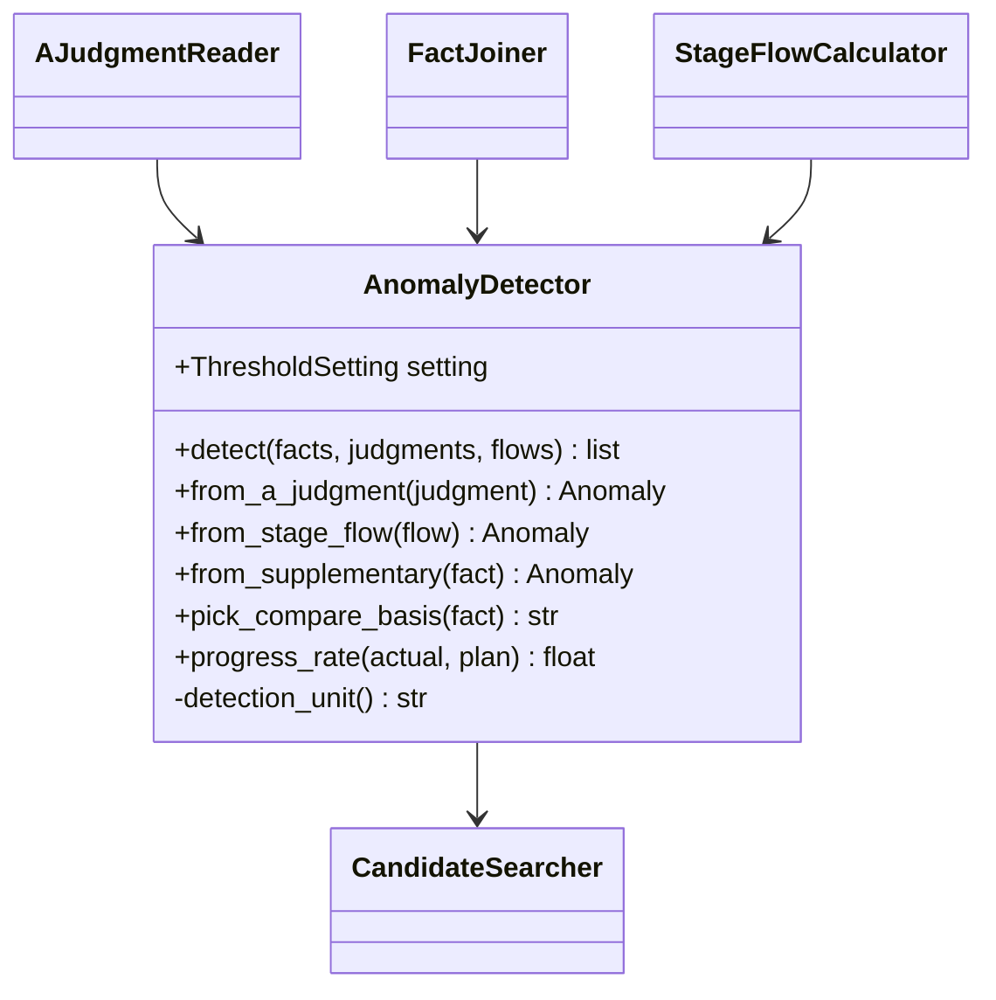
```mermaid
classDiagram
  class AnomalyDetector {
    +ThresholdSetting setting
    +detect(facts, judgments, flows) list
    +from_a_judgment(judgment) Anomaly
    +from_stage_flow(flow) Anomaly
    +from_supplementary(fact) Anomaly
    +pick_compare_basis(fact) str
    +progress_rate(actual, plan) float
    -detection_unit() str
  }
  AJudgmentReader --> AnomalyDetector
  FactJoiner --> AnomalyDetector
  StageFlowCalculator --> AnomalyDetector
  AnomalyDetector --> CandidateSearcher
```

**속성.** `setting: ThresholdSetting`이 임계값과 감지 단위를 준다.

**메서드.** `detect`는 [[TBL-DOM-001#Anomaly]] 목록을 돌려준다. 출처가 셋이라 만드는 메서드도 셋이다. `pick_compare_basis`는 결합 행에 이미 굳은 `compare_value`와 `compare_basis`를 읽어 변동에 옮긴다. 고르는 주체는 [[#FactJoiner]]다. `progress_rate`는 실적과 계획으로 직접 계산한다. `detection_unit`은 기본값 `modelGroup`을 돌려준다.

**관계.** 변동을 만드는 유일한 클래스다. 셋에서 받아 하나로 모은다.

**판정 근거.** **변동을 먼저 확정하고 원인은 나중에 붙인다.** 순서를 뒤집으면 뉴스가 많은 국가만 계속 올라온다([[TBL-DOM-001#Anomaly]]).

진도율 컬럼을 쓰지 않고 직접 계산하는 이유는 실측이다. 생산 진도율은 총계 행에만 값이 있고 개별 행은 전부 0이다([[TBL-RFQ-001#Q64]]).

감지 단위를 차종 그룹으로 두는 이유도 실측이다. 세부 차종 단위로 전년 대비를 돌리면 모델 교체가 전부 -100%로 잡힌다. 팰리세이드 LX2가 2,282대에서 0대가 된 것은 사고가 아니라 후속 모델 전환이다([[TBL-RFQ-001#Q64]] [[TBL-PRD-001#R8]]). 세부 차종은 [[TBL-DOM-001#Contribution]] 분해에만 쓴다. 파워트레인은 44~53%가 미분류라 분해 차원에서 뺀다.

**축 종류가 `plant`인 변동도 만든다.** 생산 판정이 공장 단위로 오기 때문이다. 다만 이 변동은 [[#CandidateSearcher]]에서 국가 축 후보를 얻지 못하고 [[#TrafficLightJudge]]에서 제외되며 열람 응답의 변동 목록에도 들어가지 않는다([[TBL-API-001]] 1.6절). 만들되 국가 쪽 처리에서 빠지는 것이지, 만들지 않는 것이 아니다. 도메인 상태 한 줄이 이 변동을 읽는다.

#### CandidateSearcher 후보 검색기

변동 하나에 원인 후보를 붙인다. 코드가 찾는다.

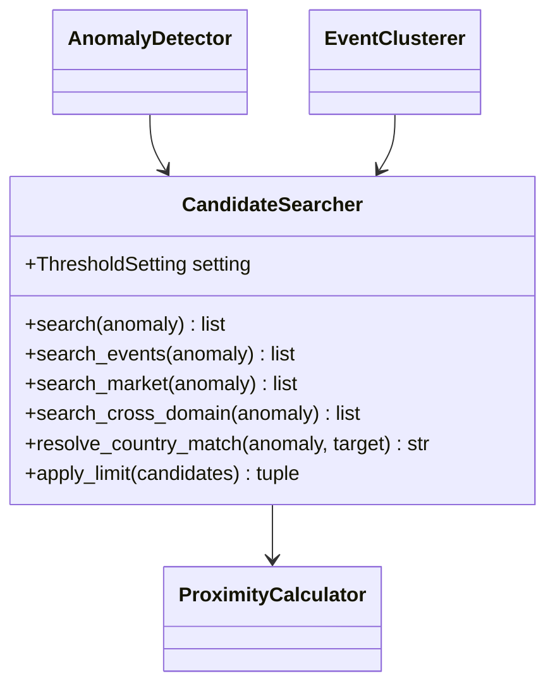
```mermaid
classDiagram
  class CandidateSearcher {
    +ThresholdSetting setting
    +search(anomaly) list
    +search_events(anomaly) list
    +search_market(anomaly) list
    +search_cross_domain(anomaly) list
    +resolve_country_match(anomaly, target) str
    +apply_limit(candidates) tuple
  }
  AnomalyDetector --> CandidateSearcher
  EventClusterer --> CandidateSearcher
  CandidateSearcher --> ProximityCalculator
```

**속성.** `setting`이 시간창과 후보 상한을 준다.

**메서드.** `search`는 [[TBL-DOM-001#CauseCandidate]] 목록을 돌려준다. 후보 유형이 넷이라 검색 메서드가 셋이다(사건과 기사는 같은 경로로 찾는다). `resolve_country_match`는 국가 일치 방식을 정한다. 국가 직접, 해협 귀속, 같은 국가 다른 도메인, 날짜만 일치 넷이다. `apply_limit`은 상한을 적용하고 잘린 건수를 함께 돌려준다.

**관계.** [[TBL-DOM-001#Event]] [[TBL-DOM-001#MarketPoint]] [[TBL-DOM-001#Anomaly]] 셋을 가리키는 후보를 만든다.

**판정 근거.** 해협 귀속을 따로 두는 이유는 호르무즈 기사가 오만·아랍에미리트에 붙지 않으면 중동 변동의 후보가 비어 버리기 때문이다([[TBL-DOM-001#Strait]]). 해협으로 붙은 후보는 국가 일치 방식에 그 사실이 남아 직접 걸린 후보와 구분된다.

시장지표가 `dateOnly`로만 붙는 것은 국가·차종과 이어지지 않기 때문이다([[TBL-DOM-001#MarketPoint]]). 이 사실을 숨기지 않고 값으로 남긴다.

**잘린 건수를 돌려주는 이유는 화면에 적기 위해서다.** 상한에 걸려 사라진 후보가 있다는 것을 사람이 알아야 "후보가 이것뿐"이라고 오해하지 않는다.

#### ProximityCalculator 근접도 계산기

후보마다 셀 수 있는 값 넷을 세고 정렬 순서를 매긴다.

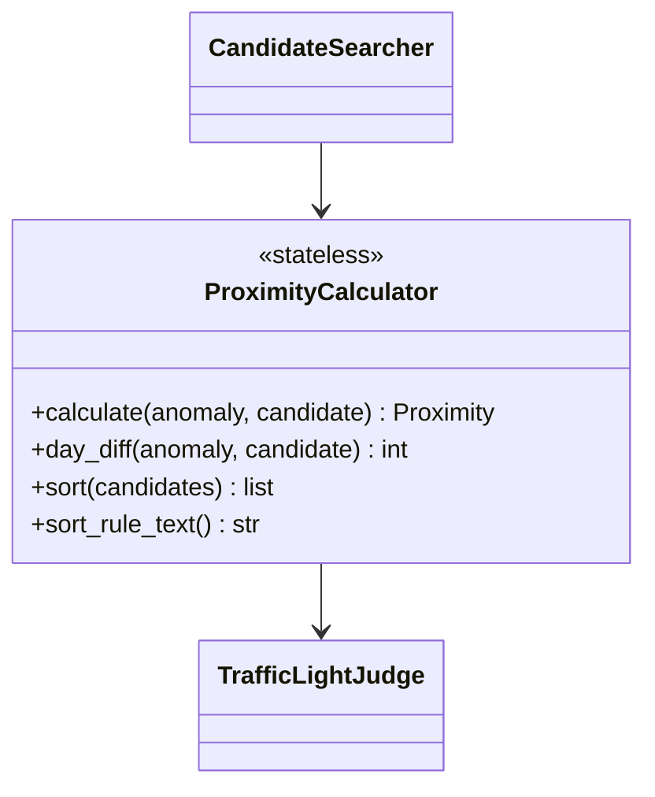
```mermaid
classDiagram
  class ProximityCalculator {
    <<stateless>>
    +calculate(anomaly, candidate) Proximity
    +day_diff(anomaly, candidate) int
    +sort(candidates) list
    +sort_rule_text() str
  }
  CandidateSearcher --> ProximityCalculator
  ProximityCalculator --> TrafficLightJudge
```

**속성.** 없다. 상태를 갖지 않는 순수 계산 클래스다. 상태를 들지 않으므로 다이어그램에 주석으로 표시한다.

**메서드.** `calculate`는 날짜 차이·기사 수·출처 수·국가 일치 방식 넷을 돌려준다. `day_diff`는 변동의 파일 기준일을 기준점으로 세고 사건은 마지막 관측일을 쓴다. `sort`는 날짜 차이 오름차순, 같으면 출처 수 내림차순, 그다음 기사 수 내림차순, 그래도 같으면 후보 식별자 사전순으로 정렬한다. 넷째 열쇠인 후보 식별자 사전순은 구현에서 뺄 수 없는 계약이다([[TBL-MS-001]]). `sort_rule_text`는 앞의 셋만 한 문장으로 돌려주고 응답과 화면이 글자로 적는다([[TBL-API-001]] 1.3절). 넷째를 화면 문장에 넣지 않는 것은 그것이 동률을 가르는 장치이지 읽는 사람에게 설명할 기준이 아니기 때문이다.

**관계.** [[#CandidateSearcher]]의 출력을 받아 [[#TrafficLightJudge]]로 넘긴다.

**판정 근거.** **이 클래스에 등급·점수·순위를 만드는 메서드를 두지 않는다.** 관련도 등급을 개념에서 뺀 것이 [[TBL-PRD-001#R26]]이고, 여기에 점수 하나를 만들면 그 결정이 되살아난다. 가중치를 합친 종합 점수도 두지 않는다. 가중치의 근거가 다시 임의가 되기 때문이다.

`sortOrder`는 관련도 순위가 아니라 정렬 규칙이 낳은 자리 번호다. 같은 입력이면 같은 번호가 나온다. 앞의 셋이 모두 같아도 넷째 열쇠가 순서를 끝까지 가르기 때문이다. 이 클래스가 상태를 갖지 않는 것도 같은 이유다. 상태가 있으면 실행 순서에 따라 값이 달라질 수 있다.

기간 구분이 넓은 변동에서 날짜 차이가 불리하게 나오는 것은 값이 그렇게 나오는 것이 맞다. 보정하지 않고 화면이 기간 구분을 함께 적어 읽는 사람이 감안하게 한다(6장 미결).

#### TrafficLightJudge 신호등 판정기

신호등을 규칙으로 정하고 워치리스트 줄과 도메인 상태 카드를 만든다.

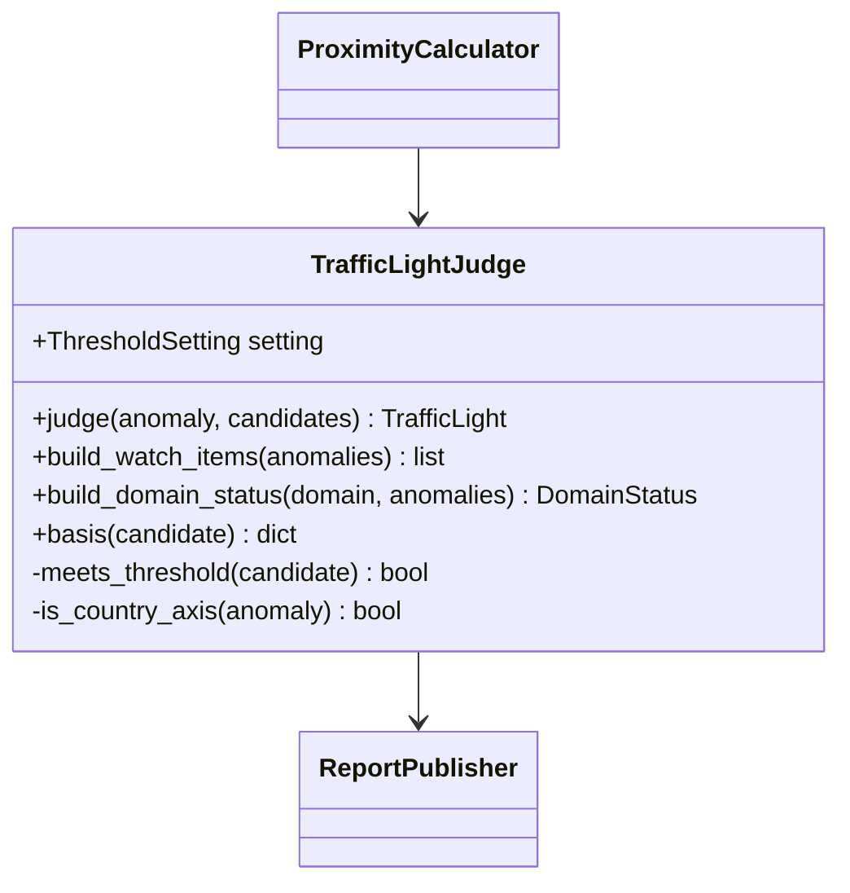
```mermaid
classDiagram
  class TrafficLightJudge {
    +ThresholdSetting setting
    +judge(anomaly, candidates) TrafficLight
    +build_watch_items(anomalies) list
    +build_domain_status(domain, anomalies) DomainStatus
    +basis(candidate) dict
    -meets_threshold(candidate) bool
    -is_country_axis(anomaly) bool
  }
  ProximityCalculator --> TrafficLightJudge
  TrafficLightJudge --> ReportPublisher
```

**속성.** `setting`이 최소 기사 수, 최소 출처 수, 시간창, CBU 비중 기준을 준다.

**메서드.** `judge`는 `red` `yellow` `none` `notApplicable` 중 하나와 그 근거를 돌려준다. 축 종류가 `country`가 아닌 변동은 `notApplicable`이다. `build_watch_items`는 [[TBL-DOM-001#WatchItem]] 목록을 만들고 신호등 순으로 정렬한다. `build_domain_status`는 도메인 하나의 상태 카드를 만든다. `basis`는 어느 후보의 어떤 값이 기준을 넘겼는지를 담는다. `is_country_axis`는 축 종류가 `country`인지 본다.

**규칙.** 사건 후보가 기사 수 ≥ 최소, 출처 수 ≥ 최소, 날짜 차이 ≤ 시간창 셋을 모두 채우고 완성차 노출이 확인되면 `red`. 셋을 채웠으나 노출이 미확인이면 `yellow`. 하나라도 못 채우면 `none`이고 목록에는 남는다. **축 종류가 `country`가 아니면 임계값을 보기 전에 `notApplicable`로 끝낸다.** `is_country_axis`가 거짓인 변동이 여기이고, 국가 축이 없는 생산이 그것이다.

**도메인 상태 규칙.** `build_domain_status`는 그 도메인 안 변동들의 신호등 최댓값을 카드의 신호등으로 쓴다. 판정 출처를 함께 담는데 `aJudgment` `supplementaryAggregate` `notReceived` 셋 중 하나이고, 2단계에서 A 판정을 읽었는지 보완 집계로 내려갔는지 아예 못 받았는지를 가른다([[#AJudgmentReader]]). 기여 분해 상위 몇 건도 사본으로 함께 담는다. 생산 도메인은 국가 축이 없어 변동이 국가 카드에 오르지 못하므로 신호등이 `notApplicable`이고 화면 표기가 "판정 대상 아님"이다([[TBL-API-001]] 4.4절). 후보를 못 찾아 `none`이 된 것과 아예 판정 대상이 아닌 것을 같은 색으로 적지 않는다.

**관계.** 판정 계층의 마지막 클래스다. 산출물이 [[#ReportPublisher]]로 바로 간다. 서술 계층을 거치지 않는다.

**판정 근거.** **신호등은 규칙 산출물이다.** LLM을 끄고 배치를 돌려도 같은 값이 나와야 한다([[TBL-INFRA-001#C19]] [[TBL-PRD-001#R11]]). 근거를 함께 저장하는 이유는 화면에서 왜 그 색인지 보여 주기 위해서다([[TBL-UC-001#UC-S8]]).

워치리스트 줄과 도메인 상태 카드를 이 클래스가 만드는 것이 경계의 핵심이다. 게시기에서 만들면 8단계 산출물이 되고, 8단계는 LLM이 섞인 단계라 "LLM을 꺼도 워치리스트와 도메인 상태가 같다"를 보장할 수 없다.

**도메인 상태에서 LLM이 쓰는 것은 문장 한 줄뿐이다.** 신호등, 판정 출처, 기여 분해는 여기 5단계에서 확정된다. [[#ClaimWriter]]의 `write_domain_status`는 그 값을 받아 문장만 쓰고, 값을 고치지 않는다. 카드를 채워 게시하는 것은 [[#ReportPublisher]]의 `publish`다.

**축 종류가 `plant`인 변동은 여기서 빠진다.** 생산에는 목적지 국가가 없어 국가 카드에 오를 수 없다([[TBL-INFRA-001#C16]]).

### 4.4 서술 계층

배치 6~8단계다. 다섯 중 셋이 LLM을 부르고 둘은 코드다. **이 계층이 통째로 죽어도 앞 계층의 산출물은 [[#ReportPublisher]]까지 그대로 간다.**

#### EventNamer 사건 명명기

이미 묶인 사건에 사람이 읽을 이름을 붙인다.

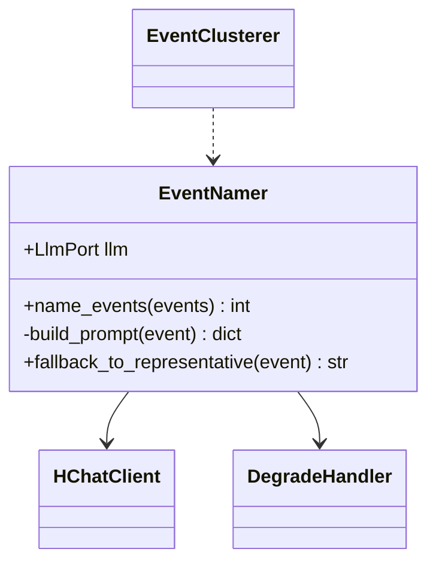
```mermaid
classDiagram
  class EventNamer {
    +LlmPort llm
    +name_events(events) int
    -build_prompt(event) dict
    +fallback_to_representative(event) str
  }
  EventNamer --> HChatClient
  EventNamer --> DegradeHandler
  EventClusterer ..> EventNamer
```

**속성.** `llm: LlmPort`는 게이트웨이 포트다.

**메서드.** `name_events`는 이름을 붙인 건수를 돌려주며 바깥에서 부르는 입구가 이것 하나다. `build_prompt`는 사설이고 `name_events` 안에서만 돈다. 그 사건의 기사 제목과 출처만 담는다. `fallback_to_representative`는 실패했을 때 대표 기사 제목을 이름으로 쓰고 명명 주체를 그렇게 남긴다.

**관계.** [[#EventClusterer]]가 만든 묶음을 받아 이름 칸만 채운다. 묶음을 다시 만들지 않는다.

**판정 근거.** 이 클래스가 하는 일은 이름 하나뿐이다. 기사 수·출처 수·영향도는 이미 3단계에서 정해져 있고 모델이 손대지 못한다([[TBL-DOM-001#Event]]). 실패하면 대표 기사 제목으로 내려가고 배치는 계속된다([[TBL-INFRA-001#C13]]). 이름이 없어도 사건은 후보로 쓰인다.

#### CauseLinkWriter 연관 설명기

변동 하나와 후보들이 어떻게 이어지는지를 문단 하나로 쓴다.

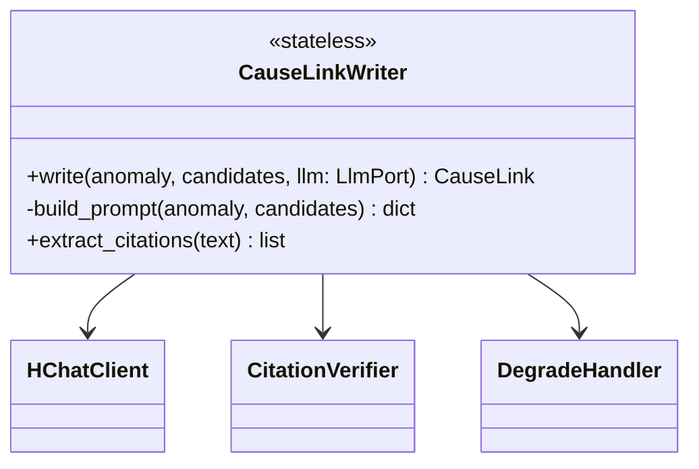
```mermaid
classDiagram
  class CauseLinkWriter {
    <<stateless>>
    +write(anomaly, candidates, llm: LlmPort) CauseLink
    -build_prompt(anomaly, candidates) dict
    +extract_citations(text) list
  }
  CauseLinkWriter --> HChatClient
  CauseLinkWriter --> CitationVerifier
  CauseLinkWriter --> DegradeHandler
```

**속성.** 없다. 게이트웨이 포트를 호출 인자로 받는다. 상태를 들지 않는 클래스라 다이어그램에 주석으로 표시한다.

**메서드.** `write`는 변동과 후보 목록과 포트를 받아 [[TBL-DOM-001#CauseLink]] 한 건을 돌려준다. `build_prompt`는 사설이고 `write` 안에서만 돈다. 그 변동의 후보 목록만 담고 후보 밖의 사실을 넣지 않는다. `extract_citations`는 문단에서 인용한 후보 식별자를 뽑는다.

**관계.** 변동마다 최대 하나 붙는다. 결과를 [[#CitationVerifier]]가 검사한다.

**판정 근거.** **등급을 매기지 않는다.** 이 클래스의 출력에 높음·낮음이나 점수 필드가 없다([[TBL-PRD-001#R26]] [[TBL-API-001]] 4.7절). 남은 일은 사람이 읽을 문장을 쓰는 것뿐이다.

후보 목록이 곧 모델이 인용할 수 있는 사실의 전부다. 프롬프트에 후보 밖의 값을 넣으면 검증기가 잡을 수 없는 문장이 나온다. 설명이 없어도 후보와 근접도 값은 화면에 그대로 남는다.

#### ClaimWriter 문장 생성기

리포트 문장을 쓴다. 헤드라인, 도메인 상태 세 장, 국가 카드다.

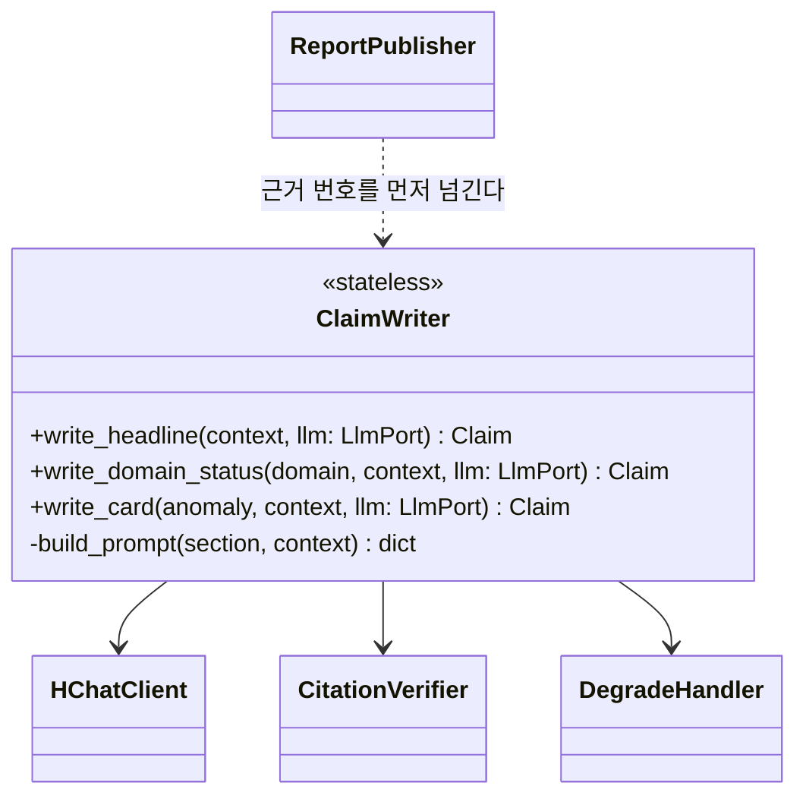
```mermaid
classDiagram
  class ClaimWriter {
    <<stateless>>
    +write_headline(context, llm: LlmPort) Claim
    +write_domain_status(domain, context, llm: LlmPort) Claim
    +write_card(anomaly, context, llm: LlmPort) Claim
    -build_prompt(section, context) dict
  }
  ClaimWriter --> HChatClient
  ClaimWriter --> CitationVerifier
  ClaimWriter --> DegradeHandler
  ReportPublisher ..> ClaimWriter : 근거 번호를 먼저 넘긴다
```

**속성.** 없다. 게이트웨이 포트를 호출 인자로 받는다. 상태를 들지 않는 클래스라 다이어그램에 주석으로 표시한다.

**메서드.** 구역마다 메서드가 하나다. 각각 [[TBL-DOM-001#Claim]] 한 건을 돌려주고 각주 번호 목록을 함께 담는다. `build_prompt`는 사설이고 세 메서드가 안에서만 쓴다. **`write_domain_status`는 문장만 쓴다.** 도메인 상태 카드의 신호등·판정 출처·기여 분해는 5단계에서 [[#TrafficLightJudge]]가 이미 정해 두었고 이 메서드는 그것을 입력으로 받는다.

**관계.** 근거 번호는 [[#ReportPublisher]]가 먼저 매겨 이 클래스에 넘긴다. 모델이 번호를 만들지 않는다.

**판정 근거.** 번호를 코드가 먼저 매기는 이유는 각주가 실제 근거를 가리켜야 하기 때문이다([[TBL-DOM-001#Evidence]] [[TBL-PRD-001#N4]]). 모델에게 번호를 만들게 하면 없는 각주가 생긴다.

**생산 구역의 문장은 외부 원인을 인용하지 않는다.** 국가 축이 없어 이을 자리가 없기 때문이고, 프롬프트에 후보를 아예 넣지 않는 것으로 지킨다([[TBL-INFRA-001#C16]] [[TBL-PRD-001#R15]]).

#### CitationVerifier 검증기

모델이 쓴 문장의 인용이 후보 목록 밖으로 나갔는지 대조한다. 코드다.

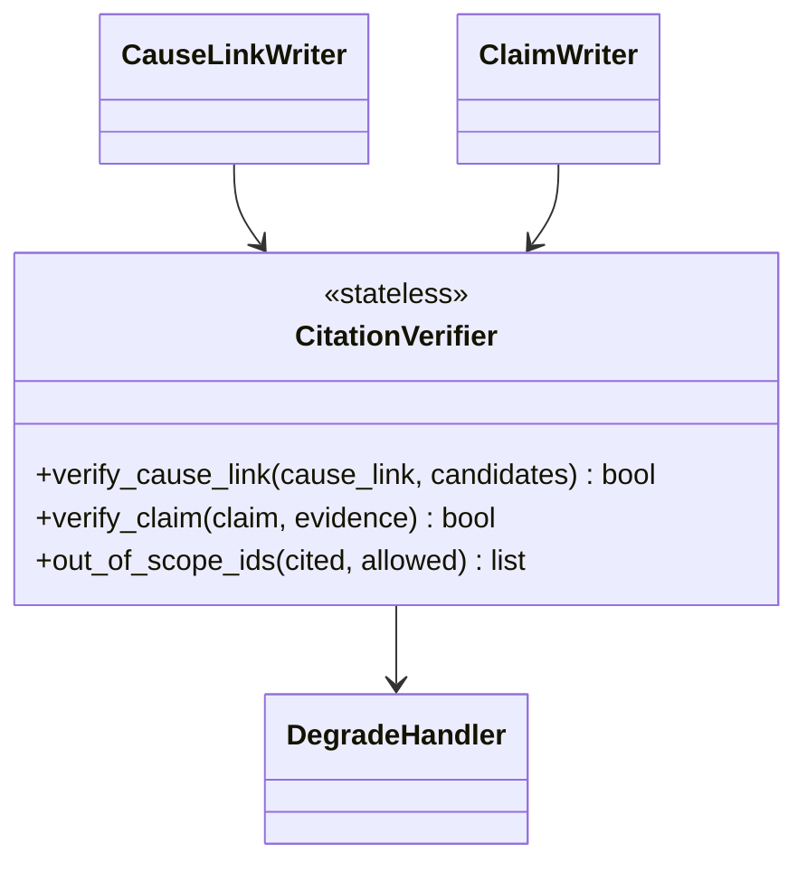
```mermaid
classDiagram
  class CitationVerifier {
    <<stateless>>
    +verify_cause_link(cause_link, candidates) bool
    +verify_claim(claim, evidence) bool
    +out_of_scope_ids(cited, allowed) list
  }
  CauseLinkWriter --> CitationVerifier
  ClaimWriter --> CitationVerifier
  CitationVerifier --> DegradeHandler
```

**속성.** 없다. 상태를 갖지 않으므로 다이어그램에 주석으로 표시한다.

**메서드.** `verify_cause_link`는 인용한 후보 식별자가 전부 그 변동의 후보 안에 있는지 본다. `verify_claim`은 각주 번호가 전부 근거 목록 안에 있는지 본다. `out_of_scope_ids`는 벗어난 식별자를 돌려주고 강등 사유에 담긴다.

**관계.** 서술 계층의 출력을 전부 통과시킨다. 실패하면 [[#DegradeHandler]]로 넘긴다.

**판정 근거.** **검사를 코드가 하는 것이 이 클래스의 존재 이유다.** 모델이 쓴 것을 모델에게 검사시키면 검사가 되지 않는다. 대조 자체는 식별자 집합 비교라 단순하고, 단순해야 이 검사가 실패하지 않는다.

#### DegradeHandler 강등 처리기

실패한 역할을 기록하고 배치를 계속 진행시킨다. 코드다.

```mermaid
classDiagram
  class DegradeHandler {
    <<stateless>>
    +degrade(role, reason, target) None
    +degraded_roles(batch_run_id) list
    -is_degraded(report) bool
  }
  EventNamer --> DegradeHandler
  CauseLinkWriter --> DegradeHandler
  ClaimWriter --> DegradeHandler
  CitationVerifier --> DegradeHandler
  DegradeHandler --> ReportPublisher
```

**속성.** 없다. 상태를 들지 않는 클래스라 다이어그램에 주석으로 표시한다.

**메서드.** `degrade`는 역할(`naming` `causeLink` `narration`)과 사유를 받아 기록한다. 사유는 LLM 오류, 내용 필터, 형식 위반, 인용 검증 실패, 백필 모드 다섯이다([[TBL-API-001]] 4.7절). `degraded_roles`는 그 배치에서 강등된 역할 목록을 돌려준다. `is_degraded`는 사설이고 `degraded_roles`가 비었는지 보는 내부 판정이다.

**관계.** 서술 계층 넷이 전부 이 클래스로 실패를 보낸다. 결과가 [[#ReportPublisher]]와 리포트의 강등 표시로 간다.

**판정 근거.** 강등을 예외로 던지지 않고 기록으로 다루는 것이 [[TBL-INFRA-001#C13]]이다. 예외로 던지면 호출부마다 잡아야 하고 한 군데만 빠뜨려도 배치가 멈춘다. **강등은 6~8단계에만 생긴다.** 1~5단계에는 이 클래스를 부르는 자리가 없다.

### 4.5 게시·열람 계층

#### ReportPublisher 게시기

근거에 번호를 매기고 C 리포트 한 본을 게시 스키마에 넣는다. A 리포트 사본도 이 클래스가 올린다.

```mermaid
classDiagram
  class ReportPublisher {
    <<stateless>>
    +number_evidence(anomalies, candidates) list
    +publish(batch_run, base_date) CReport
    +publish_a_report(domain, document) str
    +diff_watchlist(current, previous) list
    +copy_display_values(evidence) None
    -next_version(base_date) int
  }
  TrafficLightJudge --> ReportPublisher
  DegradeHandler --> ReportPublisher
  ReportPublisher --> CReportService
  ReportPublisher --> DomainReportService
  ReportPublisher ..> BriefingStoreReader : A 리포트 본문 읽기
  ReportPublisher ..> ClaimWriter : 번호를 먼저 넘긴다
```

**속성.** 없다. 상태를 들지 않는 클래스라 다이어그램에 주석으로 표시한다.

**메서드.** `number_evidence`는 8단계 맨 앞에서 돌아 [[TBL-DOM-001#Evidence]] 번호를 먼저 매긴다. `publish`는 [[TBL-DOM-001#CReport]] 한 버전을 만든다. 도메인 상태 3카드를 채우는 것도 이 메서드이며, 값은 [[#TrafficLightJudge]]의 `build_domain_status` 산출물을 그대로 옮기고 문장만 [[#ClaimWriter]]에게서 받는다. `publish_a_report`는 브리핑 갈래가 게시한 A 리포트를 문장·각주 근거·버전까지 받아 게시 스키마 사본으로 올리고 그 사본의 식별자를 돌려준다. `diff_watchlist`는 직전 게시본과 국가별 신호등을 비교해 [[TBL-DOM-001#AlertEvent]]를 만들고 변화 배지를 붙인다. `copy_display_values`는 표시용 값을 근거 행에 복사한다. `next_version`은 같은 기준일의 다음 버전 번호를 돌려준다.

**관계.** 판정 계층과 서술 계층의 산출물이 여기서 합쳐진다. 서술이 비어 있어도 게시한다. A 리포트 본문은 [[#BriefingStoreReader]]에게서 받아 [[#DomainReportService]]가 읽을 자리에 둔다.

**A 리포트 사본을 이 클래스가 올리는 이유.** 열람 경로는 게시 스키마만 본다([[TBL-INFRA-001#C10]]). A 리포트 화면이 원본 저장소를 직접 보면 그 제약이 깨지고, 브리핑 갈래가 원본을 고치면 어제 본 문장이 오늘 달라진다. 사본에 게시 버전을 함께 남기므로 같은 버전을 다시 열면 같은 문장이 나온다. 이 사본은 C 생성에 쓰지 않는다. C의 서술은 판정 값에서만 만든다(1.1절).

**판정 근거.** 번호 매기기가 문장 쓰기보다 먼저 도는 순서가 이 클래스의 계약이다([[#ClaimWriter]]). 표시값을 복사해 두는 이유는 열람할 때 조인을 없애기 위해서다([[TBL-PRD-001#N5]] [[TBL-INFRA-001#C9]]).

**재생성이 기존 게시본을 덮지 않는다.** 항상 새 버전이고 게시 전환은 사람이 누른다([[TBL-UC-001#UC-A4]] [[TBL-API-001#POST/api/admin/batch/publish/{reportId}]]).

데이터 최신일을 리포트 기준일과 따로 두는 이유는 둘이 다를 수 있기 때문이다. 소스별 파일 기준일 중 가장 늦은 것이 데이터 최신일이다([[TBL-DOM-001#CReport]]).

#### CReportService C 리포트 조회

게시된 C 리포트를 읽어 준다. 다시 계산하지 않는다.

```mermaid
classDiagram
  class CReportService {
    <<stateless>>
    +get_latest() CReport
    +get_by_id(report_id, viewer) CReport
    -assert_published_or_admin(report, viewer) None
  }
  ReportPublisher --> CReportService
```

**속성.** 없다. 게시 스키마 읽기 전용 세션만 쓴다. 상태를 들지 않는 클래스라 다이어그램에 주석으로 표시한다.

**메서드.** 둘 다 [[TBL-API-001#GET/api/intel/creport/latest]]와 [[TBL-API-001#GET/api/intel/creport/version/{reportId}]]에 1:1로 걸린다. `assert_published_or_admin`은 현업 토큰으로 미게시본을 부르면 404를 낸다. 존재 여부를 알려 주지 않기 위해 403이 아니다.

**관계.** [[#ReportPublisher]]가 넣은 것만 읽는다.

**판정 근거.** **열람 경로에 집계·조인·LLM이 없다.** 게시 스키마만 보고 p95 2초 안에 끝난다([[TBL-PRD-001#N5]] [[TBL-INFRA-001#C10]]). 근거 패널까지 한 응답에 담아 펼칠 때 추가 호출이 없다([[TBL-UC-001#UC-H2]]). 응답 크기가 커지는 문제는 남아 있다(6장 미결).

#### DomainReportService A 리포트 조회

A1 생산·A2 재고·A3 판매 중 한 도메인의 최신 게시 리포트를 읽어 준다.

```mermaid
classDiagram
  class DomainReportService {
    <<stateless>>
    +get_latest_by_domain(domain) DomainReport
    +get_by_id(domain_report_id) DomainReport
    +build_domain_extra(domain, report) dict
    +list_missing_metrics(domain) list
  }
  ReportPublisher --> DomainReportService
  DomainReportService ..> DomainReport
```

**속성.** 없다. 상태를 들지 않는 클래스라 다이어그램에 주석으로 표시한다.

**메서드.** 앞의 둘이 [[TBL-API-001#GET/api/intel/areport/domain/{domain}]]과 [[TBL-API-001#GET/api/intel/areport/version/{domainReportId}]]에 걸린다. `build_domain_extra`는 도메인마다 다른 덩어리를 만든다. `list_missing_metrics`는 데이터 구조상 못 만드는 지표를 이유와 함께 돌려준다([[TBL-API-001]] 4.13절).

**관계.** [[#ReportPublisher]]가 올린 게시 사본을 읽기만 한다. 만들지 않는다. 브리핑 갈래 저장소를 직접 보지 않으므로 열람 경로가 게시 스키마 밖으로 나가지 않는다([[TBL-INFRA-001#C10]]).

**판정 근거.** **응답 어디에도 뉴스·시장지표 인용이 없다.** 이것이 인수 기준이다([[TBL-PRD-001#R29]]). C 리포트로 가는 링크 필드도 두지 않는다. A에서 C로 가는 화면 흐름이 없기 때문이다.

빈 자리를 추정값으로 채우지 않고 못 만드는 이유를 적는 것이 `list_missing_metrics`의 존재 이유다. 항해중·선적대기 재고, 목적지 국가, 파워트레인 분해가 여기에 들어간다.

#### MarketService 시장지표 시계열 조회

지표 하나의 최근 값 목록을 읽어 준다.

```mermaid
classDiagram
  class MarketService {
    <<stateless>>
    +get_series(indicator_id, days) list
    +as_of(indicator_id, date) MarketPoint
    +is_carried_over(point, date) bool
  }
  MarketService ..> MarketPoint
  FactJoiner ..> MarketService : as-of 조회
```

**속성.** 없다. 상태를 들지 않는 클래스라 다이어그램에 주석으로 표시한다.

**메서드.** `get_series`는 [[TBL-API-001#GET/api/intel/market/series/{indicatorId}]]에 걸린다. `as_of`는 특정 날짜 기준 값을 돌려주고 [[#FactJoiner]]도 쓴다. `is_carried_over`는 값이 이월된 것인지 본다.

**관계.** [[TBL-DOM-001#MarketPoint]]를 읽는다.

**판정 근거.** 지표는 국가·차종과 이어지지 않아 조인 축이 날짜뿐이다([[TBL-DOM-001#MarketPoint]]). 그래서 신호등의 입력이 아니고 후보와 표시용으로만 쓴다. 이월 한도를 넘으면 값을 비우고 기준일 지연만 적으며 판정에 쓰지 않는다([[TBL-UI-001#UI-10]]).

#### BatchService 배치 조회·재실행

배치 상태와 이력을 보여 주고, 다시 돌리고, 게시 전환한다.

```mermaid
classDiagram
  class BatchService {
    <<stateless>>
    +get_status() dict
    +list_runs(filters, cursor) list
    +get_run(batch_run_id) BatchRun
    +request_rerun(base_date, start_stage, options) BatchRun
    +publish_version(report_id) dict
    -assert_not_running(base_date) None
  }
  BatchService --> PipelineRunner
  BatchService --> ReportPublisher
```

**속성.** 없다. 상태를 들지 않는 클래스라 다이어그램에 주석으로 표시한다.

**메서드.** 다섯이 [[TBL-API-001]]의 배치 엔드포인트 다섯과 1:1이다. `get_status`는 자동 실행이 막혀 있는지와 무엇이 막고 있는지를 함께 돌려준다. `request_rerun`은 기준일과 시작 단계를 받아 [[#PipelineRunner]]를 부른다. `publish_version`은 게시 전환 후 워치리스트 변화를 다시 계산한다([[TBL-UC-001#UC-S5]]). `assert_not_running`은 같은 기준일 배치가 돌고 있으면 409를 낸다.

**관계.** [[#PipelineRunner]]를 부르는 유일한 서비스다. worker는 한 번에 하나만 돌므로 겹치면 대기시킨다([[TBL-INFRA-001]] 4장).

**판정 근거.** 지정 단계부터 다시 돌리는 것과 특정 일자를 재생성하는 것을 한 호출로 합친 이유는 둘이 같은 일이기 때문이다([[TBL-API-001#POST/api/admin/batch/rerun]]). 시작 단계가 1이면 재생성이고 6이면 서술만 다시 도는 것이다.

게시 전환을 재실행과 나눈 이유는 사람이 결과를 보고 결정하기 때문이다. 자동 전환이면 재생성이 게시본을 덮는다.

#### MasterService 마스터·크로스워크

국가 매칭률을 보여 주고, 크로스워크를 받고, 확정한다.

```mermaid
classDiagram
  class MasterService {
    <<stateless>>
    +get_summary() dict
    +list_unmapped(filters) list
    +upload_crosswalk(upload) dict
    +confirm_crosswalk(upload_id, confirm_removal) dict
    -diff_against_current(upload) dict
  }
  RecordStandardizer ..> MasterService : 미매핑 넘김
```

**속성.** 없다. 상태를 들지 않는 클래스라 다이어그램에 주석으로 표시한다.

**메서드.** 넷이 [[TBL-API-001]]의 마스터 엔드포인트 넷과 1:1이다. `get_summary`는 매칭률 셋(판매→국가, 생산→국가, 뉴스→국가)과 버전 이력을 돌려준다. `diff_against_current`는 확정하면 무엇이 지워지는지 미리 보여 준다. `confirm_crosswalk`는 지워지는 매핑이 있으면 확인 없이는 409를 낸다.

**관계.** [[#RecordStandardizer]]가 모은 미매핑을 읽는다. [[TBL-DOM-001#Country]] [[TBL-DOM-001#Strait]] [[TBL-DOM-001#GlovisEntity]]를 관리한다.

**판정 근거.** 확정 전에 지워지는 매핑을 보여 주는 이유는 크로스워크가 통째 교체이기 때문이다([[TBL-UC-001#UC-A2]]). 한 줄 빠진 파일을 올리면 그 국가의 과거 매핑이 조용히 사라진다.

**글로비스 법인 매핑은 아직 비어 있다.** 발주자에게 받아야 채워지고, 빈 동안에는 법인 미매핑으로 표시하며 오류로 보지 않는다([[TBL-DOM-001#GlovisEntity]]).

### 4.6 어댑터

#### HChatClient H-chat 클라이언트

사내 게이트웨이에 LLM을 부른다. 서술 계층만 쓴다.

```mermaid
classDiagram
  class HChatClient {
    +str base_url
    +str model
    +int daily_token_limit
    +complete(prompt, json_schema, purpose) dict
    +remaining_tokens() int
    -log_call(purpose, tokens, latency, result) None
  }
  EventNamer --> HChatClient
  CauseLinkWriter --> HChatClient
  ClaimWriter --> HChatClient
```

**속성.** `base_url`과 `model`은 환경변수로 주입한다. 키는 코드·문서·저장소에 적지 않고 로그에도 남기지 않는다([[TBL-INFRA-001#C3]]). `daily_token_limit: int`은 일 토큰 상한이다.

**메서드.** `complete`는 프롬프트와 응답 스키마를 받아 결과를 돌려준다. `remaining_tokens`는 남은 토큰을 돌려주고 0이면 그날은 더 부르지 않는다. `log_call`은 지점·모델·토큰·지연·결과를 건마다 남긴다.

**관계.** `LlmPort`의 구현체다. 서술 계층 셋만 부른다. **판정 계층의 어느 클래스도 이 클래스를 import 하지 않는다.**

**판정 근거.** OpenAI 호환 규격이라 같은 코드로 개발 환경에서는 OpenAI를, 폐쇄망에서는 H-chat을 가리킨다([[TBL-INFRA-001#C2]]). 포트를 둔 이유가 이것이고, "나중에 바꿀지도 모르니까"가 아니라 지금 두 곳을 가리켜야 한다.

JSON 모드를 쓰는 것은 가정이다. 게이트웨이가 응답 스키마 지정을 지원한다는 회신을 받았으나 실호출로 확인한 범위가 좁다. 형식 위반이 오면 강등 사유 `jsonViolation`으로 떨어진다([[TBL-API-001]] 4.7절).

일 토큰 상한에 걸려도 판정은 이미 5단계에서 끝나 있다([[TBL-INFRA-001]] 8장).

#### BriefingStoreReader 브리핑 갈래 저장소 리더

A 판정과 내부 분해를 읽고, A 리포트 본문도 읽는다. 읽기만 한다.

```mermaid
classDiagram
  class BriefingStoreReader {
    +str dsn
    +read_judgments(base_date, domain) list
    +read_contributions(judgment_id) list
    +read_report_document(base_date, domain) dict
    +snapshot_id(base_date) str
    +ping() bool
  }
  AJudgmentReader --> BriefingStoreReader
  ReportPublisher --> BriefingStoreReader
```

**속성.** `dsn: str`은 읽기 전용 계정의 접속 문자열이다.

**메서드.** `read_judgments`는 도메인·국가·기간 키로 판정을 읽는다. `read_contributions`는 그 판정의 기여를 읽는다. 둘은 C 생성 경로가 쓰며 문장을 가져오지 않는다. `read_report_document`는 그 도메인의 게시된 A 리포트를 통째로 읽는다. 요약과 해설 문장, 고정 문구, 트래킹 지표, 분해, 못 만드는 지표, 문장에 달린 각주 근거, 게시 버전과 게시 시각까지 담는다. `snapshot_id`는 그 기준일 스냅샷의 식별자를 돌려주고 재현에 쓴다. `ping`은 접속을 확인하며 배치 2단계에 들어가기 전과 관리 화면의 연동 점검이 부른다.

**관계.** `BriefingStorePort`의 구현체다. 부르는 쪽이 둘이다. [[#AJudgmentReader]]가 판정을 읽고, [[#ReportPublisher]]가 `read_report_document`로 A 리포트 본문을 읽어 게시 사본으로 옮긴다.

**판정 근거.** **쓰기 메서드를 두지 않는다.** 계정 권한으로도 막지만 클래스에도 쓰기 메서드가 없어야 실수할 자리가 없다([[TBL-INFRA-001#C5]]).

**판정 읽기와 본문 읽기를 메서드로 갈라 둔 이유.** 두 경로의 쓰임이 다르기 때문이다. 판정은 C의 변동 판정에 들어가고 문장이 섞이면 안 된다. 본문은 A 리포트 화면에 그대로 나가야 하므로 문장까지 필요하다. 한 메서드로 합치면 C 생성 쪽이 문장을 받게 되고, 그것을 쓰지 않는다는 규칙이 코드에서 보이지 않는다.

접근 방식이 아직 정해지지 않았다. 같은 DB인지 별도 인스턴스인지, 읽기 계정을 어떻게 받는지가 미결이다([[TBL-INFRA-001]] 9장). 그래서 포트로 감싸 두고 실패하면 보완 집계로 내려가는 경로를 [[#AJudgmentReader]]에 두었다.

## 5. 경계

**밖에 있는 것.** A 리포트를 만드는 브리핑 갈래의 코드, 태블로 대시보드, 뉴스 API가 기사에 붙이는 분류와 영향도. 이 문서의 어느 클래스도 이것들을 만들지 않는다.

**ORM 모델 클래스는 여기에 없다.** 이 문서는 처리 클래스만 다룬다. 테이블과 매핑되는 클래스, 컬럼 타입, 인덱스는 ERD 문서가 정한다. `models.py`가 폴더 구조에 자리만 잡혀 있는 것이 그 이유다.

**두지 않은 클래스 하나.** 등급 계산기다. 후보에 높음·낮음을 매기는 클래스를 만들면 [[TBL-PRD-001#R26]]의 결정이 되살아난다. 대신 [[#ProximityCalculator]]가 셀 수 있는 값 넷만 센다. 가중치를 합친 종합 점수 계산기도 두지 않는다.

**합치지 않은 클래스 둘.** [[#EventClusterer]]와 [[#EventNamer]]다. 하나는 코드이고 하나는 LLM이며, 합치면 신호등이 LLM 실패에 끌려간다. [[#CauseLinkWriter]]와 [[#CitationVerifier]]도 나눴다. 쓴 쪽과 검사하는 쪽이 같으면 검사가 되지 않는다.

### 5.1 판정 계층과 서술 계층의 경계

**한 문장.** 판정 계층은 코드만 쓰고 5단계에서 끝난다. 서술 계층은 그 결과를 사람이 읽을 수 있게 만드는 일이며, 통째로 죽어도 판정 산출물은 그대로 게시된다([[TBL-INFRA-001#C19]] [[TBL-INFRA-001#C13]]).

**도메인 상태 3카드도 판정 계층 산출물이다.** 카드의 신호등과 판정 출처와 기여 분해는 [[#TrafficLightJudge]]의 `build_domain_status`가 5단계에서 낸다. 8단계의 [[#ClaimWriter]]가 쓰는 것은 카드에 얹히는 문장 한 줄뿐이다. 문장이 비어도 카드의 색과 값은 그대로 나간다. 색과 문장을 같은 클래스가 만들면 LLM이 죽었을 때 카드가 통째로 빈다.

**죽으면 안 되는 클래스와 죽어도 되는 클래스.**

| 죽으면 배치가 멈춘다 | 죽어도 리포트는 나간다 |
|:--|:--|
| [[#IngestService]] [[#FormDetector]] [[#FormALedgerParser]] [[#FormBPivotParser]] [[#RecordStandardizer]] [[#RegressionChecker]] | [[#EventNamer]] |
| [[#EventClusterer]] [[#FactJoiner]] [[#StageFlowCalculator]] [[#AnomalyDetector]] | [[#CauseLinkWriter]] |
| [[#CandidateSearcher]] [[#ProximityCalculator]] [[#TrafficLightJudge]] | [[#ClaimWriter]] |
| [[#ReportPublisher]] | [[#HChatClient]] |
| | [[#AJudgmentReader]] (보완 집계로 내려간다) |

**LLM이 꺼져도 같아야 하는 것 다섯.** 변동 목록, 원인 후보 목록, 근접도 값 넷, 변동별 신호등과 후보 순서, 도메인 상태 3카드의 신호등이다. 이것을 확인하는 방법이 `llm_enabled=False`로 같은 기준일을 돌려 대조하는 회귀 검사다([[#PipelineRunner]] [[TBL-INFRA-001#C19]]).

**코드에서 지키는 방법 셋.**

1. `judgment/` 아래 어느 파일도 `adapters/`를 import 하지 않는다. import 하면 판정 경로에 LLM이 섞인 것이다.
2. [[#TrafficLightJudge]]가 워치리스트 줄과 도메인 상태 카드까지 만들고 [[#ReportPublisher]]에 바로 넘긴다. 서술 계층을 거치지 않는다.
3. 서술 계층의 실패는 예외가 아니라 [[#DegradeHandler]] 호출이다. 예외로 던지면 호출부 하나만 빠뜨려도 배치가 멈춘다.

**경계를 넘는 값은 한 방향으로만 흐른다.** 서술 계층은 판정 계층의 산출물을 읽기만 하고 고치지 않는다. [[#EventNamer]]가 사건의 이름 칸만 채우고 기사 수를 건드리지 않는 것, [[#CauseLinkWriter]]가 후보를 인용만 하고 만들지 않는 것, [[#ClaimWriter]]의 `write_domain_status`가 카드의 신호등을 고치지 않는 것이 그것이다. [[#CitationVerifier]]가 검사하는 것도 이 방향이 지켜졌는지다.

## 6. 미결사항

- [ ] 배치 1단계와 3단계의 실패 처리. [[TBL-INFRA-001#C19]]가 명시한 것은 4·5단계 멈춤과 6~8단계 강등뿐이다. 이 문서는 1·3도 멈춤으로 두었다([[#PipelineRunner]])
- [ ] [[#FormALedgerParser]]가 대조할 실제 컬럼 목록. IF 레이아웃 정의만 있고 실물 파일을 본 적이 없다([[TBL-RFQ-001#Q59]])
- [ ] [[#FormBPivotParser]]의 `detect_file_base_date`가 파일 안에서 기준일을 읽을 수 있는지. 못 읽으면 관리자 입력이 필수가 된다([[TBL-INFRA-001#C15]])
- [ ] [[#AJudgmentReader]]가 읽을 스냅샷의 실제 키와 필드. 이것이 정해져야 `validate_shape`의 대조 목록이 확정된다([[TBL-DOM-001#DomainJudgment]])
- [ ] [[#BriefingStoreReader]]의 접속 방식. 같은 DB인지 별도 인스턴스인지, 읽기 계정을 어떻게 받는지
- [ ] [[#BriefingStoreReader]]의 `read_report_document`가 읽을 A 리포트 문서의 실제 키와 필드. 게시 사본 컬럼과 1:1로 맞춰야 한다([[TBL-DOM-003]])
- [ ] [[#HChatClient]]의 JSON 모드. 게이트웨이가 응답 스키마 지정을 지원한다는 것은 현재 가정이며 실호출 확인 범위가 좁다
- [ ] [[#ProximityCalculator]]의 `day_diff`를 기간 구분에 따라 보정할지. 누계·년 변동은 후보가 구조적으로 멀어 보인다. 지금은 보정하지 않고 화면에 기간 구분을 적는 것으로 둔다
- [ ] [[#TrafficLightJudge]]의 임계값 실제 수치. 최소 기사 수, 최소 출처 수, 시간창, CBU 비중 기준이 전부 현업 검토 대기다
- [ ] [[#CReportService]]의 응답 크기. 후보와 근거를 한 번에 담으면 국가가 늘었을 때 커진다. 근거 패널을 별도 호출로 나눌지([[TBL-API-001]] 5장)
- [ ] [[#MasterService]]의 크로스워크 확정 후 재계산 범위. 과거 기준일을 어디까지 다시 돌릴지
- [ ] 설정 변경을 SQL로 할지 CLI를 만들지. 화면이 없으므로 [[TBL-DOM-001#ThresholdSetting]] 새 버전 행을 넣는 방법이 정해져야 한다
- [ ] [[#CReportService]] [[#DomainReportService]] [[#MarketService]] 셋을 `intel` 도메인 한 폴더에 두었다. 파일을 셋으로 나눌지 하나로 둘지는 구현 시 판단한다
- [ ] 프런트엔드 `pages/` 파일 목록. [[TBL-UI-001]]의 화면 항목과 1:1이며 이름은 화면 확정 후 붙인다
