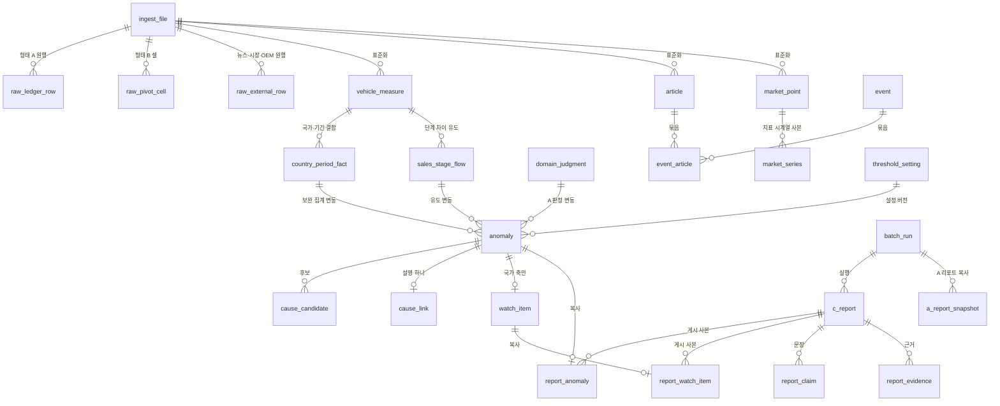
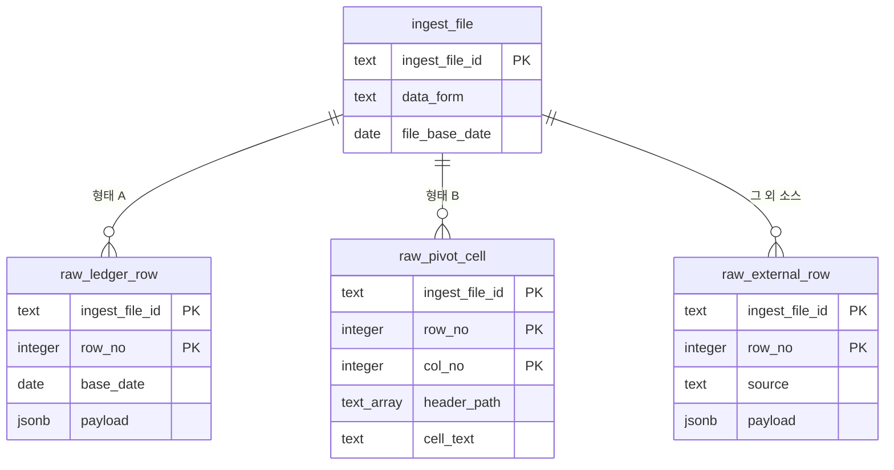
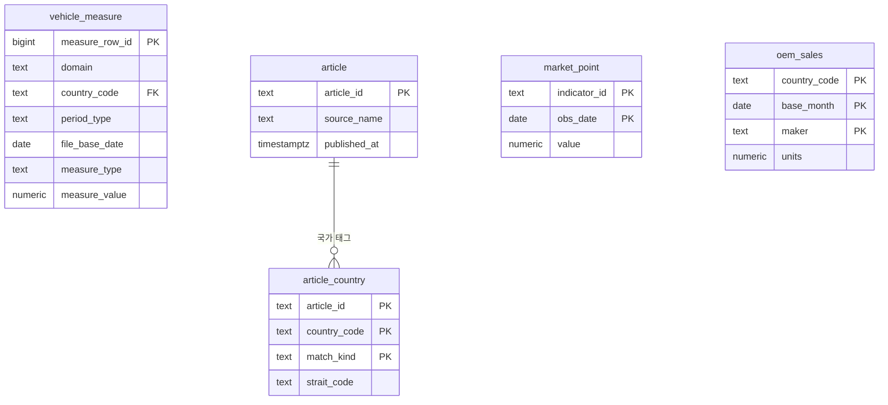
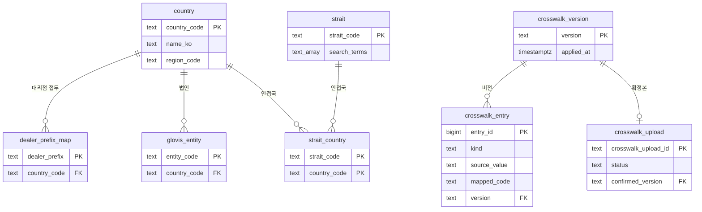
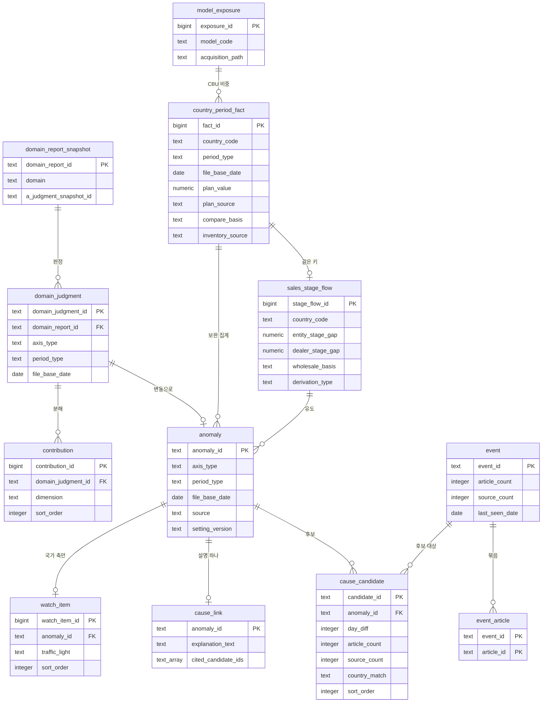
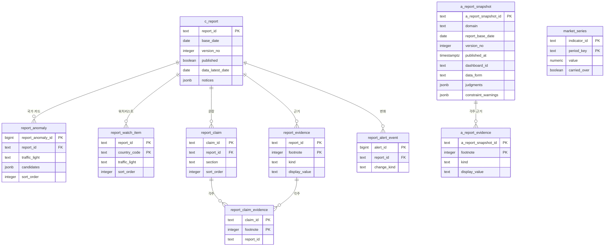
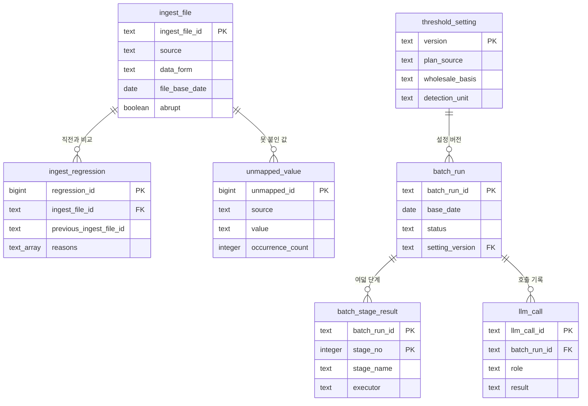

# ERD·데이터 사전

## 0. 이 문서가 다루는 것

[[TBL-DOM-001]]이 정한 개념 24개와 [[TBL-DOM-002]]가 정한 처리 클래스 28개가 실제로 어느 테이블에 앉는지를 정한다. 스키마 여섯, 테이블 마흔다섯, 그 컬럼과 타입과 널 허용, 그리고 조회 패턴별 인덱스를 적는다.

여기서 정하지 않는 것이 셋이다. 첫째, 개념의 뜻은 [[TBL-DOM-001]]이 정했고 이 문서는 그것을 컬럼으로 펼치기만 한다. 둘째, 어느 클래스가 어느 테이블에 쓰는지는 [[TBL-DOM-002]] 1.1절의 엔티티 대응표가 정본이다. 셋째, 파티셔닝과 보관 기간은 실데이터 행수가 확정되기 전까지 미결이다(5장).

**이 문서가 지키는 계약은 넷이다.**

1. **시간 축은 칸 두 개다.** 단일 기준일 컬럼을 두지 않는다. 기간 구분(`period_type`)과 파일 기준일(`file_base_date`)을 함께 둔다([[TBL-INFRA-001#C15]] [[TBL-API-001]] 1.4절).
2. **등급·점수 컬럼을 두지 않는다.** `score` `grade` `rank` `relevance` `confidence`와 그 변형을 어느 테이블에도 두지 않는다([[TBL-PRD-001#R26]] [[TBL-API-001]] 1.3절). 허용하는 순서 컬럼은 `sort_order` 하나이고 정렬 규칙이 낳은 자리 번호다.
3. **모든 산출 행이 기준일과 배치 실행 ID를 가진다.** 여기에 설정 버전과 A 판정 스냅샷 ID가 더해져 재현이 성립한다([[TBL-INFRA-001#C11]]).
4. **열람은 게시 스키마만 읽는다.** `pub` 밖의 테이블은 열람 계정이 보지 못한다([[TBL-INFRA-001#C10]]). 그래서 게시 시점에 표시값을 복사하고, 인덱스 설계도 `pub`에 집중한다. A 리포트 지면도 예외가 아니다. 브리핑 갈래가 게시한 A 리포트를 문장까지 통째로 받아 [[#a_report_snapshot]]에 사본으로 두고 화면은 그 사본만 읽는다.

## 1. 스키마와 표기 규약

### 1.1 여섯 스키마

PostgreSQL 16 한 대에 스키마로 나눈다([[TBL-INFRA-001]] 6절).

| 스키마 | 무엇 | 테이블 수 | 쓰는 쪽 | 읽는 쪽 |
|:--|:--|--:|:--|:--|
| `raw` | 받은 파일을 행 그대로. 형태 A는 원장 행, 형태 B는 펼치기 전 셀 | 3 | worker·web | worker |
| `std` | 표준화한 완성차 긴 형태, 기사, 시장지표, OEM 판매 | 5 | worker·web | worker |
| `master` | 크로스워크 이관본과 버전 | 8 | worker·web | worker |
| `mart` | 결합·변동·후보·근접도·신호등·연관 설명 | 12 | worker | worker |
| `pub` | 게시된 C 리포트와 근거, A 리포트 게시 사본, 지표 시계열 사본 | 10 | worker | web |
| `ops` | 적재·배치 이력, LLM 호출, 설정, 미매핑 | 7 | worker·web | web |

계정 분리는 [[TBL-INFRA-001]] 5절을 따른다. `web`은 `pub` 읽기와 `raw`·`std`·`ops` 쓰기(수동 적재)만 가지고, `worker`가 전 스키마에 쓴다.

### 1.2 공통 컬럼 계약

**시간 두 칸.** 아래 테이블은 `period_type`과 `file_base_date`를 반드시 함께 가진다. 하나만 두면 일 단위 값과 누계 값이 같은 컬럼에 섞여 구분되지 않는다.

| 테이블 | 개념 |
|:--|:--|
| [[#vehicle_measure]] | 표준 측정 행 |
| [[#domain_judgment]] | [[TBL-DOM-001#DomainJudgment]] |
| [[#country_period_fact]] | [[TBL-DOM-001#CountryDayFact]] |
| [[#sales_stage_flow]] | [[TBL-DOM-001#SalesStageFlow]] |
| [[#model_exposure]] | [[TBL-DOM-001#ModelExposure]] |
| [[#anomaly]] | [[TBL-DOM-001#Anomaly]] |
| [[#ingest_file]] | [[TBL-DOM-001#IngestFile]] |

`period_type`은 `day` `month` `cumulative` `year` 넷이다. 형태 A(IF 원장)로 들어온 행은 `period_type = 'day'`이고 `file_base_date`가 그 행의 기준일자와 같다. 형태 B(피벗 리포트)는 헤더에서 온 기간 구분과 파일이 붙여 준 날이다.

**축 두 칸.** [[#domain_judgment]]와 [[#anomaly]]는 `axis_type`(`country`·`plant`)과 `country_code`·`plant_code`를 가진다. `axis_type = 'plant'`인 행은 [[#watch_item]]과 국가 카드에 오르지 않는다([[TBL-INFRA-001#C16]]).

**재현 두 칸.** `mart`와 `pub`의 모든 행이 `base_date`(리포트가 서 있는 날)와 `batch_run_id`(계산한 실행)를 가진다. 여기에 판정 행은 `setting_version`을, A 판정에서 온 행은 `a_judgment_snapshot_id`를 더한다.

시점이 셋이라는 것에 주의한다. 데이터가 말하는 시점은 `file_base_date`, 리포트가 서 있는 시점은 `base_date`, 계산한 시점은 `batch_run_id`가 가리키는 실행 시각이다. 셋이 전부 다를 수 있다.

### 1.3 타입과 이름 규약

| 항목 | 규약 |
|:--|:--|
| 테이블·컬럼 이름 | 소문자 스네이크. 약어를 쓰지 않는다 |
| 널 허용 표기 | 아래 표의 `널` 칸. `N`은 NOT NULL, `Y`는 NULL 허용 |
| 식별자 타입 | API가 문자열로 내보내는 것은 `text`(ULID). 밖으로 나가지 않는 대용량 행은 `bigserial` |
| 수치 | 대수는 `numeric(18,3)`, 비율은 `numeric(10,6)`. `double precision`을 쓰지 않는다 |
| 날짜 | 날짜만이면 `date`, 시각이 필요하면 `timestamptz` |
| 열거 | `text` + `CHECK` 제약. PostgreSQL `enum` 타입을 쓰지 않는다 |
| 결측 | `NULL`. `-` 같은 표기를 0으로 바꾸지 않는다 |
| 가변 배열 | `text[]` 또는 `integer[]`. 구조가 있으면 `jsonb` |

**열거를 `enum` 타입으로 만들지 않는 이유.** 값이 늘 때마다 `ALTER TYPE`이 필요하고 폐쇄망에서 마이그레이션 한 번이 반입 절차 한 번이다. `CHECK` 제약이면 같은 보장을 마이그레이션 없이 고칠 수 있다.

**결측을 0으로 바꾸지 않는 이유.** 계획이 없는 것과 계획이 0인 것은 다르다. 0으로 채우면 계획 대비 달성률이 무한대가 되거나 0%로 찍힌다([[TBL-DOM-002#RecordStandardizer]]).

**`double precision`을 쓰지 않는 이유.** 재현성이다. 같은 입력이면 같은 변동이 나와야 하는데([[TBL-INFRA-001#C11]]) 부동소수 누적 오차는 집계 순서에 따라 마지막 자리가 달라진다.

## 2. ERD

### 2.1 스키마 사이

파일이 왼쪽에서 들어와 오른쪽 게시본으로 나간다. 스키마 경계를 넘는 선만 그렸다.

`mart`에서 `pub`으로 가는 선 둘이 게시다. 값을 참조로 남기지 않고 복사한다. 열람이 `pub` 밖을 보지 못하기 때문이다([[TBL-INFRA-001#C10]]).

`domain_judgment`에서 `anomaly`로 가는 선이 A 판정이 C 생성에 닿는 유일한 통로다. A가 쓴 문장은 이 선을 건너오지 않는다.

A 리포트 문장은 따로 [[#a_report_snapshot]]에 게시 사본으로 들어온다. 그 사본은 열람 경로 전용이고 C 서술은 여전히 판정만 읽는다.

### 2.2 raw 스키마

형태 A는 행이 단위라 원행 하나가 한 줄이고, 형태 B는 병합 헤더 때문에 셀이 단위다. 펼치기 전 상태를 셀로 남겨야 펼치기가 어긋났을 때 원본과 대조할 수 있다([[TBL-DOM-002#FormBPivotParser]]).

### 2.3 std 스키마

**완성차 표준 테이블은 긴 형태 하나다.** 형태 A와 형태 B가 같은 테이블로 들어가고, 형태 B의 병합 헤더 한 칸이 (기간 구분, 지표 종류) 한 쌍으로 펼쳐져 원본 한 행이 지표 종류 수만큼의 행으로 늘어난다([[TBL-INFRA-001]] 6.1절).

### 2.4 master 스키마

### 2.5 mart 스키마

`cause_link`의 기본키가 `anomaly_id`라는 것이 이 그림의 계약이다. **연관 설명은 변동마다 하나다.** 후보마다 등급을 매기던 구조가 사라진 자리이고, 설명은 후보 여럿을 `cited_candidate_ids`로 인용한다([[TBL-DOM-001#CauseLink]]).

### 2.6 pub 스키마

`report_anomaly`가 후보 목록을 `jsonb`로 안고 있는 것이 이 스키마의 절충이다. 이유는 4.1절에 적었다.

[[#a_report_snapshot]]과 [[#a_report_evidence]]는 C 리포트에 매달리지 않는다. A 리포트는 도메인과 기준일과 버전으로 서고 C와 다른 주기로 게시되기 때문이다. [[#market_series]]도 지표별 시계열 한 벌이라 리포트에 매달리지 않는다.

### 2.7 ops 스키마

## 3. DD 테이블 명세

컬럼 표의 `널` 칸은 `N`이 NOT NULL, `Y`가 NULL 허용이다. 각 표 아래 한 줄에 기본키와 유일 제약을 적는다.

### 3.1 raw 스키마

받은 파일을 손대지 않고 그대로 남기는 자리다. 여기 값을 판정에 쓰지 않는다. 펼치기나 표준화가 어긋났을 때 원본과 대조하는 것이 유일한 용도다.

#### raw_ledger_row 형태 A 원장 원행

스키마 `raw`. IF 원장(생산 17열, 판매·재고 23열)의 한 행을 그대로 담는다.

| 컬럼 | 타입 | 널 | 설명 |
|:--|:--|:--|:--|
| `ingest_file_id` | text | N | 어느 적재 건인가. [[#ingest_file]] |
| `row_no` | integer | N | 파일 안 행 번호. 1부터 |
| `base_date` | date | Y | 행의 기준일자. 형태 A는 값이 있고, 없으면 형태 판별이 애초에 실패한다 |
| `payload` | jsonb | N | 헤더명을 키로 한 원문 그대로. 숫자도 문자열로 둔다 |
| `loaded_at` | timestamptz | N | 적재 시각 |

기본키 `(ingest_file_id, row_no)`.

#### raw_pivot_cell 형태 B 셀 원본

스키마 `raw`. 피벗 리포트를 펼치기 전 상태로 셀 단위로 담는다.

| 컬럼 | 타입 | 널 | 설명 |
|:--|:--|:--|:--|
| `ingest_file_id` | text | N | [[#ingest_file]] |
| `row_no` | integer | N | 데이터 행 번호. 헤더 줄은 포함하지 않는다 |
| `col_no` | integer | N | 컬럼 번호. 1부터 |
| `header_path` | text[] | N | 병합 헤더 2~3줄을 위에서부터 이어 붙인 것. 펼치기 전 상태 그대로 |
| `cell_text` | text | Y | 원문 그대로. `-` 같은 결측 표기도 그대로 둔다 |
| `is_total_row` | boolean | N | 총계 행이면 참. 총계 행은 상세 행과 범위가 다를 수 있어 함께 집계하지 않는다 |

기본키 `(ingest_file_id, row_no, col_no)`.

**행이 아니라 셀이 단위인 이유.** 병합 헤더를 잘못 펴면 값이 엉뚱한 기간과 지표 종류에 붙는데, 그 결과가 숫자로는 멀쩡해 보인다([[TBL-DOM-002#FormBPivotParser]]). 펼친 뒤 값만 남기면 어긋난 것을 되짚을 방법이 없다. `header_path`를 배열로 남기면 `(기간 구분, 지표 종류)`로 푼 결과와 원문을 한 줄씩 대조할 수 있다.

#### raw_external_row 뉴스·시장·OEM 원행

스키마 `raw`. 뉴스·블룸버그·Marklines·크로스워크 파일의 원행이다.

| 컬럼 | 타입 | 널 | 설명 |
|:--|:--|:--|:--|
| `ingest_file_id` | text | N | [[#ingest_file]] |
| `row_no` | integer | N | 파일 안 행 번호 |
| `source` | text | N | `news` `bloomberg` `marklines` `crosswalk` |
| `schema_version` | text | Y | 뉴스는 가공본·원본 두 벌이라 반드시 채운다 |
| `payload` | jsonb | N | 헤더명을 키로 한 원문 그대로 |
| `loaded_at` | timestamptz | N | |

기본키 `(ingest_file_id, row_no)`.

### 3.2 std 스키마

#### vehicle_measure 완성차 표준 측정 행

스키마 `std`. **형태 A와 형태 B가 만나는 유일한 테이블이다.** 차원 조합 하나와 기간 구분 하나와 지표 종류 하나가 값 하나를 가리키는 긴 형태다.

| 컬럼 | 타입 | 널 | 설명 |
|:--|:--|:--|:--|
| `measure_row_id` | bigserial | N | 내부 식별자. 밖으로 나가지 않는다 |
| `domain` | text | N | `production` `inventory` `sales` |
| `country_code` | text | Y | **생산 행은 항상 NULL이다.** 목적지 국가가 데이터에 없다 |
| `region_code` | text | Y | 대권역 |
| `sales_entity_code` | text | Y | 판매 법인 |
| `dealer_code` | text | Y | 대리점 코드. 앞 세 자리가 국가를 가리킨다 |
| `production_entity_code` | text | Y | 생산 법인. 28개 |
| `plant_region` | text | Y | 공장지역. 18개 |
| `model_group_code` | text | Y | 차종 그룹. 감지 단위의 기본값 |
| `model_detail_code` | text | Y | 세부 차종. 분해에만 쓴다 |
| `segment_code` | text | Y | 차급 |
| `cbu_ckd` | text | Y | `CBU` `CKD`. 판매 형태 B에는 컬럼이 그대로 있다 |
| `domestic_export` | text | Y | 내수·수출 |
| `domestic_overseas` | text | Y | 국내·해외 |
| `powertrain_code` | text | Y | 저장은 하되 분해 차원에서 뺀다. 44~53%가 미분류다 |
| `extra_dimensions` | jsonb | Y | 그 파일에만 있는 축. 세부지역, 제네시스, N시리즈 등 |
| `period_type` | text | N | `day` `month` `cumulative` `year` |
| `file_base_date` | date | N | 형태 A는 행의 기준일자, 형태 B는 파일이 붙여 준 날 |
| `measure_type` | text | N | 아래 아홉 중 하나 |
| `measure_value` | numeric(18,3) | Y | 결측은 NULL. 0으로 바꾸지 않는다 |
| `is_total_row` | boolean | N | 총계 행이면 참. 판정 대상에서 뺀다 |
| `data_form` | text | N | `A` `B` |
| `schema_version` | text | Y | |
| `ingest_file_id` | text | N | [[#ingest_file]] |
| `source_row_no` | integer | N | 원행 번호. `raw`로 되짚는 열쇠 |

기본키 `measure_row_id`. 유일 제약 `(ingest_file_id, source_row_no, measure_type, period_type)`.

**`measure_type` 아홉.** `operationPlan`(운영계획) `businessPlan`(사업계획) `actual`(실적) `progressRate`(진도율) `yoyRate`(전년대비) `shipment`(선적) `actualWholesale`(실 도매) `officialWholesale`(도매(공식)) `retail`(소매). 계획 두 종류와 도매 두 기준을 둘 다 저장한다([[TBL-INFRA-001#C18]]). 어느 쪽을 계산에 쓸지는 [[#threshold_setting]]이 고른다.

**넓은 형태로 두지 않은 이유.** 기간 블록이나 지표 종류가 늘 때마다 컬럼이 늘고 하류 조회가 전부 바뀐다. 컬럼 구성이 다른 형태 A와 같은 테이블에 들어가지도 못한다([[TBL-INFRA-001]] 6.1절).

**`progressRate`를 저장하되 믿지 않는다.** 인입 샘플에서 생산 진도율은 총계 행에만 값이 있고 개별 행은 전부 0이다. 계획 대비는 `actual`과 계획 정본으로 직접 계산한다([[TBL-DOM-002#AnomalyDetector]]).

**생산 행의 `country_code`가 NULL인 것이 이 문서에서 가장 멀리 퍼지는 사실이다.** [[#country_period_fact]]에 생산 행이 생기지 않고, 원인 후보가 붙지 않고, [[#watch_item]]에 오르지 않는다([[TBL-INFRA-001#C16]]).

#### article 기사

스키마 `std`.

| 컬럼 | 타입 | 널 | 설명 |
|:--|:--|:--|:--|
| `article_id` | text | N | 원본 식별자를 그대로 쓴다. 중복 제거 키다 |
| `schema_version` | text | N | 가공본·원본 구분 |
| `title` | text | N | |
| `summary` | text | Y | |
| `source_name` | text | N | 매체 이름. 사건별 출처 수를 세는 근거다 |
| `published_at` | timestamptz | N | |
| `time_precision` | text | N | `exact` `day`. 날짜만 온 기사를 시각으로 속이지 않는다 |
| `url` | text | Y | 원문 주소. 사용자의 브라우저가 연다 |
| `category` | text | Y | |
| `impact` | numeric(10,6) | Y | 기사에 붙어 온 영향도. 우리가 매기지 않는다 |
| `ingest_file_id` | text | N | [[#ingest_file]] |

기본키 `article_id`.

#### article_country 기사 국가 태그

스키마 `std`. 기사 하나가 국가 여럿에 걸린다.

| 컬럼 | 타입 | 널 | 설명 |
|:--|:--|:--|:--|
| `article_id` | text | N | [[#article]] |
| `country_code` | text | N | [[#country]] |
| `match_kind` | text | N | `countryDirect` 또는 `straitAttributed` |
| `strait_code` | text | Y | `match_kind`가 `straitAttributed`일 때만 채운다 |

기본키 `(article_id, country_code, match_kind)`.

**해협 귀속을 같은 테이블에 두고 `match_kind`로 가르는 이유.** 호르무즈 기사가 오만·아랍에미리트에 붙지 않으면 중동 변동의 후보가 비어 버린다([[TBL-DOM-001#Strait]]). 그렇다고 직접 걸린 기사와 섞어 버리면 근접도의 `country_match` 값을 만들 수 없다. 한 테이블에 두고 칸으로 갈라야 [[#cause_candidate]]가 그 사실을 그대로 옮긴다.

#### market_point 시장지표 관측값

스키마 `std`.

| 컬럼 | 타입 | 널 | 설명 |
|:--|:--|:--|:--|
| `indicator_id` | text | N | `GPR` `BRENT` `BDI` `SCFI` |
| `obs_date` | date | N | 관측일. 이 지표는 날짜가 행에 붙어 온다 |
| `name` | text | N | 표시 이름 |
| `value` | numeric(18,6) | N | |
| `change_rate` | numeric(10,6) | Y | 전일 대비 |
| `display_in_bar` | boolean | N | 리포트 상단 지표 바에 싣는가 |
| `ingest_file_id` | text | N | |

기본키 `(indicator_id, obs_date)`.

기간 구분 칸이 없는 것이 완성차 테이블과 다른 점이다. 이 값은 날짜가 행에 있어 두 칸이 필요 없다. 완성차 쪽이 기간 단위일 때는 그 기간의 마지막 날 기준 as-of 값을 붙인다([[TBL-DOM-002#FactJoiner]]).

#### oem_sales 해외 OEM 월 판매

스키마 `std`. 현재 표본이 2019년 두 나라뿐이라 판정에 쓰지 않는다. 자리만 만든다.

| 컬럼 | 타입 | 널 | 설명 |
|:--|:--|:--|:--|
| `country_code` | text | N | |
| `base_month` | date | N | 그 달의 1일 |
| `maker` | text | N | 제조사 |
| `units` | numeric(18,3) | N | 판매량 |
| `ingest_file_id` | text | N | |

기본키 `(country_code, base_month, maker)`.

### 3.3 master 스키마

#### country 국가

스키마 `master`. 모든 결합의 축이다.

| 컬럼 | 타입 | 널 | 설명 |
|:--|:--|:--|:--|
| `country_code` | text | N | 세 자리. 실측 예 `B28`(미국) `B06`(캐나다) `B07`(칠레) |
| `name_ko` | text | N | |
| `name_en` | text | Y | |
| `region_code` | text | Y | 대권역 |
| `subregion_code` | text | Y | 권역 |
| `is_active` | boolean | N | |

기본키 `country_code`.

`country`가 179개국을 담아도 [[#country_period_fact]]에 행이 생기는 국가는 현재 미주뿐이다. 이 차이를 숨기지 않고 화면에 적는다([[TBL-DOM-001]] 4.1절).

#### dealer_prefix_map 대리점 접두 매핑

스키마 `master`. 대리점 코드 앞 세 자리로 국가를 찾는다.

| 컬럼 | 타입 | 널 | 설명 |
|:--|:--|:--|:--|
| `dealer_prefix` | text | N | 세 자리 |
| `country_code` | text | N | [[#country]] |
| `note` | text | Y | |

기본키 `dealer_prefix`.

**국가 코드와 따로 둔 이유.** 인입 샘플에서는 접두가 국가 코드와 같았지만(미국 `B28AB`, 캐나다 `B06AA`) 한 국가에 접두가 둘 이상 붙을 수 있고, 같다는 것이 규칙으로 보장된 적은 없다. 테이블을 따로 두면 어긋나는 날 한 줄 추가로 끝난다.

#### crosswalk_entry 크로스워크 항목

스키마 `master`. 국가·차종·법인 매핑 이관본이다.

| 컬럼 | 타입 | 널 | 설명 |
|:--|:--|:--|:--|
| `entry_id` | bigserial | N | |
| `kind` | text | N | `modelGroup` `modelDetail` `plant` `salesEntity` `newsCountry` `segment` |
| `source_value` | text | N | 원본 파일에 있던 값 그대로 |
| `mapped_code` | text | N | 표준 코드 |
| `mapped_name` | text | Y | |
| `version` | text | N | [[#crosswalk_version]] |

기본키 `entry_id`. 유일 제약 `(kind, source_value, version)`.

#### crosswalk_version 마스터 버전

스키마 `master`.

| 컬럼 | 타입 | 널 | 설명 |
|:--|:--|:--|:--|
| `version` | text | N | |
| `applied_at` | timestamptz | N | |
| `applied_by` | text | N | 확정한 사람 |
| `change_count` | integer | N | 추가·변경·삭제 합 |
| `note` | text | Y | |

기본키 `version`.

매핑이 바뀌면 과거 판정이 달라지므로 재생성으로만 반영하고 게시본을 덮어쓰지 않는다([[TBL-INFRA-001#C18]]).

#### crosswalk_upload 크로스워크 업로드

스키마 `master`. 올린 시트를 미리 보는 단계이고 아직 마스터를 바꾸지 않는다.

| 컬럼 | 타입 | 널 | 설명 |
|:--|:--|:--|:--|
| `crosswalk_upload_id` | text | N | [[TBL-API-001#POST/api/admin/master/confirm/{crosswalkUploadId}]]에 넘기는 값 |
| `uploaded_at` | timestamptz | N | |
| `uploaded_by` | text | N | |
| `file_path` | text | N | 원본 보관 경로 |
| `added_count` | integer | N | |
| `changed_count` | integer | N | |
| `removed_count` | integer | N | |
| `will_become_unmapped` | integer | N | 이 확정으로 미매핑이 될 값의 건수 |
| `status` | text | N | `previewed` `confirmed` `discarded` |
| `confirmed_version` | text | Y | 확정됐으면 [[#crosswalk_version]] |

기본키 `crosswalk_upload_id`.

#### strait 해협

스키마 `master`.

| 컬럼 | 타입 | 널 | 설명 |
|:--|:--|:--|:--|
| `strait_code` | text | N | |
| `name` | text | N | |
| `search_terms` | text[] | N | 기사에서 이 해협을 찾는 말들 |

기본키 `strait_code`.

#### strait_country 해협 인접국

스키마 `master`.

| 컬럼 | 타입 | 널 | 설명 |
|:--|:--|:--|:--|
| `strait_code` | text | N | [[#strait]] |
| `country_code` | text | N | [[#country]] |

기본키 `(strait_code, country_code)`.

배열 컬럼이 아니라 테이블로 둔 이유는 후보 검색이 국가에서 해협으로 거꾸로 들어오기 때문이다. 배열이면 국가로 거는 인덱스를 만들 수 없다.

#### glovis_entity 글로비스 법인

스키마 `master`. 발주자에게 받아야 채워진다. 빈 동안에는 법인 미매핑으로 표시하고 오류로 보지 않는다.

| 컬럼 | 타입 | 널 | 설명 |
|:--|:--|:--|:--|
| `entity_code` | text | N | |
| `country_code` | text | N | [[#country]] |
| `entity_name` | text | N | |

기본키 `entity_code`.

행이 없는 것이 곧 미매핑이다. 별도 플래그를 두지 않는다.

### 3.4 mart 스키마

판정이 사는 자리다. 1~5단계가 여기까지 채우면 화면에 나갈 값이 전부 확정된다([[TBL-INFRA-001#C19]]).

#### domain_report_snapshot A 리포트 스냅샷

스키마 `mart`. 브리핑 갈래 저장소에서 읽어 복사한 것이다. C는 쓰지 않는다.

**판정 사본이고 문장 컬럼을 두지 않는다.** A가 쓴 요약·해설·고정 문구는 이 테이블에 들어오지 않는다. C 생성이 읽는 것은 [[#domain_judgment]]와 [[#contribution]]뿐이다. A 리포트 문장은 열람 전용 사본인 [[#a_report_snapshot]]이 따로 받는다.

| 컬럼 | 타입 | 널 | 설명 |
|:--|:--|:--|:--|
| `domain_report_id` | text | N | |
| `domain` | text | N | `production` `inventory` `sales` |
| `dashboard_id` | text | Y | 태블로 대시보드 식별자 |
| `report_base_date` | date | N | A 리포트가 서 있는 날 |
| `a_judgment_snapshot_id` | text | N | 재현의 열쇠 |
| `data_form` | text | Y | 그 리포트가 읽은 데이터 형태 |
| `base_date` | date | N | C 리포트 기준일 |
| `batch_run_id` | text | N | 복사한 실행 |
| `copied_at` | timestamptz | N | |

기본키 `domain_report_id`. 유일 제약 `(batch_run_id, domain)`.

#### domain_judgment A 판정

스키마 `mart`. A 리포트가 지표 하나에 대해 낸 변동 판정이다. 값을 다시 계산하지 않고 그대로 받는다.

| 컬럼 | 타입 | 널 | 설명 |
|:--|:--|:--|:--|
| `domain_judgment_id` | text | N | |
| `domain_report_id` | text | N | [[#domain_report_snapshot]] |
| `domain` | text | N | |
| `axis_type` | text | N | `country` `plant` |
| `country_code` | text | Y | `axis_type`이 `country`일 때 |
| `plant_code` | text | Y | `axis_type`이 `plant`일 때 |
| `metric` | text | N | |
| `period_type` | text | N | `day` `month` `cumulative` `year` |
| `file_base_date` | date | N | |
| `current_value` | numeric(18,3) | N | 당기 값 |
| `compare_value` | numeric(18,3) | Y | 비교 값 |
| `compare_basis` | text | N | `plan` `yoy` `mom` |
| `compare_period` | text | Y | 비교 값이 어느 기간인가 |
| `detection_unit` | text | N | `modelGroup` `modelDetail` |
| `changed` | boolean | N | 변동으로 판정됐는가 |
| `change_rate` | numeric(10,6) | Y | |
| `a_judgment_snapshot_id` | text | N | |
| `base_date` | date | N | |
| `batch_run_id` | text | N | |

기본키 `domain_judgment_id`.

**`axis_type`이 이 테이블의 핵심 칸이다.** A1 생산 판정은 `plant`로만 온다. 인입 데이터에 목적지 국가가 없어 국가 축을 만들 수 없기 때문이다. 목적지 국가 컬럼이 들어오면 그때 `country`가 된다([[TBL-DOM-001#DomainJudgment]]).

#### contribution 내부 분해 기여

스키마 `mart`. A 리포트가 대시보드 안에서 찾은 원인이다. C는 그대로 실어 나르고 다시 계산하지 않는다.

| 컬럼 | 타입 | 널 | 설명 |
|:--|:--|:--|:--|
| `contribution_id` | bigserial | N | |
| `domain_judgment_id` | text | N | [[#domain_judgment]] |
| `dimension` | text | N | `country` `modelGroup` `modelDetail` `plant` `segment` `dealer` |
| `item_name` | text | N | 예 칠레 |
| `item_code` | text | Y | |
| `contribution_value` | numeric(18,3) | N | 절대 대수 |
| `contribution_share` | numeric(10,6) | Y | 비중 |
| `sort_order` | integer | N | 기여값 내림차순이 낳은 자리. 중요도가 아니다 |
| `base_date` | date | N | |
| `batch_run_id` | text | N | |

기본키 `contribution_id`. 유일 제약 `(domain_judgment_id, dimension, sort_order)`.

`dimension`에 파워트레인이 없다. 인입 샘플에서 44~53%가 미분류라 차원에서 뺐다([[TBL-DOM-001#Contribution]]).

#### country_period_fact 국가·기간 결합

스키마 `mart`. 완성차 수치를 국가와 기간으로 모은 결합 테이블이다.

**테이블 이름에 `day`를 쓰지 않았다.** 개념 ID는 [[TBL-DOM-001#CountryDayFact]]로 남아 있지만 실제 단위는 하루가 아니라 기간 구분이다. 이름에 `day`를 박으면 누계 행이 들어 있는 테이블을 일별 테이블로 읽는 사람이 반드시 나온다.

| 컬럼 | 타입 | 널 | 설명 |
|:--|:--|:--|:--|
| `fact_id` | bigserial | N | |
| `country_code` | text | N | 국가가 없는 행은 애초에 들어오지 못한다 |
| `period_type` | text | N | |
| `file_base_date` | date | N | |
| `shipment` | numeric(18,3) | Y | 선적 |
| `actual_wholesale` | numeric(18,3) | Y | 실 도매 |
| `official_wholesale` | numeric(18,3) | Y | 도매(공식) |
| `retail` | numeric(18,3) | Y | 소매 |
| `plan_value` | numeric(18,3) | Y | 설정이 고른 계획 정본의 값. 계획이 없으면 NULL |
| `plan_source` | text | Y | `operationPlan` `businessPlan`. 어느 계획을 정본으로 썼는가 |
| `plan_alternative_diff` | numeric(18,3) | Y | 고르지 않은 쪽 계획과의 차이 |
| `compare_value` | numeric(18,3) | Y | 비교 값 |
| `compare_basis` | text | Y | `plan` `yoy` `mom`. 계획이 있으면 `plan`이 먼저다 |
| `inventory_afloat` | numeric(18,3) | Y | 항해중. 원천이 없어 현재 전부 NULL |
| `inventory_awaiting_shipment` | numeric(18,3) | Y | 선적대기. 현재 전부 NULL |
| `inventory_entity` | numeric(18,3) | Y | 법인재고. 현재 전부 NULL |
| `inventory_dealer` | numeric(18,3) | Y | 딜러재고. 현재 전부 NULL |
| `inventory_source` | text | Y | `measured` `derived`. 원천이 없는 동안 `derived` 고정 |
| `cbu_share` | numeric(10,6) | Y | 완성차 비중 |
| `event_count` | integer | N | 그 국가·기간에 걸린 사건 수 |
| `max_impact` | numeric(10,6) | Y | 기사 영향도의 최대값 |
| `market_asof` | jsonb | Y | 그 기간 마지막 날 기준 시장지표 값 |
| `supplementary` | boolean | N | 보완 집계로 만든 행인가 |
| `quality_flags` | text[] | Y | 결측·미매핑 등 |
| `ingest_file_id` | text | N | |
| `base_date` | date | N | |
| `batch_run_id` | text | N | |

기본키 `fact_id`. 유일 제약 `(batch_run_id, country_code, period_type, file_base_date)`.

**생산 수치 컬럼이 없다.** 국가 축이 없어 국가로 모을 수 없다. 생산은 [[#domain_judgment]]를 공장 축으로 받아 도메인 상태 한 줄에만 쓴다([[TBL-INFRA-001#C16]]).

**재고 네 칸은 자리만 있고 현재 전부 NULL이다.** 인입 샘플 어디에도 항해중·선적대기·법인재고·딜러재고가 없다. 그 자리를 [[#sales_stage_flow]]가 대신하고, 원천이 없는 동안 `inventory_source`는 `derived`로 고정한다. 원천이 들어오면 네 칸을 실측값이 채우고 `inventory_source`가 `measured`로 바뀐다([[TBL-INFRA-001#C17]]).

**계획 값을 결합에서 함께 채우는 이유.** 계획이 있으면 계획 대비를 먼저 본다([[TBL-PRD-001#R8]]). A 판정이 국가 단위가 아니어서 보완 집계로 만든 변동도 같은 기준을 써야 하는데, 계획 값이 이 행에 없으면 그 경로만 전년 대비로 떨어진다. [[TBL-DOM-002#FactJoiner]]가 [[#threshold_setting]]의 `plan_source`로 고른 계획 값을 행에 함께 넣고 고르지 않은 쪽과의 차이를 `plan_alternative_diff`에 남긴다. 계획이 없는 국가·기간은 `compare_basis`가 `yoy` 또는 `mom`이 된다.

#### sales_stage_flow 판매 단계 흐름

스키마 `mart`. 판매 네 계열의 값과 단계 사이의 차이다. 재고 원천이 없는 동안 재고 신호가 나오는 자리다.

| 컬럼 | 타입 | 널 | 설명 |
|:--|:--|:--|:--|
| `stage_flow_id` | bigserial | N | |
| `country_code` | text | N | |
| `period_type` | text | N | |
| `file_base_date` | date | N | |
| `shipment` | numeric(18,3) | N | 선적 |
| `actual_wholesale` | numeric(18,3) | Y | 실 도매 |
| `official_wholesale` | numeric(18,3) | N | 도매(공식) |
| `retail` | numeric(18,3) | N | 소매 |
| `entity_stage_gap` | numeric(18,3) | N | 법인 구간. 선적 빼기 도매정본. 음수 허용. 변동의 지표 이름은 `entityStageStay` |
| `entity_stage_gap_rate` | numeric(10,6) | Y | 도매정본으로 나눈 값 |
| `dealer_stage_gap` | numeric(18,3) | N | 딜러 구간. 도매정본 빼기 소매. 음수 허용. 변동의 지표 이름은 `distributionStay` |
| `dealer_stage_gap_rate` | numeric(10,6) | N | 도매정본으로 나눈 값 |
| `wholesale_basis` | text | N | `officialWholesale` `actualWholesale`. 어느 기준으로 계산했는가 |
| `wholesale_alternative_diff` | numeric(18,3) | Y | 다른 도매 기준과의 차이 |
| `derivation_type` | text | N | `derived` `measured` |
| `setting_version` | text | N | |
| `base_date` | date | N | |
| `batch_run_id` | text | N | |

기본키 `stage_flow_id`. 유일 제약 `(batch_run_id, country_code, period_type, file_base_date)`.

**부호는 앞 단계에서 뒤 단계를 뺀 값이다.** 미주 누계 실측으로 법인 구간 `entity_stage_gap`은 679,551 빼기 677,201로 2,350이고, 딜러 구간 `dealer_stage_gap`은 677,201 빼기 643,097로 34,104이며 비율이 0.050이다([[TBL-API-001]] 1.4절).

**구간이 둘이고 이름이 층마다 하나씩이다.** 컬럼 `entity_stage_gap`이 법인 구간이고 변동의 지표 이름은 `entityStageStay`, 화면 표기는 법인 단계 체류다. 컬럼 `dealer_stage_gap`이 딜러 구간이고 변동의 지표 이름은 `distributionStay`, 화면 표기는 유통 체류다([[TBL-API-001]]의 StageFlow 스키마 [[TBL-UI-001#UI-8]] [[TBL-UI-001#UI-9]]). 컬럼 이름은 API 응답 필드 이름을 그대로 따르고 지표 이름과는 일대일로 맞선다. 도매와 소매 사이를 가리키는 `wholesaleToRetailGap` 같은 다른 이름을 쓰지 않는다. 같은 값이 두 이름으로 불리면 API 지표 목록과 화면 문구가 어긋난다.

**음수에 `CHECK`를 걸지 않는다.** 소매가 도매를 넘는 국가는 이전에 쌓인 물량을 덜어내는 중이고 그 자체가 읽을 값이다. 실측에서 푸에르토리코 -0.137, 콜롬비아 -0.105다([[TBL-PRD-001#R30]]).

**`wholesale_basis`를 행마다 남기는 이유.** 도매가 두 기준으로 들어오고 미주 누계 상세 행 기준으로 실 도매 664,269와 도매(공식) 677,201이 12,932대 차이가 난다. 도매(공식) 대비 1.9%다. 앞 문단의 2,350과 34,104와 같은 범위(미주 누계 상세 행)의 값이므로 미주 구간 검증식에 그대로 쓴다. 같은 파일의 전체 총계 행은 실 도매 1,692,227과 도매(공식) 1,706,430이고 차이가 14,203대지만, 총계 행은 상세 행과 범위가 다르므로 상세 행 합과 더하지 않고 대조에만 쓴다. 어느 기준으로 계산했는지가 행에 없으면 같은 국가의 체류율이 설정에 따라 조용히 달라진다.

**구간을 둘로 나눈 이유.** 실측에서 앞 구간은 대부분 국가가 0에 가깝고 뒤 구간이 벌어진다. 다만 앞 구간도 캐나다 0.083처럼 벌어지는 국가가 있어 둘 다 저장한다.

#### model_exposure 차종 노출

스키마 `mart`.

| 컬럼 | 타입 | 널 | 설명 |
|:--|:--|:--|:--|
| `exposure_id` | bigserial | N | |
| `model_code` | text | N | 차종 코드 |
| `country_code` | text | Y | |
| `exposure_kind` | text | N | `CBU` `CKD` |
| `acquisition_path` | text | N | `columnDirect` `productionDerived` |
| `derivation_ratio` | numeric(10,6) | Y | 유도했을 때만 |
| `derivation_note` | text | Y | 유도 근거를 사람 말로. 수치 점수를 두지 않는다 |
| `period_type` | text | N | |
| `file_base_date` | date | N | |
| `base_date` | date | N | |
| `batch_run_id` | text | N | |

기본키 `exposure_id`. 유일 제약 `(batch_run_id, model_code, country_code, period_type, file_base_date)`.

**`acquisition_path`가 필수인 이유.** 형태 B는 판매 파일에 `CBU/CKD` 컬럼이 그대로 있어 읽기만 하면 되고, 형태 A는 생산 모델코드로 유도해야 한다. 유도가 실패하면 노출 미확인이고 그 국가는 [[#watch_item]]에서 RED까지 올라가지 못한다([[TBL-DOM-001#ModelExposure]]).

`derivation_note`가 수치가 아니라 글인 것에 주의한다. `confidence`라는 이름의 수치 컬럼은 판정의 세기를 모델이 정하는 것으로 읽히므로 두지 않는다([[TBL-API-001]] 1.3절). 이름에도 `confidence`를 넣지 않는다. 금지 이름 회귀 검사에 예외를 하나 두면 그 예외가 다음 컬럼의 근거가 된다.

#### anomaly 변동

스키마 `mart`. C 리포트가 다루는 변동 한 건이고 이 모델의 중심이다.

| 컬럼 | 타입 | 널 | 설명 |
|:--|:--|:--|:--|
| `anomaly_id` | text | N | API가 그대로 내보낸다 |
| `domain` | text | N | `production` `inventory` `sales` |
| `axis_type` | text | N | `country` `plant` |
| `country_code` | text | Y | |
| `plant_code` | text | Y | |
| `metric` | text | N | |
| `period_type` | text | N | |
| `file_base_date` | date | N | |
| `compare_period` | text | Y | 예 2025 누계 |
| `value` | numeric(18,3) | N | |
| `compare_value` | numeric(18,3) | Y | |
| `compare_basis` | text | N | `plan` `yoy` `mom` |
| `change_rate` | numeric(10,6) | Y | |
| `detection_unit` | text | N | `modelGroup` `modelDetail` |
| `source` | text | N | `aJudgment` `supplementaryAggregate` `derived` |
| `domain_judgment_id` | text | Y | `source`가 `aJudgment`일 때 |
| `stage_flow_id` | bigint | Y | `source`가 `derived`일 때 |
| `fact_id` | bigint | Y | `source`가 `supplementaryAggregate`일 때 |
| `contribution_summary` | jsonb | Y | 내부 분해 요약 |
| `setting_version` | text | N | |
| `a_judgment_snapshot_id` | text | Y | |
| `base_date` | date | N | |
| `batch_run_id` | text | N | |

기본키 `anomaly_id`. 유일 제약 `(batch_run_id, domain, axis_type, country_code, plant_code, metric, period_type, file_base_date)`.

**기준일 하나를 두 칸으로 바꾼 자리가 여기다.** 인입 샘플에 행 단위 기준일자가 없어 "9월 3일의 변동"을 만들 수 없다. 만들 수 있는 것은 "이 파일 기준일의 누계 기준 변동"이다. 두 칸을 함께 들고 있어야 같은 국가의 월 변동과 누계 변동이 한 화면에서 구분된다([[TBL-DOM-001#Anomaly]]).

**`axis_type`이 `plant`인 행도 만든다.** 만들되 [[#cause_candidate]]에서 국가 축 후보를 얻지 못하고 [[#watch_item]]에서 빠지며 열람 응답의 변동 목록에도 들어가지 않는다([[TBL-API-001]] 1.6절). 만들지 않는 것이 아니라 국가 쪽 처리에서 빠지는 것이다.

**`source`에 `derived`가 있는 이유.** 재고 변동이 [[#sales_stage_flow]]에서 나온다. 실측이 아님을 행이 스스로 말해야 화면에서도 그렇게 표시된다.

#### event 사건

스키마 `mart`. 같은 일을 말하는 기사 묶음이다. 묶음은 규칙이 만들고 이름만 LLM이 붙인다.

| 컬럼 | 타입 | 널 | 설명 |
|:--|:--|:--|:--|
| `event_id` | text | N | |
| `title` | text | N | 명명 실패면 대표 기사 제목이 들어간다 |
| `named_by` | text | N | `llm` `representativeArticle` |
| `event_type` | text | Y | |
| `category` | text | Y | |
| `country_code` | text | Y | |
| `strait_code` | text | Y | |
| `max_impact` | numeric(10,6) | Y | 기사에 붙어 온 영향도의 최대값. 우리가 매기지 않는다 |
| `first_seen_date` | date | N | |
| `last_seen_date` | date | N | 근접도의 날짜 차이가 이 값을 쓴다 |
| `article_count` | integer | N | |
| `source_count` | integer | N | 서로 다른 매체 이름의 개수 |
| `status` | text | N | |
| `representative_article_id` | text | N | [[#article]] |
| `base_date` | date | N | |
| `batch_run_id` | text | N | |

기본키 `event_id`.

`article_count`와 `source_count`를 컬럼으로 굳혀 두는 이유는 이 둘이 신호등의 입력이기 때문이다([[#watch_item]]). 조회할 때마다 세면 같은 배치 안에서도 기사가 더 들어오면 값이 달라진다.

#### event_article 사건 기사 묶음

스키마 `mart`.

| 컬럼 | 타입 | 널 | 설명 |
|:--|:--|:--|:--|
| `event_id` | text | N | [[#event]] |
| `article_id` | text | N | [[#article]] |
| `is_representative` | boolean | N | 대표 기사인가 |

기본키 `(event_id, article_id)`.

#### cause_candidate 원인 후보

스키마 `mart`. 변동 하나에 붙은 후보 한 건과 근접도 값 넷이다. 코드가 찾고 코드가 센다.

| 컬럼 | 타입 | 널 | 설명 |
|:--|:--|:--|:--|
| `candidate_id` | text | N | |
| `anomaly_id` | text | N | [[#anomaly]] |
| `candidate_type` | text | N | `event` `article` `marketMetric` `crossDomainAnomaly` |
| `target_id` | text | N | 사건·기사·지표·다른 변동의 식별자 |
| `title` | text | N | |
| `day_diff` | integer | N | 근접도 1. 변동의 `file_base_date`와의 날짜 차이 |
| `article_count` | integer | N | 근접도 2 |
| `source_count` | integer | N | 근접도 3. 서로 다른 매체 이름의 개수 |
| `country_match` | text | N | 근접도 4. `countryDirect` `straitAttributed` `crossDomainSameCountry` `dateOnly` |
| `sort_order` | integer | N | 정렬 규칙이 낳은 자리 번호 |
| `truncated` | boolean | N | 상한에 걸려 잘린 축에 속하는가 |
| `used_in_explanation` | boolean | N | [[#cause_link]]가 인용했는가 |
| `footnote` | integer | Y | 게시 때 코드가 매긴 각주 번호 |
| `base_date` | date | N | |
| `batch_run_id` | text | N | |

기본키 `candidate_id`. 유일 제약 `(anomaly_id, sort_order)`.

**정렬 순서.** `day_diff` 오름차순, 같으면 `source_count` 내림차순, 그다음 `article_count` 내림차순, 셋이 모두 같으면 `candidate_id` 사전순이다. 넷째 열쇠가 계약에 있어야 동률에서 자리가 흔들리지 않고, `sort_order`는 이 규칙이 낳은 자리 번호이며 같은 입력이면 같은 번호가 나온다. 화면이 글자로 적는 정렬 규칙 문장([[#c_report]]의 `candidate_sort_rule`)은 앞의 셋만 쓴다. 넷째는 동률을 가르는 장치이지 읽는 사람에게 설명할 기준이 아니기 때문이다.

**이 테이블에 등급·점수 컬럼이 없다는 것이 이 문서의 핵심 제약이다.** `score` `grade` `relevance` `rank` `confidence`와 그 변형을 두지 않는다. 근접도 값 넷이 정렬과 신호등의 유일한 입력이고 모델은 이 값을 바꾸거나 새로 만들 수 없다([[TBL-PRD-001#R26]] [[TBL-PRD-001#R27]]).

**근접도를 정규화하지 않고 컬럼 넷으로 편 이유.** 넷을 하나로 합치려면 가중치가 필요하고 그 가중치의 근거가 다시 임의가 된다. 넷을 그대로 두면 화면이 값을 그대로 적고 왜 이 순서인지 보여 줄 수 있다.

#### cause_link 연관 설명

스키마 `mart`. **변동마다 하나다.** 기본키가 `anomaly_id`인 것으로 그 사실을 강제한다.

| 컬럼 | 타입 | 널 | 설명 |
|:--|:--|:--|:--|
| `anomaly_id` | text | N | [[#anomaly]]. 기본키이자 외래키 |
| `explanation_text` | text | Y | 설명 문단 하나. 생성 실패면 NULL |
| `emphasis` | jsonb | Y | 강조 구간의 시작·끝 |
| `cited_candidate_ids` | text[] | N | 인용한 후보 식별자 목록. 전부 그 변동의 후보 안에 있어야 한다 |
| `footnotes` | integer[] | Y | 각주 번호 |
| `verified` | boolean | N | 인용 검증을 통과했는가 |
| `degraded` | boolean | N | |
| `degrade_reason` | text | Y | `llmFailure` `contentFilter` `jsonViolation` `citationVerificationFailed` `backfillMode` |
| `llm_call_id` | text | Y | [[#llm_call]] |
| `base_date` | date | N | |
| `batch_run_id` | text | N | |

기본키 `anomaly_id`.

**등급 컬럼이 없다.** 후보마다 높음·낮음을 매기던 구조가 사라진 자리이고, 남은 일은 사람이 읽을 문장을 쓰는 것뿐이다. 설명이 없어도 후보와 근접도 값은 화면에 그대로 남는다([[TBL-DOM-001#CauseLink]]).

`cited_candidate_ids`를 배열로 둔 이유는 검증이 집합 비교이기 때문이다. 별도 테이블로 풀면 검증 한 번에 조인이 붙고, 단순해야 이 검사가 실패하지 않는다([[TBL-DOM-002#CitationVerifier]]).

#### watch_item 워치리스트 항목

스키마 `mart`. 신호등과 그 근거가 사는 자리다. 5단계 산출물이고 LLM을 꺼도 같은 값이 나온다.

| 컬럼 | 타입 | 널 | 설명 |
|:--|:--|:--|:--|
| `watch_item_id` | bigserial | N | |
| `anomaly_id` | text | N | [[#anomaly]] |
| `country_code` | text | N | `axis_type`이 `country`인 변동만 온다 |
| `traffic_light` | text | N | `red` `yellow` `none` |
| `traffic_light_label` | text | N | 확인 필요·주의·원인 미확인. 색만으로 구분하지 않는다 |
| `basis_candidate_id` | text | Y | 기준을 넘긴 후보. 넘긴 후보가 없으면 NULL |
| `basis_article_count` | integer | Y | 그 후보의 기사 수 |
| `basis_article_count_min` | integer | Y | 그때 적용된 최소 기사 수 |
| `basis_source_count` | integer | Y | |
| `basis_source_count_min` | integer | Y | |
| `basis_day_diff` | integer | Y | |
| `basis_window_days` | integer | Y | 그때 적용된 시간창 |
| `exposure_confirmed` | boolean | N | 거짓이면 RED로 올라가지 못하고 YELLOW에서 멈춘다 |
| `sort_order` | integer | N | 신호등 순으로 매긴 자리 |
| `change_badge` | text | Y | `new` `raised` |
| `entity_code` | text | Y | [[#glovis_entity]]. 없으면 법인 미매핑 |
| `representative_candidate_id` | text | Y | 대표 후보 |
| `setting_version` | text | N | |
| `base_date` | date | N | |
| `batch_run_id` | text | N | |

기본키 `watch_item_id`. 유일 제약 `anomaly_id`.

**근거 칸을 값과 기준값 쌍으로 둔 이유.** "기사 12건, 기준 5건"처럼 둘을 함께 보여 줘야 왜 그 색인지 설명이 된다. 기준값만 설정 테이블에서 조회하면 나중에 설정이 바뀐 뒤 과거 리포트를 열었을 때 지금 기준으로 설명하게 된다.

**신호등 규칙.** 사건 후보가 `article_count` 이상, `source_count` 이상, `day_diff` 이하 셋을 모두 채우고 완성차 노출이 확인되면 `red`. 셋을 채웠으나 노출이 미확인이면 `yellow`. 하나라도 못 채우면 `none`이고 목록에는 남는다([[TBL-PRD-001#R11]]).

### 3.5 pub 스키마

게시본이 사는 자리다. 열람 계정이 읽는 유일한 스키마이고, 읽을 때 집계·조인·LLM을 하지 않는다([[TBL-INFRA-001#C9]] [[TBL-INFRA-001#C10]]).

#### c_report C 리포트

스키마 `pub`.

| 컬럼 | 타입 | 널 | 설명 |
|:--|:--|:--|:--|
| `report_id` | text | N | |
| `base_date` | date | N | 리포트가 서 있는 날 |
| `version_no` | integer | N | 같은 기준일의 몇 번째 본인가 |
| `published` | boolean | N | 게시본은 기준일마다 하나 |
| `vehicle_latest_date` | date | Y | 완성차 파일 기준일 중 가장 늦은 것 |
| `news_latest_date` | date | Y | 뉴스 파일 기준일 중 가장 늦은 것 |
| `market_latest_date` | date | Y | 시장지표 관측일 중 가장 늦은 것 |
| `data_latest_date` | date | N | 위 셋 중 가장 늦은 것 |
| `degraded` | boolean | N | |
| `degrade_reasons` | text[] | Y | 어느 역할이 왜 강등됐는가 |
| `notices` | jsonb | N | 화면에 띄울 안내 배열. 없으면 빈 배열 |
| `domain_status` | jsonb | N | 생산·재고·판매 세 장. 카드마다 신호등과 판정 출처와 기여 상위가 들어간다 |
| `market_bar` | jsonb | N | 상단 지표 바. 지표가 이월이어도 네 칸이 값과 이월 표시를 들고 내려간다 |
| `candidate_sort_rule` | text | N | 정렬 규칙 문장. 화면이 글자로 적는다 |
| `setting_version` | text | N | |
| `a_judgment_snapshot_id` | text | Y | |
| `batch_run_id` | text | N | |
| `created_at` | timestamptz | N | |
| `published_at` | timestamptz | Y | 사람이 게시 전환을 누른 시각 |

기본키 `report_id`. 유일 제약 `(base_date, version_no)`. 부분 유일 제약 `(base_date) WHERE published`.

**부분 유일 제약이 "게시본은 기준일마다 하나"를 강제한다.** 재생성은 새 버전으로 만들고 기존 게시본을 덮지 않는다([[TBL-UC-001#UC-A4]]).

`data_latest_date`를 `base_date`와 따로 둔 이유는 둘이 다를 수 있기 때문이다. 화면이 "데이터 기준 며칠"을 따로 적는다.

**소스별 최신일을 칸 셋으로 나눈 이유.** 화면 머리가 완성차·뉴스·시장 각각의 최신일을 적는다([[TBL-UI-001#UI-10]] 2번 요소). 가장 늦은 날 하나만 들고 있으면 뉴스만 사흘 밀린 날과 완성차가 밀린 날이 같은 화면으로 보인다. `data_latest_date`는 셋 중 가장 늦은 것이고 파생 값이다.

**`notices` 배열의 원소는 `code`와 `domain`과 `message`와 `lastSuccessDate` 넷이다.** `code`는 `noAnomaly` `generationDegraded` `aJudgmentNotReceived` `batchFailed` `marketCarriedOver` 다섯이고 [[TBL-UI-001#UI-10]]의 예외 상태 E1·E3·E4·E5·E6와 하나씩 짝을 이룬다. 어느 상태인지를 화면이 값으로 알아야 문구를 짜 맞추지 않는다. E2(첫 배치 전)는 게시본이 0건인 상태라 이 배열에 자리가 없다. `domain`은 도메인에 걸린 안내일 때만, `lastSuccessDate`는 `batchFailed`에만 채운다. 지표 이월의 관측일은 [[#market_series]]의 `source_obs_date`가 들고 있으므로 `notices`에 중복해 담지 않는다.

**`domain_status`의 세 장은 규칙 산출물이다.** 카드마다 `trafficLight`와 `judgmentSource`와 `topContributions`가 들어간다. 값은 [[TBL-DOM-002#TrafficLightJudge]]가 5단계에서 만들고 [[TBL-DOM-002#ReportPublisher]]가 이 칸에 넣는다. 8단계 LLM은 같은 카드의 문장만 쓰고 이 값을 만들지 않는다. `judgmentSource`는 `aJudgment` `supplementaryAggregate` `notReceived` 셋이고, `topContributions`는 [[#contribution]] 사본이다. 생산 카드는 국가 축이 없어 신호등 대상이 아니므로 `trafficLight.level`이 `notApplicable`, `label`이 판정 대상 아님으로 내려간다([[TBL-INFRA-001#C16]]).

**`market_bar`가 NOT NULL인 이유.** 지표가 이월이어도 네 칸은 값과 이월 표시를 들고 내려간다([[TBL-UI-001#UI-10]] E6). 빈 값으로 두면 화면이 바를 그릴지 말지를 스스로 정해야 한다.

#### report_anomaly 게시된 변동 카드

스키마 `pub`. [[#anomaly]]의 표시용 사본이다. 카드 한 장이 한 행이다.

| 컬럼 | 타입 | 널 | 설명 |
|:--|:--|:--|:--|
| `report_anomaly_id` | bigserial | N | |
| `report_id` | text | N | [[#c_report]] |
| `anomaly_id` | text | N | 되짚기용. 열람은 이 값으로 조인하지 않는다 |
| `domain` | text | N | |
| `axis_type` | text | N | 항상 `country`. `plant`는 게시되지 않는다 |
| `country_code` | text | N | |
| `country_name` | text | N | 이름 사본 |
| `metric` | text | N | |
| `metric_label` | text | N | 표시 이름 사본 |
| `period_type` | text | N | |
| `period_type_label` | text | N | 일·월·누계·년 |
| `file_base_date` | date | N | |
| `compare_period` | text | Y | |
| `value` | numeric(18,3) | N | |
| `compare_value` | numeric(18,3) | Y | |
| `compare_basis` | text | N | |
| `change_rate` | numeric(10,6) | Y | |
| `detection_unit` | text | N | |
| `source` | text | N | |
| `derived` | boolean | N | 참이면 화면이 유도 표기를 붙인다 |
| `supplementary` | boolean | N | 참이면 화면이 보완 집계를 적는다 |
| `traffic_light` | text | N | |
| `traffic_light_label` | text | N | |
| `traffic_light_basis` | jsonb | Y | 근거 값과 기준값 쌍 |
| `change_badge` | text | Y | |
| `exposure` | jsonb | Y | 노출 확인 여부와 취득 경로 |
| `entity_tag` | jsonb | Y | 법인 매핑 여부 |
| `stage_flow` | jsonb | Y | [[#sales_stage_flow]] 사본 |
| `contributions` | jsonb | Y | [[#contribution]] 사본 |
| `contribution_available` | boolean | N | |
| `contribution_origin` | text | Y | 분해가 어느 경로에서 왔는가. `aJudgment` `supplementaryAggregate` `derived` |
| `contribution_note` | text | Y | 분해를 싣지 못했을 때 그 사유를 사람 말로 |
| `candidates` | jsonb | N | 정렬된 후보 목록 사본. 근접도 값 넷을 포함한다 |
| `candidate_truncated_count` | integer | N | 상한에 걸려 잘린 건수 |
| `cause_link` | jsonb | Y | [[#cause_link]] 사본 |
| `sort_order` | integer | N | 카드 순서 |

기본키 `report_anomaly_id`. 유일 제약 `(report_id, anomaly_id)`.

**후보를 `jsonb`로 안고 있는 이유.** 열람은 카드 한 장을 한 행으로 읽고 끝나야 2초를 지킨다([[TBL-INFRA-001#C9]]). 후보를 별도 테이블로 두면 카드마다 조인이 하나 더 붙고, 게시본에서는 후보를 조건으로 검색할 일이 없다. **근접도 값의 정본은 [[#cause_candidate]]다.** 여기 있는 것은 그 시점의 사본이며, 판정을 다시 보려면 `mart`를 본다.

`anomaly_id`를 남기되 조인하지 않는 것에 주의한다. 이 컬럼은 운영자가 `mart`로 되짚을 때 쓰는 열쇠이고 열람 경로는 쓰지 않는다.

**분해가 빈 이유를 칸으로 남긴다.** `contribution_available`이 거짓일 때 화면은 왜 비었는지를 적어야 한다([[TBL-UI-001#UI-10]] 15번 요소). `contribution_origin`이 어느 경로에서 온 분해인지 말하고, `contribution_note`가 싣지 못한 사유를 사람 말로 남긴다. 보완 집계로 만든 변동이 여기 걸린다.

`candidate_sort_rule`을 카드마다 두지 않는다. 정렬 규칙 문장은 리포트 안에서 하나뿐이라 [[#c_report]]의 `candidate_sort_rule` 한 칸에 둔다.

#### report_watch_item 게시된 워치리스트

스키마 `pub`. [[#watch_item]]의 표시용 사본이다.

| 컬럼 | 타입 | 널 | 설명 |
|:--|:--|:--|:--|
| `report_id` | text | N | [[#c_report]] |
| `country_code` | text | N | |
| `country_name` | text | N | 이름 사본 |
| `traffic_light` | text | N | `red` `yellow` `none` |
| `traffic_light_label` | text | N | |
| `traffic_light_basis` | jsonb | Y | |
| `sort_order` | integer | N | |
| `change_badge` | text | Y | |
| `exposure_status` | text | N | `confirmed` `unconfirmed` |
| `entity_label` | text | N | 법인명 또는 법인 미매핑 |
| `representative_candidate_title` | text | Y | |
| `anomaly_id` | text | Y | 되짚기용 |

기본키 `(report_id, country_code)`.

#### report_claim 게시된 문장

스키마 `pub`.

| 컬럼 | 타입 | 널 | 설명 |
|:--|:--|:--|:--|
| `claim_id` | text | N | |
| `report_id` | text | N | [[#c_report]] |
| `section` | text | N | `headline` `domainStatus` `card` |
| `domain` | text | Y | `section`이 `domainStatus`일 때 |
| `anomaly_id` | text | Y | `section`이 `card`일 때 |
| `sort_order` | integer | N | |
| `claim_text` | text | N | |
| `emphasis` | jsonb | Y | |
| `footnotes` | integer[] | Y | 각주 번호 목록 |
| `degraded` | boolean | N | 생성 실패면 참이고 본문이 빈다 |
| `degrade_reason` | text | Y | |

기본키 `claim_id`. 유일 제약 `(report_id, section, sort_order)`.

생산 구역의 문장에는 외부 원인 인용이 없다. 국가 축이 없어 이을 자리가 없기 때문이고, 프롬프트에 후보를 아예 넣지 않는 것으로 지킨다([[TBL-DOM-002#ClaimWriter]]).

#### report_evidence 게시된 근거

스키마 `pub`. 번호는 코드가 먼저 매기고 모델이 그것을 받아 쓴다.

| 컬럼 | 타입 | 널 | 설명 |
|:--|:--|:--|:--|
| `report_id` | text | N | [[#c_report]] |
| `footnote` | integer | N | 리포트 안에서 1부터 |
| `kind` | text | N | `candidate` `causeLink` `anomaly` `contribution` `marketMetric` `article` `aJudgment` |
| `source_id` | text | N | 원본 식별자 |
| `display_value` | text | N | 표시용 값 사본. 열람할 때 조인이 없다 |
| `url` | text | Y | 기사 원문. 새 창으로만 연다 |

기본키 `(report_id, footnote)`.

#### report_claim_evidence 문장 각주

스키마 `pub`. 문장 하나가 근거 여럿을 가리키고 근거 하나를 문장 여럿이 가리킨다.

| 컬럼 | 타입 | 널 | 설명 |
|:--|:--|:--|:--|
| `claim_id` | text | N | [[#report_claim]] |
| `report_id` | text | N | [[#report_evidence]]로 가는 복합 외래키의 한쪽 |
| `footnote` | integer | N | [[#report_evidence]] |

기본키 `(claim_id, footnote)`.

`footnotes` 배열이 [[#report_claim]]에 이미 있는데 테이블을 또 두는 이유는 방향 때문이다. 배열은 문장에서 근거로 가고, 이 테이블은 근거에서 그것을 인용한 문장들로 간다. 각주를 눌러 근거로 갔다가 다시 돌아오는 화면 흐름이 뒤 방향을 쓴다.

#### report_alert_event 워치리스트 변화

스키마 `pub`.

| 컬럼 | 타입 | 널 | 설명 |
|:--|:--|:--|:--|
| `alert_id` | bigserial | N | |
| `report_id` | text | N | [[#c_report]] |
| `country_code` | text | N | |
| `change_kind` | text | N | `new` `raised` `lowered` `dropped` |
| `previous_light` | text | Y | |
| `new_light` | text | Y | |
| `sent` | boolean | N | 발송 채널이 정해지지 않아도 기록과 배지는 남긴다 |
| `created_at` | timestamptz | N | |

기본키 `alert_id`. 유일 제약 `(report_id, country_code)`.

#### a_report_snapshot A 리포트 게시 사본

스키마 `pub`. 브리핑 갈래가 게시한 A 리포트를 문장과 근거와 버전까지 통째로 받아 둔 사본이다. [[TBL-UI-001#UI-7]] [[TBL-UI-001#UI-8]] [[TBL-UI-001#UI-9]] 세 지면이 읽는 유일한 자리다.

| 컬럼 | 타입 | 널 | 설명 |
|:--|:--|:--|:--|
| `a_report_snapshot_id` | text | N | |
| `domain` | text | N | `production` `inventory` `sales` |
| `report_base_date` | date | N | A 리포트가 서 있는 날 |
| `version_no` | integer | N | 브리핑 갈래가 매긴 버전. 사이드의 버전 목록이 이 값이다 |
| `published_at` | timestamptz | N | 브리핑 갈래가 게시한 시각 |
| `title` | text | N | 지면 제목 |
| `scope_label` | text | Y | 범위 문구. 예 미주 29개국 · 누계 기준 |
| `source_label` | text | N | 출처 대시보드 이름 |
| `dashboard_id` | text | Y | 출처 대시보드 식별자 |
| `source_snapshot_at` | timestamptz | Y | 그 리포트가 읽은 스냅샷 일시 |
| `data_form` | text | N | 그 리포트가 읽은 데이터 형태. `A` `B` |
| `summary_text` | text | Y | 요약 문단 |
| `narrative_text` | text | Y | 해설 문단 |
| `fixed_note` | text | Y | 고정 문구 |
| `tracking_metrics` | jsonb | Y | 트래킹 지표 셋. 이름·현재값·선택 여부 |
| `judgments` | jsonb | N | 트래킹 지표별 판정과 분해. 없으면 빈 배열 |
| `breakdowns` | jsonb | Y | 분해 블록 사본. 표와 막대의 값 |
| `unavailable_metrics` | jsonb | Y | 못 만드는 지표 목록. 이름과 사유 |
| `constraint_warnings` | jsonb | Y | 제약 경고 목록. 코드와 문구 |
| `degraded` | boolean | N | 브리핑 갈래가 강등 상태로 게시했는가 |
| `base_date` | date | N | 복사한 배치의 기준일 |
| `batch_run_id` | text | N | 복사한 실행 |
| `copied_at` | timestamptz | N | 복사 시각 |

기본키 `a_report_snapshot_id`. 유일 제약 `(domain, report_base_date, version_no)`.

**문장까지 복사하는 것이 [[#domain_report_snapshot]]과 갈리는 지점이다.** 경로가 둘이기 때문이다. C 생성 경로는 A의 판정만 읽고 A가 쓴 문장을 C의 서술에 쓰지 않는다. A 리포트 열람 경로는 화면이 A 리포트를 그대로 보여 주는 것이므로 문장이 있어야 한다. 열람 계정은 `pub` 밖을 보지 못하니([[TBL-INFRA-001#C10]]) 문장이 이 스키마에 사본으로 있어야 한다. 읽어 오는 쪽은 [[TBL-DOM-002#BriefingStoreReader]]이고 화면에 내주는 쪽은 [[TBL-DOM-002#DomainReportService]]다.

**판정과 출처 칸 넷을 여기에 둔 이유.** 열람 응답이 판정 목록과 출처 셋을 반드시 들고 나간다([[TBL-API-001]] 4.4절 DomainReport). 판정 목록은 `judgments`가, 출처 셋은 `source_label`(대시보드 이름)과 `source_snapshot_at`(스냅샷 일시)과 `data_form`(데이터 형태)이 짝을 이뤄 채운다. `dashboard_id`는 그 대시보드의 식별자이고 `constraint_warnings`는 지면 머리의 제약 경고다([[TBL-UI-001#UI-7]]). `source_label`과 `data_form`은 응답에서 둘 다 필수이므로 널을 허용하지 않는다. `constraint_warnings`는 응답에서 필수가 아니므로 널을 허용한다. 열람 계정이 `pub` 밖을 보지 못하므로([[TBL-INFRA-001#C10]]) 이 값들이 사본에 없으면 응답을 채울 길이 없다. `judgments`는 [[#domain_judgment]]와 [[#contribution]]의 사본이고 정본은 `mart`다. C 생성은 여전히 `mart`만 읽고 이 칸을 보지 않는다.

**못 만드는 지표를 칸으로 들고 있는 이유.** A2 재고 지면은 없는 것 넷을, A3 판매 지면은 하나를 목록으로 보여 준다([[TBL-UI-001#UI-8]] [[TBL-UI-001#UI-9]]). 화면이 그 목록을 코드에 박으면 원천이 들어온 날 화면을 고쳐야 한다. 사본에 두면 브리핑 갈래가 목록을 줄이는 것으로 끝난다.

#### a_report_evidence A 리포트 각주 근거

스키마 `pub`. A 리포트 문장에 달린 각주 하나와 그 근거다.

| 컬럼 | 타입 | 널 | 설명 |
|:--|:--|:--|:--|
| `a_report_snapshot_id` | text | N | [[#a_report_snapshot]] |
| `footnote` | integer | N | 그 리포트 안에서 1부터 |
| `kind` | text | N | `aJudgment` `contribution` `metric` |
| `source_id` | text | N | 브리핑 갈래가 준 원본 식별자 |
| `display_value` | text | N | 표시용 값 사본. 열람할 때 조인이 없다 |

기본키 `(a_report_snapshot_id, footnote)`.

`kind`에 기사와 시장지표가 없다. A 리포트 셋은 자기 도메인 데이터만 쓰고 뉴스와 시장지표를 인용하지 않는다([[TBL-PRD-001#R29]]). 외부 원인이 붙는 자리는 C 리포트의 [[#report_evidence]]뿐이다.

#### market_series 지표 시계열 게시 사본

스키마 `pub`. 지표 하나의 기간별 값이다. 상단 지표 바의 이월 표시와 근거 패널의 30일 스파크라인이 이 표를 읽는다([[TBL-UI-001#UI-10]] 3번과 23번 요소).

| 컬럼 | 타입 | 널 | 설명 |
|:--|:--|:--|:--|
| `indicator_id` | text | N | [[#market_point]]의 지표 ID. `GPR` `BRENT` `BDI` `SCFI` |
| `period_key` | text | N | 기간 키. 일 단위는 `2026-08-18`, 월 단위는 `2026-08` |
| `value` | numeric(18,6) | N | 그 기간의 값 사본 |
| `change_rate` | numeric(10,6) | Y | 직전 기간 대비 |
| `carried_over` | boolean | N | 관측이 없어 직전 값을 이월했는가 |
| `source_obs_date` | date | Y | 이월이면 값이 실제로 관측된 날 |
| `base_date` | date | N | 게시한 배치의 기준일 |
| `batch_run_id` | text | N | 게시한 실행 |

기본키 `(indicator_id, period_key)`.

**이월 여부를 행이 들고 있는 이유.** 이월된 값을 그냥 두면 화면이 그날 관측된 값으로 읽는다. `carried_over`가 참이면 화면이 기준일 자리에 이월 표시를 붙이고, 이월 한도를 넘긴 값은 애초에 이 표에 들어오지 않는다([[TBL-UI-001#UI-10]] E6).

**리포트에 매달지 않는 이유.** 시계열은 지표마다 한 벌이고 리포트가 바뀔 때마다 같은 값을 다시 복사할 이유가 없다. 게시 때 새 기간만 덧붙는다. 어느 리포트가 어느 값을 인용했는지는 [[#report_evidence]]의 `display_value`가 그 시점 값으로 들고 있다.

### 3.6 ops 스키마

#### ingest_file 적재 파일

스키마 `ops`. 적재한 파일 한 건과 그 형태, 그리고 그 회차의 품질 수치다.

| 컬럼 | 타입 | 널 | 설명 |
|:--|:--|:--|:--|
| `ingest_file_id` | text | N | |
| `source` | text | N | `vehicleProduction` `vehicleSales` `news` `bloomberg` `marklines` `crosswalk` |
| `data_form` | text | N | `A` `B` `unknown`. 완성차가 아니면 `A`로 둔다 |
| `form_evidence` | jsonb | Y | 판별 근거. 헤더 줄 수, 기준일자 컬럼 유무 등 |
| `schema_version` | text | Y | |
| `file_base_date` | date | Y | 형태 B는 파일에서 못 읽으면 관리자가 넣는다 |
| `period_types` | text[] | Y | 그 파일에 들어 있던 기간 구분 목록 |
| `measure_types` | text[] | Y | 그 파일에 들어 있던 지표 종류 목록 |
| `row_count` | integer | N | |
| `total_row_count` | integer | N | 총계 행 수. 세어 두고 판정에서 뺀다 |
| `missing_rate` | numeric(10,6) | Y | |
| `match_rate` | numeric(10,6) | Y | |
| `duplicate_rate` | numeric(10,6) | Y | |
| `abrupt` | boolean | N | 회귀 급변인가 |
| `original_path` | text | N | 원본 보관 경로 |
| `load_seq` | integer | N | 같은 기준일 파일의 몇 번째 회차인가 |
| `status` | text | N | `previewed` `committed` `blocked` `unblocked` |
| `loaded_at` | timestamptz | N | |
| `loaded_by` | text | N | |

기본키 `ingest_file_id`. 유일 제약 `(source, file_base_date, load_seq)`.

**`data_form`과 품질 수치가 한 행에 있는 이유.** 회귀 검사의 비교 대상이 직전 파일이고, 같은 소스의 형태가 직전과 달라진 것 자체를 급변으로 본다([[TBL-INFRA-001#C6]]). 형태와 수치가 한 행에 있어야 그 비교가 성립한다.

**재적재 범위가 형태마다 다르다.** 형태 A는 기준일자 단위로 멱등이고 형태 B는 파일 기준일 단위로 통째 덮어쓴다. 어느 단위로 덮을지는 이 행을 봐야 정해진다.

#### ingest_regression 회귀 검사

스키마 `ops`.

| 컬럼 | 타입 | 널 | 설명 |
|:--|:--|:--|:--|
| `regression_id` | bigserial | N | |
| `ingest_file_id` | text | N | [[#ingest_file]] |
| `previous_ingest_file_id` | text | Y | 비교 대상. 첫 적재면 NULL |
| `abrupt` | boolean | N | |
| `reasons` | text[] | Y | 사람이 읽을 사유. 차단 해제 화면에 그대로 나간다 |
| `form_changed` | boolean | N | 형태가 직전과 달라졌는가 |
| `period_types_changed` | boolean | N | 기간 블록 목록이 달라졌는가 |
| `row_count_delta_rate` | numeric(10,6) | Y | |
| `tolerance` | numeric(10,6) | N | 그때 적용된 허용 폭 |
| `unblocked_at` | timestamptz | Y | |
| `unblocked_by` | text | Y | |
| `unblock_reason` | text | Y | 관리자가 적은 사유 |

기본키 `regression_id`. 유일 제약 `ingest_file_id`.

차단이 적재가 아니라 배치 자동 실행에 걸린다. 파일은 들어오되 판정이 자동으로 돌지 않는다.

#### batch_run 배치 실행

스키마 `ops`.

| 컬럼 | 타입 | 널 | 설명 |
|:--|:--|:--|:--|
| `batch_run_id` | text | N | 모든 산출 행이 이 값을 들고 있다 |
| `base_date` | date | N | |
| `trigger` | text | N | `schedule` `rerun` |
| `start_stage` | integer | N | 1에서 8 |
| `llm_enabled` | boolean | N | 거짓이면 6~8단계를 건너뛴다 |
| `backfill_mode` | boolean | N | 참이면 5단계까지만 채운다 |
| `status` | text | N | `success` `failed` `degraded` `running` `queued` |
| `failed_stage` | integer | Y | |
| `started_at` | timestamptz | N | |
| `finished_at` | timestamptz | Y | |
| `duration_sec` | integer | Y | |
| `llm_call_count` | integer | N | |
| `token_count` | integer | N | |
| `degraded` | boolean | N | |
| `degraded_roles` | text[] | Y | `naming` `causeLink` `narration` |
| `setting_version` | text | N | [[#threshold_setting]] |
| `a_judgment_snapshot_id` | text | Y | |
| `report_id` | text | Y | 만들어진 리포트 |

기본키 `batch_run_id`.

`llm_enabled`를 컬럼으로 남기는 이유는 회귀 검사 때문이다. LLM을 끄고 같은 기준일을 돌린 실행과 정상 실행을 대조해 신호등과 후보 순서가 같은지 본다. 어느 실행이 LLM을 껐던 것인지 행이 말해야 그 대조를 돌릴 수 있다([[TBL-INFRA-001#C19]]).

#### batch_stage_result 단계별 결과

스키마 `ops`. 단계는 언제나 여덟이다.

| 컬럼 | 타입 | 널 | 설명 |
|:--|:--|:--|:--|
| `batch_run_id` | text | N | [[#batch_run]] |
| `stage_no` | integer | N | 1에서 8 |
| `stage_name` | text | N | 적재 / A 판정 읽기 / 사건 묶음 / 결합 / 원인 후보·근접도·신호등 / 사건 명명 / 연관 설명 / 서술·검증·게시 |
| `executor` | text | N | `code` `llm`. 1~5는 `code`, 6~8은 `llm` |
| `status` | text | N | `ok` `degraded` `failed` `skipped` `running` `pending` |
| `duration_sec` | integer | Y | |
| `processed_count` | integer | Y | |
| `count_label` | text | Y | 예 행 |
| `llm_call_count` | integer | N | |
| `token_count` | integer | N | |
| `degrade_reason` | text | Y | 6~8단계에만 값이 생긴다 |

기본키 `(batch_run_id, stage_no)`.

단계 이름을 컬럼에 저장하는 것은 중복이 아니라 계약이다. 설정이 바뀌어 이름이 달라져도 과거 실행은 그때 이름으로 남아야 "5단계부터 다시"가 무엇이었는지 뒤에서 읽힌다.

#### llm_call LLM 호출 기록

스키마 `ops`.

| 컬럼 | 타입 | 널 | 설명 |
|:--|:--|:--|:--|
| `llm_call_id` | text | N | |
| `batch_run_id` | text | N | [[#batch_run]] |
| `role` | text | N | `naming` `causeLink` `narration` |
| `target_id` | text | Y | 사건·변동·문장 식별자 |
| `model` | text | N | |
| `prompt_tokens` | integer | N | |
| `completion_tokens` | integer | N | |
| `latency_ms` | integer | N | |
| `result` | text | N | `ok` `contentFilter` `jsonViolation` `error` |
| `error_detail` | text | Y | |
| `called_at` | timestamptz | N | |

기본키 `llm_call_id`.

**프롬프트 원문과 응답 원문을 저장하지 않는다.** 게이트웨이 키가 로그에 남지 않아야 하고([[TBL-INFRA-001#C3]]) 토큰과 결과만으로 일 상한 관리와 강등 추적이 된다. 저장할 것이 생기면 마스킹 규칙부터 정한다.

#### threshold_setting 설정 버전

스키마 `ops`. 판정과 후보 검색에 쓴 값 한 벌이다. 값을 고치지 않고 새 버전 행을 넣는다.

| 컬럼 | 타입 | 널 | 설명 |
|:--|:--|:--|:--|
| `version` | text | N | |
| `change_threshold` | numeric(10,6) | N | 변동 임계값 |
| `stay_threshold` | numeric(10,6) | N | 체류 임계 |
| `event_window_days` | integer | N | 사건 시간창 |
| `candidate_limit` | integer | N | 후보 상한 |
| `min_article_count` | integer | N | 신호등에 필요한 최소 기사 수 |
| `min_source_count` | integer | N | 신호등에 필요한 최소 출처 수 |
| `cbu_share_threshold` | numeric(10,6) | N | 완성차 노출 확인 기준 |
| `plan_source` | text | N | `operationPlan` `businessPlan`. 기본값 `businessPlan` |
| `wholesale_basis` | text | N | `officialWholesale` `actualWholesale`. 기본값 `officialWholesale` |
| `detection_unit` | text | N | `modelGroup` `modelDetail`. 기본값 `modelGroup` |
| `regression_tolerance` | numeric(10,6) | N | 회귀 허용 폭 |
| `applied_at` | timestamptz | N | |
| `note` | text | Y | 무엇을 왜 바꿨는가 |

기본키 `version`.

**정본 선택 셋이 여기 있는 것이 재현의 핵심이다.** 계획이 두 종류이고 도매가 두 기준이며 차종 감지 단위가 둘이다. 어느 쪽을 골랐는지가 계획 대비 달성률과 체류율과 변동 건수를 통째로 바꾼다. 코드에 상수로 박으면 바뀔 때 과거 판정과의 차이를 설명할 수 없다([[TBL-INFRA-001#C18]]).

#### unmapped_value 미매핑 값

스키마 `ops`.

| 컬럼 | 타입 | 널 | 설명 |
|:--|:--|:--|:--|
| `unmapped_id` | bigserial | N | |
| `source` | text | N | `sales` `production` `news` |
| `kind` | text | N | 국가·차종·법인 중 무엇을 못 붙였는가 |
| `value` | text | N | 못 붙인 원본 값 |
| `occurrence_count` | integer | N | 등장 횟수 |
| `first_seen_date` | date | N | |
| `last_seen_date` | date | N | |
| `ingest_file_id` | text | N | 마지막으로 본 적재 건 |
| `resolved_version` | text | Y | 이 값을 붙인 크로스워크 버전 |

기본키 `unmapped_id`. 유일 제약 `(source, kind, value)`.

## 4. 인덱스

조회 패턴을 먼저 적고 그 아래 인덱스를 적는다. 패턴에 없는 인덱스는 만들지 않는다.

### 4.1 열람 경로

C 리포트 화면 한 장이 아래 앞 여덟 조회로 끝나고, A 리포트 지면이 뒤 세 조회를 쓴다. 열람은 `pub`만 읽고 집계·조인·LLM을 하지 않는다([[TBL-INFRA-001#C9]] [[TBL-INFRA-001#C10]]).

| 패턴 | 인덱스 |
|:--|:--|
| 최신 게시본 한 건 | `pub.c_report (base_date DESC, version_no DESC) WHERE published` 부분 인덱스 |
| 특정 버전 열기 | `pub.c_report` 기본키 `report_id` |
| 그 리포트의 국가 카드 전부, 순서대로 | `pub.report_anomaly (report_id, sort_order)` |
| 워치리스트 전부, 순서대로 | `pub.report_watch_item (report_id, sort_order)` |
| 구역별 문장 | `pub.report_claim (report_id, section, sort_order)` |
| 각주를 눌러 근거 한 줄 | `pub.report_evidence` 기본키 `(report_id, footnote)` |
| 근거에서 그것을 인용한 문장들 | `pub.report_claim_evidence (report_id, footnote)` |
| 어제와 달라진 것 | `pub.report_alert_event (report_id)` |
| 도메인의 최신 A 리포트 한 본 | `pub.a_report_snapshot (domain, report_base_date DESC, version_no DESC)` |
| 그 지면의 각주 근거 | `pub.a_report_evidence` 기본키 `(a_report_snapshot_id, footnote)` |
| 지표 하나의 최근 구간 | `pub.market_series` 기본키 `(indicator_id, period_key)` |

**부분 인덱스가 최신 게시본 조회의 전부다.** 기준일마다 버전이 여럿이고 게시본은 하나이므로, `WHERE published`를 인덱스에 넣으면 한 번의 인덱스 탐색으로 끝난다. 같은 조건이 부분 유일 제약으로도 걸려 있어 인덱스가 두 번 서지 않게 제약 쪽을 그대로 쓴다.

`report_anomaly`의 `candidates`가 `jsonb`라서 후보에 인덱스를 걸지 않는다. 게시본에서 후보를 조건으로 검색하는 화면이 없다.

A 리포트 지면도 조회 셋으로 끝난다. 사이드의 버전 목록과 현재 본이 같은 인덱스를 앞자리부터 쓰고, 각주와 시계열은 기본키로 읽는다. 판정과 제약 경고는 [[#a_report_snapshot]] 한 행에 `jsonb`로 들어 있어 조회가 늘지 않는다.

### 4.2 판정 경로

배치 1~5단계가 쓰는 조회다. 하루 한 번 도는 일괄 처리라 응답 시간보다 전체 스캔 회수가 문제가 된다.

| 패턴 | 인덱스 |
|:--|:--|
| 국가·기간으로 완성차 값 모으기 | `std.vehicle_measure (domain, period_type, file_base_date, country_code) WHERE NOT is_total_row` |
| 차종 그룹 단위 감지 | `std.vehicle_measure (model_group_code, period_type, file_base_date) WHERE NOT is_total_row` |
| 재적재 시 이전 회차 지우기 | `std.vehicle_measure (ingest_file_id)` |
| 국가로 기사 찾기 | `std.article_country (country_code, article_id)` |
| 해협으로 인접국 펴기 | `master.strait_country (country_code)` 역방향 인덱스 |
| 시간창 안 기사 | `std.article (published_at DESC)` |
| 사건을 날짜로 찾기 | `mart.event (last_seen_date DESC)` · `mart.event (country_code, last_seen_date DESC)` |
| 지표 as-of 값 | `std.market_point` 기본키 `(indicator_id, obs_date)` |
| 변동에 후보 붙이기 | `mart.cause_candidate (anomaly_id, sort_order)` |
| 같은 국가 다른 도메인 변동 | `mart.anomaly (batch_run_id, country_code, domain) WHERE axis_type = 'country'` |
| 단계 흐름 조회 | `mart.sales_stage_flow (batch_run_id, country_code, period_type, file_base_date)` 유일 제약 |
| 대리점 코드로 국가 찾기 | `master.dealer_prefix_map` 기본키 |
| 크로스워크 조회 | `master.crosswalk_entry (kind, source_value, version)` 유일 제약 |

`WHERE NOT is_total_row` 부분 인덱스를 두 곳에 건 이유는 총계 행이 판정에 절대 들어가면 안 되기 때문이다. 조건을 인덱스에 박아 두면 조건을 빠뜨린 조회가 느려져서 눈에 띈다.

### 4.3 운영·재현 경로

| 패턴 | 인덱스 |
|:--|:--|
| 한 실행의 산출 행 전부 되짚기 | `mart.anomaly (batch_run_id)` · `mart.cause_candidate (batch_run_id)` · `mart.watch_item (batch_run_id)` |
| 배치 이력 목록 | `ops.batch_run (base_date DESC, started_at DESC)` |
| 여덟 단계 결과 | `ops.batch_stage_result` 기본키 `(batch_run_id, stage_no)` |
| 그 배치의 LLM 호출 | `ops.llm_call (batch_run_id, role)` |
| 적재 이력 | `ops.ingest_file (source, file_base_date DESC, load_seq DESC)` |
| 자동 배치를 막고 있는 건 | `ops.ingest_file (loaded_at DESC) WHERE abrupt` |
| 미매핑 많은 순 | `ops.unmapped_value (source, occurrence_count DESC)` |
| 원본 되짚기 | `raw.raw_ledger_row` · `raw.raw_pivot_cell` 기본키 |

**`batch_run_id` 단일 인덱스가 재현 조회의 뼈대다.** 같은 기준일을 다시 돌렸을 때 이전 실행과 대조하려면 실행 하나의 산출 행을 통째로 끌어와야 한다. 기준일로 걸면 여러 실행이 섞인다.

### 4.4 만들지 않는 인덱스

| 만들지 않음 | 이유 |
|:--|:--|
| `raw` 전 테이블의 부가 인덱스 | 기본키로만 읽는다. 조건 검색을 하지 않는다 |
| `pub.report_anomaly`의 `country_code` | 카드는 `report_id`로 통째 읽고 화면이 고른다 |
| `jsonb` 컬럼의 GIN | 게시본을 조건으로 검색하는 화면이 없다. 필요해지면 그때 만든다 |
| `mart` 전 테이블의 `base_date` 단일 | `batch_run_id`가 더 좁다. 둘을 같이 걸면 앞자리가 겹친다 |
| 정렬용 별도 인덱스 | `sort_order`가 이미 복합 인덱스의 뒷자리에 들어 있다 |

## 5. 경계

**컬럼으로 두지 않은 것 하나.** 관련도 등급과 점수다. `score` `relevance_score` `weight` `grade` `relevance` `relevance_level` `rank` `ranking` `priority` `confidence` `strength` `certainty`를 어느 테이블에도 두지 않는다. 회귀 검사에서 이름으로 찾는다([[TBL-API-001]] 1.3절). 허용하는 순서 컬럼은 `sort_order` 하나이고 정렬 규칙이 낳은 자리 번호다. [[#model_exposure]]의 `derivation_note`가 수치가 아니라 글인 것도 같은 이유다. 이름에 `confidence`가 들어가지 않으므로 회귀 검사에 예외가 없다.

**컬럼으로 두지 않은 것 둘.** 단일 기준일이다. `as_of_date` 하나로 시간을 표현하는 컬럼을 두지 않고 언제나 `period_type`과 `file_base_date` 두 칸이다([[TBL-INFRA-001#C15]]).

**테이블 이름에 넣지 않은 것.** `country_day_`다. 개념 ID는 [[TBL-DOM-001#CountryDayFact]]로 남지만 실제 단위는 기간 구분이므로 테이블은 [[#country_period_fact]]다.

**의도적으로 합치지 않은 것.** [[#country_period_fact]]와 [[#sales_stage_flow]]다. 키가 같아 한 테이블로 둘 수 있지만 단계 흐름은 유도값이고 재고 원천이 들어오면 실측값에 자리를 내주는 개념이라 교체 범위를 따로 잡아 둔다.

**의도적으로 복사한 것.** `mart`에서 `pub`으로 가는 값 전부다. 참조로 두면 열람이 `mart`를 읽어야 하고 그것이 [[TBL-INFRA-001#C10]] 위반이다. 복사본과 정본이 갈리는 것은 알고 있고, 정본은 언제나 `mart`다. 브리핑 갈래가 게시한 A 리포트도 같은 이유로 [[#a_report_snapshot]]에 복사한다. 그 사본은 열람 전용이고 C 서술이 읽는 것은 여전히 [[#domain_judgment]]와 [[#contribution]]뿐이다.

**이 문서가 만들지 않는 것.** 파티션, 뷰, 트리거, 저장 프로시저다. 파티션은 실데이터 행수를 모르는 상태에서 나누면 기준을 다시 잡아야 한다(6장). 뷰와 트리거를 두지 않는 이유는 계층 때문이다. 조회 조립은 서비스 클래스가 하고 쓰기 순서는 파이프라인이 정한다([[TBL-DOM-002]] 3장). DB 안에 로직이 생기면 "서술이 죽어도 판정은 산다"를 import 목록으로 확인할 수 없게 된다.

**밖에 있는 것.** 브리핑 갈래 저장소의 테이블 구조다. A 판정은 이 DB에 없고 배치가 읽어 [[#domain_judgment]]에 복사한다([[TBL-INFRA-001]] 6.2절).

## 6. 미결사항

- [ ] **완성차 정본 형태가 A인가 B인가.** 이 답에 따라 [[#vehicle_measure]]의 행수가 크게 달라지고 [[#anomaly]]의 `period_type` 분포가 `day` 한 값으로 좁혀질 수 있다 ([[TBL-PRD-001#R1]])
- [ ] **[[#vehicle_measure]]의 실제 행수.** 긴 형태라 원본 대비 지표 종류 수만큼 늘어난다. 실측 전까지 파티션 기준을 정하지 않는다. 후보는 `file_base_date` 월 단위 범위 파티션이다
- [ ] 재고 원천 수령 여부. 들어오면 [[#country_period_fact]]의 재고 네 칸이 채워지고 `inventory_source`가 `measured`로, [[#sales_stage_flow]]의 `derivation_type`이 `measured`로 바뀐다. 유도 행을 지우지 않고 구분 칸으로 갈아 끼운다
- [ ] 식별자를 ULID로 할지 UUIDv7로 할지. 둘 다 시간순이며 정한 쪽을 `text` 길이 제약에 반영한다
- [ ] 국가 코드 자리수. 실측 샘플은 세 자리(`B07` `B28`)인데 ISO 코드와 섞이는 파일이 있는지 확인이 필요하다 ([[#country]])
- [ ] [[#report_anomaly]]의 `jsonb` 범위. 후보·기여·단계 흐름을 전부 `jsonb`로 둔 것이 카드 한 행을 너무 크게 만드는지 실측으로 본다. 한 행이 TOAST 임계를 넘으면 열람 2초가 흔들린다
- [ ] A 판정 스냅샷의 실제 구조. 브리핑 갈래가 무엇을 어떤 키로 내주는지 확인해야 [[#domain_judgment]]와 [[#contribution]]의 컬럼이 확정된다
- [ ] A 리포트 게시 사본의 실제 구조. 브리핑 갈래가 문장과 각주와 버전과 판정을 어떤 키로 내주는지 확인해야 [[#a_report_snapshot]]과 [[#a_report_evidence]]의 컬럼이 확정된다
- [ ] `raw` 보관 2년, 나머지 무기한이라는 방침의 실제 용량. 폐쇄망 디스크가 확정되면 [[#raw_pivot_cell]]부터 다시 본다
- [ ] [[#ingest_file]]의 `load_seq`를 몇 회차까지 남길지. 원본 파일 보존과 별개로 파생 행의 회차 보관 범위다
- [ ] [[#llm_call]]에 프롬프트를 남길지. 남기려면 마스킹 규칙부터 정한다 ([[TBL-INFRA-001#C3]])
- [ ] 신호등 기준값의 초기 행. [[#threshold_setting]]의 `min_article_count` `min_source_count` `event_window_days` `cbu_share_threshold`는 현업 검토 전까지 값이 없다
- [ ] [[#country_period_fact]]를 매핑된 국가 전부에 만들지, 데이터 있는 국가만 만들지. 지금은 데이터 있는 국가만으로 둔다
- [ ] [[#event]]의 `status` 값 목록. 사건이 진행 중인지 끝났는지를 무엇으로 판정할지 정해지지 않았다
- [ ] [[#market_series]]의 보관 구간. 스파크라인이 30일이면 그 밖 구간을 언제까지 게시본에 남길지 실측으로 본다