# 클래스 명세

## 0. 이 문서가 다루는 것

[[TBL-DOM-004]]가 정한 개념 24개를 실제로 만들고 읽는 클래스를 정한다. 두 종류다. 2장의 엔티티 클래스는 개념 하나에 하나씩 대응하고 속성과 타입을 갖는다. 4장의 설계 클래스는 그 엔티티를 만들고 읽는 처리 클래스이며 메서드가 [[TBL-API-002]]의 엔드포인트와 [[TBL-UC-002]]의 단계에 걸린다.

여기서 정하지 않는 것이 둘이다. 테이블 이름의 컬럼 타입·길이·인덱스는 ERD 문서가 정한다. 2장의 `테이블:` 줄이 그 테이블을 가리키며, ERD가 아직 없으므로 저장 시점에는 미존재 참조로 남고 ERD가 생기면 풀린다. 호출 순서와 시점은 시퀀스 문서가, 함수 단위 입출력 계약은 모듈 명세가 정한다. 이 문서는 "무엇이 있고 무엇을 할 줄 아는가"까지다.

설계 클래스는 스물아홉이다. 계층 다섯으로 나눈다. 적재, 판정, 서술, 게시·열람, 어댑터다. 여기에 여덟 단계를 진행시키는 뼈대 클래스 하나가 앞에 붙는다.

이 문서의 핵심 제약은 계층 경계다. 판정 계층은 코드만 쓰고 배치 5단계에서 끝난다([[TBL-INFRA-002#C19]], [[TBL-PRD-002]] 6.18). 서술 계층은 LLM을 부르고 6~8단계에 있다. 서술 계층이 통째로 죽어도 변동·후보·근접도·신호등은 그대로 게시된다([[TBL-INFRA-002#C13]]). 변동별 신호등뿐 아니라 도메인 상태 3카드의 신호등도 판정 계층이 낸다. 이것이 성립하도록 클래스를 나눴고, 4.7절에 어느 클래스가 죽어도 되고 어느 클래스가 죽으면 안 되는지를 표로 적었다.

사건 묶음기는 판정 계층에 있다. 사건 묶음은 배치 3단계이고 코드 전용이며([[TBL-UC-002#UC-S3]]), 그 산출물인 기사 수와 출처 수가 신호등의 입력이다([[TBL-DOM-004#Event]]). 서술 계층에 두면 "서술이 전부 죽어도 판정은 나간다"는 문장이 성립하지 않는다. 사건에 이름을 붙이는 일만 LLM이고 그것은 [[#EventNamer]]로 따로 뗐다.

## 1. 폴더 구조

공통 규약 1.9의 기본형을 쓰되 네 곳에서 벗어난다. 벗어난 이유를 아래에 적었다.

```
<저장소>/
├── backend/
│   ├── app/
│   │   ├── main.py                     앱 조립·라우터 등록·스케줄러 기동
│   │   ├── core/                       설정·DB 세션·problem+json 에러·인증(화면 서명 주소·세션)
│   │   ├── domains/
│   │   │   ├── ingest/                 적재 계층. 관리 API와 배치 1단계가 같은 코드를 부른다
│   │   │   │   ├── router.py schemas.py service.py crud.py models.py
│   │   │   │   ├── standardizer.py     RecordStandardizer
│   │   │   │   ├── regression.py       RegressionChecker
│   │   │   │   └── parsers/
│   │   │   │       ├── form_detector.py    FormDetector
│   │   │   │       ├── form_a_ledger.py    FormALedgerParser
│   │   │   │       └── form_b_pivot.py     FormBPivotParser
│   │   │   ├── analysis/               판정·서술·게시. router.py 없음
│   │   │   │   ├── pipeline.py         PipelineRunner
│   │   │   │   ├── judgment/           2~5단계. 코드만. adapters/ 를 import 하지 않는다
│   │   │   │   │   ├── a_judgment_reader.py  event_clusterer.py
│   │   │   │   │   ├── fact_joiner.py        stage_flow.py
│   │   │   │   │   ├── anomaly_detector.py   candidate_searcher.py
│   │   │   │   │   └── proximity.py          traffic_light.py
│   │   │   │   ├── narration/          6~8단계. LLM 경계 안쪽
│   │   │   │   │   ├── event_namer.py        cause_link_writer.py
│   │   │   │   │   ├── claim_writer.py       citation_verifier.py
│   │   │   │   │   └── degrade.py
│   │   │   │   ├── publisher.py        ReportPublisher
│   │   │   │   ├── ports.py            LlmPort · BriefingStorePort
│   │   │   │   ├── adapters/
│   │   │   │   │   ├── hchat_client.py       briefing_store_reader.py
│   │   │   │   ├── schemas.py          단계 사이에 오가는 값 객체(PeriodKey·Proximity·StageResult)
│   │   │   │   └── crud.py models.py
│   │   │   ├── intel/                  열람. CReportService · DomainReportService · MarketService
│   │   │   │   └── router.py schemas.py service.py crud.py pdf.py
│   │   │   ├── batch/                  BatchService
│   │   │   │   └── router.py schemas.py service.py crud.py models.py
│   │   │   ├── master/                 MasterService
│   │   │   │   └── router.py schemas.py service.py crud.py models.py
│   │   │   └── exposure/               ExposureService. 열람 화면의 서명 주소
│   │   │       └── router.py schemas.py service.py crud.py models.py
│   │   ├── infra/                      DB 엔진·파일 볼륨 접근·스케줄러
│   │   └── shared/                     기간 키·부호 계산·문제 응답 같은 순수 유틸
│   ├── tests/                          app/ 구조를 그대로
│   ├── pyproject.toml
│   └── alembic.ini
├── frontend/
│   ├── index.html
│   ├── src/
│   │   ├── main.tsx  App.tsx
│   │   ├── pages/                      화면 하나 = 파일 하나. TBL-UI-002 UI-1~UI-7과 1:1
│   │   ├── components/                 두 화면 이상이 쓰는 조각(신호등·근접도 값·안내 띠)
│   │   ├── api/                        서버 호출. 화면이 직접 fetch 하지 않는다
│   │   ├── assets/
│   │   └── styles.css                  TBL-UI-002 3장 토큰의 전사
│   ├── package.json  tsconfig.json  vite.config.ts
│   └── public/
├── docs/specs/                         명세 원본
├── tools/                              검사기
├── scripts/                            기동·백필 스크립트
├── Dockerfile  docker-compose.yml  .env.example  .gitignore  .dockerignore
└── README.md  AGENTS.md
```

빌드 결과. `frontend/`의 번들은 `backend/app/static/`으로 복사되어 같은 컨테이너에서 서빙된다. 폐쇄망에서 정적 서버를 따로 두지 않기 위해서다([[TBL-INFRA-002]] 4장의 web 컨테이너).

벗어난 것 넷.

1. `domains/analysis/`에 `router.py`가 없다. 이 도메인에는 HTTP 입구가 없다. worker만 부르고, 배치를 보고 다시 돌리는 입구는 `domains/batch/router.py`다([[TBL-API-002#GET/api/admin/batch/status]] [[TBL-API-002#POST/api/admin/batch/rerun]]). 빈 라우터 파일을 두면 다음 사람이 여기로 엔드포인트를 붙인다.
2. `analysis/` 아래 `judgment/`와 `narration/`을 나눴다. 계층 경계를 폴더 경계와 같게 두면 "서술이 죽어도 판정은 산다"를 import 목록으로 확인할 수 있다. `judgment/`의 어느 파일도 `adapters/hchat_client.py`를 import 하지 않는다는 것이 규칙이고, 이것이 [[TBL-INFRA-002#C19]]를 코드에서 지키는 방법이다. `judgment/a_judgment_reader.py`만 `ports.py`의 `BriefingStorePort`를 본다. 사내 DB 읽기이지 LLM이 아니다.
3. `ingest/parsers/`를 뒀다. 형태가 둘이고 셋째가 들어올 수 있다([[TBL-INFRA-002#C6]]). 형태마다 파일 하나로 두면 새 형태를 붙일 자리가 분명하다.
4. `ports.py`와 `adapters/`를 썼다. 조건부 항목이지만 외부 연동이 실제로 둘 있다. H-chat 게이트웨이와 브리핑 갈래 저장소다([[TBL-INFRA-002#C2]] [[TBL-INFRA-002#C5]]). 개발 환경에서 OpenAI 호환 서버를 가리키고 폐쇄망에서 H-chat을 가리키는 것이 같은 코드여야 하므로 port가 필요하다.

입구는 하나다. 웹 REST만 있고 MCP나 CLI가 없으므로 라우터는 도메인 안에 둔다. 적재기는 관리 API와 배치가 같은 코드를 부르지만 이것은 입구가 둘인 것이 아니다. 배치는 HTTP를 타지 않고 [[#IngestService]]를 직접 부른다.

`analysis/schemas.py`는 요청·응답 모델이 아니라 단계 사이에 오가는 값 객체다. 이 도메인에 라우터가 없으므로 요청·응답 모델이 없고, 그 자리에 `PeriodKey`·`Proximity`·`StageResult`·`FormDetection` 같은 값 객체를 둔다. 이 값 객체는 테이블이 없으므로 2장에 항목으로 두지 않는다.

설정 파일이 무엇을 읽는지는 [[TBL-INFRA-002]]가 정한다. 여기에는 자리만 적었다. `.env.example`에는 이름만 있고 값은 비운다. H-chat 키는 어디에도 적지 않는다([[TBL-INFRA-002#C3]]).

## 2. 엔티티

개념 24개에 엔티티 클래스 24개가 1:1로 대응한다. 이름은 [[TBL-DOM-004]]와 같고 속성은 그 문서의 개념 수준 속성을 컬럼 이름으로 내린 것이다. 타입은 `int` `str` `float` `bool` `date` `datetime` `json` 일곱만 쓴다. `json`은 목록이나 중첩 구조이며 ERD가 별도 테이블로 펼칠지 그대로 둘지를 정한다. 아래 그림과 4장 개요 그림의 속성은 같다.


```mermaid
classDiagram
  direction LR
  class DomainReport {
    +int id
    +str domain
    +str dashboard_id
    +date base_date
    +str snapshot_id
    +str data_form
    +int published_version
    +datetime published_at
    +str summary
    +str commentary
    +str fixed_text
    +json tracking_metrics
    +json breakdown
    +json missing_metrics
    +json evidence_list
    +int batch_run_id
  }
  class DomainJudgment {
    +int id
    +int domain_report_id
    +str domain
    +str axis_type
    +str country_or_plant
    +str metric
    +str period_type
    +date file_base_date
    +float current_value
    +float compare_value
    +str compare_basis
    +str detection_unit
    +bool is_anomaly
    +float change_rate
  }
  class Contribution {
    +int id
    +int domain_judgment_id
    +str dimension
    +str item_name
    +float contribution_value
    +float contribution_share
    +int rank
  }
  class CountryPeriodFact {
    +int id
    +str country_code
    +str period_type
    +date file_base_date
    +int ingest_file_id
    +float shipment
    +float actual_wholesale
    +float official_wholesale
    +float retail
    +float plan_value
    +str plan_source
    +float plan_alt_diff
    +float compare_value
    +str compare_basis
    +float inventory_entity
    +float inventory_dealer
    +float inventory_in_transit
    +float inventory_awaiting
    +str inventory_source
    +float cbu_share
    +int event_count
    +float max_impact
    +json market_asof
    +bool is_supplementary
    +json quality_flags
  }
  class SalesStageFlow {
    +int id
    +str country_code
    +str period_type
    +date file_base_date
    +int ingest_file_id
    +float shipment
    +float actual_wholesale
    +float official_wholesale
    +float retail
    +float entity_stage_gap
    +float entity_stage_gap_rate
    +float dealer_stage_gap
    +float dealer_stage_gap_rate
    +str wholesale_basis
    +str derivation
    +int setting_version
  }
  class ModelExposure {
    +int id
    +str model_code
    +str country_code
    +str exposure
    +str acquired_by
    +float derived_ratio
    +str derivation_note
    +str period_key
  }
  class Anomaly {
    +int id
    +str domain
    +str axis_type
    +str country_or_plant
    +str metric
    +str period_type
    +date file_base_date
    +str compare_period
    +float value
    +float compare_value
    +str compare_basis
    +float change_rate
    +str detection_unit
    +str source
    +json breakdown_summary
    +int setting_version
    +int batch_run_id
  }
  class ThresholdSetting {
    +int version
    +float change_threshold
    +float stay_threshold
    +int event_window_days
    +int candidate_limit
    +int min_article_count
    +int min_source_count
    +float cbu_share_threshold
    +str plan_source
    +str wholesale_basis
    +str detection_unit
    +float regression_tolerance
    +datetime applied_at
  }
  class Article {
    +int id
    +str source_id
    +str title
    +str summary
    +str source_name
    +datetime published_at
    +str time_precision
    +str url
    +str category
    +float impact
    +json country_tags
    +int ingest_file_id
    +int event_id
  }
  class Event {
    +int id
    +str title
    +str event_type
    +float max_impact
    +str country_or_strait
    +str category
    +date first_seen
    +date last_seen
    +int article_count
    +int source_count
    +str status
    +str named_by
  }
  class MarketPoint {
    +int id
    +str indicator_id
    +str name
    +date observed_on
    +float value
    +float change_rate
    +bool on_metric_bar
    +bool is_carried_over
    +int ingest_file_id
  }
  class OemSales {
    +int id
    +str country_code
    +str base_month
    +str maker
    +int units
    +date ingested_on
    +int ingest_file_id
  }
  class CauseCandidate {
    +int id
    +int anomaly_id
    +str candidate_type
    +str candidate_id
    +int day_diff
    +int article_count
    +int source_count
    +str country_match
    +int sort_order
    +bool is_truncated
  }
  class CauseLink {
    +int id
    +int anomaly_id
    +str paragraph
    +json cited_candidate_ids
    +bool verified
    +bool is_degraded
    +str llm_call_id
  }
  class WatchItem {
    +int id
    +int c_report_id
    +int anomaly_id
    +str country_code
    +str traffic_light
    +json light_basis
    +int sort_order
    +str change_badge
    +str exposure
    +str entity_tag
    +str top_candidate_id
    +int setting_version
  }
  class CReport {
    +int id
    +date base_date
    +int version
    +bool is_published
    +date data_latest_date
    +json source_latest_dates
    +json notices
    +bool is_degraded
    +json degraded_roles
    +str headline
    +json domain_status
    +json metric_bar
    +str candidate_sort_rule
    +int batch_run_id
  }
  class Claim {
    +int id
    +int c_report_id
    +str section
    +int seq
    +str body
    +json emphasis
    +json footnote_numbers
    +bool is_degraded
  }
  class Evidence {
    +int id
    +int c_report_id
    +int number
    +str kind
    +str source_id
    +json display_values
  }
  class AlertEvent {
    +int id
    +int c_report_id
    +str country_code
    +str change_type
    +str prev_light
    +str new_light
    +bool is_sent
  }
  class Country {
    +str country_code
    +str name_ko
    +str name_en
    +str dealer_prefix
    +str region
    +int crosswalk_version
  }
  class Strait {
    +str strait_code
    +str name
    +json keywords
    +json adjacent_country_codes
  }
  class GlovisEntity {
    +int id
    +str country_code
    +str entity_code
    +str entity_name
  }
  class IngestFile {
    +int id
    +str source_type
    +str data_form
    +str schema_version
    +date file_base_date
    +json period_types
    +json measure_types
    +int row_count
    +float null_rate
    +float match_rate
    +float duplicate_rate
    +bool is_abrupt
    +json abrupt_reasons
    +bool auto_run_blocked
    +int total_row_count
    +str total_rows_path
    +str original_path
    +int ingest_seq
    +datetime ingested_at
  }
  class BatchRun {
    +int id
    +date base_date
    +str trigger
    +str status
    +int failed_stage
    +json stage_results
    +int llm_call_count
    +int token_count
    +bool is_degraded
    +bool backfill_mode
    +int setting_version
    +str a_snapshot_id
  }
  DomainReport "1" --> "*" DomainJudgment
  DomainJudgment "1" --> "*" Contribution
  DomainJudgment "1" --> "0..1" Anomaly
  IngestFile "1" --> "*" CountryPeriodFact
  IngestFile "1" --> "*" SalesStageFlow
  IngestFile "1" --> "*" Article
  IngestFile "1" --> "*" MarketPoint
  IngestFile "1" --> "*" OemSales
  CountryPeriodFact "1" --> "0..1" SalesStageFlow
  CountryPeriodFact "1" --> "0..*" Anomaly
  SalesStageFlow "1" --> "0..*" Anomaly
  ModelExposure "1" --> "*" CountryPeriodFact
  Anomaly "1" --> "*" CauseCandidate
  Anomaly "1" --> "0..1" CauseLink
  Event "1" --> "*" Article
  CauseCandidate --> Event
  CauseCandidate --> MarketPoint
  CauseCandidate --> Anomaly
  Anomaly "1" --> "0..1" WatchItem
  CReport "1" --> "*" WatchItem
  CReport "1" --> "*" Claim
  CReport "1" --> "*" Evidence
  Claim "*" --> "*" Evidence
  CReport "1" --> "*" AlertEvent
  Country "1" --> "*" CountryPeriodFact
  Country "1" --> "*" SalesStageFlow
  Country "1" --> "*" OemSales
  Strait "1" --> "*" Country
  Country "1" --> "*" GlovisEntity
  BatchRun "1" --> "*" CReport
  BatchRun "1" --> "*" DomainReport
  ThresholdSetting "1" --> "*" Anomaly
  ThresholdSetting "1" --> "*" SalesStageFlow
  ThresholdSetting "1" --> "*" WatchItem
```

개념 하나를 만드는 클래스는 하나뿐이다. 둘이면 같은 값이 두 경로로 생겨 어느 쪽이 맞는지 알 수 없게 된다.

| 엔티티 | 만드는 클래스 | 읽는 클래스 |
|:--|:--|:--|
| [[#DomainReport]] | 밖에서 온다. [[#BriefingStoreReader]]가 읽고 [[#ReportPublisher]]가 사본을 올린다 | [[#DomainReportService]] |
| [[#DomainJudgment]] | 밖에서 온다. [[#AJudgmentReader]]가 사본을 둔다 | [[#AnomalyDetector]] [[#TrafficLightJudge]] |
| [[#Contribution]] | 밖에서 온다. [[#AJudgmentReader]]가 사본을 둔다 | [[#AnomalyDetector]] [[#TrafficLightJudge]] |
| [[#CountryPeriodFact]] | [[#FactJoiner]] | [[#StageFlowCalculator]] [[#AnomalyDetector]] |
| [[#SalesStageFlow]] | [[#StageFlowCalculator]] | [[#AnomalyDetector]] [[#CReportService]] |
| [[#ModelExposure]] | [[#FactJoiner]] | [[#TrafficLightJudge]] |
| [[#Anomaly]] | [[#AnomalyDetector]] | [[#CandidateSearcher]] [[#TrafficLightJudge]] [[#CauseLinkWriter]] [[#ReportPublisher]] |
| [[#ThresholdSetting]] | 운영이 새 버전 행을 넣는다 | [[#PipelineRunner]]와 판정 계층 전부 |
| [[#Article]] | [[#RecordStandardizer]] | [[#EventClusterer]] [[#CandidateSearcher]] |
| [[#Event]] | [[#EventClusterer]] | [[#EventNamer]](이름 칸만) [[#CandidateSearcher]] |
| [[#MarketPoint]] | [[#RecordStandardizer]] | [[#FactJoiner]] [[#CandidateSearcher]] [[#MarketService]] |
| [[#OemSales]] | [[#RecordStandardizer]] | 아직 없다. 자리만 있다 |
| [[#CauseCandidate]] | [[#CandidateSearcher]] | [[#ProximityCalculator]] [[#TrafficLightJudge]] [[#CauseLinkWriter]] [[#CitationVerifier]] |
| [[#CauseLink]] | [[#CauseLinkWriter]] | [[#CitationVerifier]] [[#ReportPublisher]] |
| [[#WatchItem]] | [[#TrafficLightJudge]] | [[#ReportPublisher]] [[#CReportService]] |
| [[#CReport]] | [[#ReportPublisher]] | [[#CReportService]] [[#BatchService]] |
| [[#Claim]] | [[#ClaimWriter]] | [[#CitationVerifier]] [[#ReportPublisher]] |
| [[#Evidence]] | [[#ReportPublisher]] | [[#ClaimWriter]] [[#CReportService]] |
| [[#AlertEvent]] | [[#ReportPublisher]] | [[#CReportService]] [[#BatchService]] |
| [[#Country]] | [[#MasterService]] | [[#RecordStandardizer]] [[#FactJoiner]] |
| [[#Strait]] | [[#MasterService]] | [[#CandidateSearcher]] |
| [[#GlovisEntity]] | [[#MasterService]] | [[#TrafficLightJudge]] |
| [[#IngestFile]] | [[#IngestService]] | [[#RegressionChecker]] [[#BatchService]] |
| [[#BatchRun]] | [[#PipelineRunner]] | [[#BatchService]] |

"밖에서 온다"가 셋이고, 그것을 받는 경로가 둘이다. A 리포트와 그 판정과 기여는 브리핑 갈래가 소유하고 이 시스템은 읽어서 복사만 한다([[TBL-INFRA-002#C5]]). C 생성 경로는 [[#AJudgmentReader]]가 2단계에서 판정과 기여를 읽어 사본으로 둔다. 이 사본에 A가 쓴 문장은 담기지 않는다. A 리포트 열람 경로는 [[#BriefingStoreReader]]의 `read_report_document`가 문장·각주 근거·버전을 그대로 읽고 [[#ReportPublisher]]의 `publish_a_report`가 게시 사본으로 올린다. [[#DomainReportService]]는 그 사본만 읽는다([[TBL-INFRA-002#C10]] [[TBL-PRD-002#R2]]). 두 경로 모두 쓰기가 없다.

[[#Evidence]]를 [[#ReportPublisher]]가 만들고 [[#ClaimWriter]]가 읽는 방향에 주의한다. 각주 번호를 코드가 먼저 매기고 모델이 그것을 받아 쓴다. 반대로 하면 없는 각주가 생긴다([[TBL-PRD-002#N4]]).

#### DomainReport A 리포트

테이블: [[TBL-DOM-006#a_report_snapshot]] · 도메인: [[TBL-DOM-004#DomainReport]]

`domain` 생산·재고·판매 중 하나. `dashboard_id`·`base_date`·`snapshot_id`는 브리핑 갈래가 준 그대로다.
`data_form` 그 리포트가 읽은 데이터 형태(A·B). 같은 지표라도 형태에 따라 기간 단위가 다르다.
`published_version`·`published_at`부터 `evidence_list`까지는 A 리포트 열람 경로용 게시 사본이다. C 생성은 이 칸을 읽지 않는다.
`batch_run_id` 어느 배치가 이 사본을 받았는가.

#### DomainJudgment A 판정

테이블: [[TBL-DOM-006#a_judgment]] · 도메인: [[TBL-DOM-004#DomainJudgment]]

`axis_type` country·plant. 생산은 plant로만 온다. `country_or_plant`는 그 축의 값이다.
`period_type` day·month·cumulative·year. `file_base_date`와 함께 시간 위치를 정한다.
`compare_basis` plan·yoy·mom. 값은 다시 계산하지 않고 받은 그대로 둔다.

#### Contribution 내부 분해 기여

테이블: [[TBL-DOM-006#a_contribution]] · 도메인: [[TBL-DOM-004#Contribution]]

`dimension` 국가·차종그룹·세부차종·공장·차급·대리점. 파워트레인은 없다(미분류 44~53%).
`rank`는 A 리포트가 매긴 순서다. C는 상위 몇 건을 사본으로 옮길 뿐이다.

#### CountryPeriodFact 국가·기간 팩트

테이블: [[TBL-DOM-006#country_period_fact]] · 도메인: [[TBL-DOM-004#CountryPeriodFact]]

`country_code`·`period_type`·`file_base_date` 셋이 행의 자리다. 생산 행은 국가가 없어 이 팩트에 들어오지 않는다.
`plan_source` operationPlan·businessPlan 중 계산에 쓴 것. `plan_alt_diff`는 쓰지 않은 쪽과의 차이다.
`compare_value`·`compare_basis`는 결합 단계가 굳힌다. 변동 판정은 읽기만 한다.
`inventory_*` 넷은 원천이 없어 비어 있고 `inventory_source`는 derived로 고정된다.
`market_asof` 그 기간 마지막 날 기준 시장지표 4종의 값. `quality_flags` 중복 적재 의심 같은 표시.

#### SalesStageFlow 판매 단계 흐름

테이블: [[TBL-DOM-006#sales_stage_flow]] · 도메인: [[TBL-DOM-004#SalesStageFlow]]

`entity_stage_gap` 선적에서 도매 정본을 뺀 값(법인 구간, 화면 표기 법인 단계 체류). `dealer_stage_gap` 도매 정본에서 소매를 뺀 값(딜러 구간, 화면 표기 유통 체류).
비율의 분모는 도매 정본이다. 부호는 양수가 체류, 음수가 덜어냄이며 음수를 예외로 두지 않는다.
`wholesale_basis` actualWholesale·officialWholesale 중 계산에 쓴 것. 미주 누계 상세 행 기준(CDO 인입 샘플 CSV 추출본) 두 값의 차이가 12,932대라 행에 남긴다.
`derivation` derived·measured. 재고 원천이 없는 동안 derived다.

#### ModelExposure 차종 노출

테이블: [[TBL-DOM-006#model_exposure]] · 도메인: [[TBL-DOM-004#ModelExposure]]

`exposure` CBU·CKD·unknown. `acquired_by` columnDirect(형태 B 컬럼 직독)·productionDerived(형태 A 생산 모델코드 유도).
`derivation_note`는 사람 말로 적은 근거다. 점수 칸을 두지 않는다.

#### Anomaly 변동

테이블: [[TBL-DOM-006#anomaly]] · 도메인: [[TBL-DOM-004#Anomaly]]

`source` aJudgment·supplementaryAggregate·derived. 셋 중 어디서 왔는지가 화면 표기를 정한다.
`axis_type`이 plant인 변동은 만들되 국가 축 처리(후보·신호등·열람 목록)에서 빠진다.
`detection_unit` 기본 modelGroup. 세부 차종은 분해에만 쓴다.
`setting_version`·`batch_run_id`로 어느 설정으로 언제 계산했는지를 재현한다.

#### ThresholdSetting 설정

테이블: [[TBL-DOM-006#threshold_setting]] · 도메인: [[TBL-DOM-004#ThresholdSetting]]

`version`이 키다. 새 값은 새 버전 행으로만 들어가고 기존 행을 고치지 않는다.
`plan_source`·`wholesale_basis` 기본값 businessPlan·officialWholesale([[TBL-INFRA-002#C18]]). 적재 요청이 정하지 않는다.

#### Article 기사

테이블: [[TBL-DOM-006#article]] · 도메인: [[TBL-DOM-004#Article]]

`source_id`로 중복을 없앤다. `source_name`이 있어야 사건별 출처 수를 셀 수 있다.
`impact`는 기사에 붙어 온 영향도다. 이 시스템이 매기지 않는다. `event_id`는 3단계가 채운다.

#### Event 사건

테이블: [[TBL-DOM-006#event]] · 도메인: [[TBL-DOM-004#Event]]

`article_count`·`source_count`는 3단계 코드가 센다. 신호등의 입력이므로 모델이 손대지 못한다.
`named_by` llm·representativeArticle. 이름만 6단계 LLM이 붙이고 실패하면 대표 기사 제목이다.

#### MarketPoint 시장 지표 관측값

테이블: [[TBL-DOM-006#market_point]] · 도메인: [[TBL-DOM-004#MarketPoint]]

조인 축이 `observed_on` 하나다. 국가·차종과 이어지지 않는다.
`is_carried_over` 이월이어도 `value`를 비우지 않고 이월 표시만 세운다([[TBL-PRD-002#R27]]).

#### OemSales 해외 OEM 월 판매

테이블: [[TBL-DOM-006#oem_sales]] · 도메인: [[TBL-DOM-004#OemSales]]

표본이 2019년 두 나라뿐이라 판정에 쓰지 않는다. 적재만 한다.

#### CauseCandidate 원인 후보

테이블: [[TBL-DOM-006#cause_candidate]] · 도메인: [[TBL-DOM-004#CauseCandidate]]

`candidate_type` event·article·marketMetric·crossDomainAnomaly. `candidate_id`는 그 유형의 식별자다.
근접도 값 넷 `day_diff`·`article_count`·`source_count`·`country_match`(countryDirect·straitAttributed·crossDomainSameCountry·dateOnly)가 정렬과 신호등의 유일한 입력이다.
`sort_order`는 정렬 규칙이 낳은 자리 번호다. 등급·점수 칸은 없다.

#### CauseLink 연관 설명

테이블: [[TBL-DOM-006#cause_link]] · 도메인: [[TBL-DOM-004#CauseLink]]

변동마다 최대 하나. `cited_candidate_ids`가 후보 밖으로 나가면 `verified`가 거짓이고 강등된다.

#### WatchItem 워치리스트 항목

테이블: [[TBL-DOM-006#watch_item]] · 도메인: [[TBL-DOM-004#WatchItem]]

`traffic_light` red·yellow·none·notApplicable. `light_basis`는 어느 후보의 어떤 값이 기준을 넘었는가다.
`change_badge` new·raised. 직전 게시본과의 비교 결과이며 변화가 없으면 비운다.

#### CReport C 리포트

테이블: [[TBL-DOM-006#c_report]] · 도메인: [[TBL-DOM-004#CReport]]

같은 `base_date`에 `version`이 여럿일 수 있고 `is_published`가 참인 것은 하나다.
`domain_status` 생산·재고·판매 세 장. 장마다 신호등·판정 출처·기여 상위·문장이다. 신호등과 판정 출처는 5단계 값이다.
`notices` 코드·도메인·문구·마지막 성공일. `candidate_sort_rule`은 리포트에 한 칸이다.

#### Claim 문장

테이블: [[TBL-DOM-006#report_claim]] · 도메인: [[TBL-DOM-004#Claim]]

`section` headline·domainStatus·card. `footnote_numbers`는 코드가 먼저 매긴 근거 번호만 담는다.

#### Evidence 근거

테이블: [[TBL-DOM-006#report_evidence]] · 도메인: [[TBL-DOM-004#Evidence]]

`number`는 리포트 안에서 유일하다. `display_values`는 열람 시 조인을 없애기 위한 표시값 사본이다.

#### AlertEvent 워치리스트 변화

테이블: [[TBL-DOM-006#alert_event]] · 도메인: [[TBL-DOM-004#AlertEvent]]

`change_type` new·raised·lowered·dropped. 리포트와 국가 조합으로 유일하다.

#### Country 국가

테이블: [[TBL-DOM-006#country]] · 도메인: [[TBL-DOM-004#Country]]

`country_code` 세 자리. `dealer_prefix`는 대리점 코드 앞 세 자리다(미국 B28AB, 캐나다 B06AA).

#### Strait 해협

테이블: [[TBL-DOM-006#strait]] · 도메인: [[TBL-DOM-004#Strait]]

`adjacent_country_codes`로 해협 기사를 인접국에 붙인다. 붙은 후보의 `country_match`는 strait다.

#### GlovisEntity 글로비스 법인

테이블: [[TBL-DOM-006#glovis_entity]] · 도메인: [[TBL-DOM-004#GlovisEntity]]

발주자에게 받기 전까지 비어 있다. 비어 있으면 법인 미매핑이지 오류가 아니다.

#### IngestFile 적재 파일

테이블: [[TBL-DOM-006#ingest_file]] · 도메인: [[TBL-DOM-004#IngestFile]]

`data_form` A·B. 형태에 따라 멱등 단위가 다르다(A는 기준일자, B는 파일 기준일).
`period_types`·`measure_types`는 형태 B의 펼친 헤더 목록이다. 직전 파일과 대조한다.
`total_row_count`·`total_rows_path` 총계 행은 상세 행과 나눠 보관하고 대조에만 쓴다.
`is_abrupt`·`abrupt_reasons`·`auto_run_blocked` 회귀 검사 결과. 차단 해제는 사람이 한다.

#### BatchRun 배치 실행

테이블: [[TBL-DOM-006#batch_run]] · 도메인: [[TBL-DOM-004#BatchRun]]

`trigger` scheduled·rerun·regenerate. `stage_results` 단계별 소요와 건수.
`backfill_mode` 참이면 5단계까지만 돌고 게시하지 않는다. `a_snapshot_id`는 2단계에서 읽은 A 판정 스냅샷이다.


## 3. 의존 관계

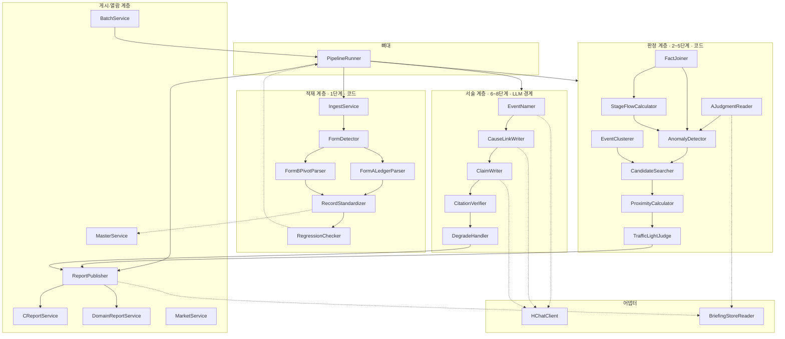
```mermaid
flowchart TB
  subgraph L0["뼈대"]
    PR["PipelineRunner"]
  end
  subgraph L1["적재 계층 · 1단계 · 코드"]
    IS["IngestService"] --> FD["FormDetector"]
    FD --> FA["FormALedgerParser"]
    FD --> FB["FormBPivotParser"]
    FA --> RS["RecordStandardizer"]
    FB --> RS
    RS --> RC["RegressionChecker"]
  end
  subgraph L2["판정 계층 · 2~5단계 · 코드"]
    AJ["AJudgmentReader"]
    EC["EventClusterer"]
    FJ["FactJoiner"]
    SF["StageFlowCalculator"]
    AD["AnomalyDetector"]
    CS["CandidateSearcher"]
    PC["ProximityCalculator"]
    TL["TrafficLightJudge"]
    AJ --> AD
    FJ --> SF
    FJ --> AD
    SF --> AD
    AD --> CS
    EC --> CS
    CS --> PC
    PC --> TL
  end
  subgraph L3["서술 계층 · 6~8단계 · LLM 경계"]
    EN["EventNamer"]
    CL["CauseLinkWriter"]
    CW["ClaimWriter"]
    CV["CitationVerifier"]
    DH["DegradeHandler"]
    EN --> CL --> CW --> CV
    CV --> DH
  end
  subgraph L4["게시·열람 계층"]
    RP["ReportPublisher"]
    CR["CReportService"]
    DR["DomainReportService"]
    MS["MarketService"]
    BS["BatchService"]
    MM["MasterService"]
  end
  subgraph L5["어댑터"]
    HC["HChatClient"]
    BR["BriefingStoreReader"]
  end
  PR --> IS
  PR --> L2
  PR --> L3
  PR --> RP
  RC -.-> PR
  TL --> RP
  DH --> RP
  EN -.-> HC
  CL -.-> HC
  CW -.-> HC
  AJ -.-> BR
  RP -.-> BR
  RP --> CR
  RP --> DR
  BS --> PR
  RS -.-> MM
```

읽는 법. 실선은 부르는 방향이고 점선은 바깥으로 나가는 호출이거나 상태 전달이다. TL에서 RP로 가는 선이 L3를 거치지 않는다. 이것이 4.7절 경계의 그림이다. 서술 계층 전체를 지워도 신호등과 후보 순서는 게시기까지 도달한다.

L5로 나가는 선의 출발지가 규칙이다. 판정 계층에서 바깥으로 나가는 선은 AJ에서 BR로 가는 것 하나이고, 게시 계층에서 나가는 선은 RP에서 BR로 가는 것 하나다. 둘 다 사내 DB 읽기다([[TBL-INFRA-002#C5]]). H-chat으로 나가는 선은 전부 L3에서만 출발한다([[TBL-INFRA-002#C2]] [[TBL-INFRA-002#C4]]).

호출 방향은 `router → service → crud` 한 방향이다. 라우터가 있는 도메인은 `ingest` `intel` `batch` `master` 넷이고, 라우터는 서비스만 부르며 crud를 건너뛰지 않는다. `analysis`는 라우터 없이 `batch/service.py`와 스케줄러가 [[#PipelineRunner]]를 부른다. 의존은 위에서 아래로만 흐른다. L2는 L3를 import 하지 않고, L1은 L2를 import 하지 않는다. 화살표가 거꾸로 가는 것이 셋 있는데 전부 호출이 아니라 상태 전달이다. RC에서 PR로 가는 것은 회귀 급변이 자동 실행을 막는 신호이고, BS에서 PR로 가는 것은 사람이 누른 재실행이며, RP에서 CR·DR로 가는 것은 게시된 것만 읽힌다는 뜻이다.

## 4. 설계 클래스

| 계층 | 클래스 | 한 줄 | 배치 단계 | 실행 주체 |
|:--|:--|:--|:--|:--|
| 뼈대 | [[#PipelineRunner]] | 여덟 단계를 순서대로 돌린다 | 1~8 | 코드 |
| 적재 | [[#IngestService]] | 적재 진입점. 관리 API와 배치가 같이 부른다 | 1 | 코드 |
| 적재 | [[#FormDetector]] | 완성차 파일이 형태 A인지 B인지 가른다 | 1 | 코드 |
| 적재 | [[#FormALedgerParser]] | IF 원장을 읽는다 | 1 | 코드 |
| 적재 | [[#FormBPivotParser]] | 피벗 리포트의 병합 헤더를 펴고 총계 행을 분리한다 | 1 | 코드 |
| 적재 | [[#RecordStandardizer]] | 두 형태를 같은 긴 형태 행으로 만든다 | 1 | 코드 |
| 적재 | [[#RegressionChecker]] | 직전 적재와 견줘 급변을 잡는다 | 1 | 코드 |
| 판정 | [[#AJudgmentReader]] | A 판정과 기여를 읽어 복사한다 | 2 | 코드 |
| 판정 | [[#EventClusterer]] | 같은 일을 말하는 기사를 묶는다 | 3 | 코드 |
| 판정 | [[#FactJoiner]] | 국가와 기간으로 완성차 수치를 모은다 | 4 | 코드 |
| 판정 | [[#StageFlowCalculator]] | 판매 네 단계의 차이를 센다 | 4 | 코드 |
| 판정 | [[#AnomalyDetector]] | 변동을 확정한다 | 4 | 코드 |
| 판정 | [[#CandidateSearcher]] | 변동에 원인 후보를 붙인다 | 5 | 코드 |
| 판정 | [[#ProximityCalculator]] | 근접도 값 넷을 세고 순서를 매긴다 | 5 | 코드 |
| 판정 | [[#TrafficLightJudge]] | 신호등과 워치리스트 줄과 도메인 상태를 만든다 | 5 | 코드 |
| 서술 | [[#EventNamer]] | 사건에 이름을 붙인다 | 6 | LLM |
| 서술 | [[#CauseLinkWriter]] | 변동과 후보를 잇는 문단을 쓴다 | 7 | LLM |
| 서술 | [[#ClaimWriter]] | 리포트 문장을 쓴다 | 8 | LLM |
| 서술 | [[#CitationVerifier]] | 인용이 후보 밖으로 나갔는지 대조한다 | 7~8 | 코드 |
| 서술 | [[#DegradeHandler]] | 실패한 역할을 강등으로 기록한다 | 6~8 | 코드 |
| 게시·열람 | [[#ReportPublisher]] | 근거 번호를 매기고 C 리포트 한 본과 A 리포트 사본을 게시한다 | 8 | 코드 |
| 게시·열람 | [[#CReportService]] | C 리포트를 읽어 준다 | 없음 | 코드 |
| 게시·열람 | [[#DomainReportService]] | A 리포트 사본을 읽어 주고 PDF 지면으로 옮긴다 | 없음 | 코드 |
| 게시·열람 | [[#MarketService]] | 시장지표 시계열을 읽어 준다 | 없음 | 코드 |
| 게시·열람 | [[#BatchService]] | 배치를 보고 다시 돌리고 게시 전환한다 | 없음 | 코드 |
| 게시·열람 | [[#MasterService]] | 크로스워크와 미매핑을 다룬다 | 없음 | 코드 |
| 게시·열람 | [[#ExposureService]] | 열람 화면 넷의 서명 주소를 발급·회전하고 요청의 주소를 확인한다 | 없음 | 코드 |
| 어댑터 | [[#HChatClient]] | 사내 게이트웨이에 LLM을 부른다 | 6~8 | 코드 |
| 어댑터 | [[#BriefingStoreReader]] | 브리핑 갈래 저장소를 읽는다 | 2·8 | 코드 |

"실행 주체"가 LLM인 클래스 셋이 [[TBL-INFRA-002#C4]]가 말한 LLM 세 번이고 [[TBL-PRD-002#R20]]의 세 역할이다. [[#CitationVerifier]]와 [[#DegradeHandler]]는 서술 계층에 있지만 코드다. 모델이 쓴 것을 검사하고 실패를 기록하는 일이라 모델에 맡기면 검사가 되지 않는다.

개요 그림. 엔티티는 2장과 같은 속성으로 다시 그렸고, 어느 설계 클래스가 어느 엔티티를 만드는지를 화살표로 얹었다. 설계 클래스의 메서드는 아래 항목마다 따로 그린다.


```mermaid
classDiagram
  direction LR
  class DomainReport {
    +int id
    +str domain
    +str dashboard_id
    +date base_date
    +str snapshot_id
    +str data_form
    +int published_version
    +datetime published_at
    +str summary
    +str commentary
    +str fixed_text
    +json tracking_metrics
    +json breakdown
    +json missing_metrics
    +json evidence_list
    +int batch_run_id
  }
  class DomainJudgment {
    +int id
    +int domain_report_id
    +str domain
    +str axis_type
    +str country_or_plant
    +str metric
    +str period_type
    +date file_base_date
    +float current_value
    +float compare_value
    +str compare_basis
    +str detection_unit
    +bool is_anomaly
    +float change_rate
  }
  class Contribution {
    +int id
    +int domain_judgment_id
    +str dimension
    +str item_name
    +float contribution_value
    +float contribution_share
    +int rank
  }
  class CountryPeriodFact {
    +int id
    +str country_code
    +str period_type
    +date file_base_date
    +int ingest_file_id
    +float shipment
    +float actual_wholesale
    +float official_wholesale
    +float retail
    +float plan_value
    +str plan_source
    +float plan_alt_diff
    +float compare_value
    +str compare_basis
    +float inventory_entity
    +float inventory_dealer
    +float inventory_in_transit
    +float inventory_awaiting
    +str inventory_source
    +float cbu_share
    +int event_count
    +float max_impact
    +json market_asof
    +bool is_supplementary
    +json quality_flags
  }
  class SalesStageFlow {
    +int id
    +str country_code
    +str period_type
    +date file_base_date
    +int ingest_file_id
    +float shipment
    +float actual_wholesale
    +float official_wholesale
    +float retail
    +float entity_stage_gap
    +float entity_stage_gap_rate
    +float dealer_stage_gap
    +float dealer_stage_gap_rate
    +str wholesale_basis
    +str derivation
    +int setting_version
  }
  class ModelExposure {
    +int id
    +str model_code
    +str country_code
    +str exposure
    +str acquired_by
    +float derived_ratio
    +str derivation_note
    +str period_key
  }
  class Anomaly {
    +int id
    +str domain
    +str axis_type
    +str country_or_plant
    +str metric
    +str period_type
    +date file_base_date
    +str compare_period
    +float value
    +float compare_value
    +str compare_basis
    +float change_rate
    +str detection_unit
    +str source
    +json breakdown_summary
    +int setting_version
    +int batch_run_id
  }
  class ThresholdSetting {
    +int version
    +float change_threshold
    +float stay_threshold
    +int event_window_days
    +int candidate_limit
    +int min_article_count
    +int min_source_count
    +float cbu_share_threshold
    +str plan_source
    +str wholesale_basis
    +str detection_unit
    +float regression_tolerance
    +datetime applied_at
  }
  class Article {
    +int id
    +str source_id
    +str title
    +str summary
    +str source_name
    +datetime published_at
    +str time_precision
    +str url
    +str category
    +float impact
    +json country_tags
    +int ingest_file_id
    +int event_id
  }
  class Event {
    +int id
    +str title
    +str event_type
    +float max_impact
    +str country_or_strait
    +str category
    +date first_seen
    +date last_seen
    +int article_count
    +int source_count
    +str status
    +str named_by
  }
  class MarketPoint {
    +int id
    +str indicator_id
    +str name
    +date observed_on
    +float value
    +float change_rate
    +bool on_metric_bar
    +bool is_carried_over
    +int ingest_file_id
  }
  class OemSales {
    +int id
    +str country_code
    +str base_month
    +str maker
    +int units
    +date ingested_on
    +int ingest_file_id
  }
  class CauseCandidate {
    +int id
    +int anomaly_id
    +str candidate_type
    +str candidate_id
    +int day_diff
    +int article_count
    +int source_count
    +str country_match
    +int sort_order
    +bool is_truncated
  }
  class CauseLink {
    +int id
    +int anomaly_id
    +str paragraph
    +json cited_candidate_ids
    +bool verified
    +bool is_degraded
    +str llm_call_id
  }
  class WatchItem {
    +int id
    +int c_report_id
    +int anomaly_id
    +str country_code
    +str traffic_light
    +json light_basis
    +int sort_order
    +str change_badge
    +str exposure
    +str entity_tag
    +str top_candidate_id
    +int setting_version
  }
  class CReport {
    +int id
    +date base_date
    +int version
    +bool is_published
    +date data_latest_date
    +json source_latest_dates
    +json notices
    +bool is_degraded
    +json degraded_roles
    +str headline
    +json domain_status
    +json metric_bar
    +str candidate_sort_rule
    +int batch_run_id
  }
  class Claim {
    +int id
    +int c_report_id
    +str section
    +int seq
    +str body
    +json emphasis
    +json footnote_numbers
    +bool is_degraded
  }
  class Evidence {
    +int id
    +int c_report_id
    +int number
    +str kind
    +str source_id
    +json display_values
  }
  class AlertEvent {
    +int id
    +int c_report_id
    +str country_code
    +str change_type
    +str prev_light
    +str new_light
    +bool is_sent
  }
  class Country {
    +str country_code
    +str name_ko
    +str name_en
    +str dealer_prefix
    +str region
    +int crosswalk_version
  }
  class Strait {
    +str strait_code
    +str name
    +json keywords
    +json adjacent_country_codes
  }
  class GlovisEntity {
    +int id
    +str country_code
    +str entity_code
    +str entity_name
  }
  class IngestFile {
    +int id
    +str source_type
    +str data_form
    +str schema_version
    +date file_base_date
    +json period_types
    +json measure_types
    +int row_count
    +float null_rate
    +float match_rate
    +float duplicate_rate
    +bool is_abrupt
    +json abrupt_reasons
    +bool auto_run_blocked
    +int total_row_count
    +str total_rows_path
    +str original_path
    +int ingest_seq
    +datetime ingested_at
  }
  class BatchRun {
    +int id
    +date base_date
    +str trigger
    +str status
    +int failed_stage
    +json stage_results
    +int llm_call_count
    +int token_count
    +bool is_degraded
    +bool backfill_mode
    +int setting_version
    +str a_snapshot_id
  }
  DomainReport "1" --> "*" DomainJudgment
  DomainJudgment "1" --> "*" Contribution
  DomainJudgment "1" --> "0..1" Anomaly
  IngestFile "1" --> "*" CountryPeriodFact
  IngestFile "1" --> "*" SalesStageFlow
  IngestFile "1" --> "*" Article
  IngestFile "1" --> "*" MarketPoint
  IngestFile "1" --> "*" OemSales
  CountryPeriodFact "1" --> "0..1" SalesStageFlow
  CountryPeriodFact "1" --> "0..*" Anomaly
  SalesStageFlow "1" --> "0..*" Anomaly
  ModelExposure "1" --> "*" CountryPeriodFact
  Anomaly "1" --> "*" CauseCandidate
  Anomaly "1" --> "0..1" CauseLink
  Event "1" --> "*" Article
  CauseCandidate --> Event
  CauseCandidate --> MarketPoint
  CauseCandidate --> Anomaly
  Anomaly "1" --> "0..1" WatchItem
  CReport "1" --> "*" WatchItem
  CReport "1" --> "*" Claim
  CReport "1" --> "*" Evidence
  Claim "*" --> "*" Evidence
  CReport "1" --> "*" AlertEvent
  Country "1" --> "*" CountryPeriodFact
  Country "1" --> "*" SalesStageFlow
  Country "1" --> "*" OemSales
  Strait "1" --> "*" Country
  Country "1" --> "*" GlovisEntity
  BatchRun "1" --> "*" CReport
  BatchRun "1" --> "*" DomainReport
  ThresholdSetting "1" --> "*" Anomaly
  ThresholdSetting "1" --> "*" SalesStageFlow
  ThresholdSetting "1" --> "*" WatchItem
  BriefingStoreReader --> DomainReport : 읽어 온다
  AJudgmentReader --> DomainJudgment : 사본
  AJudgmentReader --> Contribution : 사본
  FactJoiner --> CountryPeriodFact : 만든다
  StageFlowCalculator --> SalesStageFlow : 만든다
  FactJoiner --> ModelExposure : 만든다
  AnomalyDetector --> Anomaly : 만든다
  RecordStandardizer --> Article : 만든다
  EventClusterer --> Event : 만든다
  RecordStandardizer --> MarketPoint : 만든다
  RecordStandardizer --> OemSales : 만든다
  CandidateSearcher --> CauseCandidate : 만든다
  CauseLinkWriter --> CauseLink : 만든다
  TrafficLightJudge --> WatchItem : 만든다
  ReportPublisher --> CReport : 만든다
  ClaimWriter --> Claim : 만든다
  ReportPublisher --> Evidence : 만든다
  ReportPublisher --> AlertEvent : 만든다
  MasterService --> Country : 만든다
  MasterService --> Strait : 만든다
  MasterService --> GlovisEntity : 만든다
  IngestService --> IngestFile : 만든다
  PipelineRunner --> BatchRun : 만든다
```

메서드 표의 "부르는 곳"은 엔드포인트면 [[TBL-API-002]]의 항목이고, 배치 단계면 그 단계를 도는 클래스의 메서드다. "던지는 에러"는 엔드포인트에 걸린 메서드면 [[TBL-API-002]] 2장의 problem type이고, 배치 안 메서드면 `stage-failed`(그 단계에서 멈춤) 또는 `없음`(강등 기록으로 대신함)이다.

### 4.1 뼈대

#### PipelineRunner 파이프라인 진행기

여덟 단계를 순서대로 돌리고, 어느 단계 실패에서 멈추고 어느 단계 실패를 넘길지 정한다.

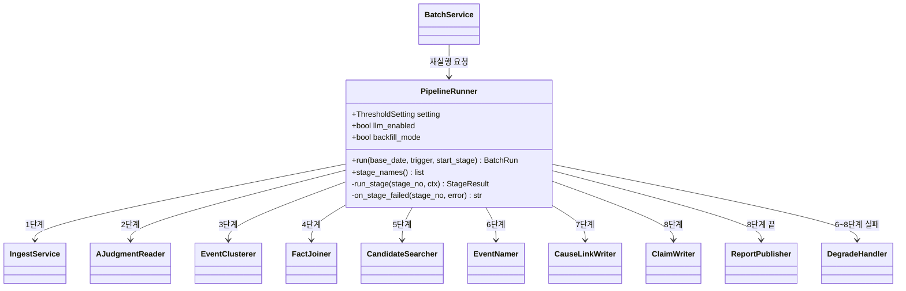
```mermaid
classDiagram
  class PipelineRunner {
    +ThresholdSetting setting
    +bool llm_enabled
    +bool backfill_mode
    +run(base_date, trigger, start_stage) BatchRun
    +stage_names() list
    -run_stage(stage_no, ctx) StageResult
    -on_stage_failed(stage_no, error) str
  }
  BatchService --> PipelineRunner : 재실행 요청
  PipelineRunner --> IngestService : 1단계
  PipelineRunner --> AJudgmentReader : 2단계
  PipelineRunner --> EventClusterer : 3단계
  PipelineRunner --> FactJoiner : 4단계
  PipelineRunner --> CandidateSearcher : 5단계
  PipelineRunner --> EventNamer : 6단계
  PipelineRunner --> CauseLinkWriter : 7단계
  PipelineRunner --> ClaimWriter : 8단계
  PipelineRunner --> ReportPublisher : 8단계 끝
  PipelineRunner --> DegradeHandler : 6~8단계 실패
```

| 메서드 | 부르는 곳 | 유스케이스 | 던지는 에러 |
|---|---|---|---|
| `run(base_date, trigger, start_stage) -> BatchRun` | 스케줄러 02:00, [[#BatchService]] `request_rerun` | [[TBL-UC-002#UC-S1]] [[TBL-UC-002#UC-A3]] | `batch-in-progress` `regression-blocked` `stage-failed` |
| `stage_names() -> list` | [[#BatchService]] `get_run`, [[TBL-API-002#GET/api/admin/batch/run/{batchRunId}]] | [[TBL-UC-002#UC-A3]] | 없음 |
| `run_stage(stage_no, ctx) -> StageResult` | `run` 안에서만 | [[TBL-UC-002#UC-S1]] | `stage-failed` |
| `on_stage_failed(stage_no, error) -> str` | `run_stage` 실패 시 | [[TBL-UC-002#UC-S1]] [[TBL-UC-002#UC-S11]] | 없음. `stop` 또는 `degrade`를 돌려준다 |

규칙. `setting`은 이 실행에 쓴 설정 한 벌이고 산출 행마다 그 버전이 찍힌다([[#ThresholdSetting]]). `llm_enabled`가 거짓이면 6~8단계를 건너뛴다. `backfill_mode`가 참이면 5단계까지만 채우고 게시하지 않는다([[TBL-API-002#POST/api/admin/batch/rerun]]). `run`은 [[#BatchRun]] 한 건을 만들고 끝까지 돌린다. `stage_names`는 여덟 이름을 확정 순서로 돌려주고 배치 이력 화면([[TBL-UI-002#UI-6]])과 배치 상세 응답과 재실행의 시작 단계가 같은 이름을 쓴다.

| 단계 | 이름 | 주체 | 클래스 | 실패하면 |
|--:|:--|:--|:--|:--|
| 1 | 적재 | 코드 | [[#IngestService]] | 멈춤 |
| 2 | A 판정 읽기 | 코드 | [[#AJudgmentReader]] | 보완 집계로 내려가고 계속 |
| 3 | 사건 묶음 | 코드 | [[#EventClusterer]] | 멈춤 |
| 4 | 결합 | 코드 | [[#FactJoiner]] [[#StageFlowCalculator]] [[#AnomalyDetector]] | 멈춤 |
| 5 | 원인 후보·근접도·신호등 | 코드 | [[#CandidateSearcher]] [[#ProximityCalculator]] [[#TrafficLightJudge]] | 멈춤 |
| 6 | 사건 명명 | LLM | [[#EventNamer]] | 강등하고 계속 |
| 7 | 연관 설명 | LLM + 코드 | [[#CauseLinkWriter]] [[#CitationVerifier]] | 강등하고 계속 |
| 8 | 서술·검증·게시 | LLM + 코드 | [[#ClaimWriter]] [[#CitationVerifier]] [[#ReportPublisher]] | 서술만 강등. 게시는 진행 |

이 표는 [[TBL-INFRA-002#C20]]과 [[TBL-PRD-002#R30]]과 [[TBL-UC-002#UC-S1]]의 확장을 그대로 옮긴 것이다. 1·3단계도 판정을 만드는 단계라 멈춤이다. 회귀 급변은 경로가 둘이다. 배치 안 1단계에서 급변이면 `stop`이고, 수동 적재에서 급변이면 적재는 끝나고 `auto_run_blocked`가 세워져 `run`이 `regression-blocked`로 시작을 거부한다([[TBL-UC-002#UC-S10]]). 계층 다섯 전부를 부르는 유일한 클래스이며 어느 계층도 이 클래스를 부르지 않는다. 예외는 [[#BatchService]]의 재실행 요청 하나다. `llm_enabled`를 속성으로 둔 것은 회귀 검사 때문이다. LLM을 끄고 같은 기준일을 돌려 신호등과 후보 순서가 정상 실행과 같은지 대조한다([[TBL-INFRA-002#C19]] [[TBL-PRD-002#N3]]).

### 4.2 적재 계층

배치 1단계와 관리 API의 수동 적재가 같은 코드를 부른다([[TBL-INFRA-002#C6]]). 같은 파일을 어느 경로로 넣어도 같은 표준 행이 나와야 하므로 모듈을 두 벌로 두지 않는다.

#### IngestService 적재 진입점

파일 한 건을 받아 형태를 판별하고, 미리보기를 보여 주고, 확정되면 표준 테이블에 넣는다.

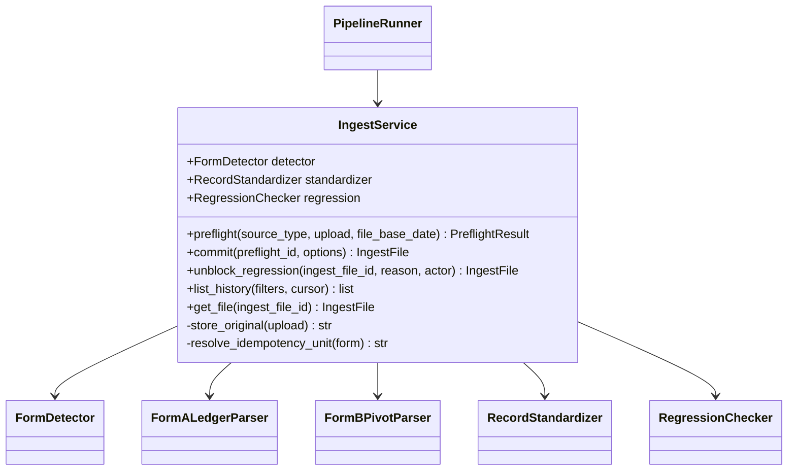
```mermaid
classDiagram
  class IngestService {
    +FormDetector detector
    +RecordStandardizer standardizer
    +RegressionChecker regression
    +preflight(source_type, upload, file_base_date) PreflightResult
    +commit(preflight_id, options) IngestFile
    +unblock_regression(ingest_file_id, reason, actor) IngestFile
    +list_history(filters, cursor) list
    +get_file(ingest_file_id) IngestFile
    -store_original(upload) str
    -resolve_idempotency_unit(form) str
  }
  PipelineRunner --> IngestService
  IngestService --> FormDetector
  IngestService --> FormALedgerParser
  IngestService --> FormBPivotParser
  IngestService --> RecordStandardizer
  IngestService --> RegressionChecker
```

| 메서드 | 부르는 곳 | 유스케이스 | 던지는 에러 |
|---|---|---|---|
| `preflight(source_type, upload, file_base_date) -> PreflightResult` | [[TBL-API-002#POST/api/admin/ingest/preflight]] | [[TBL-UC-002#UC-A1]] 2~5 | `form-undetected` `validation-failed` `file-too-large` |
| `commit(preflight_id, options) -> IngestFile` | [[TBL-API-002#POST/api/admin/ingest/commit]], [[#PipelineRunner]] 1단계 | [[TBL-UC-002#UC-A1]] 6~7, [[TBL-UC-002#UC-S1]] 1 | `preflight-expired` `overwrite-not-confirmed` `stage-failed`(배치 경로) |
| `unblock_regression(ingest_file_id, reason, actor) -> IngestFile` | [[TBL-API-002#POST/api/admin/ingest/unblock/{ingestFileId}]] | [[TBL-UC-002#UC-S10]] 4a | `not-found` `validation-failed`(사유 없음) |
| `list_history(filters, cursor) -> list` | [[TBL-API-002#GET/api/admin/ingest/history]] | [[TBL-UC-002#UC-A1]] | 없음 |
| `get_file(ingest_file_id) -> IngestFile` | [[TBL-API-002#GET/api/admin/ingest/file/{ingestFileId}]] | [[TBL-UC-002#UC-A1]] | `not-found` |
| `store_original(upload) -> str` | `preflight` 안에서만 | [[TBL-UC-002#UC-A1]] 2 | 없음 |
| `resolve_idempotency_unit(form) -> str` | `commit` 안에서만 | [[TBL-UC-002#UC-A1]] 6 | 없음 |

규칙. [[#IngestFile]] 한 행을 만드는 유일한 클래스다. `preflight`는 원본을 먼저 보존하고 형태를 판별해 미리보기를 돌려주며 표준 테이블에 넣지 않는다. `store_original`은 판별 성공 여부와 무관하게 먼저 돈다([[TBL-PRD-002#N7]]). `commit`은 표준화·미매핑 수집·회귀 검사를 한 번에 돌린다. `resolve_idempotency_unit`은 형태 A면 기준일자, 형태 B면 파일 기준일을 돌려준다([[TBL-PRD-002#R3]]). 미리보기와 결과 수치는 적재 화면([[TBL-UI-002#UI-5]])이 그대로 적는다. 사전 검증과 확정을 두 호출로 나눈 이유는 덮어쓰기 때문이다. 형태 B는 파일 기준일 단위로 통째 덮어쓰므로 사람이 무엇이 지워지는지 보고 나서 눌러야 한다([[TBL-UC-002#UC-A1]] 6). 회귀 급변일 때 수동 경로는 적재를 완료하고 배치 자동 실행만 막는다. 적재까지 막으면 원본이 표준 테이블에 영영 못 들어가고, 급변이 실제로 정상인 경우가 있어서다. 계획이 두 종류이거나 도매가 두 기준이면 둘 다 들어왔다는 사실만 미리보기에 적고 정본은 고르지 않는다([[TBL-INFRA-002#C18]]).

#### FormDetector 형태 판별기

완성차 파일이 형태 A인지 형태 B인지 가른다. 어느 쪽도 아니면 막는다.

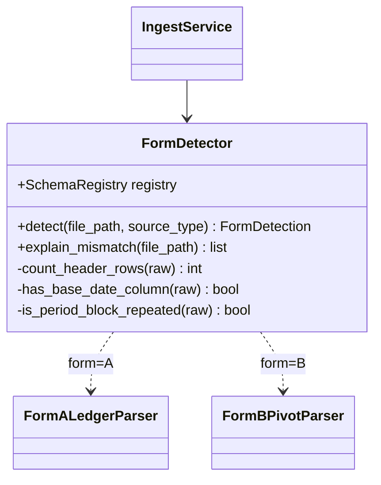
```mermaid
classDiagram
  class FormDetector {
    +SchemaRegistry registry
    +detect(file_path, source_type) FormDetection
    +explain_mismatch(file_path) list
    -count_header_rows(raw) int
    -has_base_date_column(raw) bool
    -is_period_block_repeated(raw) bool
  }
  IngestService --> FormDetector
  FormDetector ..> FormALedgerParser : form=A
  FormDetector ..> FormBPivotParser : form=B
```

| 메서드 | 부르는 곳 | 유스케이스 | 던지는 에러 |
|---|---|---|---|
| `detect(file_path, source_type) -> FormDetection` | [[#IngestService]] `preflight` | [[TBL-UC-002#UC-A1]] 2 | 없음. `form`이 unknown이면 호출자가 `form-undetected`를 낸다 |
| `explain_mismatch(file_path) -> list` | [[#IngestService]] `preflight`(unknown일 때) | [[TBL-UC-002#UC-A1]] 2a | 없음 |
| `count_header_rows(raw) -> int` | `detect` 안에서만 | [[TBL-UC-002#UC-A1]] 2 | 없음 |
| `has_base_date_column(raw) -> bool` | `detect` 안에서만 | [[TBL-UC-002#UC-A1]] 2 | 없음 |
| `is_period_block_repeated(raw) -> bool` | `detect` 안에서만 | [[TBL-UC-002#UC-A1]] 2 | 없음 |

규칙. `registry`는 등록된 스키마 버전 목록이다. 뉴스 가공본과 원본처럼 같은 소스에 컬럼 구성이 둘인 경우도 여기서 가른다. `detect`의 결과 형태는 [[TBL-API-002]] 4.11절이다. 판별 기준을 둘로 좁힌 것은 실측 때문이다. 형태 A는 첫 행이 바로 헤더이고 행마다 기준일자가 있다. 형태 B는 병합 헤더가 2~3줄이고 행에 날짜 컬럼이 없다([[TBL-RFQ-002]] 4.2절). 셋째 형태를 받는 것은 개발 작업이고 자동 추론하지 않는다([[TBL-INFRA-002#C6]]).

#### FormALedgerParser 형태 A 파서

IF 원장을 읽는다. 생산 16열, 판매·재고 22열이고 행마다 기준일자가 있다. 둘째 줄은 영문 코드 행이라 세어 두고 뺀다.

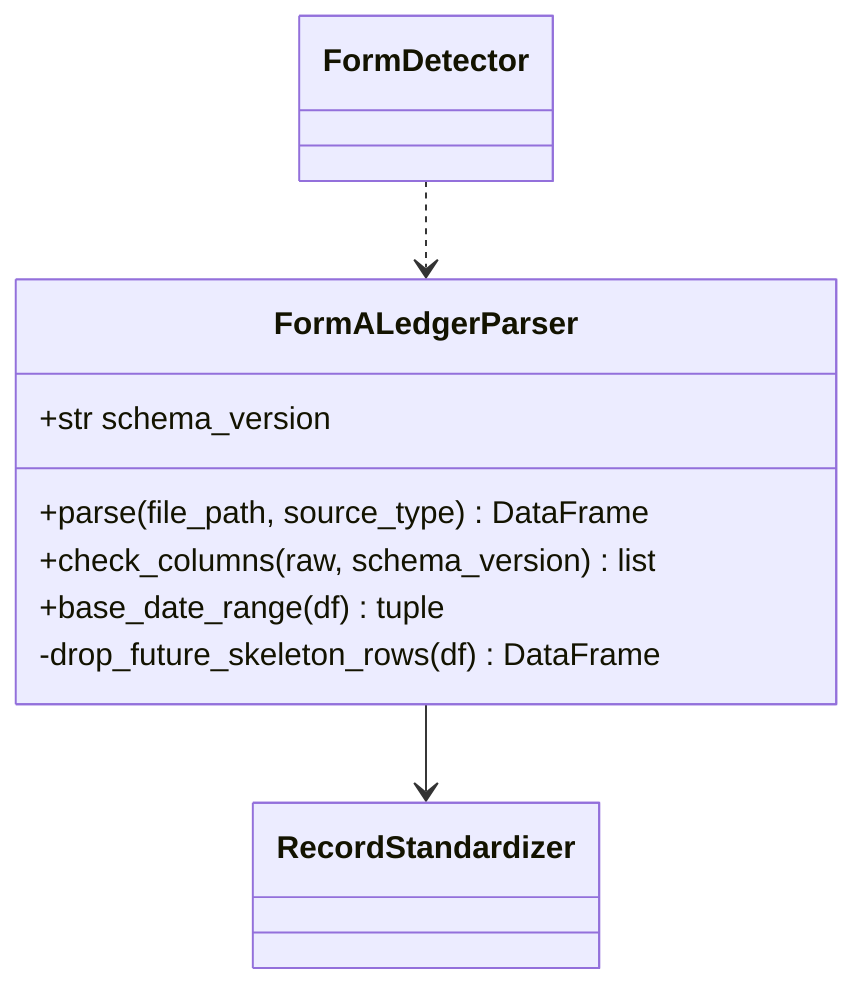
```mermaid
classDiagram
  class FormALedgerParser {
    +str schema_version
    +parse(file_path, source_type) DataFrame
    +check_columns(raw, schema_version) list
    +base_date_range(df) tuple
    -drop_future_skeleton_rows(df) DataFrame
  }
  FormDetector ..> FormALedgerParser
  FormALedgerParser --> RecordStandardizer
```

| 메서드 | 부르는 곳 | 유스케이스 | 던지는 에러 |
|---|---|---|---|
| `parse(file_path, source_type) -> DataFrame` | [[#IngestService]] `preflight` `commit` | [[TBL-UC-002#UC-A1]] 3 | `validation-failed`(컬럼 어긋남) |
| `check_columns(raw, schema_version) -> list` | `parse` 앞에서 [[#IngestService]] | [[TBL-UC-002#UC-A1]] 3 | 없음 |
| `base_date_range(df) -> tuple` | [[#IngestService]] `preflight` | [[TBL-UC-002#UC-A1]] 6 | 없음 |
| `drop_future_skeleton_rows(df) -> DataFrame` | `parse` 안에서만 | [[TBL-UC-002#UC-A1]] 3 | 없음 |

규칙. 형태 A는 행마다 날짜가 있어 표준화가 단순하다. 기간 구분이 `day`로 고정되고 파일 기준일이 그 행의 기준일자와 같아진다([[TBL-INFRA-002#C15]]). 이 클래스는 아직 실물을 본 적이 없다. 자사가 집계한 인입 샘플은 전부 형태 B였고, 형태 A는 IF 레이아웃 정의만 있다([[TBL-RFQ-002]] 4.2절). 컬럼 대조를 파서 안에 둔 것은 실물이 들어오는 순간 어긋남이 어디인지 바로 보이게 하기 위해서다.

#### FormBPivotParser 형태 B 파서

피벗 리포트의 병합 헤더를 펴서 한 행을 지표 종류 수만큼의 행으로 늘리고, 총계 행을 상세 행과 분리한다.

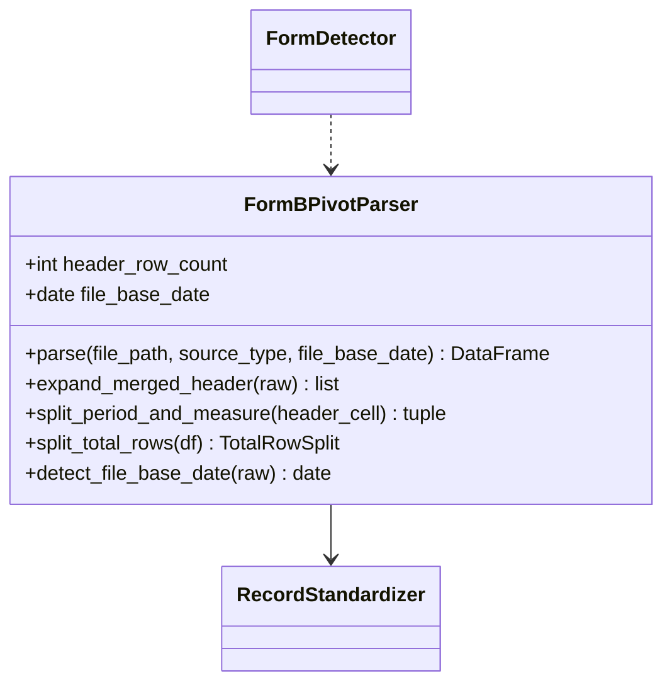
```mermaid
classDiagram
  class FormBPivotParser {
    +int header_row_count
    +date file_base_date
    +parse(file_path, source_type, file_base_date) DataFrame
    +expand_merged_header(raw) list
    +split_period_and_measure(header_cell) tuple
    +split_total_rows(df) TotalRowSplit
    +detect_file_base_date(raw) date
  }
  FormDetector ..> FormBPivotParser
  FormBPivotParser --> RecordStandardizer
```

| 메서드 | 부르는 곳 | 유스케이스 | 던지는 에러 |
|---|---|---|---|
| `parse(file_path, source_type, file_base_date) -> DataFrame` | [[#IngestService]] `preflight` `commit` | [[TBL-UC-002#UC-A1]] 4 | `validation-failed`(파일 기준일 없음) |
| `expand_merged_header(raw) -> list` | `parse` 안에서, 미리보기 응답 | [[TBL-UC-002#UC-A1]] 4 | 없음 |
| `split_period_and_measure(header_cell) -> tuple` | `expand_merged_header` 안에서만 | [[TBL-UC-002#UC-A1]] 4 | 없음 |
| `split_total_rows(df) -> TotalRowSplit` | `parse` 안에서, 미리보기 응답 | [[TBL-UC-002#UC-A1]] 4·4a | 없음 |
| `detect_file_base_date(raw) -> date` | [[#IngestService]] `preflight` | [[TBL-UC-002#UC-A1]] 4 | 없음. 못 찾으면 `None` |

규칙. `header_row_count`는 2 또는 3이다. `file_base_date`는 파일이 담은 기준일이며 파일에서 못 읽으면 관리자가 넣는다([[TBL-API-002#POST/api/admin/ingest/preflight]]). 기간 구분은 일·월·누계·년 넷이고 지표 종류는 아홉이다(운영계획·사업계획·실적·진도율·전년대비, 선적·실 도매·도매(공식)·소매). `split_total_rows`는 상세 행, 총계 행, 총계 행 수, 상세 행 합과 총계 행의 차이를 함께 돌려준다. 총계 행은 버리지 않고 따로 보관하되 상세 행과 더하지 않는다. 판매 샘플에서 상세 행 합 선적 679,551인데 총계 행은 1,710,715으로 약 2.5배이고, 생산 진도율은 총계 행에만 값이 있고 상세 행은 전부 0이었다([[TBL-RFQ-002]] 4.2절, [[TBL-PRD-002#N8]]). 차이는 미리보기에 경고로 나가고 적재는 진행한다([[TBL-UC-002#UC-A1]] 4a). 이 클래스가 적재 계층에서 가장 위험하다. 병합 헤더를 잘못 펴면 값이 엉뚱한 기간과 지표 종류에 붙는데 그 결과가 숫자로는 멀쩡해 보인다. 그래서 펼친 결과의 기간 구분 목록과 지표 종류 목록을 미리보기로 돌려주고 직전 적재와 대조한다([[TBL-INFRA-002#C6]]).

#### RecordStandardizer 표준화기

형태 A와 형태 B의 행을 같은 긴 형태 한 테이블로 만든다.

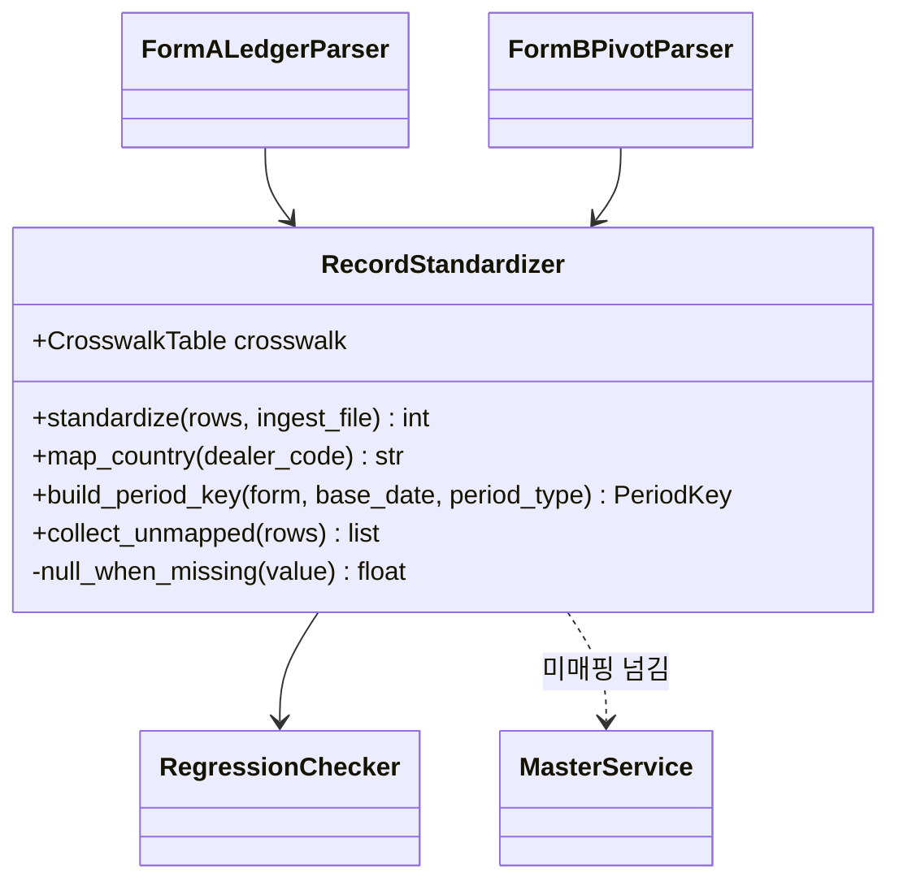
```mermaid
classDiagram
  class RecordStandardizer {
    +CrosswalkTable crosswalk
    +standardize(rows, ingest_file) int
    +map_country(dealer_code) str
    +build_period_key(form, base_date, period_type) PeriodKey
    +collect_unmapped(rows) list
    -null_when_missing(value) float
  }
  FormALedgerParser --> RecordStandardizer
  FormBPivotParser --> RecordStandardizer
  RecordStandardizer --> RegressionChecker
  RecordStandardizer ..> MasterService : 미매핑 넘김
```

| 메서드 | 부르는 곳 | 유스케이스 | 던지는 에러 |
|---|---|---|---|
| `standardize(rows, ingest_file) -> int` | [[#IngestService]] `commit` | [[TBL-UC-002#UC-A1]] 7 | `stage-failed`(배치 경로) |
| `map_country(dealer_code) -> str` | `standardize` 안에서 | [[TBL-UC-002#UC-A1]] 7 | 없음. 못 찾으면 미매핑 |
| `build_period_key(form, base_date, period_type) -> PeriodKey` | `standardize` 안에서 | [[TBL-UC-002#UC-S4]] 1 | 없음 |
| `collect_unmapped(rows) -> list` | `standardize` 안에서, [[#MasterService]]가 읽음 | [[TBL-UC-002#UC-A2]] 1 | 없음 |
| `null_when_missing(value) -> float` | `standardize` 안에서만 | [[TBL-UC-002#UC-A1]] 7 | 없음 |

규칙. `crosswalk`는 국가·차종·법인 매핑 이관본이다. `map_country`는 대리점 코드 앞 세 자리로 국가를 찾는다([[TBL-PRD-002#R4]]). `build_period_key`는 시간 두 칸을 만든다. 형태 A면 `periodType=day`이고 `fileBaseDate`가 행의 기준일자, 형태 B면 헤더에서 온 기간 구분과 파일 기준일이다([[TBL-API-002]] 1.4절, [[TBL-PRD-002#R12]]). `null_when_missing`은 `-` 같은 결측 표기를 `NULL`로 바꾼다. 0으로 바꾸지 않는다. 계획이 없는 것과 계획이 0인 것은 다르고, 0으로 채우면 달성률이 무한대가 되거나 0%로 찍힌다. 파서 둘의 출력을 받아 [[#CountryPeriodFact]]와 [[#SalesStageFlow]]의 원재료가 되는 표준 행과 [[#Article]] [[#MarketPoint]] [[#OemSales]]를 만든다. 생산 행의 국가 컬럼은 비운다. 목적지 국가가 데이터에 없으므로 유추하지 않는다([[TBL-INFRA-002#C16]]). 국가가 `NULL`인 행은 국가 축 처리에서 자동으로 빠지고, 이것이 생산이 워치리스트에 오르지 못하는 실제 이유가 된다.

#### RegressionChecker 회귀 검사기

이번 적재를 직전 적재와 견줘 급변인지 판정한다.

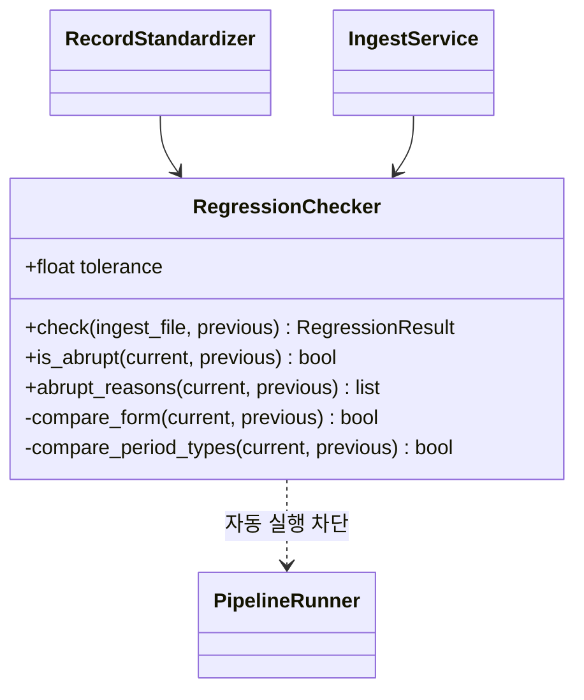
```mermaid
classDiagram
  class RegressionChecker {
    +float tolerance
    +check(ingest_file, previous) RegressionResult
    +is_abrupt(current, previous) bool
    +abrupt_reasons(current, previous) list
    -compare_form(current, previous) bool
    -compare_period_types(current, previous) bool
  }
  RecordStandardizer --> RegressionChecker
  IngestService --> RegressionChecker
  RegressionChecker ..> PipelineRunner : 자동 실행 차단
```

| 메서드 | 부르는 곳 | 유스케이스 | 던지는 에러 |
|---|---|---|---|
| `check(ingest_file, previous) -> RegressionResult` | [[#IngestService]] `commit` | [[TBL-UC-002#UC-S10]] 1~4 | 없음. 결과가 [[#IngestFile]]에 남는다 |
| `is_abrupt(current, previous) -> bool` | `check` 안에서 | [[TBL-UC-002#UC-S10]] 2~3 | 없음 |
| `abrupt_reasons(current, previous) -> list` | `check` 안에서, 차단 해제 화면 | [[TBL-UC-002#UC-S10]] 4 | 없음 |
| `compare_form(current, previous) -> bool` | `is_abrupt` 안에서만 | [[TBL-UC-002#UC-S10]] 3 | 없음 |
| `compare_period_types(current, previous) -> bool` | `is_abrupt` 안에서만 | [[TBL-UC-002#UC-S10]] 3 | 없음 |

규칙. `tolerance`는 허용 폭이며 [[#ThresholdSetting]]의 `regression_tolerance`다. `check`는 행수·결측률·매칭률·중복률을 직전과 견준다. 직전 이력이 없으면 수치만 기록하고 급변 판정은 하지 않는다([[TBL-UC-002#UC-S10]] 2a). 형태가 달라진 것 자체를 급변으로 본다([[TBL-INFRA-002#C6]]). 수치가 멀쩡해도 형태가 바뀌면 시간 축이 바뀌기 때문이다. 샘플에서 실데이터로 넘어가는 시점이 가장 위험한 자리다([[TBL-INFRA-002#C14]]). 급변의 처리는 경로가 정한다. 수동 적재면 [[#IngestFile]]의 `auto_run_blocked`를 세우고, 배치 안이면 [[#PipelineRunner]]가 1단계에서 멈춘다([[TBL-PRD-002#R30]]).

### 4.3 판정 계층

배치 2~5단계다. 이 계층의 어느 클래스도 [[#HChatClient]]를 import 하지 않는다. 5단계가 끝나면 화면에 나갈 판정이 전부 확정된다([[TBL-INFRA-002#C19]]). 변동별 신호등과 워치리스트뿐 아니라 도메인 상태 3카드의 신호등도 여기 포함된다([[#TrafficLightJudge]]).

#### AJudgmentReader A 판정 읽기

브리핑 갈래 저장소에서 A 판정과 내부 분해를 읽어 복사한다. 쓰지 않는다.

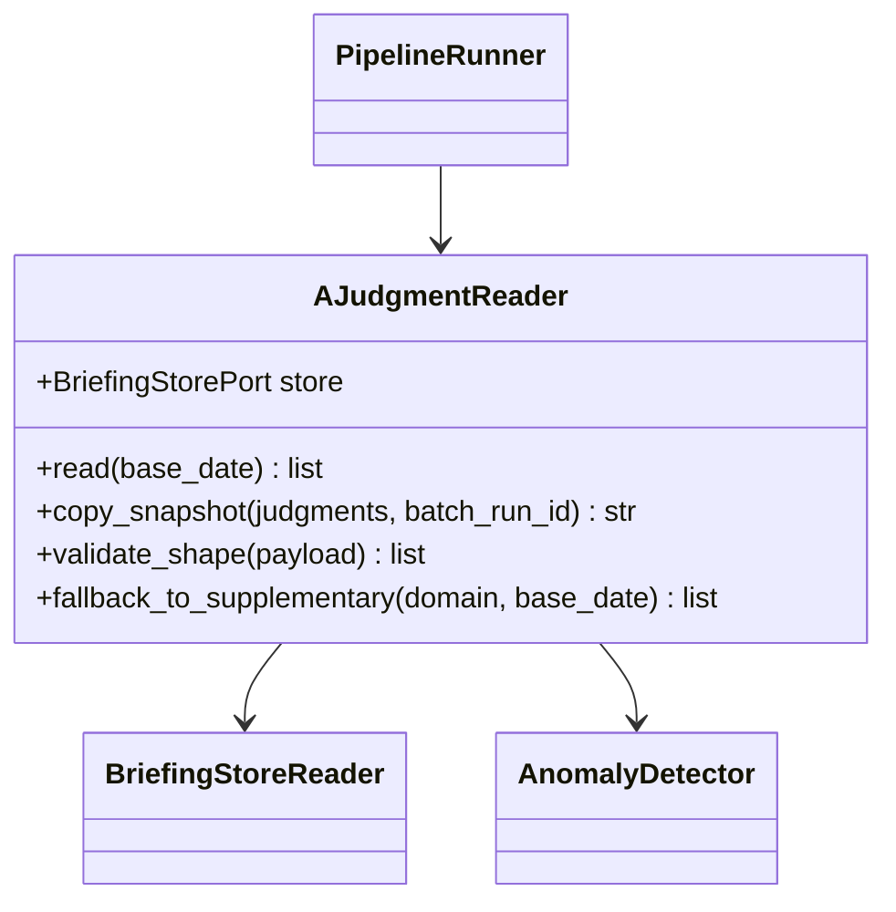
```mermaid
classDiagram
  class AJudgmentReader {
    +BriefingStorePort store
    +read(base_date) list
    +copy_snapshot(judgments, batch_run_id) str
    +validate_shape(payload) list
    +fallback_to_supplementary(domain, base_date) list
  }
  PipelineRunner --> AJudgmentReader
  AJudgmentReader --> BriefingStoreReader
  AJudgmentReader --> AnomalyDetector
```

| 메서드 | 부르는 곳 | 유스케이스 | 던지는 에러 |
|---|---|---|---|
| `read(base_date) -> list` | [[#PipelineRunner]] 2단계 | [[TBL-UC-002#UC-S2]] 1~4 | 없음. 실패하면 `fallback_to_supplementary`로 내려간다 |
| `copy_snapshot(judgments, batch_run_id) -> str` | `read` 뒤 [[#PipelineRunner]] | [[TBL-UC-002#UC-S2]] 6 | `stage-failed`(사본 저장 실패) |
| `validate_shape(payload) -> list` | `read` 안에서 | [[TBL-UC-002#UC-S2]] 2 | 없음 |
| `fallback_to_supplementary(domain, base_date) -> list` | `read` 실패 시, 도메인별 | [[TBL-UC-002#UC-S2]] 1a·2a·5 | 없음 |

규칙. `store`는 읽기 전용 포트다([[TBL-INFRA-002#C5]]). `read`는 도메인·국가·기간 키로 [[#DomainJudgment]]와 [[#Contribution]]을 읽고 A 리포트가 쓴 문장은 읽지 않는다. `copy_snapshot`은 읽은 것을 그대로 복사하고 스냅샷 식별자를 [[#BatchRun]]의 `a_snapshot_id`에 남긴다. 값을 다시 계산하지 않는다. C의 수치가 대시보드와 어긋나면 현업이 둘 다 믿지 않게 된다([[TBL-PRD-002#R2]]). 스냅샷을 복사해 두는 것은 재현 때문이다([[TBL-INFRA-002#C11]] [[TBL-PRD-002#N3]]). 읽기 실패가 배치를 멈추지 않는 유일한 코드 단계다. 보완 집계로 내려가고 리포트 `notices`에 판정 미수신을 적는다([[TBL-API-002#GET/api/intel/creport/latest]]). A1은 목적지 국가가 없어 보완으로도 국가 축을 만들 수 없으므로 공장 단위로 남는다([[TBL-UC-002#UC-S2]] 5a).

#### EventClusterer 사건 묶음기

같은 일을 말하는 기사를 묶고 기사 수와 출처 수를 센다. 코드만 쓴다.

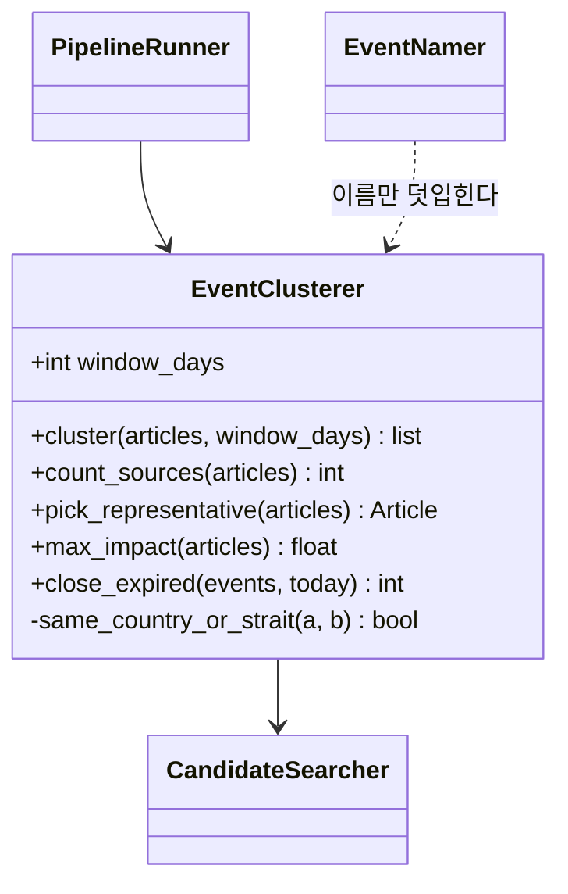
```mermaid
classDiagram
  class EventClusterer {
    +int window_days
    +cluster(articles, window_days) list
    +count_sources(articles) int
    +pick_representative(articles) Article
    +max_impact(articles) float
    +close_expired(events, today) int
    -same_country_or_strait(a, b) bool
  }
  PipelineRunner --> EventClusterer
  EventClusterer --> CandidateSearcher
  EventNamer ..> EventClusterer : 이름만 덧입힌다
```

| 메서드 | 부르는 곳 | 유스케이스 | 던지는 에러 |
|---|---|---|---|
| `cluster(articles, window_days) -> list` | [[#PipelineRunner]] 3단계 | [[TBL-UC-002#UC-S3]] 1~3 | `stage-failed` |
| `count_sources(articles) -> int` | `cluster` 안에서 | [[TBL-UC-002#UC-S3]] 3 | 없음 |
| `pick_representative(articles) -> Article` | `cluster` 안에서, [[#EventNamer]] 강등 시 | [[TBL-UC-002#UC-S3]] 3, [[TBL-UC-002#UC-S11]] 1 | 없음 |
| `max_impact(articles) -> float` | `cluster` 안에서 | [[TBL-UC-002#UC-S3]] 3 | 없음 |
| `close_expired(events, today) -> int` | [[#PipelineRunner]] 3단계 끝 | [[TBL-UC-002#UC-S3]] 4·2a | 없음 |
| `same_country_or_strait(a, b) -> bool` | `cluster` 안에서만 | [[TBL-UC-002#UC-S3]] 1 | 없음 |

규칙. `window_days`는 [[#ThresholdSetting]]의 `event_window_days`다. `cluster`는 [[#Event]] 목록을 만들고 [[#Article]]의 `event_id`를 채운다. `count_sources`는 서로 다른 매체 이름의 개수를 센다. `max_impact`는 기사에 붙어 온 영향도의 최대값을 돌려주며 새로 매기지 않는다([[TBL-PRD-002#R6]]). 국가 태그가 없는 기사는 국가 없음 묶음에 두고 후보 검색 대상에서 뺀다. 이 클래스는 판정 계층에 있다. 묶음은 규칙이고 이름만 LLM이다. 기사 수와 출처 수가 신호등 규칙의 입력이라 이 클래스가 죽으면 신호등도 죽는다. 그래서 6~8단계와 달리 실패 시 강등이 아니라 멈춤이다.

#### FactJoiner 결합기

완성차 표준 행을 국가와 기간으로 모아 결합 테이블을 만든다.

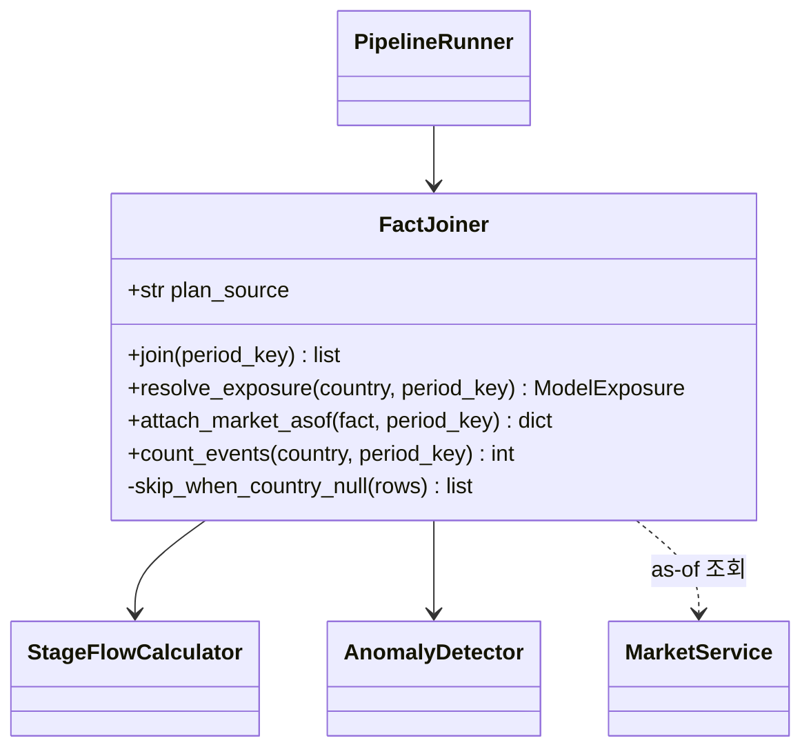
```mermaid
classDiagram
  class FactJoiner {
    +str plan_source
    +join(period_key) list
    +resolve_exposure(country, period_key) ModelExposure
    +attach_market_asof(fact, period_key) dict
    +count_events(country, period_key) int
    -skip_when_country_null(rows) list
  }
  PipelineRunner --> FactJoiner
  FactJoiner --> StageFlowCalculator
  FactJoiner --> AnomalyDetector
  FactJoiner ..> MarketService : as-of 조회
```

| 메서드 | 부르는 곳 | 유스케이스 | 던지는 에러 |
|---|---|---|---|
| `join(period_key) -> list` | [[#PipelineRunner]] 4단계 | [[TBL-UC-002#UC-S4]] 1·3·5a | `stage-failed` |
| `resolve_exposure(country, period_key) -> ModelExposure` | `join` 안에서 | [[TBL-UC-002#UC-S4]] 1, [[TBL-UC-002#UC-S5]] 7a | 없음. 실패면 `unknown` |
| `attach_market_asof(fact, period_key) -> dict` | `join` 안에서 | [[TBL-UC-002#UC-S4]] 4·4a | 없음 |
| `count_events(country, period_key) -> int` | `join` 안에서 | [[TBL-UC-002#UC-S4]] 1 | 없음 |
| `skip_when_country_null(rows) -> list` | `join` 안에서만 | [[TBL-UC-002#UC-S4]] 1 | 없음 |

규칙. `plan_source`는 계획 정본이며 [[#ThresholdSetting]]에서 오고 기본값이 사업계획이다([[TBL-INFRA-002#C18]]). `join`은 [[#CountryPeriodFact]] 행을 만든다. 비교 값과 비교 방식을 고르는 주체가 이 메서드다. 계획이 있으면 계획 대비, 없으면 전년 동월, 그다음 전월 순으로 골라 `compare_value`와 `compare_basis`에 굳힌다([[TBL-UC-002#UC-S4]] 3). [[#AnomalyDetector]]는 그 칸을 읽기만 한다. 쓰지 않은 계획과의 차이를 `plan_alt_diff`에 남긴다. 생산 누적에서 운영계획 1,754,150과 사업계획 2,020,531의 차이가 266,381이라 정본을 바꾸면 달성률이 99.2%에서 86.1%로 통째로 달라지기 때문이다([[TBL-RFQ-002]] 4.2절). 총계 행은 집계에 넣지 않는다. 생산 수치를 이 결합에 넣지 않는다. 국가 축이 없어 모을 수 없기 때문이다([[TBL-INFRA-002#C16]]). `resolve_exposure`는 형태 B면 판매 파일의 완성차·반조립 컬럼을 읽고 형태 A면 생산 모델코드로 유도하며 어느 경로인지를 [[#ModelExposure]]의 `acquired_by`에 남긴다([[TBL-PRD-002#R15]]). `attach_market_asof`는 그 기간의 마지막 날 기준 시장지표 값을 붙이고 이월이어도 값을 비우지 않는다([[TBL-PRD-002#R27]]).

#### StageFlowCalculator 단계별 흐름 계산기

판매 네 계열의 값과 단계 사이의 차이를 센다. 재고 원천이 없는 동안 재고 신호가 나오는 자리다.

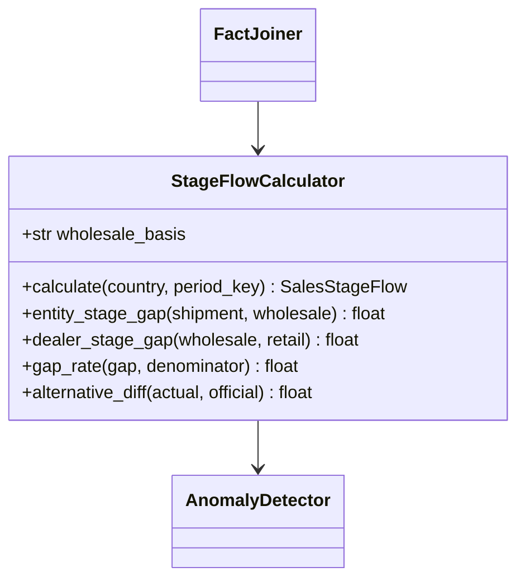
```mermaid
classDiagram
  class StageFlowCalculator {
    +str wholesale_basis
    +calculate(country, period_key) SalesStageFlow
    +entity_stage_gap(shipment, wholesale) float
    +dealer_stage_gap(wholesale, retail) float
    +gap_rate(gap, denominator) float
    +alternative_diff(actual, official) float
  }
  FactJoiner --> StageFlowCalculator
  StageFlowCalculator --> AnomalyDetector
```

| 메서드 | 부르는 곳 | 유스케이스 | 던지는 에러 |
|---|---|---|---|
| `calculate(country, period_key) -> SalesStageFlow` | [[#PipelineRunner]] 4단계, [[#FactJoiner]] 뒤 | [[TBL-UC-002#UC-S4]] 2 | `stage-failed` |
| `entity_stage_gap(shipment, wholesale) -> float` | `calculate` 안에서 | [[TBL-UC-002#UC-S4]] 2 | 없음 |
| `dealer_stage_gap(wholesale, retail) -> float` | `calculate` 안에서 | [[TBL-UC-002#UC-S4]] 2 | 없음 |
| `gap_rate(gap, denominator) -> float` | `calculate` 안에서 | [[TBL-UC-002#UC-S4]] 2 | 없음. 분모 0이면 `None` |
| `alternative_diff(actual, official) -> float` | `calculate` 안에서 | [[TBL-UC-002#UC-S4]] 2 | 없음 |

규칙. `wholesale_basis`는 도매 정본이며 기본값이 도매(공식)이다([[TBL-INFRA-002#C18]]). [[#SalesStageFlow]]를 만드는 유일한 클래스다. 부호 규약은 앞 단계에서 뒤 단계를 뺀 값이며 양수가 체류, 음수가 덜어냄이다([[TBL-API-002]] 1.4절). 음수를 예외로 처리하지 않는다. 푸에르토리코 -13.7%, 콜롬비아 -10.5%처럼 소매가 도매를 넘는 국가는 이전에 쌓인 물량을 덜어내는 중이고 그 자체가 읽을 값이다. 구간을 둘로 나눈 것은 실측 때문이다. 미주 누계 상세 행 합(CDO 인입 샘플 CSV 추출본)에서 선적 679,551, 도매(공식) 677,201, 소매 643,097이므로 법인 구간은 2,350, 딜러 구간은 34,104(5.0%)다. 국가별로는 칠레 25.2%, 페루 21.2%가 크고 앞 구간도 캐나다 8.3%처럼 벌어지는 국가가 있어 둘 다 저장한다([[TBL-PRD-002#R9]]). `wholesale_basis`를 행에 남기는 이유는 실 도매 664,269와 도매(공식) 677,201의 차이가 12,932(1.9%)라 어느 기준인지 없으면 같은 국가의 체류율이 설정에 따라 조용히 달라지기 때문이다. 총계 행의 두 값(1,692,227과 1,706,430)은 상세 행과 범위가 달라 대조에만 쓴다([[TBL-RFQ-002]] 4.2절). 범위가 다른 것은 미주만 남긴 추출본에 전 권역 총계 행이 남은 탓이다. 이 값은 재고가 아니라 재고의 대체물이다. `derivation`을 `derived`로 남기고 화면이 유도 표기를 붙인다([[TBL-INFRA-002#C17]] [[TBL-PRD-002#R14]]).

#### AnomalyDetector 변동 판정기

변동을 확정한다. 원인은 여기서 보지 않는다.

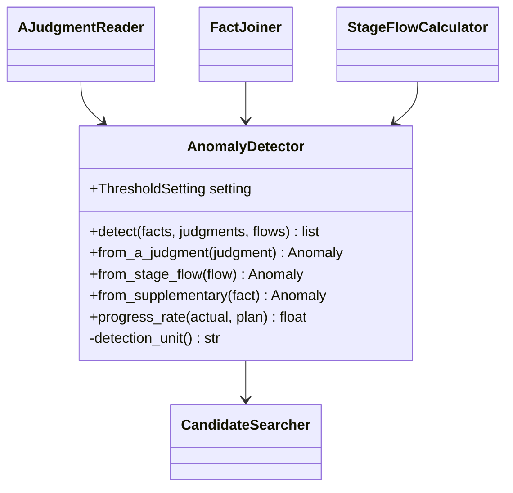
```mermaid
classDiagram
  class AnomalyDetector {
    +ThresholdSetting setting
    +detect(facts, judgments, flows) list
    +from_a_judgment(judgment) Anomaly
    +from_stage_flow(flow) Anomaly
    +from_supplementary(fact) Anomaly
    +progress_rate(actual, plan) float
    -detection_unit() str
  }
  AJudgmentReader --> AnomalyDetector
  FactJoiner --> AnomalyDetector
  StageFlowCalculator --> AnomalyDetector
  AnomalyDetector --> CandidateSearcher
```

| 메서드 | 부르는 곳 | 유스케이스 | 던지는 에러 |
|---|---|---|---|
| `detect(facts, judgments, flows) -> list` | [[#PipelineRunner]] 4단계 | [[TBL-UC-002#UC-S4]] 5~9 | `stage-failed` |
| `from_a_judgment(judgment) -> Anomaly` | `detect` 안에서 | [[TBL-UC-002#UC-S4]] 5 | 없음 |
| `from_stage_flow(flow) -> Anomaly` | `detect` 안에서 | [[TBL-UC-002#UC-S4]] 2·7 | 없음 |
| `from_supplementary(fact) -> Anomaly` | `detect` 안에서 | [[TBL-UC-002#UC-S4]] 5, [[TBL-UC-002#UC-S2]] 5 | 없음 |
| `progress_rate(actual, plan) -> float` | `from_supplementary` 안에서 | [[TBL-UC-002#UC-S4]] 1 | 없음. 계획 `NULL`이면 `None` |
| `detection_unit() -> str` | `detect` 안에서만 | [[TBL-UC-002#UC-S4]] 6 | 없음 |

규칙. [[#Anomaly]]를 만드는 유일한 클래스다. 출처가 셋이라 만드는 메서드도 셋이고 `source`에 aJudgment·supplementaryAggregate·derived로 남는다. 비교 값과 비교 방식은 결합 행에 이미 굳은 것을 옮길 뿐 고르지 않는다. 변동을 먼저 확정하고 원인은 나중에 붙인다. 순서를 뒤집으면 뉴스가 많은 국가만 계속 올라온다([[TBL-DOM-004#Anomaly]]). 진도율 컬럼을 쓰지 않고 실적과 계획으로 직접 계산한다. 생산 진도율은 총계 행에만 값이 있고 상세 행은 전부 0이었다([[TBL-RFQ-002]] 4.2절). 감지 단위는 차종 그룹이다([[TBL-PRD-002#R13]], [[TBL-PRD-002]] 6.15). 세부 차종 단위로 전년 대비를 돌리면 모델 교체가 -100%로 잡힌다. 2025년 11월 전년 동월 대비로 0이 된 세부 차종은 팰리세이드 LX2 2,282에서 0, 넥쏘 FE 111에서 0, 니로 DE PBV 1에서 0 셋이며 셋 다 후속 전환이다. 팰리세이드 LX2는 연간 20,967에서 1,403으로 93% 줄었지만 차종 그룹으로 묶으면 20,967에서 55,291로 2.6배 늘었다. 단위를 잘못 잡으면 성장하는 차종을 급락으로 보고한다. 축 종류가 `plant`인 변동도 만든다. 생산 판정이 공장 단위로 오기 때문이다. 다만 이 변동은 [[#CandidateSearcher]]에서 후보를 얻지 못하고 [[#TrafficLightJudge]]에서 `notApplicable`이며 열람 응답의 변동 목록에 들어가지 않는다([[TBL-API-002]] 1.6절). 도메인 상태 한 줄이 이 변동을 읽는다.

#### CandidateSearcher 후보 검색기

변동 하나에 원인 후보를 붙인다. 코드가 찾는다.

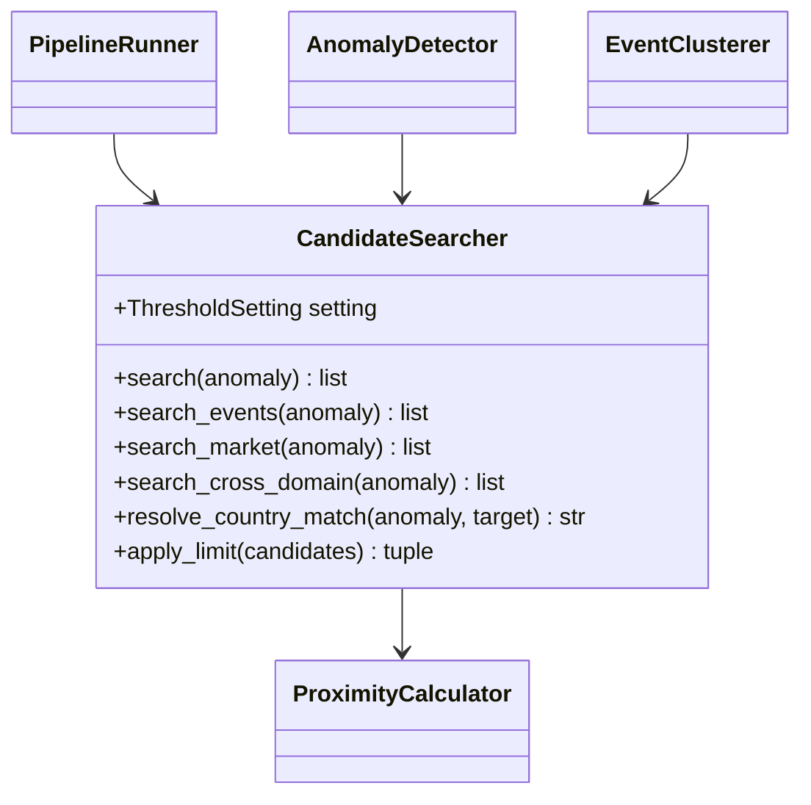
```mermaid
classDiagram
  class CandidateSearcher {
    +ThresholdSetting setting
    +search(anomaly) list
    +search_events(anomaly) list
    +search_market(anomaly) list
    +search_cross_domain(anomaly) list
    +resolve_country_match(anomaly, target) str
    +apply_limit(candidates) tuple
  }
  PipelineRunner --> CandidateSearcher
  AnomalyDetector --> CandidateSearcher
  EventClusterer --> CandidateSearcher
  CandidateSearcher --> ProximityCalculator
```

| 메서드 | 부르는 곳 | 유스케이스 | 던지는 에러 |
|---|---|---|---|
| `search(anomaly) -> list` | [[#PipelineRunner]] 5단계, 국가 축 변동마다 | [[TBL-UC-002#UC-S5]] 1~6 | `stage-failed` |
| `search_events(anomaly) -> list` | `search` 안에서 | [[TBL-UC-002#UC-S5]] 2·2a | 없음 |
| `search_market(anomaly) -> list` | `search` 안에서 | [[TBL-UC-002#UC-S5]] 3 | 없음 |
| `search_cross_domain(anomaly) -> list` | `search` 안에서 | [[TBL-UC-002#UC-S5]] 4 | 없음 |
| `resolve_country_match(anomaly, target) -> str` | 검색 메서드 셋 안에서 | [[TBL-UC-002#UC-S5]] 5 | 없음 |
| `apply_limit(candidates) -> tuple` | `search` 끝, [[#ProximityCalculator]] `sort` 뒤 | [[TBL-UC-002#UC-S5]] 6·6a | 없음 |

규칙. `setting`이 시간창과 후보 상한을 준다. `search`는 [[#CauseCandidate]] 목록을 돌려준다. 후보 유형이 넷이라 검색 메서드가 셋이다(사건과 기사는 같은 경로로 찾는다). `resolve_country_match`는 국가 직접, 해협 귀속, 같은 국가 다른 도메인, 날짜만 일치 넷 중 하나를 돌려준다. 해협 귀속을 따로 두는 이유는 호르무즈 기사가 오만·아랍에미리트에 붙지 않으면 중동 변동의 후보가 비어 버리기 때문이다([[#Strait]] [[TBL-PRD-002#R10]]). 시장지표가 `dateOnly`로만 붙는 것은 국가·차종과 이어지지 않기 때문이다. `apply_limit`은 상한을 적용하고 잘린 건수를 함께 돌려준다. 잘린 건수는 화면에 적어 "후보가 이것뿐"이라고 오해하지 않게 한다([[TBL-UC-002#UC-H3]] 3). 국가 축이 없는 변동은 처음부터 대상이 아니다([[TBL-UC-002#UC-S5]] 1).

#### ProximityCalculator 근접도 계산기

후보마다 셀 수 있는 값 넷을 세고 정렬 순서를 매긴다.

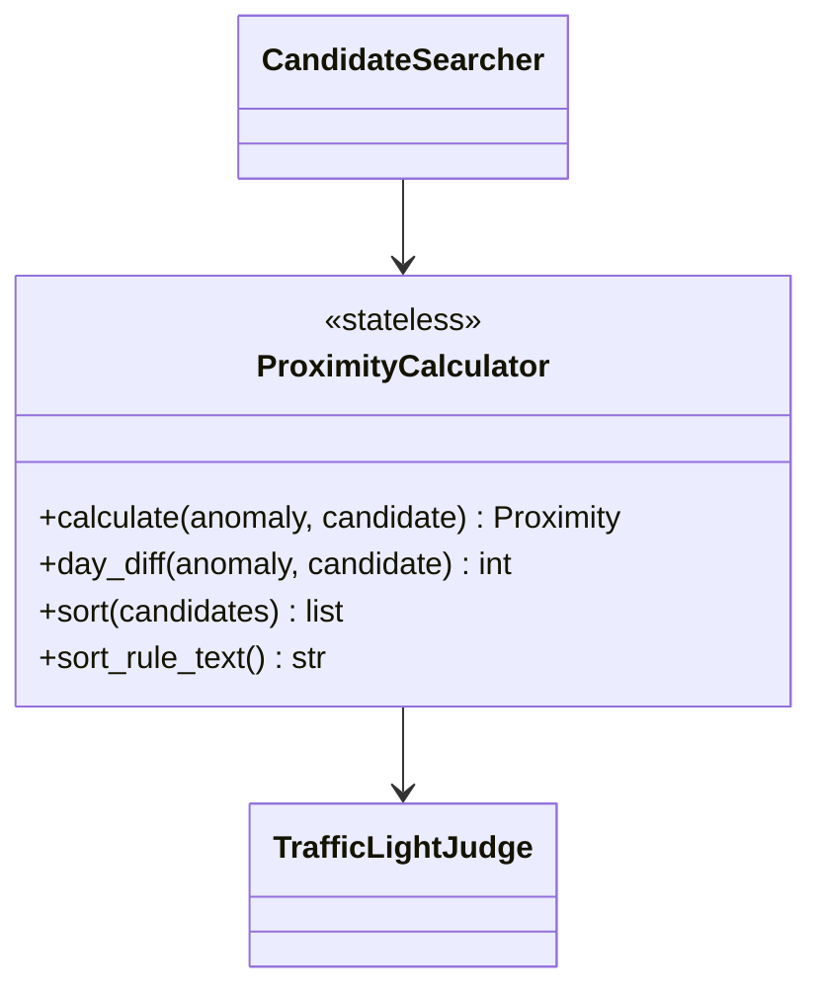
```mermaid
classDiagram
  class ProximityCalculator {
    <<stateless>>
    +calculate(anomaly, candidate) Proximity
    +day_diff(anomaly, candidate) int
    +sort(candidates) list
    +sort_rule_text() str
  }
  CandidateSearcher --> ProximityCalculator
  ProximityCalculator --> TrafficLightJudge
```

| 메서드 | 부르는 곳 | 유스케이스 | 던지는 에러 |
|---|---|---|---|
| `calculate(anomaly, candidate) -> Proximity` | [[#CandidateSearcher]] `search`, 후보마다 | [[TBL-UC-002#UC-S5]] 5 | 없음 |
| `day_diff(anomaly, candidate) -> int` | `calculate` 안에서 | [[TBL-UC-002#UC-S5]] 5 | 없음 |
| `sort(candidates) -> list` | [[#CandidateSearcher]] `search` | [[TBL-UC-002#UC-S5]] 6 | 없음 |
| `sort_rule_text() -> str` | [[#ReportPublisher]] `publish` | [[TBL-UC-002#UC-H3]] 6 | 없음 |

규칙. 속성이 없다. 상태를 갖지 않는 순수 계산 클래스다. `calculate`는 날짜 차이·기사 수·출처 수·국가 일치 방식 넷을 돌려준다. `day_diff`는 변동의 파일 기준일을 기준점으로 세고 사건은 마지막 관측일을 쓴다. `sort`는 날짜 차이 오름차순, 같으면 출처 수 내림차순, 그다음 기사 수 내림차순, 그래도 같으면 후보 식별자 사전순으로 정렬한다. 넷째 열쇠는 구현에서 뺄 수 없는 계약이다([[TBL-PRD-002#R10]]). `sort_rule_text`는 앞의 셋만 한 문장으로 돌려주고 [[#CReport]]의 `candidate_sort_rule` 한 칸에 실린다([[TBL-API-002]] 1.3절). 이 클래스에 등급·점수·순위를 만드는 메서드를 두지 않는다. 관련도 등급을 개념에서 뺀 것이 [[TBL-PRD-002]] 6.14이고, 여기에 점수 하나를 만들면 그 결정이 되살아난다. `sort_order`는 관련도 순위가 아니라 정렬 규칙이 낳은 자리 번호다. 기간 구분이 넓은 변동에서 날짜 차이가 불리하게 나오는 것은 보정하지 않고 화면이 기간 구분을 함께 적는다(5장 미결).

#### TrafficLightJudge 신호등 판정기

신호등을 규칙으로 정하고 워치리스트 줄과 도메인 상태 카드를 만든다.

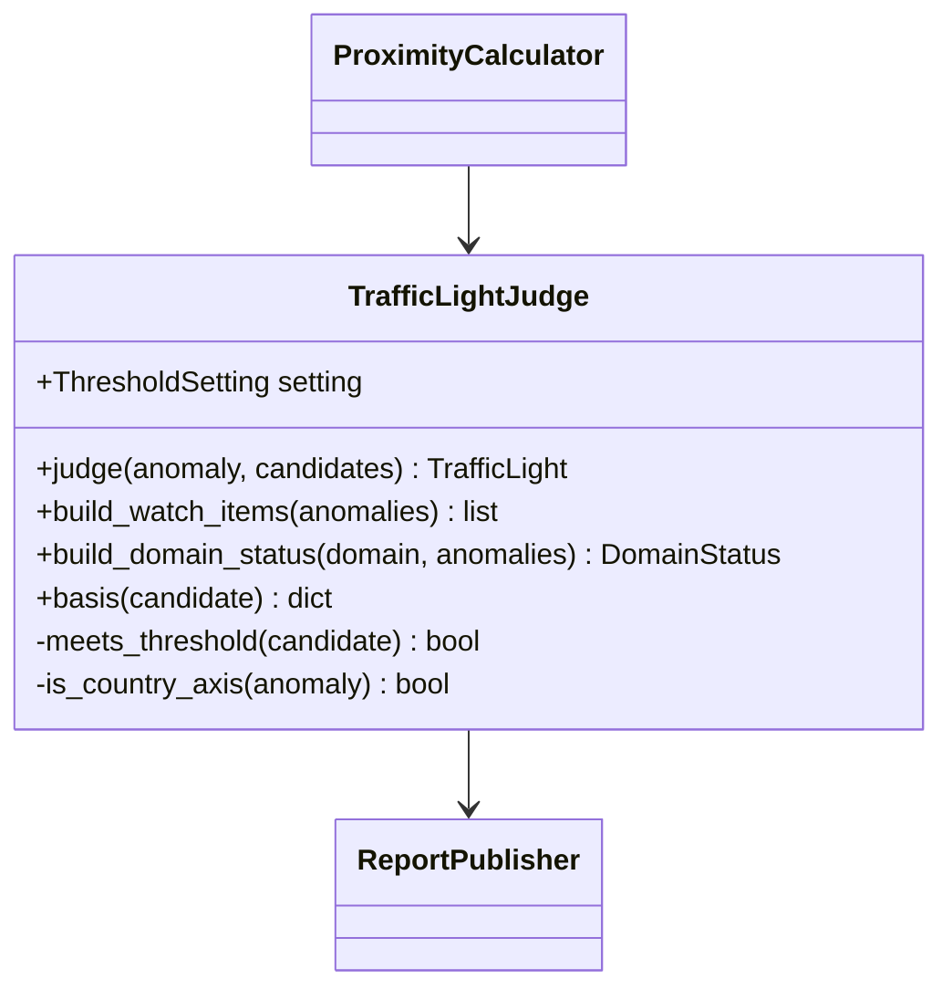
```mermaid
classDiagram
  class TrafficLightJudge {
    +ThresholdSetting setting
    +judge(anomaly, candidates) TrafficLight
    +build_watch_items(anomalies) list
    +build_domain_status(domain, anomalies) DomainStatus
    +basis(candidate) dict
    -meets_threshold(candidate) bool
    -is_country_axis(anomaly) bool
  }
  ProximityCalculator --> TrafficLightJudge
  TrafficLightJudge --> ReportPublisher
```

| 메서드 | 부르는 곳 | 유스케이스 | 던지는 에러 |
|---|---|---|---|
| `judge(anomaly, candidates) -> TrafficLight` | [[#PipelineRunner]] 5단계, 변동마다 | [[TBL-UC-002#UC-S5]] 7·7a | `stage-failed` |
| `build_watch_items(anomalies) -> list` | [[#PipelineRunner]] 5단계 끝 | [[TBL-UC-002#UC-S5]] 9 | `stage-failed` |
| `build_domain_status(domain, anomalies) -> DomainStatus` | [[#PipelineRunner]] 5단계 끝, 도메인 셋 | [[TBL-UC-002#UC-S5]] 8 | `stage-failed` |
| `basis(candidate) -> dict` | `judge` 안에서 | [[TBL-UC-002#UC-H3]] 1a | 없음 |
| `meets_threshold(candidate) -> bool` | `judge` 안에서만 | [[TBL-UC-002#UC-S5]] 7 | 없음 |
| `is_country_axis(anomaly) -> bool` | `judge` 안에서만 | [[TBL-UC-002#UC-S5]] 1 | 없음 |

규칙. `setting`이 최소 기사 수, 최소 출처 수, 시간창, CBU 비중 기준을 준다. `judge`는 `red` `yellow` `none` `notApplicable` 중 하나와 그 근거를 돌려준다. 사건 후보가 기사 수 ≥ 최소, 출처 수 ≥ 최소, 날짜 차이 ≤ 시간창 셋을 모두 채우고 완성차 노출이 확인되면 `red`, 셋을 채웠으나 노출이 미확인이면 `yellow`, 하나라도 못 채우면 `none`이고 목록에는 남는다. 축 종류가 `country`가 아니면 임계값을 보기 전에 `notApplicable`로 끝낸다([[TBL-PRD-002#R16]]). `build_watch_items`는 [[#WatchItem]] 목록을 만들고 신호등 순으로 정렬하며 [[#GlovisEntity]]가 없으면 `entity_tag`를 미매핑으로 둔다([[TBL-PRD-002#R17]]). `build_domain_status`는 그 도메인 안 변동 신호등의 최댓값을 카드의 신호등으로 쓰고 판정 출처(aJudgment·supplementaryAggregate·notReceived)와 [[#Contribution]] 상위 몇 건을 함께 담는다. 생산은 국가 축이 없어 `notApplicable`이고 화면 표기가 "판정 대상 아님"이다([[TBL-API-002]] 4.4절). 후보를 못 찾아 `none`이 된 것과 판정 대상이 아닌 것을 같은 색으로 적지 않는다. 판정 계층의 마지막 클래스이며 산출물이 [[#ReportPublisher]]로 바로 간다. 신호등은 규칙 산출물이다. LLM을 끄고 배치를 돌려도 같은 값이 나와야 한다([[TBL-INFRA-002#C19]]). 워치리스트 줄과 도메인 상태 카드를 이 클래스가 만드는 것이 경계의 핵심이다. 게시기에서 만들면 8단계 산출물이 되고, 8단계는 LLM이 섞인 단계라 "LLM을 꺼도 같다"를 보장할 수 없다. 도메인 상태에서 LLM이 쓰는 것은 문장 한 줄뿐이다.

### 4.4 서술 계층

배치 6~8단계다. 다섯 중 셋이 LLM을 부르고 둘은 코드다. 이 계층이 통째로 죽어도 앞 계층의 산출물은 [[#ReportPublisher]]까지 그대로 간다.

#### EventNamer 사건 명명기

이미 묶인 사건에 사람이 읽을 이름을 붙인다.

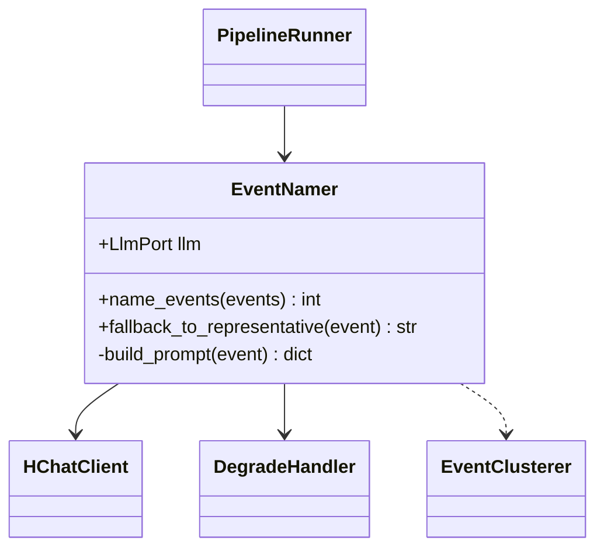
```mermaid
classDiagram
  class EventNamer {
    +LlmPort llm
    +name_events(events) int
    +fallback_to_representative(event) str
    -build_prompt(event) dict
  }
  PipelineRunner --> EventNamer
  EventNamer --> HChatClient
  EventNamer --> DegradeHandler
  EventNamer ..> EventClusterer
```

| 메서드 | 부르는 곳 | 유스케이스 | 던지는 에러 |
|---|---|---|---|
| `name_events(events) -> int` | [[#PipelineRunner]] 6단계 | [[TBL-UC-002#UC-S6]] 1~3 | 없음. 실패는 [[#DegradeHandler]]로 |
| `fallback_to_representative(event) -> str` | `name_events` 실패 시 | [[TBL-UC-002#UC-S6]] 2a, [[TBL-UC-002#UC-S11]] 1 | 없음 |
| `build_prompt(event) -> dict` | `name_events` 안에서만 | [[TBL-UC-002#UC-S6]] 2 | 없음 |

규칙. `llm`은 게이트웨이 포트다. `name_events`는 후보로 뽑힌 사건 중 아직 명명되지 않은 것만 골라 이름을 붙인 건수를 돌려준다. 후보가 아닌 사건은 호출하지 않는다. `build_prompt`는 그 사건의 상위 5건 제목·요약만 담고 심각도를 요구하지 않는다. `fallback_to_representative`는 대표 기사 제목을 이름으로 쓰고 `named_by`를 representative로 남긴다. 이 클래스가 하는 일은 이름 하나뿐이다. 기사 수·출처 수·영향도는 3단계에서 정해져 있고 모델이 손대지 못한다([[TBL-PRD-002#R6]]). 백필 모드면 호출을 생략한다.

#### CauseLinkWriter 연관 설명기

변동 하나와 후보들이 어떻게 이어지는지를 문단 하나로 쓴다.

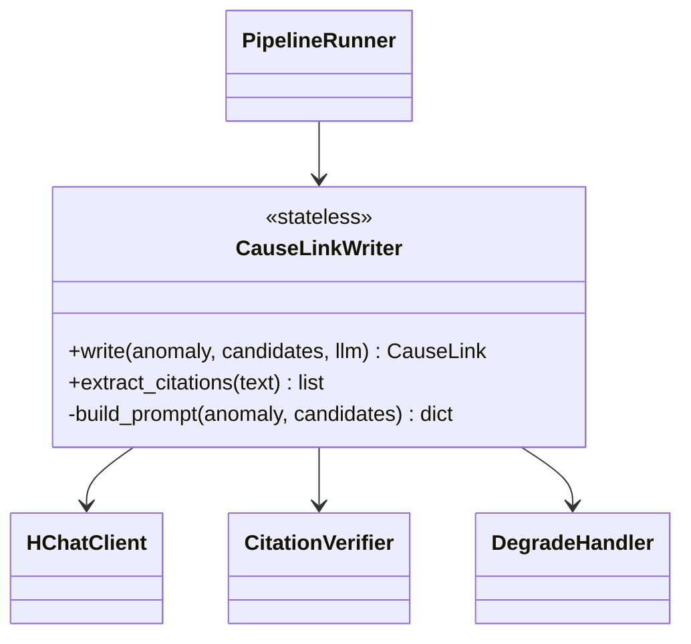
```mermaid
classDiagram
  class CauseLinkWriter {
    <<stateless>>
    +write(anomaly, candidates, llm) CauseLink
    +extract_citations(text) list
    -build_prompt(anomaly, candidates) dict
  }
  PipelineRunner --> CauseLinkWriter
  CauseLinkWriter --> HChatClient
  CauseLinkWriter --> CitationVerifier
  CauseLinkWriter --> DegradeHandler
```

| 메서드 | 부르는 곳 | 유스케이스 | 던지는 에러 |
|---|---|---|---|
| `write(anomaly, candidates, llm) -> CauseLink` | [[#PipelineRunner]] 7단계, 변동마다 | [[TBL-UC-002#UC-S7]] 1~4 | 없음. 실패는 [[#DegradeHandler]]로 |
| `extract_citations(text) -> list` | `write` 안에서, [[#CitationVerifier]] 앞 | [[TBL-UC-002#UC-S7]] 3 | 없음 |
| `build_prompt(anomaly, candidates) -> dict` | `write` 안에서만 | [[TBL-UC-002#UC-S7]] 1 | 없음 |

규칙. 속성이 없고 포트를 호출 인자로 받는다. `write`는 [[#CauseLink]] 한 건을 돌려준다. 변동마다 최대 하나다. 등급을 매기지 않는다. 출력 스키마에 높음·낮음이나 점수 필드가 없다([[TBL-PRD-002#R11]] [[TBL-API-002]] 4.7절). 후보 목록이 곧 모델이 인용할 수 있는 사실의 전부다. 프롬프트에 후보 밖의 값을 넣으면 검증기가 잡을 수 없는 문장이 나온다. 인용 검증에 실패하면 사유를 붙여 1회 재요청하고 다시 실패하면 설명 없이 진행한다([[TBL-UC-002#UC-S7]] 3a). 신호등은 여기서 건드리지 않는다.

#### ClaimWriter 문장 생성기

리포트 문장을 쓴다. 헤드라인, 도메인 상태 세 장, 국가 카드다.

```mermaid
classDiagram
  class ClaimWriter {
    <<stateless>>
    +write_headline(context, llm) Claim
    +write_domain_status(domain, context, llm) Claim
    +write_card(anomaly, context, llm) Claim
    -build_prompt(section, context) dict
  }
  PipelineRunner --> ClaimWriter
  ClaimWriter --> HChatClient
  ClaimWriter --> CitationVerifier
  ClaimWriter --> DegradeHandler
  ReportPublisher ..> ClaimWriter : 근거 번호를 먼저 넘긴다
```

| 메서드 | 부르는 곳 | 유스케이스 | 던지는 에러 |
|---|---|---|---|
| `write_headline(context, llm) -> Claim` | [[#PipelineRunner]] 8단계 | [[TBL-UC-002#UC-S8]] 1~3 | 없음. 실패는 [[#DegradeHandler]]로 |
| `write_domain_status(domain, context, llm) -> Claim` | [[#PipelineRunner]] 8단계, 도메인 셋 | [[TBL-UC-002#UC-S8]] 1a | 없음 |
| `write_card(anomaly, context, llm) -> Claim` | [[#PipelineRunner]] 8단계, 국가 카드마다 | [[TBL-UC-002#UC-S8]] 1 | 없음 |
| `build_prompt(section, context) -> dict` | 세 메서드 안에서만 | [[TBL-UC-002#UC-S8]] 1 | 없음 |

규칙. 구역마다 메서드가 하나다. 각각 [[#Claim]] 한 건을 돌려주고 각주 번호 목록을 함께 담는다. `write_domain_status`는 문장만 쓴다. 카드의 신호등·판정 출처·기여 분해는 [[#TrafficLightJudge]]가 5단계에서 정해 두었고 이 메서드는 입력으로만 받는다. 근거 번호는 [[#ReportPublisher]]가 먼저 매겨 넘긴다. 모델이 번호를 만들지 않는다([[TBL-PRD-002#N4]] [[TBL-PRD-002#R23]]). 생산 구역의 문장은 외부 원인을 인용하지 않는다. 프롬프트에 후보를 아예 넣지 않는 것으로 지킨다([[TBL-PRD-002#R21]] [[TBL-INFRA-002#C16]]). 검증 실패면 1회 재생성하고 다시 실패하면 강등한다([[TBL-UC-002#UC-S8]] 3a).

#### CitationVerifier 검증기

모델이 쓴 문장의 인용이 후보 목록 밖으로 나갔는지 대조한다. 코드다.

```mermaid
classDiagram
  class CitationVerifier {
    <<stateless>>
    +verify_cause_link(cause_link, candidates) bool
    +verify_claim(claim, evidence, context) bool
    +out_of_scope_ids(cited, allowed) list
    +has_forbidden_words(text) list
  }
  CauseLinkWriter --> CitationVerifier
  ClaimWriter --> CitationVerifier
  CitationVerifier --> DegradeHandler
```

| 메서드 | 부르는 곳 | 유스케이스 | 던지는 에러 |
|---|---|---|---|
| `verify_cause_link(cause_link, candidates) -> bool` | [[#CauseLinkWriter]] `write` 뒤 | [[TBL-UC-002#UC-S7]] 3 | 없음 |
| `verify_claim(claim, evidence, context) -> bool` | [[#ClaimWriter]] 세 메서드 뒤 | [[TBL-UC-002#UC-S8]] 3 | 없음 |
| `out_of_scope_ids(cited, allowed) -> list` | 두 verify 안에서 | [[TBL-UC-002#UC-S7]] 3, [[TBL-UC-002#UC-S8]] 3 | 없음 |
| `has_forbidden_words(text) -> list` | 두 verify 안에서 | [[TBL-UC-002#UC-S7]] 3, [[TBL-UC-002#UC-S8]] 3 | 없음 |

규칙. `verify_cause_link`는 인용한 후보 식별자가 전부 그 변동의 후보 안에 있는지, 설명에 쓰인 수치가 입력 값과 같은지, 인과 단정과 등급 어휘가 없는지 본다. `verify_claim`은 각주 번호가 근거 목록 안에 있는지, 숫자·날짜·국가명이 입력에 있는지, 강조 토큰 외 마크업이 없는지, A 리포트 문장과 같지 않은지, 생산 문장에 외부 원인 인용이 없는지 본다([[TBL-PRD-002#R22]]). 검사를 코드가 하는 것이 이 클래스의 존재 이유다. 모델이 쓴 것을 모델에게 검사시키면 검사가 되지 않는다. 대조는 식별자 집합 비교와 문자열 포함 검사라 단순하고, 단순해야 이 검사가 실패하지 않는다.

#### DegradeHandler 강등 처리기

실패한 역할을 기록하고 배치를 계속 진행시킨다. 코드다.

```mermaid
classDiagram
  class DegradeHandler {
    <<stateless>>
    +degrade(role, reason, target) None
    +fill_template(anomaly, candidates) Claim
    +degraded_roles(batch_run_id) list
  }
  EventNamer --> DegradeHandler
  CauseLinkWriter --> DegradeHandler
  ClaimWriter --> DegradeHandler
  CitationVerifier --> DegradeHandler
  DegradeHandler --> ReportPublisher
```

| 메서드 | 부르는 곳 | 유스케이스 | 던지는 에러 |
|---|---|---|---|
| `degrade(role, reason, target) -> None` | 서술 계층 넷의 실패 지점 | [[TBL-UC-002#UC-S11]] 1~4 | 없음 |
| `fill_template(anomaly, candidates) -> Claim` | `degrade`(role=narration) 안에서 | [[TBL-UC-002#UC-S11]] 3·3a | 없음 |
| `degraded_roles(batch_run_id) -> list` | [[#ReportPublisher]] `publish` | [[TBL-UC-002#UC-S11]] 4 | 없음 |

규칙. `degrade`는 역할(`naming` `causeLink` `narration`)과 사유를 받아 기록한다. 사유는 LLM 오류, 내용 필터, 형식 위반, 인용 검증 실패, 백필 모드 다섯이다([[TBL-API-002]] 4.7절). `fill_template`은 변동, 후보 제목, 근접도 값을 템플릿에 채우고 각주를 후보 순서대로 기계 부여한다. 그것도 실패하면 문장 없이 판정값만 게시한다. 강등을 예외로 던지지 않고 기록으로 다루는 것이 [[TBL-INFRA-002#C13]]과 [[TBL-PRD-002#N2]]다. 예외로 던지면 호출부마다 잡아야 하고 한 군데만 빠뜨려도 배치가 멈춘다. 강등은 6~8단계에만 생긴다. 1~5단계에는 이 클래스를 부르는 자리가 없다.

### 4.5 게시·열람 계층

#### ReportPublisher 게시기

근거에 번호를 매기고 C 리포트 한 본을 게시 스키마에 넣는다. A 리포트 사본도 이 클래스가 올린다.

```mermaid
classDiagram
  class ReportPublisher {
    <<stateless>>
    +number_evidence(anomalies, candidates) list
    +publish(batch_run, base_date) CReport
    +publish_a_report(domain, document) str
    +diff_watchlist(current, previous) list
    +copy_display_values(evidence) None
    -next_version(base_date) int
  }
  PipelineRunner --> ReportPublisher
  TrafficLightJudge --> ReportPublisher
  DegradeHandler --> ReportPublisher
  ReportPublisher --> CReportService
  ReportPublisher --> DomainReportService
  ReportPublisher ..> BriefingStoreReader : A 리포트 본문 읽기
  ReportPublisher ..> ClaimWriter : 번호를 먼저 넘긴다
```

| 메서드 | 부르는 곳 | 유스케이스 | 던지는 에러 |
|---|---|---|---|
| `number_evidence(anomalies, candidates) -> list` | [[#PipelineRunner]] 8단계 맨 앞 | [[TBL-UC-002#UC-S8]] 1 | `stage-failed` |
| `publish(batch_run, base_date) -> CReport` | [[#PipelineRunner]] 8단계 끝 | [[TBL-UC-002#UC-S8]] 4, [[TBL-UC-002#UC-S1]] 8 | `stage-failed` |
| `publish_a_report(domain, document) -> str` | [[#PipelineRunner]] 8단계 끝, 도메인 셋 | [[TBL-UC-002#UC-S1]] 8·8b | 없음. 실패면 사본만 미수신 |
| `diff_watchlist(current, previous) -> list` | `publish` 안에서, [[#BatchService]] `publish_version` | [[TBL-UC-002#UC-S9]] 1~2·1a·1b | 없음 |
| `copy_display_values(evidence) -> None` | `number_evidence` 안에서 | [[TBL-UC-002#UC-H3]] 3 | 없음 |
| `next_version(base_date) -> int` | `publish` 안에서만 | [[TBL-UC-002#UC-A3]] 4 | 없음 |

규칙. `number_evidence`는 8단계 맨 앞에서 돌아 [[#Evidence]] 번호를 먼저 매긴다. 번호 매기기가 문장 쓰기보다 먼저 도는 순서가 이 클래스의 계약이다. `publish`는 [[#CReport]] 한 버전을 만든다. 도메인 상태 3카드를 채우는 것도 이 메서드이며 값은 [[#TrafficLightJudge]]의 `build_domain_status` 산출물을 그대로 옮기고 문장만 [[#ClaimWriter]]에게서 받는다. 소스별 최신일 셋과 `notices`와 `candidate_sort_rule`도 여기서 채운다. `publish_a_report`는 브리핑 갈래가 게시한 A 리포트를 문장·각주 근거·버전까지 받아 [[#DomainReport]] 사본으로 올린다. 열람 경로는 게시 스키마만 보므로([[TBL-INFRA-002#C10]]) 사본이 있어야 A 리포트 화면이 원본 저장소를 보지 않는다. 이 사본은 C 생성에 쓰지 않는다. `diff_watchlist`는 직전 게시본과 국가별 신호등을 비교해 [[#AlertEvent]]를 만들고 변화 배지를 붙인다. 첫 게시면 전부 신규, 같으면 남기지 않는다([[TBL-PRD-002#R24]]). `copy_display_values`는 표시용 값을 근거 행에 복사해 열람 시 조인을 없앤다([[TBL-PRD-002#N5]] [[TBL-INFRA-002#C9]]). 재생성이 기존 게시본을 덮지 않는다. 항상 새 버전이고 게시 전환은 사람이 누른다([[TBL-PRD-002#R18]]). 백필 모드면 이 클래스를 부르지 않는다.

#### CReportService C 리포트 조회

게시된 C 리포트를 읽어 준다. 다시 계산하지 않는다.

```mermaid
classDiagram
  class CReportService {
    <<stateless>>
    +get_latest() CReport
    +get_by_id(report_id, viewer) CReport
    -assert_published_or_admin(report, viewer) None
  }
  ReportPublisher --> CReportService
```

| 메서드 | 부르는 곳 | 유스케이스 | 던지는 에러 |
|---|---|---|---|
| `get_latest() -> CReport` | [[TBL-API-002#GET/api/intel/creport/latest]] | [[TBL-UC-002#UC-H2]] 1·1a~1d | `no-published-report` `unauthenticated` |
| `get_by_id(report_id, viewer) -> CReport` | [[TBL-API-002#GET/api/intel/creport/version/{reportId}]] | [[TBL-UC-002#UC-H2]], [[TBL-UC-002#UC-A3]] 3 | `not-found` `unauthenticated` |
| `assert_published_or_admin(report, viewer) -> None` | `get_by_id` 안에서만 | [[TBL-UC-002#UC-A3]] 3 | `not-found` |

규칙. 게시 스키마 읽기 전용 세션만 쓴다. 응답에 워치리스트·변동·후보·근접도·설명·근거 패널까지 한 번에 담아 펼칠 때 추가 호출이 없다([[TBL-UC-002#UC-H3]]). 열람 경로에 집계·조인·LLM이 없고 p95 2초 안에 끝난다([[TBL-PRD-002#N5]] [[TBL-INFRA-002#C10]]). `assert_published_or_admin`은 현업 토큰으로 미게시본을 부르면 404를 낸다. 존재 여부를 알려 주지 않기 위해 403이 아니다. 변동 없음·강등·판정 미수신·배치 실패·지표 이월은 에러가 아니라 200과 `notices`다([[TBL-API-002]] 2장). 응답 크기가 커지는 문제는 남아 있다(5장 미결).

#### DomainReportService A 리포트 조회

A1 생산·A2 재고·A3 판매 중 한 도메인의 게시 사본을 읽어 준다.

```mermaid
classDiagram
  class DomainReportService {
    <<stateless>>
    +get_latest_by_domain(domain) DomainReport
    +get_by_id(domain_report_id) DomainReport
    +list_versions(domain) list
    +build_domain_extra(domain, report) dict
    +list_missing_metrics(domain) list
    +render_pdf(report) tuple
  }
  ReportPublisher --> DomainReportService
```

| 메서드 | 부르는 곳 | 유스케이스 | 던지는 에러 |
|---|---|---|---|
| `get_latest_by_domain(domain) -> DomainReport` | [[TBL-API-002#GET/api/intel/areport/domain/{domain}]] | [[TBL-UC-002#UC-H1]] 1~4·4a | `not-found` `validation-failed`(도메인 값) |
| `get_by_id(domain_report_id) -> DomainReport` | [[TBL-API-002#GET/api/intel/areport/version/{domainReportId}]] | [[TBL-UC-002#UC-H1]] 5 | `not-found` |
| `list_versions(domain) -> list` | `get_latest_by_domain` 안에서 | [[TBL-UC-002#UC-H1]] 5 | 없음 |
| `build_domain_extra(domain, report) -> dict` | 두 get 안에서 | [[TBL-UC-002#UC-H1]] 1~2 | 없음 |
| `list_missing_metrics(domain) -> list` | 두 get 안에서 | [[TBL-UC-002#UC-H1]] 3 | 없음 |
| `render_pdf(report) -> tuple` | [[TBL-API-002#GET/api/intel/areport/pdf/{domainReportId}]] | [[TBL-UC-002#UC-H1]] 6 | 없음 |

규칙. [[#ReportPublisher]]가 올린 게시 사본을 읽기만 한다. 브리핑 갈래 저장소를 직접 보지 않으므로 열람 경로가 게시 스키마 밖으로 나가지 않는다([[TBL-INFRA-002#C10]] [[TBL-PRD-002#R2]]). 사본이 없으면 판정값과 차트만 내려가고 "리포트 문장 미수신"이 붙는다([[TBL-UC-002#UC-H1]] 4a). 응답 어디에도 뉴스·시장지표 인용이 없다. 이것이 인수 기준이다([[TBL-PRD-002#R1]]). C 리포트로 가는 링크 필드도 두지 않는다. A에서 C로 가는 화면 흐름이 없기 때문이다([[TBL-PRD-002]] 6.17). `build_domain_extra`는 도메인마다 다른 덩어리를 만든다. A1은 달성률과 완성차·수출 비중, A2는 유도 체류와 회전, A3는 단계 격차와 진도율이다([[TBL-UI-002#UI-2]] [[TBL-UI-002#UI-3]] [[TBL-UI-002#UI-4]]). `list_missing_metrics`는 항해중·선적대기 재고, 목적지 국가, 파워트레인 분해를 이유와 함께 돌려준다([[TBL-API-002]] 4.13절). `render_pdf`는 보고 있는 버전 한 본을 화면과 같은 순서의 PDF 지면으로 옮긴다. 서버가 요청마다 만들고 저장하지 않으며 LLM을 부르지 않는다. WeasyPrint로 HTML을 PDF로 만들고 막대는 서버가 SVG로 그린다(같은 발주처 브리핑 갈래의 방식, 유저 결정 2026-09-30).

#### MarketService 시장지표 시계열 조회

지표 하나의 최근 값 목록을 읽어 준다.

```mermaid
classDiagram
  class MarketService {
    <<stateless>>
    +get_series(indicator_id, days) list
    +as_of(indicator_id, date) MarketPoint
    +is_carried_over(point, date) bool
  }
  FactJoiner ..> MarketService : as-of 조회
```

| 메서드 | 부르는 곳 | 유스케이스 | 던지는 에러 |
|---|---|---|---|
| `get_series(indicator_id, days) -> list` | [[TBL-API-002#GET/api/intel/market/series/{indicatorId}]] | [[TBL-UC-002#UC-H2]] 2 | `not-found` `validation-failed`(days 범위) |
| `as_of(indicator_id, date) -> MarketPoint` | [[#FactJoiner]] `attach_market_asof` | [[TBL-UC-002#UC-S4]] 4 | 없음 |
| `is_carried_over(point, date) -> bool` | `as_of` 안에서, `get_series` | [[TBL-UC-002#UC-S4]] 4a, [[TBL-UC-002#UC-H2]] 2a | 없음 |

규칙. [[#MarketPoint]]를 읽는다. 지표는 국가·차종과 이어지지 않아 조인 축이 날짜뿐이다. 그래서 신호등의 입력이 아니고 후보와 표시용으로만 쓴다([[TBL-PRD-002#R7]]). 이월 한도를 넘어도 값을 비우지 않고 이월 표시와 기준일 지연을 함께 낸다([[TBL-PRD-002#R27]] [[TBL-UI-002#UI-1]]).

#### BatchService 배치 조회·재실행

배치 상태와 이력을 보여 주고, 다시 돌리고, 게시 전환한다.

```mermaid
classDiagram
  class BatchService {
    <<stateless>>
    +get_status() dict
    +list_runs(filters, cursor) list
    +get_run(batch_run_id) BatchRun
    +request_rerun(base_date, start_stage, options) BatchRun
    +publish_version(report_id) dict
    -assert_not_running(base_date) None
  }
  BatchService --> PipelineRunner
  BatchService --> ReportPublisher
```

| 메서드 | 부르는 곳 | 유스케이스 | 던지는 에러 |
|---|---|---|---|
| `get_status() -> dict` | [[TBL-API-002#GET/api/admin/batch/status]] | [[TBL-UC-002#UC-A3]], [[TBL-UC-002#UC-S10]] 4 | `unauthenticated` `forbidden` |
| `list_runs(filters, cursor) -> list` | [[TBL-API-002#GET/api/admin/batch/history]] | [[TBL-UC-002#UC-A3]] | `unauthenticated` `forbidden` |
| `get_run(batch_run_id) -> BatchRun` | [[TBL-API-002#GET/api/admin/batch/run/{batchRunId}]] | [[TBL-UC-002#UC-A3]] 3·3a | `not-found` |
| `request_rerun(base_date, start_stage, options) -> BatchRun` | [[TBL-API-002#POST/api/admin/batch/rerun]] | [[TBL-UC-002#UC-A3]] 1~2·1a | `stage-out-of-range` `batch-in-progress` `regression-blocked` |
| `publish_version(report_id) -> dict` | [[TBL-API-002#POST/api/admin/batch/publish/{reportId}]] | [[TBL-UC-002#UC-A3]] 4, [[TBL-UC-002#UC-S9]] | `not-found` `already-published` |
| `assert_not_running(base_date) -> None` | `request_rerun` 안에서만 | [[TBL-UC-002#UC-A3]] 1a | `batch-in-progress` |

규칙. 다섯이 [[TBL-API-002]]의 배치 엔드포인트 다섯과 1:1이다. `get_status`는 자동 실행이 막혀 있는지와 무엇이 막고 있는지를 함께 돌려준다. `request_rerun`은 기준일과 시작 단계를 받아 [[#PipelineRunner]]를 부른다. [[#PipelineRunner]]를 부르는 유일한 서비스다. worker는 한 번에 하나만 돌므로 정기 배치 시각과 겹치면 정기 배치를 대기시킨다([[TBL-UC-002#UC-A3]] 2a). 지정 단계부터 다시 돌리는 것과 특정 일자를 재생성하는 것을 한 호출로 합친 이유는 둘이 같은 일이기 때문이다. 시작 단계가 1이면 재생성이고 6이면 서술만 다시 도는 것이다. `get_run`은 변동·후보·근접도·신호등을 당시와 비교한 차이 필드를 돌려준다. 이 넷은 같은 입력이면 같아야 한다([[TBL-PRD-002#N3]]). 게시 전환을 재실행과 나눈 이유는 사람이 결과를 보고 결정하기 때문이다. 자동 전환이면 재생성이 게시본을 덮는다([[TBL-PRD-002#R18]]). `publish_version`은 전환 뒤 [[#ReportPublisher]]의 `diff_watchlist`를 다시 돌린다.

#### MasterService 마스터·크로스워크

국가 매칭률을 보여 주고, 크로스워크를 받고, 확정한다.

```mermaid
classDiagram
  class MasterService {
    <<stateless>>
    +get_summary() dict
    +list_unmapped(filters) list
    +upload_crosswalk(upload) dict
    +confirm_crosswalk(upload_id, confirm_removal) dict
    -diff_against_current(upload) dict
  }
  RecordStandardizer ..> MasterService : 미매핑 넘김
```

| 메서드 | 부르는 곳 | 유스케이스 | 던지는 에러 |
|---|---|---|---|
| `get_summary() -> dict` | [[TBL-API-002#GET/api/admin/master/summary]] | [[TBL-UC-002#UC-A2]] | `unauthenticated` `forbidden` |
| `list_unmapped(filters) -> list` | [[TBL-API-002#GET/api/admin/master/unmapped]] | [[TBL-UC-002#UC-A2]] 1 | 없음 |
| `upload_crosswalk(upload) -> dict` | [[TBL-API-002#POST/api/admin/master/crosswalk]] | [[TBL-UC-002#UC-A2]] 2~3·2a | `validation-failed`(충돌 행) `file-too-large` |
| `confirm_crosswalk(upload_id, confirm_removal) -> dict` | [[TBL-API-002#POST/api/admin/master/confirm/{crosswalkUploadId}]] | [[TBL-UC-002#UC-A2]] 4·3a | `not-found` `removal-not-confirmed` |
| `diff_against_current(upload) -> dict` | `upload_crosswalk` 안에서만 | [[TBL-UC-002#UC-A2]] 3 | 없음 |

규칙. 넷이 [[TBL-API-002]]의 마스터 엔드포인트 넷과 1:1이고 마스터 화면([[TBL-UI-002#UI-7]])이 부른다. `get_summary`는 매칭률 셋(판매→국가, 생산→국가, 뉴스→국가)과 버전 이력을 돌려준다. `upload_crosswalk`는 같은 값이 두 국가로 갈리면 올리기를 막고 충돌 행을 돌려준다. `diff_against_current`는 확정하면 무엇이 지워지는지 미리 보여 준다. `confirm_crosswalk`는 지워지는 매핑이 있으면 확인 없이는 409를 낸다. 확정 전에 지워지는 매핑을 보여 주는 이유는 크로스워크가 통째 교체이기 때문이다. 한 줄 빠진 파일을 올리면 그 국가의 과거 매핑이 조용히 사라진다([[TBL-PRD-002#N8]]). 확정은 새 버전으로 갱신되고 다음 배치부터 적용되며 과거 판정은 바뀌지 않는다. [[#Country]] [[#Strait]] [[#GlovisEntity]]를 관리한다. 글로비스 법인 매핑은 아직 비어 있다. 발주자에게 받아야 채워지고, 빈 동안에는 법인 미매핑으로 표시하며 오류로 보지 않는다([[TBL-PRD-002#R17]]).

#### ExposureService 열람 주소

열람 화면 넷(C 리포트, A1, A2, A3)의 서명 주소를 발급·회전하고, 열람 요청의 주소가 어느 화면을 여는지 확인한다.

```mermaid
classDiagram
  class ExposureService {
    <<stateless>>
    +summary() list
    +switch(screen, enabled, rotate_token, admin_id) dict
    +verify(token) str
  }
```

| 메서드 | 부르는 곳 | 유스케이스 | 던지는 에러 |
|---|---|---|---|
| `summary() -> list` | [[TBL-API-002#GET/api/admin/exposure/summary]] | [[TBL-UC-002#UC-A4]] 1 | `unauthenticated` `forbidden` |
| `switch(screen, enabled, rotate_token, admin_id) -> dict` | [[TBL-API-002#POST/api/admin/exposure/switch/{screen}]] | [[TBL-UC-002#UC-A4]] 2·2a·2b | `validation-failed` |
| `verify(token) -> str` | 열람 API 여섯의 인증 의존성(`core/auth`) | [[TBL-UC-002#UC-H1]] 1c, [[TBL-UC-002#UC-H2]] 1e | `unauthenticated` `invalid-token`(의존성이 낸다) |

규칙. 서명값은 URL에 실을 수 있는 무작위 32바이트이고 계산이 아니라 [[TBL-DOM-006#screen_exposure]]와 대조해 확인한다. 회전하면 이전 값은 그 자리에서 무효다. 자동 회전은 없다. 개인을 식별하지 않는다. 서명값은 로그와 오류 문장에 남기지 않는다. 같은 발주처의 브리핑 갈래가 정한 방식(대시보드 단위 서명 주소)을 따른다(유저 결정 2026-09-30). 열람 요청이 이 표를 먼저 읽으므로 표는 `pub`에 둔다([[TBL-INFRA-002#C10]]).

### 4.6 어댑터

#### HChatClient H-chat 클라이언트

사내 게이트웨이에 LLM을 부른다. 서술 계층만 쓴다.

```mermaid
classDiagram
  class HChatClient {
    +str base_url
    +str model
    +int daily_token_limit
    +complete(prompt, json_schema, purpose) dict
    +remaining_tokens() int
    -log_call(purpose, tokens, latency, result) None
  }
  EventNamer --> HChatClient
  CauseLinkWriter --> HChatClient
  ClaimWriter --> HChatClient
```

| 메서드 | 부르는 곳 | 유스케이스 | 던지는 에러 |
|---|---|---|---|
| `complete(prompt, json_schema, purpose) -> dict` | [[#EventNamer]] [[#CauseLinkWriter]] [[#ClaimWriter]] | [[TBL-UC-002#UC-S6]] 2, [[TBL-UC-002#UC-S7]] 2, [[TBL-UC-002#UC-S8]] 2 | `llm-error` `content-filtered` `json-violation` `token-limit`. 전부 호출자가 [[#DegradeHandler]]로 넘긴다 |
| `remaining_tokens() -> int` | `complete` 앞에서 호출자 | [[TBL-UC-002#UC-S1]] 9 | 없음 |
| `log_call(purpose, tokens, latency, result) -> None` | `complete` 안에서만 | [[TBL-UC-002#UC-S1]] 9 | 없음 |

규칙. `LlmPort`의 구현체다. `base_url`과 `model`은 환경변수로 주입한다. 키는 코드·문서·저장소에 적지 않고 로그에도 남기지 않는다([[TBL-INFRA-002#C3]]). `complete`는 프롬프트와 응답 스키마를 받아 JSON 모드로 결과를 돌려준다. `remaining_tokens`가 0이면 그날은 더 부르지 않는다. 일 토큰 상한에 걸려도 판정은 이미 5단계에서 끝나 있다. `log_call`은 지점·모델·토큰·지연·결과를 건마다 남기고 프롬프트 본문은 남기지 않는다. 서술 계층 셋만 부른다. 판정 계층의 어느 클래스도 이 클래스를 import 하지 않는다. OpenAI 호환 규격이라 같은 코드로 개발 환경에서는 OpenAI 호환 서버를, 폐쇄망에서는 H-chat을 가리킨다([[TBL-INFRA-002#C2]]). 이 클래스가 던지는 네 에러는 API problem type이 아니라 [[#DegradeHandler]]의 강등 사유와 1:1인 내부 예외다.

#### BriefingStoreReader 브리핑 갈래 저장소 리더

A 판정과 내부 분해를 읽고, A 리포트 본문도 읽는다. 읽기만 한다.

```mermaid
classDiagram
  class BriefingStoreReader {
    +str dsn
    +read_judgments(base_date, domain) list
    +read_contributions(judgment_id) list
    +read_report_document(base_date, domain) dict
    +snapshot_id(base_date) str
    +ping() bool
  }
  AJudgmentReader --> BriefingStoreReader
  ReportPublisher --> BriefingStoreReader
```

| 메서드 | 부르는 곳 | 유스케이스 | 던지는 에러 |
|---|---|---|---|
| `read_judgments(base_date, domain) -> list` | [[#AJudgmentReader]] `read` | [[TBL-UC-002#UC-S2]] 2 | `store-unreachable`. 호출자가 보완 집계로 내려간다 |
| `read_contributions(judgment_id) -> list` | [[#AJudgmentReader]] `read` | [[TBL-UC-002#UC-S2]] 3 | `store-unreachable` |
| `read_report_document(base_date, domain) -> dict` | [[#ReportPublisher]] `publish_a_report` | [[TBL-UC-002#UC-S1]] 8·8b | `store-unreachable`. 호출자가 사본 미수신으로 남긴다 |
| `snapshot_id(base_date) -> str` | [[#AJudgmentReader]] `copy_snapshot` | [[TBL-UC-002#UC-S2]] 6 | `store-unreachable` |
| `ping() -> bool` | [[#PipelineRunner]] 2단계 앞, [[TBL-API-002#GET/api/admin/batch/status]] | [[TBL-UC-002#UC-S2]] 1·1a | 없음 |

규칙. `BriefingStorePort`의 구현체이고 `dsn`은 읽기 전용 계정의 접속 문자열이다. 쓰기 메서드를 두지 않는다. 계정 권한으로도 막지만 클래스에도 쓰기 메서드가 없어야 실수할 자리가 없다([[TBL-INFRA-002#C5]]). 판정 읽기와 본문 읽기를 메서드로 갈라 둔 이유는 두 경로의 쓰임이 다르기 때문이다. 판정은 C의 변동 판정에 들어가고 문장이 섞이면 안 된다. 본문은 A 리포트 화면에 그대로 나가야 하므로 문장까지 필요하다. 한 메서드로 합치면 C 생성 쪽이 문장을 받게 되고, 그것을 쓰지 않는다는 규칙이 코드에서 보이지 않는다. 접근 방식이 아직 정해지지 않았다. 같은 DB인지 별도 인스턴스인지, 읽기 계정을 어떻게 받는지가 미결이다. 그래서 포트로 감싸 두고 실패하면 보완 집계로 내려가는 경로를 [[#AJudgmentReader]]에 두었다.

### 4.7 계층 경계

밖에 있는 것. A 리포트를 만드는 브리핑 갈래의 코드, 태블로 대시보드, 뉴스 API가 기사에 붙이는 분류와 영향도. 이 문서의 어느 클래스도 이것들을 만들지 않는다.

두지 않은 클래스 하나. 등급 계산기다. 후보에 높음·낮음을 매기는 클래스를 만들면 [[TBL-PRD-002]] 6.14의 결정이 되살아난다. 대신 [[#ProximityCalculator]]가 셀 수 있는 값 넷만 센다. 가중치를 합친 종합 점수 계산기도 두지 않는다.

합치지 않은 클래스 둘. [[#EventClusterer]]와 [[#EventNamer]]다. 하나는 코드이고 하나는 LLM이며, 합치면 신호등이 LLM 실패에 끌려간다. [[#CauseLinkWriter]]와 [[#CitationVerifier]]도 나눴다. 쓴 쪽과 검사하는 쪽이 같으면 검사가 되지 않는다.

한 문장. 판정 계층은 코드만 쓰고 5단계에서 끝난다. 서술 계층은 그 결과를 사람이 읽을 수 있게 만드는 일이며, 통째로 죽어도 판정 산출물은 그대로 게시된다([[TBL-INFRA-002#C19]] [[TBL-INFRA-002#C13]]).

| 죽으면 배치가 멈춘다 | 죽어도 리포트는 나간다 |
|:--|:--|
| [[#IngestService]] [[#FormDetector]] [[#FormALedgerParser]] [[#FormBPivotParser]] [[#RecordStandardizer]] [[#RegressionChecker]] | [[#EventNamer]] |
| [[#EventClusterer]] [[#FactJoiner]] [[#StageFlowCalculator]] [[#AnomalyDetector]] | [[#CauseLinkWriter]] |
| [[#CandidateSearcher]] [[#ProximityCalculator]] [[#TrafficLightJudge]] | [[#ClaimWriter]] |
| [[#ReportPublisher]] | [[#HChatClient]] |
| | [[#AJudgmentReader]] (보완 집계로 내려간다) |
| | [[#BriefingStoreReader]] (판정은 보완 집계, 사본은 미수신) |

LLM이 꺼져도 같아야 하는 것 다섯. 변동 목록, 원인 후보 목록, 근접도 값 넷, 변동별 신호등과 후보 순서, 도메인 상태 3카드의 신호등이다. 이것을 확인하는 방법이 `llm_enabled=False`로 같은 기준일을 돌려 대조하는 회귀 검사다([[#PipelineRunner]] [[TBL-PRD-002#N3]]).

코드에서 지키는 방법 셋.

1. `judgment/` 아래 어느 파일도 `adapters/hchat_client.py`를 import 하지 않는다. import 하면 판정 경로에 LLM이 섞인 것이다.
2. [[#TrafficLightJudge]]가 워치리스트 줄과 도메인 상태 카드까지 만들고 [[#ReportPublisher]]에 바로 넘긴다. 서술 계층을 거치지 않는다.
3. 서술 계층의 실패는 예외가 아니라 [[#DegradeHandler]] 호출이다. 예외로 던지면 호출부 하나만 빠뜨려도 배치가 멈춘다.

경계를 넘는 값은 한 방향으로만 흐른다. 서술 계층은 판정 계층의 산출물을 읽기만 하고 고치지 않는다. [[#EventNamer]]가 사건의 이름 칸만 채우고 기사 수를 건드리지 않는 것, [[#CauseLinkWriter]]가 후보를 인용만 하고 만들지 않는 것, [[#ClaimWriter]]의 `write_domain_status`가 카드의 신호등을 고치지 않는 것이 그것이다. [[#CitationVerifier]]가 검사하는 것도 이 방향이 지켜졌는지다.

## 5. 미결사항

- [x] [[#FormALedgerParser]]가 대조할 실제 컬럼 목록. 실물 원장(현대차 데이터_0910.xlsx)과 IF 레이아웃 정의가 같다. 생산 16열, 판매·재고 22열이다(2026-09-30)
- [ ] [[#FormBPivotParser]]의 `detect_file_base_date`가 파일 안에서 기준일을 읽을 수 있는지. 못 읽으면 관리자 입력이 필수가 된다([[TBL-INFRA-002#C15]])
- [ ] 피벗 리포트 총계 행이 무엇의 합인지. [[#FormBPivotParser]]는 분리 보관과 대조까지만 한다
- [ ] [[#AJudgmentReader]]가 읽을 스냅샷의 실제 키와 필드. 이것이 정해져야 `validate_shape`의 대조 목록과 [[#DomainJudgment]]·[[#Contribution]]의 속성이 확정된다
- [ ] [[#BriefingStoreReader]]의 접속 방식. 같은 DB인지 별도 인스턴스인지, 읽기 계정을 어떻게 받는지
- [ ] [[#BriefingStoreReader]]의 `read_report_document`가 읽을 A 리포트 문서의 실제 키와 필드. [[#DomainReport]] 사본 속성과 1:1로 맞춰야 한다
- [ ] [[#HChatClient]]의 JSON 모드. 게이트웨이가 응답 스키마 지정을 지원한다는 회신은 받았으나 실호출 확인 범위가 좁다
- [ ] [[#ProximityCalculator]]의 `day_diff`를 기간 구분에 따라 보정할지. 누계·년 변동은 후보가 구조적으로 멀어 보인다. 지금은 보정하지 않고 화면에 기간 구분을 적는 것으로 둔다
- [x] [[#TrafficLightJudge]]의 임계값. 현업 검토 전 기본값을 설정 초기 행 v1로 넣었다(유저 결정 2026-09-30). 현업 검토는 발주처 확인 요청에 싣는다
- [ ] [[#CReportService]]의 응답 크기. 후보와 근거를 한 번에 담으면 국가가 늘었을 때 커진다. 근거 패널을 별도 호출로 나눌지([[TBL-API-002]] 5장)
- [ ] [[#MasterService]]의 크로스워크 확정 후 재계산 범위. 과거 기준일을 어디까지 다시 돌릴지
- [ ] 설정 변경을 SQL로 할지 CLI를 만들지. 화면이 없으므로 [[#ThresholdSetting]] 새 버전 행을 넣는 방법이 정해져야 한다
- [ ] [[#CReportService]] [[#DomainReportService]] [[#MarketService]] 셋을 `intel` 도메인의 `service.py` 하나에 둘지 셋으로 나눌지. 구현 시 판단한다
- [ ] 2장의 `json` 속성(`domain_status` `notices` `stage_results` `market_asof` 등)을 ERD가 별도 테이블로 펼칠지 JSON 컬럼으로 둘지. 열람 시 조인이 늘지 않는 쪽으로 정한다
- [ ] 현업 피드백([[TBL-PRD-002#R19]])과 상세 화면([[TBL-PRD-002#R28]])의 1차 포함 여부. 정해지면 클래스가 늘 수 있다. 피드백은 사번이 필요한데 열람은 화면 단위 서명 주소라 개인을 식별하지 않는다(2026-09-30)
