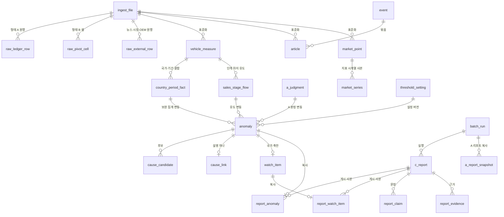
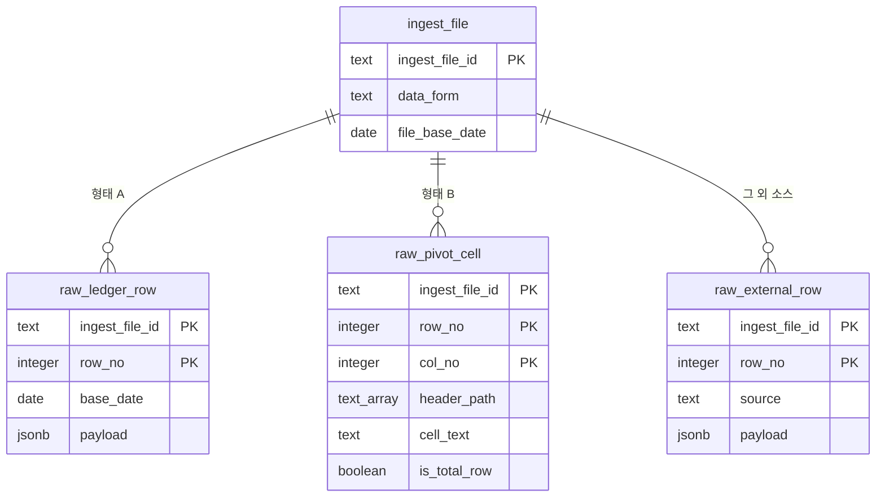
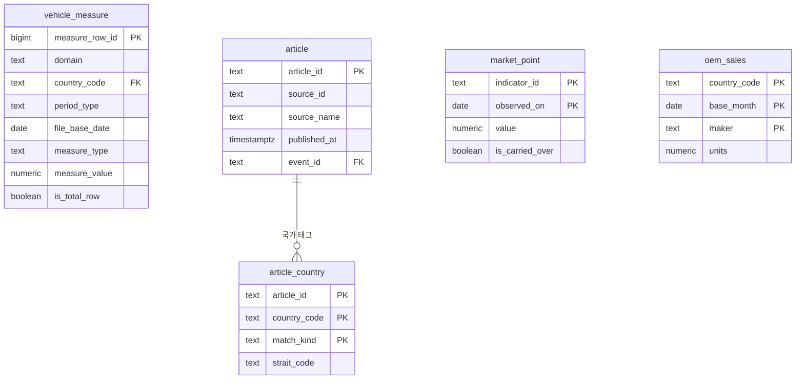
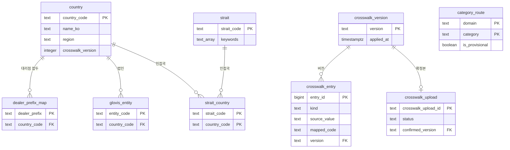
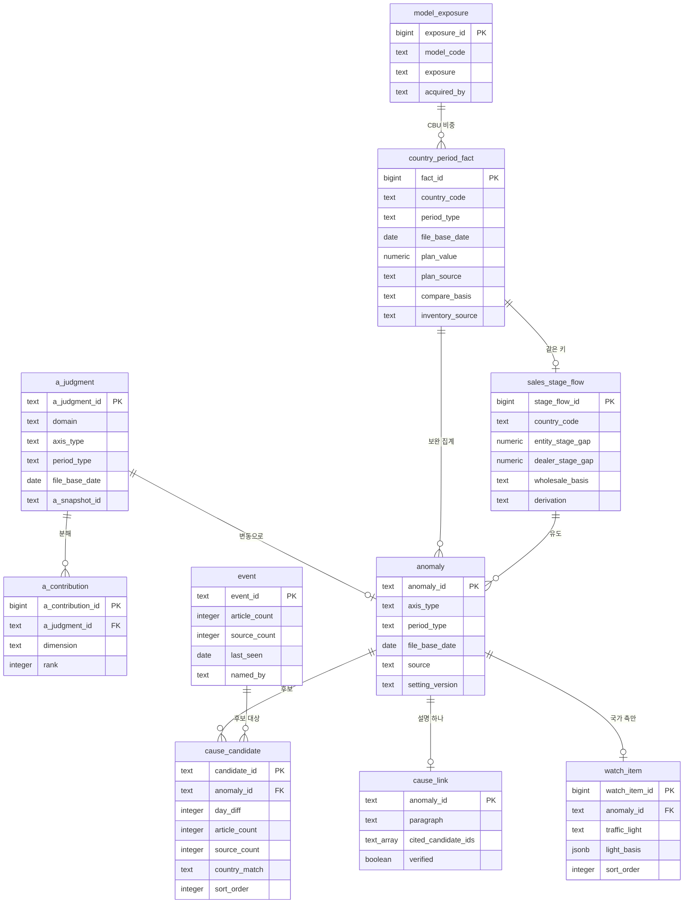
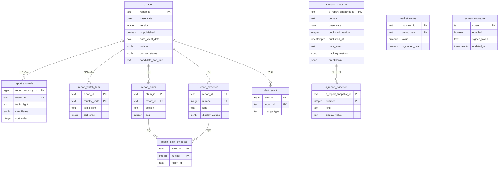
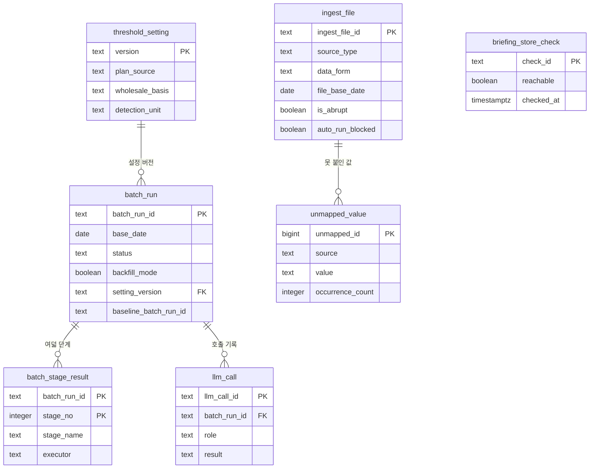

# ERD·데이터 사전

## 0. 이 문서가 다루는 것

[[TBL-DOM-004]]가 정한 개념 24개와 [[TBL-DOM-005]]가 정한 엔티티 클래스 24개가 실제로 어느 테이블에 앉는지를 정한다. 스키마 여섯, 테이블 마흔둘, 그 컬럼과 타입과 널 허용, 그리고 조회 패턴별 인덱스를 적는다.

테이블은 두 종류다. 엔티티 테이블 24개는 [[TBL-DOM-005]] 2장의 `테이블:` 줄이 가리키는 것이고 각 항목에 `클래스:` 줄로 되돌아간다. 보조 테이블 18개는 원본 보관, 다대다 연결, 게시 사본, 운영 기록이며 클래스가 없다. 보조 테이블은 어느 설계 클래스가 쓰는지를 본문에 적는다.

여기서 정하지 않는 것이 셋이다. 첫째, 개념의 뜻은 [[TBL-DOM-004]]가 정했고 이 문서는 그것을 컬럼으로 펼치기만 한다. 둘째, 어느 클래스가 어느 테이블에 쓰는지는 [[TBL-DOM-005]] 2장의 대응표가 정본이다. 셋째, 파티셔닝과 보관 기간은 실데이터 행수가 확정되기 전까지 미결이다(6장).

이 문서가 지키는 계약은 넷이다.

1. 시간 축은 칸 두 개다. 단일 기준일 컬럼을 두지 않는다. 기간 구분(`period_type`)과 파일 기준일(`file_base_date`)을 함께 둔다([[TBL-INFRA-002#C15]] [[TBL-API-002]] 1.4절).
2. 등급·점수 컬럼을 두지 않는다. `score` `grade` `rank` `relevance` `confidence`와 그 변형을 어느 테이블에도 두지 않는다([[TBL-PRD-002#R10]] [[TBL-API-002]] 1.3절). 허용하는 순서 컬럼은 `sort_order` 하나이고 정렬 규칙이 낳은 자리 번호다.
3. 모든 산출 행이 기준일과 배치 실행 ID를 가진다. 여기에 설정 버전과 A 판정 스냅샷 ID가 더해져 재현이 성립한다([[TBL-INFRA-002#C11]]).
4. 열람은 게시 스키마만 읽는다. `pub` 밖의 테이블은 열람 계정이 보지 못한다([[TBL-INFRA-002#C10]]). 그래서 게시 시점에 표시값을 복사하고, 인덱스 설계도 `pub`에 집중한다. A 리포트 지면도 예외가 아니다. 브리핑 갈래가 게시한 A 리포트를 문장까지 통째로 받아 [[#a_report_snapshot]]에 사본으로 두고 화면은 그 사본만 읽는다.

### 0.1 스키마와 표기 규약

PostgreSQL 16 한 대에 스키마로 나눈다([[TBL-INFRA-002]] 6장).

| 스키마 | 무엇 | 테이블 수 | 쓰는 쪽 | 읽는 쪽 |
|:--|:--|--:|:--|:--|
| `raw` | 받은 파일을 행 그대로. 형태 A는 원장 행, 형태 B는 펼치기 전 셀 | 3 | worker·web | worker |
| `std` | 표준화한 완성차 긴 형태, 기사, 시장지표, OEM 판매 | 5 | worker·web | worker |
| `master` | 크로스워크 이관본과 버전, 뉴스 카테고리 도메인 배정 | 9 | worker·web | worker·web |
| `mart` | A 판정 사본·결합·변동·후보·근접도·신호등·연관 설명 | 10 | worker | worker |
| `pub` | 게시된 C 리포트와 근거, A 리포트 게시 사본, 지표 시계열 사본, 열람 화면의 서명 주소 | 11 | worker·web(게시 전환·열람 주소) | web |
| `ops` | 적재·배치 이력, LLM 호출, 설정, 미매핑, 저장소 접속 확인 | 7 | worker·web | worker·web |

계정 분리는 [[TBL-INFRA-002]] 5장을 따른다. `web`은 `pub` 읽기와 `raw`·`std`·`master`·`ops` 쓰기(수동 적재·크로스워크·배치 요청)를 가지고, 게시 전환에 쓰는 `pub` 칸(`c_report`의 게시 여부와 게시 시각, `alert_event`, `report_watch_item`·`report_anomaly`의 배지)과 열람 주소([[#screen_exposure]]) 쓰기를 더 가진다. `mart`는 읽지 않는다([[TBL-INFRA-002#C10]]). 재실행 비교 표도 worker가 계산해 `ops`에 둔다. `worker`가 전 스키마에 쓴다.

시간 두 칸. 아래 테이블은 `period_type`과 `file_base_date`를 반드시 함께 가진다. 하나만 두면 일 단위 값과 누계 값이 같은 컬럼에 섞여 구분되지 않는다. [[#vehicle_measure]] [[#a_judgment]] [[#country_period_fact]] [[#sales_stage_flow]] [[#model_exposure]] [[#anomaly]] 여섯이다. `period_type`은 `day` `month` `cumulative` `year` 넷이다. 형태 A(IF 원장)로 들어온 행은 `period_type = 'day'`이고 `file_base_date`가 그 행의 기준일자와 같다. 형태 B(피벗 리포트)는 헤더에서 온 기간 구분과 파일이 붙여 준 날이다.

축 두 칸. [[#a_judgment]]와 [[#anomaly]]는 `axis_type`(`country`·`plant`)과 `country_code`·`plant_code`를 가진다. `axis_type = 'plant'`인 행은 [[#watch_item]]과 국가 카드에 오르지 않는다([[TBL-INFRA-002#C16]]).

재현 두 칸. `mart`와 `pub`의 모든 행이 `base_date`(리포트가 서 있는 날)와 `batch_run_id`(계산한 실행)를 가진다. 여기에 판정 행은 `setting_version`을, A 판정에서 온 행은 `a_snapshot_id`를 더한다. 시점이 셋이라는 것에 주의한다. 데이터가 말하는 시점은 `file_base_date`, 리포트가 서 있는 시점은 `base_date`, 계산한 시점은 `batch_run_id`가 가리키는 실행 시각이다. 셋이 전부 다를 수 있다.

| 항목 | 규약 |
|:--|:--|
| 테이블·컬럼 이름 | 소문자 스네이크. 약어를 쓰지 않는다. 엔티티 테이블의 컬럼 이름은 [[TBL-DOM-005]] 2장의 속성 이름을 그대로 쓴다 |
| 널 허용 표기 | 아래 표의 `널` 칸. `N`은 NOT NULL, `Y`는 NULL 허용 |
| 식별자 타입 | API가 문자열로 내보내는 것은 `text`(ULID). 밖으로 나가지 않는 대용량 행은 `bigserial`. 클래스 명세의 `int id`는 이 둘 중 하나로 내려간다 |
| 수치 | 대수는 `numeric(18,3)`, 비율은 `numeric(10,6)`. `double precision`을 쓰지 않는다 |
| 날짜 | 날짜만이면 `date`, 시각이 필요하면 `timestamptz` |
| 열거 | `text` + `CHECK` 제약. PostgreSQL `enum` 타입을 쓰지 않는다. 값은 [[TBL-API-002]]의 열거 값을 그대로 쓴다. 응답으로 나가는 값과 저장하는 값을 다르게 두지 않는다 |
| 결측 | `NULL`. `-` 같은 표기를 0으로 바꾸지 않는다 |
| 가변 배열 | `text[]` 또는 `integer[]`. 구조가 있으면 `jsonb`. 클래스 명세의 `json` 속성은 조회 조건이 되면 테이블로 펼치고 통째로 읽기만 하면 `jsonb`로 둔다 |

열거를 `enum` 타입으로 만들지 않는 이유. 값이 늘 때마다 `ALTER TYPE`이 필요하고 폐쇄망에서 마이그레이션 한 번이 반입 절차 한 번이다. `CHECK` 제약이면 같은 보장을 마이그레이션 없이 고칠 수 있다. 결측을 0으로 바꾸지 않는 이유. 계획이 없는 것과 계획이 0인 것은 다르다. 0으로 채우면 계획 대비 달성률이 무한대가 되거나 0%로 찍힌다([[TBL-DOM-005#RecordStandardizer]]). `double precision`을 쓰지 않는 이유. 재현성이다. 같은 입력이면 같은 변동이 나와야 하는데([[TBL-INFRA-002#C11]]) 부동소수 누적 오차는 집계 순서에 따라 마지막 자리가 달라진다.

`json` 속성을 펼친 것과 둔 것. 펼친 것은 [[TBL-DOM-005#Article]]의 `country_tags`([[#article_country]]), [[TBL-DOM-005#Strait]]의 `adjacent_country_codes`([[#strait_country]]), [[TBL-DOM-005#DomainReport]]의 `evidence_list`([[#a_report_evidence]]), [[TBL-DOM-005#BatchRun]]의 `stage_results`([[#batch_stage_result]]), [[TBL-DOM-005#Claim]]의 `footnote_numbers`(배열로 두고 역방향은 [[#report_claim_evidence]]) 다섯이다. 전부 조회 조건이 되는 것이다. 둔 것은 `notices` `domain_status` `metric_bar` `market_asof` `quality_flags` `light_basis` `abrupt_reasons` `period_types` `measure_types` `breakdown_summary`이며 통째로 읽고 쓰기만 한다.

## 1. ERD

### 1.1 스키마 사이

파일이 왼쪽에서 들어와 오른쪽 게시본으로 나간다. 스키마 경계를 넘는 선만 그렸다.

`mart`에서 `pub`으로 가는 선 둘이 게시다. 값을 참조로 남기지 않고 복사한다. 열람이 `pub` 밖을 보지 못하기 때문이다([[TBL-INFRA-002#C10]]). `a_judgment`에서 `anomaly`로 가는 선이 A 판정이 C 생성에 닿는 유일한 통로다. A가 쓴 문장은 이 선을 건너오지 않는다. A 리포트 문장은 따로 [[#a_report_snapshot]]에 게시 사본으로 들어온다. 그 사본은 열람 경로 전용이고 C 서술은 여전히 판정만 읽는다.

### 1.2 raw 스키마

형태 A는 행이 단위라 원행 하나가 한 줄이고, 형태 B는 병합 헤더 때문에 셀이 단위다. 펼치기 전 상태를 셀로 남겨야 펼치기가 어긋났을 때 원본과 대조할 수 있다([[TBL-DOM-005#FormBPivotParser]]).

### 1.3 std 스키마

완성차 표준 테이블은 긴 형태 하나다. 형태 A와 형태 B가 같은 테이블로 들어가고, 형태 B의 병합 헤더 한 칸이 (기간 구분, 지표 종류) 한 쌍으로 펼쳐져 원본 한 행이 지표 종류 수만큼의 행으로 늘어난다([[TBL-INFRA-002]] 6.1절). 표준 테이블은 엔티티가 아니다. [[TBL-DOM-004]]의 [[TBL-DOM-004#CountryPeriodFact]]와 [[TBL-DOM-004#SalesStageFlow]]가 이 테이블에서 만들어지는 산출물이고, 표준 행 자체는 [[TBL-DOM-005#RecordStandardizer]]가 쓰는 원재료다.

### 1.4 master 스키마

### 1.5 mart 스키마

`cause_link`의 기본키가 `anomaly_id`라는 것이 이 그림의 계약이다. 연관 설명은 변동마다 하나다. 후보마다 등급을 매기던 구조가 사라진 자리이고, 설명은 후보 여럿을 `cited_candidate_ids`로 인용한다([[TBL-DOM-004#CauseLink]]).

### 1.6 pub 스키마

`report_anomaly`가 후보 목록을 `jsonb`로 안고 있는 것이 이 스키마의 절충이다. 이유는 3.1절에 적었다. [[#a_report_snapshot]]과 [[#a_report_evidence]]는 C 리포트에 매달리지 않는다. A 리포트는 도메인과 기준일과 버전으로 서고 C와 다른 주기로 게시되기 때문이다. [[#market_series]]도 지표별 시계열 한 벌이라 리포트에 매달리지 않는다. [[#screen_exposure]]는 열람 화면 넷의 서명 주소 한 벌이고 리포트와 무관하다.

### 1.7 ops 스키마

## 2. DD (데이터 사전)

컬럼 표의 `널` 칸은 `N`이 NOT NULL, `Y`가 NULL 허용이다. 각 표 아래 한 줄에 기본키와 유일 제약을 적는다. 엔티티 테이블은 `클래스:` 줄이 있고 보조 테이블은 `클래스: 없음`이다.

### 2.1 raw 스키마

받은 파일을 손대지 않고 그대로 남기는 자리다. 여기 값을 판정에 쓰지 않는다. 펼치기나 표준화가 어긋났을 때 원본과 대조하는 것이 유일한 용도다.

#### raw_ledger_row 형태 A 원장 원행

클래스: 없음 (보조 테이블. [[TBL-DOM-005#IngestService]]의 `store_original`이 쓴다)

스키마 `raw`. IF 원장(생산 16열, 판매·재고 22열)의 한 행을 그대로 담는다. 열 구성은 현대차 전송 데이터 항목(IF 레이아웃)과 실물 원장(현대차 데이터_0910.xlsx)이 같다. 레이아웃 파일의 `→ 측정값(실적)` 칸은 구분 표시라 열 수에 넣지 않는다.

| 컬럼 | 타입 | 널 | 설명 |
|:--|:--|:--|:--|
| `ingest_file_id` | text | N | 어느 적재 건인가. [[#ingest_file]] |
| `row_no` | integer | N | 파일 안 행 번호. 1부터 |
| `base_date` | date | Y | 행의 기준일자. 형태 A는 값이 있고, 없으면 형태 판별이 애초에 실패한다 |
| `payload` | jsonb | N | 헤더명을 키로 한 원문 그대로. 숫자도 문자열로 둔다 |
| `loaded_at` | timestamptz | N | 적재 시각 |

기본키 `(ingest_file_id, row_no)`.

#### raw_pivot_cell 형태 B 셀 원본

클래스: 없음 (보조 테이블. [[TBL-DOM-005#IngestService]]의 `store_original`이 쓴다)

스키마 `raw`. 피벗 리포트를 펼치기 전 상태로 셀 단위로 담는다.

| 컬럼 | 타입 | 널 | 설명 |
|:--|:--|:--|:--|
| `ingest_file_id` | text | N | [[#ingest_file]] |
| `row_no` | integer | N | 데이터 행 번호. 헤더 줄은 포함하지 않는다 |
| `col_no` | integer | N | 컬럼 번호. 1부터 |
| `header_path` | text[] | N | 병합 헤더 2~3줄을 위에서부터 이어 붙인 것. 펼치기 전 상태 그대로 |
| `cell_text` | text | Y | 원문 그대로. `-` 같은 결측 표기도 그대로 둔다 |
| `is_total_row` | boolean | N | 총계 행이면 참. 총계 행은 상세 행과 범위가 다를 수 있어 함께 집계하지 않는다 |

기본키 `(ingest_file_id, row_no, col_no)`.

행이 아니라 셀이 단위인 이유. 병합 헤더를 잘못 펴면 값이 엉뚱한 기간과 지표 종류에 붙는데, 그 결과가 숫자로는 멀쩡해 보인다([[TBL-DOM-005#FormBPivotParser]]). 펼친 뒤 값만 남기면 어긋난 것을 되짚을 방법이 없다. `header_path`를 배열로 남기면 `(기간 구분, 지표 종류)`로 푼 결과와 원문을 한 줄씩 대조할 수 있다.

#### raw_external_row 뉴스·시장·OEM 원행

클래스: 없음 (보조 테이블. [[TBL-DOM-005#IngestService]]의 `store_original`이 쓴다)

스키마 `raw`. 뉴스·블룸버그·Marklines·크로스워크 파일의 원행이다.

| 컬럼 | 타입 | 널 | 설명 |
|:--|:--|:--|:--|
| `ingest_file_id` | text | N | [[#ingest_file]] |
| `row_no` | integer | N | 파일 안 행 번호 |
| `source` | text | N | `news` `bloomberg` `marklines` `crosswalk` |
| `schema_version` | text | Y | 뉴스는 가공본·원본 두 벌이라 반드시 채운다 |
| `payload` | jsonb | N | 헤더명을 키로 한 원문 그대로 |
| `loaded_at` | timestamptz | N | |

기본키 `(ingest_file_id, row_no)`.

### 2.2 std 스키마

#### vehicle_measure 완성차 표준 측정 행

클래스: 없음 (보조 테이블. [[TBL-DOM-005#RecordStandardizer]]가 쓰고 [[TBL-DOM-005#FactJoiner]]와 [[TBL-DOM-005#StageFlowCalculator]]가 읽는다)

스키마 `std`. 형태 A와 형태 B가 만나는 유일한 테이블이다. 차원 조합 하나와 기간 구분 하나와 지표 종류 하나가 값 하나를 가리키는 긴 형태다.

| 컬럼 | 타입 | 널 | 설명 |
|:--|:--|:--|:--|
| `measure_row_id` | bigserial | N | 내부 식별자. 밖으로 나가지 않는다 |
| `domain` | text | N | `production` `inventory` `sales` |
| `country_code` | text | Y | 생산 행은 항상 NULL이다. 목적지 국가가 데이터에 없다 |
| `region_code` | text | Y | 대권역 |
| `sales_entity_code` | text | Y | 판매 법인 |
| `dealer_code` | text | Y | 대리점 코드. 앞 세 자리가 국가를 가리킨다 |
| `production_entity_code` | text | Y | 생산 법인. 28개 |
| `plant_region` | text | Y | 공장지역. 18개 |
| `model_group_code` | text | Y | 차종 그룹. 감지 단위의 기본값 |
| `model_detail_code` | text | Y | 세부 차종. 분해에만 쓴다 |
| `segment_code` | text | Y | 차급 |
| `cbu_ckd` | text | Y | `CBU` `CKD`. 판매 형태 B에는 컬럼이 그대로 있다 |
| `domestic_export` | text | Y | 내수·수출 |
| `domestic_overseas` | text | Y | 국내·해외 |
| `powertrain_code` | text | Y | 저장은 하되 분해 차원에서 뺀다. 44~53%가 미분류다 |
| `extra_dimensions` | jsonb | Y | 그 파일에만 있는 축. 세부지역, 제네시스, N시리즈 등 |
| `period_type` | text | N | `day` `month` `cumulative` `year` |
| `file_base_date` | date | N | 형태 A는 행의 기준일자, 형태 B는 파일이 붙여 준 날 |
| `measure_type` | text | N | 아래 기본 아홉과 그 확장 중 하나 |
| `measure_value` | numeric(18,3) | Y | 결측은 NULL. 0으로 바꾸지 않는다 |
| `is_total_row` | boolean | N | 총계 행이면 참. 판정 대상에서 뺀다 |
| `data_form` | text | N | `A` `B` |
| `schema_version` | text | Y | |
| `ingest_file_id` | text | N | [[#ingest_file]] |
| `source_row_no` | integer | N | 원행 번호. `raw`로 되짚는 열쇠 |

기본키 `measure_row_id`. 유일 제약 `(ingest_file_id, source_row_no, measure_type, period_type)`.

`measure_type` 기본 아홉. `operationPlan`(운영계획) `businessPlan`(사업계획) `actual`(실적) `progressRate`(진도율) `yoyRate`(전년대비) `shipment`(선적) `actualWholesale`(실 도매) `officialWholesale`(도매(공식)) `retail`(소매). 확장 둘. 판매 계열(선적·실 도매·도매(공식)·소매)의 계획·진도율·전년대비는 계열 이름을 앞에 붙이고(예 `shipmentBusinessPlan` `retailYoyRate`) 진도율은 기준 계획을 뒤에 붙인다(예 `progressRateBusinessPlan`). 한 원행이 계열마다 계획을 하나씩 가져 유일 제약을 지키려면 이름이 갈려야 한다. 형태 A 원장의 재고 네 열은 `inventoryEntity` `inventoryDealer` `inventoryInTransit` `inventoryAwaiting`으로 저장하되 판정에는 아직 쓰지 않는다(재고 원천 결정 대기). 계획 두 종류와 도매 두 기준을 둘 다 저장한다([[TBL-INFRA-002#C18]]). 어느 쪽을 계산에 쓸지는 [[#threshold_setting]]이 고른다.

넓은 형태로 두지 않은 이유. 기간 블록이나 지표 종류가 늘 때마다 컬럼이 늘고 하류 조회가 전부 바뀐다. 컬럼 구성이 다른 형태 A와 같은 테이블에 들어가지도 못한다([[TBL-INFRA-002]] 6.1절).

`progressRate`를 저장하되 믿지 않는다. 인입 샘플에서 생산 진도율은 총계 행에만 값이 있고 개별 행은 전부 0이다([[TBL-RFQ-002]] 4.2절). 계획 대비는 `actual`과 계획 정본으로 직접 계산한다([[TBL-DOM-005#AnomalyDetector]]).

총계 행은 같은 테이블에 두되 `is_total_row`로 가른다. 판매 샘플에서 상세 행 합 선적 679,551인데 총계 행은 1,710,715으로 약 2.5배였다. 집계 조회는 전부 `WHERE NOT is_total_row`이고 총계 행은 상세 행 합과 대조하는 데만 쓴다([[TBL-PRD-002#N8]]).

생산 행의 `country_code`가 NULL인 것이 이 문서에서 가장 멀리 퍼지는 사실이다. [[#country_period_fact]]에 생산 행이 생기지 않고, 원인 후보가 붙지 않고, [[#watch_item]]에 오르지 않는다([[TBL-INFRA-002#C16]]).

#### article 기사

클래스: [[TBL-DOM-005#Article]]

스키마 `std`.

| 컬럼 | 타입 | 널 | 설명 |
|:--|:--|:--|:--|
| `article_id` | text | N | 내부 식별자 |
| `source_id` | text | N | 원본 식별자를 그대로. 중복 제거 키다 |
| `schema_version` | text | N | 가공본·원본 구분 |
| `title` | text | N | |
| `summary` | text | Y | |
| `source_name` | text | N | 매체 이름. 사건별 출처 수를 세는 근거다 |
| `published_at` | timestamptz | N | |
| `time_precision` | text | N | `exact` `day`. 날짜만 온 기사를 시각으로 속이지 않는다 |
| `url` | text | Y | 원문 주소. 사용자의 브라우저가 연다 |
| `category` | text | Y | |
| `impact` | numeric(10,6) | Y | 기사에 붙어 온 영향도. 우리가 매기지 않는다 |
| `event_id` | text | Y | [[#event]]. 3단계 사건 묶음이 채운다. 국가 태그가 없는 기사는 NULL로 남는다 |
| `ingest_file_id` | text | N | [[#ingest_file]] |

기본키 `article_id`. 유일 제약 `(source_id, schema_version)`.

클래스 속성 `country_tags`는 [[#article_country]]로 펼쳤다. 국가로 기사를 찾는 것이 후보 검색의 첫 조회라 배열 컬럼으로는 인덱스를 걸 수 없다. 기사가 사건 하나에만 속하므로 `event_id`를 이 테이블에 두고 별도 연결 테이블을 두지 않는다.

#### article_country 기사 국가 태그

클래스: 없음 (보조 테이블. [[TBL-DOM-005#RecordStandardizer]]가 쓰고 [[TBL-DOM-005#EventClusterer]]와 [[TBL-DOM-005#CandidateSearcher]]가 읽는다)

스키마 `std`. 기사 하나가 국가 여럿에 걸린다.

| 컬럼 | 타입 | 널 | 설명 |
|:--|:--|:--|:--|
| `article_id` | text | N | [[#article]] |
| `country_code` | text | N | [[#country]] |
| `match_kind` | text | N | `countryDirect` 또는 `straitAttributed` |
| `strait_code` | text | Y | `match_kind`가 `straitAttributed`일 때만 채운다 |

기본키 `(article_id, country_code, match_kind)`.

해협 귀속을 같은 테이블에 두고 `match_kind`로 가르는 이유. 호르무즈 기사가 오만·아랍에미리트에 붙지 않으면 중동 변동의 후보가 비어 버린다([[TBL-DOM-004#Strait]]). 그렇다고 직접 걸린 기사와 섞어 버리면 근접도의 `country_match` 값을 만들 수 없다. 한 테이블에 두고 칸으로 갈라야 [[#cause_candidate]]가 그 사실을 그대로 옮긴다.

#### market_point 시장지표 관측값

클래스: [[TBL-DOM-005#MarketPoint]]

스키마 `std`.

| 컬럼 | 타입 | 널 | 설명 |
|:--|:--|:--|:--|
| `indicator_id` | text | N | `GPR` `BRENT` `BDI` `SCFI` |
| `observed_on` | date | N | 관측일. 이 지표는 날짜가 행에 붙어 온다 |
| `name` | text | N | 표시 이름 |
| `value` | numeric(18,6) | N | 이월이어도 비우지 않는다 |
| `change_rate` | numeric(10,6) | Y | 전일 대비 |
| `on_metric_bar` | boolean | N | 리포트 상단 지표 바에 싣는가 |
| `is_carried_over` | boolean | N | 관측이 없어 직전 값을 이월한 행인가 |
| `source_observed_on` | date | Y | 이월이면 값이 실제로 관측된 날 |
| `ingest_file_id` | text | N | |

기본키 `(indicator_id, observed_on)`.

기간 구분 칸이 없는 것이 완성차 테이블과 다른 점이다. 이 값은 날짜가 행에 있어 두 칸이 필요 없다. 완성차 쪽이 기간 단위일 때는 그 기간의 마지막 날 기준 as-of 값을 붙인다([[TBL-DOM-005#FactJoiner]]). 이월이어도 `value`를 비우지 않고 `is_carried_over`를 세운다([[TBL-PRD-002#R27]]).

#### oem_sales 해외 OEM 월 판매

클래스: [[TBL-DOM-005#OemSales]]

스키마 `std`. 현재 표본이 2019년 두 나라뿐이라 판정에 쓰지 않는다. 자리만 만든다.

| 컬럼 | 타입 | 널 | 설명 |
|:--|:--|:--|:--|
| `country_code` | text | N | |
| `base_month` | date | N | 그 달의 1일 |
| `maker` | text | N | 제조사 |
| `units` | numeric(18,3) | N | 판매량 |
| `ingested_on` | date | N | |
| `ingest_file_id` | text | N | |

기본키 `(country_code, base_month, maker)`.

### 2.3 master 스키마

#### country 국가

클래스: [[TBL-DOM-005#Country]]

스키마 `master`. 모든 결합의 축이다.

| 컬럼 | 타입 | 널 | 설명 |
|:--|:--|:--|:--|
| `country_code` | text | N | 세 자리. 실측 예 `B28`(미국) `B06`(캐나다) `B07`(칠레) |
| `name_ko` | text | N | |
| `name_en` | text | Y | |
| `region` | text | Y | 대권역 |
| `subregion` | text | Y | 권역 |
| `is_active` | boolean | N | |
| `crosswalk_version` | text | N | 이 행을 넣은 [[#crosswalk_version]] |

기본키 `country_code`.

클래스 속성 `dealer_prefix`는 [[#dealer_prefix_map]]으로 뺐다. 한 국가에 접두가 둘 이상 붙을 수 있어서다. `country`가 179개국을 담아도 [[#country_period_fact]]에 행이 생기는 국가는 현재 미주뿐이다. 이 차이를 숨기지 않고 화면에 적는다([[TBL-DOM-004]] 4.1절).

#### dealer_prefix_map 대리점 접두 매핑

클래스: 없음 (보조 테이블. [[TBL-DOM-005#MasterService]]가 쓰고 [[TBL-DOM-005#RecordStandardizer]]의 `map_country`가 읽는다)

스키마 `master`. 대리점 코드 앞 세 자리로 국가를 찾는다.

| 컬럼 | 타입 | 널 | 설명 |
|:--|:--|:--|:--|
| `dealer_prefix` | text | N | 세 자리 |
| `country_code` | text | N | [[#country]] |
| `note` | text | Y | |

기본키 `dealer_prefix`.

국가 코드와 따로 둔 이유. 인입 샘플에서는 접두가 국가 코드와 같았지만(미국 `B28AB`, 캐나다 `B06AA`) 한 국가에 접두가 둘 이상 붙을 수 있고, 같다는 것이 규칙으로 보장된 적은 없다. 테이블을 따로 두면 어긋나는 날 한 줄 추가로 끝난다([[TBL-PRD-002#R4]]).

#### crosswalk_entry 크로스워크 항목

클래스: 없음 (보조 테이블. [[TBL-DOM-005#MasterService]]의 `confirm_crosswalk`가 쓴다)

스키마 `master`. 국가·차종·법인 매핑 이관본이다.

| 컬럼 | 타입 | 널 | 설명 |
|:--|:--|:--|:--|
| `entry_id` | bigserial | N | |
| `kind` | text | N | `modelGroup` `modelDetail` `plant` `salesEntity` `newsCountry` `segment` |
| `source_value` | text | N | 원본 파일에 있던 값 그대로 |
| `mapped_code` | text | N | 표준 코드 |
| `mapped_name` | text | Y | |
| `version` | text | N | [[#crosswalk_version]] |

기본키 `entry_id`. 유일 제약 `(kind, source_value, version)`.

#### crosswalk_version 마스터 버전

클래스: 없음 (보조 테이블. [[TBL-DOM-005#MasterService]]가 쓴다)

스키마 `master`.

| 컬럼 | 타입 | 널 | 설명 |
|:--|:--|:--|:--|
| `version` | text | N | |
| `applied_at` | timestamptz | N | |
| `applied_by` | text | N | 확정한 사람 |
| `change_count` | integer | N | 추가·변경·삭제 합 |
| `note` | text | Y | |

기본키 `version`.

매핑이 바뀌면 과거 판정이 달라지므로 재생성으로만 반영하고 게시본을 덮어쓰지 않는다([[TBL-INFRA-002#C18]]).

#### crosswalk_upload 크로스워크 업로드

클래스: 없음 (보조 테이블. [[TBL-DOM-005#MasterService]]의 `upload_crosswalk`가 쓴다)

스키마 `master`. 올린 시트를 미리 보는 단계이고 아직 마스터를 바꾸지 않는다.

| 컬럼 | 타입 | 널 | 설명 |
|:--|:--|:--|:--|
| `crosswalk_upload_id` | text | N | [[TBL-API-002#POST/api/admin/master/confirm/{crosswalkUploadId}]]에 넘기는 값 |
| `uploaded_at` | timestamptz | N | |
| `uploaded_by` | text | N | |
| `file_path` | text | N | 원본 보관 경로 |
| `added_count` | integer | N | |
| `changed_count` | integer | N | |
| `removed_count` | integer | N | |
| `will_become_unmapped` | integer | N | 이 확정으로 미매핑이 될 값의 건수 |
| `status` | text | N | `previewed` `confirmed` `discarded` |
| `confirmed_version` | text | Y | 확정됐으면 [[#crosswalk_version]] |

기본키 `crosswalk_upload_id`.

#### strait 해협

클래스: [[TBL-DOM-005#Strait]]

스키마 `master`.

| 컬럼 | 타입 | 널 | 설명 |
|:--|:--|:--|:--|
| `strait_code` | text | N | |
| `name` | text | N | |
| `keywords` | text[] | N | 기사에서 이 해협을 찾는 말들 |

기본키 `strait_code`.

클래스 속성 `adjacent_country_codes`는 [[#strait_country]]로 펼쳤다.

#### strait_country 해협 인접국

클래스: 없음 (보조 테이블. [[TBL-DOM-005#MasterService]]가 쓰고 [[TBL-DOM-005#CandidateSearcher]]가 읽는다)

스키마 `master`.

| 컬럼 | 타입 | 널 | 설명 |
|:--|:--|:--|:--|
| `strait_code` | text | N | [[#strait]] |
| `country_code` | text | N | [[#country]] |

기본키 `(strait_code, country_code)`.

배열 컬럼이 아니라 테이블로 둔 이유는 후보 검색이 국가에서 해협으로 거꾸로 들어오기 때문이다. 배열이면 국가로 거는 인덱스를 만들 수 없다.

#### glovis_entity 글로비스 법인

클래스: [[TBL-DOM-005#GlovisEntity]]

스키마 `master`. 발주자에게 받아야 채워진다. 빈 동안에는 법인 미매핑으로 표시하고 오류로 보지 않는다([[TBL-PRD-002#R17]]).

| 컬럼 | 타입 | 널 | 설명 |
|:--|:--|:--|:--|
| `entity_code` | text | N | |
| `country_code` | text | N | [[#country]] |
| `entity_name` | text | N | |

기본키 `entity_code`.

행이 없는 것이 곧 미매핑이다. 별도 플래그를 두지 않는다.

#### category_route 뉴스 카테고리 도메인 배정

클래스: 없음 (보조 테이블. [[TBL-DOM-005#MasterService]]가 쓰고 [[TBL-DOM-005#CandidateSearcher]]가 읽는다)

스키마 `master`. 도메인 변동에 원인 후보로 붙일 수 있는 뉴스 카테고리다. 자사 크로스워크 08 시트(도메인·카테고리 라우팅)의 이관본이며, 크로스워크 시트 `category_route`로 올리면 통째 바뀐다([[TBL-PRD-002#R4]] [[TBL-PRD-002#R5]]).

| 컬럼 | 타입 | 널 | 설명 |
|:--|:--|:--|:--|
| `domain` | text | N | `production` `inventory` `sales` |
| `category` | text | N | 사내 뉴스 카테고리 코드. 원본의 FWD·KD는 적재 때 가공본 코드 FWD/KD로 합친다 |
| `is_provisional` | boolean | N | 발주처 확인 전 임시 배정인가 |
| `note` | text | Y | 배정 근거 |

기본키 `(domain, category)`.

초기 행은 자사 08 시트의 배정 아홉에 FVL 임시 배정 둘을 더한 열한 줄이다(유저 결정 2026-09-30, #27 재결정). 첫 마이그레이션이 넣는다. FVL(완성차 물류)은 08 시트에 없어 판매·재고에 임시로 둔다. 발주처 회신이 오면 크로스워크 시트로 바꾼다.

| `domain` | `category` | `is_provisional` | `note` |
|:--|:--|:--|:--|
| `production` | `OEM` | `false` | 08 시트 |
| `production` | `FWD/KD` | `false` | 08 시트 |
| `sales` | `MRT` | `false` | 08 시트 |
| `sales` | `GEO` | `false` | 08 시트 |
| `sales` | `ENR` | `false` | 08 시트 |
| `sales` | `NDS` | `false` | 08 시트 |
| `sales` | `REG` | `false` | 08 시트 |
| `sales` | `FVL` | `true` | 임시. 완성차 물류 |
| `inventory` | `MRT` | `false` | 08 시트 |
| `inventory` | `FWD/KD` | `false` | 08 시트 |
| `inventory` | `FVL` | `true` | 임시. 완성차 물류 |

카테고리를 걸러 쓰는 이유. 같은 나라의 뉴스라도 도메인과 무관한 카테고리가 후보로 붙으면 신호등 근거가 부풀려진다. 배정 밖 카테고리와 카테고리가 없는 사건은 후보가 되지 않는다([[TBL-DOM-005#CandidateSearcher]]). 생산 변동은 국가 축이 없어 지금은 후보 검색 대상이 아니므로 생산 두 줄은 목적지 국가가 들어올 때를 위한 것이다([[TBL-INFRA-002#C16]]).

### 2.4 mart 스키마

판정이 사는 자리다. 1~5단계가 여기까지 채우면 화면에 나갈 값이 전부 확정된다([[TBL-INFRA-002#C19]]).

#### a_judgment A 판정

클래스: [[TBL-DOM-005#DomainJudgment]]

스키마 `mart`. 브리핑 갈래 저장소의 뷰 `tbl_a_judgment`에서 읽어 복사한 A 판정이다. 브리핑 갈래가 국가·공장 축 판정을 만들 때만 행이 생기고, 그 전에는 비어 있어 보완 집계가 대신한다(유저 결정 2026-10-01). 값을 다시 계산하지 않고 그대로 받는다([[TBL-DOM-005#AJudgmentReader]]). 판정 사본이고 문장 컬럼을 두지 않는다. A가 쓴 요약·해설·고정 문구는 이 테이블에 들어오지 않는다. C 생성이 읽는 것은 이 테이블과 [[#a_contribution]]뿐이다.

| 컬럼 | 타입 | 널 | 설명 |
|:--|:--|:--|:--|
| `a_judgment_id` | text | N | |
| `domain` | text | N | `production` `inventory` `sales` |
| `dashboard_id` | text | Y | 태블로 대시보드 식별자 |
| `axis_type` | text | N | `country` `plant` |
| `country_code` | text | Y | `axis_type`이 `country`일 때 |
| `plant_code` | text | Y | `axis_type`이 `plant`일 때 |
| `metric` | text | N | |
| `period_type` | text | N | `day` `month` `cumulative` `year` |
| `file_base_date` | date | N | |
| `current_value` | numeric(18,3) | N | 당기 값 |
| `compare_value` | numeric(18,3) | Y | 비교 값 |
| `compare_basis` | text | N | `plan` `yoy` `mom` |
| `compare_period` | text | Y | 비교 값이 어느 기간인가 |
| `detection_unit` | text | N | `modelGroup` `modelDetail` |
| `is_anomaly` | boolean | N | 변동으로 판정됐는가 |
| `change_rate` | numeric(10,6) | Y | |
| `data_form` | text | Y | 그 리포트가 읽은 데이터 형태 |
| `a_snapshot_id` | text | N | 재현의 열쇠. 브리핑 갈래 뷰의 `snapshot_id`(`{view_luid}:{generation}`) |
| `a_report_snapshot_id` | text | Y | 같은 도메인·기준일의 열람 사본 [[#a_report_snapshot]]. 되짚기용이며 조인하지 않는다 |
| `base_date` | date | N | |
| `batch_run_id` | text | N | |

기본키 `a_judgment_id`. 유일 제약 `(batch_run_id, domain, axis_type, country_code, plant_code, metric, period_type, file_base_date)`.

`axis_type`이 이 테이블의 핵심 칸이다. A1 생산 판정은 `plant`로만 온다. 인입 데이터에 목적지 국가가 없어 국가 축을 만들 수 없기 때문이다. 목적지 국가 컬럼이 들어오면 그때 `country`가 된다([[TBL-DOM-004#DomainJudgment]]).

클래스 속성 `domain_report_id`는 여기서 `a_report_snapshot_id`다. 판정 사본이 배치마다 새로 생기므로 판정을 묶는 상위 행을 따로 두지 않고, 열람 사본을 되짚는 열쇠만 남긴다.

#### a_contribution 내부 분해 기여

클래스: [[TBL-DOM-005#Contribution]]

스키마 `mart`. A 리포트가 대시보드 안에서 찾은 원인이다. C는 그대로 실어 나르고 다시 계산하지 않는다.

| 컬럼 | 타입 | 널 | 설명 |
|:--|:--|:--|:--|
| `a_contribution_id` | bigserial | N | |
| `a_judgment_id` | text | N | [[#a_judgment]] |
| `dimension` | text | N | `country` `modelGroup` `modelDetail` `plant` `segment` `dealer` |
| `item_name` | text | N | 예 칠레 |
| `item_code` | text | Y | |
| `contribution_value` | numeric(18,3) | N | 절대 대수 |
| `contribution_share` | numeric(10,6) | Y | 비중 |
| `rank` | integer | N | A 리포트가 매긴 순서. 기여값 내림차순이 낳은 자리이며 중요도가 아니다 |
| `base_date` | date | N | |
| `batch_run_id` | text | N | |

기본키 `a_contribution_id`. 유일 제약 `(a_judgment_id, dimension, rank)`.

`rank`라는 이름을 쓰는 것은 계약 2의 예외가 아니다. 이 값은 이 시스템이 매긴 것이 아니라 A 리포트가 준 자리 번호를 그대로 옮긴 것이며 판정과 정렬에 쓰지 않는다. `dimension`에 파워트레인이 없다. 인입 샘플에서 44~53%가 미분류라 차원에서 뺐다([[TBL-DOM-004#Contribution]]).

#### country_period_fact 국가·기간 결합

클래스: [[TBL-DOM-005#CountryPeriodFact]]

스키마 `mart`. 완성차 수치를 국가와 기간으로 모은 결합 테이블이다. [[TBL-DOM-005#FactJoiner]]가 쓴다.

| 컬럼 | 타입 | 널 | 설명 |
|:--|:--|:--|:--|
| `fact_id` | bigserial | N | |
| `country_code` | text | N | 국가가 없는 행은 애초에 들어오지 못한다 |
| `period_type` | text | N | |
| `file_base_date` | date | N | |
| `ingest_file_id` | text | N | |
| `shipment` | numeric(18,3) | Y | 선적 |
| `actual_wholesale` | numeric(18,3) | Y | 실 도매 |
| `official_wholesale` | numeric(18,3) | Y | 도매(공식) |
| `retail` | numeric(18,3) | Y | 소매 |
| `plan_value` | numeric(18,3) | Y | 설정이 고른 계획 정본의 값. 계획이 없으면 NULL |
| `plan_source` | text | Y | `operationPlan` `businessPlan`. 어느 계획을 정본으로 썼는가 |
| `plan_alt_diff` | numeric(18,3) | Y | 고르지 않은 쪽 계획과의 차이 |
| `compare_value` | numeric(18,3) | Y | 비교 값 |
| `compare_basis` | text | Y | `plan` `yoy` `mom`. 계획이 있으면 `plan`이 먼저다 |
| `inventory_entity` | numeric(18,3) | Y | 법인재고. 원천이 없어 현재 전부 NULL |
| `inventory_dealer` | numeric(18,3) | Y | 딜러재고. 현재 전부 NULL |
| `inventory_in_transit` | numeric(18,3) | Y | 항해중. 현재 전부 NULL |
| `inventory_awaiting` | numeric(18,3) | Y | 선적대기. 현재 전부 NULL |
| `inventory_source` | text | Y | `measured` `derived`. 원천이 없는 동안 `derived` 고정 |
| `cbu_share` | numeric(10,6) | Y | 완성차 비중 |
| `event_count` | integer | N | 그 국가·기간에 걸린 사건 수 |
| `max_impact` | numeric(10,6) | Y | 기사 영향도의 최대값 |
| `market_asof` | jsonb | Y | 그 기간 마지막 날 기준 시장지표 값 |
| `is_supplementary` | boolean | N | 보완 집계로 만든 행인가 |
| `quality_flags` | jsonb | Y | 결측·미매핑·중복 의심 등 |
| `base_date` | date | N | |
| `batch_run_id` | text | N | |

기본키 `fact_id`. 유일 제약 `(batch_run_id, country_code, period_type, file_base_date)`.

생산 수치 컬럼이 없다. 국가 축이 없어 국가로 모을 수 없다. 생산은 [[#a_judgment]]를 공장 축으로 받아 도메인 상태 한 줄에만 쓴다([[TBL-INFRA-002#C16]]).

재고 네 칸은 자리만 있고 현재 전부 NULL이다. 인입 샘플 어디에도 항해중·선적대기·법인재고·딜러재고가 없다. 그 자리를 [[#sales_stage_flow]]가 대신하고, 원천이 없는 동안 `inventory_source`는 `derived`로 고정한다. 원천이 들어오면 네 칸을 실측값이 채우고 `inventory_source`가 `measured`로 바뀐다([[TBL-INFRA-002#C17]] [[TBL-PRD-002#R14]]).

계획 값을 결합에서 함께 채우는 이유. 계획이 있으면 계획 대비를 먼저 본다([[TBL-PRD-002#R12]]). A 판정이 국가 단위가 아니어서 보완 집계로 만든 변동도 같은 기준을 써야 하는데, 계획 값이 이 행에 없으면 그 경로만 전년 대비로 떨어진다. [[TBL-DOM-005#FactJoiner]]가 [[#threshold_setting]]의 `plan_source`로 고른 계획 값을 행에 함께 넣고 고르지 않은 쪽과의 차이를 `plan_alt_diff`에 남긴다. 생산 누적에서 그 차이가 266,381이다([[TBL-RFQ-002]] 4.2절).

#### sales_stage_flow 판매 단계 흐름

클래스: [[TBL-DOM-005#SalesStageFlow]]

스키마 `mart`. 판매 네 계열의 값과 단계 사이의 차이다. 재고 원천이 없는 동안 재고 신호가 나오는 자리다. [[TBL-DOM-005#StageFlowCalculator]]가 쓴다.

| 컬럼 | 타입 | 널 | 설명 |
|:--|:--|:--|:--|
| `stage_flow_id` | bigserial | N | |
| `country_code` | text | N | |
| `period_type` | text | N | |
| `file_base_date` | date | N | |
| `ingest_file_id` | text | N | |
| `shipment` | numeric(18,3) | N | 선적 |
| `actual_wholesale` | numeric(18,3) | Y | 실 도매 |
| `official_wholesale` | numeric(18,3) | N | 도매(공식) |
| `retail` | numeric(18,3) | N | 소매 |
| `entity_stage_gap` | numeric(18,3) | N | 법인 구간. 선적 빼기 도매정본. 음수 허용. 변동의 지표 이름은 `entityStageStay`, 화면 표기는 법인 단계 체류 |
| `entity_stage_gap_rate` | numeric(10,6) | Y | 도매정본으로 나눈 값 |
| `dealer_stage_gap` | numeric(18,3) | N | 딜러 구간. 도매정본 빼기 소매. 음수 허용. 변동의 지표 이름은 `distributionStay`, 화면 표기는 유통 체류 |
| `dealer_stage_gap_rate` | numeric(10,6) | N | 도매정본으로 나눈 값 |
| `wholesale_basis` | text | N | `officialWholesale` `actualWholesale`. 어느 기준으로 계산했는가 |
| `wholesale_alt_diff` | numeric(18,3) | Y | 다른 도매 기준과의 차이 |
| `derivation` | text | N | `derived` `measured` |
| `setting_version` | text | N | |
| `base_date` | date | N | |
| `batch_run_id` | text | N | |

기본키 `stage_flow_id`. 유일 제약 `(batch_run_id, country_code, period_type, file_base_date)`.

부호는 앞 단계에서 뒤 단계를 뺀 값이다. 미주 누계 실측(CDO 인입 샘플 CSV 추출본(미주 30개국 629행)의 상세 행 합)으로 법인 구간 `entity_stage_gap`은 679,551 빼기 677,201로 2,350이고, 딜러 구간 `dealer_stage_gap`은 677,201 빼기 643,097로 34,104이며 비율이 0.050이다([[TBL-API-002]] 1.4절). 컬럼 이름은 API 응답 필드 이름을 그대로 따르고 지표 이름과 일대일로 맞선다. 같은 값이 두 이름으로 불리면 API 지표 목록과 화면 문구가 어긋난다([[TBL-UI-002#UI-3]] [[TBL-UI-002#UI-4]]).

음수에 `CHECK`를 걸지 않는다. 소매가 도매를 넘는 국가는 이전에 쌓인 물량을 덜어내는 중이고 그 자체가 읽을 값이다. 실측에서 푸에르토리코 -0.137, 콜롬비아 -0.105다([[TBL-PRD-002#R9]]).

`wholesale_basis`를 행마다 남기는 이유. 도매가 두 기준으로 들어오고 미주 누계 상세 행 기준(같은 CSV 추출본)으로 실 도매 664,269와 도매(공식) 677,201이 12,932대 차이가 난다. 도매(공식) 대비 1.9%다. 같은 파일의 전체 총계 행은 실 도매 1,692,227과 도매(공식) 1,706,430이고 차이가 14,203대지만, 총계 행은 상세 행과 범위가 다르므로 상세 행 합과 더하지 않고 대조에만 쓴다([[TBL-RFQ-002]] 4.2절). 범위가 다른 것은 미주만 남긴 이 CSV 추출본에 전 권역 총계 행이 그대로 남은 탓이다. 엑셀 표본(CDO 판매 인입 데이터 샘플)의 전 권역 시트는 총계 행과 상세 행 합이 같다(선적 1,710,715). 어느 기준으로 계산했는지가 행에 없으면 같은 국가의 체류율이 설정에 따라 조용히 달라진다.

#### model_exposure 차종 노출

클래스: [[TBL-DOM-005#ModelExposure]]

스키마 `mart`. [[TBL-DOM-005#FactJoiner]]의 `resolve_exposure`가 쓴다.

| 컬럼 | 타입 | 널 | 설명 |
|:--|:--|:--|:--|
| `exposure_id` | bigserial | N | |
| `model_code` | text | N | 차종 코드 |
| `country_code` | text | Y | |
| `exposure` | text | N | `CBU` `CKD` `unknown` |
| `acquired_by` | text | N | `columnDirect` `productionDerived` |
| `derived_ratio` | numeric(10,6) | Y | 유도했을 때만 |
| `derivation_note` | text | Y | 유도 근거를 사람 말로. 수치 점수를 두지 않는다 |
| `period_type` | text | N | 클래스 속성 `period_key`의 앞 칸 |
| `file_base_date` | date | N | 클래스 속성 `period_key`의 뒤 칸 |
| `base_date` | date | N | |
| `batch_run_id` | text | N | |

기본키 `exposure_id`. 유일 제약 `(batch_run_id, model_code, country_code, period_type, file_base_date)`.

`acquired_by`가 필수인 이유. 형태 B는 판매 파일에 `CBU/CKD` 컬럼이 그대로 있어 읽기만 하면 되고, 형태 A는 생산 모델코드로 유도해야 한다. 유도가 실패하면 `unknown`이고 그 국가는 [[#watch_item]]에서 `red`까지 올라가지 못한다([[TBL-PRD-002#R15]]). `derivation_note`가 수치가 아니라 글인 것에 주의한다. `confidence`라는 이름의 수치 컬럼은 판정의 세기를 모델이 정하는 것으로 읽히므로 두지 않는다([[TBL-API-002]] 1.3절).

#### anomaly 변동

클래스: [[TBL-DOM-005#Anomaly]]

스키마 `mart`. C 리포트가 다루는 변동 한 건이고 이 모델의 중심이다. [[TBL-DOM-005#AnomalyDetector]]가 쓴다.

| 컬럼 | 타입 | 널 | 설명 |
|:--|:--|:--|:--|
| `anomaly_id` | text | N | API가 그대로 내보낸다 |
| `domain` | text | N | `production` `inventory` `sales` |
| `axis_type` | text | N | `country` `plant` |
| `country_code` | text | Y | |
| `plant_code` | text | Y | |
| `metric` | text | N | |
| `period_type` | text | N | |
| `file_base_date` | date | N | |
| `compare_period` | text | Y | 예 2025 누계 |
| `value` | numeric(18,3) | N | |
| `compare_value` | numeric(18,3) | Y | |
| `compare_basis` | text | N | `plan` `yoy` `mom`. 단계 흐름 유도 변동(`source=derived`)은 맞는 값이 없어 `mom`을 쓰고 `compare_value`에 직전 파일의 같은 구간 값을 넣는다. 판정은 비율과 체류 임계로 한다 |
| `change_rate` | numeric(10,6) | Y | |
| `detection_unit` | text | N | `modelGroup` `modelDetail` |
| `source` | text | N | `aJudgment` `supplementaryAggregate` `derived` |
| `a_judgment_id` | text | Y | `source`가 `aJudgment`일 때 [[#a_judgment]] |
| `stage_flow_id` | bigint | Y | `source`가 `derived`일 때 [[#sales_stage_flow]] |
| `fact_id` | bigint | Y | `source`가 `supplementaryAggregate`일 때 [[#country_period_fact]] |
| `breakdown_summary` | jsonb | Y | 내부 분해 요약 |
| `candidate_truncated_count` | integer | Y | 후보 상한에 걸려 잘린 건수. 5단계가 적는다. 4단계에서 행을 만든 뒤 5단계 전까지는 비어 있다 |
| `setting_version` | text | N | |
| `a_snapshot_id` | text | Y | |
| `base_date` | date | N | |
| `batch_run_id` | text | N | |

기본키 `anomaly_id`. 유일 제약 `(batch_run_id, domain, axis_type, country_code, plant_code, metric, period_type, file_base_date)`.

기준일 하나를 두 칸으로 바꾼 자리가 여기다. 인입 샘플에 행 단위 기준일자가 없어 "9월 3일의 변동"을 만들 수 없다. 만들 수 있는 것은 "이 파일 기준일의 누계 기준 변동"이다([[TBL-DOM-004#Anomaly]] [[TBL-PRD-002#R12]]).

`axis_type`이 `plant`인 행도 만든다. 만들되 [[#cause_candidate]]에서 국가 축 후보를 얻지 못하고 [[#watch_item]]에서 빠지며 열람 응답의 변동 목록에도 들어가지 않는다([[TBL-API-002]] 1.6절). `source`에 `derived`가 있는 이유. 재고 변동이 [[#sales_stage_flow]]에서 나온다. 실측이 아님을 행이 스스로 말해야 화면에서도 그렇게 표시된다. `detection_unit`의 기본은 `modelGroup`이다. 세부 차종 단위로 돌리면 모델 교체가 -100%로 잡힌다([[TBL-PRD-002#R13]]).

#### event 사건

클래스: [[TBL-DOM-005#Event]]

스키마 `mart`. 같은 일을 말하는 기사 묶음이다. 묶음은 규칙이 만들고 이름만 LLM이 붙인다([[TBL-DOM-005#EventClusterer]] [[TBL-DOM-005#EventNamer]]).

| 컬럼 | 타입 | 널 | 설명 |
|:--|:--|:--|:--|
| `event_id` | text | N | |
| `title` | text | N | 명명 실패면 대표 기사 제목이 들어간다 |
| `named_by` | text | N | `llm` `representativeArticle` |
| `event_type` | text | Y | |
| `category` | text | Y | |
| `country_code` | text | Y | 클래스 속성 `country_or_strait`의 국가 쪽 |
| `strait_code` | text | Y | 클래스 속성 `country_or_strait`의 해협 쪽 |
| `max_impact` | numeric(10,6) | Y | 기사에 붙어 온 영향도의 최대값. 우리가 매기지 않는다 |
| `first_seen` | date | N | |
| `last_seen` | date | N | 근접도의 날짜 차이가 이 값을 쓴다 |
| `article_count` | integer | N | |
| `source_count` | integer | N | 서로 다른 매체 이름의 개수 |
| `status` | text | N | `open` `closed` |
| `representative_article_id` | text | N | [[#article]] |
| `base_date` | date | N | |
| `batch_run_id` | text | N | |

기본키 `event_id`.

`article_count`와 `source_count`를 컬럼으로 굳혀 두는 이유는 이 둘이 신호등의 입력이기 때문이다([[#watch_item]] [[TBL-PRD-002#R16]]). 조회할 때마다 세면 같은 배치 안에서도 기사가 더 들어오면 값이 달라진다. 사건에 속한 기사는 [[#article]]의 `event_id`로 찾는다.

#### cause_candidate 원인 후보

클래스: [[TBL-DOM-005#CauseCandidate]]

스키마 `mart`. 변동 하나에 붙은 후보 한 건과 근접도 값 넷이다. 코드가 찾고 코드가 센다([[TBL-DOM-005#CandidateSearcher]] [[TBL-DOM-005#ProximityCalculator]]).

| 컬럼 | 타입 | 널 | 설명 |
|:--|:--|:--|:--|
| `candidate_id` | text | N | 후보 식별자. 정렬 넷째 열쇠 |
| `anomaly_id` | text | N | [[#anomaly]] |
| `candidate_type` | text | N | `event` `article` `marketMetric` `crossDomainAnomaly` |
| `target_id` | text | N | 사건·기사·지표·다른 변동의 식별자. 클래스 속성 `candidate_id`가 가리키던 대상 |
| `title` | text | N | |
| `day_diff` | integer | N | 근접도 1. 변동의 `file_base_date`와의 날짜 차이 |
| `article_count` | integer | N | 근접도 2 |
| `source_count` | integer | N | 근접도 3. 서로 다른 매체 이름의 개수 |
| `country_match` | text | N | 근접도 4. `countryDirect` `straitAttributed` `crossDomainSameCountry` `dateOnly` |
| `sort_order` | integer | N | 정렬 규칙이 낳은 자리 번호 |
| `is_truncated` | boolean | N | 상한에 걸려 잘린 축에 속하는가 |
| `used_in_explanation` | boolean | N | [[#cause_link]]가 인용했는가 |
| `footnote` | integer | Y | 게시 때 코드가 매긴 각주 번호 |
| `base_date` | date | N | |
| `batch_run_id` | text | N | |

기본키 `candidate_id`. 유일 제약 `(anomaly_id, sort_order)`.

정렬 순서. `day_diff` 오름차순, 같으면 `source_count` 내림차순, 그다음 `article_count` 내림차순, 셋이 모두 같으면 `candidate_id` 사전순이다. 넷째 열쇠가 계약에 있어야 동률에서 자리가 흔들리지 않는다([[TBL-PRD-002#R10]]). 화면이 글자로 적는 정렬 규칙 문장([[#c_report]]의 `candidate_sort_rule`)은 앞의 셋만 쓴다.

이 테이블에 등급·점수 컬럼이 없다는 것이 이 문서의 핵심 제약이다. 근접도 값 넷이 정렬과 신호등의 유일한 입력이고 모델은 이 값을 바꾸거나 새로 만들 수 없다([[TBL-PRD-002#R11]]). 넷을 하나로 합치려면 가중치가 필요하고 그 가중치의 근거가 다시 임의가 된다.

#### cause_link 연관 설명

클래스: [[TBL-DOM-005#CauseLink]]

스키마 `mart`. 변동마다 하나다. 기본키가 `anomaly_id`인 것으로 그 사실을 강제한다. [[TBL-DOM-005#CauseLinkWriter]]가 쓰고 [[TBL-DOM-005#CitationVerifier]]가 `verified`를 채운다.

| 컬럼 | 타입 | 널 | 설명 |
|:--|:--|:--|:--|
| `anomaly_id` | text | N | [[#anomaly]]. 기본키이자 외래키 |
| `paragraph` | text | Y | 설명 문단 하나. 생성 실패면 NULL |
| `emphasis` | jsonb | Y | 강조 구간의 시작·끝 |
| `cited_candidate_ids` | text[] | N | 인용한 후보 식별자 목록. 전부 그 변동의 후보 안에 있어야 한다 |
| `footnotes` | integer[] | Y | 각주 번호 |
| `verified` | boolean | N | 인용 검증을 통과했는가 |
| `is_degraded` | boolean | N | |
| `degrade_reason` | text | Y | `llmFailure` `contentFilter` `jsonViolation` `citationVerificationFailed` `backfillMode` |
| `llm_call_id` | text | Y | [[#llm_call]] |
| `base_date` | date | N | |
| `batch_run_id` | text | N | |

기본키 `anomaly_id`.

등급 컬럼이 없다. 후보마다 높음·낮음을 매기던 구조가 사라진 자리이고, 남은 일은 사람이 읽을 문장을 쓰는 것뿐이다([[TBL-DOM-004#CauseLink]]). `cited_candidate_ids`를 배열로 둔 이유는 검증이 집합 비교이기 때문이다. 별도 테이블로 풀면 검증 한 번에 조인이 붙고, 단순해야 이 검사가 실패하지 않는다.

#### watch_item 워치리스트 항목

클래스: [[TBL-DOM-005#WatchItem]]

스키마 `mart`. 신호등과 그 근거가 사는 자리다. 5단계 산출물이고 LLM을 꺼도 같은 값이 나온다([[TBL-DOM-005#TrafficLightJudge]]).

| 컬럼 | 타입 | 널 | 설명 |
|:--|:--|:--|:--|
| `watch_item_id` | bigserial | N | |
| `anomaly_id` | text | N | [[#anomaly]] |
| `c_report_id` | text | Y | 게시될 때 [[#c_report]]가 채운다. 5단계에는 비어 있다 |
| `country_code` | text | N | `axis_type`이 `country`인 변동만 온다 |
| `traffic_light` | text | N | `red` `yellow` `none`. `notApplicable`은 국가 축이 아니라 이 테이블에 오지 않는다 |
| `traffic_light_label` | text | N | 확인 필요·주의·원인 미확인. 색만으로 구분하지 않는다 |
| `light_basis` | jsonb | Y | 기준을 넘긴 후보와 그때의 값·기준값 쌍. 기사 수·최소 기사 수, 출처 수·최소 출처 수, 날짜 차이·시간창 |
| `exposure` | text | N | `confirmed` `unconfirmed`. 미확인이면 `red`로 올라가지 못한다 |
| `sort_order` | integer | N | 신호등 순으로 매긴 자리 |
| `change_badge` | text | Y | `new` `raised`. 변화가 없으면 NULL |
| `entity_code` | text | Y | [[#glovis_entity]]. 클래스 속성 `entity_tag`. 없으면 법인 미매핑 |
| `top_candidate_id` | text | Y | 대표 후보 [[#cause_candidate]] |
| `setting_version` | text | N | |
| `base_date` | date | N | |
| `batch_run_id` | text | N | |

기본키 `watch_item_id`. 유일 제약 `anomaly_id`.

근거를 값과 기준값 쌍으로 두는 이유. "기사 12건, 기준 5건"처럼 둘을 함께 보여 줘야 왜 그 색인지 설명이 된다. 기준값만 설정 테이블에서 조회하면 나중에 설정이 바뀐 뒤 과거 리포트를 열었을 때 지금 기준으로 설명하게 된다. `light_basis`를 `jsonb`로 둔 것은 조회 조건이 아니라 통째로 화면에 나가는 값이기 때문이다.

신호등 규칙. 사건 후보가 `article_count` 이상, `source_count` 이상, `day_diff` 이하 셋을 모두 채우고 완성차 노출이 확인되면 `red`. 셋을 채웠으나 노출이 미확인이면 `yellow`. 하나라도 못 채우면 `none`이고 목록에는 남는다([[TBL-PRD-002#R16]]).

### 2.5 pub 스키마

게시본이 사는 자리다. 열람 계정이 읽는 유일한 스키마이고, 읽을 때 집계·조인·LLM을 하지 않는다([[TBL-INFRA-002#C9]] [[TBL-INFRA-002#C10]]).

#### c_report C 리포트

클래스: [[TBL-DOM-005#CReport]]

스키마 `pub`. [[TBL-DOM-005#ReportPublisher]]의 `publish`가 쓴다.

| 컬럼 | 타입 | 널 | 설명 |
|:--|:--|:--|:--|
| `report_id` | text | N | |
| `base_date` | date | N | 리포트가 서 있는 날 |
| `version` | integer | N | 같은 기준일의 몇 번째 본인가 |
| `is_published` | boolean | N | 게시본은 기준일마다 하나 |
| `vehicle_latest_date` | date | Y | 완성차 파일 기준일 중 가장 늦은 것 |
| `news_latest_date` | date | Y | 뉴스 파일 기준일 중 가장 늦은 것 |
| `market_latest_date` | date | Y | 시장지표 관측일 중 가장 늦은 것 |
| `data_latest_date` | date | N | 위 셋 중 가장 늦은 것 |
| `is_degraded` | boolean | N | |
| `degraded_roles` | text[] | Y | `naming` `causeLink` `narration` |
| `notices` | jsonb | N | 화면에 띄울 안내 배열. 없으면 빈 배열 |
| `headline` | text | Y | 헤드라인 문장 사본. 정본은 [[#report_claim]]의 `headline` 구역 |
| `domain_status` | jsonb | N | 생산·재고·판매 세 장. 카드마다 신호등과 판정 출처와 기여 상위와 문장이 들어간다 |
| `metric_bar` | jsonb | N | 상단 지표 바. 지표가 이월이어도 네 칸이 값과 이월 표시를 들고 내려간다 |
| `candidate_sort_rule` | text | N | 정렬 규칙 문장. 화면이 글자로 적는다 |
| `setting_version` | text | N | |
| `a_snapshot_id` | text | Y | |
| `batch_run_id` | text | N | |
| `created_at` | timestamptz | N | |
| `published_at` | timestamptz | Y | 사람이 게시 전환을 누른 시각 |

기본키 `report_id`. 유일 제약 `(base_date, version)`. 부분 유일 제약 `(base_date) WHERE is_published`.

부분 유일 제약이 "게시본은 기준일마다 하나"를 강제한다. 재생성은 새 버전으로 만들고 기존 게시본을 덮지 않는다([[TBL-UC-002#UC-A3]] [[TBL-PRD-002#R18]]).

소스별 최신일을 칸 셋으로 나눈 이유. 화면 머리가 완성차·뉴스·시장 각각의 최신일을 적는다([[TBL-UI-002#UI-1]]). 가장 늦은 날 하나만 들고 있으면 뉴스만 사흘 밀린 날과 완성차가 밀린 날이 같은 화면으로 보인다. 클래스 속성 `source_latest_dates`가 이 세 칸이다.

`notices` 배열의 원소는 `code`와 `domain`과 `message`와 `lastSuccessDate` 넷이다. `code`는 `noAnomaly` `generationDegraded` `aJudgmentNotReceived` `batchFailed` `marketCarriedOver` 다섯이고 [[TBL-UI-002#UI-1]]의 예외 상태와 하나씩 짝을 이룬다. 첫 배치 전은 게시본이 0건인 상태라 이 배열에 자리가 없고 API 에러로 나간다([[TBL-API-002]] 2장).

`domain_status`의 세 장은 규칙 산출물이다. 카드마다 `trafficLight`와 `judgmentSource`와 `topContributions`와 `sentence`가 들어간다. 앞의 셋은 [[TBL-DOM-005#TrafficLightJudge]]가 5단계에서 만들고 문장만 [[TBL-DOM-005#ClaimWriter]]가 쓴다. 생산 카드는 국가 축이 없어 `trafficLight`가 `notApplicable`, 화면 표기가 판정 대상 아님이다([[TBL-INFRA-002#C16]]).

#### report_anomaly 게시된 변동 카드

클래스: 없음 (보조 테이블. [[#anomaly]]의 게시 사본이며 [[TBL-DOM-005#ReportPublisher]]가 쓰고 [[TBL-DOM-005#CReportService]]가 읽는다)

스키마 `pub`. 카드 한 장이 한 행이다.

| 컬럼 | 타입 | 널 | 설명 |
|:--|:--|:--|:--|
| `report_anomaly_id` | bigserial | N | |
| `report_id` | text | N | [[#c_report]] |
| `anomaly_id` | text | N | 되짚기용. 열람은 이 값으로 조인하지 않는다 |
| `domain` | text | N | |
| `axis_type` | text | N | 항상 `country`. `plant`는 게시되지 않는다 |
| `country_code` | text | N | |
| `country_name` | text | N | 이름 사본 |
| `metric` | text | N | |
| `metric_label` | text | N | 표시 이름 사본 |
| `period_type` | text | N | |
| `period_type_label` | text | N | 일·월·누계·년 |
| `file_base_date` | date | N | |
| `compare_period` | text | Y | |
| `value` | numeric(18,3) | N | |
| `compare_value` | numeric(18,3) | Y | |
| `compare_basis` | text | N | |
| `change_rate` | numeric(10,6) | Y | |
| `detection_unit` | text | N | |
| `source` | text | N | |
| `is_derived` | boolean | N | 참이면 화면이 유도 표기를 붙인다 |
| `is_supplementary` | boolean | N | 참이면 화면이 보완 집계를 적는다 |
| `traffic_light` | text | N | |
| `traffic_light_label` | text | N | |
| `light_basis` | jsonb | Y | 근거 값과 기준값 쌍 |
| `change_badge` | text | Y | |
| `exposure` | jsonb | Y | 노출 확인 여부와 취득 경로 |
| `entity_tag` | jsonb | Y | 법인 매핑 여부 |
| `stage_flow` | jsonb | Y | [[#sales_stage_flow]] 사본 |
| `contributions` | jsonb | Y | [[#a_contribution]] 사본 |
| `contribution_available` | boolean | N | |
| `contribution_origin` | text | Y | 분해가 어느 경로에서 왔는가. `aJudgment` `supplementaryAggregate` `derived` |
| `contribution_note` | text | Y | 분해를 싣지 못했을 때 그 사유를 사람 말로 |
| `candidates` | jsonb | N | 정렬된 후보 목록 사본. 근접도 값 넷을 포함한다 |
| `candidate_truncated_count` | integer | N | 상한에 걸려 잘린 건수 |
| `cause_link` | jsonb | Y | [[#cause_link]] 사본 |
| `sort_order` | integer | N | 카드 순서 |

기본키 `report_anomaly_id`. 유일 제약 `(report_id, anomaly_id)`.

후보를 `jsonb`로 안고 있는 이유. 열람은 카드 한 장을 한 행으로 읽고 끝나야 2초를 지킨다([[TBL-INFRA-002#C9]] [[TBL-PRD-002#N5]]). 후보를 별도 테이블로 두면 카드마다 조인이 하나 더 붙고, 게시본에서는 후보를 조건으로 검색할 일이 없다. 근접도 값의 정본은 [[#cause_candidate]]다. 여기 있는 것은 그 시점의 사본이며, 판정을 다시 보려면 `mart`를 본다. 분해가 빈 이유를 칸으로 남긴다. `contribution_available`이 거짓일 때 화면은 왜 비었는지를 적어야 한다([[TBL-UI-002#UI-1]]). `candidate_sort_rule`을 카드마다 두지 않는다. 정렬 규칙 문장은 리포트 안에서 하나뿐이라 [[#c_report]]에 둔다.

#### report_watch_item 게시된 워치리스트

클래스: 없음 (보조 테이블. [[#watch_item]]의 게시 사본이며 [[TBL-DOM-005#ReportPublisher]]가 쓴다)

스키마 `pub`.

| 컬럼 | 타입 | 널 | 설명 |
|:--|:--|:--|:--|
| `report_id` | text | N | [[#c_report]] |
| `country_code` | text | N | |
| `country_name` | text | N | 이름 사본 |
| `traffic_light` | text | N | `red` `yellow` `none` |
| `traffic_light_label` | text | N | |
| `light_basis` | jsonb | Y | |
| `sort_order` | integer | N | |
| `change_badge` | text | Y | |
| `exposure` | text | N | `confirmed` `unconfirmed` |
| `entity_label` | text | N | 법인명 또는 법인 미매핑 |
| `top_candidate_title` | text | Y | |
| `anomaly_id` | text | Y | 되짚기용 |

기본키 `(report_id, country_code)`.

#### report_claim 게시된 문장

클래스: [[TBL-DOM-005#Claim]]

스키마 `pub`. [[TBL-DOM-005#ClaimWriter]]가 만들고 [[TBL-DOM-005#ReportPublisher]]가 넣는다.

| 컬럼 | 타입 | 널 | 설명 |
|:--|:--|:--|:--|
| `claim_id` | text | N | |
| `report_id` | text | N | [[#c_report]]. 클래스 속성 `c_report_id` |
| `section` | text | N | `headline` `domainStatus` `card` |
| `domain` | text | Y | `section`이 `domainStatus`일 때 |
| `anomaly_id` | text | Y | `section`이 `card`일 때 |
| `seq` | integer | N | 구역 안 순서 |
| `body` | text | N | 강등이면 템플릿 문장이 들어간다 |
| `emphasis` | jsonb | Y | 강조 구간 |
| `footnote_numbers` | integer[] | Y | 각주 번호 목록 |
| `is_degraded` | boolean | N | |
| `degrade_reason` | text | Y | |

기본키 `claim_id`. 유일 제약 `(report_id, section, seq)`.

생산 구역의 문장에는 외부 원인 인용이 없다. 국가 축이 없어 이을 자리가 없기 때문이고, 프롬프트에 후보를 아예 넣지 않는 것으로 지킨다([[TBL-PRD-002#R21]]).

#### report_evidence 게시된 근거

클래스: [[TBL-DOM-005#Evidence]]

스키마 `pub`. 번호는 코드가 먼저 매기고 모델이 그것을 받아 쓴다([[TBL-DOM-005#ReportPublisher]]의 `number_evidence`).

| 컬럼 | 타입 | 널 | 설명 |
|:--|:--|:--|:--|
| `report_id` | text | N | [[#c_report]]. 클래스 속성 `c_report_id` |
| `number` | integer | N | 리포트 안에서 1부터 |
| `kind` | text | N | `candidate` `causeLink` `anomaly` `contribution` `marketMetric` `article` `aJudgment` |
| `source_id` | text | N | 원본 식별자 |
| `display_values` | jsonb | N | 표시용 값 사본. 제목·출처·게시일·값·URL. 열람할 때 조인이 없다 |

기본키 `(report_id, number)`.

#### report_claim_evidence 문장 각주

클래스: 없음 (보조 테이블. [[TBL-DOM-005#ReportPublisher]]가 쓴다)

스키마 `pub`. 문장 하나가 근거 여럿을 가리키고 근거 하나를 문장 여럿이 가리킨다.

| 컬럼 | 타입 | 널 | 설명 |
|:--|:--|:--|:--|
| `claim_id` | text | N | [[#report_claim]] |
| `report_id` | text | N | [[#report_evidence]]로 가는 복합 외래키의 한쪽 |
| `number` | integer | N | [[#report_evidence]] |

기본키 `(claim_id, number)`.

`footnote_numbers` 배열이 [[#report_claim]]에 이미 있는데 테이블을 또 두는 이유는 방향 때문이다. 배열은 문장에서 근거로 가고, 이 테이블은 근거에서 그것을 인용한 문장들로 간다. 각주를 눌러 근거로 갔다가 다시 돌아오는 화면 흐름이 뒤 방향을 쓴다([[TBL-UC-002#UC-H3]]).

#### alert_event 워치리스트 변화

클래스: [[TBL-DOM-005#AlertEvent]]

스키마 `pub`. [[TBL-DOM-005#ReportPublisher]]의 `diff_watchlist`가 쓴다.

| 컬럼 | 타입 | 널 | 설명 |
|:--|:--|:--|:--|
| `alert_id` | bigserial | N | |
| `report_id` | text | N | [[#c_report]]. 클래스 속성 `c_report_id` |
| `country_code` | text | N | |
| `change_type` | text | N | `new` `raised` `lowered` `dropped` |
| `prev_light` | text | Y | |
| `new_light` | text | Y | |
| `is_sent` | boolean | N | 발송 채널이 정해지지 않아도 기록과 배지는 남긴다 |
| `created_at` | timestamptz | N | |

기본키 `alert_id`. 유일 제약 `(report_id, country_code)`.

유일 제약이 [[TBL-PRD-002#R24]]의 "리포트와 국가 조합으로 유일"이다. 게시 전환에서 다시 돌아도 한 행이다.

#### a_report_snapshot A 리포트 게시 사본

클래스: [[TBL-DOM-005#DomainReport]]

스키마 `pub`. 브리핑 갈래가 게시한 A 리포트(뷰 `tbl_a_report`의 요약·해설·트래킹 지표·판정·근거·버전)를 받아 둔 사본에, 이 시스템이 만든 분해 블록·고정 문구·못 만드는 지표·제약 경고를 더한 한 본이다(유저 결정 2026-10-01). [[TBL-UI-002#UI-2]] [[TBL-UI-002#UI-3]] [[TBL-UI-002#UI-4]] 세 지면이 읽는 유일한 자리다. [[TBL-DOM-005#ReportPublisher]]의 `publish_a_report`가 쓰고 [[TBL-DOM-005#DomainReportService]]가 읽는다.

| 컬럼 | 타입 | 널 | 설명 |
|:--|:--|:--|:--|
| `a_report_snapshot_id` | text | N | |
| `domain` | text | N | `production` `inventory` `sales` |
| `dashboard_id` | text | Y | 출처 대시보드 식별자 |
| `base_date` | date | N | A 리포트가 서 있는 날 |
| `snapshot_id` | text | Y | 브리핑 갈래 뷰의 `snapshot_id`(`{view_luid}:{generation}`). [[#a_judgment]]의 `a_snapshot_id`와 같은 값이다 |
| `data_form` | text | N | 이 시스템이 그 도메인에 마지막으로 적재한 완성차 파일의 형태. `A` `B`. 브리핑 갈래는 형태를 모른다 |
| `published_version` | integer | N | 브리핑 갈래가 매긴 버전. 사이드의 버전 목록이 이 값이다 |
| `published_at` | timestamptz | N | 브리핑 갈래가 게시한 시각 |
| `title` | text | N | 지면 제목 |
| `scope_label` | text | Y | 범위 문구. 예 미주 29개국 · 누계 기준 |
| `source_label` | text | N | 출처 대시보드 이름 |
| `summary` | text | Y | 요약 문단 |
| `commentary` | text | Y | 해설 문단 |
| `fixed_text` | text | Y | 고정 문구. 이 시스템의 도메인별 고정표를 설정 값으로 채운 글(LLM 없음) |
| `tracking_metrics` | jsonb | Y | 트래킹 지표 셋. 이름·현재값·판정 |
| `breakdown` | jsonb | Y | 분해 블록. 표와 막대의 값. 칸이 없는 항목을 함께 묶는다: `blocks`(도메인 덩어리. API 4장 ProductionExtra·InventoryExtra·SalesExtra 이름. [[TBL-DOM-005#ReportPublisher]]의 `build_domain_blocks`가 이 시스템 데이터로 계산한다), `judgments`(트래킹 지표별 판정. 뷰에서 온다), `dimensions`(분해 차원과 값 개수. 이 시스템이 센다), `measureComposition`(측정값 구성. 적재 이력에서), `snapshotAt`(브리핑 게시 시각) |
| `missing_metrics` | jsonb | Y | 못 만드는 지표 목록. 이름과 사유. 이 시스템 고정표([[TBL-API-002]] 4.13절 배정) |
| `constraint_warnings` | jsonb | Y | 제약 경고 목록. 코드와 문구. 못 만드는 지표 목록을 문구로 옮긴 것 |
| `is_degraded` | boolean | N | 브리핑 갈래가 강등 상태로 게시했는가 |
| `c_base_date` | date | N | 복사한 배치의 기준일 |
| `batch_run_id` | text | N | 복사한 실행 |
| `copied_at` | timestamptz | N | 복사 시각 |

기본키 `a_report_snapshot_id`. 유일 제약 `(domain, base_date, published_version)`.

문장까지 복사하는 것이 [[#a_judgment]]와 갈리는 지점이다. 경로가 둘이기 때문이다. C 생성 경로는 A의 판정만 읽고 A가 쓴 문장을 C의 서술에 쓰지 않는다. A 리포트 열람 경로는 화면이 A 리포트를 그대로 보여 주는 것이므로 문장이 있어야 한다. 열람 계정은 `pub` 밖을 보지 못하니([[TBL-INFRA-002#C10]] [[TBL-PRD-002#R2]]) 문장이 이 스키마에 사본으로 있어야 한다. 클래스 속성 `evidence_list`는 [[#a_report_evidence]]로 펼쳤다.

못 만드는 지표를 칸으로 들고 있는 이유. A2 재고 지면은 없는 것 넷을, A3 판매 지면은 하나를 목록으로 보여 준다([[TBL-API-002]] 4.13절). 화면이 그 목록을 코드에 박으면 원천이 들어온 날 화면을 고쳐야 한다. 사본에 두면 원천이 들어온 날 고정표를 줄여 다음 게시부터 반영되고 과거 사본은 그대로 남는다.

#### a_report_evidence A 리포트 각주 근거

클래스: 없음 (보조 테이블. [[#a_report_snapshot]]의 각주이며 [[TBL-DOM-005#ReportPublisher]]가 쓴다)

스키마 `pub`. A 리포트 문장에 달린 각주 하나와 그 근거다.

| 컬럼 | 타입 | 널 | 설명 |
|:--|:--|:--|:--|
| `a_report_snapshot_id` | text | N | [[#a_report_snapshot]] |
| `number` | integer | N | 그 리포트 안에서 1부터 |
| `kind` | text | N | `aJudgment` `contribution` `metric` |
| `source_id` | text | N | 브리핑 갈래 근거 식별자. 뷰의 `sourceId`(`{evidence_type}:{evidence_id}`) |
| `display_value` | text | N | 표시용 값 사본. 열람할 때 조인이 없다 |

기본키 `(a_report_snapshot_id, number)`.

`kind`에 기사와 시장지표가 없다. A 리포트 셋은 자기 도메인 데이터만 쓰고 뉴스와 시장지표를 인용하지 않는다([[TBL-PRD-002#R1]]). 외부 원인이 붙는 자리는 C 리포트의 [[#report_evidence]]뿐이다.

#### market_series 지표 시계열 게시 사본

클래스: 없음 (보조 테이블. [[#market_point]]의 게시 사본이며 [[TBL-DOM-005#ReportPublisher]]가 쓰고 [[TBL-DOM-005#MarketService]]가 읽는다)

스키마 `pub`. 지표 하나의 기간별 값이다. 상단 지표 바의 이월 표시와 근거 패널의 30일 스파크라인이 이 표를 읽는다([[TBL-UI-002#UI-1]] [[TBL-API-002#GET/api/intel/market/series/{indicatorId}]]).

| 컬럼 | 타입 | 널 | 설명 |
|:--|:--|:--|:--|
| `indicator_id` | text | N | [[#market_point]]의 지표 ID. `GPR` `BRENT` `BDI` `SCFI` |
| `period_key` | text | N | 기간 키. 일 단위는 `2026-08-18`, 월 단위는 `2026-08` |
| `value` | numeric(18,6) | N | 그 기간의 값 사본. 이월이어도 비우지 않는다 |
| `change_rate` | numeric(10,6) | Y | 직전 기간 대비 |
| `is_carried_over` | boolean | N | 관측이 없어 직전 값을 이월했는가 |
| `source_observed_on` | date | Y | 이월이면 값이 실제로 관측된 날 |
| `base_date` | date | N | 게시한 배치의 기준일 |
| `batch_run_id` | text | N | 게시한 실행 |

기본키 `(indicator_id, period_key)`.

이월 여부를 행이 들고 있는 이유. 이월된 값을 그냥 두면 화면이 그날 관측된 값으로 읽는다. `is_carried_over`가 참이면 화면이 기준일 자리에 이월 표시를 붙인다([[TBL-PRD-002#R27]]). 리포트에 매달지 않는 이유. 시계열은 지표마다 한 벌이고 리포트가 바뀔 때마다 같은 값을 다시 복사할 이유가 없다.

#### screen_exposure 열람 주소

클래스: 없음 (보조 테이블. [[TBL-DOM-005#ExposureService]]가 쓰고 읽는다)

스키마 `pub`. 열람 화면 넷(C 리포트, A1 생산, A2 재고, A3 판매)의 서명 주소 한 벌이다. VODA는 화면마다 이 주소 하나를 연다. 개인을 식별하지 않는다([[TBL-INFRA-002#C12]]). 같은 발주처의 브리핑 갈래가 대시보드 단위 서명 주소로 정한 방식을 따른다(유저 결정 2026-09-30).

| 컬럼 | 타입 | 널 | 설명 |
|:--|:--|:--|:--|
| `screen` | text | N | `creport` `areportProduction` `areportInventory` `areportSales`. 화면 하나 |
| `enabled` | boolean | N | 제공 여부. 거짓이면 그 화면의 주소를 거부한다 |
| `signed_token` | text | N | 서명 주소의 서명값. URL에 실을 수 있는 무작위 32바이트이며 계산이 아니라 대조로 확인한다. 회전하면 이전 값은 그 자리에서 무효다 |
| `updated_by` | text | N | 마지막으로 바꾼 관리자 사번 |
| `updated_at` | timestamptz | N | 마지막으로 바꾼 시각 |

기본키 `screen`.

행이 없는 화면은 제공하지 않는 것과 같다. 관리자가 처음 켤 때 행이 생기고 서명값이 발급된다. 자동 회전은 없다. VODA에 걸린 주소를 예고 없이 깨뜨리기 때문이다. 주소가 새면 관리자가 회전하고 VODA 쪽 주소를 바꾼다. 서명값은 로그와 오류 문장에 남기지 않는다.

`pub`에 두는 이유. 열람 요청마다 이 표를 먼저 읽는데 열람 경로는 `pub` 밖을 보지 않는다([[TBL-INFRA-002#C10]]). web이 이 표에 쓰는 것은 관리자의 제공 전환과 회전뿐이다.

### 2.6 ops 스키마

#### ingest_file 적재 파일

클래스: [[TBL-DOM-005#IngestFile]]

스키마 `ops`. 적재한 파일 한 건과 그 형태, 그 회차의 품질 수치, 회귀 검사 결과다. [[TBL-DOM-005#IngestService]]가 쓰고 [[TBL-DOM-005#RegressionChecker]]가 회귀 칸을 채운다.

| 컬럼 | 타입 | 널 | 설명 |
|:--|:--|:--|:--|
| `ingest_file_id` | text | N | |
| `source_type` | text | N | `vehicleProduction` `vehicleSales` `news` `bloomberg` `marklines` `crosswalk` |
| `data_form` | text | N | `A` `B` `unknown`. 완성차가 아니면 `A`로 둔다 |
| `form_evidence` | jsonb | Y | 판별 근거. 헤더 줄 수, 기준일자 컬럼 유무 등 |
| `schema_version` | text | Y | |
| `file_base_date` | date | Y | 형태 B는 파일에서 못 읽으면 관리자가 넣는다 |
| `period_types` | jsonb | Y | 그 파일에 들어 있던 기간 구분 목록 |
| `measure_types` | jsonb | Y | 그 파일에 들어 있던 지표 종류 목록 |
| `row_count` | integer | N | 상세 행 수 |
| `null_rate` | numeric(10,6) | Y | |
| `match_rate` | numeric(10,6) | Y | |
| `duplicate_rate` | numeric(10,6) | Y | |
| `total_row_count` | integer | N | 총계 행 수. 세어 두고 판정에서 뺀다 |
| `total_rows_path` | text | Y | 분리 보관한 총계 행의 경로. 클래스 속성 `총계행분리보관` |
| `total_row_diff` | jsonb | Y | 총계 행과 상세 행 합의 차이. 지표 종류별 |
| `previous_ingest_file_id` | text | Y | 회귀 검사 비교 대상. 첫 적재면 NULL |
| `is_abrupt` | boolean | N | 회귀 급변인가 |
| `abrupt_reasons` | jsonb | Y | 사람이 읽을 사유. 차단 해제 화면에 그대로 나간다 |
| `regression_tolerance` | numeric(10,6) | Y | 그때 적용된 허용 폭 |
| `auto_run_blocked` | boolean | N | 배치 자동 실행이 막혀 있는가. 수동 경로의 급변만 참이 된다 |
| `unblocked_at` | timestamptz | Y | |
| `unblocked_by` | text | Y | |
| `unblock_reason` | text | Y | 관리자가 적은 사유 |
| `original_path` | text | N | 원본 보관 경로 |
| `ingest_seq` | integer | N | 같은 기준일 파일의 몇 번째 회차인가 |
| `status` | text | N | `previewed` `committed` `blocked` `unblocked`. 형태 판별에 실패한 파일은 행을 남기지 않고 원본만 볼륨에 둔다 |
| `ingested_at` | timestamptz | N | |
| `ingested_by` | text | N | 사람 또는 `batch` |

기본키 `ingest_file_id`. 유일 제약 `(source_type, file_base_date, ingest_seq)`.

`data_form`과 품질 수치와 회귀 결과가 한 행에 있는 이유. 회귀 검사의 비교 대상이 직전 파일이고, 같은 소스의 형태가 직전과 달라진 것 자체를 급변으로 본다([[TBL-INFRA-002#C6]] [[TBL-INFRA-002#C14]]). 형태와 수치가 한 행에 있어야 그 비교가 성립한다. 차단이 적재가 아니라 배치 자동 실행에 걸린다. 파일은 들어오되 판정이 자동으로 돌지 않는다([[TBL-UC-002#UC-S10]]). 재적재 범위가 형태마다 다르다. 형태 A는 기준일자 단위로 멱등이고 형태 B는 파일 기준일 단위로 통째 덮어쓴다([[TBL-PRD-002#R3]]).

#### batch_run 배치 실행

클래스: [[TBL-DOM-005#BatchRun]]

스키마 `ops`. [[TBL-DOM-005#PipelineRunner]]의 `run`이 쓴다. 재실행·재생성 요청은 관리 API가 `queued` 행으로 먼저 남기고 worker가 이어 받는다.

| 컬럼 | 타입 | 널 | 설명 |
|:--|:--|:--|:--|
| `batch_run_id` | text | N | 모든 산출 행이 이 값을 들고 있다 |
| `base_date` | date | N | |
| `trigger` | text | N | `scheduled` `rerun` `regenerate` |
| `start_stage` | integer | N | 1에서 8 |
| `llm_enabled` | boolean | N | 거짓이면 6~8단계를 건너뛴다 |
| `backfill_mode` | boolean | N | 참이면 5단계까지만 채우고 게시하지 않는다 |
| `status` | text | N | `queued` `running` `success` `degraded` `failed` |
| `failed_stage` | integer | Y | |
| `started_at` | timestamptz | N | |
| `finished_at` | timestamptz | Y | |
| `duration_sec` | integer | Y | |
| `llm_call_count` | integer | N | |
| `token_count` | integer | N | |
| `is_degraded` | boolean | N | |
| `degraded_roles` | text[] | Y | `naming` `causeLink` `narration` |
| `setting_version` | text | N | [[#threshold_setting]] |
| `a_snapshot_id` | text | Y | 2단계에서 읽은 A 판정 스냅샷 |
| `report_id` | text | Y | 만들어진 [[#c_report]] |
| `baseline_batch_run_id` | text | Y | 재실행·재생성의 비교 기준 [[#batch_run]]. 요청의 compareWith, 없으면 그 기준일 게시본을 만든 실행, 없으면 앞서 판정을 끝낸 가장 최근 실행. 요청 때 정해 고정한다 |
| `comparison` | jsonb | Y | 당시와의 비교 표(기준 실행, 안내 문장, 필드별 당시·지금·원인·위반). worker가 재실행·재생성을 마칠 때 계산해 둔다. web은 이 칸만 읽고 `mart`를 읽지 않는다 |
| `llm_free_comparison` | jsonb | Y | 같은 기준일·같은 입력의 반대쪽(LLM 없음·있음) 실행과의 신호등·후보 순서 대조. worker가 실행을 마칠 때 계산한다 |

기본키 `batch_run_id`.

`llm_enabled`를 컬럼으로 남기는 이유는 회귀 검사 때문이다. LLM을 끄고 같은 기준일을 돌린 실행과 정상 실행을 대조해 신호등과 후보 순서가 같은지 본다([[TBL-INFRA-002#C19]] [[TBL-PRD-002#N3]]). 클래스 속성 `stage_results`는 [[#batch_stage_result]]로 펼쳤다. 배치 이력 화면이 단계별로 조회하기 때문이다.

#### batch_stage_result 단계별 결과

클래스: 없음 (보조 테이블. [[TBL-DOM-005#PipelineRunner]]의 `run_stage`가 쓰고 [[TBL-DOM-005#BatchService]]의 `get_run`이 읽는다)

스키마 `ops`. 단계는 언제나 여덟이다.

| 컬럼 | 타입 | 널 | 설명 |
|:--|:--|:--|:--|
| `batch_run_id` | text | N | [[#batch_run]] |
| `stage_no` | integer | N | 1에서 8 |
| `stage_name` | text | N | 적재 / A 판정 읽기 / 사건 묶음 / 결합 / 원인 후보·근접도·신호등 / 사건 명명 / 연관 설명 / 서술·검증·게시 |
| `executor` | text | N | `code` `llm`. 1~5는 `code`, 6~8은 `llm` |
| `status` | text | N | `ok` `degraded` `failed` `skipped` `running` `pending` |
| `duration_sec` | integer | Y | |
| `processed_count` | integer | Y | |
| `count_label` | text | Y | 예 행 |
| `llm_call_count` | integer | N | |
| `token_count` | integer | N | |
| `degrade_reason` | text | Y | 6~8단계에만 값이 생긴다 |

기본키 `(batch_run_id, stage_no)`.

단계 이름을 컬럼에 저장하는 것은 중복이 아니라 계약이다. 과거 실행은 그때 이름으로 남아야 "5단계부터 다시"가 무엇이었는지 뒤에서 읽힌다([[TBL-API-002#GET/api/admin/batch/run/{batchRunId}]]).

#### llm_call LLM 호출 기록

클래스: 없음 (보조 테이블. [[TBL-DOM-005#HChatClient]]의 `log_call`이 쓴다)

스키마 `ops`.

| 컬럼 | 타입 | 널 | 설명 |
|:--|:--|:--|:--|
| `llm_call_id` | text | N | |
| `batch_run_id` | text | N | [[#batch_run]] |
| `role` | text | N | `naming` `causeLink` `narration` |
| `target_id` | text | Y | 사건·변동·문장 식별자 |
| `model` | text | N | |
| `prompt_tokens` | integer | N | |
| `completion_tokens` | integer | N | |
| `latency_ms` | integer | N | |
| `result` | text | N | `ok` `contentFilter` `jsonViolation` `error` `tokenLimit` |
| `error_detail` | text | Y | |
| `called_at` | timestamptz | N | |

기본키 `llm_call_id`.

프롬프트 원문과 응답 원문을 저장하지 않는다. 게이트웨이 키가 로그에 남지 않아야 하고([[TBL-INFRA-002#C3]]) 토큰과 결과만으로 일 상한 관리와 강등 추적이 된다. 저장할 것이 생기면 마스킹 규칙부터 정한다.

#### threshold_setting 설정 버전

클래스: [[TBL-DOM-005#ThresholdSetting]]

스키마 `ops`. 판정과 후보 검색에 쓴 값 한 벌이다. 값을 고치지 않고 새 버전 행을 넣는다.

| 컬럼 | 타입 | 널 | 설명 |
|:--|:--|:--|:--|
| `version` | text | N | |
| `change_threshold` | numeric(10,6) | N | 변동 임계값 |
| `stay_threshold` | numeric(10,6) | N | 체류 임계 |
| `event_window_days` | integer | N | 사건 시간창 |
| `candidate_limit` | integer | N | 후보 상한 |
| `min_article_count` | integer | N | 신호등에 필요한 최소 기사 수 |
| `min_source_count` | integer | N | 신호등에 필요한 최소 출처 수 |
| `cbu_share_threshold` | numeric(10,6) | N | 완성차 노출 확인 기준 |
| `plan_source` | text | N | `operationPlan` `businessPlan`. 기본값 `businessPlan` |
| `wholesale_basis` | text | N | `officialWholesale` `actualWholesale`. 기본값 `officialWholesale` |
| `detection_unit` | text | N | `modelGroup` `modelDetail`. 기본값 `modelGroup` |
| `regression_tolerance` | numeric(10,6) | N | 회귀 허용 폭 |
| `applied_at` | timestamptz | N | |
| `note` | text | Y | 무엇을 왜 바꿨는가 |

기본키 `version`.

초기 행은 `v1` 하나다(유저 결정 2026-09-30). 현업 검토 전 기본값이며 첫 마이그레이션이 넣는다. 검토 값이 오면 이 행을 고치지 않고 새 버전 행을 넣는다. 그러면 재실행 비교 표가 그 차이를 설정 원인으로 보여 준다([[TBL-API-002#GET/api/admin/batch/run/{batchRunId}]]).

| 컬럼 | 초기 행 `v1` |
|:--|:--|
| `version` | `v1` |
| `change_threshold` | 0.1 |
| `stay_threshold` | 0.05 |
| `event_window_days` | 7 |
| `candidate_limit` | 5 |
| `min_article_count` | 3 |
| `min_source_count` | 2 |
| `cbu_share_threshold` | 0.5 |
| `plan_source` | `businessPlan` |
| `wholesale_basis` | `officialWholesale` |
| `detection_unit` | `modelGroup` |
| `regression_tolerance` | 0.3 |
| `applied_at` | `now()` 마이그레이션 시각 |
| `note` | 현업 검토 전 기본값(유저 결정 2026-09-30) |

정본 선택 셋이 여기 있는 것이 재현의 핵심이다. 계획이 두 종류이고 도매가 두 기준이며 차종 감지 단위가 둘이다. 어느 쪽을 골랐는지가 계획 대비 달성률과 체류율과 변동 건수를 통째로 바꾼다. 코드에 상수로 박으면 바뀔 때 과거 판정과의 차이를 설명할 수 없다([[TBL-INFRA-002#C18]]).

#### briefing_store_check 브리핑 저장소 접속 확인

클래스: 없음 (보조 테이블. worker가 쓰고 [[TBL-DOM-005#BatchService]]의 `get_status`가 읽는다)

스키마 `ops`. worker가 대기열을 확인할 때마다(30초) 브리핑 갈래 저장소에 붙는지 확인한 결과 한 행이다. web은 저장소에 직접 붙지 않는다([[TBL-INFRA-002#C5]]).

| 컬럼 | 타입 | 널 | 설명 |
|:--|:--|:--|:--|
| `check_id` | text | N | 늘 `briefing` 한 행 |
| `reachable` | boolean | N | 붙었는가 |
| `checked_at` | timestamptz | N | 확인 시각 |

기본키 `check_id`.

접속 문자열과 오류 원문을 남기지 않는다. 실패 이유는 worker 로그에만 둔다.

#### unmapped_value 미매핑 값

클래스: 없음 (보조 테이블. [[TBL-DOM-005#RecordStandardizer]]의 `collect_unmapped`가 쓰고 [[TBL-DOM-005#MasterService]]의 `list_unmapped`가 읽는다)

스키마 `ops`.

| 컬럼 | 타입 | 널 | 설명 |
|:--|:--|:--|:--|
| `unmapped_id` | bigserial | N | |
| `source` | text | N | `sales` `production` `news`. OEM(Marklines) 미매핑은 행을 남기지 않고 적재 결과의 건수로만 센다 |
| `kind` | text | N | 국가·차종·법인 중 무엇을 못 붙였는가 |
| `value` | text | N | 못 붙인 원본 값 |
| `occurrence_count` | integer | N | 등장 횟수 |
| `first_seen` | date | N | |
| `last_seen` | date | N | |
| `ingest_file_id` | text | N | 마지막으로 본 적재 건 |
| `resolved_version` | text | Y | 이 값을 붙인 크로스워크 버전 |

기본키 `unmapped_id`. 유일 제약 `(source, kind, value)`.

## 3. 인덱스와 정규화

조회 패턴을 먼저 적고 그 아래 인덱스를 적는다. 패턴에 없는 인덱스는 만들지 않는다.

### 3.1 열람 경로

C 리포트 화면 한 장이 아래 앞 여덟 조회로 끝나고, A 리포트 지면이 그다음 세 조회를 쓴다. 마지막 줄은 두 화면이 요청마다 먼저 하는 서명 주소 확인이다. 열람은 `pub`만 읽고 집계·조인·LLM을 하지 않는다([[TBL-INFRA-002#C9]] [[TBL-INFRA-002#C10]]).

| 패턴 | 인덱스 |
|:--|:--|
| 최신 게시본 한 건 | `pub.c_report (base_date DESC, version DESC) WHERE is_published` 부분 인덱스 |
| 특정 버전 열기 | `pub.c_report` 기본키 `report_id` |
| 그 리포트의 국가 카드 전부, 순서대로 | `pub.report_anomaly (report_id, sort_order)` |
| 워치리스트 전부, 순서대로 | `pub.report_watch_item (report_id, sort_order)` |
| 구역별 문장 | `pub.report_claim (report_id, section, seq)` |
| 각주를 눌러 근거 한 줄 | `pub.report_evidence` 기본키 `(report_id, number)` |
| 근거에서 그것을 인용한 문장들 | `pub.report_claim_evidence (report_id, number)` |
| 어제와 달라진 것 | `pub.alert_event (report_id)` |
| 도메인의 최신 A 리포트 한 본과 버전 목록 | `pub.a_report_snapshot (domain, base_date DESC, published_version DESC)` |
| 그 지면의 각주 근거 | `pub.a_report_evidence` 기본키 `(a_report_snapshot_id, number)` |
| 지표 하나의 최근 구간 | `pub.market_series` 기본키 `(indicator_id, period_key)` |
| 요청의 서명 주소 확인 | `pub.screen_exposure` 기본키 `screen`. 네 행이라 서명값에 인덱스를 두지 않는다 |

부분 인덱스가 최신 게시본 조회의 전부다. 기준일마다 버전이 여럿이고 게시본은 하나이므로, `WHERE is_published`를 인덱스에 넣으면 한 번의 인덱스 탐색으로 끝난다. 같은 조건이 부분 유일 제약으로도 걸려 있어 인덱스가 두 번 서지 않게 제약 쪽을 그대로 쓴다. `report_anomaly`의 `candidates`가 `jsonb`라서 후보에 인덱스를 걸지 않는다. 게시본에서 후보를 조건으로 검색하는 화면이 없다.

정규화를 일부러 깬 곳. `pub` 전체다. `mart`의 정본을 참조하지 않고 표시값까지 복사한다. 참조로 두면 열람이 `mart`를 읽어야 하고 그것이 [[TBL-INFRA-002#C10]] 위반이다. 복사본과 정본이 갈리는 것은 알고 있고, 정본은 언제나 `mart`다. [[#c_report]]의 `headline`과 `domain_status` 안 문장도 [[#report_claim]]의 사본이다. 화면 머리를 한 행으로 그리기 위해서다.

### 3.2 판정 경로

배치 1~5단계가 쓰는 조회다. 하루 한 번 도는 일괄 처리라 응답 시간보다 전체 스캔 회수가 문제가 된다.

| 패턴 | 인덱스 |
|:--|:--|
| 국가·기간으로 완성차 값 모으기 | `std.vehicle_measure (domain, period_type, file_base_date, country_code) WHERE NOT is_total_row` |
| 차종 그룹 단위 감지 | `std.vehicle_measure (model_group_code, period_type, file_base_date) WHERE NOT is_total_row` |
| 재적재 시 이전 회차 지우기 | `std.vehicle_measure (ingest_file_id)` |
| 국가로 기사 찾기 | `std.article_country (country_code, article_id)` |
| 사건의 기사 목록 | `std.article (event_id)` |
| 해협으로 인접국 펴기 | `master.strait_country (country_code)` 역방향 인덱스 |
| 시간창 안 기사 | `std.article (published_at DESC)` |
| 사건을 날짜로 찾기 | `mart.event (last_seen DESC)` · `mart.event (country_code, last_seen DESC)` |
| 지표 as-of 값 | `std.market_point` 기본키 `(indicator_id, observed_on)` |
| 변동에 후보 붙이기 | `mart.cause_candidate (anomaly_id, sort_order)` |
| 변동 도메인의 뉴스 카테고리 | `master.category_route` 기본키 `(domain, category)`. 열한 행이라 실행마다 한 번 읽는다 |
| 같은 국가 다른 도메인 변동 | `mart.anomaly (batch_run_id, country_code, domain) WHERE axis_type = 'country'` |
| 단계 흐름 조회 | `mart.sales_stage_flow (batch_run_id, country_code, period_type, file_base_date)` 유일 제약 |
| 대리점 코드로 국가 찾기 | `master.dealer_prefix_map` 기본키 |
| 크로스워크 조회 | `master.crosswalk_entry (kind, source_value, version)` 유일 제약 |

`WHERE NOT is_total_row` 부분 인덱스를 두 곳에 건 이유는 총계 행이 판정에 절대 들어가면 안 되기 때문이다. 조건을 인덱스에 박아 두면 조건을 빠뜨린 조회가 느려져서 눈에 띈다.

### 3.3 운영·재현 경로

| 패턴 | 인덱스 |
|:--|:--|
| 한 실행의 산출 행 전부 되짚기 | `mart.anomaly (batch_run_id)` · `mart.cause_candidate (batch_run_id)` · `mart.watch_item (batch_run_id)` |
| 배치 이력 목록 | `ops.batch_run (base_date DESC, started_at DESC)` |
| 여덟 단계 결과 | `ops.batch_stage_result` 기본키 `(batch_run_id, stage_no)` |
| 그 배치의 LLM 호출 | `ops.llm_call (batch_run_id, role)` |
| 적재 이력 | `ops.ingest_file (source_type, file_base_date DESC, ingest_seq DESC)` |
| 자동 배치를 막고 있는 건 | `ops.ingest_file (ingested_at DESC) WHERE auto_run_blocked` |
| 미매핑 많은 순 | `ops.unmapped_value (source, occurrence_count DESC)` |
| 원본 되짚기 | `raw.raw_ledger_row` · `raw.raw_pivot_cell` 기본키 |

`batch_run_id` 단일 인덱스가 재현 조회의 뼈대다. 같은 기준일을 다시 돌렸을 때 이전 실행과 대조하려면 실행 하나의 산출 행을 통째로 끌어와야 한다([[TBL-UC-002#UC-A3]]). 기준일로 걸면 여러 실행이 섞인다.

### 3.4 만들지 않는 인덱스

| 만들지 않음 | 이유 |
|:--|:--|
| `raw` 전 테이블의 부가 인덱스 | 기본키로만 읽는다. 조건 검색을 하지 않는다 |
| `pub.report_anomaly`의 `country_code` | 카드는 `report_id`로 통째 읽고 화면이 고른다 |
| `jsonb` 컬럼의 GIN | 게시본을 조건으로 검색하는 화면이 없다. 필요해지면 그때 만든다 |
| `mart` 전 테이블의 `base_date` 단일 | `batch_run_id`가 더 좁다. 둘을 같이 걸면 앞자리가 겹친다 |
| 정렬용 별도 인덱스 | `sort_order`가 이미 복합 인덱스의 뒷자리에 들어 있다 |

### 3.5 경계

컬럼으로 두지 않은 것 하나. 관련도 등급과 점수다. `score` `relevance_score` `weight` `grade` `relevance` `relevance_level` `ranking` `priority` `confidence` `strength` `certainty`를 어느 테이블에도 두지 않는다. 회귀 검사에서 이름으로 찾는다([[TBL-API-002]] 1.3절). 허용하는 순서 컬럼은 `sort_order`와 [[#a_contribution]]의 `rank` 둘이고, 앞은 정렬 규칙이 낳은 자리 번호이며 뒤는 A 리포트가 준 값을 옮긴 것이다. 회귀 검사의 금지 이름 목록에 `rank`를 넣되 `a_contribution.rank` 한 곳만 예외로 등록한다.

컬럼으로 두지 않은 것 둘. 단일 기준일이다. `as_of_date` 하나로 시간을 표현하는 컬럼을 두지 않고 언제나 `period_type`과 `file_base_date` 두 칸이다([[TBL-INFRA-002#C15]]).

의도적으로 합치지 않은 것. [[#country_period_fact]]와 [[#sales_stage_flow]]다. 키가 같아 한 테이블로 둘 수 있지만 단계 흐름은 유도값이고 재고 원천이 들어오면 실측값에 자리를 내주는 개념이라 교체 범위를 따로 잡아 둔다([[TBL-DOM-004]] 4장).

이 문서가 만들지 않는 것. 파티션, 뷰, 트리거, 저장 프로시저다. 파티션은 실데이터 행수를 모르는 상태에서 나누면 기준을 다시 잡아야 한다. 뷰와 트리거를 두지 않는 이유는 계층 때문이다. 조회 조립은 서비스 클래스가 하고 쓰기 순서는 파이프라인이 정한다([[TBL-DOM-005]] 3장). DB 안에 로직이 생기면 "서술이 죽어도 판정은 산다"를 import 목록으로 확인할 수 없게 된다.

밖에 있는 것. 브리핑 갈래 저장소의 테이블 구조다. 이 시스템은 그쪽이 둔 뷰 둘(`tbl_a_judgment` `tbl_a_report`)만 읽고 배치가 [[#a_judgment]]와 [[#a_report_snapshot]]에 복사한다([[TBL-INFRA-002]] 6.2절, design/briefing_interface.md).

## 4. 미결사항

- [ ] 완성차 정본 형태가 A인가 B인가. 이 답에 따라 [[#vehicle_measure]]의 행수가 크게 달라지고 [[#anomaly]]의 `period_type` 분포가 `day` 한 값으로 좁혀질 수 있다([[TBL-PRD-002#R3]])
- [ ] [[#vehicle_measure]]의 실제 행수. 긴 형태라 원본 대비 지표 종류 수만큼 늘어난다. 실측 전까지 파티션 기준을 정하지 않는다. 후보는 `file_base_date` 월 단위 범위 파티션이다
- [ ] 재고 원천 수령 여부. 들어오면 [[#country_period_fact]]의 재고 네 칸이 채워지고 `inventory_source`가 `measured`로, [[#sales_stage_flow]]의 `derivation`이 `measured`로 바뀐다. 유도 행을 지우지 않고 구분 칸으로 갈아 끼운다
- [ ] 식별자를 ULID로 할지 UUIDv7로 할지. 둘 다 시간순이며 정한 쪽을 `text` 길이 제약에 반영한다
- [ ] 국가 코드 자리수. 실측 샘플은 세 자리(`B07` `B28`)인데 ISO 코드와 섞이는 파일이 있는지 확인이 필요하다([[#country]])
- [ ] [[#report_anomaly]]의 `jsonb` 범위. 후보·기여·단계 흐름을 전부 `jsonb`로 둔 것이 카드 한 행을 너무 크게 만드는지 실측으로 본다. 한 행이 TOAST 임계를 넘으면 열람 2초가 흔들린다
- [x] A 판정 스냅샷의 실제 구조. 뷰 `tbl_a_judgment`의 칸으로 정했다(유저 결정 2026-10-01, design/briefing_interface.md). [[#a_judgment]]와 [[#a_contribution]]의 컬럼은 그대로다. 브리핑 갈래가 축 판정을 만들기 전에는 뷰가 0행이다
- [x] A 리포트 게시 사본의 실제 구조. 뷰 `tbl_a_report`의 칸으로 정했다(유저 결정 2026-10-01). 글·트래킹 지표·판정·근거·버전은 뷰에서, 분해 블록·고정 문구·못 만드는 지표·제약 경고·데이터 형태는 이 시스템이 채운다
- [ ] `raw` 보관 2년, 나머지 무기한이라는 방침의 실제 용량. 폐쇄망 디스크가 확정되면 [[#raw_pivot_cell]]부터 다시 본다
- [ ] [[#ingest_file]]의 `ingest_seq`를 몇 회차까지 남길지. 원본 파일 보존과 별개로 파생 행의 회차 보관 범위다
- [ ] [[#category_route]]의 배정 확인. 자사 08 시트 배정과 FVL 임시 배정(판매·재고)을 발주처에 확인한다. 회신이 오면 크로스워크 시트로 바꾼다
- [ ] [[#llm_call]]에 프롬프트를 남길지. 남기려면 마스킹 규칙부터 정한다([[TBL-INFRA-002#C3]])
- [x] 신호등 기준값의 초기 행. 현업 검토 전 기본값을 [[#threshold_setting]] 초기 행 `v1`로 넣었다(유저 결정 2026-09-30). 현업 검토는 발주처 확인 요청에 싣고, 값이 오면 새 버전 행을 넣는다
- [ ] [[#country_period_fact]]를 매핑된 국가 전부에 만들지, 데이터 있는 국가만 만들지. 지금은 데이터 있는 국가만으로 둔다
- [ ] [[#event]]의 `status` 전환 기준. 시간창을 넘긴 사건을 `closed`로 바꾸는 것까지만 정해졌고 다시 여는 규칙은 없다
- [ ] [[#market_series]]의 보관 구간. 스파크라인이 30일이면 그 밖 구간을 언제까지 게시본에 남길지 실측으로 본다
- [x] [[#a_judgment]]와 [[#a_report_snapshot]]을 잇는 열쇠. 뷰 둘이 같은 `snapshot_id`(`{view_luid}:{generation}`)를 주므로 두 사본의 스냅샷 칸이 같은 값이다. 외래키로 올리지 않는다. 판정 행은 선택 항목이라 비어 있을 수 있다
