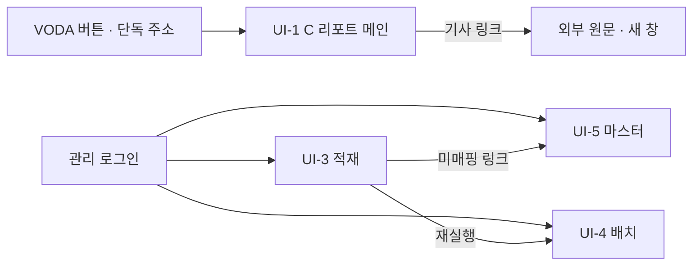

# 화면 설계 / 와이어프레임

## 0. 이 문서가 다루는 것

현업 화면 1본(C 리포트, VODA 단독 주소)과 관리 화면 3본(로그인). 현업 화면은 발주자가 시안에 단 메모를 따르되 구성은 고정이 아니다([[TBL-RFQ-001#Q56]]). 관리 화면은 개발자 화자 기준으로 표와 수치 위주다. 차트는 Chart.js, 강조는 토큰 렌더, 신호등은 색과 텍스트를 함께 쓴다(색만으로 구분하지 않는다). 삭제된 UI-2(판매 상세)·UI-6(임계값 설정)의 ID는 재사용하지 않는다. 설정(임계값·시간창·후보 상한)은 배치가 설정 버전을 읽는 것으로 남고 화면은 없다.

이 버전은 끊어진 참조만 해결한 것이다. 새 방향(A1·A2·A3·C 용어, 변동 목록·원인 후보·관련도 카드)의 전면 반영은 다음 버전에서 한다.

## 1. 유스케이스 대응

| 화면 | 주 유스케이스 | 보조 |
|:--|:--|:--|
| [[#UI-1]] 인텔리전스 메인 (C 리포트) | [[TBL-UC-001#UC-H1]] | [[TBL-UC-001#UC-H2]] |
| [[#UI-3]] 데이터 적재 | [[TBL-UC-001#UC-A1]] | [[TBL-UC-001#UC-S6]] |
| [[#UI-4]] 배치 이력·재실행 | [[TBL-UC-001#UC-A4]] | [[TBL-UC-001#UC-S1]] |
| [[#UI-5]] 마스터·미매핑 | [[TBL-UC-001#UC-A2]] | |

## 2. 화면 목록

#### UI-1 인텔리전스 메인

페이지. 단독 주소 `/intel?token=…`. 목적: 오늘 볼 국가와 이유를 한 화면에. 주 유스케이스: [[TBL-UC-001#UC-H1]]. 진입: VODA 버튼 또는 단독 주소. A 리포트에서 들어오는 흐름은 없다. 이탈: 기사 링크(새 창).

### 배치
```html
<div data-el="1" data-role="indicator-bar">GPR · Brent · BDI · SCFI · 기준일</div>
<div data-el="2" data-role="headline">AI 요약 · 오늘의 헤드라인 + 배지</div>
<div data-el="3" data-role="domain-status" data-collapsible="true">
  <div data-el="3a">생산 카드</div><div data-el="3b">재고 카드</div><div data-el="3c">판매 카드</div>
</div>
<div data-el="4" data-role="watchlist">
  <div data-el="4a" data-repeat="card">국가 카드 (신호등 · CBU · 법인 태그 · 변동 · 원인 후보 · 관련도 · 연관 설명 · 근거 펼치기)</div>
  <div data-el="4z" data-role="empty">오늘 감지된 변동 없음</div>
</div>
<div data-el="5" data-role="footer">기준일 · 데이터 최신일 · 강등 안내</div>
```

### 요소
| # | 이름 | 종류 | 보여주는 것 | 누르면 |
|---|---|---|---|---|
| 1 | 시장지표 바 | 띠 | series_map.in_indicator_bar 지표의 최신값, 전일 대비 변화율(색·부호), 기준일. 이월이면 "기준일 지연" | 지표 클릭 시 30일 스파크라인 팝오버 |
| 2 | 헤드라인 | 문장 + 배지 | briefing.headline, headline_badge. 강조 토큰은 볼드+노란 음영 | 각주 번호 → 근거 하이라이트 |
| 3 | 도메인 상태 | 접이식 3카드 | 카드마다 신호등(●+텍스트), 종합 관점 1~2문장(각주 포함). 기본 펼침, 상태는 localStorage | 헤더 클릭으로 접기/펼치기 |
| 4a | 변동 카드 | 반복 카드 | 국가명, 신호등, CBU 비중 칩("노출 미확인" 가능), 관련 법인 태그("법인 미매핑" 가능), 변동(값·기준 방식·내부 분해), 관련도 높음 후보(사건 제목·기사 수), 연관 설명 문장, 신규/상승 배지 | "근거 펼치기" → 후보 전부 관련도 순(사건별 기사 제목·출처·게시일·링크, 지표 원값, 타 도메인 변동) |
| 4z | 빈 상태 | 안내 | "오늘 감지된 변동 없음" | 없음 |
| 5 | 푸터 | 텍스트 | as_of_date, data_max_dates, degraded면 "생성 실패, 판정값만 표시" | 없음 |

### 규칙
- 순서는 1 → 2 → 3 → 4 고정. 발주자 메모([[TBL-RFQ-001#Q32]]).
- 카드 정렬: RED 먼저, 같은 신호등 안에서는 sort_order. 원인 미확인은 끝.
- 강조 토큰 외의 마크업은 렌더하지 않는다. 문장당 강조 3개 이하.
- 외부 자원(이미지, 스크립트)을 불러오지 않는다. 기사 링크는 `rel="noopener"` 새 창.
- 열람 시 LLM 호출 없음. API 1회로 화면 전체를 받는다([[TBL-PRD-001#N5]]).
- 반응형: 도메인 상태 3카드는 폭 900px 미만에서 1열.

### 시나리오
**S-1 아침 열람** — [[TBL-UC-001#UC-H1]]
1. 토큰 검증 후 최신 게시 리포트를 받는다.
2. 1~5를 그린다. 변동 목록이 비면 4z.
3. 사용자가 3을 접으면 상태를 저장한다.

**S-2 근거 확인** — [[TBL-UC-001#UC-H2]]
1. 카드의 "근거 펼치기"를 누르면 후보와 근거를 펼친다.
2. 기사 제목 클릭 → 새 창. 각주 번호 클릭 → 해당 후보 강조.

#### UI-3 데이터 적재

페이지(관리). `/admin/intel/ingest`. 목적: 파일 업로드와 적재 결과 확인. 주 유스케이스: [[TBL-UC-001#UC-A1]]. 진입: 관리 메뉴. 이탈: [[#UI-4]].

### 배치
```html
<div data-el="1" data-role="source-select">소스 선택 (완성차 생산 · 판매재고 · 뉴스 · 블룸버그 · Marklines · 크로스워크)</div>
<div data-el="2" data-role="upload">파일 드롭 + 백필 모드 체크</div>
<div data-el="3" data-role="preflight">사전 검증 결과: 스키마 버전 · 컬럼 대조 · 기간 · 행수 · 결측 · 골격 행 · 중복 의심</div>
<div data-el="4" data-role="confirm">적재 실행 (덮어쓰기 경고)</div>
<div data-el="5" data-role="history">적재 이력 표 (ingest_run)</div>
```

### 요소
| # | 이름 | 종류 | 보여주는 것 | 누르면 |
|---|---|---|---|---|
| 1 | 소스 | 셀렉트 | 6종 | 2의 허용 확장자 변경 |
| 2 | 업로드 | 드롭존 + 체크 | 파일명·크기. 백필 모드 | 3 실행 |
| 3 | 사전 검증 | 패널 | 판별된 schema_version, 다른 컬럼 목록(있으면 적재 막힘), 기간, 행수, 결측 건수, 골격 행, 중복 의심 일자 | 없음 |
| 4 | 실행 | 버튼 | 같은 기준일 존재 시 "덮어쓰기" 경고 | 적재 → 5 갱신 |
| 5 | 이력 | 표 | source, 기간, 행수, 결측률, 매칭률 3종, 중복률, 회귀 플래그, 상태, 원본 경로 | 행 클릭 → 상세(미매핑 목록 링크 [[#UI-5]]) |

### 규칙
- 회귀 플래그 행은 경고색. 자동 배치 차단 중임을 상단 배너로 안내.
- 뉴스 원본 320MB급 업로드를 위해 청크 업로드(미결: 용량 한도).

### 시나리오
**S-1 완성차 적재** — [[TBL-UC-001#UC-A1]]
1. 소스 선택, 파일 드롭.
2. 사전 검증 확인, 실행.
3. 이력에서 매칭률 확인. 필요 시 [[#UI-4]]로 재실행.

#### UI-4 배치 이력·재실행

페이지(관리). `/admin/intel/batch`. 목적: 배치 상태 감시와 재실행·재생성. 주 유스케이스: [[TBL-UC-001#UC-A4]]. 진입: 관리 메뉴, 적재 완료 링크. 이탈: 없음.

### 배치
```html
<div data-el="1" data-role="status">마지막 성공 · 다음 예정 · 자동 배치 차단 여부 · 오늘 토큰</div>
<div data-el="2" data-role="runs">배치 이력 표 (batch_run)</div>
<div data-el="3" data-role="steps">선택 배치의 단계별 소요·건수·상태</div>
<div data-el="4" data-role="rerun">재실행: 기준일 · 시작 단계 · 실행</div>
<div data-el="5" data-role="regen-diff">재생성 결과 비교: 달라진 필드 · 원인 · 게시 전환</div>
```

### 요소
| # | 이름 | 종류 | 보여주는 것 | 누르면 |
|---|---|---|---|---|
| 1 | 상태 띠 | 요약 | 마지막 성공 시각, 다음 02:00, 회귀 차단 배너, 일 토큰 사용량/상한 | 차단 해제 버튼(확인) |
| 2 | 이력 | 표 | as_of_date, trigger, 상태, 실패 단계, 소요, 토큰, 강등 여부 | 행 → 3 |
| 3 | 단계 | 표 | 1~8 단계 소요·건수·상태·오류 | 없음 |
| 4 | 재실행 | 폼 | 기준일, 시작 단계(1~8), 백필 모드 | 실행 → 2 갱신 |
| 5 | 재생성 비교 | 패널 | 당시 변동·후보와 새 결과의 차이(국가·필드), 원인 태그(매핑·설정·지연 데이터·A 판정) | "새 버전 게시" 확인 |

### 규칙
- 정기 배치와 재실행이 겹치면 정기를 대기시킨다는 안내.
- 게시 전환은 확인 대화상자 2단계.

### 시나리오
**S-1 재생성** — [[TBL-UC-001#UC-A4]]
1. 기준일과 단계 지정, 실행.
2. 5에서 차이 확인, 게시 전환 여부 결정.

#### UI-5 마스터·미매핑

페이지(관리). `/admin/intel/master`. 목적: 크로스워크 이관본 조회, 미매핑 처리, 버전. 주 유스케이스: [[TBL-UC-001#UC-A2]]. 진입: 관리 메뉴, 적재 이력 링크. 이탈: 없음.

### 배치
```html
<div data-el="1" data-role="tabs">국가 · 공장 · 카테고리 · 라우팅 · 시장지표 · 해협 · 법인 · 모델 CBU/CKD</div>
<div data-el="2" data-role="gap">미매핑 목록 (master · 값 · 등장 횟수 · 첫/마지막 등장) + 내려받기</div>
<div data-el="3" data-role="upload">크로스워크 엑셀 업로드 → 차이(추가·변경·삭제) · 영향 국가 → 확정</div>
<div data-el="4" data-role="table">현재 마스터 표 + 버전 이력</div>
```

### 요소
| # | 이름 | 종류 | 보여주는 것 | 누르면 |
|---|---|---|---|---|
| 1 | 탭 | 탭 | 마스터 8종 | 2·4 전환 |
| 2 | 미매핑 | 표 | mapping_gap | CSV 내려받기 |
| 3 | 업로드 | 드롭존 + 차이 패널 | 추가·변경·삭제 건수, 삭제로 미매핑이 될 값 경고, 영향 국가·공장 | 확정 → 새 버전 |
| 4 | 마스터 | 표 | 현재 버전 행, 버전 이력 | 없음 |

### 규칙
- 확정은 다음 배치부터 적용. 과거 판정은 바뀌지 않는다는 안내.
- glovis_entity 탭이 비어 있으면 "발주자 매핑 표 대기" 안내.

### 시나리오
**S-1 공장 보강** — [[TBL-UC-001#UC-A2]]
1. 공장 탭, 미매핑 30건 내려받기.
2. 엑셀 보강 후 업로드, 차이 확인, 확정.

## 3. 공통 틀

- 현업 화면(UI-1): 셸 없음. 상단에 제품명 한 줄과 기준일만. VODA 안에서 열리므로 자사 네비게이션·로그인 UI가 없다([[TBL-PRD-001#R23]]).
- 관리 화면(UI-3~5): 기존 관리 웹의 좌측 메뉴에 "인텔리전스" 그룹으로 3개를 추가한다.
- 신호등: RED ●, YELLOW ●, 모니터링 ● 색과 텍스트 병기. 접근성 대비 4.5:1.
- 강조 토큰 렌더: `[[hl]]…[[/hl]]` 형태의 토큰만 볼드+노란 음영으로. 그 외 마크업 제거.
- 각주: 문장 끝 위첨자 번호. 클릭 시 근거 목록의 해당 항목 강조.
- 날짜·수치: 기준일 `YYYY-MM-DD`, 대수는 천 단위 콤마, 비율은 소수 1자리 %.

## 4. 화면 흐름



## 5. 미결사항

- [ ] 기사 본문 노출 범위(라이선스). 가정: 제목·출처·링크만
- [ ] 뉴스 원본 업로드 용량 한도와 청크 방식
- [ ] 관리 화면을 발주자 데이터서비스팀도 쓰는지(메뉴 노출 권한)
- [ ] 시장지표 스파크라인 30일이 적절한지
- [ ] 변동 카드 최대 표시 수(가정: 제한 없음, 스크롤)
- [ ] 설정(임계값·시간창·후보 상한) 변경 수단. 화면은 없음. 가정: 개발자가 설정 테이블에 새 버전 행 추가
