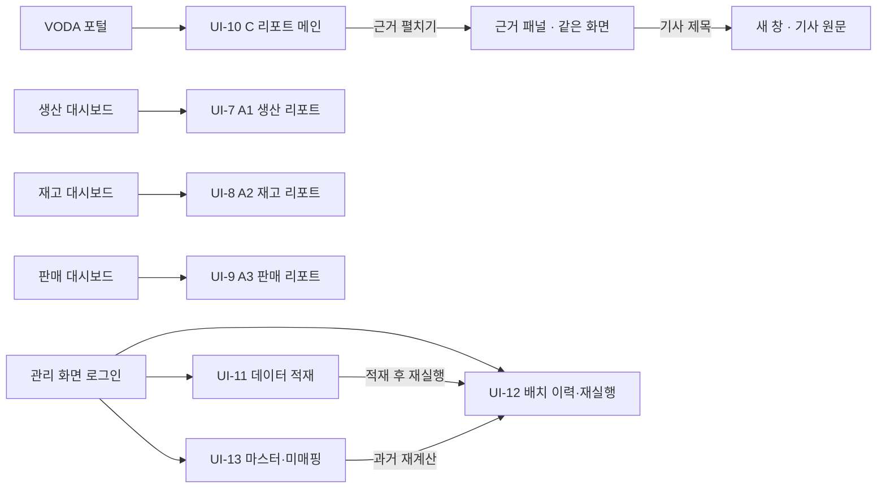

# 화면 설계 / 와이어프레임

## 0. 이 문서가 다루는 것

화면 일곱을 다룬다. 열람 화면 넷과 관리 화면 셋이다.

| 화면 | 무엇 | 누가 본다 |
|:--|:--|:--|
| [[#UI-10]] | C 리포트 메인. 과업지시의 "인텔리전스 서비스 개요" | 현업 사용자 |
| [[#UI-7]] | A1 생산 리포트 | 현업 사용자 |
| [[#UI-8]] | A2 재고 리포트 | 현업 사용자 |
| [[#UI-9]] | A3 판매 리포트 | 현업 사용자 |
| [[#UI-11]] | 데이터 적재 | 관리자 |
| [[#UI-12]] | 배치 이력과 재실행 | 관리자 |
| [[#UI-13]] | 마스터와 미매핑 | 관리자 |

C 리포트와 관리 화면의 번호가 UI-10부터 시작하는 것은 UI-1부터 UI-6까지가 삭제된 ID이기 때문이다. 0.4절에 적었다.

### 0.1 시안이 정본이다

화면 시안이 확정돼 있다. 이 문서는 그 시안의 구조를 요소와 규칙으로 옮겨 적은 것이다. 시안과 이 문서가 어긋나면 시안을 따르고 이 문서를 고친다.

시안 링크: https://claude.ai/artifact/5RhDRfeGjwpf5sQYFYtEBq

| 시안 파일 | 대응 화면 |
|:--|:--|
| `docs/glovis/intelligence/design/Main.dc.html` | [[#UI-10]] 기본 상태 |
| `docs/glovis/intelligence/design/Evidence.dc.html` | [[#UI-10]] 근거 펼친 상태 |
| `docs/glovis/intelligence/design/States.dc.html` | [[#UI-10]] 예외 상태 6가지 |
| `docs/glovis/intelligence/design/A1Production.dc.html` | [[#UI-7]] |
| `docs/glovis/intelligence/design/A2Inventory.dc.html` | [[#UI-8]] |
| `docs/glovis/intelligence/design/A3Sales.dc.html` | [[#UI-9]] |

관리 화면 셋([[#UI-11]] [[#UI-12]] [[#UI-13]])에는 시안이 없다. 유스케이스 흐름에서 유도한 최소 구성을 적었고 그 사실을 각 항목에 표시했다.

### 0.2 용어

A1 생산 리포트, A2 재고 리포트, A3 판매 리포트를 통칭해 A 리포트라 한다. 대시보드에 붙으며 브리핑 갈래가 만든다. C 리포트는 종합 리포트이고 이 명세 사슬이 만드는 것이다. "A 판정"은 A 리포트가 만든 스냅샷 변동 판정값과 내부 분해 결과다. C는 이것만 읽고 A 리포트가 쓴 문장은 읽지 않는다([[TBL-UC-001#UC-S10]]).

액터코드 A(관리자)와 리포트 A는 다른 것이다.

### 0.3 이 문서 전체에 걸리는 다섯 가지

**첫째, 관련도 등급 칩이 화면에 없다.** 모델이 높음과 낮음을 매기지 않는다(PRD 6.14, [[TBL-PRD-001#R26]]). 대신 코드가 센 근접도 값을 칩으로 적는다. 시점 차이, 기사 수, 출처 수, 국가 일치 방식 넷이다. 후보 정렬 기준도 화면에 글자로 적어 왜 이 순서인지 읽는 사람이 확인하게 한다([[TBL-PRD-001#R20]]).

**둘째, 신호등은 색만으로 구분하지 않는다.** 점이나 칩에 반드시 텍스트를 병기한다. RED는 "확인 필요", YELLOW는 "주의", 신호등 없음은 "원인 미확인", 국가 축 판정 대상이 아닌 자리는 "판정 대상 아님"이다. 색각 이상과 흑백 인쇄에서 같은 정보가 읽혀야 한다.

**셋째, 화면 구성은 고정이 아니다.** 발주자가 개요 시트를 디자인 방향으로 설명했다([[TBL-RFQ-001#Q56]], PRD 6.12 확정). 여기 적은 배치는 지금 데이터가 받쳐 주는 만큼의 구성이며 데이터가 바뀌면 구성도 바뀐다([[TBL-PRD-001#R19]]).

**넷째, A 리포트에서 C 리포트로 가는 화면 흐름이 없다.** C는 VODA 단독 주소다([[TBL-PRD-001#R23]]). A 리포트 어디에도 C로 가는 버튼이나 링크를 두지 않는다.

**다섯째, 판정은 LLM과 무관하게 화면에 나온다.** 변동, 후보, 근접도, 신호등은 배치 1~5단계에서 코드가 끝낸다([[TBL-INFRA-001#C19]]). LLM 세 역할이 전부 실패해도 이 넷은 그대로 표시되고 문장 자리만 강등된다([[TBL-PRD-001#N2]]).

### 0.4 삭제된 ID

UI-1부터 UI-6까지 여섯은 삭제된 항목 ID다. 이전 A 방식 화면(워치리스트 카드, 판매 상세, 임계값 설정 등)이 쓰던 번호이며 재사용하지 않는다. 그래서 이 문서의 C 리포트와 관리 화면은 UI-10부터 새로 발번했다.

## 1. 유스케이스 대응

| 화면 | 주 유스케이스 | 포함과 확장 |
|:--|:--|:--|
| [[#UI-10]] | [[TBL-UC-001#UC-H1]] | 확장점 5 근거 확인은 [[TBL-UC-001#UC-H2]]. 같은 화면 안에서 펼친다 |
| [[#UI-7]] | [[TBL-UC-001#UC-H4]] | A1 생산 |
| [[#UI-8]] | [[TBL-UC-001#UC-H4]] | A2 재고 |
| [[#UI-9]] | [[TBL-UC-001#UC-H4]] | A3 판매 |
| [[#UI-11]] | [[TBL-UC-001#UC-A1]] | 포함 [[TBL-UC-001#UC-S6]] 회귀 검사. 확장점 6 백필 모드 |
| [[#UI-12]] | [[TBL-UC-001#UC-A4]] | 포함 [[TBL-UC-001#UC-S1]] |
| [[#UI-13]] | [[TBL-UC-001#UC-A2]] | 확장점 4 과거 재계산은 [[#UI-12]]로 |

[[TBL-UC-001#UC-H2]]는 별도 화면이 아니다. [[#UI-10]] 변동 카드 안에서 펼치는 패널이다. 시스템 유스케이스([[TBL-UC-001#UC-S1]] 외)는 화면이 없고 [[#UI-12]]의 이력으로만 보인다.

설정을 바꾸는 화면은 이번 범위에 없다. 정본 선택과 임계값은 설정 테이블에 있고 배치가 버전으로 읽는다([[TBL-UC-001#UC-S3]] 8단계, [[TBL-INFRA-001#C11]]).

## 2. 화면 목록

### 2.1 C 리포트

#### UI-10 C 리포트 메인

페이지. VODA 단독 주소. 세 도메인의 변동과 외부 원인 후보를 한 화면에 보여 준다. 근거 펼치기와 예외 상태 여섯을 이 화면이 함께 갖는다.

주 유스케이스: [[TBL-UC-001#UC-H1]] · 확장 [[TBL-UC-001#UC-H2]]
진입: VODA 버튼 또는 단독 주소. 추가 로그인 없음([[TBL-PRD-001#R23]])
이탈: 기사 제목을 누르면 새 창으로 원문. 그 외에 다른 화면으로 나가는 링크 없음

##### 배치

```html
<main data-screen="UI-10" class="page" style="width:1280px;padding:28px 32px 40px">

  <header data-el="1" class="page-head">
    <h1>완성차 인텔리전스</h1><span class="sub">종합 리포트</span>
    <div data-el="2" class="asof">기준일 · 완성차 · 뉴스 · 시장 최신일</div>
  </header>

  <section data-el="3" class="market-bar">
    <div class="metric">GPR</div><div class="metric">Brent</div>
    <div class="metric">BDI</div><div class="metric">SCFI</div>
  </section>

  <section data-el="4" class="headline">
    <span class="lbl">오늘의 요약</span>
    <span data-el="5" class="badge-cause">상관관계 확인 · 인과관계 미확정</span>
    <p class="headline-text">헤드라인 1문장<sup class="fn">1,2,3</sup></p>
  </section>

  <section class="domain-status">
    <div class="sec-head"><span class="lbl">도메인 상태</span><button data-el="6">접기</button></div>
    <div class="grid-3">
      <article data-el="7" class="domain-card"><!-- 생산 · 신호등 자리는 "판정 대상 아님" --></article>
      <article data-el="7" class="domain-card"><!-- 재고 --></article>
      <article data-el="7" class="domain-card"><!-- 판매 --></article>
    </div>
  </section>

  <section class="anomaly-list">
    <div data-el="8" class="sec-head">
      <span class="lbl">변동 목록 · 국가 4건</span><span class="sort">신호등 순 정렬</span>
    </div>

    <article data-el="9" class="anomaly-card">
      <div class="card-head">
        <h2>오만</h2>
        <span data-el="10" class="light light-red">확인 필요</span>
        <span data-el="11" class="badge-new">신규</span>
        <span data-el="12" class="chip">CBU 100%</span>
        <span data-el="13" class="chip-muted">법인 미매핑</span>
      </div>
      <div class="grid-2">
        <div data-el="14" class="box"><span class="lbl">변동</span></div>
        <div data-el="15" class="box"><span class="lbl">대시보드 안에서의 분해</span></div>
      </div>
      <div class="cause-top">
        <h3 data-el="16">호르무즈 해협 봉쇄 위협</h3>
        <span data-el="17" class="chip">변동 시점과 1일 차이</span>
        <span data-el="17" class="chip">기사 8건 · 출처 5곳</span>
      </div>
      <p data-el="18" class="cause-text">연관 설명 한 문단<sup class="fn">1</sup></p>
      <div class="card-foot">
        <button data-el="19" aria-expanded="false" aria-controls="ev-oman">근거 펼치기</button>
        <span class="sort">후보 4건 · 시점 가까운 순</span>
      </div>
      <div data-el="20" id="ev-oman" class="evidence-panel" hidden></div>
    </article>

    <div data-el="25" class="no-cause">인도 · 재고 체류 +24% · 원인 미확인</div>
  </section>

  <footer data-el="26" class="page-foot">각주 안내 · 기준일 · 배치 번호</footer>
</main>
```

근거 패널(`data-el="20"`)을 펼친 모양은 아래와 같다. 같은 카드 안에서 열리며 화면을 떠나지 않는다.

```html
<div data-el="20" class="evidence-panel">
  <div class="panel-head">
    <button data-el="19" aria-expanded="true">근거 접기</button>
    <span class="sort">후보 4건 · 변동 시점과 가까운 순</span>
  </div>

  <section data-el="21" class="cand cand-event">
    <div class="cand-head">호르무즈 해협 봉쇄 위협
      <span class="meta">사건 · 해상운송 · 시점 1일 차이 · 출처 5곳</span><sup class="fn">1</sup></div>
    <ul class="article-list">
      <li><a href="#" target="_blank" rel="noopener">기사 제목</a><span>매체</span><span class="num">08-12</span></li>
    </ul>
    <p class="cand-foot">기사 8건 중 상위 3건. 해협 사건은 인접국 표로 붙었습니다.</p>
  </section>

  <section data-el="22" class="cand cand-domain">
    <div class="cand-head">같은 국가 재고 변동
      <span class="meta">타 도메인 · A2 재고 · 같은 국가 같은 기간</span><sup class="fn">5</sup></div>
    <div class="value-row"><!-- 값 3개 --></div>
  </section>

  <section data-el="23" class="cand cand-market">
    <div class="cand-head">건화물운임 BDI
      <span class="meta">시장 지표 · 날짜만 일치 · 국가 축 없음</span><sup class="fn">3</sup></div>
    <div class="value-row"><!-- 원값 · 변화율 · 30일 스파크라인 --></div>
  </section>

  <div data-el="24" class="cand-unused">설명에 쓰이지 않은 후보 1건</div>
  <p class="panel-foot">각주 번호를 누르면 해당 근거가 강조됩니다.</p>
</div>
```

##### 요소

| # | 이름 | 종류 | 보여주는 것 | 누르면 |
|---|---|---|---|---|
| 1 | 페이지 머리 | 헤더 | 제품명, "종합 리포트" | 없음 |
| 2 | 기준일과 소스 최신일 | 텍스트 | 리포트 기준일, 그리고 완성차·뉴스·시장 세 소스의 데이터 최신일을 각각 따로 | 없음 |
| 3 | 시장지표 바 | 4칸 그리드 | GPR, Brent, BDI, SCFI의 최신값·변화율·기준일 | 없음 |
| 4 | 헤드라인 | 카드 | 19px 한 문장, 강조 토큰, 각주 번호 | 각주는 해당 근거 강조 |
| 5 | 인과 배지 | 칩 | "상관관계 확인 · 인과관계 미확정" 고정 문구 | 없음 |
| 6 | 도메인 상태 접기 | 버튼 | 접힘 여부 | 3카드 영역 접고 폄. 상태는 브라우저에 기억 |
| 7 | 도메인 상태 카드 | 카드 3 | 신호등 점과 상태 텍스트, 종합 관점 문장, 하단에 판정 출처와 기여 상위. 생산 카드의 신호등 자리는 "판정 대상 아님" | 각주는 근거 강조 |
| 8 | 변동 목록 머리 | 줄 | 국가 건수, "신호등 순 정렬" | 없음 |
| 9 | 변동 카드 | 카드 | 국가 하나의 변동 한 건 | 없음 |
| 10 | 신호등 칩 | 칩 | RED는 "확인 필요", YELLOW는 "주의". 색과 텍스트를 함께 | 없음 |
| 11 | 변화 배지 | 칩 | "신규" 또는 "상승". 직전 게시본과 비교한 결과 | 없음 |
| 12 | 노출 칩 | 칩 | CBU 비중. 확인 못 하면 "노출 미확인" | 없음 |
| 13 | 법인 태그 | 칩 | 글로비스 법인명. 매핑 없으면 "법인 미매핑" | 없음 |
| 14 | 변동 박스 | 보조면 박스 | 지표명, 변화율, 기준 방식, 원값 두 개 | 없음 |
| 15 | 분해 박스 | 보조면 박스 | A 판정의 기여 상위 항목. 출처 표기 "A3 판매 리포트가 낸 값" | 없음 |
| 16 | 첫 후보 제목 | 제목 | 정렬 1순위 후보의 이름 | 없음 |
| 17 | 근접도 칩 | 칩 다수 | 시점 차이, 기사 수와 출처 수, 국가 일치 방식 | 없음 |
| 18 | 연관 설명 | 문단 | 후보와 변동을 잇는 설명 한 문단, 각주 | 각주는 근거 강조 |
| 19 | 근거 펼치기 | 버튼 | 접힘 여부, 후보 건수와 정렬 기준 | 20번 패널을 펼침 |
| 20 | 근거 패널 | 영역 | 후보 전부를 정렬 순서대로 | 없음 |
| 21 | 사건 후보 블록 | 블록 | 사건 제목, 유형, 근접도, 기사 3건 이상(제목·출처·게시일) | 기사 제목은 새 창 원문 |
| 22 | 타 도메인 후보 블록 | 블록 | 같은 국가 다른 도메인의 변동값 | 없음 |
| 23 | 시장지표 후보 블록 | 블록 | 지표 원값, 변화율, 30일 스파크라인 | 없음 |
| 24 | 미사용 후보 줄 | 접힌 줄 | 설명에 쓰이지 않은 후보의 수와 요약 | 펼치면 같은 형식의 블록 |
| 25 | 원인 미확인 행 | 점선 박스 | 변동은 있으나 후보가 없는 국가 | 없음 |
| 26 | 페이지 꼬리 | 푸터 | 각주 안내 문구, 기준일, 배치 번호 | 없음 |
| 27 | 예외 상태 자리 | 영역 | 아래 "예외 상태" 여섯 중 해당하는 것 | 상태마다 다름 |

##### 규칙

- 열람 시 LLM을 호출하지 않는다. 게시된 리포트를 조회만 한다([[TBL-PRD-001#N5]], p95 2초).
- 외부 자원을 불러오지 않는다. 기사 원문은 새 창 링크로만 연다. 폐쇄망이다([[TBL-PRD-001#N1]], [[TBL-INFRA-001#C10]]).
- 데이터 최신일은 완성차·뉴스·시장 셋을 각각 적는다. 한 칸으로 합치지 않는다. 한 줄로 줄여야 하는 자리에서는 셋 중 가장 늦은 날을 쓴다.
- 변동 목록 정렬은 신호등 순이다. RED, YELLOW, 신호등 없음 차례다. 같은 신호등 안에서는 국가 단위로 묶는다.
- 카드 안 후보 정렬은 날짜 차이 오름차순, 같으면 출처 수 내림차순, 그다음 기사 수 내림차순이다([[TBL-DOM-001#CauseCandidate]]). 이 기준을 카드 하단과 근거 패널 머리에 글자로 적는다.
- 동률일 때는 후보 식별자 사전순으로 갈린다. 이 넷째 기준은 화면 문구에 적지 않는다. 순서가 흔들리지 않게 하는 장치이지 읽는 사람이 알아야 할 기준이 아니다.
- 관련도 등급이나 점수를 뜻하는 칩, 별점, 막대, 색 농도를 두지 않는다. 화면에 나오는 숫자는 코드가 센 값뿐이다.
- 신호등은 색과 텍스트를 함께 쓴다. 점 하나만 두지 않는다.
- 도메인 상태 3카드의 신호등도 규칙 산출물이다. 배치 5단계가 도메인 안 변동들의 신호등 최댓값으로 정하고 판정 출처(A 판정·보완 집계·미수신)와 기여 상위를 함께 낸다. 8단계 LLM은 그 카드의 문장만 쓴다. LLM 세 역할이 전부 실패해도 신호등과 판정 출처와 기여 상위는 그대로 나온다([[TBL-INFRA-001#C19]], [[TBL-PRD-001#N2]]).
- 생산 카드의 신호등 자리에는 "판정 대상 아님"을 적는다. 생산은 목적지 국가가 없어 국가 축 판정 대상이 아니기 때문이다. 후보를 찾지 못한 "원인 미확인"과 뜻이 다르므로 두 표기를 바꿔 쓰지 않는다(3.4절).
- 후보가 상한에 걸려 잘렸으면 잘린 건수를 근거 패널에 적는다([[TBL-UC-001#UC-S8]] 6a).
- 생산 변동은 이 목록에 오르지 않는다. 목적지 국가가 없어 국가 축에 붙지 못한다([[TBL-PRD-001#R11]], [[TBL-INFRA-001#C16]]). 생산은 도메인 상태 카드 한 줄로만 들어가고 그 문장에는 외부 원인 인용이 없다([[TBL-PRD-001#R15]]).
- 재고 값이 유도값이면 카드에 유도임을 표시한다([[TBL-PRD-001#R30]], [[TBL-DOM-001#SalesStageFlow]]).
- A 판정이 국가 단위가 아니어서 원장 보완 집계로 만든 변동은 분해 박스에 "보완 집계"를 표시하고 기여 분해를 비운다([[TBL-UC-001#UC-H1]] 5b).
- 비교 기준을 변동 박스에 함께 적는다. 계획 대비, 전년 동월, 전월 대비 중 무엇인지 글자로 나온다([[TBL-PRD-001#R8]]).
- 기간 단위를 표시한다. 형태 B에서 온 값이면 일·월·누계·년 중 무엇인지 적는다([[TBL-INFRA-001#C15]]).
- 수치는 등폭 글꼴에 `tabular-nums`를 쓴다. 자릿수가 흔들리면 비교가 안 된다.
- 도메인 상태 접기 상태는 브라우저에 기억한다. 서버에 저장하지 않는다.
- 각주 번호는 후보와 설명 ID에 이어진다. 각주 없는 주장을 두지 않는다([[TBL-PRD-001#R15]], [[TBL-PRD-001#N4]]).

##### 예외 상태

여섯 가지다. 어느 경우에도 화면이 비지 않는다.

| # | 상태 | 트리거 | 화면 |
|---|---|---|---|
| E1 | 변동 없음 | 세 도메인 모두 임계값 안 | 카드 중앙에 "오늘 감지된 변동 없음". 정상 상태이며 오류가 아니라고 적는다. 시장지표 바와 도메인 상태는 그대로 |
| E2 | 첫 배치 전 | 게시된 리포트가 0건 | "리포트가 아직 생성되지 않았습니다"와 다음 배치 예정 시각 |
| E3 | 생성 실패 강등 | LLM 세 역할 중 실패([[TBL-UC-001#UC-S7]]) | 카드 머리에 주의색 띠 "생성 실패, 판정값만 표시". 문장 자리에 템플릿 한 줄. 신호등, 후보, 근접도는 그대로 |
| E4 | 대시보드 판정 미수신 | A 리포트 배치 실패([[TBL-UC-001#UC-S10]] 1a) | 도메인 카드 머리에 "A2 재고 리포트 판정 미수신", 카드에 "보완 집계" 칩. 기여 분해는 표시하지 않음 |
| E5 | 배치 실패 | 오늘 배치 중단, 이전 게시본 유지 | 상단에 경고색 띠 "오늘 배치가 실패했습니다"와 마지막 성공일. 본문은 그날 리포트 그대로이고 기준일도 그날로 표시 |
| E6 | 지표 바 지연 | 시장지표 이월 | 해당 지표 기준일 자리에 주의색 "08-18 값 이월". 이월 한도를 넘기면 값을 비우고 "기준일 지연"만 표시하며 판정에 쓰지 않음 |

여섯 중 다섯은 게시 응답의 알림 값과 1대1로 맞춘다. 화면이 스스로 상태를 판단하지 않고 게시된 값을 그대로 읽는다.

| 상태 | 게시 응답의 notices 코드 | 어느 배치 단계에서 나오나 | 붙는 자리 |
|---|---|---|---|
| E1 | `noAnomaly` | 5 원인 후보·근접도·신호등 | 리포트 전체 |
| E3 | `generationDegraded` | 6~8 강등 | 리포트 전체. 해당 카드 머리 |
| E4 | `aJudgmentNotReceived` | 2 A 판정 읽기 | 해당 도메인 카드 |
| E5 | `batchFailed` | 1·3·4·5 멈춤 | 페이지 상단 |
| E6 | `marketCarriedOver` | 5 결합 시점의 지표 이월 | 시장지표 바의 해당 지표 |

E2는 게시본 자체가 없는 상태라 대응하는 notices 값이 없다. 조회 결과가 0건인 것으로 화면이 판단한다.

각 notices 값의 `domain`은 E4에서 어느 도메인 카드에 띠를 붙일지 고르는 데 쓰고, `lastSuccessDate`는 E5 띠의 마지막 성공일에 쓴다. `message`는 화면 문구를 대체하지 않고 상세 안내로만 쓴다.

```html
<section data-el="27" class="state-e1">
  <div class="empty-card">
    <svg class="icon-check"></svg>
    <p class="title">오늘 감지된 변동 없음</p>
    <p class="cap">세 도메인 모두 임계값 안입니다. 정상 상태이며 오류가 아닙니다.</p>
  </div>
</section>

<section data-el="27" class="state-e5">
  <div class="banner banner-danger">
    <svg class="icon-warn"></svg>
    <span>오늘 배치가 실패했습니다</span>
    <span class="num">마지막 성공 2026-08-19</span>
  </div>
  <p class="cap">8월 19일 리포트를 그대로 보여 줍니다. 원인 후보와 근거는 그날 것입니다.</p>
</section>
```

##### 시나리오

**S-1 오늘의 리포트를 연다** . [[TBL-UC-001#UC-H1]]
1. H가 VODA 단독 주소를 연다.
2. 시장지표 바, 헤드라인, 도메인 상태 3카드, 변동 목록이 2초 안에 그려진다.
3. 생산 카드의 신호등 자리에 "판정 대상 아님"이 적혀 있다. 재고와 판매 카드에는 신호등이 붙는다.
4. H가 도메인 상태 접기를 눌러 3카드를 접는다. 다음 방문에도 접힌 채로 열린다.

**S-2 근거를 펼쳐 순서를 확인한다** . [[TBL-UC-001#UC-H2]]
1. H가 오만 카드의 근거 펼치기를 누른다.
2. 후보 4건이 시점 가까운 순으로 펼쳐진다. 후보마다 근접도 값 넷이 적혀 있다.
3. H가 기사 제목을 누르면 새 창으로 원문이 열린다. 화면은 그대로 있다.
4. H가 설명의 각주 2를 누르면 두 번째 후보 블록이 강조된다.
5. H가 정렬 기준 문구를 읽고 왜 이 순서인지 확인한다. 등급 표시는 어디에도 없다.

**S-3 원인 후보가 없는 변동을 본다** . [[TBL-UC-001#UC-S8]] 2a
1. 인도의 재고 체류 +24%가 목록 끝에 점선 박스로 나온다.
2. "시간창 안에서 원인 후보를 찾지 못했습니다. 신호등을 붙이지 않습니다"가 함께 나온다.

**S-4 문장 생성이 실패한 날** . [[TBL-UC-001#UC-S7]]
1. 카드 머리에 "생성 실패, 판정값만 표시" 띠가 붙는다. 게시 응답의 notices에 `generationDegraded`가 들어 있다.
2. 설명 자리에 템플릿 한 줄이 들어간다. 신호등 "확인 필요", 후보 목록, 근접도 값, 도메인 상태 카드의 신호등은 평소와 같다.

**연관**: [[TBL-PRD-001#R19]] · [[TBL-PRD-001#R20]] · [[TBL-PRD-001#R21]] · [[TBL-PRD-001#R15]] · [[TBL-PRD-001#R11]] · [[TBL-PRD-001#R23]] · [[TBL-PRD-001#N2]] · [[TBL-PRD-001#N5]] · [[TBL-DOM-001#CReport]] · [[TBL-DOM-001#CauseCandidate]] · [[TBL-DOM-001#Evidence]]

### 2.2 A 리포트

세 화면이 같은 뼈대를 쓴다. 좌측 248px 사이드와 중앙 지면이다. 중앙 지면은 44px 헤더 아래에 요약, 지표 카드, 분해, 해설, 고정 문구가 차례로 놓인다. 전체 폭은 1180px이다.

세 화면 모두 자기 도메인 데이터만 쓴다. 뉴스와 시장지표를 인용하지 않는다([[TBL-PRD-001#R29]]). C 리포트로 가는 버튼이나 링크를 두지 않는다.

**세 화면의 요약과 해설은 이 시스템이 새로 쓰는 문장이 아니다.** 브리핑 갈래가 A 리포트로 게시한 문장을 각주 근거와 버전까지 통째로 받아 게시 스키마에 사본으로 두고, 세 화면은 그 사본을 읽어 그대로 보여 준다. 요약과 해설, 고정 문구, 트래킹 지표, 분해, 못 만드는 지표 목록이 모두 사본에서 온다. 사이드 버전 목록의 번호도 사본이 가진 버전 번호다. 그래서 열람 경로가 게시 스키마 밖으로 나가지 않는다([[TBL-INFRA-001#C10]]). C 리포트가 읽는 것은 A 판정뿐이고 A가 쓴 문장은 C의 서술에 쓰지 않는다([[TBL-UC-001#UC-S10]]). 화면이 보여 주는 경로와 C가 읽는 경로는 서로 다른 경로다.

#### UI-7 A1 생산 리포트

페이지. 생산 대시보드에 붙는 AI 인사이트. 사업계획 대비 달성률을 중심으로 공장과 차종까지 분해한다.

주 유스케이스: [[TBL-UC-001#UC-H4]]
진입: VODA 생산 대시보드
이탈: 내려받기. 다른 화면으로 나가는 링크 없음

##### 배치

```html
<div data-screen="UI-7" class="report" style="width:1180px;padding:24px;display:flex;gap:20px">

  <aside data-el="1" class="side" style="width:248px">
    <section data-el="2"><span class="lbl">출처</span>
      <p>완성차 생산 대시보드</p>
      <p class="cap">운영계획·사업계획·실적 × 일·월·누계·년</p>
      <p class="cap">스냅샷 <span class="num">2026-08-20 01:38</span></p>
    </section>
    <section data-el="3"><span class="lbl">트래킹 지표</span>
      <ul><li class="active">사업계획 달성 <span class="num">86.1%</span></li>
          <li>완성차 비중 <span class="num">78%</span></li>
          <li>수출 비중 <span class="num">37%</span></li></ul>
      <p class="cap">달성률은 계획과 실적으로 직접 계산합니다. 원본 진도율 컬럼은 총계 행에만 값이 있습니다.</p>
    </section>
    <section data-el="4"><span class="lbl">분해 차원</span>
      <span class="chip">생산법인 28</span><span class="chip">공장지역 18</span>
      <span class="chip">세부지역 41</span><span class="chip">차종그룹 37</span>
      <span class="chip">CBU/CKD</span><span class="chip">내수/수출</span>
      <div data-el="5" class="warn-box">목적지 국가 없음. 수출이 어느 나라로 가는지 데이터에 없습니다.</div>
      <div data-el="5" class="warn-box">파워트레인은 절반이 미분류라 분해에서 뺐습니다.</div>
    </section>
    <section data-el="6"><span class="lbl">버전</span>
      <ul><li class="active num">v12 · 현재</li><li class="num">v11 · 08-19</li></ul>
    </section>
  </aside>

  <main class="sheet">
    <div data-el="7" class="sheet-head" style="height:44px">
      <span class="tag">A1 생산 리포트</span>
      <span class="title">생산 실적 일일 인사이트</span>
      <span class="pill num">v12</span>
      <span class="cap">28개 법인 · 누적 기준</span>
      <button data-el="8" class="ghost">내려받기</button>
    </div>
    <div class="sheet-body">
      <section data-el="9"><span class="lbl">요약</span><p class="summary">요약 문장<sup class="fn">1</sup></p></section>
      <section data-el="10" class="grid-3">
        <div class="kpi">누적 사업계획</div><div class="kpi">누적 실적</div><div class="kpi">달성률</div>
      </section>
      <section data-el="11" class="breakdown">
        <div class="sec-head"><span class="lbl">변동을 대시보드 안에서 분해</span>
          <span class="cap">사업계획 대비 달성률 · 계획 10,000대 이상 법인</span></div>
        <div class="table-card"><div class="table-head">법인별 달성률 <span class="cap">낮은 순</span></div>
          <div class="bar-row"><span class="name">HMGMA 미국</span><span class="bar"></span>
            <span class="num">45.9%</span><span class="num">16,338 / 35,600</span></div>
        </div>
        <div data-el="12" class="table-card"><div class="table-head">생산 구성 <span class="cap">누적 실적 기준</span></div>
          <div class="stack">완성차 78% / 반조립 22%</div>
          <div class="stack">내수 63% / 수출 37%</div>
        </div>
      </section>
      <section data-el="13"><span class="lbl">해설</span><p class="prose">해설 문단<sup class="fn">1</sup></p></section>
      <p data-el="14" class="fixed-note">이 리포트는 생산 대시보드 데이터만 씁니다. 계획은 사업계획 기준이며 운영계획 기준과 266,381대 차이가 있습니다.</p>
    </div>
  </main>
</div>
```

##### 요소

| # | 이름 | 종류 | 보여주는 것 | 누르면 |
|---|---|---|---|---|
| 1 | 좌측 사이드 | 248px 고정 폭 보조면 | 출처, 지표, 차원, 버전 | 없음 |
| 2 | 출처 블록 | 블록 | 대시보드 이름, 측정값 구성, 스냅샷 일시 | 없음 |
| 3 | 트래킹 지표 | 목록 3 | 사업계획 달성률, 완성차 비중, 수출 비중. 현재 값과 상태 점 | 선택한 지표가 본문의 기준이 됨 |
| 4 | 분해 차원 칩 | 칩 다수 | 차원명과 값 개수 | 없음 |
| 5 | 제약 경고 | 주의색 박스 2 | 목적지 국가 없음, 파워트레인 제외 | 없음 |
| 6 | 버전 목록 | 목록 | 게시 사본이 가진 현재 버전과 직전 버전 | 누르면 그 버전 지면 |
| 7 | 지면 헤더 | 44px 줄 | 리포트 배지, 제목, 버전 알약, 범위 문구 | 없음 |
| 8 | 내려받기 | 버튼 | 없음 | 현재 버전 지면을 파일로 |
| 9 | 요약 | 16px 문단 | 브리핑 갈래가 쓴 한두 문장, 강조 토큰, 각주 | 각주는 해설 강조 |
| 10 | 지표 카드 | 카드 3 | 누적 사업계획, 누적 실적, 달성률 막대 | 없음 |
| 11 | 법인별 달성률 | 막대 표 | 법인명, 국가, 달성률 막대, 실적/계획 원값 | 없음 |
| 12 | 생산 구성 | 누적 막대 2 | 완성차와 반조립, 내수와 수출 | 없음 |
| 13 | 해설 | 문단 | 브리핑 갈래가 쓴 13.5px 서술, 각주 | 각주 강조 |
| 14 | 고정 문구 | 회색 줄 | 데이터 범위와 계획 정본 미정 안내 | 없음 |

##### 규칙

- 요약, 해설, 고정 문구, 각주 근거, 버전 번호는 브리핑 갈래가 게시한 A 리포트 사본에서 그대로 읽는다. 이 화면이 문장을 새로 만들지 않는다(2.2절).
- 달성률은 계획과 실적으로 직접 계산한다. 원본 진도율 컬럼은 개별 행이 0이라 쓰지 않는다. 이 사실을 사이드에 적는다.
- 목적지 국가가 없다는 경고를 사이드 분해 차원 아래에 둔다. 지우지 않는다. 이 제약이 C 리포트에서 생산이 국가 카드에 오르지 못하고 도메인 상태 카드에서 "판정 대상 아님"으로 나오는 이유다([[TBL-INFRA-001#C16]]).
- 파워트레인은 44~53%가 미분류라 분해 차원 칩에 넣지 않는다.
- 계획 정본이 정해지기 전에는 사업계획을 기본으로 쓰고, 운영계획 기준 값과의 차이 266,381대를 고정 문구에 적는다([[TBL-DOM-001#ThresholdSetting]]).
- 지표 카드의 막대 색은 상태에 따른다. 달성률이 임계 아래면 주의색, 그 위면 차트색을 쓴다. 색만으로 구분하지 않고 값을 함께 적는다.
- 뉴스, 시장지표, 다른 도메인 값을 인용하지 않는다. 인용 0건이 인수 기준이다([[TBL-PRD-001#R29]]).
- 분해할 차원이 없으면 변동 판정만 보여 주고 "분해 불가"를 적는다([[TBL-UC-001#UC-H4]] 2a).
- 트래킹 지표 셋은 임시 후보다. 현업 인터뷰 전까지 임시 지정임을 사이드에 표시한다([[TBL-UC-001#UC-H4]] 1a).

##### 시나리오

**S-1 생산 리포트를 본다** . [[TBL-UC-001#UC-H4]]
1. H가 생산 대시보드를 연다. 지면이 함께 뜬다.
2. 브리핑 갈래가 쓴 요약이 사본에서 실려 누적 달성 86.1%와 미달 280,809대를 말한다.
3. H가 법인별 달성률 표에서 HMGMA 45.9%를 본다. 대수와 비율이 함께 적혀 있다.
4. 해설이 공장과 차종 사실만 말한다. 왜 그런지는 여기서 답하지 않는다.

**S-2 변동이 없는 날** . [[TBL-UC-001#UC-H4]] 1b
1. 요약 자리에 "감지된 변동 없음"과 지표 현황만 나온다. 리포트는 그대로 나간다.

**연관**: [[TBL-PRD-001#R29]] · [[TBL-PRD-001#R11]] · [[TBL-PRD-001#G2]] · [[TBL-UC-001#UC-H4]] · [[TBL-DOM-001#DomainReport]] · [[TBL-DOM-001#DomainJudgment]] · [[TBL-INFRA-001#C16]]

#### UI-8 A2 재고 리포트

페이지. 재고 대시보드에 붙는 AI 인사이트. **재고 원천이 없다는 배너로 시작한다.** 지금 보이는 값은 판매에서 유도했거나 하루치 스냅샷이다.

주 유스케이스: [[TBL-UC-001#UC-H4]]
진입: VODA 재고 대시보드
이탈: 내려받기

##### 배치

```html
<div data-screen="UI-8" class="report" style="width:1180px;padding:24px;display:flex;gap:20px">

  <aside data-el="1" class="side" style="width:248px">
    <section data-el="2"><span class="lbl">출처</span>
      <div class="danger-box">재고 대시보드 원천이 아직 없습니다. 인입 데이터에 재고 파일이 들어 있지 않습니다.</div>
      <p class="cap">아래 지표는 판매 데이터에서 유도했거나 단발 스냅샷입니다.</p>
    </section>
    <section data-el="3"><span class="lbl">지금 만들 수 있는 것</span>
      <ul><li class="active">유통 체류 <span class="num">-34,104</span>
            <span class="cap">딜러 구간 · 도매 정본 − 소매 · 감소 방향 표기 · distributionStay</span></li>
          <li>재고 회전 MOS <span class="num">불안정</span></li>
          <li>현지재고 스냅샷 <span class="num">1일</span></li></ul>
    </section>
    <section data-el="4"><span class="lbl">없는 것</span>
      <ul class="x-list"><li>항해중 재고 <span class="cap">afloat</span></li>
        <li>선적대기 재고 <span class="cap">awaitingShipment</span></li>
        <li>법인재고와 딜러재고 구분 <span class="cap">entityVsDealer</span></li>
        <li>국가별 재고 시계열 <span class="cap">countryDailySeries</span></li></ul>
    </section>
    <section data-el="5"><span class="lbl">버전</span>
      <ul><li class="active num">v3 · 현재</li><li class="num">v2 · 08-19</li></ul>
    </section>
  </aside>

  <main class="sheet">
    <div data-el="6" class="sheet-head" style="height:44px">
      <span class="tag">A2 재고 리포트</span>
      <span class="title">재고 현황 일일 인사이트</span>
      <span class="pill num">v3</span>
      <span class="cap warn">유도 지표로만 구성</span>
      <button data-el="7" class="ghost">내려받기</button>
    </div>
    <div class="sheet-body">
      <div data-el="8" class="banner banner-danger">
        <p class="title">이 리포트는 아직 자기 데이터가 없습니다</p>
        <p>인입 파일 여섯 개를 전부 확인했지만 재고를 항해중·선적대기·법인·딜러로 나눈 데이터가 없습니다.
           아래는 판매 데이터에서 유도했거나 하루치 스냅샷인 값입니다. 판정 근거로 쓰기 전에 원천을 받아야 합니다.</p>
      </div>
      <section data-el="9"><span class="lbl">유도 지표 · 유통 체류</span>
        <p class="summary">요약 문장<sup class="fn">1</sup></p>
        <div class="grid-3"><div class="kpi">도매 정본 누계</div><div class="kpi">소매 누계</div><div class="kpi">딜러 구간 차이</div></div>
      </section>
      <section data-el="10" class="breakdown">
        <div class="sec-head"><span class="lbl">국가별 체류 비중</span>
          <span class="cap">도매 대비 미판매 비율 · 도매 1,000대 이상</span></div>
        <div class="bar-row"><span class="name">칠레 <span class="num">B07</span></span><span class="bar"></span>
          <span class="num">25.2% 3,064대</span></div>
      </section>
      <section data-el="11"><span class="lbl">원천을 받으면 여기에 들어갈 것</span>
        <div class="dashed grid-2">
          <div>항해중 비중</div><div>선적대기 비중</div>
          <div>법인재고와 딜러재고</div><div>국가별 일별 시계열</div>
        </div>
      </section>
      <section data-el="12"><span class="lbl">해설</span><p class="prose">해설 문단<sup class="fn">2</sup></p></section>
      <p data-el="13" class="fixed-note">이 리포트의 값은 판매 대시보드에서 유도한 것입니다. 뉴스와 시장지표는 다루지 않습니다. 재고 원천이 들어오면 유도 지표를 실측값으로 교체합니다.</p>
    </div>
  </main>
</div>
```

##### 요소

| # | 이름 | 종류 | 보여주는 것 | 누르면 |
|---|---|---|---|---|
| 1 | 좌측 사이드 | 248px 보조면 | 출처, 가능한 것, 없는 것, 버전 | 없음 |
| 2 | 원천 부재 알림 | 경고색 박스 | 재고 대시보드 원천이 없다는 사실 | 없음 |
| 3 | 지금 만들 수 있는 것 | 목록 3 | 유통 체류(코드 `distributionStay`, 딜러 구간), 재고 회전 MOS(`inventoryTurnMos`), 현지재고 스냅샷(`localInventorySnapshot`)과 각각의 한계 | 없음 |
| 4 | 없는 것 | X표 목록 4 | 항해중 재고(`afloat`), 선적대기 재고(`awaitingShipment`), 법인재고와 딜러재고 구분(`entityVsDealer`), 국가별 재고 시계열(`countryDailySeries`) | 없음 |
| 5 | 버전 목록 | 목록 | 게시 사본이 가진 현재 버전과 직전 버전 | 그 버전 지면 |
| 6 | 지면 헤더 | 44px 줄 | 배지, 제목, 버전 알약, "유도 지표로만 구성" | 없음 |
| 7 | 내려받기 | 버튼 | 없음 | 파일로 |
| 8 | 원천 부재 배너 | 경고색 배너 | 왜 자기 데이터가 없는지, 무엇을 대신 쓰는지 | 없음 |
| 9 | 유통 체류 요약 | 문단과 카드 3 | 도매 정본 누계, 소매 누계, 딜러 구간 차이와 비율 | 없음 |
| 10 | 국가별 체류 비중 | 막대 표 | 국가, 대리점 앞 3자리 코드, 비율, 대수 | 없음 |
| 11 | 원천을 받으면 들어갈 것 | 점선 블록 4 | 채워질 자리와 각각이 무엇을 보여 줄지 | 없음 |
| 12 | 해설 | 문단 | 단계 차이로 미루어 짐작한 것임을 밝히는 서술 | 각주 강조 |
| 13 | 고정 문구 | 회색 줄 | 유도값 안내와 교체 계획 | 없음 |

##### 규칙

- 요약, 해설, 고정 문구, 각주 근거, 버전 번호는 브리핑 갈래가 게시한 A 리포트 사본에서 그대로 읽는다. 이 화면이 문장을 새로 만들지 않는다(2.2절).
- **화면은 원천 부재 배너로 시작한다.** 지표보다 먼저 나온다. 없는 것을 있는 것처럼 보이게 하지 않는다.
- **이 화면의 "유통 체류"는 딜러 구간이다.** 도매 정본에서 소매를 뺀 값이고 지표 코드는 `distributionStay`다. 미주 누계 실측 34,104대다([[TBL-DOM-001#SalesStageFlow]]).
- **화면에는 `-34,104`로 그린다.** 감소 방향을 보이려고 앞에 빼기 부호를 붙이는 것이고 API 값과 저장 값은 양수 34,104다. [[#UI-9]] 단계별 흐름과 같은 규칙이며 두 화면이 같은 값을 다른 부호로 적지 않는다([[#UI-9]] 규칙 참조).
- **선적에서 도매 정본을 뺀 법인 구간은 다른 지표다.** 실측 2,350대이고 지표 코드는 `entityStageStay`, 화면 표기는 "법인 단계 체류"다. 이 화면에 함께 두려면 그 이름으로 따로 적고 유통 체류와 한 칸에 합치지 않는다. 지금은 [[#UI-9]] 단계별 흐름에서 본다.
- 못 만드는 지표를 사이드에 목록으로 보여 준다. 항해중 재고(`afloat`), 선적대기 재고(`awaitingShipment`), 법인재고와 딜러재고 구분(`entityVsDealer`), 국가별 재고 시계열(`countryDailySeries`) 넷이다([[TBL-PRD-001#R29]] 넷째 인수 기준).
- 모든 값에 유도임을 표시한다. 저장 행에도 재고출처구분이 함께 간다([[TBL-DOM-001#CountryDayFact]], [[TBL-INFRA-001#C17]]).
- MOS는 음수와 0이 섞여 있어 값 대신 "불안정"으로 적는다. 숫자를 그대로 보여 주지 않는다.
- "원천을 받으면 여기에 들어갈 것" 블록은 점선으로 두고 값을 넣지 않는다. 자리만 표시한다.
- 재고 원천이 들어오면 같은 자리를 실측값으로 바꾸고 유도 표기를 내린다([[TBL-UC-001#UC-H4]] 3a, [[TBL-PRD-001#R30]]).
- 뉴스와 시장지표를 인용하지 않는다.

##### 시나리오

**S-1 재고 리포트를 연다** . [[TBL-UC-001#UC-H4]]
1. H가 재고 대시보드를 연다.
2. 배너가 먼저 읽힌다. 재고 원천이 없고 아래 값은 판매에서 유도한 것이라는 문장이다.
3. 딜러 구간인 유통 체류 34,104대와 국가별 비중이 나온다. 칠레 25.2%가 가장 크다. 선적과 도매 정본 사이의 법인 단계 체류는 이 화면에 없다.
4. 사이드에서 못 만드는 지표 넷을 확인한다.

**S-2 재고 원천이 들어온 뒤** . [[TBL-UC-001#UC-H4]] 3a
1. 배너가 사라진다.
2. 점선 블록 자리에 항해중 비중과 선적대기 비중이 실측값으로 들어간다.
3. 유통 체류는 참고 지표로 내려가고 유도 표기가 사라진다.

**연관**: [[TBL-PRD-001#R29]] · [[TBL-PRD-001#R30]] · [[TBL-PRD-001#R9]] · [[TBL-UC-001#UC-H4]] · [[TBL-DOM-001#CountryDayFact]] · [[TBL-INFRA-001#C17]]

#### UI-9 A3 판매 리포트

페이지. 판매 대시보드에 붙는 AI 인사이트. 선적, 도매, 소매의 단계별 흐름과 어디서 막히는지를 보여 준다. 세 리포트 중 재료가 가장 좋다.

주 유스케이스: [[TBL-UC-001#UC-H4]]
진입: VODA 판매 대시보드
이탈: 내려받기

##### 배치

```html
<div data-screen="UI-9" class="report" style="width:1180px;padding:24px;display:flex;gap:20px">

  <aside data-el="1" class="side" style="width:248px">
    <section data-el="2"><span class="lbl">출처</span>
      <p>완성차 판매 대시보드</p>
      <p class="cap">선적·도매·소매 4계열 × 일·월·누계·년</p>
      <p class="cap">스냅샷 <span class="num">2026-08-20 01:40</span></p>
    </section>
    <section data-el="3"><span class="lbl">트래킹 지표</span>
      <ul><li class="active">유통 체류율 <span class="num">-5.0%</span>
            <span class="cap">도매 정본 대비 소매 · 도매 정본보다 소매가 적은 방향 · 값 5.0% · distributionStay</span></li>
          <li>계획 대비 진도율 <span class="num">96.4%</span></li>
          <li>전년 동월 대비 <span class="num">-1.8%</span></li></ul>
      <p class="cap">인입 CSV의 실제 컬럼에서 뽑았습니다. 현업 인터뷰로 확정합니다.</p>
    </section>
    <section data-el="4"><span class="lbl">분해 차원</span>
      <span class="chip">국가 29</span><span class="chip">차종그룹 37</span>
      <span class="chip">대리점</span><span class="chip">차급 16</span><span class="chip">CBU/CKD</span>
      <div data-el="5" class="warn-box">국가와 차종이 함께 있는 파일은 미주 한 장뿐입니다. 전 세계 파일은 실적이 비어 있습니다.
        지금 못 만드는 지표는 전 세계 국가×차종 하나입니다. <span class="cap">globalCountryByModel</span></div>
    </section>
    <section data-el="6"><span class="lbl">버전</span>
      <ul><li class="active num">v12 · 현재</li><li class="num">v11 · 08-19</li></ul>
    </section>
  </aside>

  <main class="sheet">
    <div data-el="7" class="sheet-head" style="height:44px">
      <span class="tag">A3 판매 리포트</span>
      <span class="title">판매 실적 일일 인사이트</span>
      <span class="pill num">v12</span>
      <span class="cap">미주 29개국 · 누계 기준</span>
      <button data-el="8" class="ghost">내려받기</button>
    </div>
    <div class="sheet-body">
      <section data-el="9"><span class="lbl">요약</span><p class="summary">요약 문장<sup class="fn">1</sup></p></section>

      <section data-el="10"><span class="lbl">단계별 흐름 · 누계 실적</span>
        <div class="flow">
          <div class="stage">선적 <span class="num">679,551</span></div>
          <div class="gap"><span class="lbl">법인 단계 체류</span><span class="num">-2,350</span></div>
          <div class="stage">도매 정본 <span class="num">677,201</span></div>
          <div class="gap gap-warn"><span class="lbl">유통 체류</span><span class="num">-34,104</span></div>
          <div class="stage">소매 <span class="num">643,097</span></div>
        </div>
        <p class="cap">선적과 도매 정본은 거의 붙어 있고 벌어지는 구간은 도매 정본과 소매 사이입니다. 별도 재고 데이터가 없어 이 값으로 대신합니다.</p>
      </section>

      <section data-el="11" class="breakdown">
        <div class="sec-head"><span class="lbl">변동을 대시보드 안에서 분해</span>
          <span class="cap">유통 체류율 · 도매 1,000대 이상 14개국</span></div>
        <div class="table-card">
          <div class="table-head">쌓이는 쪽 <span class="cap">도매가 소매보다 많음</span></div>
          <div class="bar-row"><span class="name">칠레 <span class="num">B07</span></span><span class="bar"></span>
            <span class="num">25.2% 3,064대</span></div>
          <div class="table-head">덜어내는 쪽 <span class="cap">소매가 도매보다 많음</span></div>
          <div class="bar-row bar-neg"><span class="name">푸에르토리코 <span class="num">B35</span></span><span class="bar"></span>
            <span class="num">-13.7% 712대</span></div>
        </div>
        <div data-el="12" class="table-card">
          <div class="table-head">캐나다 차종별 <span class="cap">5,986대 중 상위 5</span></div>
          <div class="bar-row"><span class="name">아반떼</span><span class="bar"></span>
            <span class="num">도매 12,473 소매 9,929</span><span class="num">2,544</span></div>
        </div>
      </section>

      <section data-el="13"><span class="lbl">해설</span><p class="prose">해설 문단<sup class="fn">1</sup></p></section>
      <p data-el="14" class="fixed-note">이 리포트는 판매 대시보드 데이터만 씁니다. 왜 안 팔리는지는 여기서 답하지 않습니다. 도매는 공식 집계 기준이며 실 도매 기준과 27,135대 차이가 있습니다.</p>
    </div>
  </main>
</div>
```

##### 요소

| # | 이름 | 종류 | 보여주는 것 | 누르면 |
|---|---|---|---|---|
| 1 | 좌측 사이드 | 248px 보조면 | 출처, 지표, 차원, 버전 | 없음 |
| 2 | 출처 블록 | 블록 | 대시보드 이름, 4계열 구성, 스냅샷 일시 | 없음 |
| 3 | 트래킹 지표 | 목록 3 | 유통 체류율(도매 정본 대비 소매, `distributionStay`), 계획 대비 진도율, 전년 동월 대비 | 선택한 지표가 본문 기준 |
| 4 | 분해 차원 칩 | 칩 다수 | 국가 29, 차종그룹 37, 대리점, 차급 16, CBU/CKD | 없음 |
| 5 | 범위 경고 | 주의색 박스 | 국가와 차종이 함께 있는 파일이 미주뿐이라는 사실. 못 만드는 지표는 전 세계 국가×차종(`globalCountryByModel`) 하나 | 없음 |
| 6 | 버전 목록 | 목록 | 게시 사본이 가진 현재 버전과 직전 버전 | 그 버전 지면 |
| 7 | 지면 헤더 | 44px 줄 | 배지, 제목, 버전 알약, "미주 29개국 · 누계 기준" | 없음 |
| 8 | 내려받기 | 버튼 | 없음 | 파일로 |
| 9 | 요약 | 16px 문단 | 격차 대수와 상위 국가, 반대 방향 국가 | 각주 강조 |
| 10 | 단계별 흐름 | 3칸과 간격 2 | 선적, 도매 정본, 소매의 누계와 두 구간 차이. 선적 대비 도매 정본은 "법인 단계 체류"(`entityStageStay`, 2,350대), 도매 정본 대비 소매는 "유통 체류"(`distributionStay`, 34,104대) | 없음 |
| 11 | 국가별 격차 | 막대 표 두 묶음 | 유통 체류율 기준으로 쌓이는 쪽과 덜어내는 쪽. 비율과 대수 | 없음 |
| 12 | 차종별 분해 | 막대 표 | 한 국가 안의 차종별 도매·소매와 차이 | 없음 |
| 13 | 해설 | 문단 | 비율과 대수가 다른 이야기를 한다는 것을 밝히는 서술 | 각주 강조 |
| 14 | 고정 문구 | 회색 줄 | 범위 안내와 도매 정본 차이 | 없음 |

##### 규칙

- 요약, 해설, 고정 문구, 각주 근거, 버전 번호는 브리핑 갈래가 게시한 A 리포트 사본에서 그대로 읽는다. 이 화면이 문장을 새로 만들지 않는다(2.2절).
- **단계별 흐름의 두 구간에 각각 이름을 붙인다.** 선적에서 도매 정본을 뺀 구간은 "법인 단계 체류"이고 코드는 `entityStageStay`, 실측 2,350대다. 도매 정본에서 소매를 뺀 구간은 "유통 체류"이고 코드는 `distributionStay`, 실측 34,104대다. 두 값을 한 칸으로 합치거나 이름을 바꿔 쓰지 않는다([[TBL-DOM-001#SalesStageFlow]]).
- **화면은 감소 방향을 보이려고 앞에 빼기 부호를 붙여 그린다. API 값과 저장 값은 양수다. 부호는 렌더링 규칙이지 값이 아니다.** 단계별 흐름의 `-2,350`과 `-34,104`, 트래킹 지표의 `-5.0%`가 그 자리이고, 넘어오는 값은 2,350 · 34,104 · 0.050이다. 화면이 부호를 붙여 그릴 뿐 값을 음수로 바꾸지 않는다([[TBL-DOM-001#SalesStageFlow]]).
- **트래킹 지표의 `-5.0%`는 캡션에 "도매 정본보다 소매가 적은 방향"을 함께 적는다.** 같은 화면의 단계별 흐름이 같은 현상을 빼기 부호로 그리므로 이 줄만 양수로 적으면 한 화면 안에서 두 자리가 어긋나 보인다. 그래서 부호를 유지하고 방향을 말로 덧붙이는 쪽을 골랐다.
- 단계별 흐름의 구간 차이는 음수도 정상 값이다. 방향을 색과 부호로 함께 표시한다([[TBL-PRD-001#R30]]). 다만 국가별 표의 "덜어내는 쪽"(푸에르토리코 -13.7%)은 값 자체가 음수이고, 위 렌더링 부호와 같은 것으로 읽지 않는다.
- 국가별 표의 기준 지표는 유통 체류율이다. "쌓이는 쪽"과 "덜어내는 쪽" 두 묶음으로 나누고 음수를 한 표에 섞지 않는다.
- 국가 코드는 대리점 코드 앞 세 자리를 그대로 보여 준다. 미국 B28, 캐나다 B06이다.
- 차종은 그룹 단위로 집계하고 세부 차종은 분해에만 쓴다. 모델 교체가 -100%로 잡히지 않게 하기 위함이다(PRD 6.15, [[TBL-PRD-001#R8]]).
- 도매 정본이 정해지기 전에는 도매(공식)를 기본으로 쓰고 실 도매와의 차이 27,135대를 고정 문구에 적는다([[TBL-DOM-001#ThresholdSetting]]).
- 못 만드는 지표는 전 세계 국가×차종(`globalCountryByModel`) 하나다. 미주 밖 국가의 실적이 비어 있어서다. 사이드 범위 경고에 그대로 적고 목록에는 넣지 않는다([[TBL-PRD-001#R29]]).
- 뉴스와 시장지표를 인용하지 않는다. "왜 안 팔리는지는 여기서 답하지 않습니다"를 고정 문구에 둔다.

##### 시나리오

**S-1 판매 리포트를 본다** . [[TBL-UC-001#UC-H4]]
1. H가 판매 대시보드를 연다.
2. 단계별 흐름에서 법인 단계 체류가 2,350대, 유통 체류가 34,104대로 나온 것을 본다. 벌어진 쪽은 유통 체류다.
3. 국가별 표에서 칠레 25.2%, 페루 21.2%를 확인한다.
4. 캐나다 차종별 표에서 아반떼와 코나가 4,872대를 만든 것을 본다.

**S-2 분해할 차원이 없는 지표** . [[TBL-UC-001#UC-H4]] 2a
1. 변동 판정만 표시되고 그 자리에 "분해 불가"가 적힌다.

**연관**: [[TBL-PRD-001#R29]] · [[TBL-PRD-001#R30]] · [[TBL-PRD-001#R8]] · [[TBL-UC-001#UC-H4]] · [[TBL-DOM-001#SalesStageFlow]] · [[TBL-DOM-001#DomainJudgment]]

### 2.3 관리 화면

세 화면에는 시안이 없다. 아래 구성은 유스케이스 흐름에서 유도한 최소안이며 [확인 필요]다. 디자인 토큰은 3장을 그대로 쓴다. 관리자 로그인 뒤에만 열린다.

#### UI-11 데이터 적재

페이지. 소스를 고르고 파일을 올려 형태 판별과 미리보기를 거쳐 적재를 확정한다.

주 유스케이스: [[TBL-UC-001#UC-A1]] · 포함 [[TBL-UC-001#UC-S6]]
진입: 관리 화면 좌측 메뉴
이탈: 적재 확정 후 [[#UI-12]]로 이동 가능

##### 배치

```html
<main data-screen="UI-11" class="admin">
  <header class="admin-head"><h1>데이터 적재</h1></header>

  <section data-el="1" class="upload">
    <label>소스</label>
    <select data-el="2"><!-- 완성차 생산 / 완성차 판매 / 뉴스 / 블룸버그 / Marklines / 크로스워크 --></select>
    <div data-el="3" class="dropzone">파일을 올립니다</div>
  </section>

  <section data-el="4" class="detect">
    <span class="lbl">형태 판별</span>
    <span class="chip chip-accent">형태 B · 피벗 리포트</span>
    <span class="cap">병합 헤더 3줄, 기간 블록 반복</span>
  </section>

  <section data-el="5" class="preview">
    <div class="preview-a" hidden><!-- 형태 A: 컬럼 대조 · 기준일자 범위 · 행수 · 결측 · 미래 골격 행 --></div>
    <div class="preview-b"><!-- 형태 B: 기간 구분 목록 · 지표 종류 목록 · 차원 조합 수 · 총계 행 수 -->
      <label>파일 기준일 <input data-el="6" type="date"></label>
    </div>
  </section>

  <section data-el="7" class="dual-source">
    <span class="lbl">둘씩 들어온 값</span>
    <div>운영계획 / 사업계획</div><div>실 도매 / 도매(공식)</div>
    <p class="cap">둘 다 저장합니다. 정본은 설정에서 고릅니다. 고르지 않으면 사업계획과 도매(공식)를 씁니다.</p>
  </section>

  <section data-el="8" class="regression">
    <span class="lbl">회귀 검사</span>
    <table><!-- 행수 · 결측률 · 매칭률 · 중복률 · 직전 대비 --></table>
    <div data-el="9" class="warn-box" hidden>급변입니다. 배치 자동 실행을 멈췄습니다.</div>
  </section>

  <div class="admin-foot">
    <label><input data-el="10" type="checkbox"> 백필 모드. LLM 세 역할을 생략합니다</label>
    <button data-el="11" class="primary">적재 확정</button>
    <span data-el="12" class="cap">같은 기준일 파일이 있어 덮어씁니다</span>
  </div>

  <section data-el="13" class="ingest-history">
    <span class="lbl">최근 적재</span>
    <table><!-- 일시 · 소스 · 형태 · 기간 단위 · 행수 · 결측률 · 매칭률 · 결과 --></table>
  </section>
</main>
```

##### 요소

| # | 이름 | 종류 | 보여주는 것 | 누르면 |
|---|---|---|---|---|
| 1 | 업로드 영역 | 영역 | 소스 선택과 파일 놓는 자리 | 없음 |
| 2 | 소스 선택 | 드롭다운 | 완성차 생산, 완성차 판매, 뉴스, 블룸버그, Marklines, 크로스워크 | 선택 |
| 3 | 파일 놓는 자리 | 드롭존 | 파일명, 크기 | 파일 선택창 |
| 4 | 형태 판별 결과 | 칩과 설명 | 형태 A인지 형태 B인지와 판별 근거 | 없음 |
| 5 | 미리보기 | 영역 | 형태별로 다른 검사 결과 | 없음 |
| 6 | 파일 기준일 | 날짜 입력 | 형태 B에서만. 판별값 또는 관리자 입력 | 입력 |
| 7 | 둘씩 들어온 값 | 블록 | 계획 두 종류, 도매 두 기준과 기본값 | 없음 |
| 8 | 회귀 검사 | 표 | 행수, 결측률, 매칭률, 중복률과 직전 대비 | 없음 |
| 9 | 급변 경고 | 주의색 박스 | 어느 수치가 얼마나 벌어졌는지 | 없음 |
| 10 | 백필 모드 | 체크박스 | 후보와 신호등까지만 채우고 LLM 생략 | 켬과 끔 |
| 11 | 적재 확정 | 버튼 | 없음 | 원본 저장, 표준화, 미매핑 수집, 회귀 검사 실행 |
| 12 | 덮어쓰기 안내 | 텍스트 | 형태 A는 기준일자 범위, 형태 B는 파일 기준일이 겹칠 때 | 없음 |
| 13 | 최근 적재 이력 | 표 | 일시, 소스, 형태, 기간 단위, 행수, 결측률, 매칭률, 결과 | 행을 누르면 상세 |

##### 규칙

- 형태 판별은 자동이다. 첫 행이 바로 헤더이고 기준일자 컬럼이 있으면 형태 A, 병합 헤더가 2~3줄이고 기간 블록이 반복되면 형태 B다([[TBL-INFRA-001#C6]]).
- 어느 쪽으로도 판별되지 않으면 어느 대목이 다른지 보여 주고 적재 버튼을 막는다. 새 형태 등록은 개발 작업이다([[TBL-UC-001#UC-A1]] 2a).
- 원본 파일은 판별 결과와 무관하게 먼저 보존한다([[TBL-PRD-001#N7]]).
- 둘씩 들어온 값은 "이 파일에 두 종류가 함께 들어왔다"는 사실만 보여 준다. 정본을 이 화면에서 고르지 않는다. 정본 선택은 설정 테이블의 새 버전으로만 바뀐다([[TBL-INFRA-001#C11]]).
- 멱등 단위를 화면에 적는다. 형태 A는 기준일자, 형태 B는 파일 기준일이다([[TBL-INFRA-001#C6]], [[TBL-DOM-001#IngestFile]]).
- 회귀 검사가 급변으로 판정하면 적재는 완료하되 배치 자동 실행 플래그를 끄고 그 사실을 화면에 남긴다([[TBL-UC-001#UC-S6]]).
- 형태가 직전과 달라진 것도 급변으로 본다.
- 결측은 NULL로 넣고 총계 행은 세되 판정에서 뺀다. 그 건수를 미리보기에 적는다.

##### 시나리오

**S-1 피벗 리포트를 적재한다** . [[TBL-UC-001#UC-A1]]
1. A가 완성차 판매를 고르고 파일을 올린다.
2. 형태 B로 판별된다. 병합 헤더가 펼쳐져 기간 구분 넷과 지표 종류 아홉이 목록으로 나온다.
3. A가 파일 기준일을 확인한다.
4. A가 적재 확정을 누른다. 같은 기준일 파일이 있어 덮어쓴다는 안내가 먼저 뜬다.
5. 회귀 검사 결과가 이력에 남는다.

**S-2 회귀 검사 급변** . [[TBL-UC-001#UC-A1]] 6b
1. 매칭률이 직전 대비 허용 폭 밖으로 떨어진다.
2. 적재는 끝나지만 배치 자동 실행이 멈추고 경고가 남는다.
3. A가 [[#UI-13]]에서 미매핑을 보강한 뒤 [[#UI-12]]에서 재실행한다.

**연관**: [[TBL-PRD-001#R1]] · [[TBL-PRD-001#R3]] · [[TBL-PRD-001#R5]] · [[TBL-PRD-001#R6]] · [[TBL-PRD-001#N7]] · [[TBL-PRD-001#N8]] · [[TBL-UC-001#UC-A1]] · [[TBL-UC-001#UC-S6]] · [[TBL-DOM-001#IngestFile]] · [[TBL-INFRA-001#C6]]

#### UI-12 배치 이력과 재실행

페이지. 배치 8단계의 결과를 보고 지정 단계부터 다시 돌리거나 특정 일자를 재생성한다.

주 유스케이스: [[TBL-UC-001#UC-A4]] · 포함 [[TBL-UC-001#UC-S1]]
진입: 관리 화면 좌측 메뉴, 또는 [[#UI-11]] 적재 후
이탈: 없음

##### 배치

```html
<main data-screen="UI-12" class="admin">
  <header class="admin-head"><h1>배치 이력</h1></header>

  <section data-el="1" class="run-list">
    <table><!-- 기준일 · 시작 · 소요 · 상태 · 실패 단계 · 게시 여부 --></table>
  </section>

  <section data-el="2" class="stage-timeline">
    <span class="lbl">단계별 결과</span>
    <ol>
      <li class="ok">1 적재 <span class="num">00:04:12 · 128,440행</span></li>
      <li class="ok">2 A 판정 읽기 <span class="num">00:00:18 · 3본</span></li>
      <li class="ok">3 사건 묶음 <span class="num">00:01:02 · 사건 41</span></li>
      <li class="ok">4 결합 <span class="num">00:02:31 · 국가 29</span></li>
      <li class="ok">5 원인 후보·근접도·신호등 <span class="num">00:03:44 · 변동 12</span></li>
      <li class="degraded">6 사건 명명 <span class="num">강등 · JSON 위반</span></li>
      <li class="ok">7 연관 설명 <span class="num">00:02:10 · 토큰 84,200</span></li>
      <li class="ok">8 서술·검증·게시 <span class="num">00:01:55 · 토큰 61,700</span></li>
    </ol>
  </section>

  <section data-el="3" class="rerun">
    <span class="lbl">재실행</span>
    <label>기준일 <input type="date"></label>
    <label>시작 단계 <select data-el="4"><!-- 1~8 --></select></label>
    <button data-el="5" class="primary">재실행</button>
    <p class="cap">그 기준일의 데이터 스냅샷, 당시 A 판정, 당시 설정 버전으로 돌립니다.</p>
  </section>

  <section data-el="6" class="diff">
    <span class="lbl">당시와 비교</span>
    <table><!-- 필드 · 당시 · 지금 · 원인(매핑·설정·늦게 온 데이터·A 판정) --></table>
    <p data-el="7" class="cap">변동·후보·근접도·신호등은 같은 입력이면 같아야 합니다. 설명과 문장은 새로 생성되므로 달라질 수 있습니다.</p>
    <button data-el="8">새 버전으로 게시</button>
  </section>
</main>
```

##### 요소

| # | 이름 | 종류 | 보여주는 것 | 누르면 |
|---|---|---|---|---|
| 1 | 배치 목록 | 표 | 기준일, 시작 시각, 소요, 상태, 실패 단계, 게시 여부 | 행을 누르면 2번에 그 배치 |
| 2 | 단계 타임라인 | 8줄 목록 | 단계 이름, 소요, 처리 건수, LLM 호출 수와 토큰, 강등 표시 | 없음 |
| 3 | 재실행 영역 | 영역 | 기준일과 시작 단계 | 없음 |
| 4 | 시작 단계 | 드롭다운 | 1~8 | 선택 |
| 5 | 재실행 버튼 | 버튼 | 없음 | 지정 단계부터 실행 |
| 6 | 비교 표 | 표 | 당시 값과 지금 값, 차이 필드와 원인 | 없음 |
| 7 | 재현 안내 | 텍스트 | 무엇이 같아야 하고 무엇이 달라질 수 있는지 | 없음 |
| 8 | 새 버전 게시 | 버튼 | 없음 | 재생성 결과를 새 버전으로 게시 |

##### 규칙

- 8단계 이름을 인프라 확정 이름 그대로 쓴다. 적재, A 판정 읽기, 사건 묶음, 결합, 원인 후보·근접도·신호등, 사건 명명, 연관 설명, 서술·검증·게시다([[TBL-INFRA-001#C19]]).
- 1~5단계는 코드, 6~8단계는 LLM임을 화면에서 구분해 보여 준다. 강등은 6~8단계에만 생긴다.
- 단계별로 멈춤·강등·예외가 다르다. 1·3·4·5는 멈춤, 6~8은 강등, 2는 보완 집계로 내려가는 예외다. 타임라인에 이 셋을 구분해 표시한다([[TBL-INFRA-001#C20]]).
- 기존 게시 리포트를 덮어쓰지 않는다. 재생성은 항상 새 버전이다([[TBL-UC-001#UC-A4]]).
- 비교 표에서 변동, 후보, 근접도, 신호등이 달라졌으면 그 자체가 재현성 위반이다. 원인 컬럼을 반드시 채운다([[TBL-PRD-001#N3]]).
- 회귀 검사에 LLM 없는 실행 대조가 포함된다. 그 결과를 이력에서 볼 수 있어야 한다([[TBL-INFRA-001#C19]], [[TBL-PRD-001#R11]]).
- 재생성 중 정기 배치 시각이 오면 정기 배치를 대기시킨다. 대기 상태를 목록에 표시한다([[TBL-UC-001#UC-A4]] 2a).

##### 시나리오

**S-1 실패 지점부터 다시 돌린다** . [[TBL-UC-001#UC-A4]]
1. A가 목록에서 실패한 배치를 고른다.
2. 타임라인이 4단계에서 멈춘 것을 보여 준다.
3. A가 시작 단계를 4로 두고 재실행한다.
4. 비교 표에 변동과 신호등이 당시와 같은지 나온다.
5. A가 새 버전으로 게시한다.

**S-2 LLM 없는 대조**
1. A가 백필 모드로 같은 기준일을 돌린다.
2. 신호등과 후보 순서가 정상 실행과 같은지 비교 표에서 확인한다.

**연관**: [[TBL-PRD-001#R24]] · [[TBL-PRD-001#R13]] · [[TBL-PRD-001#N2]] · [[TBL-PRD-001#N3]] · [[TBL-PRD-001#N6]] · [[TBL-UC-001#UC-A4]] · [[TBL-UC-001#UC-S1]] · [[TBL-DOM-001#BatchRun]] · [[TBL-INFRA-001#C19]]

#### UI-13 마스터와 미매핑

페이지. 미매핑 목록을 내려받고 크로스워크를 올려 마스터를 새 버전으로 갱신한다.

주 유스케이스: [[TBL-UC-001#UC-A2]]
진입: 관리 화면 좌측 메뉴
이탈: 과거 재계산은 [[#UI-12]]로

##### 배치

```html
<main data-screen="UI-13" class="admin">
  <header class="admin-head"><h1>마스터와 미매핑</h1></header>

  <section data-el="1" class="match-rate">
    <span class="lbl">매칭률</span>
    <div class="kpi">판매 → 국가</div><div class="kpi">생산 → 국가</div><div class="kpi">뉴스 → 국가</div>
  </section>

  <section data-el="2" class="unmapped">
    <span class="lbl">미매핑 목록</span>
    <table><!-- 소스 · 값 · 등장 횟수 · 첫 등장일 --></table>
    <button data-el="3">엑셀로 내려받기</button>
  </section>

  <section data-el="4" class="crosswalk-upload">
    <span class="lbl">크로스워크 업로드</span>
    <div class="dropzone">보강한 시트를 올립니다</div>
  </section>

  <section data-el="5" class="diff">
    <span class="lbl">매핑 차이</span>
    <table><!-- 추가 · 변경 · 삭제 · 영향 국가 · 영향 공장 --></table>
    <div data-el="6" class="warn-box" hidden>삭제로 미매핑이 될 값이 N건입니다</div>
    <button data-el="7" class="primary">확정</button>
    <p class="cap">다음 배치부터 적용됩니다. 과거 판정은 바뀌지 않습니다.</p>
  </section>

  <section data-el="8" class="master-history">
    <span class="lbl">마스터 버전</span>
    <table><!-- 버전 · 적용일 · 변경 건수 · 적용자 --></table>
  </section>
</main>
```

##### 요소

| # | 이름 | 종류 | 보여주는 것 | 누르면 |
|---|---|---|---|---|
| 1 | 매칭률 | 카드 3 | 판매, 생산, 뉴스 각각의 국가 매칭률과 직전 대비 | 없음 |
| 2 | 미매핑 목록 | 표 | 소스, 값, 등장 횟수, 첫 등장일 | 정렬 |
| 3 | 엑셀 내려받기 | 버튼 | 없음 | 미매핑 목록을 파일로 |
| 4 | 크로스워크 업로드 | 드롭존 | 파일명 | 파일 선택창 |
| 5 | 매핑 차이 | 표 | 추가, 변경, 삭제와 영향 받는 국가·공장 | 없음 |
| 6 | 삭제 경고 | 주의색 박스 | 삭제로 미매핑이 될 값의 건수 | 없음 |
| 7 | 확정 | 버튼 | 없음 | 마스터를 새 버전으로 갱신 |
| 8 | 마스터 버전 이력 | 표 | 버전, 적용일, 변경 건수, 적용자 | 없음 |

##### 규칙

- 기존 매핑은 확정 전까지 손상되지 않는다. 차이를 먼저 보여 주고 확인을 받는다.
- 삭제되는 매핑이 있으면 그로 인해 미매핑이 될 값의 건수를 경고하고 확인을 받는다([[TBL-UC-001#UC-A2]] 3a).
- 갱신은 다음 배치부터 적용된다. 과거 판정을 소급해 바꾸지 않는다. 과거를 다시 계산하려면 [[#UI-12]]에서 재생성한다.
- 판매 국가코드는 대리점 코드 앞 세 자리다. 미국 B28AB, 캐나다 B06AA로 확인됐다([[TBL-PRD-001#R2]]).
- 글로비스 법인 매핑이 없는 동안 [[#UI-10]]의 법인 태그는 "법인 미매핑"으로 나온다. 현대차 판매법인으로 대체하지 않는다([[TBL-PRD-001#R12]]).

##### 시나리오

**S-1 미매핑을 보강한다** . [[TBL-UC-001#UC-A2]]
1. A가 미매핑 목록을 엑셀로 내려받는다.
2. A가 크로스워크 시트를 보강해 올린다.
3. 추가 24건, 변경 3건, 삭제 0건과 영향 국가 11개가 표로 나온다.
4. A가 확정한다. 마스터가 새 버전이 되고 다음 배치부터 적용된다.

**연관**: [[TBL-PRD-001#R2]] · [[TBL-PRD-001#R12]] · [[TBL-PRD-001#N8]] · [[TBL-UC-001#UC-A2]] · [[TBL-DOM-001#Country]] · [[TBL-DOM-001#GlovisEntity]]

## 3. 공통 틀

### 3.1 디자인 토큰

앱에서 그대로 가져온 값이다. `frontend/src/styles.css`에 변수로 전사하고 컴포넌트에 값을 직접 쓰지 않는다.

| 이름 | 변수 | 값 | 쓰는 곳 |
|:--|:--|:--|:--|
| 배경 | `--bg` | `#F4F2EE` | 페이지 바탕 |
| 카드 | `--surface` | `#FFFFFF` | 카드, 지면 |
| 보조면 | `--surface-2` | `#FBFAF8` | 사이드, 표 머리, 내부 박스 |
| 경계선 | `--border` | `#E2DFD8` | 카드 테두리, 구분선 |
| 입력 테두리 | `--border-input` | `#DAD6CE` | 버튼, 입력, 점선 |
| 글자 | `--text` | `#1A1B19` | 제목, 본문 강조 |
| 본문 | `--text-body` | `#3C3B37` | 사이드 본문 |
| 보조글자 | `--text-2` | `#6B6A65` | 설명, 캡션 |
| 라벨 | `--label` | `#9A9890` | 섹션 라벨, 단위 |
| 흐린글자 | `--text-muted` | `#A6A49C` | 주석 |
| 칩배경 | `--chip-bg` | `#EFEDE7` | 중립 칩, 알약 |
| 액센트 | `--accent` | `#0E6B57` | 링크, 각주, 강조 테두리 |
| 액센트배경 | `--accent-bg` | `#E7F0ED` | 리포트 배지, 활성 버튼 |
| 액센트글자 | `--accent-text` | `#0B5847` | 액센트 배경 위 글자 |
| 주의 | `--warn` | `#B5730C` | YELLOW 신호등, 유도값, 이월 |
| 경고 | `--danger` | `#B3261E` | RED 신호등, 원천 부재 |
| 경고테두리 | `--danger-border` | `#F0CFCB` | 경고 박스 테두리 |

차트 색 여섯이다. 순서대로 쓴다.

| 변수 | 값 |
|:--|:--|
| `--chart-1` | `#2F6FA8` |
| `--chart-2` | `#5C93BF` |
| `--chart-3` | `#8FB4D2` |
| `--chart-4` | `#C9922E` |
| `--chart-5` | `#4B8B7A` |
| `--chart-6` | `#8B6BA8` |

반경 넷이다.

| 변수 | 값 | 쓰는 곳 |
|:--|:--|:--|
| `--radius-card` | `11px` | A 리포트 사이드와 지면 |
| `--radius-control` | `7px` | 카드, 버튼, 칩, 입력 |
| `--radius-sm` | `5px` | 작은 배지, 막대 |
| `--radius-pill` | `20px` | 버전 알약 |

글꼴과 타이포다.

| 항목 | 값 |
|:--|:--|
| 본문 글꼴 | `'Pretendard Variable', Pretendard, 'Noto Sans KR', -apple-system, 'Malgun Gothic', sans-serif` |
| 수치 글꼴 | `ui-monospace, SFMono-Regular, Menlo, Consolas, monospace` + `font-variant-numeric: tabular-nums` |
| 섹션 라벨 | `10.5px` / `font-weight 500` / `text-transform: uppercase` / `letter-spacing .09em` / 색 `--label` |
| 헤드라인 | `19px` / `font-weight 500` / `line-height 1.6` / `letter-spacing -.01em` |
| A 리포트 요약 | `16px` / `font-weight 500` / `line-height 1.65` |
| 본문 서술 | `13.5px` / `line-height 1.7~1.75` |
| 사이드 본문 | `12.5px` / 색 `--text-body` |
| 캡션 | `11.5px` / 색 `--text-2` |
| 주석 | `11px` / 색 `--label` 또는 `--text-muted` |
| 강조 토큰 | `font-weight 600` + 배경 `rgba(181,115,12,.14)` + 반경 `3px` |
| 각주 | `10px` / `vertical-align: super` / 색 `--accent` / `font-weight 600` |

### 3.2 폭과 여백

| 화면 | 폭 | 안쪽 여백 |
|:--|:--|:--|
| [[#UI-10]] | 1280px | `28px 32px 40px` |
| [[#UI-7]] [[#UI-8]] [[#UI-9]] | 1180px. 사이드 248px + 간격 20px + 지면 나머지 | 바깥 24px, 지면 안쪽 22px |
| 근거 패널 | 카드 안쪽 폭 그대로. 단독으로 볼 때 760px | 18px 20px |
| 관리 화면 | [확인 필요] 1180px를 따르는 것으로 둔다 | 24px |

섹션 사이 간격은 [[#UI-10]] 20px, A 리포트 지면 22px이다. 카드 안 요소 간격은 10~14px이다.

폐쇄망 데스크톱 열람이 전제다. 좁은 화면 대응 범위는 [확인 필요]다.

### 3.3 공통 규칙

- **관련도 등급을 어디에도 두지 않는다.** 등급 칩, 별점, 점수 막대, 색 농도로 관련 정도를 표현하지 않는다(PRD 6.14).
- **근접도 값은 칩으로 적는다.** "변동 시점과 1일 차이", "기사 8건 · 출처 5곳", "오만과 같은 사건" 형태다. 값 넷의 이름은 날짜 차이, 기사 수, 출처 수, 국가 일치 방식이다([[TBL-INFRA-001#C19]]).
- **정렬 기준을 화면에 적는다.** "후보 4건 · 시점 가까운 순", "신호등 순 정렬", "낮은 순"처럼 글자로 둔다.
- **신호등은 색과 텍스트를 함께.** RED "확인 필요", YELLOW "주의", 없음 "원인 미확인", 국가 축 판정 대상이 아닌 자리는 "판정 대상 아님"이다.
- **신호등은 규칙 산출물이다.** 변동 카드의 신호등도 도메인 상태 카드의 신호등도 배치 5단계에서 코드가 정한다. LLM은 그 옆의 문장만 쓴다. 화면이 신호등을 다시 계산하지 않는다([[TBL-INFRA-001#C19]]).
- **수치는 등폭에 `tabular-nums`.** 비율과 절대 대수를 함께 적는다. 비율만 적으면 크기를 못 읽고 대수만 적으면 심각도를 못 읽는다.
- **못 만드는 것은 못 만든다고 적는다.** 빈 자리를 추정값으로 채우지 않는다. 자리만 점선으로 표시한다.
- **유도값에는 유도 표기를 붙인다.** 실측으로 바뀌면 표기를 내린다([[TBL-INFRA-001#C17]]).
- **기간 단위를 표시한다.** 일·월·누계·년 중 무엇인지 화면에서 읽힌다([[TBL-INFRA-001#C15]]).
- **외부 자원을 불러오지 않는다.** 이미지, 글꼴, 스크립트를 외부에서 가져오지 않는다. 기사 원문만 새 창 링크다([[TBL-PRD-001#N1]]).
- **화면은 서버 호출을 직접 하지 않는다.** `pages → api → 서버` 한 방향이다.
- **LLM을 열람 시 호출하지 않는다.** 게시된 결과를 조회만 한다([[TBL-PRD-001#N5]]).

### 3.4 상태 표현 모음

| 표현 | 모양 | 언제 |
|:--|:--|:--|
| 확인 필요 | 경고색 글자, `rgba(179,38,30,.08)` 배경, `--danger-border` 테두리 | 신호등 RED |
| 주의 | 주의색 글자, `rgba(181,115,12,.10)` 배경 | 신호등 YELLOW |
| 원인 미확인 | 점선 테두리 박스, 회색 글자 | 신호등 없음 |
| 판정 대상 아님 | `--label` 글자, `--surface-2` 배경, 실선 테두리 | 국가 축 판정 대상이 아닌 도메인 카드. 지금은 생산 카드가 여기 해당한다 |
| 신규 / 상승 | 액센트 글자, `--accent-bg` 배경 | 워치리스트 변화([[TBL-DOM-001#AlertEvent]]) |
| 법인 미매핑 | `--label` 글자, `--surface-2` 배경, 실선 테두리 | 법인 매핑 없음 |
| 노출 미확인 | 같은 모양 | CBU 비중 확인 실패 |
| 보완 집계 | 주의색 글자 | A 판정이 국가 단위가 아님 |
| 유도 | 주의색 글자 | 재고 파생값 |
| 기준일 지연 | 주의색 캡션 | 시장지표 이월 |
| 강등 | 카드 머리 주의색 띠 | LLM 역할 실패 |

"원인 미확인"과 "판정 대상 아님"은 뜻이 다르다. 앞은 판정 대상인데 시간창 안에서 원인 후보를 찾지 못한 것이고, 뒤는 애초에 국가 축 판정 대상이 아닌 것이다. 생산은 목적지 국가가 없어 뒤에 해당한다. 두 표기를 바꿔 쓰지 않는다.

### 3.5 화면 구성은 고정이 아니다

발주자가 개요 시트를 디자인 방향으로 설명했다([[TBL-RFQ-001#Q56]]). 여기 적은 배치는 지금 데이터가 받쳐 주는 만큼의 구성이다. 다음 셋이 바뀌면 구성도 바뀐다.

| 바뀌면 | 어디가 바뀌나 |
|:--|:--|
| 생산에 목적지 국가가 들어온다 | [[#UI-10]] 변동 목록에 생산 카드가 오르고 도메인 상태 카드의 "판정 대상 아님"이 신호등으로 바뀐다. [[#UI-7]] 사이드 경고가 내려간다 |
| 재고 원천이 들어온다 | [[#UI-8]] 배너와 "없는 것" 목록이 내려가고 점선 블록이 실측값으로 찬다. [[#UI-10]] 재고 카드의 유도 표기가 사라진다 |
| 미주 밖 국가의 실적이 들어온다 | [[#UI-9]] 범위 문구가 바뀌고 못 만드는 지표 하나가 내려간다. [[#UI-10]] 변동 목록의 국가 수가 늘어난다 |

## 4. 화면 흐름



A 리포트 셋에서 [[#UI-10]]으로 가는 선은 없다. C는 VODA 단독 주소이고 A 리포트는 각 대시보드에 붙는다. 둘은 서로를 참조하지 않는다.

[[TBL-UC-001#UC-H2]]는 화면 이동이 아니다. [[#UI-10]] 카드 안에서 패널이 열릴 뿐이다.

관리 화면 셋은 서로를 오가지만 열람 화면과는 이어지지 않는다.

## 5. 미결사항

- [ ] 관리 화면 셋([[#UI-11]] [[#UI-12]] [[#UI-13]])의 시안이 없다. 여기 적은 구성은 유스케이스에서 유도한 최소안이며 확정이 아니다
- [ ] 좁은 화면 대응 범위. 지금은 데스크톱 고정 폭 전제다(3.2절)
- [ ] 현업 피드백 버튼("맞다·아니다·모르겠다")을 [[#UI-10]] 카드에 넣을지([[TBL-PRD-001#R28]])
- [ ] 2본째 상세 화면을 만들지([[TBL-PRD-001#R22]]). 만들면 UI-14 이후 번호를 쓴다
- [ ] 라이선스 제한으로 기사 본문을 못 보일 때의 표시. 지금은 제목·출처·링크만 두는 것으로 적었다([[TBL-UC-001#UC-H2]] 3a)
- [ ] A 리포트의 내려받기 파일 형식
- [ ] A 리포트 트래킹 지표 셋의 현업 확정. 확정 전까지 임시 지정 표시를 유지한다([[TBL-PRD-001#R29]])
- [ ] 신호등 임계값을 화면에 노출할지. 지금은 근접도 값만 보이고 기준선은 보이지 않는다
- [ ] 알림 채널이 정해지면 [[#UI-10]]에 알림 표시 자리가 필요한지([[TBL-PRD-001#R18]])