# SEQUENCE

## 0. 이 문서가 다루는 것

[[TBL-DOM-002]]가 정한 클래스 스물여덟이 **언제 어떤 순서로 서로를 부르는가**를 정한다. 클래스가 무엇을 할 줄 아는지는 그 문서가, 테이블과 컬럼은 [[TBL-DOM-003]]이, 함수 하나의 입출력 계약은 [[TBL-MS-001]]이 정한다. 이 문서는 그 사이에 있다.

시퀀스는 열넷이다. 열람 둘, 배치 전체 하나, 판정 구간 다섯, 서술 구간 셋, 운영 셋이다.

**이 문서의 뼈대는 한 줄이다. 판정은 배치 1~5단계에서 코드가 끝내고, 6~8단계는 그 결과를 사람이 읽을 수 있게 만드는 일이다**([[TBL-INFRA-001#C19]]). 그래서 [[#SEQ-13]]에 그 경계를 눈에 보이게 그렸고, 서술 셋이 전부 실패해도 변동·후보·근접도·신호등·도메인 상태가 그대로 게시되는 경로를 같은 그림 안에 alt로 두었다. [[#SEQ-18]]에 LLM 생명선이 아예 없는 것이 그 경계의 다른 표현이다.

관련도 등급과 점수는 어느 시퀀스에도 나오지 않는다([[TBL-PRD-001#R26]]). 후보에 붙는 값은 근접도 넷(날짜 차이·기사 수·출처 수·국가 일치 방식)과 정렬 규칙이 낳은 자리 번호뿐이다.

항목 ID는 SEQ-11부터 시작한다. SEQ-1부터 SEQ-10까지는 이전 판(7단계 배치, LLM 두 지점)에서 쓰다 삭제된 ID이므로 재사용하지 않는다.

### 0.1 생명선

| 생명선 | 약어 | 실체 | 종류 | 정의한 곳 |
|:--|:--|:--|:--|:--|
| 현업 사용자 | H | VODA에서 대시보드 3본과 C 리포트 단독 주소를 여는 담당자. 읽기만 한다 | 액터 | [[TBL-UC-001#UC-H1]] |
| 관리자 | ADM | 운영 개발자(적재·배치·재생성)와 자사 DBA(매핑) | 액터 | [[TBL-UC-001#UC-A1]] |
| 배치 스케줄러 | SCHED | 매일 02시에 배치를 깨운다. worker 컨테이너에서 한 번에 하나만 돈다 | 인프라 | [[TBL-INFRA-001#C8]] |
| 열람·관리 API | API | FastAPI 라우터. 판단하지 않고 서비스로 넘긴다 | 인프라 | [[TBL-API-001]] 3장 |
| 파일 볼륨 | VOL | 받은 파일 원본을 그대로 보관한다 | 인프라 | [[TBL-INFRA-001#C7]] |
| raw 스키마 | DB_RAW | 받은 파일을 행 그대로. 형태 A는 원장 행, 형태 B는 펼치기 전 셀 | 저장소 | [[TBL-DOM-003#raw_pivot_cell]] |
| std 스키마 | DB_STD | 표준화한 완성차 긴 형태, 기사, 시장지표 | 저장소 | [[TBL-DOM-003#vehicle_measure]] |
| master 스키마 | DB_MASTER | 크로스워크 이관본과 버전, 국가·해협·법인 | 저장소 | [[TBL-DOM-003#crosswalk_version]] |
| mart 스키마 | DB_MART | 판정이 사는 자리. 1~5단계가 여기까지 채운다 | 저장소 | [[TBL-DOM-003#anomaly]] |
| pub 스키마 | DB_PUB | 게시본. 열람 계정이 읽는 유일한 스키마 | 저장소 | [[TBL-DOM-003#c_report]] |
| ops 스키마 | DB_OPS | 적재·배치 이력, LLM 호출, 설정 버전, 미매핑 | 저장소 | [[TBL-DOM-003#batch_run]] |
| 브리핑 갈래 저장소 | BRIEF | A 판정과 A 리포트 원본. 읽기 전용 계정으로만 붙는다 | 외부 | [[TBL-INFRA-001#C5]] |
| H-chat 게이트웨이 | HCHAT | 사내 LLM. 배치 6~8단계만 부른다 | 외부 | [[TBL-INFRA-001#C2]] |
| PipelineRunner | RUN | 여덟 단계를 순서대로 돌리고 어느 실패에서 멈출지 정한다 | 클래스 | [[TBL-DOM-002#PipelineRunner]] |
| IngestService | ING | 적재 진입점. 관리 API와 배치 1단계가 같이 부른다 | 클래스 | [[TBL-DOM-002#IngestService]] |
| FormDetector | FD | 완성차 파일이 형태 A인지 B인지 가른다 | 클래스 | [[TBL-DOM-002#FormDetector]] |
| FormALedgerParser | PA | IF 원장을 읽는다. 행마다 기준일자가 있다 | 클래스 | [[TBL-DOM-002#FormALedgerParser]] |
| FormBPivotParser | PB | 피벗 리포트의 병합 헤더를 편다 | 클래스 | [[TBL-DOM-002#FormBPivotParser]] |
| RecordStandardizer | STZ | 두 형태를 같은 긴 형태 한 테이블로 만든다 | 클래스 | [[TBL-DOM-002#RecordStandardizer]] |
| RegressionChecker | RC | 이번 적재를 직전과 견줘 급변인지 본다 | 클래스 | [[TBL-DOM-002#RegressionChecker]] |
| AJudgmentReader | AJR | A 판정과 내부 분해를 읽어 복사한다. 쓰지 않는다 | 클래스 | [[TBL-DOM-002#AJudgmentReader]] |
| EventClusterer | EVC | 기사를 사건으로 묶고 기사 수와 출처 수를 센다 | 클래스 | [[TBL-DOM-002#EventClusterer]] |
| FactJoiner | FJ | 완성차 표준 행을 국가와 기간으로 모은다 | 클래스 | [[TBL-DOM-002#FactJoiner]] |
| StageFlowCalculator | SFC | 판매 네 계열의 단계 차이를 센다. 재고 신호가 나오는 자리 | 클래스 | [[TBL-DOM-002#StageFlowCalculator]] |
| AnomalyDetector | AD | 변동을 확정한다. 원인은 여기서 보지 않는다 | 클래스 | [[TBL-DOM-002#AnomalyDetector]] |
| CandidateSearcher | CS | 변동 하나에 원인 후보를 붙인다 | 클래스 | [[TBL-DOM-002#CandidateSearcher]] |
| ProximityCalculator | PX | 후보마다 셀 수 있는 값 넷을 세고 정렬한다. 상태가 없다 | 클래스 | [[TBL-DOM-002#ProximityCalculator]] |
| TrafficLightJudge | TLJ | 신호등을 규칙으로 정하고 워치리스트 줄과 도메인 상태 3건을 만든다 | 클래스 | [[TBL-DOM-002#TrafficLightJudge]] |
| EventNamer | EN | 이미 묶인 사건에 이름만 붙인다 | 클래스 | [[TBL-DOM-002#EventNamer]] |
| CauseLinkWriter | CLW | 변동과 후보가 어떻게 이어지는지 문단 하나를 쓴다 | 클래스 | [[TBL-DOM-002#CauseLinkWriter]] |
| ClaimWriter | CW | 헤드라인, 도메인 상태 3, 국가 카드 문장을 쓴다 | 클래스 | [[TBL-DOM-002#ClaimWriter]] |
| CitationVerifier | CV | 모델이 쓴 인용이 후보·근거 밖으로 나갔는지 대조한다. 코드다 | 클래스 | [[TBL-DOM-002#CitationVerifier]] |
| DegradeHandler | DH | 실패한 역할을 기록하고 배치를 계속 진행시킨다 | 클래스 | [[TBL-DOM-002#DegradeHandler]] |
| ReportPublisher | RP | 근거에 번호를 매기고 리포트 한 본을 게시한다. A 리포트 사본도 게시 스키마에 올린다 | 클래스 | [[TBL-DOM-002#ReportPublisher]] |
| CReportService | CRS | 게시된 C 리포트를 읽어 준다. 다시 계산하지 않는다 | 클래스 | [[TBL-DOM-002#CReportService]] |
| DomainReportService | DRS | A1·A2·A3 중 한 도메인의 게시 사본을 읽어 준다 | 클래스 | [[TBL-DOM-002#DomainReportService]] |
| MarketService | MKT | 지표 하나의 시계열과 as-of 값을 읽어 준다 | 클래스 | [[TBL-DOM-002#MarketService]] |
| BatchService | BAT | 배치 상태와 이력, 재실행, 게시 전환 | 클래스 | [[TBL-DOM-002#BatchService]] |
| MasterService | MST | 매칭률, 미매핑, 크로스워크 업로드와 확정 | 클래스 | [[TBL-DOM-002#MasterService]] |
| HChatClient | HCC | 사내 게이트웨이 호출. 서술 계층만 쓴다 | 클래스 | [[TBL-DOM-002#HChatClient]] |
| BriefingStoreReader | BSR | A 판정과 A 리포트 문서를 읽는다. 쓰기 메서드가 없다 | 클래스 | [[TBL-DOM-002#BriefingStoreReader]] |

### 0.2 이 문서가 그리지 않는 것

A 리포트를 만드는 브리핑 갈래의 내부 순서는 그리지 않는다. 이 시스템에서 보이는 것은 [[#SEQ-15]]의 읽기 둘뿐이다. 판정 읽기와 리포트 문서 읽기다. 태블로 대시보드의 렌더링, 뉴스 API가 기사에 분류와 영향도를 붙이는 과정도 밖에 있다.

A 리포트에서 C 리포트로 가는 화면 흐름은 없다. 그래서 [[#SEQ-11]]과 [[#SEQ-12]]는 서로를 부르지 않고 각각 독립된 그림이다([[TBL-UC-001#UC-H4]]).

## 1. 열람 시퀀스

#### SEQ-11 C 리포트 열람

근거는 [[TBL-UC-001#UC-H1]]과 [[TBL-UC-001#UC-H2]]다. 게시 스키마 조회로 끝나고 LLM 호출이 0회다([[TBL-INFRA-001#C9]] [[TBL-INFRA-001#C10]]).

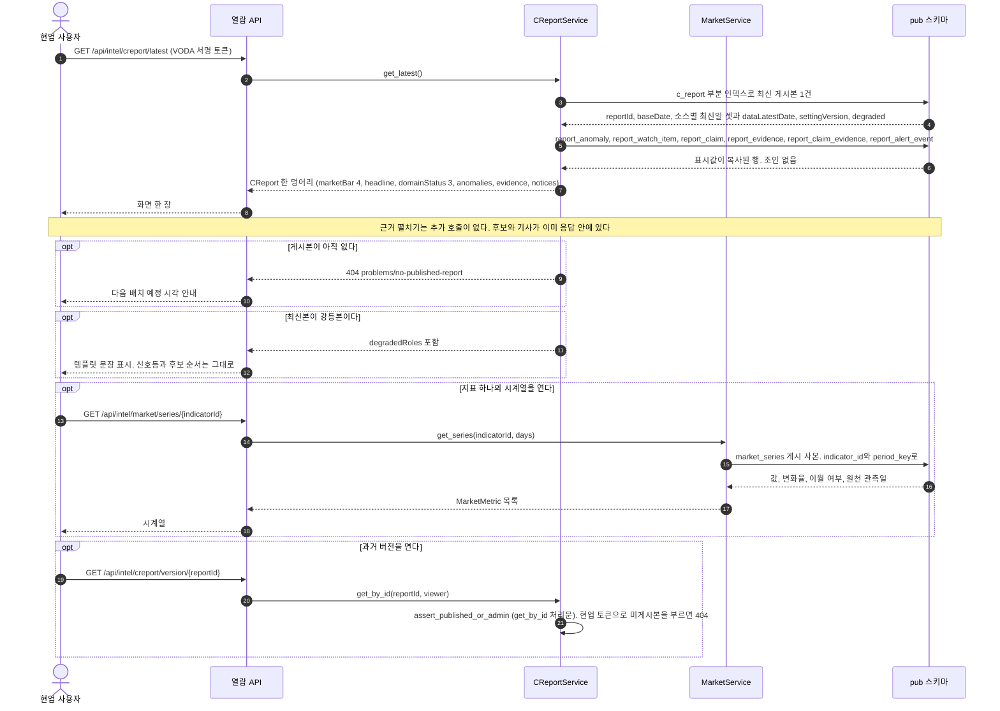

**읽을 때 볼 것.** 화살표가 [[TBL-DOM-002#CReportService]]에서 `pub` 스키마로만 간다. `mart`로 가는 화살표가 하나도 없는 것이 [[TBL-INFRA-001#C10]]이고, 조회 결과에 조인이 없는 것이 [[TBL-PRD-001#N5]]의 2초다. 후보 목록과 기사가 첫 응답에 이미 들어 있어 근거 펼치기가 서버를 다시 부르지 않는다. 게시본 없음만 404이고 나머지 예외(변동 없음·강등·판정 미수신·지표 이월)는 200으로 내려가 `notices`에 담긴다. 시장지표 시계열도 [[TBL-DOM-003#market_series]]라는 게시 사본을 읽으므로 이 경로가 `pub` 밖으로 나가는 자리가 없다. 데이터 최신일은 완성차·뉴스·시장 셋을 각각 내려보내고, 한 줄로 줄일 때만 셋 중 가장 늦은 `dataLatestDate`를 쓴다.

#### SEQ-12 A 리포트 열람

근거는 [[TBL-UC-001#UC-H4]]다. 브리핑 갈래가 쓴 문장을 게시 사본 그대로 내주고, 응답 어디에도 외부요인 인용이 없다.

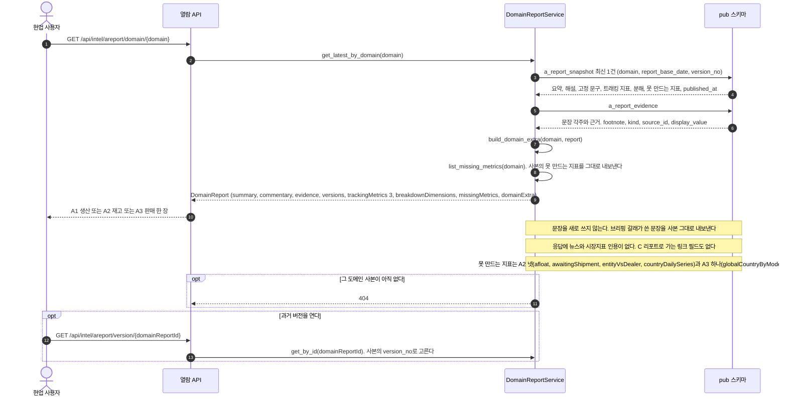

**읽을 때 볼 것.** 이 그림에 [[TBL-DOM-002#CReportService]]도 [[TBL-DOM-002#CandidateSearcher]]도 없다. A 리포트는 자기 대시보드 데이터 안에서만 말하고, 외부 원인은 C 리포트의 일이다([[TBL-PRD-001#R29]]). 화살표가 [[TBL-DOM-003#a_report_snapshot]]과 [[TBL-DOM-003#a_report_evidence]]로만 가는 것이 [[TBL-INFRA-001#C10]]이다. 열람 경로는 게시 스키마 밖으로 나가지 않고, 이 시스템은 A 리포트 문장을 새로 쓰지 않는다. 버전 알약과 사이드 버전 목록의 번호는 사본의 `version_no`, 곧 브리핑 갈래가 매긴 번호 그대로다. 빈 자리를 추정값으로 채우지 않고 `missingMetrics`에 이유를 적는 것이 이 화면의 인수 기준이다.

## 2. 배치 전체

#### SEQ-13 새벽 배치 8단계와 실패 분기

근거는 [[TBL-UC-001#UC-S1]]과 [[TBL-INFRA-001#C19]]다. 단계 이름 여덟은 `PipelineRunner.stage_names()`가 주는 것을 그대로 쓴다.

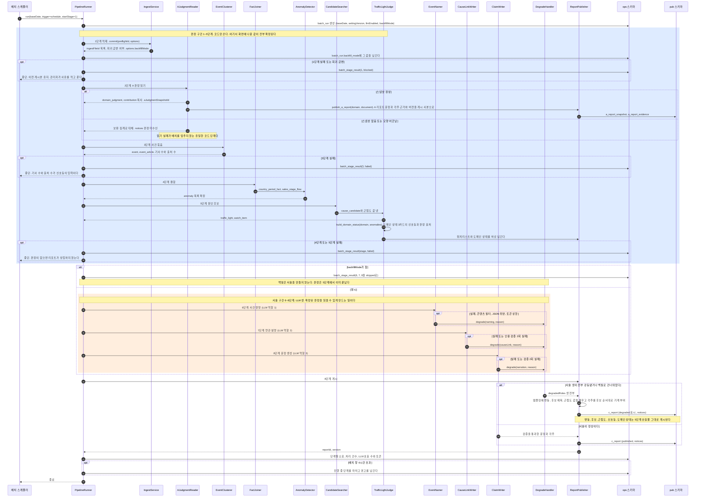

**읽을 때 볼 것.** 색이 다른 두 상자가 이 문서의 전부다. 파란 상자 안에 [[TBL-DOM-002#HChatClient]] 생명선이 없고, 주황 상자 안에 `mart`로 값을 되쓰는 화살표가 없다. 한 방향으로만 흐른다. 마지막 alt가 그 경계의 증명이다. 서술 셋이 전부 강등돼도 [[TBL-DOM-002#ReportPublisher]]로 들어오는 입력 중 판정 산출물은 바뀌지 않아 같은 신호등, 같은 후보 순서, 같은 도메인 상태가 게시된다([[TBL-INFRA-001#C13]]).

실패 처리가 단계마다 다른 것도 같이 본다. 1·3·4·5단계는 멈춤, 2단계는 보완 집계로 내려가고 계속, 6~8단계는 강등하고 계속이다. 이 갈림은 [[TBL-INFRA-001#C20]] 그대로이며, 멈춘 배치는 이전 게시본을 유지하고 실패한 단계부터 다시 돈다.

주황 상자를 감싼 alt가 백필이다. 관리 API가 받은 `backfillMode`는 [[TBL-DOM-002#IngestService]]의 `commit`을 거쳐 `batch_run.backfill_mode`로 남고, 참이면 6~8단계를 건너뛴 판정만의 게시본이 나간다. 2단계 안의 `publish_a_report` 화살표는 A 리포트 열람 경로의 입구다. C 생성은 A의 판정만 쓰고, 문장 사본은 [[#SEQ-12]]만 읽는다.

## 3. 판정 구간 (배치 1~5단계)

#### SEQ-14 형태 판별과 적재

근거는 [[TBL-UC-001#UC-A1]]과 [[TBL-INFRA-001#C6]]다. 관리 화면의 수동 적재와 배치 1단계가 같은 코드를 부른다.

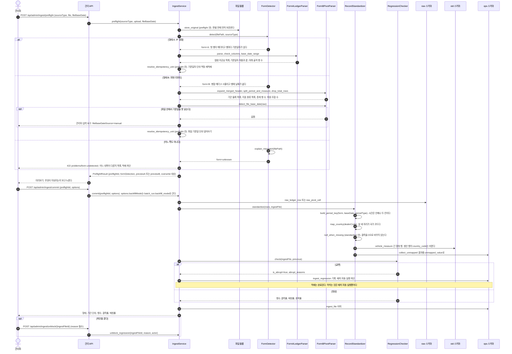

**읽을 때 볼 것.** 첫 화살표가 판별이 아니라 원본 보존이다. 판별이 실패해도 원본은 볼륨에 남는다([[TBL-PRD-001#N7]]). alt 세 갈래가 [[TBL-INFRA-001#C6]]의 두 형태와 판별 불가이고, 셋째 형태를 자동 추론하는 갈래는 일부러 없다. 두 갈래가 서로 다른 것은 위쪽뿐이고 [[TBL-DOM-002#RecordStandardizer]] 아래로는 같은 화살표다. 같은 파일이 어느 경로로 들어와도 같은 표준 행이 나와야 하기 때문이다. `preflight`과 `commit`을 둘로 나눈 이유는 형태 B가 파일 기준일 단위 통째 덮어쓰기라서 사람이 무엇이 지워지는지 보고 눌러야 해서다. 급변일 때 적재는 끝나고 배치 자동 실행만 막히는 갈림이 오른쪽 아래에 있다. `store_original` `resolve_idempotency_unit` `null_when_missing`은 계약으로 실린 함수가 아니라 소속 함수 안의 사설 헬퍼이며, 그래서 라벨 옆에 소속을 적었다.

#### SEQ-15 A 판정 읽기

근거는 [[TBL-UC-001#UC-S10]]과 [[TBL-INFRA-001#C5]]다. 배치 2단계이고 값을 다시 계산하지 않는다.

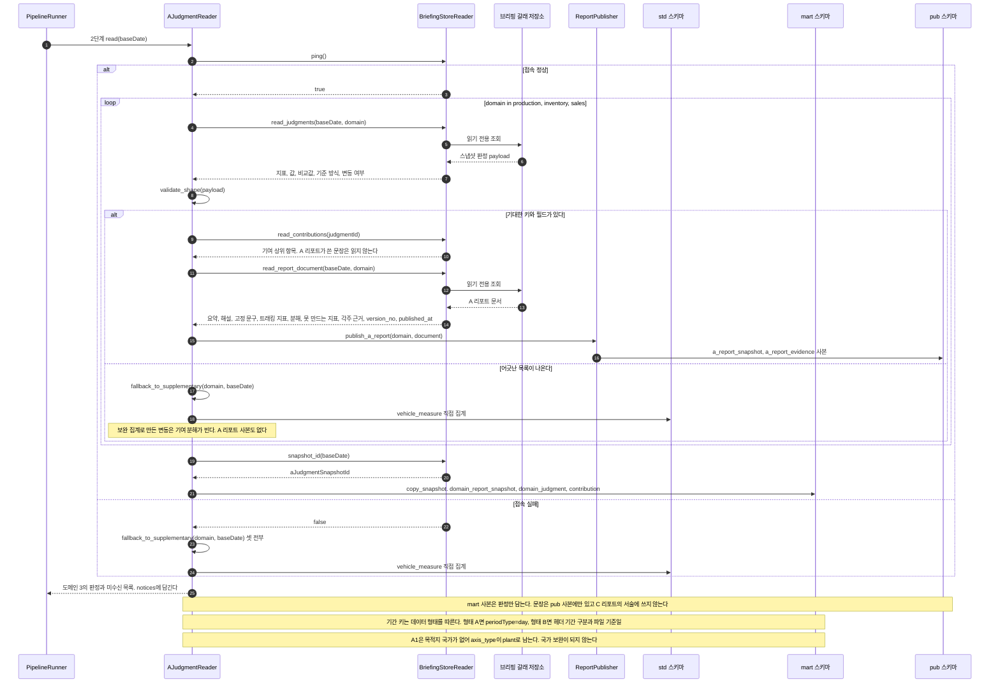

**읽을 때 볼 것.** [[TBL-DOM-002#BriefingStoreReader]] 쪽으로 가는 화살표에 쓰기가 하나도 없다. 클래스에 쓰기 메서드를 두지 않았고 계정도 읽기 전용이다. 읽어 오는 것이 둘로 갈리는 것이 이 그림의 핵심이다. `read_judgments`와 `read_contributions`가 가져온 판정은 `copy_snapshot`으로 `mart`에 앉고 C 리포트가 그것을 쓴다. `read_report_document`가 가져온 문장·각주 근거·버전은 `publish_a_report`를 타고 `pub` 사본으로 앉고 [[#SEQ-12]]만 그것을 읽는다. 원본이 나중에 바뀌어도 그날 리포트는 `aJudgmentSnapshotId`로 같은 입력을 다시 쓴다([[TBL-INFRA-001#C11]]). 실패 갈래가 둘 다 `fallback_to_supplementary`로 내려가고 배치는 계속된다. 이 단계가 배치를 멈추지 않는 유일한 코드 단계다. 마지막 Note가 [[TBL-INFRA-001#C16]]이 여기서 처음 나타나는 자리이며, A1의 판정이 `plant` 축으로 남는 순간 이후 [[#SEQ-18]]에서 신호등 대상에서 빠진다.

#### SEQ-16 사건 묶음

근거는 [[TBL-UC-001#UC-S2]]다. 배치 3단계이고 LLM 호출이 0회다.

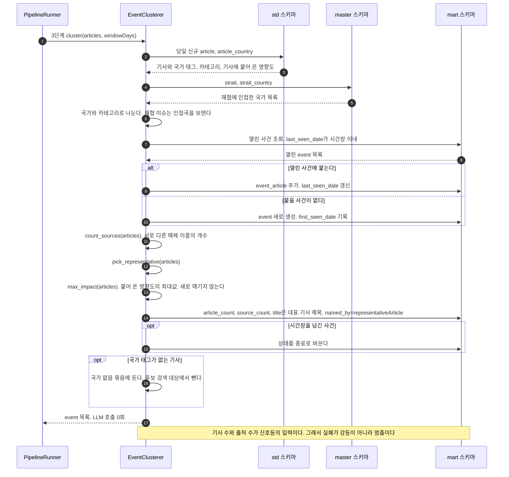

**읽을 때 볼 것.** [[TBL-DOM-002#HChatClient]] 생명선이 이 그림에 없다. 묶음은 규칙이고 이름만 LLM이며 이름은 [[#SEQ-19]]에서 따로 붙는다. 이 분리가 [[TBL-DOM-002]]가 지시받은 계층 배치에서 바꾼 한 가지다. 기사 수로만 세면 많이 보도된 나라가 자동으로 커지므로 묶어서 세고, 한 사건이 몇 개 매체에서 나왔는지를 따로 센다. `title`이 이 단계에서 이미 채워지는 것도 눈여겨본다. 명명이 실패해도 사건 제목이 비지 않고, 그때 `named_by`는 `representativeArticle`이다. 이 칸이 가질 수 있는 값은 `llm`과 `representativeArticle` 둘뿐이다. 해협에서 인접국을 펴는 화살표가 [[TBL-DOM-003#strait_country]]로 가는데, 이 값이 없으면 중동 변동의 후보가 통째로 빈다.

#### SEQ-17 결합과 단계별 흐름 계산

근거는 [[TBL-UC-001#UC-S3]]과 [[TBL-INFRA-001#C17]]이다. 배치 4단계에서 변동 목록이 확정된다.

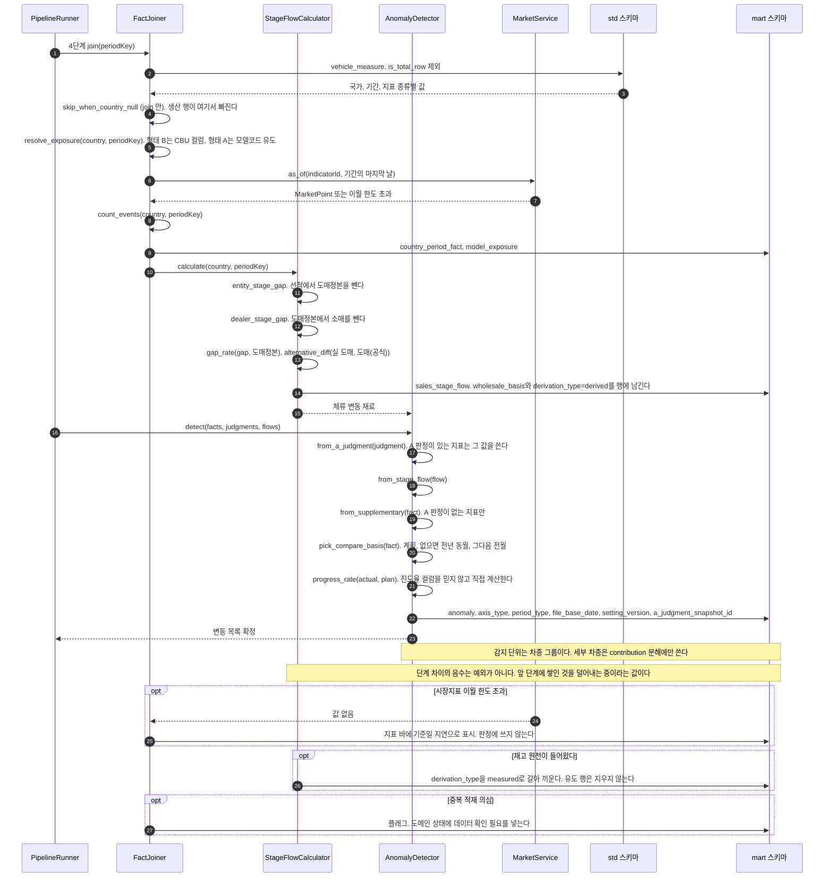

**읽을 때 볼 것.** `skip_when_country_null` 한 줄이 생산을 국가 축에서 떨어뜨린다. 목적지 국가가 데이터에 없어 유추하지 않는다는 결정이 코드 한 줄로 지켜지는 자리다([[TBL-INFRA-001#C16]]). [[TBL-DOM-002#StageFlowCalculator]]로 가는 화살표가 재고 신호가 나오는 유일한 경로다. 재고 원천이 없어 판매 네 계열의 단계 차이로 만들고, 행에 `derivation_type`을 남겨 원천이 들어왔을 때 어느 기간이 유도값이었는지 되짚을 수 있게 한다([[TBL-INFRA-001#C17]]). 실측으로는 미주 누계에서 선적 679,551, 도매 677,201, 소매 643,097이고 법인 구간이 2,350대, 딜러 구간이 34,104대(5.0%)다. `progress_rate`를 직접 계산하는 화살표도 실측 때문이다. 인입 샘플에서 진도율 컬럼은 총계 행에만 값이 있고 개별 행은 전부 0이었다.

#### SEQ-18 후보 검색, 근접도, 신호등

근거는 [[TBL-UC-001#UC-S8]]과 [[TBL-INFRA-001#C19]]다. 배치 5단계이고 여기서 판정이 끝난다.

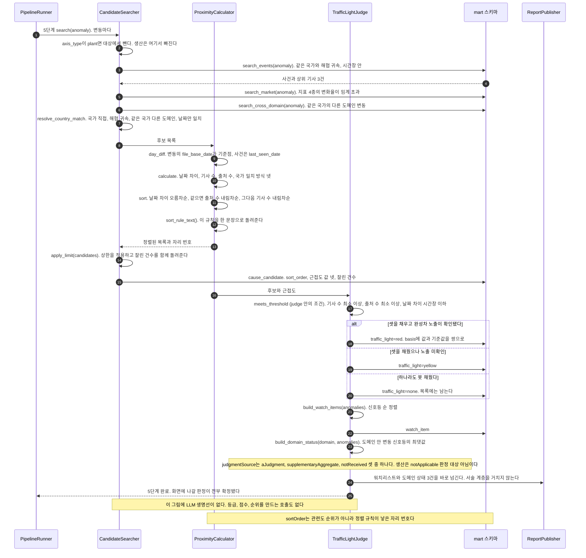

**읽을 때 볼 것.** 생명선 목록에 [[TBL-DOM-002#HChatClient]]가 없는 것이 이 시퀀스의 요지다. LLM을 끄고 같은 기준일을 돌려도 같은 신호등과 같은 후보 순서가 나와야 하며, 그 대조를 회귀 검사에 둔다([[TBL-INFRA-001#C19]]). 첫 화살표가 `plant` 축을 걸러내고, 마지막에서 두 번째 화살표가 [[TBL-DOM-002#TrafficLightJudge]]에서 [[TBL-DOM-002#ReportPublisher]]로 바로 간다.

워치리스트와 함께 도메인 상태 3건도 여기서 만들어진다. 도메인 상태 카드의 신호등은 그 도메인 안 변동 신호등의 최댓값이고, 판정 출처는 A 판정을 받았는지 보완 집계로 내려갔는지 아예 못 받았는지를 적는다. 기여 상위는 2단계에서 복사한 분해의 사본이다. 8단계 LLM은 이 셋 위에 문장만 얹는다([[#SEQ-21]]). 그래서 서술이 전부 실패해도 3카드의 신호등이 그대로 게시된다. 생산 카드는 국가 축이 없어 신호등 대상이 아니며 `notApplicable` "판정 대상 아님"으로 적는다. 후보가 없어 `none` "원인 미확인"이 된 국가와 뜻이 다르므로 같은 말로 적지 않는다.

워치리스트를 게시기가 만들면 8단계 산출물이 되고 8단계에는 LLM이 섞여 있어 "LLM을 꺼도 워치리스트가 같다"를 보장할 수 없다. alt 세 갈래가 신호등 규칙 전부이며 모델이 끼어드는 자리가 없다. 잘린 건수를 따로 돌려주는 것은 화면에 적기 위해서다. 후보가 상한에 걸려 사라진 것을 모르면 "후보가 이것뿐"이라고 읽힌다.

## 4. 서술 구간 (배치 6~8단계)

#### SEQ-19 사건 명명 (LLM 역할 1)

근거는 [[TBL-UC-001#UC-S11]]이다. 배치 6단계이고 손대는 칸은 사건 이름 하나다.

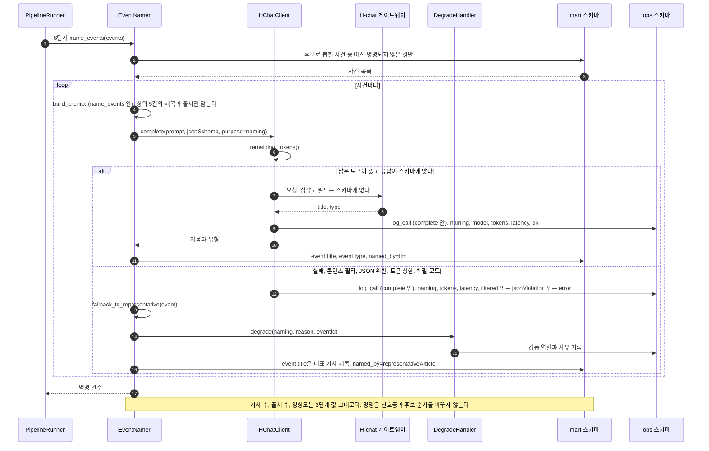

**읽을 때 볼 것.** [[TBL-DOM-002#EventClusterer]]가 이 그림에 없다. 묶음은 3단계에 끝났고 이 단계는 이미 만들어진 사건의 이름 칸만 채운다. `article_count`나 `source_count`로 가는 화살표가 없는 것이 그 증거이며, 그래서 이 단계가 통째로 실패해도 [[#SEQ-18]]의 신호등이 흔들리지 않는다. `named_by`가 갈리는 두 자리를 나란히 본다. 모델이 붙이면 `llm`, 실패해 대표 기사 제목으로 돌아가면 `representativeArticle`이다. 후보로 뽑힌 사건만 고르는 첫 화살표는 호출 수를 줄이려는 것이다. 묶인 사건 전부에 이름을 붙이면 화면에 나오지 않을 것까지 부른다.

#### SEQ-20 연관 설명 (LLM 역할 2)

근거는 [[TBL-UC-001#UC-S9]]다. 배치 7단계이고 설명은 변동마다 하나다.

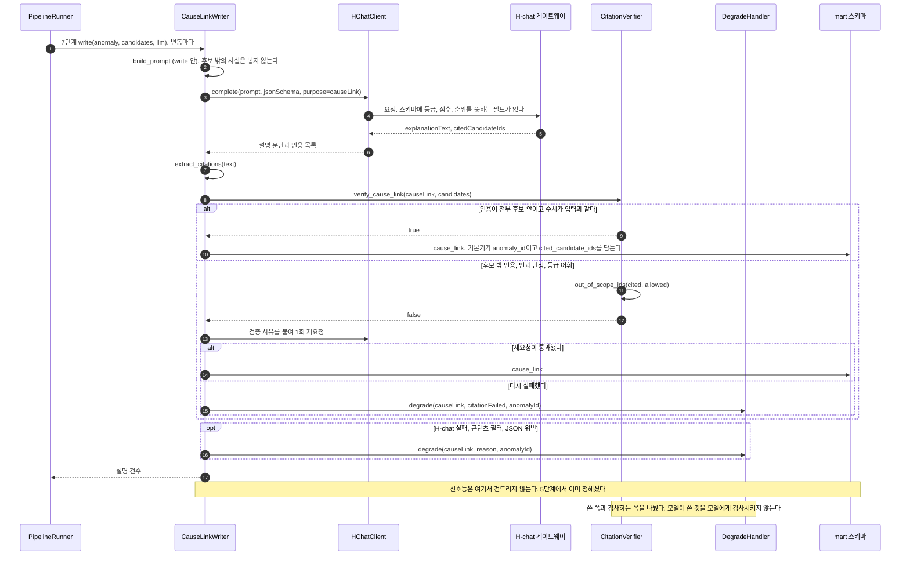

**읽을 때 볼 것.** [[TBL-DOM-002#TrafficLightJudge]]로 가는 화살표가 없다. 설명은 신호등을 읽지도 바꾸지도 않는다. [[TBL-DOM-002#CitationVerifier]]가 별도 생명선으로 서 있는 것이 계층 규칙이며, 검사를 코드가 해야 검사가 성립한다. 첫 화살표가 LLM 포트를 인자로 받는 것도 같은 규칙이다. 쓰는 쪽이 어댑터를 속성으로 들고 있지 않아야 LLM을 끈 실행이 성립한다. 프롬프트에 후보 목록만 넣는 것도 같은 이유다. 후보 밖의 값을 넣으면 검증기가 잡을 수 없는 문장이 나온다. 강등으로 끝난 변동은 설명 자리만 비고 후보 목록과 근접도 값 넷은 화면에 그대로 남는다. `cause_link`의 기본키가 `anomaly_id`라는 것이 후보마다 등급을 매기던 구조가 사라진 자리다.

#### SEQ-21 문장 생성, 검증, 강등 (LLM 역할 3)

근거는 [[TBL-UC-001#UC-S4]]와 [[TBL-UC-001#UC-S7]]이다. 배치 8단계이고 각주 번호는 코드가 먼저 매긴다.

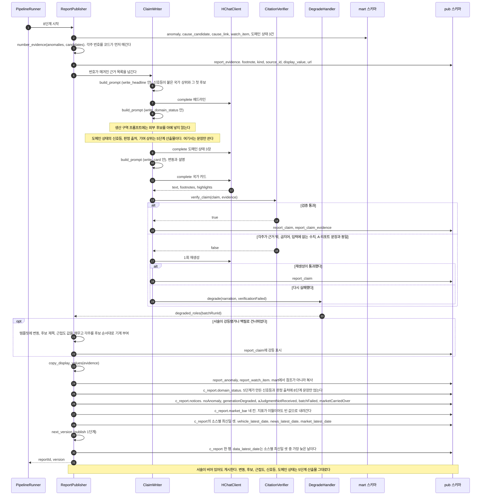

**읽을 때 볼 것.** `number_evidence`가 첫 화살표이고 `complete`가 그 뒤다. 순서가 뒤집히면 모델이 번호를 만들게 되고 없는 각주가 생긴다([[TBL-PRD-001#N4]]). 생산 구역의 Note가 [[TBL-INFRA-001#C16]]을 코드로 지키는 방법이다. 프롬프트에 외부 후보를 넣지 않는 것으로 지키지 검증기로 뒤에서 거르지 않는다.

도메인 상태를 쓰는 화살표가 둘로 갈리는 것도 같이 본다. [[TBL-DOM-002#ClaimWriter]]는 문장만 만들고, 신호등·판정 출처·기여 상위는 5단계가 넘긴 값을 [[TBL-DOM-002#ReportPublisher]]가 그대로 적는다. `notices`도 게시기가 채운다. 다섯 코드가 화면의 예외 상태와 1대1이라 E1 변동 없음, E3 생성 실패 강등, E4 판정 미수신, E5 배치 실패, E6 지표 바 지연이 코드 하나씩을 가져간다. `domain`은 E4에서 어느 카드에 붙일지에, `lastSuccessDate`는 E5의 마지막 성공일에 쓰인다.

`mart`에서 `pub`으로 가는 화살표에 "복사"라고 적힌 것이 [[TBL-INFRA-001#C10]]이다. 참조로 두면 열람이 `mart`를 읽어야 한다. 마지막 두 화살표가 강등 여부와 무관하게 언제나 그려지는 것이 이 그림의 결론이다.

## 5. 운영 시퀀스

#### SEQ-22 재실행, 재생성, 게시 전환

근거는 [[TBL-UC-001#UC-A4]]와 [[TBL-PRD-001#N3]]이다. 기존 게시본을 덮어쓰지 않는다.

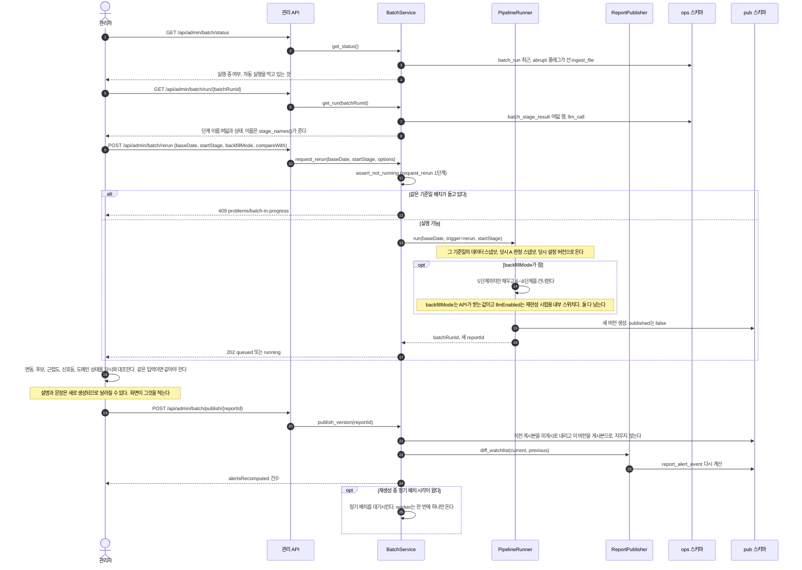

**읽을 때 볼 것.** 지정 단계부터 다시 돌리는 것과 특정 일자를 재생성하는 것이 같은 화살표다. 시작 단계가 1이면 재생성이고 6이면 서술만 다시 도는 것이다. 실행과 게시 전환이 두 호출로 나뉜 것이 핵심이다. 자동 전환이면 재생성이 게시본을 덮는다. 가운데 자기 호출 둘이 재현성의 검사 지점이다. 판정 넷과 도메인 상태는 같아야 하고 설명과 문장은 달라도 된다([[TBL-PRD-001#N3]]).

스위치 둘의 쓰임이 갈린다. `backfillMode`는 관리 API가 요청 본문으로 받아 배치 실행에 남는 값이고 6~8단계를 건너뛰게 한다. `llmEnabled`는 요청 본문에 없는 내부 스위치이며, LLM을 끈 실행과 켠 실행의 신호등·후보 순서·도메인 상태가 같은지 대조하는 회귀 시험에만 쓴다([[TBL-INFRA-001#C19]]). 둘을 하나로 합치지 않는다. `diff_watchlist`가 [[#SEQ-24]]와 같은 함수인데 여기서 다시 돌아 같은 기준일의 알림이 두 번 계산될 수 있다. 되먹일 것 F5다.

#### SEQ-23 마스터 보강

근거는 [[TBL-UC-001#UC-A2]]다. 과거 판정은 바뀌지 않고 다음 배치부터 적용된다.

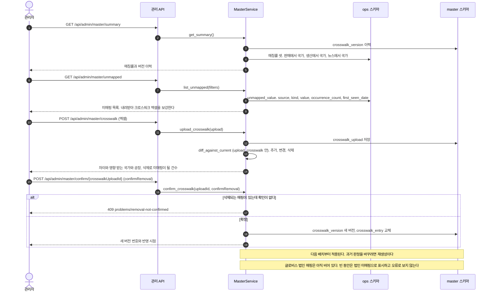

**읽을 때 볼 것.** 확정 전에 `diff_against_current`가 반드시 한 번 돈다. 크로스워크는 통째 교체라서 한 줄 빠진 파일을 올리면 그 국가의 과거 매핑이 조용히 사라진다. 409 갈래가 그것을 막는다. `mart`나 `pub`으로 가는 화살표가 없는 것도 본다. 마스터를 고쳐도 이미 게시된 리포트는 그대로다. 반영하려면 [[#SEQ-22]]의 재생성을 거쳐야 하고, 어디까지 다시 돌릴지는 아직 미결이다.

#### SEQ-24 워치리스트 변화 이벤트

근거는 [[TBL-UC-001#UC-S5]]다. 8단계 게시 직후에 돌고 채널 어댑터 없이도 실패하지 않는다.

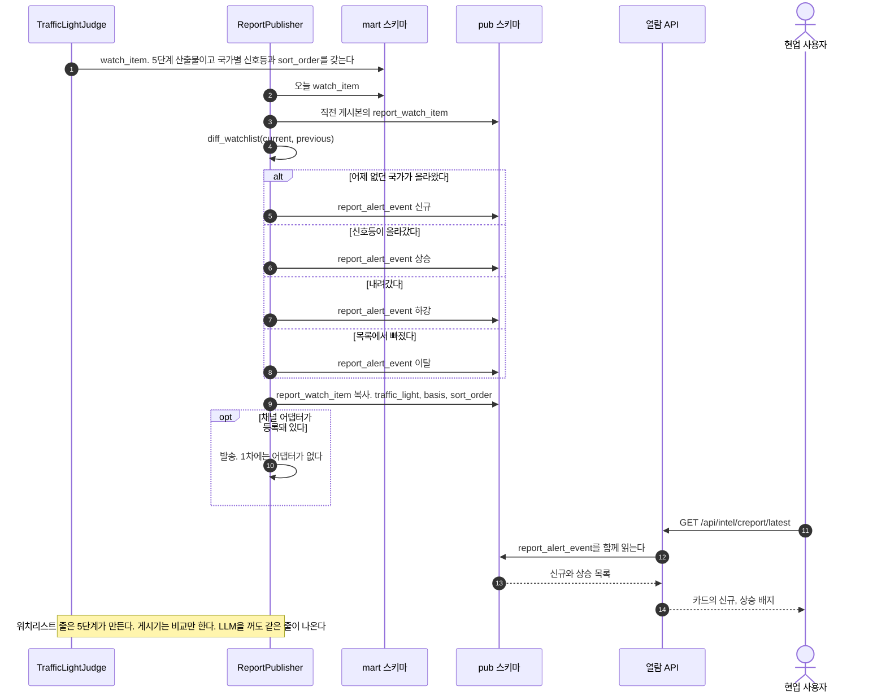

**읽을 때 볼 것.** 첫 화살표가 [[TBL-DOM-002#TrafficLightJudge]]에서 나온다. 워치리스트를 만드는 것과 어제와 비교하는 것을 서로 다른 단계에 둔 것이 이 그림의 계약이다. 만들기가 5단계에 있어야 LLM 상태와 무관하고, 비교는 게시 시점에만 뜻이 있어 8단계에 있다. 채널 발송이 `opt`인 것은 1차에 어댑터가 없기 때문이며, 없다고 이 경로가 실패하지 않는다. 마지막 세 화살표는 [[#SEQ-11]]의 한 조각이다. 배지는 별도 호출이 아니라 리포트 응답에 실려 온다.

## 6. 대응표

| 시퀀스 | 배치 단계 | 유스케이스 | API 또는 화면 | 주 클래스 |
|:--|:--|:--|:--|:--|
| [[#SEQ-11]] | 없음 | [[TBL-UC-001#UC-H1]] [[TBL-UC-001#UC-H2]] | [[TBL-API-001#GET/api/intel/creport/latest]] [[TBL-API-001#GET/api/intel/creport/version/{reportId}]] [[TBL-API-001#GET/api/intel/market/series/{indicatorId}]] | [[TBL-DOM-002#CReportService]] [[TBL-DOM-002#MarketService]] |
| [[#SEQ-12]] | 없음 | [[TBL-UC-001#UC-H4]] | [[TBL-API-001#GET/api/intel/areport/domain/{domain}]] [[TBL-API-001#GET/api/intel/areport/version/{domainReportId}]] | [[TBL-DOM-002#DomainReportService]] |
| [[#SEQ-13]] | 1~8 전부 | [[TBL-UC-001#UC-S1]] | [[TBL-API-001#GET/api/admin/batch/status]] | [[TBL-DOM-002#PipelineRunner]] |
| [[#SEQ-14]] | 1 | [[TBL-UC-001#UC-A1]] [[TBL-UC-001#UC-S6]] | [[TBL-API-001#POST/api/admin/ingest/preflight]] [[TBL-API-001#POST/api/admin/ingest/commit]] [[TBL-API-001#POST/api/admin/ingest/unblock/{ingestFileId}]] | [[TBL-DOM-002#IngestService]] [[TBL-DOM-002#FormDetector]] [[TBL-DOM-002#FormALedgerParser]] [[TBL-DOM-002#FormBPivotParser]] [[TBL-DOM-002#RecordStandardizer]] [[TBL-DOM-002#RegressionChecker]] |
| [[#SEQ-15]] | 2 | [[TBL-UC-001#UC-S10]] | 없음 | [[TBL-DOM-002#AJudgmentReader]] [[TBL-DOM-002#BriefingStoreReader]] [[TBL-DOM-002#ReportPublisher]] |
| [[#SEQ-16]] | 3 | [[TBL-UC-001#UC-S2]] | 없음 | [[TBL-DOM-002#EventClusterer]] |
| [[#SEQ-17]] | 4 | [[TBL-UC-001#UC-S3]] | 없음 | [[TBL-DOM-002#FactJoiner]] [[TBL-DOM-002#StageFlowCalculator]] [[TBL-DOM-002#AnomalyDetector]] |
| [[#SEQ-18]] | 5 | [[TBL-UC-001#UC-S8]] | 없음 | [[TBL-DOM-002#CandidateSearcher]] [[TBL-DOM-002#ProximityCalculator]] [[TBL-DOM-002#TrafficLightJudge]] |
| [[#SEQ-19]] | 6 | [[TBL-UC-001#UC-S11]] [[TBL-UC-001#UC-S7]] | 없음 | [[TBL-DOM-002#EventNamer]] [[TBL-DOM-002#HChatClient]] [[TBL-DOM-002#DegradeHandler]] |
| [[#SEQ-20]] | 7 | [[TBL-UC-001#UC-S9]] [[TBL-UC-001#UC-S7]] | 없음 | [[TBL-DOM-002#CauseLinkWriter]] [[TBL-DOM-002#CitationVerifier]] [[TBL-DOM-002#DegradeHandler]] |
| [[#SEQ-21]] | 8 | [[TBL-UC-001#UC-S4]] [[TBL-UC-001#UC-S7]] | 없음 | [[TBL-DOM-002#ClaimWriter]] [[TBL-DOM-002#CitationVerifier]] [[TBL-DOM-002#ReportPublisher]] |
| [[#SEQ-22]] | 1~8 재실행 | [[TBL-UC-001#UC-A4]] | [[TBL-API-001#POST/api/admin/batch/rerun]] [[TBL-API-001#POST/api/admin/batch/publish/{reportId}]] [[TBL-API-001#GET/api/admin/batch/history]] [[TBL-API-001#GET/api/admin/batch/run/{batchRunId}]] | [[TBL-DOM-002#BatchService]] [[TBL-DOM-002#PipelineRunner]] |
| [[#SEQ-23]] | 없음 | [[TBL-UC-001#UC-A2]] | [[TBL-API-001#GET/api/admin/master/summary]] [[TBL-API-001#GET/api/admin/master/unmapped]] [[TBL-API-001#POST/api/admin/master/crosswalk]] [[TBL-API-001#POST/api/admin/master/confirm/{crosswalkUploadId}]] | [[TBL-DOM-002#MasterService]] |
| [[#SEQ-24]] | 8 게시 직후 | [[TBL-UC-001#UC-S5]] | 없음 | [[TBL-DOM-002#TrafficLightJudge]] [[TBL-DOM-002#ReportPublisher]] |

시퀀스 열넷에서 [[TBL-DOM-002#HChatClient]] 생명선이 서는 것은 [[#SEQ-19]] [[#SEQ-20]] [[#SEQ-21]] 셋뿐이고, 그 셋이 모두 [[TBL-DOM-002#DegradeHandler]]로 가는 화살표를 갖는다. 판정 다섯([[#SEQ-14]]~[[#SEQ-18]])에는 그 생명선이 없다. 이 대조가 [[TBL-INFRA-001#C19]]가 시퀀스에서 보이는 모습이다.

[[TBL-API-001#GET/api/admin/ingest/history]]와 [[TBL-API-001#GET/api/admin/ingest/file/{ingestFileId}]]는 [[#SEQ-14]]의 결과를 되읽는 단순 조회라 따로 그리지 않았다. `IngestService.list_history`와 `get_file` 호출 한 번으로 끝난다.

## 7. 되먹일 것

| # | 어느 문서 | 무엇이 어긋났나 | 이 문서가 임시로 택한 것 |
|:--|:--|:--|:--|
| F2 | [[TBL-UC-001#UC-S4]] | 4단계의 저장 대상이 `briefing`, `briefing_claim`, `evidence`로 적혀 있다. ERD 확정 이름은 [[TBL-DOM-003#c_report]] [[TBL-DOM-003#report_claim]] [[TBL-DOM-003#report_evidence]]다 | [[#SEQ-21]]은 ERD 이름을 썼다 |
| F3 | [[TBL-UC-001#UC-S1]] · [[TBL-DOM-002#IngestService]] | 회귀 급변의 처리가 갈린다. UC는 1a에서 "배치를 멈추고 A에게 알린다", 클래스 명세는 "적재는 완료하고 배치 자동 실행만 막는다"다. 수동 적재와 배치 1단계 중 어느 쪽 이야기인지 문장으로 갈리지 않는다 | 수동 적재는 완료하고 차단만, 배치 안에서는 멈춤으로 그렸다([[#SEQ-13]] [[#SEQ-14]]) |
| F5 | [[TBL-DOM-002#ReportPublisher]] · [[TBL-API-001#POST/api/admin/batch/publish/{reportId}]] | `diff_watchlist`가 8단계 게시와 게시 전환 양쪽에서 돈다. [[TBL-DOM-003#report_alert_event]]에 같은 기준일 재계산을 막을 멱등 키가 없어 알림이 두 벌 남을 수 있다 | [[#SEQ-22]]와 [[#SEQ-24]]에 둘 다 그리고 중복 가능성을 적었다 |
| F6 | [[TBL-DOM-002#MarketService]] | `as_of`와 `is_carried_over`는 [[TBL-DOM-002#FactJoiner]]가 쓰는 파이프라인 함수인데 API 바인딩 목록에는 `get_series`만 있다. [[TBL-MS-001]]이 파이프라인 계약으로 실어야 한다 | [[#SEQ-17]]에 `as_of` 호출을 그렸다 |
| F8 | [[TBL-DOM-002]] | 생명선으로 세울 수 없는 타입 넷이 있다. `SchemaRegistry`, `CrosswalkTable`, `BriefingStorePort`, `LlmPort`다. 앞의 둘은 클래스 스물여덟 밖의 실체이고 뒤의 둘은 포트다 | 포트 둘은 구현체([[TBL-DOM-002#BriefingStoreReader]] [[TBL-DOM-002#HChatClient]])로 그렸고 앞의 둘은 그리지 않았다 |

F1·F4·F7은 닫혔다. F1은 게시 스키마에 A 리포트 사본([[TBL-DOM-003#a_report_snapshot]] [[TBL-DOM-003#a_report_evidence]])과 지표 시계열 사본([[TBL-DOM-003#market_series]])을 두는 쪽으로 정해져 열람 경로가 [[TBL-INFRA-001#C10]]과 어긋나지 않는다. F4는 `backfillMode`와 `llmEnabled`를 둘 다 남기고 쓰임을 가르는 쪽으로, F7은 1단계와 3단계 실패를 멈춤으로 정해졌다([[TBL-INFRA-001#C20]]). 닫힌 번호는 다시 쓰지 않는다.

## 8. 미결사항

- [ ] [[#SEQ-15]]의 `read_judgments`와 `read_report_document` 반환 모양. 브리핑 갈래가 무엇을 어떤 키로 내주는지 정해져야 `validate_shape`의 대조 목록과 loop 안 화살표, 그리고 사본 컬럼과의 1대1 대응이 확정된다
- [ ] [[#SEQ-14]]에서 형태 A 파일을 아직 본 적이 없다. 실물이 들어오면 `check_columns` 화살표의 대조 목록이 바뀔 수 있다
- [ ] [[#SEQ-18]]의 임계값 실제 수치. 최소 기사 수, 최소 출처 수, 시간창, CBU 비중 기준이 전부 현업 검토 대기이며 이 값이 정해져야 신호등 alt 세 갈래의 비율을 가늠할 수 있다
- [ ] [[#SEQ-19]]부터 [[#SEQ-21]]까지의 H-chat JSON 모드. 게이트웨이가 응답 스키마 지정을 지원한다는 것은 가정이다. 지원되지 않으면 세 시퀀스의 검증 화살표가 전부 늘어난다
- [ ] [[#SEQ-22]]의 설정 변경 경로. 화면과 API가 없어 [[TBL-DOM-003#threshold_setting]] 새 버전 행을 SQL로 넣을지 CLI를 만들지가 정해지지 않았다. 정해지면 시퀀스가 하나 는다
- [ ] [[#SEQ-23]] 확정 후 재계산 범위. 과거 기준일을 어디까지 다시 돌릴지가 정해지면 [[#SEQ-22]]와 잇는 화살표가 생긴다
- [ ] [[#SEQ-24]]의 채널 발송. 1차에 어댑터가 없고 무엇을 붙일지도 미결이다
