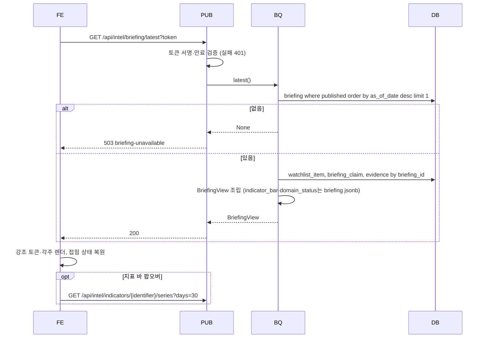
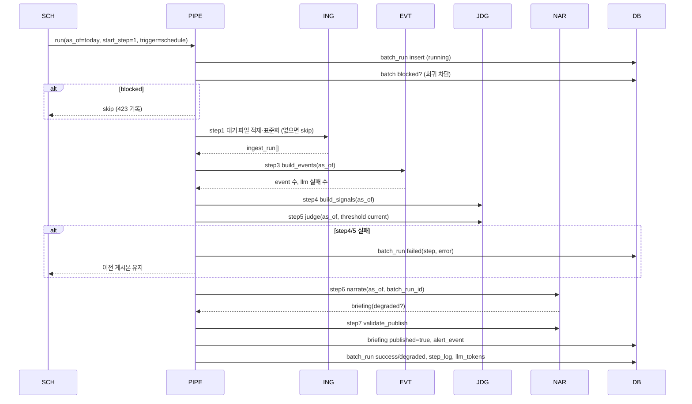
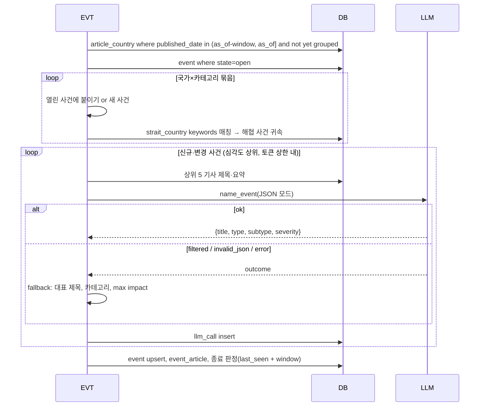
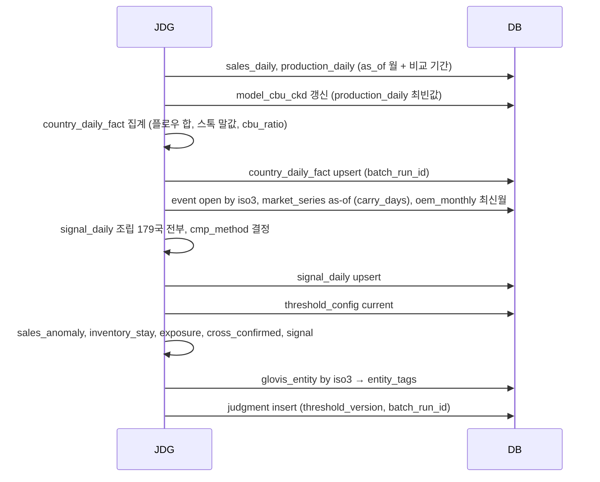
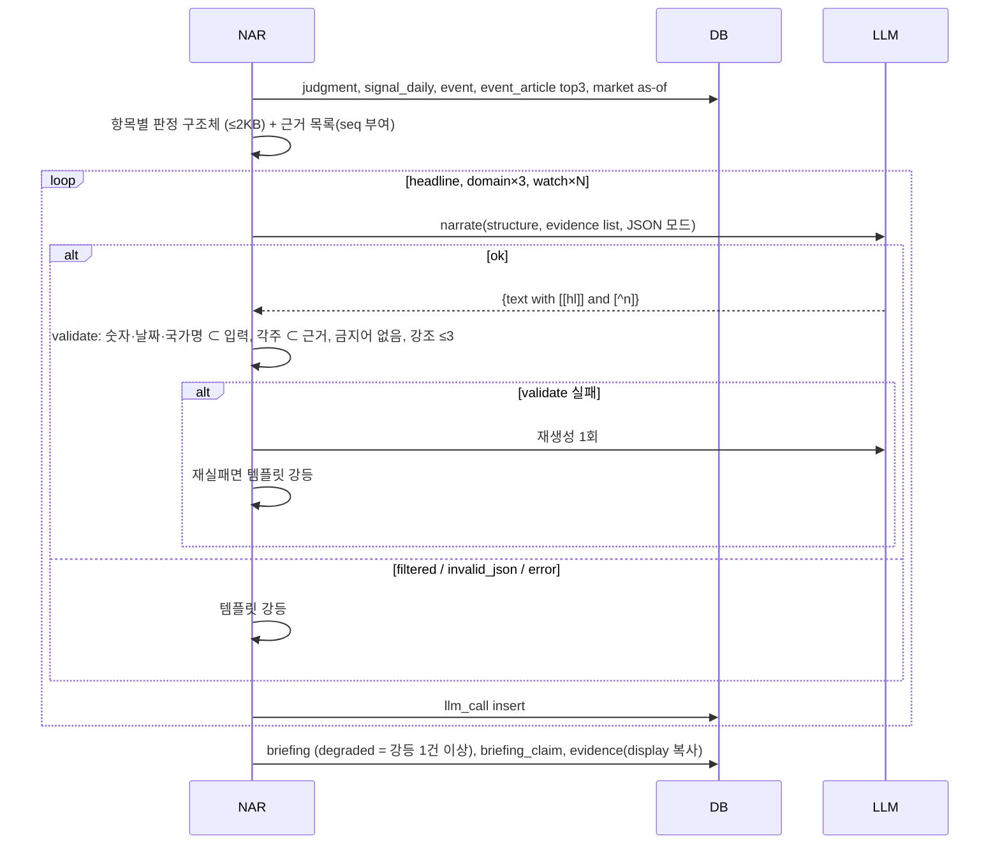
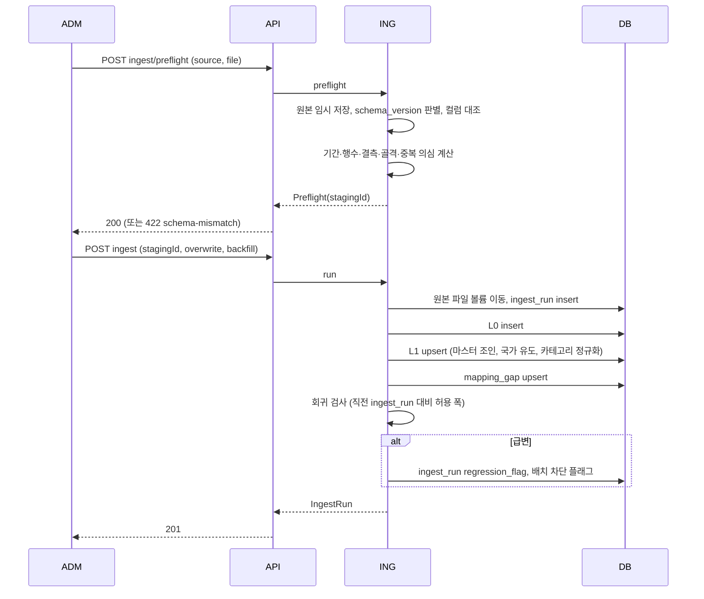
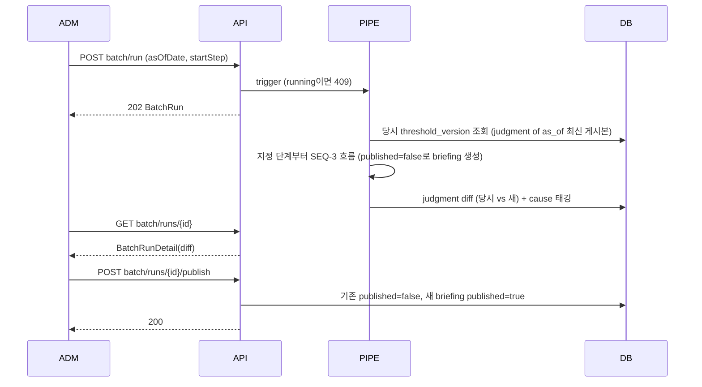
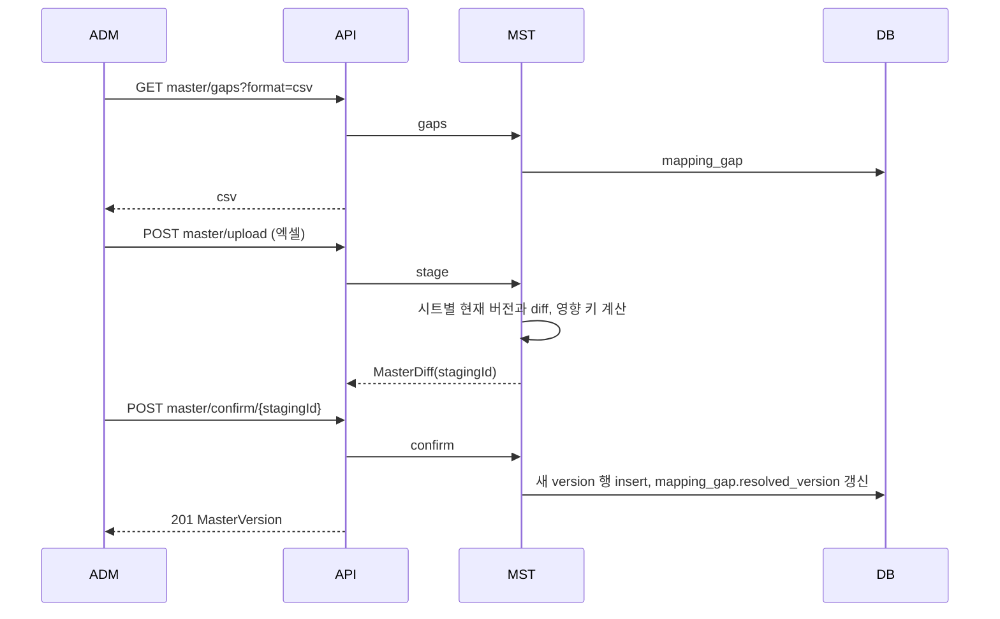
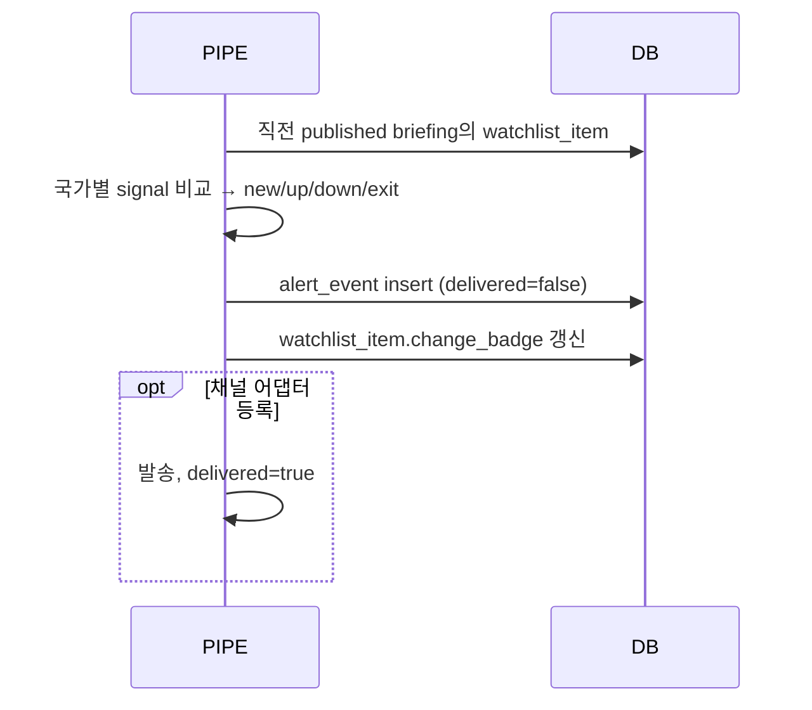

# SEQUENCE

## 0. 이 문서가 다루는 것

유스케이스별 객체 간 호출 순서다. 열람 경로가 LLM과 무거운 집계를 거치지 않는 것, 배치의 LLM 지점과 강등 분기, 두 시간축(기준일·배치 ID)이 어디서 찍히는지를 보인다.

이 버전은 끊어진 참조만 해결한 것이다(SEQ-2 판매 상세 제거, 설정 생명선 제거). 새 방향(A 판정 읽기, 후보 검색, 연관 판단을 포함한 8단계와 LLM 세 지점)의 전면 반영은 다음 버전에서 한다. 삭제된 SEQ-2의 ID는 재사용하지 않는다.

### 0.1 생명선

| 생명선 | 약어 | 실체 | 종류 | 정의한 곳 |
|---|---|---|---|---|
| 현업 브라우저 | FE | UI-1 React 앱 | 화면 | [[TBL-UI-001#UI-1]] |
| 관리 브라우저 | ADM | UI-3~5 | 화면 | [[TBL-UI-001#UI-3]] |
| 열람 API | PUB | web/public 라우터 | 라우터 | [[TBL-API-001]] |
| 관리 API | API | web/admin 라우터 | 라우터 | [[TBL-API-001]] |
| 브리핑 조회 | BQ | BriefingQuery | 서비스 | [[TBL-MS-001#BriefingQuery.latest]] |
| 적재 | ING | IngestService | 서비스 | [[TBL-MS-001#IngestService.run]] |
| 스케줄러 | SCH | APScheduler 프로세스 | 워커 | [[TBL-INFRA-001#C8]] |
| 파이프라인 | PIPE | Pipeline(단계 오케스트레이터) | 서비스 | [[TBL-MS-001#Pipeline.run]] |
| 사건 통합 | EVT | EventBuilder | 서비스 | [[TBL-MS-001#EventBuilder.build_events]] |
| 결합·판정 | JDG | SignalBuilder + Judge | 서비스 | [[TBL-MS-001#Judge.judge]] |
| 서술 | NAR | Narrator + Validator | 서비스 | [[TBL-MS-001#Narrator.narrate]] |
| LLM 어댑터 | LLM | HchatClient (OpenAI 호환) | 어댑터 | [[TBL-INFRA-001#C3]] |
| DB | DB | postgres raw/std/master/mart/pub/ops | 저장소 | [[TBL-DOM-001]] |
| 마스터 | MST | MasterService | 서비스 | [[TBL-MS-001#MasterService.stage]] |

## 1. 대응표

| 시퀀스 | 유스케이스 | API | 화면 |
|:--|:--|:--|:--|
| [[#SEQ-1]] | [[TBL-UC-001#UC-H1]] | [[TBL-API-001#GET/api/intel/briefing/latest]] | UI-1 |
| [[#SEQ-3]] | [[TBL-UC-001#UC-S1]] | 없음(스케줄) | UI-4 |
| [[#SEQ-4]] | [[TBL-UC-001#UC-S2]] | 없음 | |
| [[#SEQ-5]] | [[TBL-UC-001#UC-S3]] | 없음 | |
| [[#SEQ-6]] | [[TBL-UC-001#UC-S4]] [[TBL-UC-001#UC-S7]] | 없음 | |
| [[#SEQ-7]] | [[TBL-UC-001#UC-A1]] [[TBL-UC-001#UC-S6]] | [[TBL-API-001#POST/api/admin/intel/ingest/preflight]] [[TBL-API-001#POST/api/admin/intel/ingest]] | UI-3 |
| [[#SEQ-8]] | [[TBL-UC-001#UC-A4]] | [[TBL-API-001#POST/api/admin/intel/batch/run]] [[TBL-API-001#POST/api/admin/intel/batch/runs/{runId}/publish]] | UI-4 |
| [[#SEQ-9]] | [[TBL-UC-001#UC-A2]] | [[TBL-API-001#POST/api/admin/intel/master/upload]] [[TBL-API-001#POST/api/admin/intel/master/confirm/{stagingId}]] | UI-5 |
| [[#SEQ-10]] | [[TBL-UC-001#UC-S5]] | 없음 | UI-1 배지 |

#### SEQ-1 브리핑 열람

근거: [[TBL-UC-001#UC-H1]]. 열람은 pub 스키마 조회 1회다.

**읽을 때 볼 것**: LLM, mart, std를 전혀 읽지 않는다. evidence.display에 표시값이 복사돼 있어 조인이 없다. degraded면 FE가 안내 문구를 붙인다.

#### SEQ-3 새벽 배치 전체

근거: [[TBL-UC-001#UC-S1]]. 단계 오케스트레이션과 실패 분기.

**읽을 때 볼 것**: step4·5 실패만 배치를 멈춘다. step3·6 실패는 강등으로 계속된다. batch_run_id가 mart·pub 모든 행에 찍힌다(두 번째 시간축). 다음 버전에서 A 판정 읽기(2단계)·후보 검색(5단계)·연관 판단(7단계)을 넣어 UC-S1의 8단계와 맞춘다.

#### SEQ-4 사건 통합 (LLM 지점 1)

근거: [[TBL-UC-001#UC-S2]].

**읽을 때 볼 것**: 백필 모드면 LLM 루프를 건너뛴다. 토큰 상한에 닿으면 남은 사건은 fallback으로 이름 붙인다. 다음 버전에서 명명 루프를 후보 사건(UC-S11)으로 옮긴다.

#### SEQ-5 결합과 판정

근거: [[TBL-UC-001#UC-S3]].

**읽을 때 볼 것**: 판정에 LLM이 없다. 임계값은 판정 시점 버전을 함께 저장한다. 데이터 품질 플래그는 country_daily_fact에서 judgment.domain_state로 흘러간다.

#### SEQ-6 서술·검증·강등 (LLM 지점 2)

근거: [[TBL-UC-001#UC-S4]] [[TBL-UC-001#UC-S7]].

**읽을 때 볼 것**: 근거 seq는 LLM 호출 전에 코드가 부여한다. LLM은 번호를 고를 뿐 만들지 않는다. evidence.display는 이 시점에 복사돼 열람 경로가 조인을 안 한다.

#### SEQ-7 적재와 회귀 검사

근거: [[TBL-UC-001#UC-A1]] [[TBL-UC-001#UC-S6]].

**읽을 때 볼 것**: preflight와 run이 분리돼 있어 사람이 확인하고 실행한다. 회귀 급변은 적재를 막지 않고 자동 배치만 막는다.

#### SEQ-8 재실행·재생성·게시 전환

근거: [[TBL-UC-001#UC-A4]].

**읽을 때 볼 것**: 재생성은 새 batch_run·새 briefing version이다. 게시 전환은 별도 확인 호출이다. cause 태깅은 마스터 버전·threshold_version·ingest_run 시각 비교로 기계 판정한다.

#### SEQ-9 마스터 보강

근거: [[TBL-UC-001#UC-A2]].

**읽을 때 볼 것**: 마스터는 갱신이 아니라 버전 추가다. 과거 판정은 threshold_version처럼 마스터 버전을 참조하지 않으므로(미결: judgment에 master 버전도 저장할지) 재계산은 SEQ-8로만 한다.

#### SEQ-10 워치리스트 변화 이벤트

근거: [[TBL-UC-001#UC-S5]].

**읽을 때 볼 것**: 채널이 없어도 이벤트와 배지는 남는다.

## 2. 되먹일 것

- DOM: judgment에 사용한 마스터 버전(country, factory, glovis_entity)도 저장할지. SEQ-8의 cause 태깅이 정확해지려면 필요하다. → [[TBL-DOM-001#judgment]] 컬럼 추가 후보.
- DOM: 배치 차단 플래그의 저장 위치. threshold_config가 아니라 ops.batch_state 단일 행 테이블이 낫다. → 테이블 추가 후보. MS는 이미 batch_state를 전제로 썼다([[TBL-MS-001#IngestService.regression_check]]).
- API: preflight의 stagingId 만료 시간(가정 1시간)을 스키마에 명시.
- UI: SEQ-1에서 503일 때 UI-1의 빈 화면 문구는 UI-1 요소 5에 이미 있음. 확인 완료.
- MS: ConfigService.save는 설정 화면·API가 없어졌으므로 다음 버전에서 제거 후보. 설정은 배치가 현재 버전을 읽기만 한다.

## 3. 미결사항

- [ ] judgment에 마스터 버전 3종 저장 여부 (되먹일 것 1)
- [ ] 배치 차단 상태 저장 테이블 (되먹일 것 2)
- [ ] SEQ-4 토큰 상한 도달 시 "심각도 상위"의 기준(impact 합 vs 기사 수). 가정: max impact 내림차순
- [ ] SEQ-6 재생성 1회의 프롬프트 변형 방식(온도 낮춤 vs 검증 실패 사유 첨부). 가정: 사유 첨부
- [ ] SEQ-8 정기 배치와 재실행 동시 발생 시 대기 큐 구현(단일 프로세스 락)
