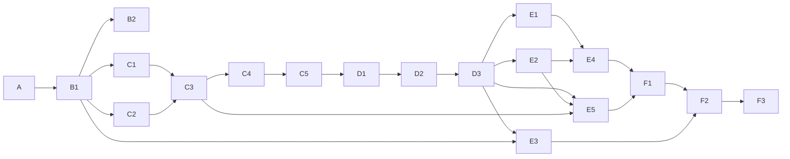

# 구현 계획

## 0. 이 문서가 다루는 것

[[TBL-MS-002]]의 함수 111개를 어떤 순서로 어떤 묶음으로 만들고, 묶음마다 무엇으로 끝났다고 볼지를 정한다. 묶음을 슬라이스라 부른다. 슬라이스 하나는 시나리오 하나 또는 배치 단계 하나가 끝에서 끝까지 도는 단위이고, 카드의 구현 함수 칸이 [[TBL-MS-002]] 항목을 빠짐없이 가리킨다. 함수 하나가 두 슬라이스에 걸리지 않는다.

슬라이스는 열아홉이다. A 기반 하나, B 적재·마스터 둘, C 판정 다섯, D 서술 셋, E 열람·관리 다섯, F Nabi Agent 이식 셋이다. 순서가 곧 의존이다. 판정 다섯(C1~C5)이 서술 셋(D1~D3)보다 먼저 끝나고, C5가 끝나면 LLM 없이 배치 1~5단계가 돌아 판정이 전부 나온다. 이것이 [[TBL-INFRA-002#C19]]를 구현 순서로 옮긴 것이다. 서술 슬라이스는 그 위에 얹히고, 셋을 전부 빼도 C5까지의 산출물이 그대로 게시되도록 D3가 만든다.

코드 구조는 [[TBL-DOM-005]] 1장 폴더 구조를 그대로 따른다. 호출 방향은 `router → service → crud`, 화면은 `pages → api → 서버` 한 방향이다. 커밋과 PR에 에이전트 표시를 남기지 않는다(공통 규약 1.10). 커밋 메시지의 첫 줄에 슬라이스 ID를 적는다(`B1: 형태 판별과 적재`).

슬라이스마다 "완료"는 카드의 테스트 칸이 전부 통과하고 커밋 범위가 `완료` 행에 적힌 때다. 테스트 칸의 "구현 함수의 테스트 관점 전부"는 [[TBL-MS-002]] 각 항목의 테스트 관점 문단을 그대로 테스트 이름으로 옮긴 것이다.

## 1. 슬라이스

#### A 기반

| 항목 | 내용 |
|---|---|
| 근거 | [[TBL-INFRA-002]] 3·4·5·6장 · [[TBL-DOM-005]] 1장 폴더 구조 · [[TBL-DOM-006]] 전체 |
| 구현 | 저장소 뼈대(`backend/app/{core,domains,infra,shared}`, `frontend/src/{pages,components,api}`) · `.env.example`(이름만, [[TBL-INFRA-002]] 4.1절의 열넷) · Docker Compose 4컨테이너(web·worker·db·proxy) · PostgreSQL 스키마 여섯과 테이블 42개의 alembic 첫 마이그레이션([[TBL-DOM-006]] 2장 그대로. 부분 유일 제약 `c_report(base_date) WHERE is_published`와 3장 인덱스 포함) · 계정 분리(web은 pub 읽기와 raw·std·ops 쓰기, worker는 전 스키마) · VODA 서명 토큰 검증과 관리 세션(`core/auth`) · problem+json 에러 응답([[TBL-API-002]] 2장 열넷) · `PeriodKey` 값 객체와 부호 계산 유틸(`shared/`) · `ports.py`의 `LlmPort`·`BriefingStorePort` 인터페이스 · 금지 이름 회귀 검사(`tools/check_forbidden_names.py`. `score` `grade` `relevance` `rank` `confidence` 계열을 코드·컬럼·응답 스키마에서 찾는다. 예외는 `a_contribution.rank` 한 곳) · 테스트 뼈대(`backend/tests/`가 `app/`을 거울로) |
| 테스트 | 빈 DB에 마이그레이션이 한 번에 올라가고 42 테이블이 생기는지 · 열람 계정으로 `mart`를 읽으면 권한 오류인지 · 잘못된 토큰이 401 problem+json인지 · 금지 이름 검사가 CI에서 도는지 · `judgment/` 아래 파일이 `adapters/hchat_client.py`를 import 하지 않는지(import 검사) |
| 선행 | 없음 |
| 완료 | 저장소 `glovis_intelligence`(로컬, 원격 없음. **2026-10-01 유저 결정으로 tableau_platform 저장소 `intelligence/` 폴더에 이력째 합침, 브랜치 Nabi_Agent_glovis**) 커밋 b8dc97b..e652c04 · PR 없음 · 2026-09-29. PostgreSQL 16 컨테이너에서 테스트 14건 통과(테이블 42, 컬럼 502, CHECK 55, FK 22, 인덱스 25). 금지 이름·계층 경계 검사 통과 **2026-09-30 유저 결정 반영(커밋 8d5f7f4).** 첫 마이그레이션이 설정 초기 행 v1을 넣는다(DOM-006 초기 행 표를 생성기가 INSERT로 옮긴다). 코드의 설정 기본값을 없앴다. 열람 인증은 VODA 토큰(사번·만료) 가정에서 화면 단위 서명 주소로 바뀌었다(E4). 테이블 44, 컬럼 514, CHECK 56, FK 22, 인덱스 25, 초기 행 1 **#27 재결정(커밋 e9a8f2d).** 테이블 45, 컬럼 518, CHECK 57, 초기 행 표 둘(설정 v1, 뉴스 카테고리 배정 열한 줄). 생성기가 여러 줄 초기 행 표를 읽는다 |

#### B1 적재. 형태 판별·표준화·회귀 검사

| 항목 | 내용 |
|---|---|
| 근거 | [[TBL-SCN-002#S5]] [[TBL-SCN-002#S6]] · [[TBL-UC-002#UC-A1]] [[TBL-UC-002#UC-S10]] · [[TBL-SEQ-002#SEQ-4]] |
| 구현 함수 | [[TBL-MS-002#IngestService.preflight]] · [[TBL-MS-002#IngestService.commit]] · [[TBL-MS-002#IngestService.unblock_regression]] · [[TBL-MS-002#IngestService.list_history]] · [[TBL-MS-002#IngestService.get_file]] · [[TBL-MS-002#FormDetector.detect]] · [[TBL-MS-002#FormDetector.explain_mismatch]] · [[TBL-MS-002#FormALedgerParser.parse]] · [[TBL-MS-002#FormALedgerParser.check_columns]] · [[TBL-MS-002#FormALedgerParser.base_date_range]] · [[TBL-MS-002#FormBPivotParser.parse]] · [[TBL-MS-002#FormBPivotParser.expand_merged_header]] · [[TBL-MS-002#FormBPivotParser.split_period_and_measure]] · [[TBL-MS-002#FormBPivotParser.split_total_rows]] · [[TBL-MS-002#FormBPivotParser.detect_file_base_date]] · [[TBL-MS-002#RecordStandardizer.standardize]] · [[TBL-MS-002#RecordStandardizer.map_country]] · [[TBL-MS-002#RecordStandardizer.build_period_key]] · [[TBL-MS-002#RecordStandardizer.collect_unmapped]] · [[TBL-MS-002#RegressionChecker.check]] · [[TBL-MS-002#RegressionChecker.is_abrupt]] · [[TBL-MS-002#RegressionChecker.abrupt_reasons]] |
| API | [[TBL-API-002#POST/api/admin/ingest/preflight]] [[TBL-API-002#POST/api/admin/ingest/commit]] [[TBL-API-002#POST/api/admin/ingest/unblock/{ingestFileId}]] [[TBL-API-002#GET/api/admin/ingest/history]] [[TBL-API-002#GET/api/admin/ingest/file/{ingestFileId}]] |
| 화면 | [[TBL-UI-002#UI-5]] |
| 테스트 | 구현 함수의 테스트 관점 전부 + S5·S6 E2E. 인입 샘플 6개 파일이 전부 형태 B로 판별되고 같은 파일을 두 번 넣어도 `vehicle_measure` 행수가 같은지. 총계 행이 `is_total_row=true`로 분리되고 상세 행 합과의 차이가 경고로만 나가는지(판매 샘플 선적 679,551 대 총계 1,710,715. CDO 인입 샘플 CSV 추출본의 값이다). 결측 `-`가 NULL인지. 수동 급변이 적재는 완료하고 `auto_run_blocked`만 세우는지 |
| 선행 | A |
| 완료 | 커밋 a9f030e · PR 없음 · 2026-09-29. 함수 22개, API 5, UI-5. PostgreSQL 16 컨테이너에서 36건 통과. 픽스처는 인입 샘플 엑셀(판매진도율·생산진도율·재고현황·현대차 데이터_0910 원장·뉴스·Marklines)에서 뽑았다. 실측 확인: 전체 시트에서는 총계 행 = 상세 행 합(1,710,715), 미주만 남긴 추출본에서만 어긋난다 **2026-09-30.** 형태 A 열 수는 실물과 IF 레이아웃 모두 16·22열이다. 명세의 17·23열은 레이아웃 파일의 구분 칸(`→ 측정값(실적)`)을 센 것이었고 명세를 고쳤다. 코드는 처음부터 실물 기준이라 바뀌지 않았다(주석만 정정, 커밋 8d5f7f4) **#27 재결정(커밋 e9a8f2d).** 원본 뉴스의 FWD·KD를 `FWD_KD`가 아니라 가공본 코드 `FWD/KD`로 합치게 고쳤다. 고치기 전에는 원본 1개월치 5,484건이 카테고리 배정에서 빠졌을 것이다 |

#### B2 마스터·크로스워크

| 항목 | 내용 |
|---|---|
| 근거 | [[TBL-SCN-002#S8]] · [[TBL-UC-002#UC-A2]] · [[TBL-SEQ-002#SEQ-13]] |
| 구현 함수 | [[TBL-MS-002#MasterService.get_summary]] · [[TBL-MS-002#MasterService.list_unmapped]] · [[TBL-MS-002#MasterService.upload_crosswalk]] · [[TBL-MS-002#MasterService.confirm_crosswalk]] |
| API | [[TBL-API-002#GET/api/admin/master/summary]] [[TBL-API-002#GET/api/admin/master/unmapped]] [[TBL-API-002#POST/api/admin/master/crosswalk]] [[TBL-API-002#POST/api/admin/master/confirm/{crosswalkUploadId}]] |
| 화면 | [[TBL-UI-002#UI-7]] |
| 테스트 | 구현 함수의 테스트 관점 전부 + S8 E2E. 한 줄 빠진 크로스워크를 올리면 삭제 목록에 그 국가가 나오고 확인 없이는 409인지. 같은 값이 두 국가로 갈리면 400인지. 확정 뒤 이미 게시된 리포트 수치가 그대로인지. 법인 매핑이 비어 있어도 오류가 아니라 미매핑인지 |
| 선행 | B1 |
| 완료 | 커밋 a976125 · PR 없음 · 2026-09-29. 함수 4, API 4, UI-7. 크로스워크 엑셀은 시트 이름이 종류이고 올린 시트만 통째 교체. PostgreSQL 16 컨테이너에서 40건 통과(전체) **#27 재결정(커밋 e9a8f2d).** 크로스워크 시트 `category_route`(도메인별 뉴스 카테고리 배정)를 올리고 차이를 보고 확정한다. 마스터 버전 이름을 밀리초까지 써서 같은 초에 두 번 확정할 때의 기본키 충돌을 없앴다 |

#### C1 A 판정 읽기와 브리핑 저장소 어댑터 (2단계)

| 항목 | 내용 |
|---|---|
| 근거 | [[TBL-SCN-002#S4]] 2 · [[TBL-UC-002#UC-S2]] · [[TBL-SEQ-002#SEQ-5]] · [[TBL-INFRA-002#C5]] |
| 구현 함수 | [[TBL-MS-002#BriefingStoreReader.read_judgments]] · [[TBL-MS-002#BriefingStoreReader.read_contributions]] · [[TBL-MS-002#BriefingStoreReader.read_report_document]] · [[TBL-MS-002#BriefingStoreReader.snapshot_id]] · [[TBL-MS-002#BriefingStoreReader.ping]] · [[TBL-MS-002#AJudgmentReader.read]] · [[TBL-MS-002#AJudgmentReader.copy_snapshot]] · [[TBL-MS-002#AJudgmentReader.validate_shape]] · [[TBL-MS-002#AJudgmentReader.fallback_to_supplementary]] |
| API | 없음(배치 안). `ping`은 E3의 [[TBL-API-002#GET/api/admin/batch/status]]가 다시 쓴다 |
| 화면 | 없음 |
| 테스트 | 구현 함수의 테스트 관점 전부. 저장소를 막아 놓고 돌려도 `read`가 예외 없이 보완 집계로 내려가는지. `BriefingStoreReader`에 쓰기 계열 메서드가 없는지(코드 검사). 읽어 온 값이 `a_judgment.current_value`에 소수점까지 같은지. A1 보완 집계가 `axis_type=plant`로만 나오는지. 스냅샷 키·필드는 미결이라 검증 목록은 가짜 payload로 둔다 |
| 선행 | B1 |
| 완료 | 커밋 d42cd82 · PR 없음 · 2026-09-29. 함수 9. 브리핑 저장소 모양은 가정(briefing.report_snapshot·judgment·contribution, QUERIES 한 곳). PostgreSQL 16 컨테이너에서 46건 통과(전체) **유저 결정 2026-10-01.** 브리핑 저장소 모양이 뷰 둘(`tbl_a_judgment` `tbl_a_report`)로 정해졌다(design/briefing_interface.md). QUERIES를 뷰로 바꾸는 것은 E5 |

#### C2 사건 묶음 (3단계)

| 항목 | 내용 |
|---|---|
| 근거 | [[TBL-SCN-002#S4]] 3 · [[TBL-UC-002#UC-S3]] · [[TBL-SEQ-002#SEQ-6]] |
| 구현 함수 | [[TBL-MS-002#EventClusterer.cluster]] · [[TBL-MS-002#EventClusterer.count_sources]] · [[TBL-MS-002#EventClusterer.pick_representative]] · [[TBL-MS-002#EventClusterer.max_impact]] · [[TBL-MS-002#EventClusterer.close_expired]] |
| API | 없음 |
| 화면 | 없음 |
| 테스트 | 구현 함수의 테스트 관점 전부. 호르무즈 기사가 사건 소수로 묶이고 `strait_country`로 오만·아랍에미리트에 귀속되는지. 같은 매체 기사 10건이면 출처 수 1인지. 같은 기사 집합을 두 번 돌려 같은 사건 구성과 같은 대표 기사가 나오는지. 이 슬라이스에 `HChatClient` import가 없는지 |
| 선행 | B1 |
| 완료 | 커밋 df5807b · PR 없음 · 2026-09-30. 함수 5. 묶음 열쇠는 (국가 또는 해협, 카테고리)이고 해협은 `master.strait.keywords`로 찾아 인접국을 `article_country`에 `straitAttributed`로 보탠다. 해협이 아니면 `countryDirect` 국가 중 사전순 첫 국가가 열쇠다(기사 하나는 사건 하나). 시간창은 기사 날짜 기준. 뉴스 샘플 40건에서 호르무즈 37건이 사건 1개로 묶이고 OMN·ARE 귀속 74건. PostgreSQL 16 컨테이너에서 53건 통과(전체) |

#### C3 결합·단계별 흐름·변동 판정 (4단계)

| 항목 | 내용 |
|---|---|
| 근거 | [[TBL-SCN-002#S4]] 4 · [[TBL-SCN-002#S1]] 실측 수치 · [[TBL-UC-002#UC-S4]] · [[TBL-SEQ-002#SEQ-7]] · [[TBL-INFRA-002#C16]] [[TBL-INFRA-002#C17]] |
| 구현 함수 | [[TBL-MS-002#MarketService.as_of]] · [[TBL-MS-002#MarketService.is_carried_over]] · [[TBL-MS-002#FactJoiner.join]] · [[TBL-MS-002#FactJoiner.resolve_exposure]] · [[TBL-MS-002#FactJoiner.attach_market_asof]] · [[TBL-MS-002#FactJoiner.count_events]] · [[TBL-MS-002#StageFlowCalculator.calculate]] · [[TBL-MS-002#StageFlowCalculator.entity_stage_gap]] · [[TBL-MS-002#StageFlowCalculator.dealer_stage_gap]] · [[TBL-MS-002#StageFlowCalculator.gap_rate]] · [[TBL-MS-002#StageFlowCalculator.alternative_diff]] · [[TBL-MS-002#AnomalyDetector.detect]] · [[TBL-MS-002#AnomalyDetector.from_a_judgment]] · [[TBL-MS-002#AnomalyDetector.from_stage_flow]] · [[TBL-MS-002#AnomalyDetector.from_supplementary]] · [[TBL-MS-002#AnomalyDetector.progress_rate]] |
| API | 없음 |
| 화면 | 없음 |
| 테스트 | 구현 함수의 테스트 관점 전부. 실측 회귀 고정값(CDO 인입 샘플 CSV 추출본 기준. 저장소 시험은 엑셀 표본의 미주 부분집합 값을 쓴다, 완료 칸): 미주 누계 상세 행 합 선적 679,551 · 도매(공식) 677,201 · 소매 643,097에서 `entity_stage_gap=2,350` `dealer_stage_gap=34,104` 비율 0.050 · 실 도매 664,269와의 차이 12,932 · 칠레 0.252, 페루 0.212, 푸에르토리코 -0.137, 콜롬비아 -0.105, 캐나다 법인 구간 0.083 · 생산 달성률 1,739,722 ÷ 2,020,531 = 0.861 · 2025년 11월 세부 차종 셋(팰리세이드 LX2 2,282→0, 넥쏘 FE 111→0, 니로 DE PBV 1→0)이 변동으로 잡히지 않고 팰리세이드 그룹 20,967→55,291이 급증으로 잡히는지 · 생산 행이 `country_period_fact`에 0건인지 |
| 선행 | C1 · C2 |
| 완료 | 커밋 165abc3 · PR 없음 · 2026-09-30. 함수 16. 결합 행의 대표 지표는 도매 정본 계열이고 계획도 그 계열의 정본(사업계획)이다. 비교는 계획, 전년 파일, 직전 파일 순. derived 변동의 `compare_basis`는 CHECK에 맞는 값이 없어 `mom`(직전 파일 구간값)으로 두었다(되먹임 후보). 시장지표 이월 한도는 7일 상수(미결). 실측 고정값은 미주 xlsx 상세 행 합 기준(선적 681,761 · 도매(공식) 679,411 · 소매 644,519 · 법인 구간 2,350 · 딜러 구간 34,892). 적재 crud의 executemany 키 누락 결함을 함께 고쳤다. PostgreSQL 16 컨테이너에서 62건 통과(전체) |

#### C4 후보 검색·근접도·신호등 (5단계)

| 항목 | 내용 |
|---|---|
| 근거 | [[TBL-SCN-002#S4]] 5 · [[TBL-SCN-002#S3]] · [[TBL-UC-002#UC-S5]] · [[TBL-SEQ-002#SEQ-8]] · [[TBL-INFRA-002#C19]] · [[TBL-PRD-002#R10]] [[TBL-PRD-002#R16]] |
| 구현 함수 | [[TBL-MS-002#CandidateSearcher.search]] · [[TBL-MS-002#CandidateSearcher.search_events]] · [[TBL-MS-002#CandidateSearcher.search_market]] · [[TBL-MS-002#CandidateSearcher.search_cross_domain]] · [[TBL-MS-002#CandidateSearcher.resolve_country_match]] · [[TBL-MS-002#CandidateSearcher.apply_limit]] · [[TBL-MS-002#ProximityCalculator.calculate]] · [[TBL-MS-002#ProximityCalculator.day_diff]] · [[TBL-MS-002#ProximityCalculator.sort]] · [[TBL-MS-002#ProximityCalculator.sort_rule_text]] · [[TBL-MS-002#TrafficLightJudge.judge]] · [[TBL-MS-002#TrafficLightJudge.build_domain_status]] · [[TBL-MS-002#TrafficLightJudge.build_watch_items]] · [[TBL-MS-002#TrafficLightJudge.basis]] |
| API | 없음 |
| 화면 | 없음 |
| 테스트 | 구현 함수의 테스트 관점 전부. 정렬 열쇠 넷(앞의 셋이 모두 같은 후보 다섯을 열 번 섞어 넣어도 `sort_order`가 같은지). 반환 필드 이름에 금지 이름이 없는지. `axis_type=plant` 변동의 후보가 0건이고 신호등이 `notApplicable`인지. 생산 도메인 상태가 `notApplicable`이고 `none`이 아닌지. 노출 미확인 국가가 `red`로 올라가지 않는지. 이 슬라이스 전체에 `HChatClient` import가 없는지. 임계값 실제 수치는 미결이라 설정 행을 가짜로 둔다 |
| 선행 | C3 |
| 완료 | 커밋 c43c9e5 · PR 없음 · 2026-09-30. 함수 14. `candidate_id`는 `anomaly_id:type:target_id`로 결정적이라 넷째 정렬 열쇠가 재실행에도 같다. 후보 상한은 유형별(사건 `candidate_limit`, 기사 10, 지표 6)이고 잘린 뒤 자리 번호를 다시 매긴다. 노출 확인은 결합 행 `cbu_share ≥ cbu_share_threshold`이고 unknown 아닌 차종이 있을 때(명세에 식이 없어 코드가 정함). 라우팅 카테고리 표는 미결이라 비어 있으면 거르지 않는다. 임계값은 기본값(기사 3·출처 2·시간창 7·상한 5·CBU 0.5). PostgreSQL 16 컨테이너에서 67건 통과(전체). **2026-09-30 보정 둘.** (1) E3 재생성 대조에서 넷째 정렬 열쇠 `candidate_id`가 다른 도메인 변동 후보에서 실행마다 흔들리는 것을 찾아 동률 열쇠 `{종류}:{대상}`으로 바꿨다(커밋 62f3793, MS-002 v3). (2) 유저 결정 #25로 신호등을 상한 적용 전 후보 목록으로 판정한다. `search`가 상한 전 정렬 목록을 셋째 값으로 돌려주고 저장·화면은 상한까지만이다(커밋 c077ce9, MS-002 v4·SEQ-002 v4·UC-002 v2). 전체 126건 통과 (3) 유저 결정(2026-09-30): 잘린 후보 건수를 `mart.anomaly.candidate_truncated_count`에 저장해 재실행 게시본도 정확하고, 신호등을 정한 사건이 상한 밖이면 목록 끝에 되살린다(`keep_basis`). 라우팅 표는 발주처 표가 올 때까지 두지 않는다. 커밋 490816d **#27 재결정 반영(유저 결정 2026-09-30, 커밋 e9a8f2d).** 사건 후보는 변동의 도메인에 배정된 뉴스 카테고리만 붙는다(`master.category_route`, 자사 08 시트 + FVL 판매·재고 임시). 실표본 기준 후보가 될 수 있는 기사 비중은 가공본 6,334건에서 판매 88.3%·재고 38.6%·생산 11.7%, 원본 1개월치 101,151건에서 판매 88.9%·재고 28.3%·생산 11.1%이고 배정 밖 카테고리는 0종이다. 시험 고정 사건 '캐나다 항만 파업'의 카테고리를 GEO에서 MRT로 바로잡았다(모든 고정 사건이 GEO여서 재고 변동이 후보를 잃었다). 전체 143건 통과 |

#### C5 배치 뼈대와 회귀 대조 (1~5단계 연결)

| 항목 | 내용 |
|---|---|
| 근거 | [[TBL-SCN-002#S4]] · [[TBL-UC-002#UC-S1]] · [[TBL-SEQ-002#SEQ-3]] · [[TBL-INFRA-002#C19]] [[TBL-INFRA-002#C20]] |
| 구현 함수 | [[TBL-MS-002#PipelineRunner.run]] · [[TBL-MS-002#PipelineRunner.stage_names]] · 스케줄러 기동(APScheduler 02:00, worker 단일 락) |
| API | 없음(E3가 부른다) |
| 화면 | 없음 |
| 테스트 | 구현 함수의 테스트 관점 전부 + S4 판정 구간 E2E. 1·3·4·5단계 실패에서 멈추고 `batch_stage_result`가 여덟 행(미실행 `pending`)인지. 2단계 실패는 계속되는지. `auto_run_blocked`가 서 있으면 시작을 거부하는지. 이 시점에는 6~8단계가 `skipped`로만 남고 게시는 D3가 붙기 전까지 비활성이다. `llm_enabled=False` 대조 시험의 뼈대(같은 기준일 두 번, `watch_item.traffic_light`와 `cause_candidate.sort_order` 전건 대조)를 여기서 만든다 |
| 선행 | C4 |
| 완료 | 커밋 70acdfb · PR 없음 · 2026-09-30. 함수 2 + 단계 함수 8 + 스케줄러. 1단계 도착 파일은 볼륨 `inbox/<sourceType>/`이고 파일 이름의 YYYY-MM-DD가 파일 기준일이다(명세에 도착 경로가 없어 코드가 정함). 2단계 예외는 미수신으로 두고 계속, 1·3·4·5 실패는 중단(나머지 `pending`), 6~8은 `skipped`(llmDisabled·backfillMode·notImplemented). 실행 상태는 failed / degraded(2단계 미수신 또는 LLM 강등) / success. 4시간 창 초과는 경고 로그만(기록 컬럼 없음). `llm_enabled` 참·거짓 두 실행의 신호등·후보 순서 전건 대조 뼈대를 테스트에 두었다. PostgreSQL 16 컨테이너에서 74건 통과(전체) |

#### D1 H-chat 어댑터·강등·사건 명명 (6단계, LLM 역할 1)

| 항목 | 내용 |
|---|---|
| 근거 | [[TBL-SCN-002#S4]] 6 · [[TBL-UC-002#UC-S6]] [[TBL-UC-002#UC-S11]] · [[TBL-SEQ-002#SEQ-9]] · [[TBL-INFRA-002#C2]] [[TBL-INFRA-002#C3]] [[TBL-INFRA-002#C13]] |
| 구현 함수 | [[TBL-MS-002#HChatClient.complete]] · [[TBL-MS-002#HChatClient.remaining_tokens]] · [[TBL-MS-002#DegradeHandler.degrade]] · [[TBL-MS-002#DegradeHandler.degraded_roles]] · [[TBL-MS-002#EventNamer.name_events]] · [[TBL-MS-002#EventNamer.fallback_to_representative]] |
| API | 없음 |
| 화면 | 없음 |
| 테스트 | 구현 함수의 테스트 관점 전부. 게이트웨이를 막아도 배치가 8단계까지 가는지. 로그와 DB에 키 문자열이 없는지. 명명 실패 사건의 제목이 대표 기사 제목이고 `named_by=representativeArticle`인지. 이 단계를 통째로 막아도 C4의 신호등과 후보 순서가 그대로인지. 개발 환경은 OpenAI 호환 서버, 폐쇄망은 H-chat을 `LLM_BASE_URL`만으로 가리키는지 |
| 선행 | C5 |
| 완료 | 커밋 5911d98 · PR 없음 · 2026-09-30. 함수 6 + 러너 6단계 연결. 인증은 URL에 hchat이 있으면 키 원문, 아니면 Bearer(ANS-023). `response_format=json_object` 기본(ANS-024). 실패 사유는 값으로 돌려주고 예외를 던지지 않는다. `llm_call`에 원문 없음, 키 문자열 마스킹. 일 상한 0이면 호출 0회. 명명 대상은 그 기준일 후보로 뽑힌 미명명 사건(시작 단계 6 재실행이 앞 실행의 후보를 본다). `fill_template`은 D3로. PostgreSQL 16 컨테이너에서 81건 통과(전체) |

#### D2 연관 설명과 인용 검증 (7단계, LLM 역할 2)

| 항목 | 내용 |
|---|---|
| 근거 | [[TBL-SCN-002#S4]] 7 · [[TBL-SCN-002#S3]] · [[TBL-UC-002#UC-S7]] · [[TBL-SEQ-002#SEQ-10]] · [[TBL-PRD-002#R11]] [[TBL-PRD-002#R22]] |
| 구현 함수 | [[TBL-MS-002#CauseLinkWriter.write]] · [[TBL-MS-002#CauseLinkWriter.extract_citations]] · [[TBL-MS-002#CitationVerifier.verify_cause_link]] · [[TBL-MS-002#CitationVerifier.out_of_scope_ids]] · [[TBL-MS-002#CitationVerifier.has_forbidden_words]] |
| API | 없음 |
| 화면 | 없음 |
| 테스트 | 구현 함수의 테스트 관점 전부. 없는 후보 식별자를 심은 응답이 거짓으로 떨어지고 1회 재요청 뒤 강등되는지. 응답 스키마에 등급·점수·순위 필드가 없는지. 같은 변동에 설명이 둘 생기지 않는지(`cause_link` 기본키). 강등된 변동에서도 후보와 근접도 값 넷이 남는지 |
| 선행 | D1 |
| 완료 | 커밋 77abb65 · PR 없음 · 2026-09-30. 함수 5 + 러너 7단계 연결. 후보 0건 변동은 호출도 행도 없다. 빈 문단은 `jsonViolation`. 인용은 응답 필드와 본문의 `[식별자]` 표기 합집합. 수치 검사는 문장의 숫자 토큰이 변동 사실·근접도 값·기준일 집합에 있는지 본다(간이). 금지 어휘는 코드 상수. 6단계 이후 재실행은 그 기준일에 5단계까지 끝난 최근 실행의 변동·후보를 읽는다. `verify_claim`은 D3로. PostgreSQL 16 컨테이너에서 85건 통과(전체) |

#### D3 문장 생성·검증·게시 (8단계, LLM 역할 3)

| 항목 | 내용 |
|---|---|
| 근거 | [[TBL-SCN-002#S4]] 8 · [[TBL-SCN-002#S9]] · [[TBL-UC-002#UC-S8]] [[TBL-UC-002#UC-S9]] [[TBL-UC-002#UC-S11]] · [[TBL-SEQ-002#SEQ-11]] [[TBL-SEQ-002#SEQ-14]] · [[TBL-INFRA-002#C10]] [[TBL-INFRA-002#C13]] |
| 구현 함수 | [[TBL-MS-002#ClaimWriter.write_headline]] · [[TBL-MS-002#ClaimWriter.write_domain_status]] · [[TBL-MS-002#ClaimWriter.write_card]] · [[TBL-MS-002#CitationVerifier.verify_claim]] · [[TBL-MS-002#DegradeHandler.fill_template]] · [[TBL-MS-002#ReportPublisher.number_evidence]] · [[TBL-MS-002#ReportPublisher.copy_display_values]] · [[TBL-MS-002#ReportPublisher.publish]] · [[TBL-MS-002#ReportPublisher.publish_a_report]] · [[TBL-MS-002#ReportPublisher.diff_watchlist]] |
| API | 없음(게시 결과를 E1·E2가 읽는다) |
| 화면 | 없음 |
| 테스트 | 구현 함수의 테스트 관점 전부 + S4 전체 E2E + S9. `number_evidence`가 `complete`보다 먼저 도는지. 서술 셋이 전부 강등돼도 게시되고 신호등·도메인 상태·후보 순서가 5단계 산출물과 전건 같은지. 생산 문장에 외부 원인 인용이 0건인지. 같은 기준일에 `is_published=true`가 하나인지. `notices` 코드가 다섯 밖으로 나가지 않는지. A 리포트 사본의 요약·해설 글자가 원본과 같은지. `alert_event`가 두 번 돌아도 한 행인지. 백필 모드면 게시본이 생기지 않는지. 여기서 C5의 `llm_enabled=False` 대조 시험을 완성한다 |
| 선행 | D2 |
| 완료 | 커밋 1a9c2a6 · PR 없음 · 2026-09-30. 함수 10 + 러너 8단계 연결. 게시 재료는 5단계까지 끝난 실행에서 다시 읽고 도메인 상태는 같은 워치리스트 신호등으로 `build_domain_status`를 다시 불러 만든다(5단계 산출물을 담을 테이블이 없어 코드가 정함). `report_watch_item`은 국가당 한 줄. 근거가 없는 구역은 LLM을 부르지 않고 사실 템플릿(강등 아님). LLM이 꺼져 있으면 템플릿으로 게시. 판정 실행이 없으면 8단계는 `noJudgedRun`으로 건너뜀. A 리포트 문서 키는 가정(QUERIES와 같은 미결). 잘린 후보 건수는 mart에 칸이 없어 같은 실행 안에서만 실린다(되먹임 후보). 1단계부터 LLM 끔·켬 두 실행의 게시본 대조로 C5 대조를 완성했다. PostgreSQL 16 컨테이너에서 92건 통과(전체) **유저 결정 2026-10-01.** A 리포트 문서 키는 뷰 `tbl_a_report`로 확정. 분해 블록 계산을 더하는 것은 E5 |

#### E1 C 리포트 열람

| 항목 | 내용 |
|---|---|
| 근거 | [[TBL-SCN-002#S2]] [[TBL-SCN-002#S3]] · [[TBL-UC-002#UC-H2]] [[TBL-UC-002#UC-H3]] · [[TBL-SEQ-002#SEQ-1]] · [[TBL-INFRA-002#C9]] [[TBL-INFRA-002#C10]] · [[TBL-PRD-002#N5]] |
| 구현 함수 | [[TBL-MS-002#CReportService.get_latest]] · [[TBL-MS-002#CReportService.get_by_id]] · [[TBL-MS-002#MarketService.get_series]] · `frontend/src/pages/CReportPage.tsx`와 `api/creport.ts` |
| API | [[TBL-API-002#GET/api/intel/creport/latest]] [[TBL-API-002#GET/api/intel/creport/version/{reportId}]] [[TBL-API-002#GET/api/intel/market/series/{indicatorId}]] |
| 화면 | [[TBL-UI-002#UI-1]] (E1~E6 예외 상태와 근거 패널 포함) |
| 테스트 | 구현 함수의 테스트 관점 전부 + S2·S3 E2E. p95 2초. 응답 생성 중 `mart`·`std` 조회와 H-chat 호출이 0회인지. 근거 펼치기가 추가 호출 없이 열리는지. 현업 토큰으로 미게시본을 부르면 404인지. 예외 상태 여섯이 각각 다른 안내로 그려지는지. 화면이 `styles.css` 토큰만 쓰고 값을 직접 적지 않는지. 제품 화면에 이모지가 없는지 |
| 선행 | D3 |
| 완료 | 커밋 a3a5c8f · PR 없음 · 2026-09-30. 함수 3 + 화면(CReportPage·creportView·api/creport). 열람은 pub만 읽는다(시험이 SQL 문장 단위로 확인). 열람이 mart·std를 읽지 않도록 후보 상세·노출 상세·각주 번호·근거 표시 문장을 게시 때 복사하게 게시기를 보강했다. `batchFailed`는 새 게시본이 아니라 정기 배치가 멈출 때 지금 보이는 게시본에 붙인다(명세 게시 단계 입력과 시점이 달라 되먹임 후보). 응답의 Anomaly에 카드 문장(`claim`)을 더했고 `metric`은 열거로 묶지 않았다(4.3절 스키마 되먹임 후보). 화면은 `style` 없이 styles.css 클래스와 3.1절 토큰만 쓴다. Edge로 띄워 첫 호출 1회·근거 펼침 추가 호출 0회·외부 요청 0건을 확인. PostgreSQL 16 컨테이너에서 101건 통과(전체), 화면 보기 논리 Node 시험 9건 통과 |

#### E2 A 리포트 열람

| 항목 | 내용 |
|---|---|
| 근거 | [[TBL-SCN-002#S1]] · [[TBL-UC-002#UC-H1]] · [[TBL-SEQ-002#SEQ-2]] · [[TBL-PRD-002#R1]] [[TBL-PRD-002#R2]] |
| 구현 함수 | [[TBL-MS-002#DomainReportService.get_latest_by_domain]] · [[TBL-MS-002#DomainReportService.get_by_id]] · [[TBL-MS-002#DomainReportService.list_versions]] · [[TBL-MS-002#DomainReportService.build_domain_extra]] · [[TBL-MS-002#DomainReportService.list_missing_metrics]] · `pages/AReportPage.tsx`(도메인 셋 공용)와 `api/areport.ts` |
| API | [[TBL-API-002#GET/api/intel/areport/domain/{domain}]] [[TBL-API-002#GET/api/intel/areport/version/{domainReportId}]] |
| 화면 | [[TBL-UI-002#UI-2]] [[TBL-UI-002#UI-3]] [[TBL-UI-002#UI-4]] |
| 테스트 | 구현 함수의 테스트 관점 전부 + S1 E2E. 응답 JSON에 기사·시장지표 계열 키가 0건인지. C 리포트로 가는 링크 필드가 없는지. 못 만드는 지표가 A1 둘·A2 넷·A3 하나인지. 사본이 없을 때 404가 아니라 문장 미수신으로 내려가는지(판정값 위치는 미결). 버전 목록 번호가 `published_version` 그대로인지 |
| 선행 | D3 |
| 완료 | 커밋 ba3c5cf · PR 없음 · 2026-09-30. 함수 5 + API 둘 + 화면(AReportPage·areportView·api/areport, 도메인 셋 공용). 열람은 `pub.a_report_snapshot`·`a_report_evidence`만 읽는다(시험이 SQL 문장 단위로 확인). `a_report_snapshot`에 판정·분해 차원·측정값 구성·스냅샷 시각 칸이 없어 게시기가 `breakdown` 칸 하나에 묶는다(`A_REPORT_PACK`, 코드가 정함). 사본이 없으면 404가 아니라 200과 `documentReceived: false`로 문장을 비운다(API 3.1절의 404와 달라 되먹임 후보). 못 만드는 지표는 고정표대로 A1 둘·A2 넷·A3 하나이고 제약 경고는 그 목록을 문구로 옮긴다. 근거 kind `metric`은 DOM CHECK에는 있고 API 4.10절 열거에는 없다(되먹임 후보). 각주 표기 `[n]`과 판매 국가 행 `countryFlows`는 브리핑 규격 미결이라 가정했다. 화면은 `style` 없이 막대를 SVG 속성으로 그린다. Edge로 세 지면을 시안과 대조하고 지표 선택(분해 불가)·각주 강조·과거 버전 열기·미수신 상태를 확인, 외부 요청 0건. **실제 사본은 0/3 도메인이다.** 브리핑 갈래 저장소 규격이 미결이라 운영 경로로 들어온 A 리포트 사본이 없고 지금 세 화면은 "리포트 문장 미수신"으로 뜬다. 사본이 들어오면 보이게 할 수 있게 된 것이지 보이게 된 것은 아니다. PostgreSQL 16 컨테이너에서 전체 112건 통과(화면 확인용 빌드 복사본 탓에 실패한 1건은 복사본을 치운 뒤 재실행 통과), 화면 보기 논리 Node 시험 18건 통과 **유저 결정 2026-10-01.** A 리포트 화면은 이 시스템의 UI-2~4뿐이고, 분해 블록은 이 시스템 배치가 만든다(E5). 사본이 없을 때 판정값·차트는 읽지 않는다(미결 해소) |

#### E3 배치 관리·재실행·게시 전환

| 항목 | 내용 |
|---|---|
| 근거 | [[TBL-SCN-002#S7]] [[TBL-SCN-002#S9]] · [[TBL-UC-002#UC-A3]] · [[TBL-SEQ-002#SEQ-12]] · [[TBL-PRD-002#R18]] [[TBL-PRD-002#N3]] |
| 구현 함수 | [[TBL-MS-002#BatchService.get_status]] · [[TBL-MS-002#BatchService.list_runs]] · [[TBL-MS-002#BatchService.get_run]] · [[TBL-MS-002#BatchService.request_rerun]] · [[TBL-MS-002#BatchService.publish_version]] · `pages/BatchPage.tsx`와 `api/batch.ts` |
| API | [[TBL-API-002#GET/api/admin/batch/status]] [[TBL-API-002#GET/api/admin/batch/history]] [[TBL-API-002#GET/api/admin/batch/run/{batchRunId}]] [[TBL-API-002#POST/api/admin/batch/rerun]] [[TBL-API-002#POST/api/admin/batch/publish/{reportId}]] |
| 화면 | [[TBL-UI-002#UI-6]] |
| 테스트 | 구현 함수의 테스트 관점 전부 + S7 E2E. 시작 단계 1(재생성)과 6(서술만)이 같은 호출로 갈리는지. 재실행 결과의 변동·후보·근접도·신호등이 당시와 전건 같고 설명·문장만 달라지는지. 게시 전환이 기존 게시본을 지우지 않고 `alert_event`를 다시 계산하는지. `briefingStore.reachable`이 응답에 있는지. 단계 이름 여덟이 `stage_names()`와 글자까지 같은지 |
| 선행 | D3 · B1 |
| 완료 | 커밋 62f3793 · PR 없음 · 2026-09-30. 함수 5(+assert_not_running) + API 다섯 + 화면(BatchPage·batchView·api/batch). 재실행은 web이 대기 행(`queued`)을 남기고 worker가 30초 주기로 집어 돈다(DOM-005의 "호출이 아니라 상태 전달", INFRA 4장의 worker 단일 실행). 정기 배치도 대기 행을 거쳐 재생성 뒤에 선다(UC-A3 2a). 당시 입력은 대기 행에 싣는다(기준 실행의 설정 버전과 A 판정 스냅샷). worker는 `SnapshotStore`로 mart 사본을 다시 읽어 원본이 바뀌어도 당시 판정으로 돈다. 시작 단계 3~5는 앞 단계 산출물을 다시 싣는다(5는 4단계 변동을 새 식별자로 옮김). 재생성 대조에서 C4 후보 정렬 넷째 열쇠가 다른 도메인 변동 후보에서 실행마다 흔들리는 결함을 찾아 고쳤다(대상 변동의 자연 열쇠로). 게시 전환은 지우지 않고 내리며 알림을 다시 계산한다(사라진 국가 알림은 지운다). LLM 없는 실행 대조는 같은 입력(설정·스냅샷)의 실행과만 한다. 되먹임 후보: 이력·상세에 `llmEnabled`, 이력에 `startStage` 추가, `trigger`는 두 값(schedule·rerun)으로 내보냄, `compareWith`를 담을 칸이 없어 비교 기준을 조회 때 다시 찾음, 원인 열거에 "알 수 없음"이 없음, web에 `BRIEFING_DB_URL`이 없으면 저장소 확인이 늘 거짓이고 게시 전환은 web의 pub 쓰기를 전제함. Edge로 목록·타임라인·재실행 대기·같은 기준일 409 안내·판정 동일 비교·게시 버튼 상태를 확인, 외부 요청 0건. **대기열은 worker 프로세스(`python -m app.infra.scheduler`)가 떠 있어야 돈다.** 코드가 생긴 것이지 운영에서 도는 것을 확인한 것은 아니다. PostgreSQL 16 컨테이너에서 전체 125건 통과, 화면 보기 논리 Node 시험 24건 통과 **2026-09-30 되먹임 결정 반영(커밋 490816d).** 비교 기준 실행을 요청 때 `baseline_batch_run_id`에 고정한다. 비교 표와 LLM 없는 실행 대조는 worker가 실행을 마칠 때 계산해 `batch_run.comparison` `llm_free_comparison`에 두고 web은 그 칸만 읽는다(C10 유지, web은 mart를 보지 않는다). 브리핑 저장소 확인은 worker가 `ops.briefing_store_check`에 남긴다. `roles.sql`에 web의 게시 전환 칸 쓰기와 명세대로 master 쓰기를 넣었고, intel_web 역할로 관리·열람 경로가 돌고 mart가 막히는지 시험한다. 전체 129건 통과 |

#### E4 열람 주소와 A 리포트 PDF

| 항목 | 내용 |
|---|---|
| 근거 | 유저 결정(2026-09-30, 같은 발주처 브리핑 갈래 방식에 맞춤) · [[TBL-UC-002#UC-A4]] [[TBL-UC-002#UC-H1]] 6 · [[TBL-SEQ-002#SEQ-15]] [[TBL-SEQ-002#SEQ-1]] [[TBL-SEQ-002#SEQ-2]] · [[TBL-INFRA-002]] 5장 · [[TBL-PRD-002#R29]] |
| 구현 함수 | [[TBL-MS-002#ExposureService.summary]] · [[TBL-MS-002#ExposureService.switch]] · [[TBL-MS-002#ExposureService.verify]] · [[TBL-MS-002#DomainReportService.render_pdf]] · `core/auth`의 화면 대조 · `pages/ExposurePage.tsx`와 `api/exposure.ts` · A 리포트 내려받기 링크 |
| API | [[TBL-API-002#GET/api/admin/exposure/summary]] [[TBL-API-002#POST/api/admin/exposure/switch/{screen}]] [[TBL-API-002#GET/api/intel/areport/pdf/{domainReportId}]] |
| 화면 | [[TBL-UI-002#UI-8]] · [[TBL-UI-002#UI-2]] [[TBL-UI-002#UI-3]] [[TBL-UI-002#UI-4]] 내려받기 |
| 테스트 | 구현 함수의 테스트 관점 전부. 열람 API 여섯이 그 화면의 주소로만 열리는지. 회전·끄기가 바로 반영되는지. PDF가 사본 글자를 그대로 싣고 외부 주소가 없는지. 실제 PDF 렌더(이미지 안). web 계정의 열람 주소 쓰기와 지우기 금지 |
| 선행 | E1 · E2 |
| 완료 | 커밋 8d5f7f4 · PR 없음 · 2026-09-30. 함수 4 + API 셋 + 화면(ExposurePage·exposureView·api/exposure, A 리포트 내려받기 링크). 서명값은 무작위 32바이트이고 `pub.screen_exposure`와 대조한다(열람 경로가 `pub` 밖으로 나가지 않는다, C10). 화면마다 주소가 다르고 다른 화면의 주소는 403 `invalid-token`이다. 회전하면 이전 주소가 바로 막히고, 끄면 막히며 다시 켜면 같은 주소가 열린다. PDF는 WeasyPrint로 서버가 요청마다 만들고 저장하지 않는다. 이미지에 pango와 나눔고딕을 넣었다. 서명값이 로그에 남지 않게 web 접근 로그를 끄고 proxy는 쿼리를 뺀 접근 로그만 남긴다. 이미지에 `python-multipart`가 빠져 앱이 뜨지 않던 결함을 함께 고쳤다. Edge로 UI-8에서 주소를 켜고 받은 주소로 A1을 열어 PDF(두 쪽, 한글)를 받고, A1 주소로 A3가 막히고 회전한 이전 주소가 403인지 확인, 외부 요청 0건. 호스트 140건 통과(PDF 렌더 1건은 pango가 없어 skip), 이미지 안 138건 통과(Node 화면 시험 3건 skip, PDF 렌더 통과), 화면 보기 논리 Node 시험 28건 통과. **열람 주소는 관리자가 화면마다 켜야 생긴다. 운영 환경이 아직 없어 켜진 화면은 0/4이고, 켜기 전까지 현업 화면 넷은 열리지 않는다.** VODA 쪽 주소 등록은 VODA 담당 작업이다 |

#### E5 브리핑 갈래 뷰 읽기와 A 리포트 분해 블록

| 항목 | 내용 |
|---|---|
| 근거 | 유저 결정 2026-10-01(design/briefing_interface.md) · [[TBL-UC-002#UC-H1]] 2 · [[TBL-UC-002#UC-S2]] · [[TBL-SEQ-002#SEQ-5]] [[TBL-SEQ-002#SEQ-11]] · [[TBL-INFRA-002#C5]] · [[TBL-PRD-002#R1]] [[TBL-PRD-002#R2]] |
| 구현 함수 | [[TBL-MS-002#ReportPublisher.build_domain_blocks]] · [[TBL-MS-002#ReportPublisher.publish_a_report]](블록·고정 문구·형태 채우기) · [[TBL-MS-002#BriefingStoreReader.read_judgments]] [[TBL-MS-002#BriefingStoreReader.read_contributions]] [[TBL-MS-002#BriefingStoreReader.read_report_document]] [[TBL-MS-002#BriefingStoreReader.snapshot_id]](뷰 둘로) · [[TBL-MS-002#AJudgmentReader.validate_shape]](대조 목록 확정) |
| API | 없음(배치 안. E2의 응답 `domainExtra`가 채워진다) |
| 화면 | 없음(UI-2~4 그대로) |
| 테스트 | 구현 함수의 테스트 관점 전부. 브리핑 갈래 뷰 모양의 고정 표본(세 도메인 a 변형 한 세대)으로 사본 셋이 게시되고 미수신이 0/3인지. 블록 값이 같은 기준일 C 리포트의 단계 흐름·법인별 달성률과 소수점까지 같은지. 뷰 `tbl_a_judgment`가 0행일 때 도메인 셋이 보완 집계로 가고 배치가 끝까지 가는지. 읽기 계정이 뷰 밖을 못 보는지. 사본이 없으면 블록도 내리지 않는지 |
| 선행 | D3 · E2 · C3 |
| 완료 | 커밋 96f269d · PR 없음 · 2026-10-01. 함수 6(build_domain_blocks 신설, publish_a_report, BriefingStoreReader 넷). validate_shape는 대조 목록이 뷰 칸과 이미 같아 바꾸지 않았다. 새 모듈 `analysis/report_blocks.py`(블록 계산)와 `intel/fixed_texts.py`(제목·범위·고정 문구). QUERIES가 뷰 둘만 읽고 기여는 판정 행의 `contributions` jsonb에서 떼어 둔다. `snapshot_id`는 도메인 셋을 `|`로 잇는다. 사본 breakdown = {blocks, judgments(뷰), dimensions, measureComposition, snapshotAt}. 못 만드는 지표·제약 경고는 사본에 두지 않고 열람의 고정표가 채운다. 시험: 뷰 모양 표 둘로 C1 다섯 건, 뷰 문서 셋 → 사본 3/3(배치 1단계부터. 판정 0행이라 세 도메인이 보완 집계로 끝까지 간다), 판매 블록이 그 실행 `mart.sales_stage_flow` 합과 같음(76,418 · 72,060 · 66,074 · 4,358 · 5,986), 열람 E2 시험은 뷰 행 봉투로. 호스트 144건 통과(PDF 렌더 1건은 이미지 안). 금지 이름·경계 검사 0. **읽기 계정이 뷰 밖을 못 보는지는 브리핑 갈래 DB가 아직 없어 시험하지 못했다(계정 권한은 브리핑 갈래 쪽 작업). 생산 블록과 C 리포트 공장 축 집계는 같은 함수(FactJoiner.join_plants)를 쓰지만 값 대조 시험은 두지 않았다. 운영 사본은 뷰가 생기기 전까지 0/3이다.** |

#### F1 Nabi Agent 게이트웨이

| 항목 | 내용 |
|---|---|
| 근거 | 유저 결정 2026-10-01(화면은 Nabi Agent 안, VODA는 프론트만 분리) · [[TBL-PRD-002#R29]] · [[TBL-INFRA-002#C12]] · [[TBL-API-002]] 1.1절 · 브리핑 갈래 F-037 |
| 구현 함수 | Nabi Agent backend `domains/intel_gateway/`: `forward(path, request)`(허용 목록 → 인증 분기 → httpx 대리 호출 → 응답 그대로), `issue_intel_admin_session(user)`(공유 비밀, `[[TBL-MS-002#ExposureService.verify]]`가 아니라 이 시스템 `core/auth.require_admin`과 같은 규격). 설정 `INTEL_BASE_URL` `INTEL_ADMIN_SESSION_SECRET`. 이 시스템 코드 변경 없음 |
| API | Nabi Agent `/api/intel-gw/{path}` GET·POST·PUT·DELETE. 허용: `intel/**`(로그인 사용자), `admin/**`(플랫폼 관리자). 밖은 404. 접속점 비면 503 |
| 화면 | 없음 |
| 테스트 | 허용 목록 밖 404 · 세션 없음 401 · 관리 경로 일반 사용자 403 · 쿼리 `token`은 세션 없이 통과 · 발급한 `X-Admin-Session`을 이 시스템 `require_admin`이 받는지(같은 비밀로 복호화) · PDF 응답 머리글(content-disposition·cache-control) 보존 · 접속점 비면 503 |
| 선행 | E4 · E5 |
| 완료 | 커밋 822c8f2(게이트웨이) · edd6314(이 시스템 열람 의존성) · PR 없음 · 2026-10-01. Nabi Agent `domains/intel_gateway/{service,router}.py`: 허용 목록(`intel/` `admin/`) → 세션 분기 → `X-Admin-Session` 발급(itsdangerous, salt `admin-session`, sub=로그인 사용자) → httpx 대리 호출 → 응답 머리글 셋(content-type·content-disposition·cache-control) 보존. 설정 `INTEL_BASE_URL` `INTEL_ADMIN_SESSION_SECRET`(비면 503). 시험 8건(MockTransport). **"이 시스템 코드 변경 없음"은 지키지 못했다.** 실행 점검에서 로그인 사용자의 열람 호출이 전부 401이었다. 이 시스템 열람 라우터 다섯(`creport/latest` `market/series` `areport/domain` `areport/version` `areport/pdf`)이 `require_viewer`만 써서 게이트웨이가 붙인 관리 세션을 보지 않았기 때문이다. `require_viewer_or_admin`으로 바꿨다. 세션이 없으면 전과 같이 서명 주소 token만 본다. 실측(세션 쿠키 없이): token 200 · token 없음 401 · 다른 화면 token 403 · 허용 목록 밖 404. Nabi Agent 회귀 2253 통과·9 skip, 이 시스템 회귀 144 통과·1 skip(PDF 렌더는 이미지 안) |

#### F2 Nabi Agent 화면 이식

| 항목 | 내용 |
|---|---|
| 근거 | 유저 결정 2026-10-01 · [[TBL-UI-002]] 2장 · [[TBL-PRD-002#R29]] · 브리핑 갈래 F-037 |
| 구현 함수 | Nabi Agent frontend `pages/Intel/`(C·A·관리 넷을 wouter·Tailwind 페이지로), `services/api/intel.ts`(zod 계약, 경로는 `/api/intel-gw/` 뒤에 이 시스템 경로), 보기 논리 `creportView.ts` `areportView.ts` `batchView.ts` `exposureView.ts`는 이 저장소 사본 그대로(동일성 시험). 메뉴 시드 `portal_menu`에 `intel` 한 줄, 설정 탭 '완성차 인텔리전스'(내부 탭 넷, 관리자만). 스타일은 `styles.css` 토큰을 `.intel` 래퍼 아래로 |
| API | 없음(F1 경유) |
| 화면 | [[TBL-UI-002#UI-1]]~[[TBL-UI-002#UI-8]] 전부, Nabi Agent 셸 안 |
| 테스트 | 옮긴 Node 시험 28건 · 보기 논리 파일이 이 저장소와 같은지 · 메뉴·탭이 권한대로 보이는지 · 서버 요청이 `/api/intel-gw/`만 거치는지 · 이모지·직접 색값 없음 |
| 선행 | F1 · E3 |
| 완료 | 커밋 378e188 · PR 없음 · 2026-10-01. `frontend/src/pages/Intel/`(페이지 6 · api 7 · 보기 논리 4 사본 · `intelRoutes.ts` · `IntelHub`(종합·생산·재고·판매 탭) · `intel.css`(`.intel` 아래 307규칙)), `Settings/sections/Intel`(적재·배치 이력·마스터·열람 주소, 관리자만), 메뉴 시드 `intel`(sort 45), 레일 FALLBACK·AdminNavPanel 아이콘. api는 `services/api/intel.ts` 하나가 아니라 `pages/Intel/api/` 일곱으로 두었다(이 저장소 구조 그대로라 동일성 시험이 비교하기 쉽다). 정본 보기 논리 둘을 낮은 컴파일 대상에 맞춰 고쳤다(`areportView.ts` matchAll → exec 반복, `batchView.ts` s 플래그 → `[\s\S]`). 시험: Node 29건(옮긴 28 + intelRoutes 1), 사본 동일성·게이트웨이 경로 5건. Playwright: 로그인 → 레일 "완성차 인텔리전스" → 종합(변동 24건·근거 44)과 판매(533,440 → 530,826 → 492,228)가 셸 안에서 그려지고, 설정 탭에 관리 넷(적재 이력 표, 열람 주소 표)이 열리며, 완성차 쪽 요청은 전부 `/api/intel-gw/`다. **설정 화면은 Nabi Agent 세션에 Tableau 인증이 있어야 열린다(기존 설정 화면 규칙이지 이 슬라이스가 만든 것이 아니다). 점검 계정의 Tableau 사용자 이름을 실제 사이트 사용자로 맞춘 뒤 확인했다.** |

#### F3 단독 주소와 배포

| 항목 | 내용 |
|---|---|
| 근거 | 유저 결정 2026-10-01 · 브리핑 갈래 F-032·F-037 · [[TBL-INFRA-002#C12]] 5장 · [[TBL-UC-002#UC-A4]] |
| 구현 함수 | Nabi Agent frontend 라우터에 `/standalone/*` 분기(셸·온보딩 가드·세션 동기화 없이 같은 페이지), `/standalone/intel/creport` `/standalone/intel/areport/{domain}`. 이 시스템 `PUBLIC_BASE_URL`을 Nabi Agent 공개 주소 + `/standalone`으로(환경변수만). compose에 이 시스템 서비스 넷을 더하고 포트는 열지 않음(기본안. 별도 compose는 유저 확인) |
| API | 없음 |
| 화면 | 단독 주소 넷(셸 없음) |
| 테스트 | 단독 주소가 셸 없이 열리고 토큰 없으면 403 안내 · 다른 화면 토큰 403 · 열람 주소 화면(UI-8)이 내는 완성본이 `/standalone` 주소인지 · nginx SPA fallback이 `/standalone/*`를 index.html로 보내는지 |
| 선행 | F2 |
| 완료 | 커밋 ce2241c · PR 없음 · 2026-10-01. `ops/docker-compose.prod.yml`에 intel-db·intel-web·intel-worker(호스트 포트 없음, 비밀 `../intelligence/secrets/db_password.txt`, env `../intelligence/.env`, backend에 `INTEL_BASE_URL=http://intel-web:8000`). `compose config` 통과(서비스 7, 호스트 포트는 frontend 80뿐). `/standalone/intel/creport` `/standalone/intel/areport/{domain}`은 App.tsx가 셸·온보딩 가드·세션 동기화 없이 그린다(F2 커밋에 선반영). `PUBLIC_BASE_URL`은 Nabi Agent 공개 주소 + `/standalone`(이 저장소 `.env.example`·README). Playwright: UI-8 완성본이 `http://localhost:5000/standalone/intel/areport/sales?token=…`이고, 그 주소가 셸 없이 열리며 PDF 링크에 token이 붙는다. 다른 화면 token은 "열람 주소가 맞지 않다", token 없음은 "열람 주소에 토큰이 없다" 안내. **단독 주소도 `/api/auth/me`·`/api/tableau/setup-status`를 한 번씩 부른다(App 상단 제공자. 세션이 없으면 401로 끝나고 화면에는 영향이 없다). nginx SPA fallback은 prod compose를 띄우지 않아 확인하지 못했다. 포트 없는 intel 컨테이너는 로컬에서 띄우지 않았고 compose config만 봤다.** |

### 1.1 순서

C5가 끝난 시점이 첫 번째 확인 지점이다. LLM 없이 새벽 배치가 1~5단계를 돌고 `mart`에 변동·후보·근접도·신호등·도메인 상태가 생긴다. 발주자에게 판정 결과를 먼저 보여 줄 수 있는 것이 이 시점이고, 임계값 실제 수치를 현업과 맞추는 것도 이 시점에 한다. D3가 끝난 시점이 두 번째 확인 지점이다. 게시본이 생기고 E1이 그것을 읽는다.

E3의 선행이 D3와 B1 둘인 이유는 배치 상태 화면이 적재 차단([[TBL-DOM-006#ingest_file]]의 `auto_run_blocked`)과 게시본([[TBL-DOM-006#c_report]]) 둘 다를 보기 때문이다.

## 2. 통합 테스트

슬라이스 단위 테스트와 별개로 시나리오 하나가 끝에서 끝까지 도는지를 본다. 실데이터 불변식은 인입 샘플 실측값으로 고정한다([[TBL-RFQ-002]] 4.2절).

| 시나리오 | 슬라이스 | 검증하는 것 |
|---|---|---|
| [[TBL-SCN-002#S5]] 완성차 파일 적재 | B1 | 샘플 6개 파일이 전부 형태 B로 판별되고 같은 표준 테이블에 들어간다. 상세 행 합이 원본과 같고 총계 행은 분리돼 대조에만 쓰인다. 수동 급변은 적재 완료 후 자동 실행만 막힌다 |
| [[TBL-SCN-002#S6]] 뉴스·블룸버그·Marklines 적재 | B1 | 가공본과 원본이 같은 `article` 테이블에 들어가고 `source_id`로 중복이 없다. 지표 4종 최신값이 조회된다 |
| [[TBL-SCN-002#S8]] 미매핑 보강 | B2 | 미매핑 30건을 보강해 올리면 차이 표가 추가 30·변경 0·삭제 0이고, 확정 뒤 다음 배치의 매칭률이 오르며 과거 판정은 그대로다 |
| [[TBL-SCN-002#S4]] 새벽 배치, 판정 구간 | C1~C5 | LLM을 끄고 1~5단계를 돌려 변동·후보·근접도·신호등·도메인 상태가 생긴다. 실측 고정값(딜러 구간 34,104 · 법인 구간 2,350 · 칠레 0.252 · 푸에르토리코 -0.137 · 달성률 0.861 · 모델 교체 오탐 0건. CDO 인입 샘플 CSV 추출본 기준이며 저장소 시험의 엑셀 표본에서는 딜러 구간이 34,892다)이 그대로 나온다 |
| [[TBL-SCN-002#S4]] 새벽 배치, 전체 | C5 · D1~D3 | 8단계가 4시간 창 안에 끝나고 게시본이 생긴다. 같은 기준일을 `llm_enabled=False`로 돌린 결과와 `watch_item.traffic_light`·`cause_candidate.sort_order`·도메인 상태 신호등이 전건 같다. LLM 호출 수가 후보 사건 수 + 변동 수 + 서술 섹션 수를 넘지 않는다 |
| [[TBL-SCN-002#S4]] 변형, LLM 전부 실패 | D1~D3 | 게이트웨이를 막고 돌려도 게시되고 강등 표시가 붙으며 신호등·후보 순서·도메인 상태 신호등이 정상 배치와 같다 |
| [[TBL-SCN-002#S4]] 변형, A 판정 미수신 | C1 · D3 | 브리핑 저장소를 막고 돌리면 세 도메인이 보완 집계로 내려가고 `notices`에 `aJudgmentNotReceived` 셋이 담긴다. 배치는 멈추지 않는다 |
| [[TBL-SCN-002#S2]] 아침 C 리포트 열람 | E1 | p95 2초. `mart`·`std` 조회 0회, H-chat 0회. 예외 상태 여섯이 각각 다른 안내로 보인다. 생산 카드가 판정 대상 아님이다 |
| [[TBL-SCN-002#S3]] 근거 확인 | E1 | 근거 펼치기에 추가 호출이 없다. 후보마다 근접도 값 넷이 그대로 있고 등급 표시가 없다. 정렬 규칙 문장이 앞의 셋만 적는다. 연관 설명의 인용이 전부 후보 안이다 |
| [[TBL-SCN-002#S1]] A 리포트 열람 | E2 | 세 지면의 트래킹 지표와 분해 차원이 서로 다르다. 외부요인 인용 0건, C로 가는 링크 없음. 못 만드는 지표가 A1 둘·A2 넷·A3 하나다 |
| [[TBL-SCN-002#S1]] A 리포트 열람, 분해 블록 | E5 | 브리핑 갈래 뷰 모양의 고정 표본으로 사본 셋이 게시되고 미수신이 0/3이다. 사본의 분해 블록이 같은 기준일 C 리포트의 단계 흐름·달성률과 같다 |
| [[TBL-SCN-002#S7]] 특정 일자 재생성 | E3 | 매핑을 바꾼 뒤 재생성하면 새 버전이 `is_published=false`로 생기고, 변동·후보·근접도·신호등 넷의 차이 필드가 표시된다. 게시 전환 뒤 같은 기준일 게시본이 하나다 |
| [[TBL-UC-002#UC-A4]] 열람 주소(시나리오 없음) | E4 | 관리자가 켠 주소로 그 화면만 열리고 다른 화면의 주소는 403이다. 회전하면 이전 주소가 바로 막힌다. A1 지면 PDF가 한글로 나오고 외부 요청이 0건이다 |
| [[TBL-SCN-002#S9]] 워치리스트 변화 | D3 · E3 | 어제 없던 국가가 `new`, 오른 국가가 `raised`로 `alert_event`에 남고 카드에 배지가 붙는다. 게시 전환에서 다시 돌아도 한 행이다. 채널 어댑터 없이 실패하지 않는다 |

금지 이름 회귀 검사(A)와 `judgment/`의 import 검사(A)는 모든 슬라이스의 커밋 앞에서 돈다.

## 3. 커밋·PR 목록

슬라이스 카드의 `완료` 행에 기록한다. 형식은 `커밋 범위(처음..끝) · PR 번호 · 날짜`이고 커밋 메시지 첫 줄은 슬라이스 ID로 시작한다. 커밋과 PR에 에이전트 표시를 남기지 않는다(공통 규약 1.10). 명세 문서를 코드 저장소에 올리는 커밋도 같은 규칙이다.

## 4. 미결사항

- [x] 임계값 실제 수치. 현업 검토 전 기본값을 설정 초기 행 v1로 넣었다(유저 결정 2026-09-30). 현업 검토는 발주처 확인 요청에 싣고 값이 오면 새 버전 행을 넣는다([[TBL-MS-002#TrafficLightJudge.judge]])
- [x] A 판정 스냅샷과 A 리포트 문서의 실제 키·필드. 뷰 `tbl_a_judgment`·`tbl_a_report`로 정했다(유저 결정 2026-10-01, design/briefing_interface.md). 코드 반영은 E5([[TBL-MS-002#AJudgmentReader.validate_shape]] [[TBL-MS-002#BriefingStoreReader.read_report_document]])
- [x] 형태 A 실물 파일. 실물 원장과 IF 레이아웃 정의가 같다(생산 16열, 판매·재고 22열, 2026-09-30). B1은 실물 기준으로 등록돼 있다([[TBL-MS-002#FormALedgerParser.check_columns]])
- [ ] H-chat JSON 모드. 지원되지 않으면 D1~D3의 검증 단계가 늘어난다([[TBL-MS-002#HChatClient.complete]])
- [x] E2에서 사본이 없을 때 판정값과 차트를 `pub` 어디서 읽는가. 읽지 않는다. 분해 블록은 이 시스템이 게시 때 사본에 넣으므로(E5) 사본이 있으면 늘 있고 없으면 문장 미수신만 보인다(유저 결정 2026-10-01)
- [ ] 설정 변경 경로(SQL 또는 CLI). 정해지면 슬라이스가 하나 는다
- [ ] 현업 피드백([[TBL-PRD-002#R19]])과 상세 화면([[TBL-PRD-002#R28]])의 1차 포함 여부. 포함되면 E 슬라이스가 는다. 피드백은 사번이 필요한데 열람은 화면 단위 서명 주소라 개인을 식별하지 않는다(2026-09-30)
- [ ] 워치리스트 변화의 발송 채널. 1차는 기록과 배지까지다([[TBL-MS-002#ReportPublisher.diff_watchlist]])
- [ ] 폐쇄망 반입 절차와 주기. A의 이미지 반입 시험은 절차가 정해진 뒤에 한다
- [ ] 반입 이미지의 PDF 의존성(pango, 나눔고딕). 반입 시험 때 A 리포트 PDF 한 부를 실제로 받아 본다(E4)
