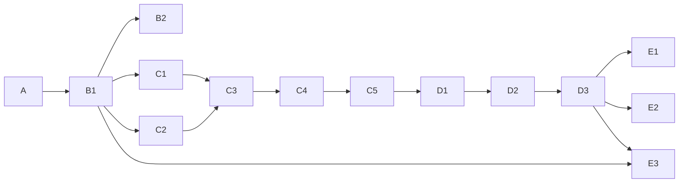

# 구현 계획

## 0. 이 문서가 다루는 것

[[TBL-MS-002]]의 함수 106개를 어떤 순서로 어떤 묶음으로 만들고, 묶음마다 무엇으로 끝났다고 볼지를 정한다. 묶음을 슬라이스라 부른다. 슬라이스 하나는 시나리오 하나 또는 배치 단계 하나가 끝에서 끝까지 도는 단위이고, 카드의 구현 함수 칸이 [[TBL-MS-002]] 항목을 빠짐없이 가리킨다. 함수 하나가 두 슬라이스에 걸리지 않는다.

슬라이스는 열넷이다. A 기반 하나, B 적재·마스터 둘, C 판정 다섯, D 서술 셋, E 열람·관리 셋이다. 순서가 곧 의존이다. 판정 다섯(C1~C5)이 서술 셋(D1~D3)보다 먼저 끝나고, C5가 끝나면 LLM 없이 배치 1~5단계가 돌아 판정이 전부 나온다. 이것이 [[TBL-INFRA-002#C19]]를 구현 순서로 옮긴 것이다. 서술 슬라이스는 그 위에 얹히고, 셋을 전부 빼도 C5까지의 산출물이 그대로 게시되도록 D3가 만든다.

코드 구조는 [[TBL-DOM-005]] 1장 폴더 구조를 그대로 따른다. 호출 방향은 `router → service → crud`, 화면은 `pages → api → 서버` 한 방향이다. 커밋과 PR에 에이전트 표시를 남기지 않는다(공통 규약 1.10). 커밋 메시지의 첫 줄에 슬라이스 ID를 적는다(`B1: 형태 판별과 적재`).

슬라이스마다 "완료"는 카드의 테스트 칸이 전부 통과하고 커밋 범위가 `완료` 행에 적힌 때다. 테스트 칸의 "구현 함수의 테스트 관점 전부"는 [[TBL-MS-002]] 각 항목의 테스트 관점 문단을 그대로 테스트 이름으로 옮긴 것이다.

## 1. 슬라이스

#### A 기반

| 항목 | 내용 |
|---|---|
| 근거 | [[TBL-INFRA-002]] 3·4·5·6장 · [[TBL-DOM-005]] 1장 폴더 구조 · [[TBL-DOM-006]] 전체 |
| 구현 | 저장소 뼈대(`backend/app/{core,domains,infra,shared}`, `frontend/src/{pages,components,api}`) · `.env.example`(이름만, [[TBL-INFRA-002]] 4.1절의 열넷) · Docker Compose 4컨테이너(web·worker·db·proxy) · PostgreSQL 스키마 여섯과 테이블 42개의 alembic 첫 마이그레이션([[TBL-DOM-006]] 2장 그대로. 부분 유일 제약 `c_report(base_date) WHERE is_published`와 3장 인덱스 포함) · 계정 분리(web은 pub 읽기와 raw·std·ops 쓰기, worker는 전 스키마) · VODA 서명 토큰 검증과 관리 세션(`core/auth`) · problem+json 에러 응답([[TBL-API-002]] 2장 열넷) · `PeriodKey` 값 객체와 부호 계산 유틸(`shared/`) · `ports.py`의 `LlmPort`·`BriefingStorePort` 인터페이스 · 금지 이름 회귀 검사(`tools/check_forbidden_names.py`. `score` `grade` `relevance` `rank` `confidence` 계열을 코드·컬럼·응답 스키마에서 찾는다. 예외는 `a_contribution.rank` 한 곳) · 테스트 뼈대(`backend/tests/`가 `app/`을 거울로) |
| 테스트 | 빈 DB에 마이그레이션이 한 번에 올라가고 42 테이블이 생기는지 · 열람 계정으로 `mart`를 읽으면 권한 오류인지 · 잘못된 토큰이 401 problem+json인지 · 금지 이름 검사가 CI에서 도는지 · `judgment/` 아래 파일이 `adapters/hchat_client.py`를 import 하지 않는지(import 검사) |
| 선행 | 없음 |
| 완료 | 저장소 `glovis_intelligence`(로컬, 원격 없음) 커밋 b8dc97b..e652c04 · PR 없음 · 2026-09-29. PostgreSQL 16 컨테이너에서 테스트 14건 통과(테이블 42, 컬럼 502, CHECK 55, FK 22, 인덱스 25). 금지 이름·계층 경계 검사 통과 |

#### B1 적재. 형태 판별·표준화·회귀 검사

| 항목 | 내용 |
|---|---|
| 근거 | [[TBL-SCN-002#S5]] [[TBL-SCN-002#S6]] · [[TBL-UC-002#UC-A1]] [[TBL-UC-002#UC-S10]] · [[TBL-SEQ-002#SEQ-4]] |
| 구현 함수 | [[TBL-MS-002#IngestService.preflight]] · [[TBL-MS-002#IngestService.commit]] · [[TBL-MS-002#IngestService.unblock_regression]] · [[TBL-MS-002#IngestService.list_history]] · [[TBL-MS-002#IngestService.get_file]] · [[TBL-MS-002#FormDetector.detect]] · [[TBL-MS-002#FormDetector.explain_mismatch]] · [[TBL-MS-002#FormALedgerParser.parse]] · [[TBL-MS-002#FormALedgerParser.check_columns]] · [[TBL-MS-002#FormALedgerParser.base_date_range]] · [[TBL-MS-002#FormBPivotParser.parse]] · [[TBL-MS-002#FormBPivotParser.expand_merged_header]] · [[TBL-MS-002#FormBPivotParser.split_period_and_measure]] · [[TBL-MS-002#FormBPivotParser.split_total_rows]] · [[TBL-MS-002#FormBPivotParser.detect_file_base_date]] · [[TBL-MS-002#RecordStandardizer.standardize]] · [[TBL-MS-002#RecordStandardizer.map_country]] · [[TBL-MS-002#RecordStandardizer.build_period_key]] · [[TBL-MS-002#RecordStandardizer.collect_unmapped]] · [[TBL-MS-002#RegressionChecker.check]] · [[TBL-MS-002#RegressionChecker.is_abrupt]] · [[TBL-MS-002#RegressionChecker.abrupt_reasons]] |
| API | [[TBL-API-002#POST/api/admin/ingest/preflight]] [[TBL-API-002#POST/api/admin/ingest/commit]] [[TBL-API-002#POST/api/admin/ingest/unblock/{ingestFileId}]] [[TBL-API-002#GET/api/admin/ingest/history]] [[TBL-API-002#GET/api/admin/ingest/file/{ingestFileId}]] |
| 화면 | [[TBL-UI-002#UI-5]] |
| 테스트 | 구현 함수의 테스트 관점 전부 + S5·S6 E2E. 인입 샘플 6개 파일이 전부 형태 B로 판별되고 같은 파일을 두 번 넣어도 `vehicle_measure` 행수가 같은지. 총계 행이 `is_total_row=true`로 분리되고 상세 행 합과의 차이가 경고로만 나가는지(판매 샘플 선적 679,551 대 총계 1,710,715). 결측 `-`가 NULL인지. 수동 급변이 적재는 완료하고 `auto_run_blocked`만 세우는지 |
| 선행 | A |
| 완료 | 커밋 a9f030e · PR 없음 · 2026-09-29. 함수 22개, API 5, UI-5. PostgreSQL 16 컨테이너에서 36건 통과. 픽스처는 인입 샘플 엑셀(판매진도율·생산진도율·재고현황·현대차 데이터_0910 원장·뉴스·Marklines)에서 뽑았다. 실측 확인: 전체 시트에서는 총계 행 = 상세 행 합(1,710,715), 미주만 남긴 추출본에서만 어긋난다 |

#### B2 마스터·크로스워크

| 항목 | 내용 |
|---|---|
| 근거 | [[TBL-SCN-002#S8]] · [[TBL-UC-002#UC-A2]] · [[TBL-SEQ-002#SEQ-13]] |
| 구현 함수 | [[TBL-MS-002#MasterService.get_summary]] · [[TBL-MS-002#MasterService.list_unmapped]] · [[TBL-MS-002#MasterService.upload_crosswalk]] · [[TBL-MS-002#MasterService.confirm_crosswalk]] |
| API | [[TBL-API-002#GET/api/admin/master/summary]] [[TBL-API-002#GET/api/admin/master/unmapped]] [[TBL-API-002#POST/api/admin/master/crosswalk]] [[TBL-API-002#POST/api/admin/master/confirm/{crosswalkUploadId}]] |
| 화면 | [[TBL-UI-002#UI-7]] |
| 테스트 | 구현 함수의 테스트 관점 전부 + S8 E2E. 한 줄 빠진 크로스워크를 올리면 삭제 목록에 그 국가가 나오고 확인 없이는 409인지. 같은 값이 두 국가로 갈리면 400인지. 확정 뒤 이미 게시된 리포트 수치가 그대로인지. 법인 매핑이 비어 있어도 오류가 아니라 미매핑인지 |
| 선행 | B1 |
| 완료 | 커밋 a976125 · PR 없음 · 2026-09-29. 함수 4, API 4, UI-7. 크로스워크 엑셀은 시트 이름이 종류이고 올린 시트만 통째 교체. PostgreSQL 16 컨테이너에서 40건 통과(전체) |

#### C1 A 판정 읽기와 브리핑 저장소 어댑터 (2단계)

| 항목 | 내용 |
|---|---|
| 근거 | [[TBL-SCN-002#S4]] 2 · [[TBL-UC-002#UC-S2]] · [[TBL-SEQ-002#SEQ-5]] · [[TBL-INFRA-002#C5]] |
| 구현 함수 | [[TBL-MS-002#BriefingStoreReader.read_judgments]] · [[TBL-MS-002#BriefingStoreReader.read_contributions]] · [[TBL-MS-002#BriefingStoreReader.read_report_document]] · [[TBL-MS-002#BriefingStoreReader.snapshot_id]] · [[TBL-MS-002#BriefingStoreReader.ping]] · [[TBL-MS-002#AJudgmentReader.read]] · [[TBL-MS-002#AJudgmentReader.copy_snapshot]] · [[TBL-MS-002#AJudgmentReader.validate_shape]] · [[TBL-MS-002#AJudgmentReader.fallback_to_supplementary]] |
| API | 없음(배치 안). `ping`은 E3의 [[TBL-API-002#GET/api/admin/batch/status]]가 다시 쓴다 |
| 화면 | 없음 |
| 테스트 | 구현 함수의 테스트 관점 전부. 저장소를 막아 놓고 돌려도 `read`가 예외 없이 보완 집계로 내려가는지. `BriefingStoreReader`에 쓰기 계열 메서드가 없는지(코드 검사). 읽어 온 값이 `a_judgment.current_value`에 소수점까지 같은지. A1 보완 집계가 `axis_type=plant`로만 나오는지. 스냅샷 키·필드는 미결이라 검증 목록은 가짜 payload로 둔다 |
| 선행 | B1 |
| 완료 | 커밋 d42cd82 · PR 없음 · 2026-09-29. 함수 9. 브리핑 저장소 모양은 가정(briefing.report_snapshot·judgment·contribution, QUERIES 한 곳). PostgreSQL 16 컨테이너에서 46건 통과(전체) |

#### C2 사건 묶음 (3단계)

| 항목 | 내용 |
|---|---|
| 근거 | [[TBL-SCN-002#S4]] 3 · [[TBL-UC-002#UC-S3]] · [[TBL-SEQ-002#SEQ-6]] |
| 구현 함수 | [[TBL-MS-002#EventClusterer.cluster]] · [[TBL-MS-002#EventClusterer.count_sources]] · [[TBL-MS-002#EventClusterer.pick_representative]] · [[TBL-MS-002#EventClusterer.max_impact]] · [[TBL-MS-002#EventClusterer.close_expired]] |
| API | 없음 |
| 화면 | 없음 |
| 테스트 | 구현 함수의 테스트 관점 전부. 호르무즈 기사가 사건 소수로 묶이고 `strait_country`로 오만·아랍에미리트에 귀속되는지. 같은 매체 기사 10건이면 출처 수 1인지. 같은 기사 집합을 두 번 돌려 같은 사건 구성과 같은 대표 기사가 나오는지. 이 슬라이스에 `HChatClient` import가 없는지 |
| 선행 | B1 |
| 완료 | 커밋 df5807b · PR 없음 · 2026-09-30. 함수 5. 묶음 열쇠는 (국가 또는 해협, 카테고리)이고 해협은 `master.strait.keywords`로 찾아 인접국을 `article_country`에 `straitAttributed`로 보탠다. 해협이 아니면 `countryDirect` 국가 중 사전순 첫 국가가 열쇠다(기사 하나는 사건 하나). 시간창은 기사 날짜 기준. 뉴스 샘플 40건에서 호르무즈 37건이 사건 1개로 묶이고 OMN·ARE 귀속 74건. PostgreSQL 16 컨테이너에서 53건 통과(전체) |

#### C3 결합·단계별 흐름·변동 판정 (4단계)

| 항목 | 내용 |
|---|---|
| 근거 | [[TBL-SCN-002#S4]] 4 · [[TBL-SCN-002#S1]] 실측 수치 · [[TBL-UC-002#UC-S4]] · [[TBL-SEQ-002#SEQ-7]] · [[TBL-INFRA-002#C16]] [[TBL-INFRA-002#C17]] |
| 구현 함수 | [[TBL-MS-002#MarketService.as_of]] · [[TBL-MS-002#MarketService.is_carried_over]] · [[TBL-MS-002#FactJoiner.join]] · [[TBL-MS-002#FactJoiner.resolve_exposure]] · [[TBL-MS-002#FactJoiner.attach_market_asof]] · [[TBL-MS-002#FactJoiner.count_events]] · [[TBL-MS-002#StageFlowCalculator.calculate]] · [[TBL-MS-002#StageFlowCalculator.entity_stage_gap]] · [[TBL-MS-002#StageFlowCalculator.dealer_stage_gap]] · [[TBL-MS-002#StageFlowCalculator.gap_rate]] · [[TBL-MS-002#StageFlowCalculator.alternative_diff]] · [[TBL-MS-002#AnomalyDetector.detect]] · [[TBL-MS-002#AnomalyDetector.from_a_judgment]] · [[TBL-MS-002#AnomalyDetector.from_stage_flow]] · [[TBL-MS-002#AnomalyDetector.from_supplementary]] · [[TBL-MS-002#AnomalyDetector.progress_rate]] |
| API | 없음 |
| 화면 | 없음 |
| 테스트 | 구현 함수의 테스트 관점 전부. 실측 회귀 고정값: 미주 누계 상세 행 합 선적 679,551 · 도매(공식) 677,201 · 소매 643,097에서 `entity_stage_gap=2,350` `dealer_stage_gap=34,104` 비율 0.050 · 실 도매 664,269와의 차이 12,932 · 칠레 0.252, 페루 0.212, 푸에르토리코 -0.137, 콜롬비아 -0.105, 캐나다 법인 구간 0.083 · 생산 달성률 1,739,722 ÷ 2,020,531 = 0.861 · 2025년 11월 세부 차종 셋(팰리세이드 LX2 2,282→0, 넥쏘 FE 111→0, 니로 DE PBV 1→0)이 변동으로 잡히지 않고 팰리세이드 그룹 20,967→55,291이 급증으로 잡히는지 · 생산 행이 `country_period_fact`에 0건인지 |
| 선행 | C1 · C2 |
| 완료 | 아직 없음 |

#### C4 후보 검색·근접도·신호등 (5단계)

| 항목 | 내용 |
|---|---|
| 근거 | [[TBL-SCN-002#S4]] 5 · [[TBL-SCN-002#S3]] · [[TBL-UC-002#UC-S5]] · [[TBL-SEQ-002#SEQ-8]] · [[TBL-INFRA-002#C19]] · [[TBL-PRD-002#R10]] [[TBL-PRD-002#R16]] |
| 구현 함수 | [[TBL-MS-002#CandidateSearcher.search]] · [[TBL-MS-002#CandidateSearcher.search_events]] · [[TBL-MS-002#CandidateSearcher.search_market]] · [[TBL-MS-002#CandidateSearcher.search_cross_domain]] · [[TBL-MS-002#CandidateSearcher.resolve_country_match]] · [[TBL-MS-002#CandidateSearcher.apply_limit]] · [[TBL-MS-002#ProximityCalculator.calculate]] · [[TBL-MS-002#ProximityCalculator.day_diff]] · [[TBL-MS-002#ProximityCalculator.sort]] · [[TBL-MS-002#ProximityCalculator.sort_rule_text]] · [[TBL-MS-002#TrafficLightJudge.judge]] · [[TBL-MS-002#TrafficLightJudge.build_domain_status]] · [[TBL-MS-002#TrafficLightJudge.build_watch_items]] · [[TBL-MS-002#TrafficLightJudge.basis]] |
| API | 없음 |
| 화면 | 없음 |
| 테스트 | 구현 함수의 테스트 관점 전부. 정렬 열쇠 넷(앞의 셋이 모두 같은 후보 다섯을 열 번 섞어 넣어도 `sort_order`가 같은지). 반환 필드 이름에 금지 이름이 없는지. `axis_type=plant` 변동의 후보가 0건이고 신호등이 `notApplicable`인지. 생산 도메인 상태가 `notApplicable`이고 `none`이 아닌지. 노출 미확인 국가가 `red`로 올라가지 않는지. 이 슬라이스 전체에 `HChatClient` import가 없는지. 임계값 실제 수치는 미결이라 설정 행을 가짜로 둔다 |
| 선행 | C3 |
| 완료 | 아직 없음 |

#### C5 배치 뼈대와 회귀 대조 (1~5단계 연결)

| 항목 | 내용 |
|---|---|
| 근거 | [[TBL-SCN-002#S4]] · [[TBL-UC-002#UC-S1]] · [[TBL-SEQ-002#SEQ-3]] · [[TBL-INFRA-002#C19]] [[TBL-INFRA-002#C20]] |
| 구현 함수 | [[TBL-MS-002#PipelineRunner.run]] · [[TBL-MS-002#PipelineRunner.stage_names]] · 스케줄러 기동(APScheduler 02:00, worker 단일 락) |
| API | 없음(E3가 부른다) |
| 화면 | 없음 |
| 테스트 | 구현 함수의 테스트 관점 전부 + S4 판정 구간 E2E. 1·3·4·5단계 실패에서 멈추고 `batch_stage_result`가 여덟 행(미실행 `pending`)인지. 2단계 실패는 계속되는지. `auto_run_blocked`가 서 있으면 시작을 거부하는지. 이 시점에는 6~8단계가 `skipped`로만 남고 게시는 D3가 붙기 전까지 비활성이다. `llm_enabled=False` 대조 시험의 뼈대(같은 기준일 두 번, `watch_item.traffic_light`와 `cause_candidate.sort_order` 전건 대조)를 여기서 만든다 |
| 선행 | C4 |
| 완료 | 아직 없음 |

#### D1 H-chat 어댑터·강등·사건 명명 (6단계, LLM 역할 1)

| 항목 | 내용 |
|---|---|
| 근거 | [[TBL-SCN-002#S4]] 6 · [[TBL-UC-002#UC-S6]] [[TBL-UC-002#UC-S11]] · [[TBL-SEQ-002#SEQ-9]] · [[TBL-INFRA-002#C2]] [[TBL-INFRA-002#C3]] [[TBL-INFRA-002#C13]] |
| 구현 함수 | [[TBL-MS-002#HChatClient.complete]] · [[TBL-MS-002#HChatClient.remaining_tokens]] · [[TBL-MS-002#DegradeHandler.degrade]] · [[TBL-MS-002#DegradeHandler.degraded_roles]] · [[TBL-MS-002#EventNamer.name_events]] · [[TBL-MS-002#EventNamer.fallback_to_representative]] |
| API | 없음 |
| 화면 | 없음 |
| 테스트 | 구현 함수의 테스트 관점 전부. 게이트웨이를 막아도 배치가 8단계까지 가는지. 로그와 DB에 키 문자열이 없는지. 명명 실패 사건의 제목이 대표 기사 제목이고 `named_by=representativeArticle`인지. 이 단계를 통째로 막아도 C4의 신호등과 후보 순서가 그대로인지. 개발 환경은 OpenAI 호환 서버, 폐쇄망은 H-chat을 `LLM_BASE_URL`만으로 가리키는지 |
| 선행 | C5 |
| 완료 | 아직 없음 |

#### D2 연관 설명과 인용 검증 (7단계, LLM 역할 2)

| 항목 | 내용 |
|---|---|
| 근거 | [[TBL-SCN-002#S4]] 7 · [[TBL-SCN-002#S3]] · [[TBL-UC-002#UC-S7]] · [[TBL-SEQ-002#SEQ-10]] · [[TBL-PRD-002#R11]] [[TBL-PRD-002#R22]] |
| 구현 함수 | [[TBL-MS-002#CauseLinkWriter.write]] · [[TBL-MS-002#CauseLinkWriter.extract_citations]] · [[TBL-MS-002#CitationVerifier.verify_cause_link]] · [[TBL-MS-002#CitationVerifier.out_of_scope_ids]] · [[TBL-MS-002#CitationVerifier.has_forbidden_words]] |
| API | 없음 |
| 화면 | 없음 |
| 테스트 | 구현 함수의 테스트 관점 전부. 없는 후보 식별자를 심은 응답이 거짓으로 떨어지고 1회 재요청 뒤 강등되는지. 응답 스키마에 등급·점수·순위 필드가 없는지. 같은 변동에 설명이 둘 생기지 않는지(`cause_link` 기본키). 강등된 변동에서도 후보와 근접도 값 넷이 남는지 |
| 선행 | D1 |
| 완료 | 아직 없음 |

#### D3 문장 생성·검증·게시 (8단계, LLM 역할 3)

| 항목 | 내용 |
|---|---|
| 근거 | [[TBL-SCN-002#S4]] 8 · [[TBL-SCN-002#S9]] · [[TBL-UC-002#UC-S8]] [[TBL-UC-002#UC-S9]] [[TBL-UC-002#UC-S11]] · [[TBL-SEQ-002#SEQ-11]] [[TBL-SEQ-002#SEQ-14]] · [[TBL-INFRA-002#C10]] [[TBL-INFRA-002#C13]] |
| 구현 함수 | [[TBL-MS-002#ClaimWriter.write_headline]] · [[TBL-MS-002#ClaimWriter.write_domain_status]] · [[TBL-MS-002#ClaimWriter.write_card]] · [[TBL-MS-002#CitationVerifier.verify_claim]] · [[TBL-MS-002#DegradeHandler.fill_template]] · [[TBL-MS-002#ReportPublisher.number_evidence]] · [[TBL-MS-002#ReportPublisher.copy_display_values]] · [[TBL-MS-002#ReportPublisher.publish]] · [[TBL-MS-002#ReportPublisher.publish_a_report]] · [[TBL-MS-002#ReportPublisher.diff_watchlist]] |
| API | 없음(게시 결과를 E1·E2가 읽는다) |
| 화면 | 없음 |
| 테스트 | 구현 함수의 테스트 관점 전부 + S4 전체 E2E + S9. `number_evidence`가 `complete`보다 먼저 도는지. 서술 셋이 전부 강등돼도 게시되고 신호등·도메인 상태·후보 순서가 5단계 산출물과 전건 같은지. 생산 문장에 외부 원인 인용이 0건인지. 같은 기준일에 `is_published=true`가 하나인지. `notices` 코드가 다섯 밖으로 나가지 않는지. A 리포트 사본의 요약·해설 글자가 원본과 같은지. `alert_event`가 두 번 돌아도 한 행인지. 백필 모드면 게시본이 생기지 않는지. 여기서 C5의 `llm_enabled=False` 대조 시험을 완성한다 |
| 선행 | D2 |
| 완료 | 아직 없음 |

#### E1 C 리포트 열람

| 항목 | 내용 |
|---|---|
| 근거 | [[TBL-SCN-002#S2]] [[TBL-SCN-002#S3]] · [[TBL-UC-002#UC-H2]] [[TBL-UC-002#UC-H3]] · [[TBL-SEQ-002#SEQ-1]] · [[TBL-INFRA-002#C9]] [[TBL-INFRA-002#C10]] · [[TBL-PRD-002#N5]] |
| 구현 함수 | [[TBL-MS-002#CReportService.get_latest]] · [[TBL-MS-002#CReportService.get_by_id]] · [[TBL-MS-002#MarketService.get_series]] · `frontend/src/pages/CReportPage.tsx`와 `api/creport.ts` |
| API | [[TBL-API-002#GET/api/intel/creport/latest]] [[TBL-API-002#GET/api/intel/creport/version/{reportId}]] [[TBL-API-002#GET/api/intel/market/series/{indicatorId}]] |
| 화면 | [[TBL-UI-002#UI-1]] (E1~E6 예외 상태와 근거 패널 포함) |
| 테스트 | 구현 함수의 테스트 관점 전부 + S2·S3 E2E. p95 2초. 응답 생성 중 `mart`·`std` 조회와 H-chat 호출이 0회인지. 근거 펼치기가 추가 호출 없이 열리는지. 현업 토큰으로 미게시본을 부르면 404인지. 예외 상태 여섯이 각각 다른 안내로 그려지는지. 화면이 `styles.css` 토큰만 쓰고 값을 직접 적지 않는지. 제품 화면에 이모지가 없는지 |
| 선행 | D3 |
| 완료 | 아직 없음 |

#### E2 A 리포트 열람

| 항목 | 내용 |
|---|---|
| 근거 | [[TBL-SCN-002#S1]] · [[TBL-UC-002#UC-H1]] · [[TBL-SEQ-002#SEQ-2]] · [[TBL-PRD-002#R1]] [[TBL-PRD-002#R2]] |
| 구현 함수 | [[TBL-MS-002#DomainReportService.get_latest_by_domain]] · [[TBL-MS-002#DomainReportService.get_by_id]] · [[TBL-MS-002#DomainReportService.list_versions]] · [[TBL-MS-002#DomainReportService.build_domain_extra]] · [[TBL-MS-002#DomainReportService.list_missing_metrics]] · `pages/AReportPage.tsx`(도메인 셋 공용)와 `api/areport.ts` |
| API | [[TBL-API-002#GET/api/intel/areport/domain/{domain}]] [[TBL-API-002#GET/api/intel/areport/version/{domainReportId}]] |
| 화면 | [[TBL-UI-002#UI-2]] [[TBL-UI-002#UI-3]] [[TBL-UI-002#UI-4]] |
| 테스트 | 구현 함수의 테스트 관점 전부 + S1 E2E. 응답 JSON에 기사·시장지표 계열 키가 0건인지. C 리포트로 가는 링크 필드가 없는지. 못 만드는 지표가 A1 둘·A2 넷·A3 하나인지. 사본이 없을 때 404가 아니라 문장 미수신으로 내려가는지(판정값 위치는 미결). 버전 목록 번호가 `published_version` 그대로인지 |
| 선행 | D3 |
| 완료 | 아직 없음 |

#### E3 배치 관리·재실행·게시 전환

| 항목 | 내용 |
|---|---|
| 근거 | [[TBL-SCN-002#S7]] [[TBL-SCN-002#S9]] · [[TBL-UC-002#UC-A3]] · [[TBL-SEQ-002#SEQ-12]] · [[TBL-PRD-002#R18]] [[TBL-PRD-002#N3]] |
| 구현 함수 | [[TBL-MS-002#BatchService.get_status]] · [[TBL-MS-002#BatchService.list_runs]] · [[TBL-MS-002#BatchService.get_run]] · [[TBL-MS-002#BatchService.request_rerun]] · [[TBL-MS-002#BatchService.publish_version]] · `pages/BatchPage.tsx`와 `api/batch.ts` |
| API | [[TBL-API-002#GET/api/admin/batch/status]] [[TBL-API-002#GET/api/admin/batch/history]] [[TBL-API-002#GET/api/admin/batch/run/{batchRunId}]] [[TBL-API-002#POST/api/admin/batch/rerun]] [[TBL-API-002#POST/api/admin/batch/publish/{reportId}]] |
| 화면 | [[TBL-UI-002#UI-6]] |
| 테스트 | 구현 함수의 테스트 관점 전부 + S7 E2E. 시작 단계 1(재생성)과 6(서술만)이 같은 호출로 갈리는지. 재실행 결과의 변동·후보·근접도·신호등이 당시와 전건 같고 설명·문장만 달라지는지. 게시 전환이 기존 게시본을 지우지 않고 `alert_event`를 다시 계산하는지. `briefingStore.reachable`이 응답에 있는지. 단계 이름 여덟이 `stage_names()`와 글자까지 같은지 |
| 선행 | D3 · B1 |
| 완료 | 아직 없음 |

### 1.1 순서

C5가 끝난 시점이 첫 번째 확인 지점이다. LLM 없이 새벽 배치가 1~5단계를 돌고 `mart`에 변동·후보·근접도·신호등·도메인 상태가 생긴다. 발주자에게 판정 결과를 먼저 보여 줄 수 있는 것이 이 시점이고, 임계값 실제 수치를 현업과 맞추는 것도 이 시점에 한다. D3가 끝난 시점이 두 번째 확인 지점이다. 게시본이 생기고 E1이 그것을 읽는다.

E3의 선행이 D3와 B1 둘인 이유는 배치 상태 화면이 적재 차단([[TBL-DOM-006#ingest_file]]의 `auto_run_blocked`)과 게시본([[TBL-DOM-006#c_report]]) 둘 다를 보기 때문이다.

## 2. 통합 테스트

슬라이스 단위 테스트와 별개로 시나리오 하나가 끝에서 끝까지 도는지를 본다. 실데이터 불변식은 인입 샘플 실측값으로 고정한다([[TBL-RFQ-002]] 4.2절).

| 시나리오 | 슬라이스 | 검증하는 것 |
|---|---|---|
| [[TBL-SCN-002#S5]] 완성차 파일 적재 | B1 | 샘플 6개 파일이 전부 형태 B로 판별되고 같은 표준 테이블에 들어간다. 상세 행 합이 원본과 같고 총계 행은 분리돼 대조에만 쓰인다. 수동 급변은 적재 완료 후 자동 실행만 막힌다 |
| [[TBL-SCN-002#S6]] 뉴스·블룸버그·Marklines 적재 | B1 | 가공본과 원본이 같은 `article` 테이블에 들어가고 `source_id`로 중복이 없다. 지표 4종 최신값이 조회된다 |
| [[TBL-SCN-002#S8]] 미매핑 보강 | B2 | 미매핑 30건을 보강해 올리면 차이 표가 추가 30·변경 0·삭제 0이고, 확정 뒤 다음 배치의 매칭률이 오르며 과거 판정은 그대로다 |
| [[TBL-SCN-002#S4]] 새벽 배치, 판정 구간 | C1~C5 | LLM을 끄고 1~5단계를 돌려 변동·후보·근접도·신호등·도메인 상태가 생긴다. 실측 고정값(딜러 구간 34,104 · 법인 구간 2,350 · 칠레 0.252 · 푸에르토리코 -0.137 · 달성률 0.861 · 모델 교체 오탐 0건)이 그대로 나온다 |
| [[TBL-SCN-002#S4]] 새벽 배치, 전체 | C5 · D1~D3 | 8단계가 4시간 창 안에 끝나고 게시본이 생긴다. 같은 기준일을 `llm_enabled=False`로 돌린 결과와 `watch_item.traffic_light`·`cause_candidate.sort_order`·도메인 상태 신호등이 전건 같다. LLM 호출 수가 후보 사건 수 + 변동 수 + 서술 섹션 수를 넘지 않는다 |
| [[TBL-SCN-002#S4]] 변형, LLM 전부 실패 | D1~D3 | 게이트웨이를 막고 돌려도 게시되고 강등 표시가 붙으며 신호등·후보 순서·도메인 상태 신호등이 정상 배치와 같다 |
| [[TBL-SCN-002#S4]] 변형, A 판정 미수신 | C1 · D3 | 브리핑 저장소를 막고 돌리면 세 도메인이 보완 집계로 내려가고 `notices`에 `aJudgmentNotReceived` 셋이 담긴다. 배치는 멈추지 않는다 |
| [[TBL-SCN-002#S2]] 아침 C 리포트 열람 | E1 | p95 2초. `mart`·`std` 조회 0회, H-chat 0회. 예외 상태 여섯이 각각 다른 안내로 보인다. 생산 카드가 판정 대상 아님이다 |
| [[TBL-SCN-002#S3]] 근거 확인 | E1 | 근거 펼치기에 추가 호출이 없다. 후보마다 근접도 값 넷이 그대로 있고 등급 표시가 없다. 정렬 규칙 문장이 앞의 셋만 적는다. 연관 설명의 인용이 전부 후보 안이다 |
| [[TBL-SCN-002#S1]] A 리포트 열람 | E2 | 세 지면의 트래킹 지표와 분해 차원이 서로 다르다. 외부요인 인용 0건, C로 가는 링크 없음. 못 만드는 지표가 A1 둘·A2 넷·A3 하나다 |
| [[TBL-SCN-002#S7]] 특정 일자 재생성 | E3 | 매핑을 바꾼 뒤 재생성하면 새 버전이 `is_published=false`로 생기고, 변동·후보·근접도·신호등 넷의 차이 필드가 표시된다. 게시 전환 뒤 같은 기준일 게시본이 하나다 |
| [[TBL-SCN-002#S9]] 워치리스트 변화 | D3 · E3 | 어제 없던 국가가 `new`, 오른 국가가 `raised`로 `alert_event`에 남고 카드에 배지가 붙는다. 게시 전환에서 다시 돌아도 한 행이다. 채널 어댑터 없이 실패하지 않는다 |

금지 이름 회귀 검사(A)와 `judgment/`의 import 검사(A)는 모든 슬라이스의 커밋 앞에서 돈다.

## 3. 커밋·PR 목록

슬라이스 카드의 `완료` 행에 기록한다. 형식은 `커밋 범위(처음..끝) · PR 번호 · 날짜`이고 커밋 메시지 첫 줄은 슬라이스 ID로 시작한다. 커밋과 PR에 에이전트 표시를 남기지 않는다(공통 규약 1.10). 명세 문서를 코드 저장소에 올리는 커밋도 같은 규칙이다.

## 4. 미결사항

- [ ] 임계값 실제 수치. C4가 끝난 뒤 현업과 맞춘다. 그 전까지 `threshold_setting` 첫 행은 가짜 값이다([[TBL-MS-002#TrafficLightJudge.judge]])
- [ ] A 판정 스냅샷과 A 리포트 문서의 실제 키·필드. C1의 `validate_shape` 대조 목록과 D3의 `publish_a_report` 컬럼 대응이 이것에 매인다([[TBL-MS-002#AJudgmentReader.validate_shape]] [[TBL-MS-002#BriefingStoreReader.read_report_document]])
- [ ] 형태 A 실물 파일. B1의 `check_columns` 대조 목록이 IF 레이아웃 정의로만 검증된다([[TBL-MS-002#FormALedgerParser.check_columns]])
- [ ] H-chat JSON 모드. 지원되지 않으면 D1~D3의 검증 단계가 늘어난다([[TBL-MS-002#HChatClient.complete]])
- [ ] E2에서 사본이 없을 때 판정값과 차트를 `pub` 어디서 읽는가. 판정 사본은 `mart`에만 있다([[TBL-SEQ-002]] 8장). 정해지면 D3와 E2가 같이 바뀐다
- [ ] 설정 변경 경로(SQL 또는 CLI). 정해지면 슬라이스가 하나 는다
- [ ] 현업 피드백([[TBL-PRD-002#R19]])과 상세 화면([[TBL-PRD-002#R28]])의 1차 포함 여부. 포함되면 E 슬라이스가 는다
- [ ] 워치리스트 변화의 발송 채널. 1차는 기록과 배지까지다([[TBL-MS-002#ReportPublisher.diff_watchlist]])
- [ ] 폐쇄망 반입 절차와 주기. A의 이미지 반입 시험은 절차가 정해진 뒤에 한다
